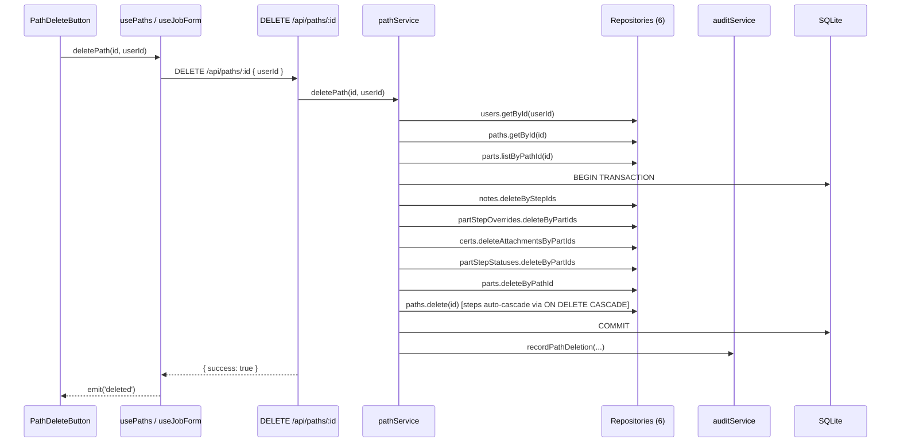

# Design Document: Admin Path Delete

## Overview

This feature transforms the existing path deletion flow from a simple "block if parts exist" guard into a full admin force-delete cascade. It adds three capabilities:

1. **Server-side admin authorization** — The `DELETE /api/paths/:id` route currently has zero auth checks. We add `userId` to the request body, validate the user exists and is an admin, and reject with 403/400 otherwise.
2. **Hard-delete cascade** — When an admin deletes a path that has parts, the service physically removes all dependent records (notes, overrides, cert attachments, step statuses, parts) in FK-safe order within a single SQLite transaction, then deletes the path and its steps.
3. **Audit trail** — A new `path_deleted` audit action records who deleted what, including the list of deleted part IDs and count in metadata.
4. **Frontend UX** — The `PathDeleteButton` component is updated to always be enabled for admins, show a modal confirmation when parts exist (inline confirmation when zero parts), and send `userId` in the request body. The parts browser gains a "Scrapped" status filter option.

The design follows the existing architecture: Components → Composables → API Routes → Services → Repositories → SQLite. All business logic (authorization, cascade ordering, transaction boundary) lives in `pathService`. The API route is a thin HTTP glue layer. Repository interfaces gain new bulk-delete methods.

## Architecture

### Request Flow



### Cascade Delete Order

The deletion order respects foreign key constraints. Child records are deleted before parent records:

```
1. step_notes          (references step_id FK to process_steps)
2. part_step_overrides  (references part_id + step_id FK to process_steps)
3. cert_attachments     (references part_id + step_id FK to process_steps)
4. part_step_statuses   (references part_id + step_id FK to process_steps)
5. parts                (references path_id — no ON DELETE CASCADE)
6. paths.delete(id)     → process_steps auto-cascade via ON DELETE CASCADE
```

Steps 1–5 must complete before step 6 because `cert_attachments`, `part_step_statuses`, and `part_step_overrides` have FK references to `process_steps(id)` WITHOUT `ON DELETE CASCADE`. If those records still exist when the path (and its steps) are deleted, SQLite will raise FK constraint violations. Deleting them first makes the step cascade safe.

All 6 steps happen inside a single `db.transaction()` call for atomicity. The audit entry is recorded after the transaction commits (audit is append-only and should not be rolled back).

### Authorization Model

A new `ForbiddenError` class is added to `server/utils/errors.ts` and mapped to HTTP 403 in `ERROR_STATUS_MAP`. The service layer throws `ForbiddenError` when a non-admin user attempts deletion. This keeps authorization logic in the service layer (not the API route), consistent with the architecture rule that business logic lives in services.

```
Request body: { userId: string }
  → Missing userId → ValidationError (400)
  → User not found → ValidationError (400)
  → User is not admin → ForbiddenError (403)
  → User is admin → proceed with delete
```

## Components and Interfaces

### New Error Class

```typescript
// server/utils/errors.ts — add ForbiddenError
export class ForbiddenError extends Error {
  constructor(message: string) {
    super(message)
    this.name = 'ForbiddenError'
  }
}
```

```typescript
// server/utils/httpError.ts — add to ERROR_STATUS_MAP
{ errorClass: ForbiddenError, statusCode: 403 }
```

### Repository Interface Changes

**NoteRepository** — add one bulk-delete method:
```typescript
deleteByStepIds(stepIds: string[]): number   // deletes notes where step_id is in the set
```

Note: A `deleteByPartIds` method is NOT needed. Since `step_notes.part_ids` is a JSON array, containment checks would be slow and complex. Deleting by `step_id` is sufficient because notes are always scoped to a specific step within the path, and we delete all steps of the path.

**PartStepOverrideRepository** — add:
```typescript
deleteByPartIds(partIds: string[]): number
```

**CertRepository** — add:
```typescript
deleteAttachmentsByPartIds(partIds: string[]): number
```

**PartStepStatusRepository** — add:
```typescript
deleteByPartIds(partIds: string[]): number
```

**PartRepository** — add:
```typescript
deleteByPathId(pathId: string): number
```

All return the count of deleted rows for audit metadata.

### Service Changes

**pathService.deletePath** signature changes:
```typescript
// Before
deletePath(id: string): boolean

// After
deletePath(id: string, userId: string): { deletedPartIds: string[], deletedPartCount: number }
```

The service now requires `userId`, validates admin status, and returns deletion metadata for the API response. The service needs additional repository dependencies injected:

```typescript
export function createPathService(repos: {
  paths: PathRepository
  parts: PartRepository
  users?: UserRepository
  // New dependencies for cascade delete (all required for force-delete):
  notes: NoteRepository
  partStepOverrides: PartStepOverrideRepository
  certs: CertRepository
  partStepStatuses: PartStepStatusRepository
  db: Database  // for transaction wrapper — required, not optional
}) { ... }
```

**auditService** — add `recordPathDeletion`:
```typescript
recordPathDeletion(params: {
  userId: string
  pathId: string
  jobId: string
  metadata: { pathName: string, deletedPartIds: string[], deletedPartCount: number }
}): AuditEntry
```

### AuditAction Type Change

Add `'path_deleted'` to the `AuditAction` union type in `server/types/domain.ts`.

### API Route Changes

**`server/api/paths/[id].delete.ts`** — read `userId` from request body, pass to service:
```typescript
export default defineApiHandler(async (event) => {
  const id = getRouterParam(event, 'id')!
  const body = await readBody(event)
  if (!body?.userId) throw new ValidationError('userId is required')
  const { pathService } = getServices()
  const result = pathService.deletePath(id, body.userId)
  return { success: true, ...result }
})
```

### Frontend Changes

**`usePaths.ts`** — `deletePath` gains a `userId` parameter:
```typescript
async function deletePath(id: string, userId: string): Promise<void> {
  await $fetch(`/api/paths/${id}`, { method: 'DELETE', body: { userId } })
}
```

**`useJobForm.ts`** — `submitEdit` passes `userId` when deleting paths. The composable does not currently have access to user identity, so it needs to call `useUsers().requireUser()` internally:
```typescript
const { requireUser } = useUsers()

for (const path of changes.toDelete) {
  await deletePath(path.id, requireUser().id)
}
```
Since `useUsers()` uses module-level shared state (same pattern as `useOperatorIdentity`), calling it inside `useJobForm` will access the same selected user. The `requireUser()` call will throw if no user is selected, which is the correct behavior — the job edit page should already have a user selected to reach this point.

**`PathDeleteButton.vue`** — major changes:
- Remove `canDelete` computed (always enabled for admins; component is only rendered for admins via parent `v-if="isAdmin"`)
- Add `showModal` ref for modal confirmation when `partCount > 0`
- When `partCount === 0`: use existing inline confirmation flow
- When `partCount > 0`: show `UModal` with warning text and confirm/cancel buttons
- Send `userId` in the DELETE request body via `useUsers().requireUser().id`
- Display part count badge next to delete button when parts > 0

**Parts Browser** — two changes:
1. Add `{ label: 'Scrapped', value: 'scrapped' }` to `statusOptions` in `index.vue`
2. Add `'scrapped'` to `PartBrowserFilters.status` type in `usePartBrowser.ts`
3. Update the status badge in the table to handle `scrapped` status with `error` color

### Service Wiring

`server/utils/services.ts` — pass additional repositories to `createPathService`:
```typescript
const pathService = createPathService({
  paths: repos.paths,
  parts: repos.parts,
  users: repos.users,
  notes: repos.notes,
  partStepOverrides: repos.partStepOverrides,
  certs: repos.certs,
  partStepStatuses: repos.partStepStatuses,
  db: repos._db,
})
```

## Data Models

### Modified Types

**`AuditAction`** (domain.ts) — add `'path_deleted'` to the union:
```typescript
export type AuditAction =
  | 'cert_attached'
  | 'part_created'
  | ... // existing values
  | 'path_deleted'  // NEW
```

**`AuditEntry.metadata`** — already `Record<string, unknown>`, no schema change needed. For `path_deleted` entries, metadata will contain:
```typescript
{
  pathName: string
  deletedPartIds: string[]
  deletedPartCount: number
}
```

**`PartBrowserFilters.status`** — extend type:
```typescript
// Before
status?: 'in-progress' | 'completed' | 'all'

// After
status?: 'in-progress' | 'completed' | 'scrapped' | 'all'
```

### Database Operations (No Schema Migration Needed)

All new operations are DELETE statements against existing tables. No new columns or tables are required. The `step_notes.part_ids` column stores a JSON array of part IDs — the bulk-delete query for notes needs to check JSON containment or delete notes whose `step_id` matches any of the path's step IDs.

**Note deletion strategy**: Since `step_notes.part_ids` is a JSON array and SQLite JSON queries can be slow for containment checks, we delete notes by `step_id IN (...)` only. This is sufficient because notes are always scoped to a specific step within a path, and we're deleting all steps of the path. No `deleteByPartIds` method is needed.

### New API Input Type

```typescript
// server/types/api.ts
export interface DeletePathInput {
  userId: string
}
```


## Correctness Properties

*A property is a characteristic or behavior that should hold true across all valid executions of a system — essentially, a formal statement about what the system should do. Properties serve as the bridge between human-readable specifications and machine-verifiable correctness guarantees.*

### Property 1: Non-admin users are rejected

*For any* ShopUser where `isAdmin` is false, and *for any* existing path, calling `deletePath(pathId, userId)` should throw a `ForbiddenError` and leave the path unchanged in the database.

**Validates: Requirements 1.2**

### Property 2: Cascade delete completeness

*For any* path with zero or more parts (each potentially having step statuses, step overrides, cert attachments, and notes), when an admin user calls `deletePath(pathId, userId)`:
- The path should no longer exist
- No parts with that `pathId` should remain
- No `part_step_statuses` for any of the original part IDs should remain
- No `part_step_overrides` for any of the original part IDs should remain
- No `cert_attachments` for any of the original part IDs should remain
- No `step_notes` referencing any of the original step IDs should remain

**Validates: Requirements 2.1, 2.2, 2.3, 2.4, 2.5, 2.6, 2.7**

### Property 3: Audit entry completeness

*For any* admin path deletion where the path had N parts with IDs `[p1, p2, ..., pN]`, the resulting `path_deleted` audit entry should contain:
- `userId` matching the admin who performed the deletion
- `pathId` matching the deleted path
- `jobId` matching the path's job
- `metadata.pathName` matching the path's name
- `metadata.deletedPartCount` equal to N
- `metadata.deletedPartIds` equal to the set `{p1, p2, ..., pN}`

**Validates: Requirements 3.1, 3.2, 3.3**

### Property 4: Scrapped status filter

*For any* set of `EnrichedPart` objects with mixed statuses (`in-progress`, `completed`, `scrapped`), filtering with `{ status: 'scrapped' }` should return exactly the parts whose status is `'scrapped'`, and no others.

**Validates: Requirements 6.3**

## Error Handling

### Service Layer Errors

| Condition | Error Type | HTTP Status | Message |
|-----------|-----------|-------------|---------|
| Missing `userId` in request body | `ValidationError` | 400 | `userId is required` |
| User not found by ID | `ValidationError` | 400 | `User not found: {userId}` |
| User is not admin | `ForbiddenError` | 403 | `Admin access required to delete paths` |
| Path not found | `NotFoundError` | 404 | `Path not found: {id}` |

### New ForbiddenError

A new `ForbiddenError` class is added to `server/utils/errors.ts` and registered in `ERROR_STATUS_MAP` in `server/utils/httpError.ts` with status code 403. This follows the existing pattern of `ValidationError` → 400 and `NotFoundError` → 404.

### Transaction Failure

If any step in the cascade delete fails (e.g., FK constraint violation due to an unexpected reference), the entire transaction rolls back. The path, parts, and all dependent records remain intact. The error propagates as a 500 Internal Server Error via `defineApiHandler`.

### Frontend Error Handling

- `PathDeleteButton` catches errors from the DELETE request and displays them inline (existing pattern)
- Network errors show a generic "Failed to delete path" message
- 403 errors show "Admin access required to delete paths"
- 404 errors show "Path not found" (race condition — path was deleted by another user)

## Testing Strategy

### Property-Based Tests (fast-check)

Each correctness property maps to a single property-based test file with minimum 100 iterations. The test tag format is: **Feature: admin-path-delete, Property {N}: {title}**.

| Property | Test File | Strategy |
|----------|-----------|----------|
| P1: Non-admin rejection | `tests/properties/adminPathDelete.property.test.ts` | Generate random non-admin users + paths, verify ForbiddenError is thrown and path remains |
| P2: Cascade delete completeness | `tests/properties/adminPathDelete.property.test.ts` | Generate paths with random numbers of parts, each with random dependent records. Execute admin delete. Query all tables to verify zero remaining records for deleted IDs |
| P3: Audit entry completeness | `tests/properties/adminPathDelete.property.test.ts` | Generate paths with random parts, execute admin delete, verify audit entry fields match |
| P4: Scrapped status filter | `tests/properties/adminPathDelete.property.test.ts` | Generate random arrays of EnrichedPart with mixed statuses, apply filterParts with `{ status: 'scrapped' }`, verify only scrapped parts returned |

All property tests use integration-style setup with a temp SQLite database (same pattern as existing `tests/integration/helpers.ts`). Property 4 is a pure function test against `filterParts` from `usePartBrowser.ts`.

### Unit Tests

Unit tests cover specific examples and edge cases:

- **Missing userId** — DELETE request with no body returns 400
- **Non-existent user** — DELETE request with invalid userId returns 400
- **Non-existent path** — DELETE request for missing path returns 404
- **Zero-part path deletion** — existing behavior preserved (path + steps deleted, no cascade needed)
- **ForbiddenError HTTP mapping** — verify `httpError()` maps `ForbiddenError` to 403 with correct statusMessage

### Integration Tests

Integration tests verify the full cascade in a real SQLite database:

- **Full cascade with parts** — create path with parts, notes, overrides, cert attachments, step statuses → admin delete → verify all records gone
- **Audit entry recorded** — verify audit entry exists with correct metadata after cascade delete
- **Transaction atomicity** — verify that if the path delete itself fails, all dependent records are still intact (rollback)

### Test Configuration

- Property-based testing library: `fast-check` (already in project dependencies)
- Minimum iterations: 100 per property
- Each property test must reference its design document property via comment tag
- Tag format: `// Feature: admin-path-delete, Property N: {title}`
