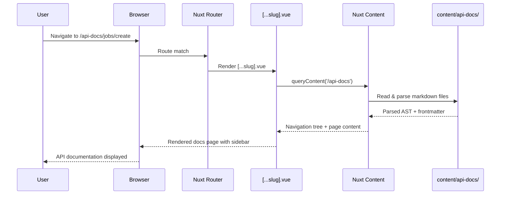
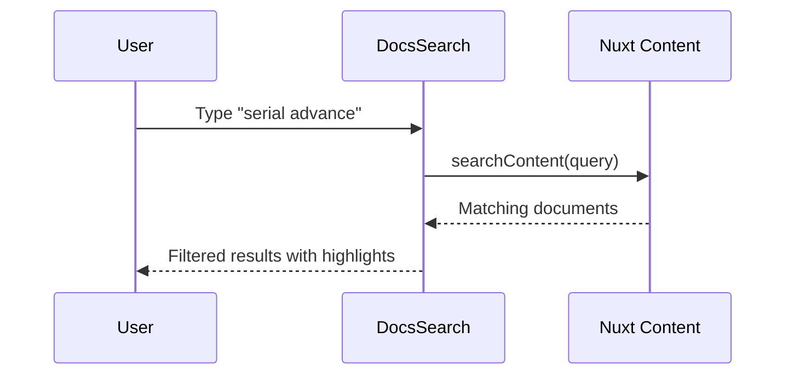

# Design Document: API Documentation CMS

## Overview

Shop Planr needs an integrated API documentation site that catalogs all 52+ REST endpoints across 14 route prefixes. The CMS will be built using Nuxt Content v3, which provides a file-based content system with Markdown/MDC support, auto-generated navigation, and full-text search — all within the existing Nuxt 4 app.

API documentation will be authored as Markdown files in a `content/` directory, organized by service domain (jobs, serials, paths, etc.). Each endpoint gets its own `.md` file with frontmatter metadata (method, path, auth, request/response schemas). Nuxt Content renders these into browsable pages under an `/api-docs` route prefix, with a sidebar navigation tree, search, and syntax-highlighted code examples.

This approach keeps documentation co-located with the codebase, version-controlled alongside the API routes, and automatically deployed with the app — no external documentation hosting needed.

## Architecture

```mermaid
graph TD
    subgraph "Nuxt 4 App"
        subgraph "Existing App"
            AppVue[app.vue]
            Pages[app/pages/*]
            API[server/api/*]
        end

        subgraph "API Docs CMS"
            Content[content/api-docs/**/*.md]
            DocsLayout[app/layouts/docs.vue]
            DocsPages[app/pages/api-docs/[...slug].vue]
            DocsSidebar[app/components/docs/DocsSidebar.vue]
            DocsSearch[app/components/docs/DocsSearch.vue]
            EndpointCard[app/components/docs/EndpointCard.vue]
        end

        NuxtContent["@nuxt/content module"]
        SidebarDocsLink["Sidebar: API Docs button (default layout footer)"]
    end

    Content -->|parsed by| NuxtContent
    NuxtContent -->|renders into| DocsPages
    DocsPages -->|uses| DocsLayout
    DocsLayout -->|contains| DocsSidebar
    DocsLayout -->|contains| DocsSearch
    DocsPages -->|uses| EndpointCard
    AppVue -->|routes to| DocsPages
    SidebarDocsLink -->|opens in new tab| DocsPages
```

## Sequence Diagrams

### Page Load: Browsing API Docs



### Search Flow



## Components and Interfaces

### Component 1: Docs Layout (`app/layouts/docs.vue`)

**Purpose**: Provides the documentation-specific layout with sidebar navigation, search bar, and content area — separate from the main app's dashboard layout.

**Interface**:
```typescript
// Layout props (implicit via Nuxt layout system)
// Activated by pages via: definePageMeta({ layout: 'docs' })
```

**Responsibilities**:
- Render sidebar navigation tree from content directory structure
- Provide search input that filters across all doc pages
- Display breadcrumb trail based on current slug
- Responsive: collapsible sidebar on mobile

### Component 2: Docs Catch-All Page (`app/pages/api-docs/[...slug].vue`)

**Purpose**: Renders any documentation page based on the URL slug, using Nuxt Content's `<ContentDoc>` component.

**Interface**:
```typescript
// Route: /api-docs/:slug*
// Examples:
//   /api-docs           → content/api-docs/index.md (overview)
//   /api-docs/jobs      → content/api-docs/jobs/index.md
//   /api-docs/jobs/create → content/api-docs/jobs/create.md

definePageMeta({ layout: 'docs' })
```

**Responsibilities**:
- Resolve slug to content file path
- Render markdown content via `<ContentDoc>`
- Display prev/next navigation links
- Show table of contents from headings

### Component 3: Endpoint Card (`app/components/docs/EndpointCard.vue`)

**Purpose**: MDC (Markdown Components) component used inside `.md` files to render a styled API endpoint block with method badge, path, description, and collapsible request/response sections.

**Interface**:
```typescript
interface EndpointCardProps {
  method: 'GET' | 'POST' | 'PUT' | 'PATCH' | 'DELETE'
  path: string
  description?: string
}
// Usage in markdown (MDC syntax):
// ::endpoint-card{method="POST" path="/api/jobs"}
// Request body and response docs here
// ::
```

**Responsibilities**:
- Render color-coded method badge (GET=green, POST=blue, PUT=amber, DELETE=red, PATCH=purple)
- Display endpoint path with monospace font
- Wrap child content (request/response docs) in collapsible sections

### Component 4: Docs Sidebar (`app/components/docs/DocsSidebar.vue`)

**Purpose**: Renders the navigation tree for the documentation, auto-generated from the content directory structure.

**Interface**:
```typescript
interface DocsSidebarProps {
  navigation: ContentNavigationItem[]
  currentPath: string
}
```

**Responsibilities**:
- Render nested navigation tree with expand/collapse
- Highlight current page
- Show endpoint method badges next to endpoint pages
- Group by service domain (Jobs, Serials, Paths, etc.)

### Component 5: Docs Search (`app/components/docs/DocsSearch.vue`)

**Purpose**: Full-text search across all documentation content using Nuxt Content's built-in search.

**Interface**:
```typescript
// No props — self-contained search component
// Uses Nuxt Content's searchContent() composable
```

**Responsibilities**:
- Debounced search input
- Display results with title, path, and content snippet
- Navigate to selected result

### Component 6: Sidebar API Docs Button (in `app/layouts/default.vue`)

**Purpose**: Entry point from the main app into the API documentation CMS. Renders as a button in the sidebar footer of the default layout, opening the docs in a new browser tab.

**Location**: Added to the `#footer` template slot of `UDashboardSidebar` in `app/layouts/default.vue`, alongside the existing collapse and color mode buttons.

**Interface**:
```typescript
// No separate component file — inline in default.vue sidebar footer
// Uses NuxtLink or <a> with target="_blank" to open /api-docs in a new tab
```

**Implementation**:
```vue
<!-- Added to #footer template in app/layouts/default.vue -->
<template #footer>
  <div class="flex flex-col gap-2">
    <NuxtLink
      to="/api-docs"
      target="_blank"
      class="flex items-center gap-2 px-2 py-1.5 text-sm text-muted hover:text-highlighted rounded-md hover:bg-elevated transition-colors"
    >
      <UIcon name="i-lucide-book-open" class="size-4" />
      <span>API Docs</span>
      <UIcon name="i-lucide-external-link" class="size-3 ml-auto opacity-50" />
    </NuxtLink>
    <div class="flex items-center justify-between">
      <UDashboardSidebarCollapse />
      <UColorModeButton size="xs" />
    </div>
  </div>
</template>
```

**Responsibilities**:
- Render an "API Docs" link with a book icon and external-link indicator in the sidebar footer
- Open `/api-docs` in a new browser tab via `target="_blank"`
- Visually consistent with the existing sidebar styling (muted text, hover states)
- Respects sidebar collapsed state (icon-only when collapsed)

## Data Models

### Content Frontmatter Schema

Each endpoint markdown file uses this frontmatter structure:

```typescript
interface EndpointFrontmatter {
  title: string                    // "Create Job"
  description: string              // Brief description
  method: 'GET' | 'POST' | 'PUT' | 'PATCH' | 'DELETE'
  path: string                     // "/api/jobs"
  service: string                  // "jobService"
  category: string                 // "Jobs", "Serials", "Paths", etc.
  requestBody?: string             // TypeScript interface name, e.g. "CreateJobInput"
  responseType?: string            // TypeScript interface name, e.g. "Job"
  errorCodes?: number[]            // [400, 404]
  navigation:
    order: number                  // Sort order within category
}
```

### Category Index Frontmatter

Each service domain has an `index.md` with:

```typescript
interface CategoryFrontmatter {
  title: string                    // "Jobs API"
  description: string              // Category overview
  icon: string                     // Lucide icon name
  navigation:
    order: number                  // Sort order in sidebar
}
```

### Content Directory Structure

```
content/
  api-docs/
    index.md                       # API overview, getting started
    jobs/
      index.md                     # Jobs API overview
      list.md                      # GET /api/jobs
      get.md                       # GET /api/jobs/:id
      create.md                    # POST /api/jobs
      update.md                    # PUT /api/jobs/:id
    paths/
      index.md                     # Paths API overview
      get.md                       # GET /api/paths/:id
      create.md                    # POST /api/paths
      update.md                    # PUT /api/paths/:id
      delete.md                    # DELETE /api/paths/:id
      advancement-mode.md          # PATCH /api/paths/:id/advancement-mode
    serials/
      index.md                     # Serials API overview
      list.md                      # GET /api/serials
      get.md                       # GET /api/serials/:id
      create.md                    # POST /api/serials (batch)
      advance.md                   # POST /api/serials/:id/advance
      advance-to.md                # POST /api/serials/:id/advance-to
      scrap.md                     # POST /api/serials/:id/scrap
      force-complete.md            # POST /api/serials/:id/force-complete
      attach-cert.md               # POST /api/serials/:id/attach-cert
      cert-attachments.md          # GET /api/serials/:id/cert-attachments
      step-statuses.md             # GET /api/serials/:id/step-statuses
      overrides.md                 # GET & POST /api/serials/:id/overrides
    certs/
      index.md
      list.md                      # GET /api/certs
      get.md                       # GET /api/certs/:id
      create.md                    # POST /api/certs
      batch-attach.md              # POST /api/certs/batch-attach
      attachments.md               # GET /api/certs/:id/attachments
    templates/
      index.md
      list.md                      # GET /api/templates
      get.md                       # GET /api/templates/:id
      create.md                    # POST /api/templates
      update.md                    # PUT /api/templates/:id
      delete.md                    # DELETE /api/templates/:id
      apply.md                     # POST /api/templates/:id/apply
    bom/
      index.md
      list.md                      # GET /api/bom
      get.md                       # GET /api/bom/:id
      create.md                    # POST /api/bom
      update.md                    # PUT /api/bom/:id
      edit.md                      # POST /api/bom/:id/edit
      versions.md                  # GET /api/bom/:id/versions
    audit/
      index.md
      list.md                      # GET /api/audit
      serial.md                    # GET /api/audit/serial/:id
    jira/
      index.md
      tickets.md                   # GET /api/jira/tickets
      ticket-detail.md             # GET /api/jira/tickets/:key
      link.md                      # POST /api/jira/link
      push.md                      # POST /api/jira/push
      comment.md                   # POST /api/jira/comment
    settings/
      index.md
      get.md                       # GET /api/settings
      update.md                    # PUT /api/settings
    users/
      index.md
      list.md                      # GET /api/users
      create.md                    # POST /api/users
      update.md                    # PUT /api/users/:id
    notes/
      index.md
      create.md                    # POST /api/notes
      by-serial.md                 # GET /api/notes/serial/:id
      by-step.md                   # GET /api/notes/step/:id
    operator/
      index.md
      step-view.md                 # GET /api/operator/step/:stepId
      work-queue.md                # GET /api/operator/work-queue
      queue-all.md                 # GET /api/operator/queue/_all
      queue-user.md                # GET /api/operator/queue/:userId
      by-step-name.md              # GET /api/operator/:stepName
    steps/
      index.md
      assign.md                    # PATCH /api/steps/:id/assign
      config.md                    # PATCH /api/steps/:id/config
    library/
      index.md
      processes.md                 # GET & POST /api/library/processes
      process-delete.md            # DELETE /api/library/processes/:id
      locations.md                 # GET & POST /api/library/locations
      location-delete.md           # DELETE /api/library/locations/:id
```


## Algorithmic Pseudocode

### Content File Generation Algorithm

```typescript
// Generates a markdown documentation file for a single API endpoint
function generateEndpointDoc(
  route: NitroRoute,
  service: ServiceModule,
  types: TypeDefinitions
): string {
  const method = extractMethod(route.filename)     // e.g. "index.post.ts" → "POST"
  const path = extractApiPath(route.filepath)       // e.g. "server/api/jobs/index.post.ts" → "/api/jobs"
  const category = extractCategory(route.filepath)  // e.g. "jobs"
  const serviceName = mapRouteToService(category)   // e.g. "jobService"

  // Build frontmatter
  const frontmatter = {
    title: inferTitle(method, path),
    description: inferDescription(route, service),
    method,
    path,
    service: serviceName,
    category: capitalize(category),
    requestBody: findInputType(method, route, types),
    responseType: findResponseType(route, service, types),
    errorCodes: inferErrorCodes(route)
  }

  // Build body sections
  const sections = [
    renderEndpointHeader(frontmatter),
    renderDescription(route, service),
    renderRequestSection(frontmatter, types),
    renderResponseSection(frontmatter, types),
    renderErrorSection(frontmatter),
    renderExampleSection(frontmatter, types)
  ]

  return formatMarkdown(frontmatter, sections)
}
```

**Preconditions:**
- `route` corresponds to a valid Nitro API route file
- `types` contains all domain, API, and computed type definitions
- `service` module exists and is mapped to the route category

**Postconditions:**
- Returns valid Markdown string with YAML frontmatter
- All type references in the doc resolve to actual TypeScript interfaces
- Method badge and path are accurate for the route

### Navigation Tree Resolution Algorithm

```typescript
// Nuxt Content auto-generates navigation from directory structure.
// This algorithm describes how the sidebar resolves its tree.

function resolveNavigation(contentDir: string): NavigationTree {
  const items: NavigationItem[] = []

  // Nuxt Content reads content/api-docs/ and builds navigation
  // from directory structure + frontmatter `navigation.order`
  for (const category of listDirectories(contentDir)) {
    const indexMd = readFrontmatter(`${category}/index.md`)

    const categoryNode: NavigationItem = {
      title: indexMd.title,
      path: `/api-docs/${category.name}`,
      icon: indexMd.icon,
      order: indexMd.navigation?.order ?? 999,
      children: []
    }

    // Each endpoint .md becomes a child node
    for (const file of listMarkdownFiles(category)) {
      if (file.name === 'index.md') continue
      const fm = readFrontmatter(file)
      categoryNode.children.push({
        title: fm.title,
        path: `/api-docs/${category.name}/${file.stem}`,
        method: fm.method,
        order: fm.navigation?.order ?? 999
      })
    }

    // Sort children by navigation.order
    categoryNode.children.sort((a, b) => a.order - b.order)
    items.push(categoryNode)
  }

  // Sort categories by navigation.order
  items.sort((a, b) => a.order - b.order)
  return { items }
}
```

**Preconditions:**
- `content/api-docs/` directory exists with valid markdown files
- Each subdirectory has an `index.md` with required frontmatter

**Postconditions:**
- Returns a tree where each category contains its endpoint children
- Items are sorted by `navigation.order` within each level
- All paths are valid route slugs

**Loop Invariants:**
- All previously processed categories have valid `title` and `path`
- Children array contains only non-index markdown files

### Search Indexing Algorithm

```typescript
// Nuxt Content provides built-in full-text search.
// This describes the search flow within the docs.

async function searchDocs(query: string): Promise<SearchResult[]> {
  // Nuxt Content's searchContent scans parsed content
  const results = await searchContent(query, {
    where: { _path: { $contains: '/api-docs' } }
  })

  return results.map(doc => ({
    title: doc.title,
    path: doc._path,
    method: doc.method,
    category: doc.category,
    excerpt: extractExcerpt(doc.body, query),
    score: doc.score
  }))
}
```

**Preconditions:**
- `query` is a non-empty string
- Nuxt Content module is initialized and content is indexed

**Postconditions:**
- Returns results scoped to `/api-docs` content only
- Results are ranked by relevance score
- Each result includes enough context for display

## Key Functions with Formal Specifications

### Function 1: `useDocsNavigation()`

```typescript
function useDocsNavigation(): {
  navigation: Ref<NavigationItem[]>
  currentCategory: ComputedRef<string | null>
  isActive: (path: string) => boolean
}
```

**Preconditions:**
- Called within a Vue component under the `/api-docs` route
- Nuxt Content module is registered

**Postconditions:**
- `navigation` contains the full sidebar tree, reactively updated
- `currentCategory` reflects the active category from the route
- `isActive(path)` returns `true` iff `path` matches current route

### Function 2: `useDocsSearch()`

```typescript
function useDocsSearch(): {
  query: Ref<string>
  results: Ref<SearchResult[]>
  isSearching: Ref<boolean>
  search: (q: string) => Promise<void>
}
```

**Preconditions:**
- Nuxt Content search is available

**Postconditions:**
- `search()` debounces input (300ms) before querying
- `results` only contains docs from `/api-docs` path
- `isSearching` is `true` during query execution, `false` otherwise

### Function 3: `queryContent()` for endpoint page

```typescript
// Inside [...slug].vue
const { data: page } = await useAsyncData(
  `docs-${route.path}`,
  () => queryContent(route.path).findOne()
)
```

**Preconditions:**
- `route.path` starts with `/api-docs/`
- A matching `.md` file exists in `content/api-docs/`

**Postconditions:**
- `page` contains parsed markdown AST + frontmatter
- Returns `null` if no matching content (triggers 404)

## Example Usage

### Example Markdown Content File: `content/api-docs/jobs/create.md`

```markdown
---
title: "Create Job"
description: "Create a new production job with optional Jira ticket linking"
method: "POST"
path: "/api/jobs"
service: "jobService"
category: "Jobs"
requestBody: "CreateJobInput"
responseType: "Job"
errorCodes: [400]
navigation:
  order: 3
---

# Create Job

::endpoint-card{method="POST" path="/api/jobs"}

Creates a new production job. A job represents a production order that will
be routed through one or more paths with process steps.

## Request Body

| Field | Type | Required | Description |
|-------|------|----------|-------------|
| `name` | `string` | Yes | Job name / identifier |
| `goalQuantity` | `number` | Yes | Target quantity to produce |
| `jiraTicketKey` | `string` | No | Link to Jira ticket (e.g. `PI-42`) |
| `jiraTicketSummary` | `string` | No | Jira ticket summary |
| `jiraPartNumber` | `string` | No | Part number from Jira |
| `jiraPriority` | `string` | No | Priority from Jira |
| `jiraEpicLink` | `string` | No | Epic link from Jira |
| `jiraLabels` | `string[]` | No | Labels from Jira |

## Example Request

```json
{
  "name": "JOB-2024-001",
  "goalQuantity": 50,
  "jiraTicketKey": "PI-42"
}
```

## Response

Returns the created `Job` object:

```json
{
  "id": "job_abc123",
  "name": "JOB-2024-001",
  "goalQuantity": 50,
  "jiraTicketKey": "PI-42",
  "createdAt": "2024-01-15T10:30:00Z",
  "updatedAt": "2024-01-15T10:30:00Z"
}
```

## Errors

| Code | Condition |
|------|-----------|
| `400` | Missing `name` or `goalQuantity`, or `goalQuantity <= 0` |

::
```

### Example Nuxt Config Addition

```typescript
// nuxt.config.ts — add @nuxt/content to modules
export default defineNuxtConfig({
  modules: [
    '@nuxt/eslint',
    '@nuxt/ui',
    '@nuxt/content'  // <-- add this
  ],
  content: {
    // Nuxt Content v3 uses content/ directory by default
    // No additional config needed for basic setup
  }
})
```

### Example Catch-All Page

```vue
<!-- app/pages/api-docs/[...slug].vue -->
<script setup lang="ts">
definePageMeta({ layout: 'docs' })

const route = useRoute()
const { data: page } = await useAsyncData(
  `docs-${route.path}`,
  () => queryContent(route.path).findOne()
)

if (!page.value) {
  throw createError({ statusCode: 404, message: 'Page not found' })
}

const { data: navigation } = await useAsyncData(
  'docs-navigation',
  () => fetchContentNavigation(queryContent('api-docs'))
)
</script>

<template>
  <div class="flex gap-8">
    <DocsSidebar :navigation="navigation ?? []" :current-path="route.path" />
    <main class="flex-1 min-w-0 prose prose-violet max-w-none">
      <ContentRenderer v-if="page" :value="page" />
    </main>
  </div>
</template>
```

## Correctness Properties

*A property is a characteristic or behavior that should hold true across all valid executions of a system — essentially, a formal statement about what the system should do. Properties serve as the bridge between human-readable specifications and machine-verifiable correctness guarantees.*

### Property 1: API route documentation coverage

*For any* API route in `server/api/`, there must exist a corresponding Endpoint_Doc in `content/api-docs/` with a matching HTTP method and API path.

**Validates: Requirements 3.1**

### Property 2: Content directory structure completeness

*For any* service domain subdirectory in `content/api-docs/`, that subdirectory must contain an `index.md` Category_Index file with title, description, icon, and navigation order frontmatter fields.

**Validates: Requirements 1.2, 2.5**

### Property 3: Endpoint frontmatter validity

*For any* Endpoint_Doc in the Content_Directory, the frontmatter must contain all required fields (title, method, path, service, category) and the method field must be one of GET, POST, PUT, PATCH, or DELETE.

**Validates: Requirements 2.1, 2.2**

### Property 4: Type reference integrity

*For any* Endpoint_Doc that specifies a `requestBody` or `responseType` frontmatter field, the referenced TypeScript interface name must exist in the project type definitions.

**Validates: Requirements 2.3, 2.4**

### Property 5: Slug resolution correctness

*For any* valid content file path in `content/api-docs/`, the corresponding URL slug `/api-docs/{slug}` must resolve to that file and render without error.

**Validates: Requirements 4.1, 4.3**

### Property 6: Navigation tree ordering

*For any* set of navigation items at any nesting level in the Navigation_Tree, the items must be sorted in ascending order by their `navigation.order` frontmatter field.

**Validates: Requirement 6.5**

### Property 7: Search result scoping

*For any* search query executed through Docs_Search, all returned results must have paths that start with `/api-docs`.

**Validates: Requirement 7.2**

### Property 8: Method badge color mapping

*For any* valid HTTP method string (GET, POST, PUT, PATCH, DELETE), the EndpointCard badge color mapping must return the defined color (GET=green, POST=blue, PUT=amber, DELETE=red, PATCH=purple).

**Validates: Requirement 8.1**

## Error Handling

### Error Scenario 1: Missing Content Page

**Condition**: User navigates to `/api-docs/nonexistent`
**Response**: `[...slug].vue` catch-all detects `page.value === null`, throws 404
**Recovery**: Nuxt error page displays "Page not found" with link back to docs index

### Error Scenario 2: Malformed Frontmatter

**Condition**: A markdown file has invalid or missing YAML frontmatter
**Response**: Nuxt Content parses what it can; missing fields default to `undefined`
**Recovery**: `EndpointCard` component renders gracefully with fallback text for missing fields; build-time validation script warns about incomplete frontmatter

### Error Scenario 3: Nuxt Content Module Not Installed

**Condition**: `@nuxt/content` not in `node_modules` or not registered in `nuxt.config.ts`
**Response**: Build fails with module resolution error
**Recovery**: `npm install @nuxt/content` and add to modules array

### Error Scenario 4: Content Directory Missing

**Condition**: `content/api-docs/` directory doesn't exist
**Response**: Nuxt Content returns empty navigation and no pages
**Recovery**: Sidebar shows empty state; docs index page shows "No documentation available yet"

## Testing Strategy

### Unit Testing Approach

- Test `EndpointCard` component renders correct method badge color for each HTTP method
- Test `DocsSidebar` component highlights active path correctly
- Test `DocsSearch` component debounces input and displays results
- Test frontmatter validation utility (if created) catches missing required fields

### Property-Based Testing Approach

**Property Test Library**: fast-check (already in project)

- **Frontmatter completeness**: For any generated frontmatter object, all required fields are present and non-empty
- **Navigation ordering**: For any set of content files with `navigation.order`, the resulting tree is sorted ascending at every level
- **Slug resolution**: For any valid content file path, the corresponding URL slug resolves to that file
- **Method badge mapping**: For any valid HTTP method string, the badge color mapping returns a defined color

### Integration Testing Approach

- Verify that Nuxt Content correctly parses all markdown files in `content/api-docs/`
- Verify navigation tree matches the directory structure
- Verify that every API route in `server/api/` has a corresponding doc file (coverage check)
- Verify search returns relevant results for known endpoint names

## Performance Considerations

- Nuxt Content v3 pre-parses markdown at build time, so page loads are fast (no runtime parsing)
- Navigation tree is fetched once and cached client-side via `useAsyncData`
- Search uses Nuxt Content's built-in MiniSearch index — no external search service needed
- Documentation pages are statically renderable via `nuxt generate` if SSG is desired later
- Content files are small (1-5KB each), so the total content payload is minimal (~200KB for all 52+ endpoints)

## Security Considerations

- Documentation pages are read-only — no user input is persisted
- No authentication required for docs (internal tool, same access as the main app)
- MDC components are sandboxed by Nuxt Content — no arbitrary script execution in markdown
- API examples use placeholder data, no real credentials or PII

## Dependencies

| Dependency | Version | Purpose |
|------------|---------|---------|
| `@nuxt/content` | `^3.x` | Markdown-based CMS, navigation, search |

No other new dependencies required. The existing Nuxt UI components, Tailwind CSS, and Lucide icons are sufficient for the documentation UI.
