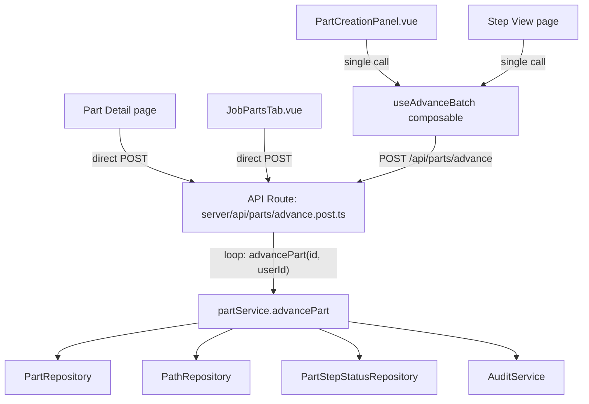
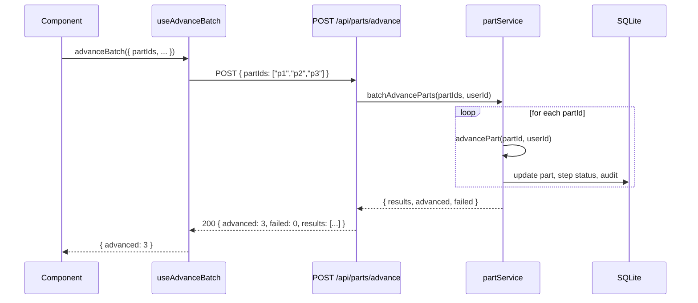
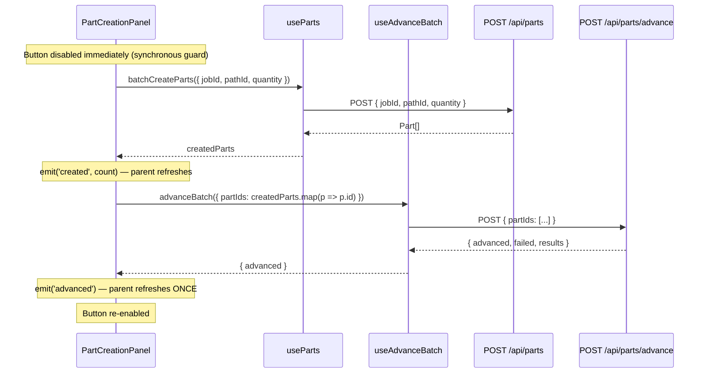

# Design Document: Batch Part Advancement

## Overview

The current create-and-advance flow in Shop Planr makes N sequential `POST /api/parts/{id}/advance` HTTP calls — one per part. With the authenticated rate limit at 60 req/15s, advancing 10+ parts exhausts the budget, causing 429 errors mid-loop and silently failing remaining parts. Additionally, `PartCreationPanel.vue` emits both `created` and `advance` events whose handlers run concurrently (creation refresh + advancement), further eating rate limit budget and causing UI state races. There is also no double-click protection on create/advance buttons.

This design introduces a single `POST /api/parts/advance` batch endpoint that accepts `{ partIds: string[] }` and delegates to the existing `advancePart()` service method in a loop — keeping `advancePart` as the single source of truth for all advancement logic. The client composable is updated to make one HTTP call instead of N, and the PartCreationPanel is fixed to serialize its create-then-advance flow and guard against double clicks.

## Architecture

The batch endpoint sits in the existing API → Service architecture. No new services are created. The API route is a thin HTTP glue layer that parses input, loops over `partService.advancePart()`, collects results, and returns a summary.



## Sequence Diagrams

### Batch Advance Flow (Happy Path)



### Create & Advance Flow (Fixed)



## Components and Interfaces

### Component 1: Batch Advance API Route

**Purpose**: Thin HTTP glue that accepts an array of part IDs and delegates to the service layer.

**File**: `server/api/parts/advance.post.ts`

**Interface**:
```typescript
// Request body (validated by Zod)
interface BatchAdvanceRequest {
  partIds: string[]  // 1–100 part IDs
}

// Response body
interface BatchAdvanceResponse {
  advanced: number
  failed: number
  results: Array<{
    partId: string
    success: boolean
    error?: string
  }>
}
```

**Responsibilities**:
- Parse and validate request body via `parseBody(event, batchAdvanceSchema)`
- Extract `userId` from JWT via `getAuthUserId(event)`
- Call `partService.batchAdvanceParts(partIds, userId)`
- Return structured response with per-part success/failure

### Component 2: batchAdvanceParts Service Method

**Purpose**: Thin transactional wrapper that calls `advancePart()` for each part ID, collecting results. `advancePart` remains the single source of truth for all advancement logic.

**Location**: Added to `server/services/partService.ts` on the existing service object.

**Interface**:
```typescript
batchAdvanceParts(
  partIds: string[],
  userId: string
): { advanced: number; failed: number; results: BatchAdvanceResult[] }
```

**Responsibilities**:
- Validate `partIds` is non-empty and within size limit (≤100)
- Iterate over `partIds`, calling `advancePart(id, userId)` in a try/catch
- Collect per-part results (success or error message)
- Return aggregate counts + per-part detail
- Does NOT duplicate any advancement logic — delegates entirely to `advancePart`

### Component 3: Updated useAdvanceBatch Composable

**Purpose**: Client-side composable that makes a single HTTP call to the batch endpoint instead of N sequential calls.

**File**: `app/composables/useAdvanceBatch.ts`

**Interface**:
```typescript
function advanceBatch(params: {
  partIds: string[]
  jobId: string
  pathId: string
  stepId: string
  availablePartCount: number
  note?: string
}): Promise<{ advanced: number }>
```

**Responsibilities**:
- Client-side guard: reject if `partIds.length > availablePartCount`
- Single `POST /api/parts/advance` call with `{ partIds }`
- Create note via `POST /api/notes` if provided (after advancement succeeds)
- Return `{ advanced }` count from response

### Component 4: Fixed PartCreationPanel

**Purpose**: Fix the create-and-advance flow to prevent race conditions and double clicks.

**File**: `app/components/PartCreationPanel.vue`

**Changes**:
- Set `creating.value = true` synchronously BEFORE any async work (double-click guard)
- In `handleCreateAndAdvance()`: emit `created` then `advance` sequentially, not concurrently
- The parent (Step View) handles `advance` event by calling `advanceBatch` which now makes 1 HTTP call
- Remove the pattern where `created` handler triggers `fetchStep()` concurrently with advancement

### Component 5: Fixed Part Detail Page Advancement

**Purpose**: Replace the sequential per-part advancement loop in `parts-browser/[id].vue` with the batch endpoint.

**File**: `app/pages/parts-browser/[id].vue`

**Changes**:
- Replace the `for (const sid of payload.partIds) { await advancePart(sid) }` loop with a single `POST /api/parts/advance` call using `{ partIds: payload.partIds }`
- Remove the `useParts().advancePart` import — use `useAuthFetch()` directly (already available as `$api` in this page)

### Component 6: Fixed Job Parts Tab Quick-Advance

**Purpose**: Replace the single-part `advancePart()` call in `JobPartsTab.vue` with the batch endpoint for consistency.

**File**: `app/components/JobPartsTab.vue`

**Changes**:
- Replace `useParts().advancePart(partId)` in `handleQuickAdvance()` with a single `POST /api/parts/advance` call using `{ partIds: [partId] }`
- This ensures all advancement goes through the same batch endpoint, even for single-part operations

### Component 7: Cleanup useParts.advancePart

**Purpose**: Remove the now-unused `advancePart()` function from the `useParts` composable.

**File**: `app/composables/useParts.ts`

**Changes**:
- Remove the `advancePart` function and its export — all callers now use the batch endpoint
- The single-part `POST /api/parts/:id/advance` route remains for backward compatibility but is no longer called by the frontend

### Component 8: useGuardedAction Composable

**Purpose**: Generic composable that wraps any async function with automatic double-execution prevention. Replaces the need for per-component `if (loading.value) return` guards.

**File**: `app/composables/useGuardedAction.ts`

**Interface**:
```typescript
function useGuardedAction<T>(fn: (...args: any[]) => Promise<T>): {
  execute: (...args: any[]) => Promise<T | undefined>
  loading: Ref<boolean>
}
```

**Behavior**:
- `loading` starts as `false`
- Calling `execute()` sets `loading = true` synchronously (before any await), runs `fn()`, then sets `loading = false` in a `finally` block
- If `execute()` is called while `loading` is already `true`, it returns `undefined` immediately without calling `fn()`
- Errors from `fn()` propagate normally (re-thrown after `loading` is reset)

**Usage in this spec**: Applied to `handleAdvance` in Step View, `handleCreateAndAdvance` / `handleCreate` in PartCreationPanel, `handleAdvance` in parts-browser, and `handleQuickAdvance` in JobPartsTab.

**Future rollout**: Other components with async button handlers can adopt `useGuardedAction` incrementally — no big-bang migration needed.

### Component 8: Fix Skip-Step Origin Status in lifecycleService

**Purpose**: When a user skips a step via `advanceToStep`, the *origin* step (the one being skipped from) is currently marked as `'completed'` in `part_step_statuses`. This is incorrect — the step was not actually completed, it was skipped. The routing history should reflect this truthfully.

**File**: `server/services/lifecycleService.ts`

**Problem**: In `advanceToStep()`, step 8 ("Update origin step → completed") unconditionally marks the origin step as `'completed'`. When the user clicks "Skip" on the Step View, the origin step IS the step being skipped. The intermediate bypassed steps already get correctly classified as `'skipped'` or `'deferred'` in step 7, but the origin step does not benefit from this classification.

**Root cause**: The `advanceToStep` method doesn't distinguish between "advancing normally through the current step" and "skipping the current step to jump ahead". In both cases, the origin step gets `status: 'completed'`.

**Fix**: When `advanceToStep` is called and the origin step is being bypassed (i.e., the target is more than one step ahead, or the origin step is optional/overridden and the user explicitly skipped it), the origin step should be marked with the same classification logic used for intermediate bypassed steps:
- If the origin step is optional or has an active override → mark as `'skipped'`
- If the origin step is required → mark as `'completed'` (normal advancement) or `'deferred'` (if jumping past it)

However, the most common skip scenario is: user is on an optional step and clicks "Skip" to go to the next step (target = current + 1). In this case there are zero intermediate bypassed steps, but the origin step itself is the one being skipped. The fix is:

1. When `targetOrder === currentOrder + 1` (advancing to the very next step): the origin step was actually worked through, so `'completed'` is correct. This is normal advancement.
2. When `targetOrder > currentOrder + 1` (jumping ahead): the origin step is being skipped along with any intermediate steps. Apply the same classification: optional/overridden → `'skipped'`, required → `'deferred'`.

**But there's a subtlety**: The "Skip" button in the Step View calls `advanceToStep` with `targetStepId = nextStepId` (the very next step). So `targetOrder === currentOrder + 1` and there are zero bypassed steps. The origin step gets marked `'completed'` — but the user explicitly chose to skip it.

**Revised approach**: The skip intent needs to be communicated to the service. Add an optional `skip: boolean` flag to `AdvanceToStepInput`. When `skip: true`:
- The origin step is marked `'skipped'` (if optional/overridden) instead of `'completed'`
- The origin step's `completedCount` is NOT incremented (it wasn't completed)
- Audit records `step_skipped` instead of `step_completed` for the origin

When `skip: false` or omitted (default — normal advancement):
- Existing behavior: origin step marked `'completed'`, `completedCount` incremented

**Changes to `AdvanceToStepInput`** (in `server/types/api.ts`):
```typescript
export interface AdvanceToStepInput {
  targetStepId: string
  userId: string
  skip?: boolean  // NEW: when true, origin step is marked 'skipped' not 'completed'
}
```

**Changes to `advanceToStep` in lifecycleService** (step 8):
```typescript
// 8. Update origin step status
const isSkipping = input.skip === true
const isOriginEffectivelyOptional = currentStep.optional || overriddenStepIds.has(currentStep.id)

if (isSkipping && isOriginEffectivelyOptional) {
  // Origin step was skipped (not completed)
  originEntry.status = 'skipped'
  // Do NOT increment completedCount
} else if (isSkipping && !isOriginEffectivelyOptional) {
  // Skipping a required step → deferred (must be completed later)
  originEntry.status = 'deferred'
  // Do NOT increment completedCount
} else {
  // Normal advancement — origin step was completed
  originEntry.status = 'completed'
  // Increment completedCount
  repos.paths.updateStep(currentStep.id, { completedCount: currentStep.completedCount + 1 })
}
```

**Changes to `canComplete` in lifecycleService**: No changes needed. The existing logic already handles this correctly:
- Optional steps are excluded from the check entirely (`if (step.optional) continue`) — so a `'skipped'` optional step never reaches the status check
- Required steps that are skipped get `'deferred'` status (not `'skipped'`), which correctly blocks completion until the step is either completed later or waived by a supervisor
- `'waived'` is the formal approval path for deferred required steps — it requires a reason and an approver ID

The step status lifecycle for the `canComplete` gate:
- Required step: must be `'completed'` (actually done) or `'waived'` (formally excused by supervisor). `'deferred'` blocks completion.
- Optional step: never checked — always passes regardless of status (`'skipped'`, `'completed'`, `'pending'`, etc.)

**Changes to `executeSkip` in `app/utils/skipStep.ts`**: Pass `skip: true` to `advanceToStep`:
```typescript
await advanceToStep(partId, {
  targetStepId: nextStepId,
  skip: true,  // NEW: tells the service this is a skip, not a normal advance
})
```

**UI impact**: The `stepStatusBadge` function in `parts-browser/[id].vue` already maps `'skipped'` → `{ color: 'neutral', label: 'Skipped' }`. No UI changes needed — the correct badge will display automatically once the status is stored correctly.

## Data Models

### Zod Schema: batchAdvanceSchema

**File**: `server/schemas/partSchemas.ts`

```typescript
export const batchAdvanceSchema = z.object({
  partIds: z.array(
    z.string().min(1, { error: 'Part ID must be non-empty' })
  )
    .min(1, { error: 'At least one part ID is required' })
    .max(100, { error: 'Cannot advance more than 100 parts at once' }),
})
```

**Validation Rules**:
- `partIds` must be a non-empty array of non-empty strings
- Maximum 100 part IDs per request (prevents abuse, well within rate limits)
- Each part ID is validated individually by `advancePart` (existence, status checks)

### Return Type: BatchAdvanceResult

```typescript
interface BatchAdvanceResult {
  partId: string
  success: boolean
  error?: string  // Present only when success is false
}
```

## Key Functions with Formal Specifications

### Function: batchAdvanceParts

```typescript
batchAdvanceParts(partIds: string[], userId: string): {
  advanced: number
  failed: number
  results: BatchAdvanceResult[]
}
```

**Preconditions:**
- `partIds` is a non-empty array with length ≤ 100
- `userId` is a non-empty string (authenticated user)
- Each `partId` may or may not exist (handled gracefully)

**Postconditions:**
- `results.length === partIds.length` (one result per input)
- `advanced + failed === partIds.length`
- For each successful result: the part has been advanced exactly one step (or completed)
- For each failed result: `error` contains the error message from `advancePart`
- All successful advancements have audit trail entries (via `advancePart`)
- No partial state: each part's advancement is independent — failure of one does not roll back others

**Loop Invariants:**
- After processing `i` parts: `results.length === i`
- After processing `i` parts: `advanced + failed === i`
- Each part is processed exactly once, in order

### Function: advanceBatch (composable)

```typescript
async function advanceBatch(params: AdvanceBatchParams): Promise<{ advanced: number }>
```

**Preconditions:**
- `params.partIds.length > 0`
- `params.partIds.length <= params.availablePartCount`
- User is authenticated (useAuthFetch handles this)

**Postconditions:**
- Returns `{ advanced: N }` where N is the count of successfully advanced parts
- If note is provided and non-empty, a note is created after advancement
- Exactly 1 HTTP call for advancement (not N)
- Exactly 0 or 1 HTTP calls for note creation

## Algorithmic Pseudocode

### Server: batchAdvanceParts

```typescript
function batchAdvanceParts(partIds: string[], userId: string) {
  assertNonEmptyArray(partIds, 'partIds')
  if (partIds.length > 100) {
    throw new ValidationError('Cannot advance more than 100 parts at once')
  }

  const results: BatchAdvanceResult[] = []
  let advanced = 0
  let failed = 0

  for (const partId of partIds) {
    // INVARIANT: results.length === (advanced + failed) === index
    try {
      advancePart(partId, userId)  // reuse existing method — single source of truth
      results.push({ partId, success: true })
      advanced++
    } catch (error) {
      results.push({ partId, success: false, error: error.message })
      failed++
    }
  }

  // POSTCONDITION: advanced + failed === partIds.length
  return { advanced, failed, results }
}
```

### Client: useAdvanceBatch (updated)

```typescript
async function advanceBatch(params) {
  // Client-side guard — instant feedback
  if (params.partIds.length > params.availablePartCount) {
    throw new Error(`Cannot advance ${params.partIds.length} parts — only ${params.availablePartCount} available`)
  }

  // Single HTTP call replaces N sequential calls
  const response = await $api('/api/parts/advance', {
    method: 'POST',
    body: { partIds: params.partIds },
  })

  // Optional note creation (separate call, after advancement)
  const trimmedNote = params.note?.trim()
  if (trimmedNote && trimmedNote.length > 0) {
    if (trimmedNote.length > 1000) {
      throw new Error('Note must be 1000 characters or fewer')
    }
    await $api('/api/notes', {
      method: 'POST',
      body: {
        jobId: params.jobId,
        pathId: params.pathId,
        stepId: params.stepId,
        partIds: params.partIds,
        text: trimmedNote,
      },
    })
  }

  return { advanced: response.advanced }
}
```

### Client: PartCreationPanel handleCreateAndAdvance (fixed)

```typescript
async function handleCreateAndAdvance() {
  if (validationError.value || creating.value) return  // double-click guard
  creating.value = true  // SYNCHRONOUS — before any await
  clearMessages()

  try {
    // Step 1: Create parts
    const created = await batchCreateParts({
      jobId: props.job.jobId,
      pathId: props.job.pathId,
      quantity: quantity.value,
    })
    const createdIds = created.map(p => p.id)

    // Step 2: Emit created (parent refreshes step data)
    emit('created', created.length)

    // Step 3: Advance via batch endpoint (single HTTP call)
    emit('advance', { partIds: createdIds, note: note.value.trim() || undefined })
  } catch (e) {
    errorMessage.value = e?.data?.message ?? e?.message ?? 'Failed to create parts'
  } finally {
    creating.value = false
  }
}
```

## Example Usage

```typescript
// Server: API route (server/api/parts/advance.post.ts)
import { batchAdvanceSchema } from '../../schemas/partSchemas'

export default defineApiHandler(async (event) => {
  const { partIds } = await parseBody(event, batchAdvanceSchema)
  const userId = getAuthUserId(event)
  const { partService } = getServices()
  return partService.batchAdvanceParts(partIds, userId)
})

// Client: Step View handling advance event
async function handleAdvance(payload: { partIds: string[], note?: string }) {
  advanceLoading.value = true
  try {
    const result = await advanceBatch({
      partIds: payload.partIds,
      jobId: job.value.jobId,
      pathId: job.value.pathId,
      stepId: job.value.stepId,
      availablePartCount: job.value.partCount,
      note: payload.note,
    })
    toast.add({
      title: 'Parts advanced',
      description: `${result.advanced} part${result.advanced !== 1 ? 's' : ''} moved forward`,
      color: 'success',
    })
    await fetchStep()  // single refresh after all advancement is done
  } catch (e) {
    toast.add({ title: 'Advancement failed', description: e?.message, color: 'error' })
  } finally {
    advanceLoading.value = false
  }
}
```

## Correctness Properties

*A property is a characteristic or behavior that should hold true across all valid executions of a system — essentially, a formal statement about what the system should do. Properties serve as the bridge between human-readable specifications and machine-verifiable correctness guarantees.*

### Property 1: Batch result completeness

*For any* array of part IDs passed to batchAdvanceParts, the results array SHALL have exactly one entry per input ID, and the sum of advanced and failed counts SHALL equal the input array length.

**Validates: Requirements 2.1, 2.2, 2.3**

### Property 2: Independent failure isolation

*For any* batch containing a mix of valid and invalid part IDs, all valid parts SHALL advance successfully regardless of failures in other parts, and each failed part SHALL have an error message in its result entry.

**Validates: Requirements 2.4, 2.5**

### Property 3: Schema boundary enforcement

*For any* array of strings, the batchAdvanceSchema SHALL accept arrays of 1–100 non-empty strings and reject arrays that are empty, contain empty strings, or exceed 100 elements.

**Validates: Requirements 1.2, 1.3, 1.4**

### Property 4: Single HTTP call for batch advancement

*For any* array of 1–100 part IDs, the advanceBatch composable SHALL make exactly one POST request to /api/parts/advance, plus at most one POST to /api/notes if a non-empty note is provided.

**Validates: Requirements 3.1, 3.3**

### Property 5: Client-side count guard

*For any* call where partIds.length exceeds availablePartCount, the advanceBatch composable SHALL throw an error without making any HTTP request.

**Validates: Requirement 3.2**

### Property 6: Guarded action concurrent rejection

*For any* async function wrapped by useGuardedAction, calling execute while loading is true SHALL return undefined immediately without invoking the wrapped function. Loading SHALL be set to true synchronously before the wrapped function begins and reset to false after it completes (success or failure). Errors from the wrapped function SHALL be re-thrown after loading is reset.

**Validates: Requirements 8.1, 8.2, 8.3, 8.4**

### Property 7: Skip origin status classification

*For any* advanceToStep call with skip: true, the origin step SHALL be marked 'skipped' if the step is optional or has an active override, and 'deferred' if the step is required with no active override. When skip is false or omitted, the origin step SHALL be marked 'completed'.

**Validates: Requirements 9.1, 9.2, 9.4, 10.2**

### Property 8: Skip completedCount invariant

*For any* advanceToStep call with skip: true, the origin step's completedCount SHALL remain unchanged. For any advanceToStep call with skip false or omitted, the origin step's completedCount SHALL increase by exactly one.

**Validates: Requirements 9.3, 9.4**

### Property 9: canComplete ignores optional steps and blocks on deferred required steps

*For any* part, the canComplete method SHALL exclude optional steps from evaluation regardless of their status. Required steps with 'deferred' status SHALL be reported as blockers. Required steps with 'waived' status SHALL not be reported as blockers.

**Validates: Requirements 12.1, 12.2, 12.3**

### Property 10: Bypass preview classification

*For any* path configuration and target step selection, the bypass preview SHALL classify each intermediate step as 'Skip' (if optional or overridden) or 'Defer' (if required), matching the classification logic used by advanceToStep.

**Validates: Requirement 13.4**

## Error Handling

### Error Scenario 1: Part Not Found

**Condition**: A `partId` in the batch does not exist in the database.
**Response**: `advancePart` throws `NotFoundError('Part', id)`. The batch method catches it and records `{ partId, success: false, error: "Part not found: {id}" }`.
**Recovery**: Other parts in the batch continue processing. The response includes the failure detail.

### Error Scenario 2: Part Already Completed

**Condition**: A part in the batch has `status === 'completed'` or `currentStepId === null`.
**Response**: `advancePart` throws `ValidationError('Part is already completed')`. Caught and recorded as failure.
**Recovery**: Other parts continue. Client can display which parts failed.

### Error Scenario 3: Empty partIds Array

**Condition**: Client sends `{ partIds: [] }`.
**Response**: Zod schema rejects with 400 "At least one part ID is required".
**Recovery**: Client shows validation error.

### Error Scenario 4: Batch Size Exceeded

**Condition**: Client sends more than 100 part IDs.
**Response**: Zod schema rejects with 400 "Cannot advance more than 100 parts at once".
**Recovery**: Client should chunk requests (unlikely in practice — UI rarely has 100+ parts at one step).

### Error Scenario 5: Double Click on Any Async Action

**Condition**: User clicks any async action button (Create, Create & Advance, Advance, Skip) twice rapidly before the first call completes.
**Fix**: All async button handlers use `useGuardedAction` composable. The `execute()` wrapper sets `loading = true` synchronously before any async work and rejects concurrent calls.
**Response**: Second click returns immediately without executing the action.
**Recovery**: No duplicate operations occur. The `loading` ref can be bound to `:disabled` and `:loading` on the button for visual feedback.

### Error Scenario 6: Skip Required Step Without Override

**Condition**: User attempts to skip a required step that has no active override via `advanceToStep` with `skip: true`.
**Response**: Origin step is marked `'deferred'` (not `'skipped'`). The step remains a blocker for completion until it is completed or waived later.
**Recovery**: User must complete the deferred step or get a waiver before the part can reach final completion.

## Testing Strategy

### Unit Testing Approach

- **partService.batchAdvanceParts**: Test with mocked repos (same pattern as existing `advancePart` tests in `tests/unit/services/partService.test.ts`):
  - All parts advance successfully → `advanced === N, failed === 0`
  - Some parts fail (not found, already completed) → partial success with correct counts
  - Empty array → `ValidationError`
  - Over 100 parts → `ValidationError`
  - Results array length always equals input length

- **batchAdvanceSchema**: Test Zod schema validation (same pattern as `tests/unit/schemas/partSchemas.test.ts`):
  - Valid arrays of strings pass
  - Empty array rejected
  - Array with empty strings rejected
  - Array over 100 elements rejected
  - Non-array input rejected

### Property-Based Testing Approach

**Property Test Library**: fast-check

- **CP-BA-1: Result completeness** — For any valid array of part IDs, `results.length === partIds.length` and `advanced + failed === partIds.length`.
- **CP-BA-2: Independent failure** — For any batch where some parts are invalid, valid parts still advance successfully.
- **CP-BA-3: Delegation integrity** — `batchAdvanceParts` produces identical outcomes to calling `advancePart` individually for each part (same final state, same audit entries).
- **CP-BA-4: Skip origin status** — For any `advanceToStep` call with `skip: true`, the origin step's routing status is `'skipped'` (if optional/overridden) or `'deferred'` (if required), never `'completed'`.
- **CP-BA-5: Skip completedCount invariant** — For any skipped step, the step's `completedCount` is unchanged (not incremented).
- **CP-BA-6: canComplete unaffected by skipped optional steps** — For any part where optional steps have `'skipped'` status, `canComplete` still returns the same result as if those steps had any other status (because optional steps are excluded from the check entirely).

### Integration Testing Approach

- End-to-end test: create parts via `batchCreateParts`, advance via `batchAdvanceParts`, verify all parts moved to next step.
- Partial failure test: mix valid and invalid part IDs, verify correct parts advanced and failures reported.

## Performance Considerations

- **Rate limit impact**: Batch endpoint reduces N HTTP calls to 1, staying well within the 60 req/15s authenticated limit even for large batches.
- **Server-side processing**: `advancePart` is synchronous (SQLite is synchronous via better-sqlite3), so the loop completes in a single event loop tick. No concern about concurrent modification.
- **Batch size cap**: 100 parts per request prevents unbounded processing time. In practice, most batches are 1–20 parts.

## Security Considerations

- **Authentication**: Batch endpoint requires JWT authentication (same as single-part advance).
- **Authorization**: `userId` is extracted from JWT via `getAuthUserId(event)` — not from request body. No client-side userId override possible.
- **Input validation**: Zod schema validates array structure and size before any service logic runs.
- **No privilege escalation**: `batchAdvanceParts` delegates to `advancePart` which enforces all existing business rules per part.

## UI Design: Advanced Flows Panel

### Current State

The `ProcessAdvancementPanel` currently shows:
- Part selection checkboxes with All/None
- Quantity input
- Optional note textarea
- Action buttons: **Advance** (always), **Skip** (only if step is optional and not final), **Add Note**, **Cancel**

The "Skip" button only appears on optional steps and always skips to the immediate next step. There is no way to:
- Skip to a step further ahead (e.g., skip 2 steps forward)
- Defer a required step (jump past it, marking it for later completion)
- Navigate back to a deferred step to complete it from the advancement panel

The `AdvanceToStepDropdown` component exists but is orphaned — not used anywhere in the current UI. The `DeferredStepsList` component exists on the part detail page (`parts-browser/[id].vue`) but not on the Step View.

### Design Approach: Collapsible "Advanced" Section

Advanced flow controls (skip-to-step, defer) are hidden behind a collapsible section to keep the primary UI clean for the common case (select parts → advance). The section is a disclosure toggle at the bottom of the action bar.

### Layout Mockup

```
┌─────────────────────────────────────────────────┐
│ Advancing to: QC Inspection → Lab B             │
├─────────────────────────────────────────────────┤
│ Parts (3/3)                          [All][None]│
│ ┌─────────────────────────────────────────────┐ │
│ │ ☑ part_00042    [👁] [🗑] [✓]               │ │
│ │ ☑ part_00043    [👁] [🗑] [✓]               │ │
│ │ ☑ part_00044    [👁] [🗑] [✓]               │ │
│ └─────────────────────────────────────────────┘ │
│                                                 │
│ Quantity: [3___] of 3 available                  │
│                                                 │
│ Note (optional)                                 │
│ ┌─────────────────────────────────────────────┐ │
│ │                                             │ │
│ └─────────────────────────────────────────────┘ │
│                                                 │
│ [▶ Advance] [📝 Add Note] [Cancel]              │
│                                                 │
│ ▸ Advanced options                              │
├ ─ ─ ─ ─ ─ ─ ─ ─ ─ ─ ─ ─ ─ ─ ─ ─ ─ ─ ─ ─ ─ ─┤
│ (collapsed by default — click to expand)        │
│                                                 │
│ ▾ Advanced options                              │
│ ┌─────────────────────────────────────────────┐ │
│ │  Skip to: [▼ Select step...            ]    │ │
│ │                                             │ │
│ │  ⚠ 1 step will be bypassed:                │ │
│ │  ┌───────────────────────────────────────┐  │ │
│ │  │ Heat Treatment        [Skip]         │  │ │
│ │  └───────────────────────────────────────┘  │ │
│ │                                             │ │
│ │  [⏭ Skip Selected Parts]                   │ │
│ └─────────────────────────────────────────────┘ │
└─────────────────────────────────────────────────┘
```

### Component Changes

#### ProcessAdvancementPanel.vue — Updated Actions

**Remove**: The standalone "Skip" button that only works for optional steps.

**Add**: A collapsible "Advanced options" disclosure section below the main action buttons.

The disclosure section contains:
1. **Skip-to-step dropdown** — A `USelect` populated with all future steps (same data as the orphaned `AdvanceToStepDropdown`). Selecting a step shows a bypass preview (which steps will be skipped/deferred).
2. **Bypass preview** — Shows each bypassed step with its classification badge: "Skip" (neutral, for optional) or "Defer" (warning, for required). Includes a warning message if any required steps will be deferred.
3. **"Skip Selected Parts" button** — Calls `advanceToStep` with `skip: true` and the selected target step. Disabled if no parts are selected or no target step is chosen.

**Visibility rules**:
- The "Advanced options" toggle is only visible to admin users (`useAuth().isAdmin`) — regular operators see only the standard Advance button
- On the final step, the skip-to dropdown is empty and shows "No further steps" — the section is effectively inert
- The disclosure is collapsed by default and resets to collapsed when the step changes

#### WorkQueueJob Type — New Fields

Add `pathAdvancementMode` and `pathSteps` to `WorkQueueJob` so the advancement panel knows:
- Whether the path allows flexible advancement (needed to determine if skip-to-step is available)
- The full step list (needed to populate the skip-to dropdown and compute bypass previews)

```typescript
export interface WorkQueueJob {
  // ... existing fields ...
  pathAdvancementMode?: 'strict' | 'flexible' | 'per_step'
  pathSteps?: readonly { id: string, name: string, order: number, location?: string, optional: boolean }[]
}
```

**Strict mode behavior**: When `pathAdvancementMode === 'strict'`, the skip-to dropdown only shows the immediate next step (same as current "Skip" behavior). The server enforces this anyway, but the UI should reflect it.

**Flexible / per_step mode behavior**: The dropdown shows all future steps. Bypass preview shows skip/defer classification for each intermediate step.

#### Step View — Deferred Steps Awareness

The Step View page (`parts/step/[stepId].vue`) currently does not show deferred steps. When a part has deferred steps from a previous skip, the operator should be aware.

**Add**: A `DeferredStepsList` section (already exists as a component) to the Step View, shown below the advancement panel when the current parts have deferred steps. This allows operators to complete or waive deferred steps without navigating to the part detail page.

This requires fetching step statuses for the parts at the current step — a new API call or an extension of the existing step view endpoint.

### Interaction Flow

#### Skip-to-Step Flow

1. User expands "Advanced options"
2. User selects a target step from the dropdown
3. Bypass preview appears showing which steps will be skipped/deferred
4. User clicks "Skip Selected Parts"
5. For each selected part: `advanceToStep(partId, { targetStepId, skip: true })` is called
6. Origin step is marked `'skipped'` (optional) or `'deferred'` (required)
7. Intermediate steps are classified per existing `advanceToStep` logic
8. UI refreshes to show the new step state

#### Deferred Step Completion Flow (from Step View)

1. Operator sees "Deferred Steps (N)" section below the advancement panel
2. Operator clicks "Complete" on a deferred step → marks it as completed
3. Or operator clicks "Waive" → enters reason → confirms → marks it as waived
4. Step view refreshes

### Migration from Current Skip Button

The current standalone "Skip" button (`v-if="shouldShowSkip(job.stepOptional, job.isFinalStep)"`) is removed. Its functionality is subsumed by the "Advanced options" section:
- On an optional step: expanding advanced options and clicking "Skip Selected Parts" with the next step selected achieves the same result
- On a required step: the same UI now allows deferring the step (previously impossible)
- The `shouldShowSkip` utility can be removed or deprecated

## Dependencies

- No new npm packages required
- Existing dependencies used: `zod` (schema validation), `better-sqlite3` (synchronous DB), `fast-check` (property tests)
- Existing service methods reused: `partService.advancePart()`, `auditService.recordPartAdvancement()`, `auditService.recordPartCompletion()`
