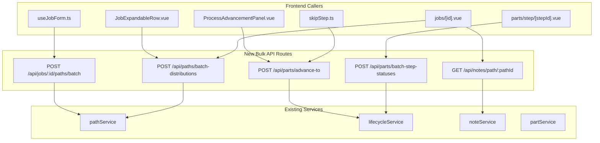

# Design Document: Bulk API Endpoints

## Overview

The Shop Planr frontend currently makes N sequential or parallel HTTP calls in several key workflows: job creation/edit (N path creates/updates/deletes), skip/advance-to-step (N advance-to calls), path notes loading (N notes-per-step fetches), deferred step status loading (N step-status fetches), and path distribution loading (N path detail fetches). This feature introduces five new bulk API endpoints with Zod request validation and updates the frontend callers to use them.

The approach follows the existing patterns established by `POST /api/parts/advance` (batch advance) and `POST /api/certs/batch-attach` (batch cert attachment) — both already use the bulk pattern successfully.

## Architecture



## Zod Schemas

### Schema 1: Batch Path Operations (`server/schemas/pathSchemas.ts`)

```typescript
// Reuses existing stepInputSchema and advancementModeEnum

const batchPathCreateSchema = z.object({
  name: z.string().min(1, 'name is required'),
  goalQuantity: z.number().int().positive('goalQuantity must be a positive integer'),
  advancementMode: advancementModeEnum.optional(),
  steps: z.array(stepInputSchema).min(1, 'At least one step is required'),
})

const batchPathUpdateSchema = z.object({
  pathId: z.string().min(1, 'pathId is required'),
  name: z.string().min(1).optional(),
  goalQuantity: z.number().int().positive().optional(),
  advancementMode: advancementModeEnum.optional(),
  steps: z.array(stepInputSchema).min(1).optional(),
})

export const batchPathOperationsSchema = z.object({
  create: z.array(batchPathCreateSchema).default([]),
  update: z.array(batchPathUpdateSchema).default([]),
  delete: z.array(z.string().min(1)).default([]),
}).refine(
  data => data.create.length + data.update.length + data.delete.length > 0,
  { message: 'At least one operation (create, update, or delete) is required' },
)
```

### Schema 2: Batch Advance-To-Step (`server/schemas/partSchemas.ts`)

```typescript
export const batchAdvanceToSchema = z.object({
  partIds: z.array(z.string().min(1))
    .min(1, 'At least one part ID is required')
    .max(100, 'Cannot advance more than 100 parts at once'),
  targetStepId: z.string().min(1, 'targetStepId is required'),
  skip: z.boolean().optional(),
})
```

### Schema 3: Bulk Step Statuses (`server/schemas/partSchemas.ts`)

```typescript
export const batchStepStatusesSchema = z.object({
  partIds: z.array(z.string().min(1))
    .min(1, 'At least one part ID is required')
    .max(500, 'Cannot fetch more than 500 parts at once'),
})
```

### Schema 4: Bulk Path Distributions (`server/schemas/pathSchemas.ts`)

```typescript
export const batchDistributionsSchema = z.object({
  pathIds: z.array(z.string().min(1))
    .min(1, 'At least one path ID is required')
    .max(100, 'Cannot fetch more than 100 paths at once'),
})
```

Note: `GET /api/notes/path/:pathId` uses a route param (no request body), so no Zod body schema is needed — just validate the param exists.

## API Route Implementations

### Route 1: `POST /api/jobs/[id]/paths/batch.post.ts`

```typescript
// server/api/jobs/[id]/paths/batch.post.ts
import { batchPathOperationsSchema } from '../../../schemas/pathSchemas'

export default defineApiHandler(async (event) => {
  const jobId = getRouterParam(event, 'id')!
  const body = await parseBody(event, batchPathOperationsSchema)
  const userId = getAuthUserId(event)
  const { pathService, jobService } = getServices()

  // Verify job exists
  jobService.getJob(jobId)

  const deleted: string[] = []
  const updated: Path[] = []
  const created: Path[] = []

  // Deletes first
  for (const pathId of body.delete) {
    pathService.deletePath(pathId, userId)
    deleted.push(pathId)
  }

  // Then updates
  for (const op of body.update) {
    const { pathId, ...updateData } = op
    const result = pathService.updatePath(pathId, updateData)
    updated.push(result)
  }

  // Then creates
  for (const op of body.create) {
    const result = pathService.createPath({ ...op, jobId })
    created.push(result)
  }

  return { created, updated, deleted }
})
```

### Route 2: `POST /api/parts/advance-to.post.ts`

```typescript
// server/api/parts/advance-to.post.ts
import { batchAdvanceToSchema } from '../../schemas/partSchemas'

export default defineApiHandler(async (event) => {
  const body = await parseBody(event, batchAdvanceToSchema)
  const userId = getAuthUserId(event)
  const { lifecycleService } = getServices()

  const results: { partId: string, success: boolean, error?: string }[] = []
  let advanced = 0
  let failed = 0

  for (const partId of body.partIds) {
    try {
      lifecycleService.advanceToStep(partId, {
        targetStepId: body.targetStepId,
        skip: body.skip,
        userId,
      })
      results.push({ partId, success: true })
      advanced++
    } catch (error) {
      const message = error instanceof Error ? error.message : 'Unknown error'
      results.push({ partId, success: false, error: message })
      failed++
    }
  }

  return { advanced, failed, results }
})
```

### Route 3: `GET /api/notes/path/[id].get.ts`

```typescript
// server/api/notes/path/[id].get.ts
export default defineApiHandler(async (event) => {
  const pathId = getRouterParam(event, 'id')!
  const { noteService, pathService } = getServices()

  // Verify path exists — throws NotFoundError → 404
  pathService.getPath(pathId)

  return noteService.getNotesForPath(pathId)
})
```

### Route 4: `POST /api/parts/batch-step-statuses.post.ts`

```typescript
// server/api/parts/batch-step-statuses.post.ts
import { batchStepStatusesSchema } from '../../schemas/partSchemas'

export default defineApiHandler(async (event) => {
  const body = await parseBody(event, batchStepStatusesSchema)
  const { lifecycleService } = getServices()

  const result: Record<string, PartStepStatusView[]> = {}

  for (const partId of body.partIds) {
    try {
      result[partId] = lifecycleService.getStepStatuses(partId)
    } catch {
      // Omit missing parts — no error
    }
  }

  return result
})
```

### Route 5: `POST /api/paths/batch-distributions.post.ts`

```typescript
// server/api/paths/batch-distributions.post.ts
import { batchDistributionsSchema } from '../../schemas/pathSchemas'

export default defineApiHandler(async (event) => {
  const body = await parseBody(event, batchDistributionsSchema)
  const { pathService } = getServices()

  const result: Record<string, { distribution: StepDistribution[], completedCount: number }> = {}

  for (const pathId of body.pathIds) {
    try {
      const distribution = pathService.getStepDistribution(pathId)
      const completedCount = pathService.getPathCompletedCount(pathId)
      result[pathId] = { distribution, completedCount }
    } catch {
      // Omit missing paths — no error
    }
  }

  return result
})
```

## Service Layer Changes

### noteService — Add `getNotesForPath()`

```typescript
getNotesForPath(pathId: string): StepNote[] {
  return repos.notes.listByPathId(pathId)
}
```

This requires a new repository method `listByPathId(pathId)` on `NoteRepository` that queries `SELECT * FROM step_notes WHERE path_id = ? ORDER BY created_at DESC`. The `step_notes` table already has a `path_id` column, so no migration is needed.

### lifecycleService — No changes needed

The bulk step statuses endpoint calls `getStepStatuses()` per part in a loop. This is correct — the service method already exists and handles the per-part logic. A future optimization could add a bulk query, but correctness first.

### pathService — No changes needed

The bulk distributions endpoint calls existing `getStepDistribution()` and `getPathCompletedCount()` per path. The batch path operations endpoint calls existing `createPath()`, `updatePath()`, and `deletePath()` methods.

## Frontend Changes

### Change 1: `useJobForm.ts` — Use batch path endpoint

Replace the sequential loops in `submitCreate()` and `submitEdit()` with a single call to `POST /api/jobs/:id/paths/batch`.

```typescript
async function submitCreate(): Promise<string> {
  const job = await createJob({
    name: jobDraft.value.name.trim(),
    goalQuantity: jobDraft.value.goalQuantity,
  })

  // Single bulk call replaces N sequential createPath calls
  await $api(`/api/jobs/${job.id}/paths/batch`, {
    method: 'POST',
    body: {
      create: pathDrafts.value.map(draft => ({
        name: draft.name.trim(),
        goalQuantity: draft.goalQuantity,
        advancementMode: draft.advancementMode,
        steps: draft.steps.map(s => ({
          name: s.name.trim(),
          location: s.location.trim() || undefined,
          assignedTo: s.assignedTo || undefined,
          optional: s.optional,
          dependencyType: s.dependencyType,
        })),
      })),
    },
  })

  return job.id
}

async function submitEdit(): Promise<string> {
  // ... existing job update ...
  const changes = computePathChanges(originalPaths, pathDrafts.value)

  // Single bulk call replaces 3 sequential loops
  await $api(`/api/jobs/${jobId}/paths/batch`, {
    method: 'POST',
    body: {
      delete: changes.toDelete.map(p => p.id),
      update: changes.toUpdate.map(draft => ({
        pathId: draft._existingId!,
        name: draft.name.trim(),
        goalQuantity: draft.goalQuantity,
        advancementMode: draft.advancementMode,
        steps: draft.steps.map(s => ({ /* same mapping */ })),
      })),
      create: changes.toCreate.map(draft => ({
        name: draft.name.trim(),
        goalQuantity: draft.goalQuantity,
        advancementMode: draft.advancementMode,
        steps: draft.steps.map(s => ({ /* same mapping */ })),
      })),
    },
  })

  return jobId
}
```

### Change 2: `useLifecycle.ts` — Add `batchAdvanceToStep()`

```typescript
async function batchAdvanceToStep(input: {
  partIds: string[]
  targetStepId: string
  skip?: boolean
}): Promise<{ advanced: number, failed: number, results: { partId: string, success: boolean, error?: string }[] }> {
  loading.value = true
  error.value = null
  try {
    return await $api('/api/parts/advance-to', {
      method: 'POST',
      body: input,
    })
  } catch (e) {
    error.value = e?.data?.message ?? e?.message ?? 'Failed to advance parts'
    throw e
  } finally {
    loading.value = false
  }
}
```

### Change 3: `ProcessAdvancementPanel.vue` — Use `batchAdvanceToStep()`

```typescript
async function handleSkipSelectedParts() {
  const targetId = selectedOrUndefined(selectedTargetStepId.value)
  if (!targetId || selectedParts.value.size === 0 || skipLoading.value) return

  const ids = localPartIds.value.filter((id: string) => selectedParts.value.has(id))
  skipLoading.value = true
  try {
    const result = await batchAdvanceToStep({
      partIds: ids,
      targetStepId: targetId,
      skip: !markComplete.value,
    })
    toast.add({
      title: markComplete.value ? 'Parts advanced' : 'Parts skipped',
      description: `${result.advanced} part${result.advanced !== 1 ? 's' : ''} processed${result.failed ? `, ${result.failed} failed` : ''}`,
      color: result.failed ? 'warning' : 'success',
    })
    emit('skipped')
  } catch (e: unknown) { /* error handling */ }
  finally { skipLoading.value = false }
}
```

### Change 4: `skipStep.ts` — Use bulk endpoint

```typescript
export async function executeSkip(params: SkipStepParams): Promise<SkipStepResult> {
  const { partIds, nextStepId, batchAdvanceToStep } = params

  if (!nextStepId) {
    return { skipped: false, count: 0, error: 'No next step' }
  }

  const result = await batchAdvanceToStep({
    partIds,
    targetStepId: nextStepId,
    skip: true,
  })

  return { skipped: true, count: result.advanced }
}
```

Note: The `SkipStepParams` interface changes — `advanceToStep` (single-part) is replaced by `batchAdvanceToStep` (bulk). Callers of `executeSkip` must be updated.

### Change 5: `jobs/[id].vue` — Use bulk notes endpoint

```typescript
async function loadPathNotes(pathId: string) {
  try {
    const notes = await $api<StepNote[]>(`/api/notes/path/${encodeURIComponent(pathId)}`)
    pathNotes.value = { ...pathNotes.value, [pathId]: notes }
  } catch { /* skip */ }
}
```

### Change 6: `parts/step/[stepId].vue` — Use bulk step statuses endpoint

```typescript
async function fetchDeferredSteps() {
  if (!job.value?.partIds?.length) {
    partStepStatuses.value = new Map()
    return
  }

  const statusMap = new Map<string, PartStepStatusView[]>()
  const result = await $api<Record<string, PartStepStatusView[]>>(
    '/api/parts/batch-step-statuses',
    { method: 'POST', body: { partIds: job.value.partIds } },
  )

  for (const [partId, statuses] of Object.entries(result)) {
    if (statuses.some(s => s.status === 'deferred')) {
      statusMap.set(partId, statuses)
    }
  }
  partStepStatuses.value = statusMap
}
```

### Change 7: `JobExpandableRow.vue` and `jobs/[id].vue` — Use bulk distributions endpoint

```typescript
// In JobExpandableRow.vue — replace batched Promise.allSettled with single call
const uncachedIds = allPathIds.filter(id => !pathDistributions.value[id])
if (uncachedIds.length === 0) return

const result = await $api<Record<string, { distribution: StepDist[], completedCount: number }>>(
  '/api/paths/batch-distributions',
  { method: 'POST', body: { pathIds: uncachedIds } },
)

for (const [pathId, data] of Object.entries(result)) {
  pathDistributions.value[pathId] = data.distribution ?? []
  pathCompletedCounts.value[pathId] = data.completedCount ?? 0
}
```

## Data Models

No new domain types or database migrations are needed. All bulk endpoints compose existing service methods and return existing types. The only new types are the Zod schemas (defined above) and the batch response shapes.

### Batch Path Operations Response

```typescript
interface BatchPathResult {
  created: Path[]
  updated: Path[]
  deleted: string[]
}
```

### Batch Advance-To Response

```typescript
interface BatchAdvanceToResult {
  advanced: number
  failed: number
  results: { partId: string, success: boolean, error?: string }[]
}
```

## Repository Changes

### NoteRepository — Add `listByPathId()`

```typescript
// Interface addition
listByPathId(pathId: string): StepNote[]

// SQLite implementation
listByPathId(pathId: string): StepNote[] {
  const rows = db.prepare('SELECT * FROM step_notes WHERE path_id = ? ORDER BY created_at DESC').all(pathId)
  return rows.map(deserialize)
}
```

The `step_notes` table already has a `path_id` column, so no migration is needed.

## Error Handling

### Batch Path Operations
- Job not found → 404 (before any operations)
- Zod validation failure → 400
- Individual path operation failure (e.g., path not found for update/delete) → propagates as 404/400/403 from the service layer, stopping the batch

### Batch Advance-To-Step
- Zod validation failure → 400
- Individual part failures are collected in the results array — the endpoint always returns 200 with per-part success/failure details

### Bulk Notes by Path
- Path not found → 404
- No notes → 200 with empty array

### Bulk Step Statuses
- Zod validation failure → 400
- Missing parts are silently omitted from the result

### Bulk Path Distributions
- Zod validation failure → 400
- Missing paths are silently omitted from the result

## Testing Strategy

### Unit Tests — Zod Schemas
- Test each new schema accepts valid input
- Test each schema rejects invalid input (missing required fields, wrong types, empty arrays, exceeding max limits)

### Unit Tests — API Routes
- Test batch path operations processes deletes → updates → creates in order
- Test batch advance-to collects per-part results
- Test bulk notes returns notes sorted by createdAt desc
- Test bulk step statuses omits missing parts
- Test bulk distributions omits missing paths

### Unit Tests — Frontend
- Test `useJobForm.ts` calls the batch endpoint instead of individual calls
- Test `ProcessAdvancementPanel.vue` calls `batchAdvanceToStep`
- Test `skipStep.ts` calls `batchAdvanceToStep`
- Test `jobs/[id].vue` calls bulk notes endpoint
- Test `parts/step/[stepId].vue` calls bulk step statuses endpoint
- Test `JobExpandableRow.vue` calls bulk distributions endpoint

### Property Tests
- Batch path operations: for any valid combination of create/update/delete arrays, the response contains the correct counts
- Batch advance-to: for any valid partIds array, `advanced + failed === partIds.length`
