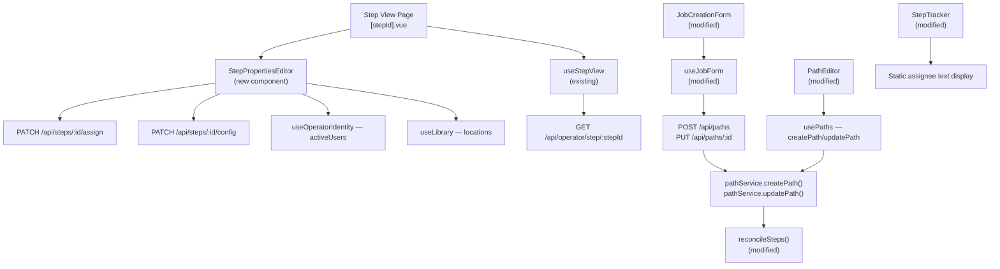

# Design Document: Edit Step Properties on Step Page

## Overview

This feature addresses **GitHub Issue #93** — enabling users to edit step properties (assignee and location) in three places:

1. **Step View page** (`/parts/step/[stepId]`) — inline edit mode for assignee and location on the step detail page, where operators most frequently interact with steps.
2. **Job create/edit form** (`JobCreationForm`) — Assignee column in the step grid so users can batch-assign operators when building or editing paths on `/jobs/new` and `/jobs/edit/[id]`.
3. **Job Detail path editor** (`PathEditor`) — Assignee dropdown in the inline path editor on the Job Detail page (`/jobs/[id]`).

Additionally, the **StepTracker** step cards on the Job Detail page now display the assignee as static text instead of an interactive dropdown — editing is consolidated to the surfaces above.

The existing backend already supports `PATCH /api/steps/:id/assign` and `PATCH /api/steps/:id/config` endpoints via `pathService.assignStep()` and `pathService.updateStep()`. For the Step View page, the frontend work centers on adding an inline edit mode to the step header. For the path editors, the `StepDraft` type, `StepInput` server type, `reconcileSteps()` function, `createPath()`, and the SQLite repository INSERT/UPDATE statements were extended to carry `assignedTo` through the create/edit flow.

## Architecture



## Components and Interfaces

### Component: StepPropertiesEditor (new)

**Purpose**: Inline edit form for step assignee and location, displayed in the step header area when edit mode is active. Handles API calls directly (no separate composable).

**Interface**:
```typescript
// Props
interface StepPropertiesEditorProps {
  stepId: string
  currentAssignedTo?: string
  currentLocation?: string
}

// Emits
interface StepPropertiesEditorEmits {
  (e: 'saved'): void
  (e: 'cancel'): void
}
```

**Responsibilities**:
- Render assignee dropdown (populated from `useOperatorIdentity().activeUsers`) using `USelect` with `SELECT_UNASSIGNED` sentinel
- Render location input (populated from `useLibrary().locations`) using `UInput` with `<datalist>` suggestions
- Detect which fields changed and only call the corresponding API endpoints
- Show loading state during save, toast on success/error
- Emit `saved` to trigger parent data refresh

### Component: Step View Page (modified — `[stepId].vue`)

**Changes**:
- Added `editing` ref (boolean) to toggle edit mode
- Added pencil icon button (`i-lucide-pencil`) next to step name in header
- Added `useUsers()` to resolve assignee user ID to display name
- When `editing` is true: renders `StepPropertiesEditor` below step name
- When not editing: shows static subtitle with job/path info, location (📍), and resolved assignee name (👤)
- On `saved` emit: sets `editing = false`, calls `fetchStep()` to refresh
- On `cancel` emit: sets `editing = false`

### Component: JobCreationForm (modified — add Assignee column)

**Changes to step grid layout**:
- Grid expanded from 7-column to 8-column: `grid-cols-[2rem_1fr_1fr_1fr_5rem_9rem_4.5rem_2rem]`
- New "Assignee" header label between Location and Optional
- `USelect` dropdown per step row with `SELECT_UNASSIGNED` sentinel, populated from `useUsers()` active users
- Helper functions `assigneeToSelect()` / `selectToAssignee()` for sentinel ↔ empty string mapping

### Component: PathEditor (modified — add Assignee dropdown)

**Purpose**: The inline path editor on the Job Detail page (`/jobs/[id]`).

**Changes**:
- Added `assignedTo: string` to local `StepDraft` interface (default `''`)
- Added `useUsers()`, `assigneeItems` computed, `assigneeToSelect()` / `selectToAssignee()` helpers
- Added `USelect` dropdown between Location and Opt columns
- Hydrates `assignedTo` from existing steps, includes in save payload with null/undefined clearing semantics

### Component: StepTracker (modified — static assignee display)

**Changes**:
- Removed `StepAssignmentDropdown` from both mobile and desktop step cards
- Replaced with static text showing resolved assignee name or "Unassigned"
- Removed `assigned` emit (no longer needed)
- Parent (`/jobs/[id].vue`) no longer listens for `@assigned` event

## Data Models

### StepInput (modified — `assignedTo` supports null for clearing)

```typescript
export interface StepInput {
  id?: string
  name: string
  location?: string
  assignedTo?: string | null // undefined = no change/preserve, null = clear assignment
  optional?: boolean
  dependencyType?: 'physical' | 'preferred' | 'completion_gate'
}
```

### reconcileSteps() (modified — three-way assignedTo semantics)

```typescript
// For toUpdate: distinguish undefined (preserve) from null (clear) from string (set)
assignedTo: input.assignedTo !== undefined ? (input.assignedTo ?? undefined) : existing.assignedTo

// For toInsert: use input value, coalesce null to undefined
assignedTo: input.assignedTo ?? undefined
```

### createPath() (modified — includes assignedTo)

```typescript
const steps: ProcessStep[] = input.steps.map((s, index) => ({
  id: generateId('step'),
  name: s.name,
  order: index,
  location: s.location,
  assignedTo: s.assignedTo ?? undefined,  // NEW
  optional: s.optional ?? false,
  dependencyType: s.dependencyType ?? 'preferred',
  completedCount: 0,
}))
```

### SQLite Path Repository (modified — assigned_to in INSERT/UPDATE)

Both `create()` and `update()` methods now include `assigned_to` in their step INSERT and UPDATE SQL statements:
```sql
-- create() and update() step INSERT
INSERT INTO process_steps (id, path_id, name, step_order, location, assigned_to, optional, dependency_type)
VALUES (?, ?, ?, ?, ?, ?, ?, ?)

-- update() step UPDATE
UPDATE process_steps SET name = ?, step_order = ?, location = ?, assigned_to = ?, optional = ?, dependency_type = ? WHERE id = ?
```

### useJobForm submit payload (modified — null for clearing)

For edit mode updates, existing steps with cleared assignee send `null` (not `undefined`) so `reconcileSteps()` knows to clear:
```typescript
assignedTo: s.assignedTo ? s.assignedTo : (s._existingStepId ? null : undefined)
```

## Correctness Properties

1. **Idempotent save (Step View)**: Saving the same assignee and location values that are already set produces no API calls and no state change.
2. **Assignee validation**: Setting `assignedTo` to a user ID that doesn't exist or is inactive results in a 400 error from the API.
3. **Location passthrough**: Any string value (including empty string) is accepted for location.
4. **Independent updates (Step View)**: Changing only the assignee does not affect the location, and vice versa.
5. **No side effects on other step fields**: Updating assignee or location does not modify `name`, `order`, `optional`, `dependencyType`, or `completedCount`.
6. **Path editor round-trip (create)**: Creating a job with steps that have `assignedTo` set results in steps stored with the correct `assignedTo` values.
7. **Path editor round-trip (edit)**: Editing a path and changing a step's `assignedTo` updates only that step's assignment.
8. **reconcileSteps preserves assignee when undefined**: If `StepInput.assignedTo` is `undefined`, `reconcileSteps()` preserves the existing step's `assignedTo`.
9. **reconcileSteps clears assignee when null**: If `StepInput.assignedTo` is `null`, `reconcileSteps()` clears the step's `assignedTo`.
10. **Empty assignee maps correctly**: Empty string in `StepDraft` maps to `null` (clear) for existing steps or `undefined` (omit) for new steps in the API payload.

## Error Handling

### Error Scenario 1: Invalid User ID
**Condition**: User selects an assignee whose account was deactivated between page load and save
**Response**: `pathService.assignStep` throws `ValidationError("User not found or inactive")` → API returns 400
**Recovery**: Toast error message; edit mode stays open for retry

### Error Scenario 2: Step Not Found
**Condition**: Step was soft-deleted while user had edit mode open
**Response**: `pathService.updateStep` throws `NotFoundError` → API returns 404
**Recovery**: Toast error

### Error Scenario 3: Network Failure
**Condition**: Network error during PATCH request
**Recovery**: Toast with generic error message; edit mode stays open for retry

### Error Scenario 4: Partial Save
**Condition**: Assignee PATCH succeeds but location PATCH fails
**Recovery**: On retry, assignee PATCH is a no-op (idempotent), location PATCH retries.

## Testing Strategy

### Unit Tests Written
- `tests/unit/services/reconcileSteps.test.ts` — 5 tests for assignedTo handling (set, preserve, clear via null, insert with/without)
- `tests/unit/services/stepConfig.test.ts` — 4 tests for location merge in pathService.updateStep
- `tests/unit/composables/useJobForm.test.ts` — 8 tests for assignee change detection, defaults, hydration
- `tests/unit/components/StepPropertiesEditor.test.ts` — 11 tests for rendering, cancel, independent PATCH logic

## Dependencies

- Existing: `useOperatorIdentity` (user list), `useLibrary` (location list), `useStepView` (step data), `useUsers` (user resolution)
- Existing API: `PATCH /api/steps/:id/assign`, `PATCH /api/steps/:id/config`
- Modified: `useJobForm` (add `assignedTo` to `StepDraft`), `reconcileSteps()` (three-way assignedTo semantics), `StepInput` (add `assignedTo` as `string | null`), `createPath()` (include `assignedTo`), SQLite path repository (include `assigned_to` in INSERT/UPDATE)
- Modified: `JobCreationForm.vue`, `PathEditor.vue` (add Assignee column), `StepTracker.vue` (static assignee display)
- Removed: `StepAssignmentDropdown` usage from `StepTracker` step cards
- UI: Nuxt UI `USelect` for dropdowns, `UButton` for edit/save/cancel, `UInput` for location
