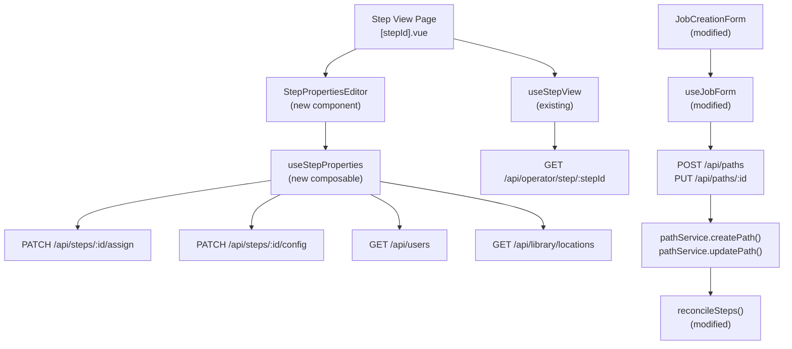
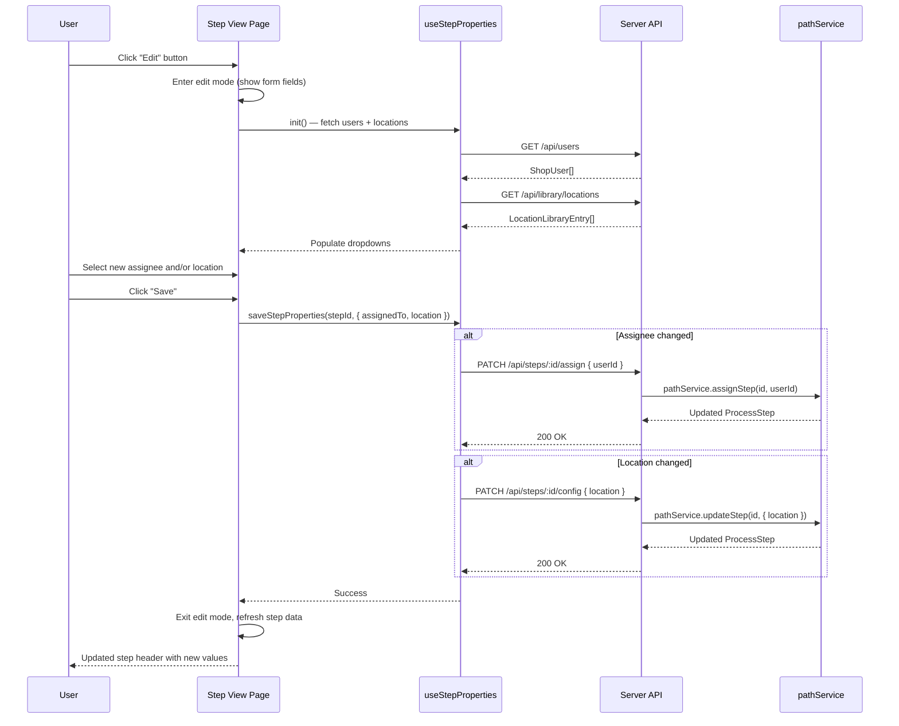

# Design Document: Edit Step Properties on Step Page

## Overview

This feature addresses **GitHub Issue #93** — enabling users to edit step properties (assignee and location) in two places:

1. **Step View page** (`/parts/step/[stepId]`) — inline edit mode for assignee and location on the step detail page, where operators most frequently interact with steps.
2. **Job create/edit form** (`JobCreationForm`) — add an Assignee column to the step grid so users can batch-assign operators when building or editing paths.

The existing backend already supports `PATCH /api/steps/:id/assign` and `PATCH /api/steps/:id/config` endpoints via `pathService.assignStep()` and `pathService.updateStep()`. For the Step View page, the frontend work centers on adding an inline edit mode to the step header. For the path editor, the `StepDraft` type, `StepInput` server type, and `reconcileSteps()` function need to be extended to carry `assignedTo` through the create/edit flow.

## Architecture



## Sequence Diagrams

### Edit Step Properties Flow



## Components and Interfaces

### Component: StepPropertiesEditor (new)

**Purpose**: Inline edit form for step assignee and location, displayed in the step header area when edit mode is active.

**Interface**:
```typescript
// Props
interface StepPropertiesEditorProps {
  stepId: string
  currentAssignedTo?: string   // current user ID or undefined
  currentLocation?: string     // current location string or undefined
}

// Emits
interface StepPropertiesEditorEmits {
  (e: 'saved'): void           // emitted after successful save
  (e: 'cancel'): void          // emitted when user cancels edit
}
```

**Responsibilities**:
- Render assignee dropdown (populated from `useOperatorIdentity.activeUsers`)
- Render location dropdown (populated from `useLibrary.locations`)
- Allow clearing assignee (set to null) or location (set to empty)
- Call appropriate API endpoints on save
- Show loading state during save
- Show toast on success/error
- Emit `saved` to trigger parent data refresh

### Component: Step View Page (modified — `[stepId].vue`)

**Purpose**: Add an "Edit" button to the step header that toggles the `StepPropertiesEditor` inline.

**Changes**:
- Add `editing` ref (boolean) to toggle edit mode
- Add "Edit" icon button next to step name in header
- When `editing` is true, replace the static assignee/location display with `StepPropertiesEditor`
- On `saved` emit: set `editing = false`, call `fetchStep()` to refresh
- On `cancel` emit: set `editing = false`

### Component: JobCreationForm (modified — add Assignee column)

**Purpose**: Add an Assignee dropdown column to the step grid in the path editor, enabling batch assignment during job creation and editing.

**Changes to step grid layout**:
- Current grid: `grid-cols-[2rem_1fr_1fr_5rem_9rem_4.5rem_2rem]` → `#, Process, Location, Optional, Dependency, Move, Remove`
- New grid: `grid-cols-[2rem_1fr_1fr_1fr_5rem_9rem_4.5rem_2rem]` → `#, Process, Location, Assignee, Optional, Dependency, Move, Remove`

**New column**:
- Header label: "Assignee"
- Field: `USelect` dropdown populated from `useUsers()` composable (list of `ShopUser`)
- Bound to `step.assignedTo`
- Includes an empty/unassigned option (e.g., `{ label: 'Unassigned', value: '' }`)
- Displays user `displayName` in the dropdown items

**Changes to useJobForm.ts**:
- `StepDraft` interface: add `assignedTo: string` field (default `''`)
- `createStepDraft()`: add `assignedTo: overrides?.assignedTo ?? ''`
- `hasPathChanges()`: add `assignedTo` comparison in the step diff loop
- When hydrating from existing job (edit mode): populate `assignedTo` from `ProcessStep.assignedTo ?? ''`
- `submit()` for create/update: include `assignedTo` in the step payload sent to the API (map `'' → undefined` to omit empty values)

**Changes to useJobForm submit payload**:
```typescript
// When building the steps array for API submission:
steps: path.steps.map(s => ({
  id: s._existingStepId,       // for edit mode reconciliation
  name: s.name.trim(),
  location: s.location.trim() || undefined,
  assignedTo: s.assignedTo || undefined,  // NEW — '' maps to undefined (unassigned)
  optional: s.optional,
  dependencyType: s.dependencyType,
}))
```

## Data Models

### ProcessStep (existing — no changes)

```typescript
interface ProcessStep {
  id: string
  name: string
  order: number
  location?: string        // editable via this feature
  assignedTo?: string      // editable via this feature (user ID)
  optional: boolean
  dependencyType: 'physical' | 'preferred' | 'completion_gate'
  removedAt?: string
  completedCount: number
}
```

### StepInput (modified — add `assignedTo`)

The server-side `StepInput` type used by `reconcileSteps()` during path create/update needs `assignedTo`:

```typescript
// server/types/domain.ts
export interface StepInput {
  id?: string
  name: string
  location?: string
  assignedTo?: string       // NEW — user ID or undefined (unassigned)
  optional?: boolean
  dependencyType?: 'physical' | 'preferred' | 'completion_gate'
}
```

### StepDraft (modified — add `assignedTo`)

The client-side `StepDraft` type in `useJobForm.ts` needs `assignedTo`:

```typescript
// app/composables/useJobForm.ts
export interface StepDraft {
  _clientId: string
  _existingStepId?: string
  name: string
  location: string
  assignedTo: string        // NEW — user ID or '' (unassigned)
  optional: boolean
  dependencyType: 'physical' | 'preferred' | 'completion_gate'
}
```

### reconcileSteps() (modified — accept `assignedTo` from input)

Currently `reconcileSteps()` always preserves `existing.assignedTo` for updated steps and omits it for new steps. It needs to accept `assignedTo` from the input:

```typescript
// For toUpdate: use input.assignedTo if provided, otherwise preserve existing
toUpdate.push({
  id: existing.id,
  name: input.name,
  order: i,
  location: input.location,
  assignedTo: input.assignedTo ?? existing.assignedTo,  // CHANGED — was: existing.assignedTo
  optional: input.optional ?? false,
  dependencyType: input.dependencyType ?? 'preferred',
  completedCount: existing.completedCount,
})

// For toInsert: use input.assignedTo if provided
toInsert.push({
  id: generateId('step'),
  name: input.name,
  order: i,
  location: input.location,
  assignedTo: input.assignedTo,                         // NEW
  optional: input.optional ?? false,
  dependencyType: input.dependencyType ?? 'preferred',
  completedCount: 0,
})
```

### hasPathChanges() (modified — compare `assignedTo`)

The change detection function in `useJobForm.ts` needs to compare `assignedTo`:

```typescript
// Add to the step comparison loop:
if ((s.assignedTo?.trim() || '') !== (o.assignedTo || '')) return true
```

### WorkQueueJob (existing — already has needed fields)

```typescript
interface WorkQueueJob {
  // ... existing fields ...
  stepLocation?: string    // already present
  assignedTo?: string      // already present
}
```

### API Extension: Location Update via Config Endpoint

The existing `PATCH /api/steps/:id/config` endpoint currently only accepts `optional` and `dependencyType`. It needs to be extended to also accept `location`:

```typescript
// server/api/steps/[id]/config.patch.ts — updated body handling
const body = await readBody(event)
const update: Record<string, unknown> = {}

if (typeof body.optional === 'boolean') update.optional = body.optional
if (typeof body.location === 'string') update.location = body.location  // NEW
if (body.dependencyType && ['physical', 'preferred', 'completion_gate'].includes(body.dependencyType)) {
  update.dependencyType = body.dependencyType
}
```

This is safe because `pathService.updateStep()` already does a generic `{ ...existing, ...partial }` merge and the repository `updateStep()` already writes the `location` column.

## Algorithmic Pseudocode

### Save Step Properties Algorithm

```typescript
async function saveStepProperties(
  stepId: string,
  changes: { assignedTo?: string | null, location?: string | null },
  original: { assignedTo?: string, location?: string }
): Promise<{ success: boolean, error?: string }> {
  // Precondition: stepId is non-empty
  // Precondition: at least one field differs from original

  const assigneeChanged = changes.assignedTo !== (original.assignedTo ?? null)
  const locationChanged = changes.location !== (original.location ?? null)

  if (!assigneeChanged && !locationChanged) {
    return { success: true } // no-op
  }

  try {
    // Update assignee if changed
    if (assigneeChanged) {
      await $fetch(`/api/steps/${stepId}/assign`, {
        method: 'PATCH',
        body: { userId: changes.assignedTo ?? null },
      })
    }

    // Update location if changed
    if (locationChanged) {
      await $fetch(`/api/steps/${stepId}/config`, {
        method: 'PATCH',
        body: { location: changes.location ?? '' },
      })
    }

    return { success: true }
  } catch (e) {
    return { success: false, error: e?.data?.message ?? e?.message ?? 'Save failed' }
  }
}
```

**Preconditions:**
- `stepId` is a valid, non-empty step ID referencing an active (non-soft-deleted) step
- `changes` contains at least one field that differs from `original`

**Postconditions:**
- If successful: the step's `assignedTo` and/or `location` fields are updated in the database
- If assignee is set to a user ID: that user exists and is active
- If assignee is set to null: the step becomes unassigned
- The step's other fields (name, order, optional, dependencyType) are unchanged
- Returns `{ success: true }` on success, `{ success: false, error }` on failure

**Loop Invariants:** N/A (no loops)

## Key Functions with Formal Specifications

### useStepProperties composable

```typescript
function useStepProperties(stepId: string) {
  // State
  const saving: Ref<boolean>
  const error: Ref<string | null>

  // Methods
  async function updateAssignee(userId: string | null): Promise<boolean>
  async function updateLocation(location: string): Promise<boolean>
  async function saveAll(changes: { assignedTo?: string | null, location?: string }): Promise<boolean>

  return { saving, error, updateAssignee, updateLocation, saveAll }
}
```

**updateAssignee(userId)**
- Preconditions: `userId` is null (unassign) or a valid active user ID
- Postconditions: Step's `assignedTo` is updated; returns true on success
- Side effects: PATCH request to `/api/steps/:id/assign`

**updateLocation(location)**
- Preconditions: `location` is a string (may be empty to clear)
- Postconditions: Step's `location` is updated; returns true on success
- Side effects: PATCH request to `/api/steps/:id/config`

**saveAll(changes)**
- Preconditions: At least one field in `changes` is provided
- Postconditions: All provided fields are updated; returns true only if all updates succeed
- Side effects: Up to 2 PATCH requests (assign + config)

## Example Usage

```typescript
// In StepPropertiesEditor.vue <script setup>
const props = defineProps<{
  stepId: string
  currentAssignedTo?: string
  currentLocation?: string
}>()

const emit = defineEmits<{
  saved: []
  cancel: []
}>()

const { activeUsers } = useOperatorIdentity()
const { locations, fetchLocations } = useLibrary()

const selectedUserId = ref<string | null>(props.currentAssignedTo ?? null)
const selectedLocation = ref(props.currentLocation ?? '')
const saving = ref(false)

onMounted(() => fetchLocations())

async function handleSave() {
  saving.value = true
  try {
    const assigneeChanged = selectedUserId.value !== (props.currentAssignedTo ?? null)
    const locationChanged = selectedLocation.value !== (props.currentLocation ?? '')

    if (assigneeChanged) {
      await $fetch(`/api/steps/${props.stepId}/assign`, {
        method: 'PATCH',
        body: { userId: selectedUserId.value },
      })
    }
    if (locationChanged) {
      await $fetch(`/api/steps/${props.stepId}/config`, {
        method: 'PATCH',
        body: { location: selectedLocation.value },
      })
    }

    emit('saved')
  } catch (e) {
    useToast().add({ title: 'Save failed', description: e?.message, color: 'error' })
  } finally {
    saving.value = false
  }
}
```

```vue
<!-- In [stepId].vue — toggling edit mode -->
<template>
  <!-- Step header (read mode) -->
  <div v-if="!editing" class="flex items-center gap-2">
    <h1>{{ job.stepName }}</h1>
    <UButton size="xs" variant="ghost" icon="i-lucide-pencil" @click="editing = true" />
    <span v-if="job.stepLocation">📍 {{ job.stepLocation }}</span>
    <span v-if="job.assignedTo">👤 {{ resolvedAssigneeName }}</span>
  </div>

  <!-- Step header (edit mode) -->
  <StepPropertiesEditor
    v-else
    :step-id="job.stepId"
    :current-assigned-to="job.assignedTo"
    :current-location="job.stepLocation"
    @saved="onSaved"
    @cancel="editing = false"
  />
</template>
```

## Correctness Properties

1. **Idempotent save (Step View)**: Saving the same assignee and location values that are already set produces no API calls and no state change.
2. **Assignee validation**: Setting `assignedTo` to a user ID that doesn't exist or is inactive results in a 400 error from the API (enforced by `pathService.assignStep`).
3. **Location passthrough**: Any string value (including empty string) is accepted for location — the location library is a suggestion list, not a constraint.
4. **Independent updates (Step View)**: Changing only the assignee does not affect the location, and vice versa. Each field is updated via a separate API call.
5. **Refresh consistency**: After a successful save, `fetchStep()` returns the updated `assignedTo` and `stepLocation` values in the `WorkQueueJob` response.
6. **No side effects on other step fields**: Updating assignee or location does not modify `name`, `order`, `optional`, `dependencyType`, or `completedCount`.
7. **Path editor round-trip (create)**: Creating a job with steps that have `assignedTo` set results in steps stored with the correct `assignedTo` values.
8. **Path editor round-trip (edit)**: Editing a path and changing a step's `assignedTo` updates only that step's assignment; other steps retain their existing `assignedTo`.
9. **reconcileSteps preserves assignee when not provided**: If `StepInput.assignedTo` is `undefined`, `reconcileSteps()` preserves the existing step's `assignedTo` (backward compatible).
10. **Empty assignee maps to unassigned**: An empty string `assignedTo` in `StepDraft` maps to `undefined` in the API payload, resulting in no assignment.

## Error Handling

### Error Scenario 1: Invalid User ID

**Condition**: User selects an assignee whose account was deactivated between page load and save
**Response**: `pathService.assignStep` throws `ValidationError("User not found or inactive")` → API returns 400
**Recovery**: Toast error message; edit mode stays open so user can pick a different assignee

### Error Scenario 2: Step Not Found (Deleted During Edit)

**Condition**: Step was soft-deleted (path edited) while user had edit mode open
**Response**: `pathService.updateStep` throws `NotFoundError` → API returns 404
**Recovery**: Toast error; redirect back to parts view or show "step not found" state

### Error Scenario 3: Network Failure

**Condition**: Network error during PATCH request
**Response**: `$fetch` throws with no `response` object
**Recovery**: Toast with generic error message; edit mode stays open for retry

### Error Scenario 4: Partial Save (Assignee Succeeds, Location Fails)

**Condition**: Assignee PATCH succeeds but location PATCH fails
**Response**: Assignee is updated in DB but location is not; error toast shown
**Recovery**: On retry, assignee PATCH is a no-op (idempotent — same value), location PATCH retries. User can also cancel and re-enter edit mode to see the partially-updated state.

## Testing Strategy

### Unit Testing Approach

- Test `StepPropertiesEditor` component: renders dropdowns, emits `saved`/`cancel`, shows loading state
- Test that the config endpoint accepts `location` field in the request body
- Test `pathService.updateStep` with location-only partial update
- Test `reconcileSteps()` with `assignedTo` in input: verify it flows through to `toUpdate` and `toInsert`
- Test `reconcileSteps()` without `assignedTo` in input: verify existing `assignedTo` is preserved (backward compat)
- Test `hasPathChanges()` detects `assignedTo` changes between draft and original
- Test `createStepDraft()` defaults `assignedTo` to `''`

### Property-Based Testing Approach

**Property Test Library**: fast-check

- **CP-ESP-1: Save idempotence** — For any step with assignee A and location L, saving `{ assignedTo: A, location: L }` produces zero API calls
- **CP-ESP-2: Independent field updates** — For any combination of (assignee changed, location changed), only the corresponding API endpoint(s) are called
- **CP-ESP-3: Assignee validation round-trip** — For any valid active user ID, `assignStep(stepId, userId)` followed by `getStepById(stepId)` returns a step with `assignedTo === userId`
- **CP-ESP-4: reconcileSteps assignedTo passthrough** — For any `StepInput[]` with `assignedTo` values, `reconcileSteps()` output steps carry the same `assignedTo` values
- **CP-ESP-5: reconcileSteps assignedTo preservation** — For any `StepInput[]` without `assignedTo`, `reconcileSteps()` preserves the existing step's `assignedTo`

### Integration Testing Approach

- End-to-end: create a job with a path, PATCH the step's assignee and location, verify the step view API returns updated values
- Verify partial save recovery: PATCH assignee, then verify location is unchanged
- Create a job with steps that have `assignedTo` set, verify the steps are stored with correct assignments
- Edit a path: change one step's `assignedTo`, verify only that step is updated

## Performance Considerations

- The edit form fetches users and locations on mount. Both lists are already cached in their respective composables (`useOperatorIdentity`, `useLibrary`) from prior page interactions, so no redundant network calls in the common case.
- Save makes at most 2 sequential PATCH requests (assignee + location). These are lightweight single-row UPDATE statements on SQLite — sub-millisecond.

## Security Considerations

- No authorization gate on step property editing — consistent with the existing assign/config endpoints which are open to all users. The app uses kiosk-mode identity (no passwords).
- The assignee endpoint validates that the target user exists and is active, preventing assignment to deactivated users.

## Dependencies

- Existing: `useOperatorIdentity` (user list), `useLibrary` (location list), `useStepView` (step data)
- Existing API: `PATCH /api/steps/:id/assign`, `PATCH /api/steps/:id/config`
- Modified: `useJobForm` (add `assignedTo` to `StepDraft`), `reconcileSteps()` (accept `assignedTo` from input), `StepInput` (add `assignedTo` field)
- Modified: `JobCreationForm.vue` (add Assignee column to step grid)
- Modified: `server/api/steps/[id]/config.patch.ts` (accept `location` field)
- UI: Nuxt UI `USelect` for dropdowns, `UButton` for edit/save/cancel
