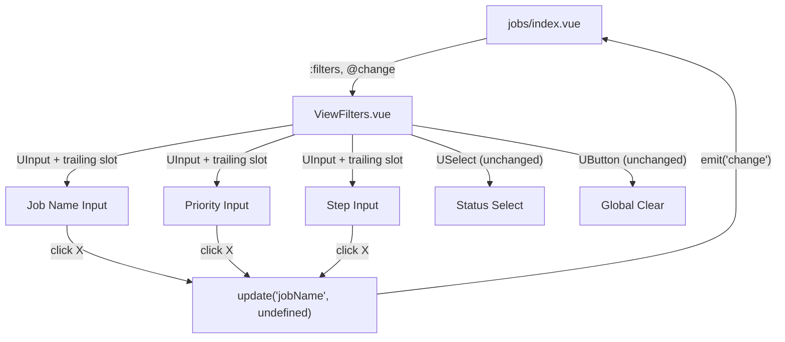
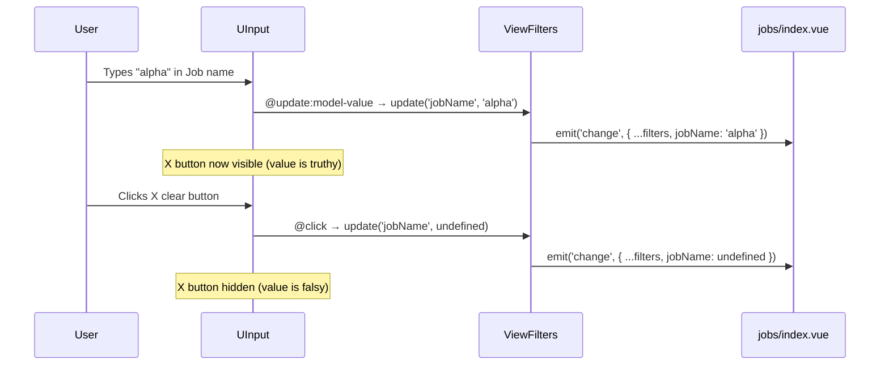

# Design Document: Filter Clear Buttons

## Overview

The ViewFilters component on the Jobs page provides text inputs for Job name, Priority, and Step filters, but lacks per-input clear buttons. Users must either use the global "Clear" link (which resets all filters) or manually select and delete text. This feature adds an X icon button inside each UInput that appears only when the input has a value, enabling one-click clearing of individual filters. The USelect for status is excluded since it already has a meaningful default ("All").

This is a purely frontend change scoped to the `ViewFilters.vue` component. No backend, API, or data model changes are required.

## Architecture

The change is contained within the existing component hierarchy. No new components or composables are introduced.



## Sequence Diagram



## Components and Interfaces

### Component: ViewFilters.vue (modified)

**Purpose**: Renders the filter bar with text inputs and status select. Each text input gains a conditional clear button via UInput's `#trailing` slot.

**Interface** (unchanged):
```typescript
// Props
interface ViewFiltersProps {
  filters: FilterState
}

// Emits
interface ViewFiltersEmits {
  change: [filters: FilterState]
}
```

**Existing `update` function** (reused, no changes):
```typescript
function update<K extends keyof FilterState>(key: K, value: FilterState[K]) {
  const next = { ...props.filters, [key]: value }
  emit('change', next)
}
```

**Responsibilities**:
- Render a clear (X) button inside each UInput's trailing slot when the input has a non-empty value
- Clicking the X button calls `update(key, undefined)` to clear that specific filter
- The clear button must not appear when the input is empty
- The global "Clear" button behavior remains unchanged

### Data Models

No new types. The existing `FilterState` interface is unchanged:

```typescript
interface FilterState {
  jobName?: string
  jiraTicketKey?: string
  stepName?: string
  assignee?: string
  priority?: string
  label?: string
  status?: 'active' | 'completed' | 'all'
}
```

## Key Functions with Formal Specifications

### Trailing Slot Visibility Logic

```typescript
// Condition for showing the clear button on each input
// Expressed as a computed/inline check per input field
const showClear = (value: string | undefined): boolean => !!value
```

**Preconditions:**
- `value` is the current model-value of the UInput (string or undefined)

**Postconditions:**
- Returns `true` if and only if `value` is a non-empty string
- Returns `false` for `undefined`, `null`, or `''`

### Clear Button Click Handler

```typescript
// Each clear button calls the existing update() with undefined
// e.g., for Job name input:
update('jobName', undefined)
```

**Preconditions:**
- The clear button is only rendered when the field has a truthy value
- The `update` function and `emit('change')` are available

**Postconditions:**
- The specific filter key is set to `undefined` in the emitted FilterState
- Other filter keys remain unchanged
- The input visually clears and the X button disappears

**Loop Invariants:** N/A


## Algorithmic Pseudocode

### UInput Trailing Slot Pattern

Nuxt UI 4's `UInput` exposes a `#trailing` slot that renders content in the trailing position (right side) of the input. When the slot is used, Nuxt UI automatically applies trailing padding to the input text so it doesn't overlap the slot content.

```typescript
// Template pattern for each clearable input:
// <UInput ...existing-props...>
//   <template #trailing>
//     <UButton
//       v-if="!!filters.fieldName"
//       icon="i-lucide-x"
//       color="neutral"
//       variant="link"
//       size="xs"       // matches sm input's trailing icon size (size-4)
//       :padded="false"
//       @click="update('fieldName', undefined)"
//       aria-label="Clear field name filter"
//     />
//   </template>
// </UInput>
```

### Algorithm: Render Clear Button

```
ALGORITHM renderClearButton(fieldKey, fieldValue)
INPUT: fieldKey ∈ keyof FilterState, fieldValue ∈ string | undefined
OUTPUT: UButton element or nothing

BEGIN
  IF fieldValue IS truthy (non-empty string) THEN
    RENDER UButton with:
      icon = "i-lucide-x"
      color = "neutral"
      variant = "link"
      size = "xs"
      padded = false
      aria-label = "Clear {fieldLabel} filter"
      onClick = update(fieldKey, undefined)
  ELSE
    RENDER nothing
  END IF
END
```

**Preconditions:**
- fieldKey is a valid key of FilterState
- fieldValue matches the current filter value for that key

**Postconditions:**
- Clear button is visible if and only if fieldValue is truthy
- Clicking the button sets the filter to undefined without affecting other filters

## Example Usage

```vue
<!-- Before: UInput without clear button -->
<UInput
  :model-value="filters.jobName ?? ''"
  size="sm"
  placeholder="Job name"
  icon="i-lucide-briefcase"
  class="w-36"
  @update:model-value="update('jobName', ($event as string) || undefined)"
/>

<!-- After: UInput with conditional clear button in trailing slot -->
<UInput
  :model-value="filters.jobName ?? ''"
  size="sm"
  placeholder="Job name"
  icon="i-lucide-briefcase"
  class="w-36"
  @update:model-value="update('jobName', ($event as string) || undefined)"
>
  <template #trailing>
    <UButton
      v-if="filters.jobName"
      icon="i-lucide-x"
      color="neutral"
      variant="link"
      size="xs"
      :padded="false"
      @click="update('jobName', undefined)"
      aria-label="Clear job name filter"
    />
  </template>
</UInput>
```

## Correctness Properties

*A property is a characteristic or behavior that should hold true across all valid executions of a system — essentially, a formal statement about what the system should do. Properties serve as the bridge between human-readable specifications and machine-verifiable correctness guarantees.*

### Property 1: Clear button visibility invariant

*For any* filter field key in {jobName, priority, stepName} and *for any* FilterState, the Clear_Button for that field is rendered if and only if the corresponding filter value is a non-empty string. When the value is empty, undefined, or null, no Clear_Button is rendered.

**Validates: Requirements 1.1, 1.2, 1.3, 1.4**

### Property 2: Single-field clear isolation

*For any* FilterState and *for any* clearable field key, clicking the Clear_Button for that field produces a new FilterState where that field is undefined and all other fields retain their original values.

**Validates: Requirements 2.1, 2.2, 2.3**

### Property 3: Global clear resets all filters

*For any* starting FilterState, clicking the Global_Clear button produces a FilterState equal to `{ status: 'all' }` with all other fields undefined.

**Validates: Requirements 3.1, 3.2**

### Property 4: Clear button accessibility labels

*For any* clearable filter field that has a non-empty value, the rendered Clear_Button has an aria-label attribute that describes which filter it clears.

**Validates: Requirement 5.1**

### Property 5: Manual delete and button click equivalence

*For any* FilterState and *for any* clearable field key with a non-empty value, manually deleting all text from the input (producing an empty string) results in the same emitted FilterState as clicking the Clear_Button for that field.

**Validates: Requirement 6.3**

## Error Handling

### Error Scenario 1: Empty string vs undefined

**Condition**: UInput emits `''` (empty string) when user deletes all text manually
**Response**: The existing `($event as string) || undefined` coercion already converts `''` to `undefined`
**Recovery**: No change needed — the clear button and manual deletion produce the same FilterState

### Error Scenario 2: Rapid clicking

**Condition**: User clicks the clear button multiple times quickly
**Response**: Each click calls `update(key, undefined)` which is idempotent — setting an already-undefined field to undefined is harmless
**Recovery**: Vue's reactivity batches updates; no race conditions possible

## Testing Strategy

### Unit Testing Approach

Extend the existing `tests/unit/composables/useViewFilters.test.ts` with tests verifying:
- Clearing a single filter field leaves other fields intact
- Clearing an already-undefined field is a no-op

The existing test suite already covers `updateFilter`, `clearFilters`, and `applyFilters` — the clear button simply calls `update(key, undefined)` which is already tested.

### Component Testing Approach

Add a test file `tests/unit/components/ViewFiltersClearButton.test.ts` to verify:
- Clear button renders when filter value is non-empty
- Clear button does not render when filter value is empty/undefined
- Clicking clear button emits correct change event with that field set to undefined
- Other filter values are preserved when one field is cleared
- Each clear button has correct aria-label

### Property-Based Testing Approach

**Property Test Library**: fast-check

Property: For any combination of filter values, clearing one field produces a FilterState where only that field is undefined and all others are unchanged.

```typescript
fc.property(
  fc.record({
    jobName: fc.option(fc.string({ minLength: 1 }), { nil: undefined }),
    priority: fc.option(fc.string({ minLength: 1 }), { nil: undefined }),
    stepName: fc.option(fc.string({ minLength: 1 }), { nil: undefined }),
    status: fc.constantFrom('all', 'active', 'completed') as fc.Arbitrary<'all' | 'active' | 'completed'>
  }),
  fc.constantFrom('jobName', 'priority', 'stepName') as fc.Arbitrary<'jobName' | 'priority' | 'stepName'>,
  (filters, keyToClear) => {
    const next = { ...filters, [keyToClear]: undefined }
    // Cleared field is undefined
    expect(next[keyToClear]).toBeUndefined()
    // Other fields unchanged
    for (const k of ['jobName', 'priority', 'stepName', 'status'] as const) {
      if (k !== keyToClear) expect(next[k]).toBe(filters[k])
    }
  }
)
```

## Dependencies

- **Nuxt UI 4.3.0**: `UInput` `#trailing` slot, `UButton` component (already in use)
- **@iconify-json/lucide**: `i-lucide-x` icon (already used by the global Clear button)
- No new dependencies required
