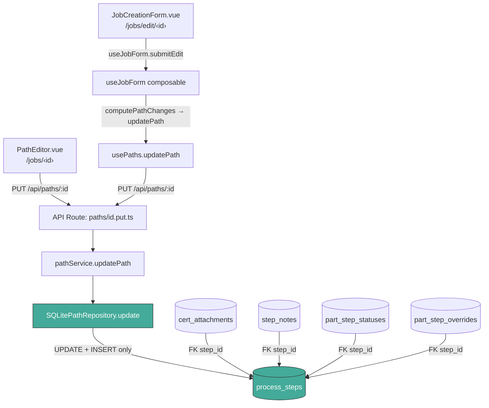
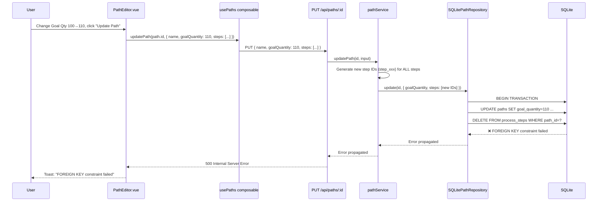
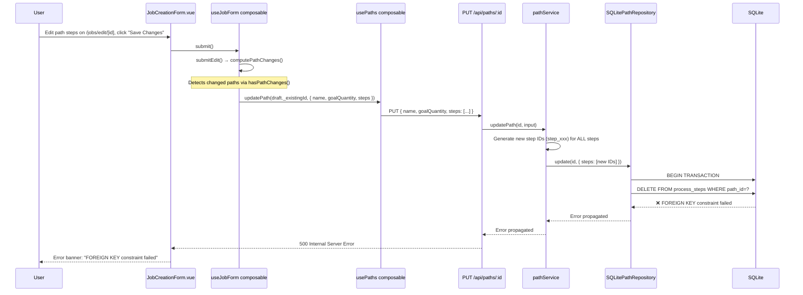
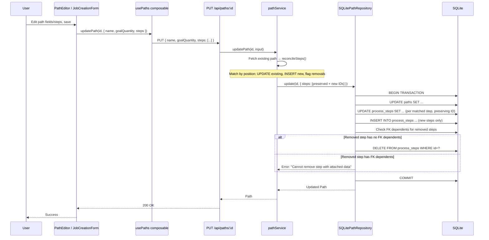

# Design Document: Fix FOREIGN KEY Constraint on Path Update (GitHub Issue #9)

## Overview

When a user edits a Path — either inline on the Job Detail page (`/jobs/[id]`) via `PathEditor.vue`, or through the Job Edit page (`/jobs/edit/[id]`) via `JobCreationForm.vue` — the server returns a `FOREIGN KEY constraint failed` error. This is **GitHub Issue #9**.

There are two independent entry points that trigger the same bug:

1. **PathEditor** (Job Detail page): User clicks "Edit" on a path card, changes fields (goal qty, location, step name), clicks "Update Path". `PathEditor.vue` → `usePaths().updatePath()` → `PUT /api/paths/:id` → `pathService.updatePath()` → `pathRepository.update()`.

2. **JobCreationForm** (Job Edit page): User navigates to `/jobs/edit/[id]`, modifies paths/steps, clicks "Save Changes". `JobCreationForm.vue` → `useJobForm().submitEdit()` → `computePathChanges()` detects changed paths → `usePaths().updatePath()` for each changed path → same `PUT /api/paths/:id` → `pathService.updatePath()` → `pathRepository.update()`.

Both flows converge at `pathService.updatePath()`, which generates fresh step IDs via `generateId('step')` for every step, then passes them to `SQLitePathRepository.update()`. The repository executes `DELETE FROM process_steps WHERE path_id = ?` followed by `INSERT` of new rows. Four tables hold FK references to `process_steps(id)` without `ON DELETE CASCADE`:

- `cert_attachments.step_id` → `REFERENCES process_steps(id)`
- `step_notes.step_id` → `REFERENCES process_steps(id)`
- `part_step_statuses.step_id` → `REFERENCES process_steps(id)`
- `part_step_overrides.step_id` → `REFERENCES process_steps(id)`

SQLite's `PRAGMA foreign_keys = ON` correctly rejects the delete when any child rows exist.

**Design approach**: Instead of delete-and-recreate, shift to an UPDATE-in-place + INSERT-only strategy. Existing steps at matching positions get UPDATEd (preserving their IDs and all FK references). New steps beyond the existing count get INSERTed. Steps that were removed are only DELETEd if they have zero FK dependents; otherwise a clear error is raised. The key insight: never delete steps that have data attached.

## Architecture



## Sequence Diagram: Entry Point 1 — PathEditor (Job Detail Page)

### Current (Broken) Flow



## Sequence Diagram: Entry Point 2 — JobCreationForm (Job Edit Page)

### Current (Broken) Flow



## Sequence Diagram: Fixed Flow (Both Entry Points)



## Components and Interfaces

### Component 1: pathService.updatePath (Service Layer)

**Purpose**: Map incoming step drafts to existing step IDs so the repository can update in-place rather than delete-and-recreate.

**Current behavior**: Always generates new step IDs via `generateId('step')` for every step in `input.steps`, discarding existing IDs. This is the root cause — both `PathEditor.vue` and `useJobForm.submitEdit()` send steps without server-side IDs, so the service blindly creates new ones.

**Fixed behavior**:

- Fetch existing path to get current step IDs and count
- Match input steps to existing steps by position (order index)
- Reuse existing `step.id` for positions `0..min(existingCount, inputCount)-1` → these become UPDATEs
- Generate new IDs only for positions `existingCount..inputCount-1` → these become INSERTs
- Positions `inputCount..existingCount-1` (removed steps) → check for FK dependents before allowing DELETE
- Never delete a step that has cert_attachments, step_notes, part_step_statuses, or part_step_overrides

**Interface** (unchanged):

```typescript
updatePath(id: string, input: UpdatePathInput): Path
```

**Responsibilities**:

- Fetch existing path to get current step IDs
- Call `reconcileSteps()` to produce the update/insert/delete plan
- Pass reconciled steps (with correct IDs) to the repository
- Surface clear errors when step removal is blocked by FK dependents

### Component 2: SQLitePathRepository.update (Repository Layer)

**Purpose**: Persist path and step changes using UPDATE/INSERT/conditional-DELETE instead of bulk delete-and-recreate.

**Current behavior**: `DELETE FROM process_steps WHERE path_id = ?` then re-insert all steps with new IDs.

**Fixed behavior**: Three-phase approach within a single transaction:

1. **UPDATE** existing steps that are being kept (matched by ID) — preserves all FK references
2. **INSERT** new steps that were appended beyond the existing count
3. **DELETE** only steps that were removed AND have zero FK dependents — check before deleting

**Interface** (unchanged):

```typescript
update(id: string, partial: Partial<Path>): Path
```

**Responsibilities**:

- Update path-level fields (name, goalQuantity, advancementMode)
- For each step with an existing ID: UPDATE in place (name, location, step_order, optional, dependency_type)
- For each step with a new ID: INSERT into process_steps
- For removed step IDs: check FK dependents, DELETE only if safe, error otherwise
- Handle `UNIQUE(path_id, step_order)` constraint via temporary negative order values during reordering

### Component 3: PathEditor.vue (Entry Point 1)

**Purpose**: Inline path editing on the Job Detail page (`/jobs/[id]`).

**Current behavior**: Sends all steps as plain objects (name, location, optional, dependencyType) without IDs. The service generates new IDs for all of them.

**No changes needed**: The fix is entirely server-side. PathEditor already sends the correct shape — the service just needs to stop generating new IDs for existing positions.

### Component 4: useJobForm composable (Entry Point 2)

**Purpose**: Job editing on `/jobs/edit/[id]`. The `submitEdit()` method calls `computePathChanges()` to detect which paths changed, then calls `updatePath()` for each changed path.

**Current behavior**: `submitEdit()` → `computePathChanges()` → for each `toUpdate` draft, calls `usePaths().updatePath(draft._existingId, { steps: [...] })`. Steps are sent as plain objects without server-side IDs, same as PathEditor.

**No changes needed**: The fix is entirely server-side. The composable correctly detects changes via `hasPathChanges()` and sends the right payload — the service just needs to reconcile IDs.

**Call chain**: `JobCreationForm.vue` → `useJobForm(mode='edit', existingJob)` → `submit()` → `submitEdit()` → `computePathChanges(originalPaths, pathDrafts)` → `updatePath(draft._existingId!, { name, goalQuantity, advancementMode, steps })` → `PUT /api/paths/:id`

## Data Models

### Existing Schema (unchanged)

```sql
-- process_steps: no ON DELETE CASCADE from referencing tables
CREATE TABLE process_steps (
  id TEXT PRIMARY KEY,
  path_id TEXT NOT NULL REFERENCES paths(id) ON DELETE CASCADE,
  name TEXT NOT NULL,
  step_order INTEGER NOT NULL,
  location TEXT,
  optional INTEGER NOT NULL DEFAULT 0,
  dependency_type TEXT NOT NULL DEFAULT 'preferred',
  UNIQUE(path_id, step_order)
);

-- These four tables reference process_steps(id) WITHOUT ON DELETE CASCADE:
-- cert_attachments.step_id REFERENCES process_steps(id)
-- step_notes.step_id REFERENCES process_steps(id)
-- part_step_statuses.step_id REFERENCES process_steps(id)
-- part_step_overrides.step_id REFERENCES process_steps(id)
```

### Step Reconciliation Model

```typescript
interface StepReconciliation {
  toUpdate: ProcessStep[] // Existing steps matched by position → UPDATE in place (preserve IDs)
  toInsert: ProcessStep[] // New steps beyond existing count → INSERT (append)
  toDelete: string[] // Old step IDs no longer present → DELETE only if no FK dependents
}
```

## Key Functions with Formal Specifications

### Function 1: reconcileSteps()

```typescript
function reconcileSteps(
  existingSteps: ProcessStep[],
  inputSteps: { name: string; location?: string; optional?: boolean; dependencyType?: string }[]
): StepReconciliation
```

**Preconditions:**

- `existingSteps` is a valid array (may be empty for new paths)
- `inputSteps` is a non-empty array (validated by service before calling)
- `existingSteps` are sorted by `order` ascending

**Postconditions:**

- `toUpdate.length + toInsert.length === inputSteps.length`
- `toUpdate` steps preserve their original `id` from `existingSteps`
- `toInsert` steps have freshly generated IDs
- `toDelete` contains IDs from `existingSteps` that are not in `toUpdate`
- All steps in `toUpdate` and `toInsert` have correct `order` values (0-indexed, sequential)
- No ID appears in both `toUpdate` and `toDelete`

**Loop Invariants:**

- For `i` in `0..inputSteps.length`: if `i < existingSteps.length`, step is in `toUpdate`; otherwise in `toInsert`
- `toDelete = existingSteps[inputSteps.length..].map(s => s.id)`

### Function 2: hasStepDependents() (new helper in repository)

```typescript
hasStepDependents(stepId: string): boolean
```

**Preconditions:**

- `stepId` is a valid process_steps ID

**Postconditions:**

- Returns `true` if any of `cert_attachments`, `step_notes`, `part_step_statuses`, or `part_step_overrides` reference this `stepId`
- Returns `false` if the step has zero FK dependents across all four tables

### Function 3: SQLitePathRepository.update() (revised)

```typescript
update(id: string, partial: Partial<Path>): Path
```

**Preconditions:**

- Path with `id` exists in the database
- If `partial.steps` is provided, each step has a valid `id` (either existing or newly generated by reconcileSteps)
- `partial.steps` respects the `UNIQUE(path_id, step_order)` constraint after reconciliation

**Postconditions:**

- Path row is updated with new field values
- Steps in `toUpdate` have their `name`, `location`, `step_order`, `optional`, `dependency_type` updated in place (same `id`)
- Steps in `toInsert` are added to `process_steps` with new IDs
- Steps in `toDelete` are removed ONLY if `hasStepDependents()` returns false for each
- If any step in `toDelete` has FK dependents, the transaction rolls back and a `ValidationError` is thrown
- All FK references from `cert_attachments`, `step_notes`, `part_step_statuses`, `part_step_overrides` remain valid
- Transaction is atomic: all changes commit together or none do

**Loop Invariants:**

- During step_order reassignment: temporary negative orders prevent UNIQUE constraint violations
- After completion: `step_order` values are sequential 0..N-1

### Function 4: pathService.updatePath() (revised)

```typescript
updatePath(id: string, input: UpdatePathInput): Path
```

**Preconditions:**

- Same as current (name non-empty if provided, goalQuantity positive if provided, steps non-empty if provided)

**Postconditions:**

- If `input.steps` is provided: existing step IDs are preserved for matched positions (UPDATE in place)
- New step IDs are generated only for steps appended beyond the existing count (INSERT only)
- Removed steps are flagged for deletion; repository checks FK dependents before deleting
- The returned `Path` has correct step IDs that match what's in the database
- No orphaned FK references are created

## Algorithmic Pseudocode

### Step Reconciliation Algorithm

```typescript
function reconcileSteps(existingSteps: ProcessStep[], inputSteps: StepInput[]): StepReconciliation {
  const toUpdate: ProcessStep[] = []
  const toInsert: ProcessStep[] = []
  const toDelete: string[] = []

  // Phase 1: Match input steps to existing steps by position
  // Existing steps at matching positions → UPDATE in place (preserve IDs)
  // New steps beyond existing count → INSERT (append)
  for (let i = 0; i < inputSteps.length; i++) {
    const input = inputSteps[i]
    if (i < existingSteps.length) {
      // Position exists — reuse existing step ID, update fields
      toUpdate.push({
        id: existingSteps[i].id, // PRESERVE the original ID
        name: input.name,
        order: i,
        location: input.location,
        optional: input.optional ?? false,
        dependencyType: input.dependencyType ?? 'preferred',
      })
    } else {
      // New position — generate fresh ID, append
      toInsert.push({
        id: generateId('step'),
        name: input.name,
        order: i,
        location: input.location,
        optional: input.optional ?? false,
        dependencyType: input.dependencyType ?? 'preferred',
      })
    }
  }

  // Phase 2: Steps beyond new count are candidates for deletion
  // These will only be deleted if they have no FK dependents
  for (let i = inputSteps.length; i < existingSteps.length; i++) {
    toDelete.push(existingSteps[i].id)
  }

  return { toUpdate, toInsert, toDelete }
}
```

### FK Dependent Check (New Repository Helper)

```typescript
// Inside SQLitePathRepository — checks all four FK-referencing tables
hasStepDependents(stepId: string): boolean {
  const tables = [
    'cert_attachments',
    'step_notes',
    'part_step_statuses',
    'part_step_overrides',
  ]
  for (const table of tables) {
    const row = this.db.prepare(
      `SELECT 1 FROM ${table} WHERE step_id = ? LIMIT 1`
    ).get(stepId)
    if (row) return true
  }
  return false
}
```

### Repository Update Algorithm (Revised)

```typescript
// Inside SQLitePathRepository.update(), when partial.steps is provided:
this.db.transaction(() => {
  // 1. Update path-level fields
  updatePathStmt.run(
    updated.name,
    updated.goalQuantity,
    updated.advancementMode,
    updated.updatedAt,
    id
  )

  // 2. Identify which steps to update, insert, delete
  //    (reconciliation already done in service layer, steps carry correct IDs)
  const existingIds = new Set(existingStepRows.map((r) => r.id))
  const newIds = new Set(updated.steps.map((s) => s.id))
  const stepsToUpdate = updated.steps.filter((s) => existingIds.has(s.id))
  const stepsToInsert = updated.steps.filter((s) => !existingIds.has(s.id))
  const idsToDelete = [...existingIds].filter((id) => !newIds.has(id))

  // 3. Guard: check FK dependents before any deletes
  for (const stepId of idsToDelete) {
    if (this.hasStepDependents(stepId)) {
      throw new ValidationError(
        `Cannot remove step because it has associated data ` +
          `(certificates, notes, or part statuses). ` +
          `Remove the associated data first, or keep the step.`
      )
    }
  }

  // 4. Temporarily set step_order to negative values to avoid UNIQUE constraint
  //    during reordering (path_id, step_order must be unique)
  for (const step of stepsToUpdate) {
    setTempOrderStmt.run(-(step.order + 1), step.id)
  }

  // 5. Update existing steps with new field values and correct order
  for (const step of stepsToUpdate) {
    updateStepStmt.run(
      step.name,
      step.order,
      step.location ?? null,
      step.optional ? 1 : 0,
      step.dependencyType ?? 'preferred',
      step.id
    )
  }

  // 6. Insert new steps (appended positions only)
  for (const step of stepsToInsert) {
    insertStepStmt.run(
      step.id,
      id,
      step.name,
      step.order,
      step.location ?? null,
      step.optional ? 1 : 0,
      step.dependencyType ?? 'preferred'
    )
  }

  // 7. Delete removed steps (already verified no FK dependents above)
  for (const stepId of idsToDelete) {
    deleteStepStmt.run(stepId)
  }
})()
```

## Example Usage

```typescript
// Scenario 1: User changes only goalQuantity via PathEditor (steps unchanged)
// PathEditor sends: { name: "Route A", goalQuantity: 110, steps: [same steps] }
// Service: reconcileSteps matches all steps by position → toUpdate has all, toInsert/toDelete empty
// Repository: UPDATEs each step in place, no DELETE, no INSERT → no FK violation

// Scenario 2: User changes a step's location via JobCreationForm edit page
// useJobForm.submitEdit() detects change via hasPathChanges()
// Sends: { name: "Route A", goalQuantity: 100, steps: [{name:"CNC", location:"Bay 3"}] }
// Service: reconcileSteps matches step 0 → toUpdate=[{id: existing_id, location: "Bay 3"}]
// Repository: UPDATEs step row in place → FK references remain valid

// Scenario 3: User adds a new step at the end (either entry point)
// Existing: [Step A, Step B]
// Input:    [Step A, Step B, Step C]
// reconcileSteps → toUpdate=[A, B] (preserve IDs), toInsert=[C] (new ID), toDelete=[]
// Repository: UPDATE A, UPDATE B, INSERT C → clean append

// Scenario 4: User removes the last step (either entry point)
// Existing: [Step A, Step B, Step C]
// Input:    [Step A, Step B]
// reconcileSteps → toUpdate=[A, B], toInsert=[], toDelete=[C.id]
// Repository checks: hasStepDependents(C.id)?
//   If false → DELETE C → success
//   If true  → throw ValidationError → "Cannot remove step with associated data"

// Scenario 5: User reorders steps (swap Step A and Step B)
// Existing: [Step A (order 0), Step B (order 1)]
// Input:    [Step B, Step A]
// reconcileSteps → toUpdate=[{id: A.id, name: "Step B", order: 0}, {id: B.id, name: "Step A", order: 1}]
// Repository: temp negative orders → UPDATE both → correct names at correct positions
// Note: IDs are preserved by POSITION, not by name. Position 0 keeps A's ID, position 1 keeps B's ID.
// This is correct because FK references are tied to the step ID, not the step name.
```

## Correctness Properties

_A property is a characteristic or behavior that should hold true across all valid executions of a system — essentially, a formal statement about what the system should do. Properties serve as the bridge between human-readable specifications and machine-verifiable correctness guarantees._

### Property 1: Step ID Preservation

_For any_ valid path with N existing steps and M input steps where M ≥ 1, the first `min(N, M)` output steps in the toUpdate set retain their original step IDs from the existing steps. No existing step ID at a matched position is regenerated.

**Validates: Requirements 1.1, 1.2**

### Property 2: Reconciliation Completeness (Count Conservation)

_For any_ pair of existing step lists and input step lists, `|toUpdate| + |toInsert|` equals the input step count, and `|toUpdate| + |toDelete|` equals the existing step count. No step ID appears in both the toUpdate set and the toDelete set.

**Validates: Requirements 2.1, 2.2, 2.3**

### Property 3: Append-Only Inserts

_For any_ reconciliation output, all step IDs in the toInsert set are freshly generated and do not appear in the existing step ID set. The toInsert set is always disjoint from existing step IDs.

**Validates: Requirements 1.3, 2.3**

### Property 4: Sequential Order Invariant

_For any_ path update, the resulting step_order values across all steps (toUpdate and toInsert combined) form a sequential sequence from 0 to N-1 with no gaps or duplicates.

**Validates: Requirements 2.4, 5.3**

### Property 5: Idempotent Update

_For any_ valid path, updating it with its own current data (same steps, same order, same fields) produces no errors and returns a path equivalent to the original (modulo updatedAt timestamp).

**Validates: Requirements 6.1, 6.2**

### Property 6: Delete Guard

_For any_ step marked for deletion, the deletion succeeds if and only if the step has zero references across all four FK_Dependent_Tables. When a step has FK dependents, the operation raises a ValidationError (not a raw SQLite constraint error).

**Validates: Requirements 3.1, 3.2, 3.3, 8.2**

### Property 7: Field Value Preservation

_For any_ path update where steps are modified, the updated step rows in the database have field values (name, location, optional, dependencyType) matching the corresponding input step values.

**Validates: Requirements 4.1, 4.2**

### Property 8: Atomic Transaction

Either all step changes (updates, inserts, deletes) within a single path update succeed together, or none are applied. If any step deletion is blocked by FK dependents, the entire transaction rolls back.

**Validates: Requirements 4.3, 4.4**

### Property 9: Both Entry Points Converge

PathEditor (Job Detail) and JobCreationForm/useJobForm (Job Edit) both flow through the same `pathService.updatePath()` → `pathRepository.update()` path, so the fix covers both triggers with a single server-side code change.

**Validates: Requirements 7.1, 7.2, 7.3**

## Error Handling

### Error Scenario 1: Step Removal Blocked by FK Dependents

**Condition**: User removes a step (reduces step count) and the removed step has `cert_attachments`, `step_notes`, `part_step_statuses`, or `part_step_overrides` referencing it.
**Response**: The `hasStepDependents()` check fires before any DELETE. The transaction rolls back. The API returns a 400 error with a descriptive message: "Cannot remove step because it has associated data (certificates, notes, or part statuses). Remove the associated data first, or keep the step."
**Recovery**: User must either remove the associated data first, or keep the step in the path.

### Error Scenario 2: UNIQUE Constraint on step_order

**Condition**: During reordering, two steps temporarily share the same `(path_id, step_order)`.
**Response**: Avoided by using temporary negative order values during the update phase. Steps are set to `-(order + 1)` before being updated to their final order.
**Recovery**: N/A — the algorithm prevents this.

### Error Scenario 3: Concurrent Path Update

**Condition**: Two users update the same path simultaneously (one via PathEditor, one via JobCreationForm, or both via the same entry point).
**Response**: SQLite's WAL mode + transaction isolation ensures one succeeds and the other retries or fails.
**Recovery**: The failing request can be retried by the user.

### Error Scenario 4: Path Not Found

**Condition**: The path ID in the URL no longer exists (deleted between page load and save).
**Response**: `pathService.updatePath()` throws `NotFoundError`, API returns 404.
**Recovery**: User navigates back to the job and sees the current state.

## Testing Strategy

### Unit Testing Approach

- Test `reconcileSteps()` as a pure function with various input combinations:
  - Same number of steps (all updates, no inserts/deletes)
  - More input steps than existing (updates + inserts)
  - Fewer input steps than existing (updates + deletes)
  - Empty existing steps (all inserts)
  - Single step path updates

- Test `hasStepDependents()` with mocked DB:
  - Step with cert_attachments → returns true
  - Step with step_notes → returns true
  - Step with part_step_statuses → returns true
  - Step with part_step_overrides → returns true
  - Step with no dependents → returns false

- Test `pathService.updatePath()` with mocked repository:
  - Verify step IDs are preserved when steps count is unchanged
  - Verify new IDs are generated only for appended steps
  - Verify removed step IDs are passed for deletion
  - Verify both entry points (PathEditor payload shape, useJobForm payload shape) produce correct reconciliation

### Property-Based Testing Approach

**Property Test Library**: fast-check

- **P1: Step ID Preservation** — For any valid path with N existing steps and M input steps where M ≥ 1, the first `min(N, M)` output steps retain their original IDs.
- **P2: Reconciliation Completeness** — `|toUpdate| + |toInsert| = |inputSteps|` for all valid inputs.
- **P3: No Orphaned Deletes** — `toDelete` IDs are a subset of existing step IDs and disjoint from toUpdate IDs.
- **P4: Append-Only Inserts** — All IDs in `toInsert` are freshly generated and not present in `existingSteps`.

### Integration Testing Approach

- Create a path with steps, attach certs/notes/statuses to steps, then update the path (change goalQuantity, change step location). Verify no FK errors and all references remain valid.
- Create a path, add steps, then update with more steps (appending). Verify new steps are inserted and existing steps retain IDs.
- Create a path, attach data to a step, then try to remove that step. Verify the `ValidationError` is caught and reported clearly (not a raw FK constraint error).
- Create a path with steps that have no dependents, remove a step. Verify successful deletion.
- Test both entry points end-to-end: PathEditor update and JobCreationForm edit-mode update.

## Dependencies

- No new dependencies required
- Uses existing: `better-sqlite3`, `nanoid` (via `generateId`)
- Test dependencies: `vitest`, `fast-check`
