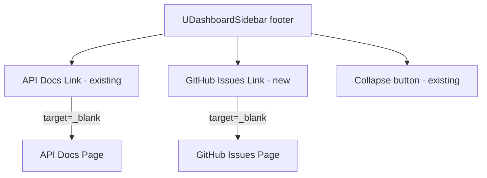
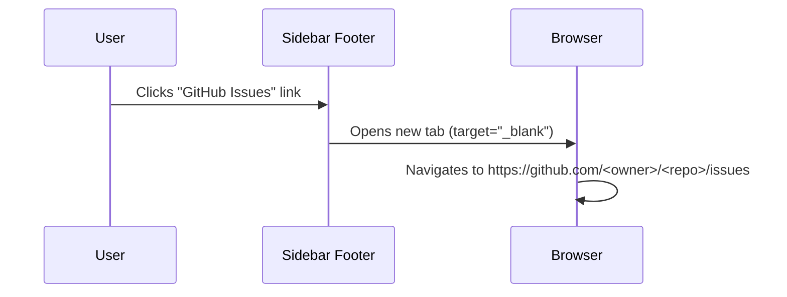

# Design Document: GitHub Issues Nav Link

## Overview

This feature adds a GitHub Issues link to the sidebar navigation footer, giving users a quick way to report bugs and request features. The link opens the project's GitHub Issues page in a new browser tab. This addresses **GitHub Issue #106** — "Feature Request: Github issues link in Nav."

The implementation follows the exact same pattern as the existing "API Docs" external link already present in the sidebar footer of `app/layouts/default.vue`. No new components, composables, API routes, or server-side changes are required — this is a purely presentational addition to the default layout.

## Architecture



The new link sits in the sidebar footer alongside the existing "API Docs" link. Both are static external links rendered as `<NuxtLink>` elements with `target="_blank"` and `rel="noopener noreferrer"`.

## Sequence Diagram



## Components and Interfaces

### Modified Component: `app/layouts/default.vue`

**Purpose**: Default layout containing the sidebar navigation. The footer `<template #footer>` section is the only area modified.

**Current footer structure**:
```typescript
// Sidebar footer currently contains:
// 1. API Docs link (NuxtLink, external, target="_blank")
// 2. Collapse button (UDashboardSidebarCollapse)
```

**New footer structure**:
```typescript
// Sidebar footer will contain:
// 1. API Docs link (NuxtLink, external, target="_blank")       ← existing
// 2. GitHub Issues link (NuxtLink, external, target="_blank")   ← NEW
// 3. Collapse button (UDashboardSidebarCollapse)                ← existing
```

**Interface**: No new props, events, or composables. The link is a static `<NuxtLink>` element.

### Link specification

```typescript
// The new link element attributes
const githubIssuesLink = {
  to: 'https://github.com/XanderLuciano/shop-planr/issues',
  target: '_blank',
  rel: 'noopener noreferrer',
  ariaLabel: 'Report Issue',
  icon: 'i-lucide-bug',           // Lucide "bug" icon from @iconify-json/lucide
  label: 'Report Issue',
  externalIcon: 'i-lucide-external-link',  // Same trailing icon as API Docs link
}
```

## Data Models

No new data models. This feature is entirely client-side presentational markup. No database, API, or state changes.

## Key Functions with Formal Specifications

### Template Markup: GitHub Issues Link

```vue
<NuxtLink
  to="https://github.com/XanderLuciano/shop-planr/issues"
  target="_blank"
  rel="noopener noreferrer"
  aria-label="Report Issue"
  class="flex items-center gap-2 px-2 py-1.5 text-sm text-(--ui-text-muted) hover:text-(--ui-text-highlighted) rounded-md hover:bg-(--ui-bg-elevated) transition-colors"
>
  <UIcon name="i-lucide-bug" class="size-4" />
  <span class="truncate group-data-[collapsed=true]:hidden">Report Issue</span>
  <UIcon
    name="i-lucide-external-link"
    class="size-3 ml-auto opacity-50 group-data-[collapsed=true]:hidden"
  />
</NuxtLink>
```

**Preconditions:**
- `@iconify-json/lucide` package is installed (already present in project)
- `i-lucide-bug` icon exists in the Lucide icon set (confirmed)

**Postconditions:**
- Link renders in sidebar footer between "API Docs" and the collapse/color-mode row
- Clicking the link opens the GitHub Issues URL in a new browser tab
- Link does not navigate the current tab away from the app
- `rel="noopener noreferrer"` prevents the opened page from accessing `window.opener`
- When sidebar is collapsed, text and external-link icon are hidden (via `group-data-[collapsed]:hidden`)
- Link styling matches the existing "API Docs" link exactly

## Algorithmic Pseudocode

This feature has no algorithmic logic. It is a static HTML link addition. The "algorithm" is:

```pascal
ALGORITHM renderGitHubIssuesLink
INPUT: none (static markup)
OUTPUT: rendered <a> element in sidebar footer

BEGIN
  RENDER NuxtLink with:
    to = "https://github.com/XanderLuciano/shop-planr/issues"
    target = "_blank"
    rel = "noopener noreferrer"
    icon = lucide bug icon
    label = "Report Issue"
    external indicator = lucide external-link icon
  
  APPLY same CSS classes as existing "API Docs" link
  APPLY collapsed-sidebar hiding via group-data-[collapsed=true]:hidden
END
```

## Example Usage

After implementation, the sidebar footer will render as:

```
┌─────────────────────┐
│  📖 API Docs      ↗ │  ← existing
│  🐛 Report Issue  ↗ │  ← NEW
│  [◀]                │  ← existing collapse button
└─────────────────────┘
```

User interaction:
1. User sees "Report Issue" link at the bottom of the sidebar
2. User clicks the link
3. A new browser tab opens to the project's GitHub Issues page
4. The user can create a new issue or browse existing ones

## Correctness Properties

*This feature is entirely static presentational markup with no logic, transformations, or input variation. Property-based testing is not applicable. All acceptance criteria are verifiable through example-based tests (static attribute/DOM checks) or manual inspection.*

1. **External navigation**: The link MUST open in a new tab (`target="_blank"`), never replacing the current app view. **Validates: Requirements 2.1, 2.2**
2. **Security**: The link MUST include `rel="noopener noreferrer"` to prevent reverse tabnapping. **Validates: Requirement 3.1**
3. **Visual consistency**: The link MUST use identical CSS classes and icon sizing as the existing "API Docs" link. **Validates: Requirement 1.3**
4. **Collapsed sidebar**: When the sidebar is collapsed, only the bug icon should be visible; the text label and external-link icon MUST be hidden. **Validates: Requirements 4.1, 4.2**
5. **Accessibility**: The link MUST be a semantic `<a>` element (rendered by `NuxtLink`) with `aria-label="Report Issue"` for screen readers when the text is hidden. **Validates: Requirements 5.1, 5.2**
6. **No side effects**: Adding this link MUST NOT affect page toggle filtering, route middleware, or any other nav behavior. **Validates: Requirements 6.1, 6.2**
7. **URL correctness**: The `href` MUST point to a valid GitHub Issues URL for the project repository. **Validates: Requirement 2.3**

## Error Handling

| Scenario | Behavior |
|----------|----------|
| GitHub is down | Browser shows GitHub's error page in the new tab; app is unaffected |
| Repository URL is wrong | Browser shows GitHub 404 in the new tab; app is unaffected |
| JavaScript disabled | `<a>` tag still works natively; no JS required for external links |
| Sidebar collapsed | Icon-only display; link remains clickable |

No application-level error handling is needed. The link is a standard HTML anchor — failure modes are handled by the browser.

## Testing Strategy

### Manual Testing

Since this is a static link with no logic, manual verification is sufficient:
1. Verify the link appears in the sidebar footer
2. Verify clicking opens GitHub Issues in a new tab
3. Verify the current app tab is not navigated away
4. Verify styling matches the "API Docs" link
5. Verify collapsed sidebar shows only the icon

### Unit Testing

No unit tests are needed. There is no business logic, no composable, no computed property, and no conditional rendering. The link is static markup.

### Property-Based Testing

Not applicable — no functions or transformations to test.

## Security Considerations

- `rel="noopener noreferrer"` prevents the target page from accessing `window.opener`, mitigating reverse tabnapping attacks.
- The URL is hardcoded (not user-supplied), so there is no injection risk.
- No authentication tokens or sensitive data are passed to the external URL.

## Dependencies

- `@iconify-json/lucide` — already installed; provides the `i-lucide-bug` icon
- No new npm packages required
- No new API routes or server-side changes
