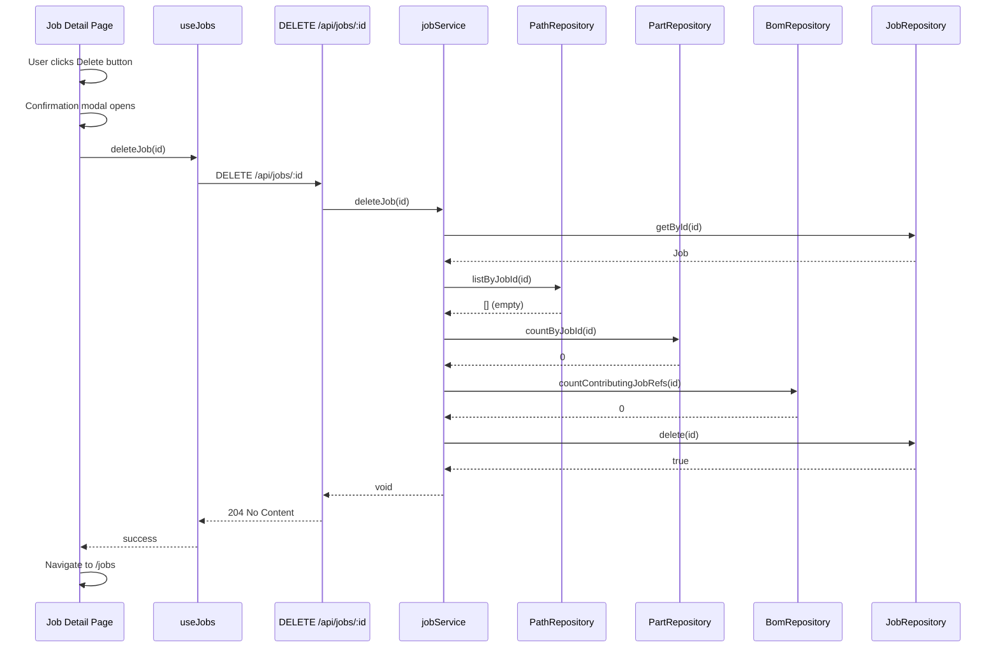
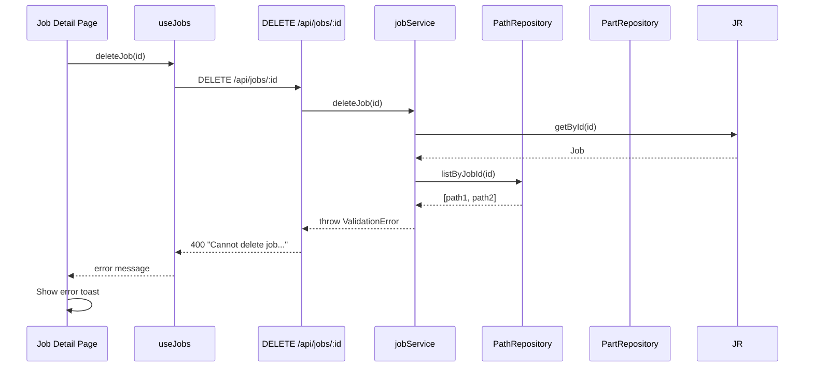

# Design Document: Job Delete

## Overview

This feature adds delete functionality to Jobs in Shop Planr, as described in **GitHub Issue #46** ("Add Delete Functionality to Jobs"). A job can only be deleted if it has no paths, no parts (serials), and no BOM contributing job references associated with it. This is a safety constraint to prevent orphaned data and broken foreign key references.

The implementation follows the existing CRUD pattern already established for jobs (create, get, update) and extends it with a `deleteJob` service method, a `DELETE /api/jobs/:id` API route, and frontend UI (confirmation modal on the job detail page, with the button disabled when the job has dependents).

## Architecture

```mermaid
graph TD
    A["Job Detail Page<br/>(app/pages/jobs/[id].vue)"] -->|"$fetch DELETE"| B["useJobs composable<br/>(app/composables/useJobs.ts)"]
    B -->|"DELETE /api/jobs/:id"| C["API Route<br/>(server/api/jobs/[id].delete.ts)"]
    C -->|"jobService.deleteJob(id)"| D["Job Service<br/>(server/services/jobService.ts)"]
    D -->|"paths.listByJobId(id)"| E["Path Repository"]
    D -->|"parts.countByJobId(id)"| F["Part Repository"]
    D -->|"bomContribCount query"| G["BOM Repository"]
    D -->|"jobs.delete(id)"| H["Job Repository"]
    H --> I["SQLite<br/>(jobs table)"]
```



## Sequence Diagrams

### Happy Path: Delete Job with No Dependents



### Rejection Path: Job Has Dependents




## Components and Interfaces

### Component 1: BomRepository Extension

**Purpose**: Provide a method to count how many `bom_contributing_jobs` rows reference a given job ID.

**Interface**:
```typescript
// Added to server/repositories/interfaces/bomRepository.ts
export interface BomRepository {
  // ... existing methods ...
  countContributingJobRefs(jobId: string): number
}
```

**Responsibilities**:
- Query `bom_contributing_jobs` table for rows where `job_id = ?`
- Return the count (0 means no BOM references)

### Component 2: Job Service Extension

**Purpose**: Add `deleteJob` method with safety checks to the existing job service.

**Interface**:
```typescript
// Added to createJobService return object
deleteJob(id: string): void
canDeleteJob(id: string): { canDelete: boolean; reasons: string[] }
```

**Responsibilities**:
- Verify job exists (throw NotFoundError if not)
- Check for paths via `paths.listByJobId(id)`
- Check for parts via `parts.countByJobId(id)`
- Check for BOM references via `bom.countContributingJobRefs(id)`
- Throw ValidationError with descriptive message if any dependents exist
- Delete the job via `jobs.delete(id)` if all checks pass
- `canDeleteJob` returns a pre-flight check result for the UI

### Component 3: API Route

**Purpose**: Thin HTTP handler for `DELETE /api/jobs/:id`.

**Interface**:
```typescript
// server/api/jobs/[id].delete.ts
// DELETE /api/jobs/:id → 204 No Content | 400 | 404
```

**Responsibilities**:
- Extract `id` from route params
- Call `jobService.deleteJob(id)`
- Return 204 on success
- Map ValidationError → 400, NotFoundError → 404

### Component 4: Frontend UI

**Purpose**: Delete button + confirmation modal on the job detail page.

**Interface**:
```typescript
// Added to useJobs composable
deleteJob(id: string): Promise<void>
```

**Responsibilities**:
- Show a Delete button on the job detail page header (next to Edit)
- Disable the button when the job has paths or parts (use progress data already loaded)
- Show a UModal confirmation dialog before executing the delete
- On success, navigate to `/jobs`
- On error, display the error message in a toast

## Data Models

### Existing Models (No Changes)

The `jobs`, `paths`, `serials` (parts), and `bom_contributing_jobs` tables are unchanged. The delete operation uses existing FK constraints and queries.

### Deletion Eligibility Check Result

```typescript
interface DeleteJobCheck {
  canDelete: boolean
  reasons: string[]  // e.g. ["Job has 2 paths", "Job has 5 parts", "Job is referenced by 1 BOM entry"]
}
```

This is returned by `canDeleteJob` for the frontend to show why deletion is blocked.


## Key Functions with Formal Specifications

### Function 1: deleteJob(id)

```typescript
function deleteJob(id: string): void
```

**Preconditions:**
- `id` is a non-empty string
- A job with the given `id` exists in the database

**Postconditions:**
- If the job has 0 paths, 0 parts, and 0 BOM contributing job references: the job row is deleted from the `jobs` table
- If the job has any paths: throws `ValidationError` with message listing path count
- If the job has any parts: throws `ValidationError` with message listing part count
- If the job has any BOM references: throws `ValidationError` with message listing BOM reference count
- If the job does not exist: throws `NotFoundError`
- No cascading deletes occur — the job must be clean before deletion

**Loop Invariants:** N/A

### Function 2: canDeleteJob(id)

```typescript
function canDeleteJob(id: string): { canDelete: boolean; reasons: string[] }
```

**Preconditions:**
- `id` is a non-empty string
- A job with the given `id` exists in the database

**Postconditions:**
- Returns `{ canDelete: true, reasons: [] }` if the job has 0 paths, 0 parts, and 0 BOM references
- Returns `{ canDelete: false, reasons: [...] }` with human-readable reasons for each blocker
- If the job does not exist: throws `NotFoundError`
- Read-only operation — no mutations

**Loop Invariants:** N/A

### Function 3: countContributingJobRefs(jobId)

```typescript
function countContributingJobRefs(jobId: string): number
```

**Preconditions:**
- `jobId` is a non-empty string

**Postconditions:**
- Returns the count of rows in `bom_contributing_jobs` where `job_id = jobId`
- Returns 0 if no references exist
- Read-only operation — no mutations

**Loop Invariants:** N/A

## Algorithmic Pseudocode

### Delete Job Algorithm

```typescript
ALGORITHM deleteJob(id: string): void
  // Step 1: Verify job exists
  job ← repos.jobs.getById(id)
  IF job IS null THEN
    THROW NotFoundError("Job", id)
  END IF

  // Step 2: Check for paths
  paths ← repos.paths.listByJobId(id)
  IF paths.length > 0 THEN
    THROW ValidationError("Cannot delete job: it has {paths.length} path(s). Remove all paths first.")
  END IF

  // Step 3: Check for parts
  partCount ← repos.parts.countByJobId(id)
  IF partCount > 0 THEN
    THROW ValidationError("Cannot delete job: it has {partCount} part(s). Remove all parts first.")
  END IF

  // Step 4: Check for BOM references
  bomRefCount ← repos.bom.countContributingJobRefs(id)
  IF bomRefCount > 0 THEN
    THROW ValidationError("Cannot delete job: it is referenced by {bomRefCount} BOM entry/entries. Remove BOM references first.")
  END IF

  // Step 5: All checks passed — delete
  repos.jobs.delete(id)
END ALGORITHM
```

### Can Delete Job Algorithm

```typescript
ALGORITHM canDeleteJob(id: string): DeleteJobCheck
  job ← repos.jobs.getById(id)
  IF job IS null THEN
    THROW NotFoundError("Job", id)
  END IF

  reasons ← []

  paths ← repos.paths.listByJobId(id)
  IF paths.length > 0 THEN
    reasons.push("Job has {paths.length} path(s)")
  END IF

  partCount ← repos.parts.countByJobId(id)
  IF partCount > 0 THEN
    reasons.push("Job has {partCount} part(s)")
  END IF

  bomRefCount ← repos.bom.countContributingJobRefs(id)
  IF bomRefCount > 0 THEN
    reasons.push("Job is referenced by {bomRefCount} BOM entry/entries")
  END IF

  RETURN { canDelete: reasons.length === 0, reasons }
END ALGORITHM
```

## Example Usage

### Backend: Service Usage

```typescript
// In API route handler
const { jobService } = getServices()

// Pre-flight check (used by GET /api/jobs/:id to include deletability info)
const check = jobService.canDeleteJob(jobId)
// → { canDelete: true, reasons: [] }
// → { canDelete: false, reasons: ["Job has 2 path(s)"] }

// Actual deletion
jobService.deleteJob(jobId)
// → void (success) or throws ValidationError/NotFoundError
```

### Frontend: Composable Usage

```typescript
// In job detail page
const { deleteJob } = useJobs()

async function onConfirmDelete() {
  try {
    await deleteJob(jobId)
    navigateTo('/jobs')
  } catch (e: any) {
    toast.add({ title: 'Cannot delete job', description: e?.data?.message })
  }
}
```

### API Route

```typescript
// DELETE /api/jobs/:id → 204 No Content
export default defineEventHandler(async (event) => {
  try {
    const id = getRouterParam(event, 'id')!
    const { jobService } = getServices()
    jobService.deleteJob(id)
    setResponseStatus(event, 204)
    return null
  } catch (error) {
    if (error instanceof ValidationError) {
      throw createError({ statusCode: 400, message: error.message })
    }
    if (error instanceof NotFoundError) {
      throw createError({ statusCode: 404, message: error.message })
    }
    throw error
  }
})
```


## Correctness Properties

*A property is a characteristic or behavior that should hold true across all valid executions of a system-essentially, a formal statement about what the system should do. Properties serve as the bridge between human-readable specifications and machine-verifiable correctness guarantees.*

### Property 1: Deletion Safety

*For any* job with an existing ID, if `deleteJob(j.id)` succeeds, then at the moment of deletion the job had 0 paths, 0 parts, and 0 BOM contributing job references.

**Validates: Requirements 2.1, 2.2, 2.3, 2.4**

### Property 2: Deletion Rejection

*For any* job that has at least one path, or at least one part, or at least one BOM contributing job reference, calling `deleteJob` on that job should throw a ValidationError and the job should remain in the database unchanged.

**Validates: Requirements 2.2, 2.3, 2.4**

### Property 3: Deletion Completeness

*For any* job with no dependents, after `deleteJob(j.id)` succeeds, retrieving the job by its ID should return null.

**Validates: Requirements 2.1, 2.6**

### Property 4: Not Found Invariant

*For any* ID where no job exists in the database, both `deleteJob(id)` and `canDeleteJob(id)` should throw a NotFoundError.

**Validates: Requirements 2.5, 3.3**

### Property 5: canDeleteJob Consistency

*For any* job, `canDeleteJob(j.id).canDelete === true` implies `deleteJob(j.id)` succeeds without throwing, and `canDeleteJob(j.id).canDelete === false` implies `deleteJob(j.id)` throws a ValidationError (assuming no concurrent modifications between the two calls).

**Validates: Requirements 2.1, 3.1, 3.2**

## Error Handling

### Error Scenario 1: Job Not Found

**Condition**: The job ID does not exist in the database
**Response**: `NotFoundError` → HTTP 404 with message "Job not found: {id}"
**Recovery**: Frontend shows error toast; no navigation occurs

### Error Scenario 2: Job Has Paths

**Condition**: `paths.listByJobId(id)` returns a non-empty array
**Response**: `ValidationError` → HTTP 400 with message "Cannot delete job: it has N path(s). Remove all paths first."
**Recovery**: Frontend shows error toast with the specific reason; user must delete paths first

### Error Scenario 3: Job Has Parts

**Condition**: `parts.countByJobId(id)` returns > 0
**Response**: `ValidationError` → HTTP 400 with message "Cannot delete job: it has N part(s). Remove all parts first."
**Recovery**: Frontend shows error toast; user must remove parts first

### Error Scenario 4: Job Has BOM References

**Condition**: `bom.countContributingJobRefs(id)` returns > 0
**Response**: `ValidationError` → HTTP 400 with message "Cannot delete job: it is referenced by N BOM entry/entries. Remove BOM references first."
**Recovery**: Frontend shows error toast; user must unlink the job from BOM entries first

### Error Scenario 5: FK Constraint Violation (Safety Net)

**Condition**: SQLite FK constraint prevents deletion (e.g., `bom_contributing_jobs` references `jobs(id)` without CASCADE)
**Response**: SQLite throws a constraint error → HTTP 500
**Recovery**: This should never happen if the service-layer checks are correct. Acts as a safety net.

## Testing Strategy

### Unit Testing Approach

- Test `deleteJob` with a job that has no dependents → succeeds, job is removed
- Test `deleteJob` with a job that has paths → throws ValidationError
- Test `deleteJob` with a job that has parts → throws ValidationError
- Test `deleteJob` with a job that has BOM references → throws ValidationError
- Test `deleteJob` with a non-existent job ID → throws NotFoundError
- Test `canDeleteJob` returns correct `canDelete` and `reasons` for each scenario
- Test `countContributingJobRefs` returns correct count

### Property-Based Testing Approach

**Property Test Library**: fast-check

- **CP-DEL-1/2 (Deletion Safety)**: For any randomly generated job + random number of paths/parts/BOM refs, `deleteJob` succeeds if and only if all counts are 0
- **CP-DEL-5 (canDeleteJob Consistency)**: For any job, `canDeleteJob` returning `canDelete: true` implies `deleteJob` will not throw ValidationError

### Integration Testing Approach

- Create a job, verify it can be deleted
- Create a job with paths, verify deletion is blocked, delete paths, then verify deletion succeeds
- Create a job with parts, verify deletion is blocked
- Create a job referenced by a BOM entry, verify deletion is blocked
- Full lifecycle: create job → add paths → add parts → remove parts → remove paths → delete job

## Security Considerations

- No authentication/authorization layer exists in the current app (kiosk mode), so no additional auth checks are needed
- The delete operation is idempotent at the service level: deleting a non-existent job returns 404, not 500
- The `bom_contributing_jobs` FK constraint on `jobs(id)` does NOT have `ON DELETE CASCADE`, so the service-layer check is essential to prevent FK violations

## Dependencies

- Existing: `better-sqlite3`, `JobRepository`, `PathRepository`, `PartRepository`, `BomRepository`
- New: `countContributingJobRefs` method on `BomRepository` interface and SQLite implementation
- Frontend: `UModal`, `UButton`, `UAlert` from Nuxt UI 4.3.0
