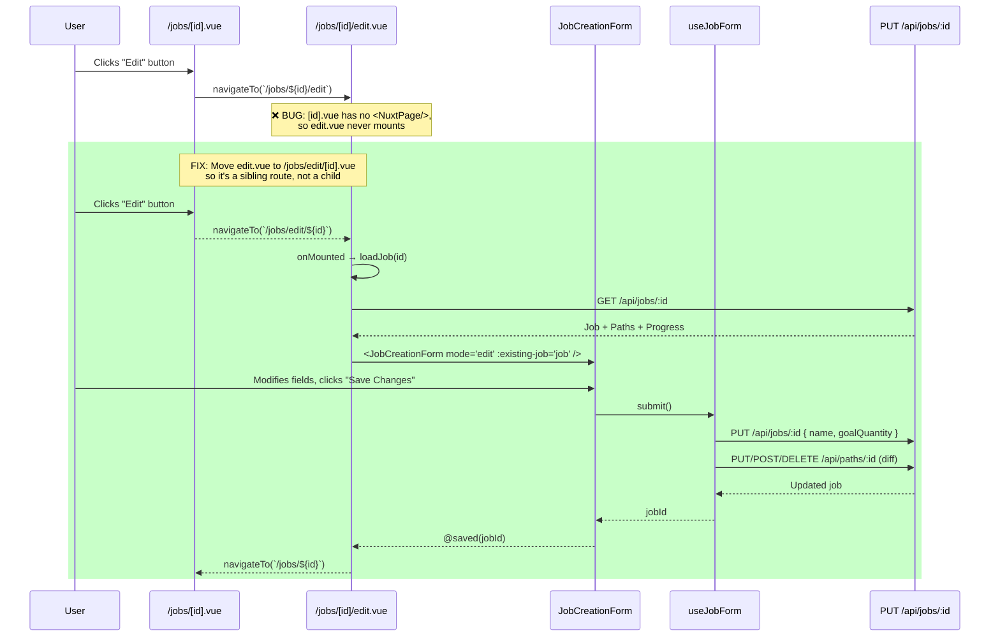

# Design Document: Job Edit Functionality

## Overview

Fixes **GitHub Issue #3** — "UI - Jobs - Edit not functional." The edit button on the Job detail page (`/jobs/:id`) navigates to `/jobs/:id/edit`, but the edit page never renders due to a Nuxt nested routing conflict. In Nuxt's file-based routing, `app/pages/jobs/[id].vue` acts as a parent layout for `app/pages/jobs/[id]/edit.vue`. Since the parent page does not include a `<NuxtPage />` component, the child route (`edit.vue`) is never mounted — the user sees the detail page unchanged after clicking Edit.

The fix restructures the routing so the edit page renders independently, and verifies the full edit round-trip (load → modify → save → redirect) works end-to-end.

## Main Algorithm/Workflow



## Core Interfaces/Types

```typescript
// Already defined in server/types/api.ts — no changes needed
interface UpdateJobInput {
  name?: string
  goalQuantity?: number
}

// Already defined in server/types/api.ts — no changes needed
interface UpdatePathInput {
  name?: string
  goalQuantity?: number
  advancementMode?: 'strict' | 'flexible' | 'per_step'
  steps?: { name: string; location?: string; optional?: boolean; dependencyType?: 'physical' | 'preferred' | 'completion_gate' }[]
}

// useJobForm composable types — already defined, no changes needed
interface JobDraft { name: string; goalQuantity: number }
interface PathDraft { _clientId: string; _existingId?: string; name: string; goalQuantity: number; advancementMode: string; steps: StepDraft[] }
interface StepDraft { _clientId: string; name: string; location: string; optional: boolean; dependencyType: string }
```

## Key Functions with Formal Specifications

### Function 1: Route restructure — move edit page

```typescript
// BEFORE (broken): app/pages/jobs/[id]/edit.vue  → child of [id].vue (needs <NuxtPage/>)
// AFTER  (fixed):  app/pages/jobs/edit/[id].vue   → sibling route, renders independently

// The page component logic stays identical — only the file location changes.
// Route changes from /jobs/:id/edit → /jobs/edit/:id
```

**Preconditions:**
- `app/pages/jobs/[id]/edit.vue` exists and contains a working edit page component
- `app/pages/jobs/[id].vue` does NOT contain `<NuxtPage />` (confirmed)

**Postconditions:**
- `app/pages/jobs/edit/[id].vue` exists with the same component code
- `app/pages/jobs/[id]/edit.vue` is deleted
- `app/pages/jobs/[id]/` directory is removed (empty after move)
- Nuxt generates route `/jobs/edit/:id` that renders independently

### Function 2: Update navigateTo calls in detail page

```typescript
// In app/pages/jobs/[id].vue — update the Edit button click handler
// BEFORE:
navigateTo(`/jobs/${encodeURIComponent(jobId)}/edit`)
// AFTER:
navigateTo(`/jobs/edit/${encodeURIComponent(jobId)}`)
```

**Preconditions:**
- `jobId` is a valid, non-empty string (extracted from `route.params.id`)

**Postconditions:**
- Clicking the Edit button navigates to `/jobs/edit/:id`
- The edit page mounts and renders the `JobCreationForm` in edit mode

### Function 3: Update back/cancel navigation in edit page

```typescript
// In app/pages/jobs/edit/[id].vue — update onSaved and onCancel
function onSaved(id: string) {
  navigateTo(`/jobs/${encodeURIComponent(id)}`)
}

function onCancel() {
  navigateTo(`/jobs/${encodeURIComponent(jobId)}`)
}

// Back link also updated:
// <NuxtLink :to="`/jobs/${encodeURIComponent(jobId)}`">
```

**Preconditions:**
- `jobId` is extracted from `route.params.id` on the edit page
- Save or cancel action has been triggered by the user

**Postconditions:**
- After save: user is redirected to `/jobs/:id` detail page showing updated data
- After cancel: user is redirected to `/jobs/:id` detail page with no changes
- Back link navigates to the specific job detail page, not the jobs list

### Function 4: Update page toggle mapping (if needed)

```typescript
// In server/utils/pageToggles.ts — verify /jobs/edit routes inherit the 'jobs' toggle
// The existing ROUTE_TOGGLE_MAP entry:
//   '/jobs': 'jobs'
// Already covers /jobs/edit/:id via startsWith('/jobs/') check in isPageEnabled()
// NO CHANGES NEEDED — just verification
```

**Preconditions:**
- `ROUTE_TOGGLE_MAP` has entry `'/jobs': 'jobs'`
- `isPageEnabled()` uses `startsWith(basePath + '/')` matching

**Postconditions:**
- `/jobs/edit/:id` is enabled/disabled based on the `jobs` page toggle
- No regression in page guard behavior

## Algorithmic Pseudocode

### Route Fix Algorithm

```typescript
// Step 1: Create new directory and move the edit page
//   FROM: app/pages/jobs/[id]/edit.vue
//   TO:   app/pages/jobs/edit/[id].vue

// Step 2: Update the edit page's back link
//   The "Back to Job" NuxtLink points to /jobs/:id (the job detail page)
//   The onCancel/onSaved navigations already point to /jobs/:id — no change needed

// Step 3: Update the detail page's Edit button
//   In app/pages/jobs/[id].vue, change the @click handler:
//   navigateTo(`/jobs/edit/${encodeURIComponent(jobId)}`)

// Step 4: Verify page guard compatibility
//   isPageEnabled({ jobs: false }, '/jobs/edit/abc') should return false
//   isPageEnabled({ jobs: true }, '/jobs/edit/abc') should return true
//   Both pass with existing logic — no changes needed

// Step 5: Verify no other references to the old route
//   Search codebase for '/jobs/' + id + '/edit' patterns
//   Update any found references
```

## Example Usage

```typescript
// User flow after fix:

// 1. User is on /jobs/job_V1StGXR8_Z5j (detail page)
// 2. Clicks "Edit" button
// 3. navigateTo('/jobs/edit/job_V1StGXR8_Z5j') fires
// 4. Nuxt resolves to app/pages/jobs/edit/[id].vue (independent route)
// 5. Edit page mounts, calls GET /api/jobs/job_V1StGXR8_Z5j
// 6. JobCreationForm renders with mode="edit" and pre-filled data
// 7. User changes job name from "Bracket Assembly" to "Bracket Assembly v2"
// 8. User clicks "Save Changes"
// 9. useJobForm.submit() calls:
//    - PUT /api/jobs/job_V1StGXR8_Z5j { name: "Bracket Assembly v2", goalQuantity: 50 }
//    - PUT/POST/DELETE for any path changes
// 10. On success, navigateTo('/jobs/job_V1StGXR8_Z5j') returns to detail page
// 11. Detail page shows updated name "Bracket Assembly v2"
```

## Correctness Properties

```typescript
// Property 1: Edit page renders independently
// ∀ jobId: navigating to /jobs/edit/{jobId} renders the edit form
// without requiring a <NuxtPage/> in any parent component

// Property 2: Round-trip data integrity
// ∀ job, field ∈ {name, goalQuantity}:
//   load(job) → edit(field) → save() → reload(job) ⟹ job[field] === editedValue

// Property 3: Cancel preserves original data
// ∀ job: load(job) → edit(fields) → cancel() → reload(job) ⟹ job === originalJob

// Property 4: Path diff correctness (existing, verified by useJobForm tests)
// ∀ originalPaths, draftPaths:
//   computePathChanges(original, drafts).toDelete ∩ drafts._existingIds === ∅
//   computePathChanges(original, drafts).toCreate.every(d => !d._existingId)
//   computePathChanges(original, drafts).toUpdate.every(d => hasChanges(d, original))

// Property 5: Page toggle inheritance
// ∀ toggleState:
//   isPageEnabled(toggleState, '/jobs/edit/x') === toggleState.jobs
```
