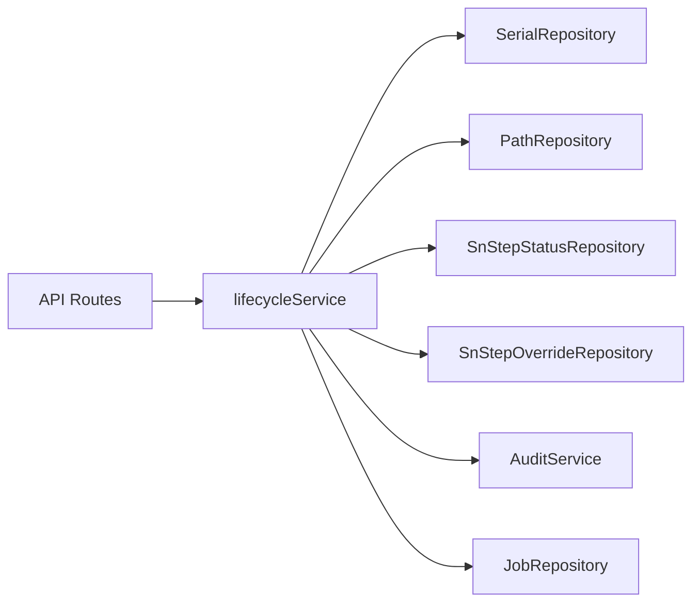
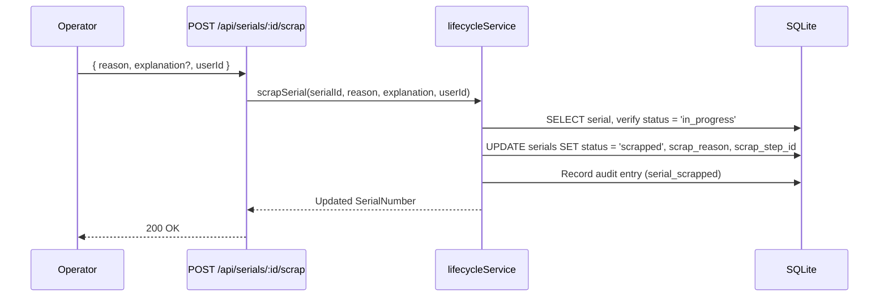
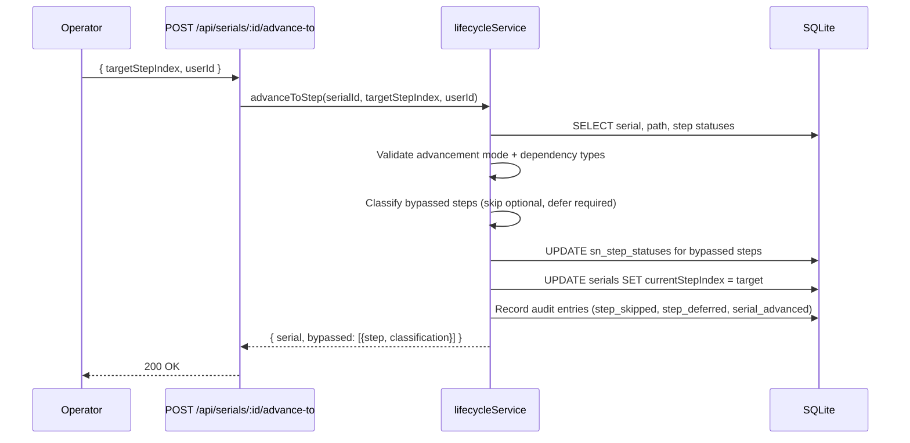
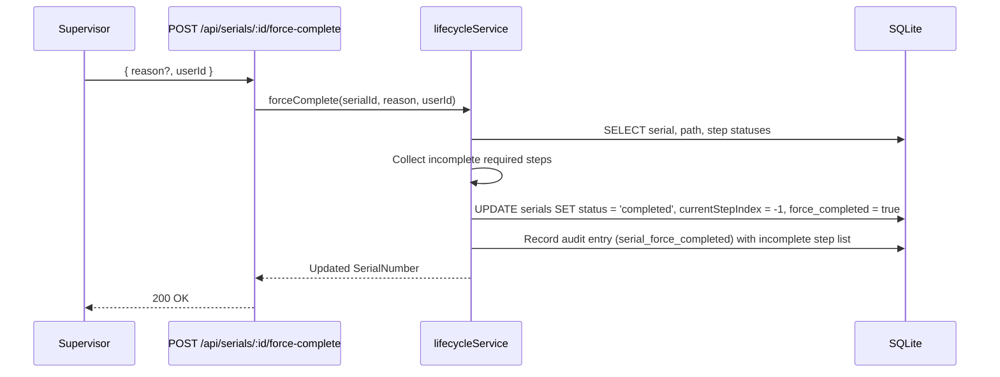
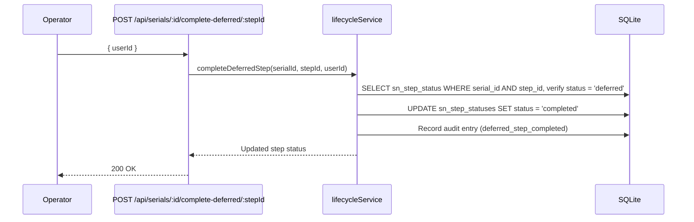
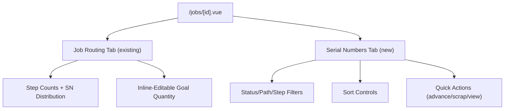

# Design Document: Job Lifecycle Management

## Overview

This feature set extends Shop Planr from a strictly sequential advancement model to a flexible, real-world manufacturing lifecycle. It introduces 16 interconnected capabilities across three broad areas:

1. **Serial Lifecycle States** — Scrap tracking (Req 3), force-complete override (Req 8), deferred vs skipped step model (Req 11), and waivers for required steps (Req 13, stretch goal). Serial numbers gain a `status` field (`in_progress`, `completed`, `scrapped`) and per-step status tracking (`pending`, `in_progress`, `completed`, `skipped`, `deferred`, `waived`).

2. **Flexible Routing** — Optional process steps (Req 4), flexible step advancement (Req 5), out-of-order step processing with configurable advancement modes (Req 6), step dependency types (Req 12), per-SN step requirement overrides for prototype fast-track (Req 9), and predefined process/location libraries (Req 16).

3. **Production Management** — Batch serial creation at first step (Req 1), single job view with tabbed layout (Req 2), bonus parts/overproduction (Req 7), editable BOMs with version history (Req 10), extended audit trail (Req 15), and backwards compatibility migration (Req 14).

### Key Design Decisions

1. **Per-SN step status in a new `sn_step_statuses` table** — Rather than inferring step status from `currentStepIndex`, we explicitly track each serial's status at each step. This enables deferred, skipped, and waived states without ambiguity. The `currentStepIndex` field is retained for backwards compatibility and fast "where is this part now?" queries.

2. **`status` column on `serials` table** — Adding `status TEXT DEFAULT 'in_progress'` with values `in_progress`, `completed`, `scrapped`. This replaces the implicit `currentStepIndex = -1` convention for completion and adds scrap as a first-class state. Existing serials with `currentStepIndex = -1` are migrated to `status = 'completed'`.

3. **Advancement mode on `paths` table** — A new `advancement_mode TEXT DEFAULT 'strict'` column. Strict mode preserves existing sequential-only behavior. Flexible and per_step modes unlock the new routing capabilities.

4. **`optional` and `dependency_type` on `process_steps` and `template_steps`** — These columns drive the skip/defer/block logic. Defaults (`optional = false`, `dependency_type = 'preferred'`) ensure backwards compatibility.

5. **Step overrides in a new `sn_step_overrides` table** — A join table linking serial IDs to step IDs with an `active` flag. This allows per-SN requirement overrides without modifying the shared ProcessStep definition.

6. **BOM versions in a new `bom_versions` table** — Immutable snapshots created on each BOM edit. The current BOM entries remain in `bom_entries` for live queries; versions are historical records.

7. **Process and Location libraries in new `process_library` and `location_library` tables** — Simple name-list tables with CRUD, seeded with common shop values. Dropdowns in step editors pull from these tables.

8. **`lifecycleService` as a new service** — Scrap, force-complete, flexible advancement, deferred step resolution, and waiver operations are complex enough to warrant a dedicated service rather than overloading `serialService`. The existing `serialService` retains basic CRUD and sequential advancement; `lifecycleService` handles all lifecycle state transitions.

9. **Extend `AuditAction` union type** — Add 9 new action types to the existing union. The audit service gains new recording methods for each lifecycle action.

## Architecture

The feature extends the existing layered architecture:

```
Pages/Components → Composables → API Routes → Services → Repositories → SQLite
```

### New Service: `lifecycleService`



### Scrap Flow



### Flexible Advancement Flow



### Force Complete Flow



### Deferred Step Resolution Flow



### Single Job View Architecture



## Components and Interfaces

### New Files

| File | Type | Purpose |
|------|------|---------|
| `server/repositories/sqlite/migrations/004_lifecycle_management.sql` | Migration | Adds lifecycle columns, new tables, defaults for existing data |
| `server/services/lifecycleService.ts` | Service | Scrap, force-complete, flexible advance, defer resolution, waivers |
| `server/services/libraryService.ts` | Service | Process and Location library CRUD |
| `server/repositories/interfaces/snStepStatusRepository.ts` | Interface | Per-SN step status CRUD |
| `server/repositories/interfaces/snStepOverrideRepository.ts` | Interface | Per-SN step override CRUD |
| `server/repositories/interfaces/libraryRepository.ts` | Interface | Process/Location library CRUD |
| `server/repositories/interfaces/bomVersionRepository.ts` | Interface | BOM version snapshot storage |
| `server/repositories/sqlite/snStepStatusRepository.ts` | Repo impl | SQLite implementation |
| `server/repositories/sqlite/snStepOverrideRepository.ts` | Repo impl | SQLite implementation |
| `server/repositories/sqlite/libraryRepository.ts` | Repo impl | SQLite implementation |
| `server/repositories/sqlite/bomVersionRepository.ts` | Repo impl | SQLite implementation |
| `server/api/serials/[id]/scrap.post.ts` | API Route | Scrap a serial number |
| `server/api/serials/[id]/force-complete.post.ts` | API Route | Force-complete a serial number |
| `server/api/serials/[id]/advance-to.post.ts` | API Route | Flexible advancement to any future step |
| `server/api/serials/[id]/complete-deferred/[stepId].post.ts` | API Route | Complete a deferred step |
| `server/api/serials/[id]/waive-step/[stepId].post.ts` | API Route | Waive a deferred required step (stretch) |
| `server/api/serials/[id]/overrides.post.ts` | API Route | Create step overrides for a serial |
| `server/api/serials/[id]/overrides/[stepId].delete.ts` | API Route | Reverse a step override |
| `server/api/paths/[id]/advancement-mode.patch.ts` | API Route | Change path advancement mode |
| `server/api/bom/[id]/edit.post.ts` | API Route | Edit BOM with version snapshot |
| `server/api/bom/[id]/versions.get.ts` | API Route | List BOM version history |
| `server/api/library/processes.get.ts` | API Route | List process library entries |
| `server/api/library/processes.post.ts` | API Route | Add process library entry |
| `server/api/library/processes/[id].delete.ts` | API Route | Remove process library entry |
| `server/api/library/locations.get.ts` | API Route | List location library entries |
| `server/api/library/locations.post.ts` | API Route | Add location library entry |
| `server/api/library/locations/[id].delete.ts` | API Route | Remove location library entry |
| `app/components/ScrapDialog.vue` | Component | Scrap confirmation with reason dropdown |
| `app/components/ForceCompleteDialog.vue` | Component | Force-complete confirmation listing incomplete steps |
| `app/components/DeferredStepsList.vue` | Component | List of deferred steps with complete/waive actions |
| `app/components/StepOverridePanel.vue` | Component | Manage per-SN step overrides |
| `app/components/AdvanceToStepDropdown.vue` | Component | Dropdown for flexible step advancement |
| `app/components/BomVersionHistory.vue` | Component | Version history timeline for BOM edits |
| `app/components/LibraryManager.vue` | Component | CRUD interface for process/location libraries |
| `app/components/JobSerialNumbersTab.vue` | Component | Serial Numbers tab content for job detail |
| `app/components/AdvancementModeSelector.vue` | Component | Dropdown to change a Path's advancement mode (strict/flexible/per_step) on the Job Routing tab |
| `app/components/StepConfigPanel.vue` | Component | Inline panel on Job Routing tab to edit a step's optional flag and dependency type |
| `app/components/ProcessLocationDropdown.vue` | Component | Searchable dropdown for process name/location selection from library, with "New" inline-add option — used in PathEditor and template editor |
| `app/components/BonusBadge.vue` | Component | Visual "Bonus" indicator badge displayed on Serial Numbers created beyond the Job's Goal Quantity |
| `app/composables/useLifecycle.ts` | Composable | API client for lifecycle operations |
| `app/composables/useLibrary.ts` | Composable | API client for library CRUD |
| `app/composables/useBomVersions.ts` | Composable | API client for BOM version history |
| `app/components/PartDetailNotes.vue` | Component | Notes/defects section for the Part Detail page showing all notes for a serial |
| `app/components/CertAttachButton.vue` | Component | Searchable cert dropdown + attach action for Part Detail page |
| `app/components/CertDetailView.vue` | Component | Certificate detail view showing metadata and attached serials list |
| `app/components/AuditTrailFilters.vue` | Component | Filter controls for audit trail (action type, user, serial, job, date range) |
| `app/components/TemplateEditor.vue` | Component | Edit form for existing templates (add/remove/reorder steps with library dropdowns) |
| `app/components/PathDeleteButton.vue` | Component | Delete button with confirmation for paths with zero serials |
| `server/api/certs/[id]/attachments.get.ts` | API Route | List all serial attachments for a certificate |
| `server/api/templates/[id].put.ts` | API Route | Update an existing template's steps |

### Modified Files

| File | Change |
|------|--------|
| `server/types/domain.ts` | Extend `SerialNumber` with `status`, `scrapReason`, `scrapStepId`, `forceCompleted`, `forceCompletedBy`, `forceCompletedAt`, `forceCompletedReason`. Extend `ProcessStep` with `optional`, `dependencyType`. Extend `TemplateStep` with `optional`, `dependencyType`. Extend `Path` with `advancementMode`. Extend `AuditAction` union with 9 new types. Add `SnStepStatus`, `SnStepOverride`, `BomVersion`, `ProcessLibraryEntry`, `LocationLibraryEntry` types. Add `ScrapReason` type. |
| `server/types/api.ts` | Add `ScrapSerialInput`, `ForceCompleteInput`, `AdvanceToStepInput`, `CompleteDeferredStepInput`, `WaiveStepInput`, `CreateStepOverrideInput`, `EditBomInput`, `CreateLibraryEntryInput`, `UpdateAdvancementModeInput`. |
| `server/types/computed.ts` | Extend `JobProgress` with `scrappedSerials`, `producedQuantity`, `orderedQuantity`. Extend `EnrichedSerial` with `status` (add `'scrapped'`), `scrapReason`, `forceCompleted`. Add `SnStepStatusView`, `AdvancementResult`. |
| `server/services/serialService.ts` | Update `advanceSerial` to delegate to `lifecycleService` for non-sequential advances. Update `listAllSerialsEnriched` to include scrap/force-complete fields. |
| `server/services/jobService.ts` | Update `computeJobProgress` to exclude scrapped serials from progress, support >100% for overproduction. |
| `server/services/auditService.ts` | Add recording methods for all 9 new audit action types. |
| `server/services/bomService.ts` | Add `editBom` method that creates version snapshots. |
| `server/services/templateService.ts` | Copy `optional` and `dependencyType` fields when applying templates. |
| `server/repositories/interfaces/serialRepository.ts` | Add `countScrappedByJobId(jobId)` method. |
| `server/repositories/interfaces/pathRepository.ts` | Add `updateStep(stepId, partial)` method for updating optional/dependencyType. |
| `server/repositories/interfaces/index.ts` | Export new repository interfaces. |
| `server/repositories/factory.ts` | Wire new repository implementations. |
| `server/utils/services.ts` | Wire `lifecycleService` and `libraryService`. |
| `app/pages/jobs/[id].vue` | Add tabbed layout (Job Routing + Serial Numbers tabs), inline-editable goal quantity. |
| `app/pages/jobs/index.vue` | Make job rows clickable → navigate to `/jobs/[id]`. |
| `app/pages/index.vue` | Link Active Jobs section to jobs list, individual entries to job detail. |
| `app/pages/serials/[id].vue` | Add deferred steps section, step override display, scrap/force-complete indicators. |
| `app/pages/settings.vue` | Add Process Library and Location Library management sections. |
| `app/pages/bom.vue` | Add version history view, edit BOM functionality. |
| `app/components/ProcessAdvancementPanel.vue` | Add "Advance to Step" dropdown, "Skip" button for optional steps, scrap button. |
| `app/components/StepTracker.vue` | Visual indicators for optional, dependency type, deferred/skipped/waived statuses. |
| `app/components/PathEditor.vue` | Replace free-text step name/location inputs with `ProcessLocationDropdown` components; add optional toggle and dependency type selector per step. |
| `app/pages/templates.vue` | Replace free-text step name/location inputs with `ProcessLocationDropdown` components; add optional toggle and dependency type selector per template step. Add "Edit" button per template that opens `TemplateEditor`. |
| `app/pages/serials/[id].vue` | Add deferred steps section, step override display, scrap/force-complete indicators. Add `PartDetailNotes` section. Add `CertAttachButton` on Routing tab. Display attached certificates list. |
| `app/pages/certs.vue` | Make certificate rows clickable → navigate to cert detail view. Add `CertDetailView` component. |
| `app/pages/audit.vue` | Add `AuditTrailFilters` component above the audit log. Wire filter state to API queries. |
| `app/pages/jobs/[id].vue` | Add tabbed layout, inline-editable goal quantity, `PathDeleteButton` on each path header. |
| `app/composables/useAudit.ts` | Add filter parameters (action, userId, serialId, jobId, startDate, endDate) to `fetchEntries`. |
| `server/services/certService.ts` | Add `getAttachmentsBySerialId` and `getAttachmentsByCertId` methods. |
| `server/services/templateService.ts` | Add `updateTemplate` method for editing existing templates. Copy `optional` and `dependencyType` fields when applying templates. |
| `server/repositories/interfaces/certRepository.ts` | Add `listAttachmentsByCertId(certId)` method. |
| `server/repositories/interfaces/templateRepository.ts` | Add `update(id, partial)` method. |

### Key Interfaces

#### `lifecycleService`

```typescript
export function createLifecycleService(repos: {
  serials: SerialRepository
  paths: PathRepository
  jobs: JobRepository
  snStepStatuses: SnStepStatusRepository
  snStepOverrides: SnStepOverrideRepository
}, auditService: AuditService) {
  return {
    scrapSerial(serialId: string, reason: ScrapReason, explanation: string | undefined, userId: string): SerialNumber,
    forceComplete(serialId: string, reason: string | undefined, userId: string): SerialNumber,
    advanceToStep(serialId: string, targetStepIndex: number, userId: string): AdvancementResult,
    completeDeferredStep(serialId: string, stepId: string, userId: string): SnStepStatus,
    waiveStep(serialId: string, stepId: string, reason: string, approverId: string): SnStepStatus,
    createStepOverride(serialIds: string[], stepId: string, reason: string, userId: string): SnStepOverride[],
    reverseStepOverride(serialId: string, stepId: string, userId: string): void,
    getStepStatuses(serialId: string): SnStepStatus[],
    canComplete(serialId: string): { canComplete: boolean, blockers: string[] },
    initializeStepStatuses(serialId: string, pathId: string): void,
  }
}
```

#### `libraryService`

```typescript
export function createLibraryService(repos: { library: LibraryRepository }) {
  return {
    listProcesses(): ProcessLibraryEntry[],
    addProcess(name: string): ProcessLibraryEntry,
    removeProcess(id: string): void,
    listLocations(): LocationLibraryEntry[],
    addLocation(name: string): LocationLibraryEntry,
    removeLocation(id: string): void,
  }
}
```

#### API Input Types

```typescript
export type ScrapReason = 'out_of_tolerance' | 'process_defect' | 'damaged' | 'operator_error' | 'other'

export interface ScrapSerialInput {
  reason: ScrapReason
  explanation?: string  // required when reason = 'other'
  userId: string
}

export interface ForceCompleteInput {
  reason?: string
  userId: string
}

export interface AdvanceToStepInput {
  targetStepIndex: number
  userId: string
}

export interface CompleteDeferredStepInput {
  userId: string
}

export interface WaiveStepInput {
  reason: string
  approverId: string
}

export interface CreateStepOverrideInput {
  serialIds: string[]
  stepId: string
  reason: string
  userId: string
}

export interface EditBomInput {
  entries: { partType: string; requiredQuantityPerBuild: number; contributingJobIds: string[] }[]
  changeDescription: string
  userId: string
}

export interface UpdateAdvancementModeInput {
  advancementMode: 'strict' | 'flexible' | 'per_step'
}

export interface CreateLibraryEntryInput {
  name: string
}
```

## Data Models

### Migration 004: Lifecycle Management

```sql
-- 004_lifecycle_management.sql

-- 1. Extend serials table with lifecycle fields
ALTER TABLE serials ADD COLUMN status TEXT NOT NULL DEFAULT 'in_progress';
ALTER TABLE serials ADD COLUMN scrap_reason TEXT;
ALTER TABLE serials ADD COLUMN scrap_explanation TEXT;
ALTER TABLE serials ADD COLUMN scrap_step_id TEXT;
ALTER TABLE serials ADD COLUMN scrapped_at TEXT;
ALTER TABLE serials ADD COLUMN scrapped_by TEXT;
ALTER TABLE serials ADD COLUMN force_completed INTEGER NOT NULL DEFAULT 0;
ALTER TABLE serials ADD COLUMN force_completed_by TEXT;
ALTER TABLE serials ADD COLUMN force_completed_at TEXT;
ALTER TABLE serials ADD COLUMN force_completed_reason TEXT;

-- Migrate existing completed serials
UPDATE serials SET status = 'completed' WHERE current_step_index = -1;

-- 2. Extend process_steps with optional and dependency_type
ALTER TABLE process_steps ADD COLUMN optional INTEGER NOT NULL DEFAULT 0;
ALTER TABLE process_steps ADD COLUMN dependency_type TEXT NOT NULL DEFAULT 'preferred';

-- 3. Extend template_steps with optional and dependency_type
ALTER TABLE template_steps ADD COLUMN optional INTEGER NOT NULL DEFAULT 0;
ALTER TABLE template_steps ADD COLUMN dependency_type TEXT NOT NULL DEFAULT 'preferred';

-- 4. Extend paths with advancement_mode
ALTER TABLE paths ADD COLUMN advancement_mode TEXT NOT NULL DEFAULT 'strict';

-- 5. Per-SN step status tracking
CREATE TABLE sn_step_statuses (
  id TEXT PRIMARY KEY,
  serial_id TEXT NOT NULL REFERENCES serials(id),
  step_id TEXT NOT NULL REFERENCES process_steps(id),
  step_index INTEGER NOT NULL,
  status TEXT NOT NULL DEFAULT 'pending',
  updated_at TEXT NOT NULL,
  UNIQUE(serial_id, step_id)
);
CREATE INDEX idx_sn_step_statuses_serial ON sn_step_statuses(serial_id);
CREATE INDEX idx_sn_step_statuses_step ON sn_step_statuses(step_id);

-- 6. Per-SN step overrides (prototype fast-track)
CREATE TABLE sn_step_overrides (
  id TEXT PRIMARY KEY,
  serial_id TEXT NOT NULL REFERENCES serials(id),
  step_id TEXT NOT NULL REFERENCES process_steps(id),
  active INTEGER NOT NULL DEFAULT 1,
  reason TEXT,
  created_by TEXT NOT NULL,
  created_at TEXT NOT NULL,
  UNIQUE(serial_id, step_id)
);
CREATE INDEX idx_sn_step_overrides_serial ON sn_step_overrides(serial_id);

-- 7. BOM version history
CREATE TABLE bom_versions (
  id TEXT PRIMARY KEY,
  bom_id TEXT NOT NULL REFERENCES boms(id),
  version_number INTEGER NOT NULL,
  entries_snapshot TEXT NOT NULL,
  change_description TEXT,
  changed_by TEXT NOT NULL,
  created_at TEXT NOT NULL
);
CREATE INDEX idx_bom_versions_bom ON bom_versions(bom_id);

-- 8. Process library
CREATE TABLE process_library (
  id TEXT PRIMARY KEY,
  name TEXT NOT NULL UNIQUE,
  created_at TEXT NOT NULL
);

-- 9. Location library
CREATE TABLE location_library (
  id TEXT PRIMARY KEY,
  name TEXT NOT NULL UNIQUE,
  created_at TEXT NOT NULL
);

-- 10. Seed default process library entries
INSERT OR IGNORE INTO process_library (id, name, created_at) VALUES
  ('plib_cnc', 'CNC Machine', datetime('now')),
  ('plib_insp', 'Inspection', datetime('now')),
  ('plib_chem', 'Chemfilm', datetime('now')),
  ('plib_stress', 'Stress Relief', datetime('now')),
  ('plib_pin', 'Pinning', datetime('now')),
  ('plib_coat', 'Coating', datetime('now')),
  ('plib_spdt', 'SPDT', datetime('now')),
  ('plib_nano', 'Nano Black', datetime('now'));

-- 11. Seed default location library entries
INSERT OR IGNORE INTO location_library (id, name, created_at) VALUES
  ('lloc_shop', 'Machine Shop', datetime('now')),
  ('lloc_qc', 'QC Lab', datetime('now')),
  ('lloc_vendor', 'Vendor', datetime('now'));

-- 12. Initialize sn_step_statuses for existing serials
-- For completed serials: all steps marked 'completed'
-- For in-progress serials: steps before currentStepIndex marked 'completed',
--   step at currentStepIndex marked 'in_progress', steps after marked 'pending'
-- This is handled by the migration runner in application code (see below)
```

The step status backfill for existing serials requires application-level logic (iterating serials and their paths). This will be implemented as a post-migration hook in the migration runner.

### New Domain Types

```typescript
// SN Step Status — per-serial, per-step tracking
export type SnStepStatusValue = 'pending' | 'in_progress' | 'completed' | 'skipped' | 'deferred' | 'waived'

export interface SnStepStatus {
  id: string
  serialId: string
  stepId: string
  stepIndex: number
  status: SnStepStatusValue
  updatedAt: string
}

// SN Step Override — per-serial step requirement override
export interface SnStepOverride {
  id: string
  serialId: string
  stepId: string
  active: boolean
  reason?: string
  createdBy: string
  createdAt: string
}

// BOM Version — immutable snapshot
export interface BomVersion {
  id: string
  bomId: string
  versionNumber: number
  entriesSnapshot: BomEntry[]  // serialized as JSON TEXT in DB
  changeDescription?: string
  changedBy: string
  createdAt: string
}

// Library entries
export interface ProcessLibraryEntry {
  id: string
  name: string
  createdAt: string
}

export interface LocationLibraryEntry {
  id: string
  name: string
  createdAt: string
}

// Scrap reason enum
export type ScrapReason = 'out_of_tolerance' | 'process_defect' | 'damaged' | 'operator_error' | 'other'
```

### Extended Domain Types

```typescript
// SerialNumber — extended
export interface SerialNumber {
  id: string
  jobId: string
  pathId: string
  currentStepIndex: number
  status: 'in_progress' | 'completed' | 'scrapped'  // NEW
  scrapReason?: ScrapReason                           // NEW
  scrapExplanation?: string                           // NEW
  scrapStepId?: string                                // NEW
  scrappedAt?: string                                 // NEW
  scrappedBy?: string                                 // NEW
  forceCompleted: boolean                             // NEW
  forceCompletedBy?: string                           // NEW
  forceCompletedAt?: string                           // NEW
  forceCompletedReason?: string                       // NEW
  createdAt: string
  updatedAt: string
}

// ProcessStep — extended
export interface ProcessStep {
  id: string
  name: string
  order: number
  location?: string
  assignedTo?: string
  optional: boolean           // NEW — default false
  dependencyType: 'physical' | 'preferred' | 'completion_gate'  // NEW — default 'preferred'
}

// TemplateStep — extended
export interface TemplateStep {
  name: string
  order: number
  location?: string
  optional: boolean           // NEW — default false
  dependencyType: 'physical' | 'preferred' | 'completion_gate'  // NEW — default 'preferred'
}

// Path — extended
export interface Path {
  id: string
  jobId: string
  name: string
  goalQuantity: number
  steps: ProcessStep[]
  advancementMode: 'strict' | 'flexible' | 'per_step'  // NEW — default 'strict'
  createdAt: string
  updatedAt: string
}

// AuditAction — extended
export type AuditAction =
  | 'cert_attached'
  | 'serial_created'
  | 'serial_advanced'
  | 'serial_completed'
  | 'note_created'
  | 'serial_scrapped'              // NEW
  | 'serial_force_completed'       // NEW
  | 'step_override_created'        // NEW
  | 'step_override_reversed'       // NEW
  | 'step_deferred'                // NEW
  | 'step_skipped'                 // NEW
  | 'deferred_step_completed'      // NEW
  | 'step_waived'                  // NEW
  | 'bom_edited'                   // NEW
```

### Extended Computed Types

```typescript
// JobProgress — extended
export interface JobProgress {
  jobId: string
  jobName: string
  goalQuantity: number
  totalSerials: number
  completedSerials: number
  inProgressSerials: number
  scrappedSerials: number          // NEW
  producedQuantity: number         // NEW — total SNs created (including scrapped)
  orderedQuantity: number          // NEW — same as goalQuantity
  progressPercent: number          // CHANGED — completedCount / (goalQuantity - scrappedCount) * 100
}

// EnrichedSerial — extended
export interface EnrichedSerial {
  id: string
  jobId: string
  jobName: string
  pathId: string
  pathName: string
  currentStepIndex: number
  currentStepName: string
  assignedTo?: string
  status: 'in-progress' | 'completed' | 'scrapped'  // CHANGED — added 'scrapped'
  scrapReason?: string             // NEW
  forceCompleted?: boolean         // NEW
  createdAt: string
}

// Advancement result
export interface AdvancementResult {
  serial: SerialNumber
  bypassed: { stepId: string; stepName: string; classification: 'skipped' | 'deferred' }[]
}

// SN Step Status view (for Part Detail page)
export interface SnStepStatusView {
  stepId: string
  stepName: string
  stepOrder: number
  status: SnStepStatusValue
  optional: boolean
  dependencyType: 'physical' | 'preferred' | 'completion_gate'
  hasOverride: boolean
}
```

### New Repository Interfaces

```typescript
// SnStepStatusRepository
export interface SnStepStatusRepository {
  create(status: SnStepStatus): SnStepStatus
  createBatch(statuses: SnStepStatus[]): SnStepStatus[]
  getBySerialAndStep(serialId: string, stepId: string): SnStepStatus | null
  listBySerialId(serialId: string): SnStepStatus[]
  update(id: string, partial: Partial<SnStepStatus>): SnStepStatus
  updateBySerialAndStep(serialId: string, stepId: string, partial: Partial<SnStepStatus>): SnStepStatus
}

// SnStepOverrideRepository
export interface SnStepOverrideRepository {
  create(override: SnStepOverride): SnStepOverride
  createBatch(overrides: SnStepOverride[]): SnStepOverride[]
  getBySerialAndStep(serialId: string, stepId: string): SnStepOverride | null
  listBySerialId(serialId: string): SnStepOverride[]
  listActiveBySerialId(serialId: string): SnStepOverride[]
  update(id: string, partial: Partial<SnStepOverride>): SnStepOverride
}

// BomVersionRepository
export interface BomVersionRepository {
  create(version: BomVersion): BomVersion
  listByBomId(bomId: string): BomVersion[]
  getLatestByBomId(bomId: string): BomVersion | null
}

// LibraryRepository
export interface LibraryRepository {
  listProcesses(): ProcessLibraryEntry[]
  createProcess(entry: ProcessLibraryEntry): ProcessLibraryEntry
  deleteProcess(id: string): boolean
  listLocations(): LocationLibraryEntry[]
  createLocation(entry: LocationLibraryEntry): LocationLibraryEntry
  deleteLocation(id: string): boolean
}
```


## Correctness Properties

*A property is a characteristic or behavior that should hold true across all valid executions of a system — essentially, a formal statement about what the system should do. Properties serve as the bridge between human-readable specifications and machine-verifiable correctness guarantees.*

### Property 1: Scrap Exclusion from Progress (CP-1)

*For any* Job with any mix of in-progress, completed, and scrapped Serial Numbers, the progress percentage shall equal `completedCount / (goalQuantity - scrappedCount) * 100`. Scrapped serials shall not appear in either the completed count or the in-progress count. This invariant holds after any sequence of scrap, advancement, and completion operations.

**Validates: Requirements 3.5, 3.8**

### Property 2: Step Status Conservation (CP-2)

*For any* Serial Number on a Path, the total count of step statuses (pending + in_progress + completed + skipped + deferred + waived) shall equal the total number of Process Steps in the Path. No step status is lost or duplicated during any advancement, skip, defer, waiver, or completion operation.

**Validates: Requirements 11.1**

### Property 3: Deferred Step Blocks Normal Completion (CP-3)

*For any* Serial Number with one or more deferred required steps (that are not overridden or waived), attempting normal completion (setting currentStepIndex to -1) shall be rejected. Only Force Complete can bypass this constraint. This holds regardless of the number of completed, skipped, or optional steps.

**Validates: Requirements 4.7, 11.7**

### Property 4: Optional Skip and Waiver Allow Completion (CP-4)

*For any* Serial Number where all required steps are either completed or waived, and only optional steps are skipped, normal completion shall succeed. The presence of skipped optional steps or waived required steps shall not prevent a Serial Number from reaching completed status.

**Validates: Requirements 4.6, 13.7**

### Property 5: Step Override Reversibility (CP-5)

*For any* Step Override on a Serial Number where the overridden step has not yet been skipped or completed, reversing the override shall restore the step to its original required status. After reversal, the step shall behave identically to a step that was never overridden — it blocks completion if deferred and requires completion or waiver before final sign-off.

**Validates: Requirements 9.4**

### Property 6: Scrap Immutability (CP-6)

*For any* scrapped Serial Number, no advancement, completion, force-complete, or further scrap operation shall succeed. A scrapped serial's status is terminal. The only valid operations are read queries and audit trail lookup.

**Validates: Requirements 3.6, 3.10, 3.11**

### Property 7: Physical Dependency Hard Block (CP-7)

*For any* Process Step with dependency type "physical" and *for any* Serial Number that has not completed that step, advancement past that step shall be rejected regardless of the Path's Advancement Mode (strict, flexible, or per_step). This holds for all combinations of advancement mode and dependency type.

**Validates: Requirements 6.5, 12.2, 12.8**

### Property 8: Bonus Part Tracking Consistency (CP-8)

*For any* Job, the Produced Quantity shall equal the count of all Serial Numbers (including scrapped). The Ordered Quantity shall equal the Job's Goal Quantity. `producedQuantity >= 0` and `orderedQuantity > 0` always hold. Bonus parts (SNs created after the count exceeds Goal Quantity) shall follow the same Path and step rules as non-bonus parts — no operation treats them differently.

**Validates: Requirements 7.1, 7.3, 7.5**

### Property 9: BOM Version Immutability (CP-9)

*For any* BOM Version, the version snapshot entries shall remain unchanged after creation. Editing the current BOM shall create a new version without modifying any previous version's data. Reading version N after any number of subsequent edits shall return the same entries as the initial read of version N.

**Validates: Requirements 10.2, 10.3**

### Property 10: Audit Trail Completeness for Lifecycle Actions (CP-10)

*For any* scrap, force-complete, step-override creation, step-override reversal, defer, skip, waiver, deferred-step-completion, or BOM edit operation, exactly one Audit Trail entry with the corresponding action type shall be created. The count of lifecycle audit entries for a Serial Number shall equal the number of lifecycle operations performed on that Serial Number.

**Validates: Requirements 1.8, 3.4, 5.6, 6.8, 8.5, 9.5, 10.6, 13.4, 15.1–15.7**

### Property 11: Strict Advancement Mode Enforcement (CP-11)

*For any* Path in "strict" Advancement Mode and *for any* Serial Number at step N, advancing shall only succeed for destination step N+1 (or completion at the final step). Any attempt to advance to step N+2 or beyond shall be rejected. This holds regardless of step dependency types or optional flags.

**Validates: Requirements 6.2**

### Property 12: Force Complete Audit Fidelity (CP-12)

*For any* force-completed Serial Number, the Audit Trail entry with action `serial_force_completed` shall contain the exact set of step IDs that were incomplete (status "deferred" or "pending" for required steps) at the time of force completion. The set of incomplete steps in the audit metadata shall match the actual incomplete required steps at that moment.

**Validates: Requirements 8.4, 8.5**

### Property 13: Flexible Advancement Step Classification (CP-13)

*For any* flexible advancement that bypasses intermediate steps, each bypassed optional step shall be classified as "skipped" and each bypassed required step shall be classified as "deferred". The union of skipped and deferred steps from the advancement shall equal the set of all bypassed steps. No bypassed step is left unclassified.

**Validates: Requirements 5.3, 11.2, 11.3**

### Property 14: Template Field Propagation

*For any* Template Route with steps that have `optional` and `dependencyType` values set, applying that template to create a Path shall produce Process Steps where each step's `optional` flag and `dependencyType` match the corresponding Template Step. The template's own steps shall remain unchanged after application.

**Validates: Requirements 4.3, 12.6**

### Property 15: Backward and Duplicate Advancement Rejection

*For any* Serial Number at step N, attempting to advance to any step M where M <= N (including the current step and any previously completed step) shall be rejected. Advancement is strictly forward-only. This holds for all advancement modes.

**Validates: Requirements 5.7, 5.8**

### Property 16: Completion Gate Deferred Behavior

*For any* Process Step with dependency type "completion_gate", a Serial Number may advance past it (marking it as deferred), but normal completion shall be blocked until the completion_gate step is completed or waived. Force Complete bypasses this constraint.

**Validates: Requirements 6.7, 12.4**

### Property 17: Library Entry Round-Trip

*For any* process name or location name added to the respective library, listing the library shall include that entry. Removing an entry shall cause it to no longer appear in the list. Existing Process Steps referencing a removed library entry shall retain their current name values unchanged.

**Validates: Requirements 16.1, 16.2, 16.5, 16.7**

## Error Handling

| Scenario | Layer | Behavior |
|----------|-------|----------|
| Scrap with missing reason | `lifecycleService` → API 400 | ValidationError: "Scrap reason is required" |
| Scrap with "other" reason but no explanation | `lifecycleService` → API 400 | ValidationError: "Explanation is required when scrap reason is 'other'" |
| Scrap already-scrapped serial | `lifecycleService` → API 400 | ValidationError: "Serial number is already scrapped" |
| Scrap completed serial | `lifecycleService` → API 400 | ValidationError: "Cannot scrap a completed serial number" |
| Advance scrapped serial | `lifecycleService` → API 400 | ValidationError: "Cannot advance a scrapped serial number" |
| Advance past physical dependency | `lifecycleService` → API 400 | ValidationError: "Step [name] has a physical dependency and must be completed before advancing" |
| Advance backward or to current step | `lifecycleService` → API 400 | ValidationError: "Cannot advance to a step at or before the current position" |
| Advance to step N+2 in strict mode | `lifecycleService` → API 400 | ValidationError: "Path is in strict mode — can only advance to the next sequential step" |
| Normal completion with deferred steps | `lifecycleService` → API 400 | ValidationError: "[N] required steps are still deferred: [names]. Complete these steps or use Force Complete." |
| Force-complete serial with no incomplete steps | `lifecycleService` → API 400 | ValidationError: "Serial has no incomplete required steps — use normal completion" |
| Override already-completed step | `lifecycleService` → API 400 | ValidationError: "Cannot override a step that has already been completed" |
| Reverse override for already-skipped step | `lifecycleService` → API 400 | ValidationError: "Cannot reverse override — step has already been skipped" |
| Waive non-deferred step | `lifecycleService` → API 400 | ValidationError: "Can only waive deferred required steps" |
| Waive without reason or approver | `lifecycleService` → API 400 | ValidationError: "Waiver requires a reason and approver identity" |
| BOM edit with empty entries | `bomService` → API 400 | ValidationError: "BOM must have at least one entry" |
| Library entry with duplicate name | `libraryService` → API 400 | ValidationError: "Process/Location name already exists" |
| Library entry with empty name | `libraryService` → API 400 | ValidationError: "Name is required" |
| Migration failure | Migration runner | Transaction rollback, error logged, startup halted |
| Serial not found | Any service → API 404 | NotFoundError: "SerialNumber not found" |
| Path not found | Any service → API 404 | NotFoundError: "Path not found" |
| Step not found | Any service → API 404 | NotFoundError: "ProcessStep not found" |

### Error Recovery Patterns

- **Scrap/Force-Complete dialogs**: Confirmation dialogs prevent accidental destructive actions. On API failure, the dialog shows the error and remains open for retry.
- **Flexible advancement warnings**: The UI shows a preview of bypassed steps and their classifications before confirming. The user can cancel.
- **BOM edit with version history**: If an edit fails, the previous version is preserved. The user can retry.
- **Migration rollback**: Each migration runs in a transaction. On failure, the entire migration is rolled back and the error is reported.

## Testing Strategy

### Property-Based Testing

Library: `fast-check` (already installed)
Minimum iterations: 100 per property

Each property test will be tagged with:
```
Feature: job-lifecycle-management, Property {N}: {title}
```

Property tests will live in `tests/properties/` following the existing pattern:

| File | Properties |
|------|-----------|
| `scrapExclusion.property.test.ts` | P1: Scrap exclusion from progress |
| `stepStatusConservation.property.test.ts` | P2: Step status conservation |
| `deferredBlocksCompletion.property.test.ts` | P3: Deferred step blocks completion |
| `optionalSkipCompletion.property.test.ts` | P4: Optional skip and waiver allow completion |
| `stepOverrideReversibility.property.test.ts` | P5: Step override reversibility |
| `scrapImmutability.property.test.ts` | P6: Scrap immutability |
| `physicalDependencyBlock.property.test.ts` | P7: Physical dependency hard block |
| `bonusPartTracking.property.test.ts` | P8: Bonus part tracking consistency |
| `bomVersionImmutability.property.test.ts` | P9: BOM version immutability |
| `lifecycleAuditCompleteness.property.test.ts` | P10: Audit trail completeness |
| `strictModeEnforcement.property.test.ts` | P11: Strict advancement mode enforcement |
| `forceCompleteAuditFidelity.property.test.ts` | P12: Force complete audit fidelity |
| `flexibleAdvancementClassification.property.test.ts` | P13: Flexible advancement step classification |
| `templateFieldPropagation.property.test.ts` | P14: Template field propagation |
| `backwardAdvancementRejection.property.test.ts` | P15: Backward advancement rejection |
| `completionGateDeferred.property.test.ts` | P16: Completion gate deferred behavior |
| `libraryRoundTrip.property.test.ts` | P17: Library entry round-trip |

### Unit Tests

Focus on specific examples and edge cases:

- Migration 004 adds all new columns and tables without affecting existing data
- Existing serials with `currentStepIndex = -1` are migrated to `status = 'completed'`
- Existing process steps default to `optional = false`, `dependencyType = 'preferred'`
- Existing paths default to `advancementMode = 'strict'`
- Scrap with "Other" reason requires explanation text
- Scrap at first step and last step both succeed
- Force-complete serial with no incomplete steps falls through to normal completion
- Step override on already-completed step is rejected
- Reverse override on already-skipped step is rejected
- BOM edit creates version snapshot with correct previous entries
- Library seed data includes all specified default entries
- Removing a library entry in use by existing steps shows warning but succeeds
- Advancement mode change applies to future advancements only
- Batch cert attachment during serial creation attaches to all serials at step 0
- Progress percentage exceeds 100% when completed count exceeds adjusted goal

### Integration Tests

End-to-end tests using temp SQLite databases (existing pattern in `tests/integration/`):

- Full scrap workflow: create job → create serials → scrap one → verify progress excludes scrapped → verify advancement blocked
- Flexible advancement: create job with flexible path → advance serial skipping steps → verify skip/defer classification → verify deferred blocks completion
- Force-complete workflow: create job → advance serial partially → force-complete → verify completed status → verify audit entry contains incomplete steps
- Step override workflow: create job → create overrides on subset of serials → verify overridden serials can skip step → verify non-overridden serials are blocked → reverse override → verify restored
- BOM version history: create BOM → edit twice → verify 2 versions exist → verify version 1 unchanged after edit 2
- Deferred step resolution: create job → advance past required step (deferred) → complete deferred step → verify normal completion succeeds
- Waiver workflow (stretch): create job → defer required step → waive it → verify completion succeeds
- Library CRUD: add process → add location → verify in list → remove → verify gone → verify existing steps retain names
- Migration backwards compatibility: create data with old schema → run migration → verify all existing data intact with correct defaults

### Test Configuration

- Each property-based test: minimum 100 runs via `fc.assert(..., { numRuns: 100 })`
- Each property test references its design property number in a comment
- Integration tests use `createTestContext()` helper from `tests/integration/helpers.ts`
- Each correctness property is implemented by a single property-based test
- Stretch goal properties (P4 waiver portion, waiver integration test) may be skipped if Req 13 is deferred
