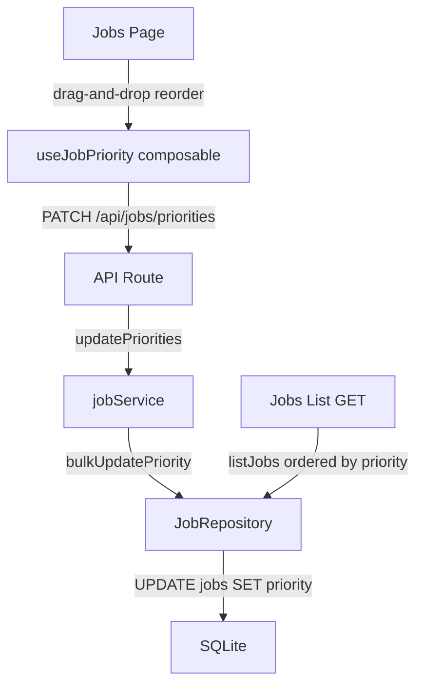
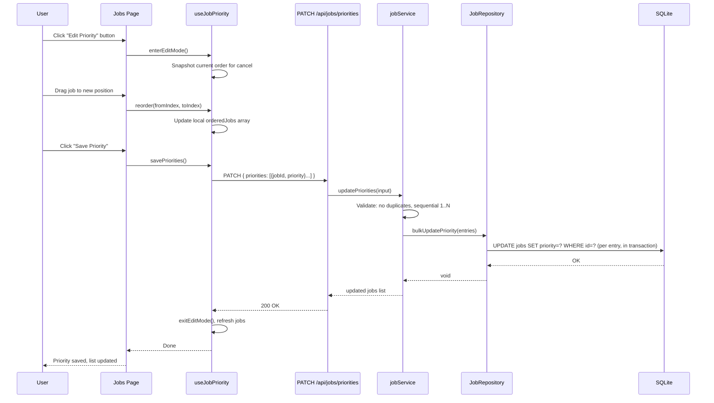
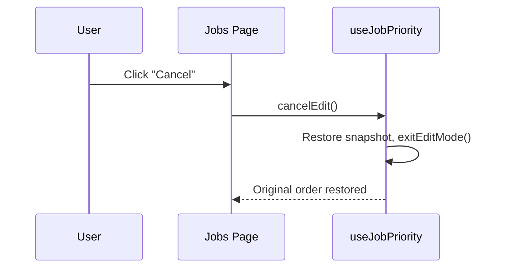

# Design Document: Job Page Priority

## Overview

This design addresses **GitHub Issue #71** — adding a master priority system to the Jobs page. Users will be able to enter a priority-editing mode, drag-and-drop jobs to reorder them, and save the new ordering. Each job's position in the list becomes its priority number (1 = top = highest priority). The priority is persisted as an integer column on the `jobs` table and returned in all job API responses, with the list endpoint sorting by priority ascending by default.

This feature lays the groundwork for future work-queue ordering by priority (out of scope for this issue). The existing `jiraPriority` field (a string sourced from Jira) is unrelated and remains unchanged — the new `priority` field is the shop-floor master priority.

## Architecture



The feature touches every layer of the stack but keeps changes minimal at each level:
- **Database**: New `priority` INTEGER column on `jobs` table (migration 009)
- **Repository**: New `bulkUpdatePriority` method + `list()` sorts by `priority ASC`
- **Service**: New `updatePriorities` method with validation
- **API**: New `PATCH /api/jobs/priorities` bulk-update endpoint
- **Composable**: New `useJobPriority` composable for drag-and-drop state
- **UI**: "Edit Priority" button on Jobs page, drag-and-drop mode with save/cancel

## Sequence Diagrams

### Priority Edit Flow



### Cancel Flow




## Components and Interfaces

### Component 1: Database Migration (009_add_job_priority.sql)

**Purpose**: Add `priority` column to `jobs` table and backfill existing rows.

**Schema Change**:
```sql
ALTER TABLE jobs ADD COLUMN priority INTEGER;

-- Backfill: assign priority based on creation order (oldest = 1)
UPDATE jobs SET priority = (
  SELECT COUNT(*) FROM jobs j2 WHERE j2.created_at <= jobs.created_at
);

CREATE INDEX idx_jobs_priority ON jobs(priority);
```

**Responsibilities**:
- Add nullable `priority` column (nullable during migration, but always populated after backfill)
- Backfill existing jobs with sequential priorities based on `created_at` order
- Index for efficient ordering

### Component 2: JobRepository Interface Extension

**Purpose**: Add bulk priority update capability.

**Interface**:
```typescript
// Addition to existing JobRepository interface
interface JobRepository {
  // ... existing methods ...
  bulkUpdatePriority(entries: { id: string; priority: number }[]): void
}
```

**Responsibilities**:
- Execute bulk priority updates within a single transaction
- Each entry maps a job ID to its new priority number

### Component 3: jobService Extension

**Purpose**: Validate and execute priority reordering.

**Interface**:
```typescript
// New input type
interface UpdatePrioritiesInput {
  priorities: { jobId: string; priority: number }[]
}

// Addition to jobService
interface JobService {
  // ... existing methods ...
  updatePriorities(input: UpdatePrioritiesInput): Job[]
}
```

**Responsibilities**:
- Validate that all job IDs exist
- Validate priorities are sequential 1..N with no gaps or duplicates
- Validate that the count matches total job count (all jobs must be included)
- Execute bulk update via repository
- Return updated job list

### Component 4: API Route (PATCH /api/jobs/priorities)

**Purpose**: Thin HTTP handler for bulk priority update.

**Interface**:
```typescript
// Request body
{ priorities: { jobId: string; priority: number }[] }

// Response: Job[] (updated list, sorted by priority)
```

**Responsibilities**:
- Parse request body
- Delegate to `jobService.updatePriorities()`
- Return updated jobs list
- Map errors to HTTP status codes (400, 404)

### Component 5: useJobPriority Composable

**Purpose**: Manage drag-and-drop priority editing state.

**Interface**:
```typescript
interface UseJobPriority {
  isEditingPriority: Readonly<Ref<boolean>>
  orderedJobs: Readonly<Ref<Job[]>>
  saving: Readonly<Ref<boolean>>
  
  enterEditMode(jobs: Job[]): void
  cancelEdit(): void
  reorder(fromIndex: number, toIndex: number): void
  savePriorities(): Promise<void>
}
```

**Responsibilities**:
- Track edit mode state
- Maintain a mutable ordered list during editing
- Snapshot original order for cancel
- Submit reordered priorities to API
- Refresh job list after save

### Component 6: Jobs Page UI Changes

**Purpose**: Add priority editing UX to the Jobs page.

**UI Elements**:
- "Edit Priority" button in the page header (next to "New Job")
- When in edit mode: drag handles on each row, "Save" and "Cancel" buttons replace the "Edit Priority" button
- Priority column shows the numeric priority (replaces or supplements the Jira priority column)
- Mobile: drag-and-drop on `JobMobileCard` list

**Responsibilities**:
- Toggle between normal view and priority-edit mode
- Render drag handles and visual feedback during reorder
- Disable row-click navigation while in edit mode
- Show loading state during save

## Data Models

### Job (Extended)

```typescript
export interface Job {
  id: string
  name: string
  goalQuantity: number
  priority: number              // NEW: shop-floor priority (1 = highest)
  jiraTicketKey?: string
  jiraTicketSummary?: string
  jiraPartNumber?: string
  jiraPriority?: string         // Jira-sourced priority string (unchanged)
  jiraEpicLink?: string
  jiraLabels?: readonly string[]
  createdAt: string
  updatedAt: string
}
```

**Validation Rules**:
- `priority` is a positive integer ≥ 1
- Within the full job set, priorities must be unique and sequential (1, 2, 3, ..., N)
- New jobs created after priorities exist get `priority = MAX(priority) + 1`

### UpdatePrioritiesInput

```typescript
export interface UpdatePrioritiesInput {
  priorities: { jobId: string; priority: number }[]
}
```

**Validation Rules**:
- Array must not be empty
- All `jobId` values must reference existing jobs
- All `priority` values must be positive integers
- Priorities must form a contiguous sequence 1..N
- No duplicate `jobId` or `priority` values
- Array length must equal total job count (every job must be included)


## Key Functions with Formal Specifications

### Function 1: updatePriorities()

```typescript
function updatePriorities(input: UpdatePrioritiesInput): Job[]
```

**Preconditions:**
- `input.priorities` is a non-empty array
- Every `jobId` in the array exists in the database
- Every `priority` is a positive integer ≥ 1
- The set of priorities forms a contiguous sequence `{1, 2, ..., N}`
- No duplicate `jobId` values in the array
- No duplicate `priority` values in the array
- `N` equals the total number of jobs in the database

**Postconditions:**
- Each job's `priority` field is updated to the specified value
- Each job's `updatedAt` is set to the current timestamp
- Returns the full list of jobs sorted by `priority ASC`
- No other job fields are modified

**Loop Invariants:**
- During bulk update iteration: all previously updated jobs have their new priority persisted

### Function 2: bulkUpdatePriority()

```typescript
function bulkUpdatePriority(entries: { id: string; priority: number }[]): void
```

**Preconditions:**
- All entries have valid job IDs that exist in the database
- All priority values are positive integers
- Called within a transaction context

**Postconditions:**
- Every job referenced in `entries` has its `priority` column set to the specified value
- Every job referenced in `entries` has its `updated_at` column set to the current timestamp
- The operation is atomic — either all updates succeed or none do

**Loop Invariants:**
- After processing entry `i`: jobs `0..i` have their new priority persisted in the transaction

### Function 3: reorder()

```typescript
function reorder(fromIndex: number, toIndex: number): void
```

**Preconditions:**
- `isEditingPriority` is `true`
- `fromIndex` and `toIndex` are valid indices within `orderedJobs`
- `fromIndex !== toIndex`

**Postconditions:**
- The job at `fromIndex` is moved to `toIndex`
- All other jobs shift to fill the gap
- `orderedJobs` length is unchanged
- The set of jobs is unchanged (same IDs, just reordered)

### Function 4: createJob() (Modified)

```typescript
function createJob(input: CreateJobInput): Job
```

**Preconditions (unchanged):**
- `input.name` is non-empty
- `input.goalQuantity` is positive

**Postconditions (extended):**
- All existing postconditions still hold
- The new job's `priority` is set to `MAX(existing priorities) + 1`
- If no jobs exist, priority is set to `1`

## Algorithmic Pseudocode

### Priority Update Algorithm

```typescript
ALGORITHM updatePriorities(input)
INPUT: input of type UpdatePrioritiesInput
OUTPUT: Job[] sorted by priority

BEGIN
  // Step 1: Validate input structure
  ASSERT input.priorities.length > 0

  const allJobs = repos.jobs.list()
  ASSERT input.priorities.length === allJobs.length
  
  // Step 2: Validate all job IDs exist
  const existingIds = new Set(allJobs.map(j => j.id))
  FOR EACH entry IN input.priorities DO
    ASSERT existingIds.has(entry.jobId)
  END FOR

  // Step 3: Validate no duplicate IDs
  const idSet = new Set(input.priorities.map(e => e.jobId))
  ASSERT idSet.size === input.priorities.length

  // Step 4: Validate priorities are sequential 1..N
  const prioritySet = new Set(input.priorities.map(e => e.priority))
  ASSERT prioritySet.size === input.priorities.length
  FOR i FROM 1 TO input.priorities.length DO
    ASSERT prioritySet.has(i)
  END FOR

  // Step 5: Execute bulk update
  const now = new Date().toISOString()
  repos.jobs.bulkUpdatePriority(
    input.priorities.map(e => ({ id: e.jobId, priority: e.priority }))
  )

  // Step 6: Return updated list
  RETURN repos.jobs.list()  // list() returns sorted by priority ASC
END
```

### Drag-and-Drop Reorder Algorithm

```typescript
ALGORITHM reorder(fromIndex, toIndex)
INPUT: fromIndex, toIndex (integers)
OUTPUT: mutated orderedJobs array

BEGIN
  ASSERT isEditingPriority === true
  ASSERT 0 <= fromIndex < orderedJobs.length
  ASSERT 0 <= toIndex < orderedJobs.length
  
  // Remove item from source position
  const [item] = orderedJobs.splice(fromIndex, 1)
  
  // Insert at target position
  orderedJobs.splice(toIndex, 0, item)
  
  // Invariant: orderedJobs.length unchanged, same set of jobs
  ASSERT orderedJobs.length === originalLength
END
```

### New Job Priority Assignment

```typescript
ALGORITHM assignNewJobPriority()
INPUT: none (reads from database)
OUTPUT: priority number for new job

BEGIN
  const maxPriority = repos.jobs.getMaxPriority()  // returns 0 if no jobs
  RETURN maxPriority + 1
END
```

## Example Usage

```typescript
// Example 1: Enter edit mode and reorder
const { isEditingPriority, orderedJobs, enterEditMode, reorder, savePriorities, cancelEdit } = useJobPriority()

// User clicks "Edit Priority"
enterEditMode(jobs.value)
// isEditingPriority.value === true
// orderedJobs.value === [...jobs sorted by current priority]

// User drags job from position 3 to position 0
reorder(3, 0)
// orderedJobs.value[0] is now the previously-4th job

// User clicks "Save"
await savePriorities()
// PATCH /api/jobs/priorities called with:
// { priorities: [{ jobId: "job_abc", priority: 1 }, { jobId: "job_def", priority: 2 }, ...] }

// Example 2: Cancel editing
enterEditMode(jobs.value)
reorder(2, 0)
cancelEdit()
// orderedJobs restored to original order, isEditingPriority === false

// Example 3: New job gets lowest priority
const newJob = await createJob({ name: "New Job", goalQuantity: 100 })
// newJob.priority === existingJobCount + 1

// Example 4: API route handler
// server/api/jobs/priorities.patch.ts
export default defineEventHandler(async (event) => {
  const body = await readBody(event)
  const { jobService } = getServices()
  return jobService.updatePriorities(body)
})
```


## Correctness Properties

*A property is a characteristic or behavior that should hold true across all valid executions of a system — essentially, a formal statement about what the system should do. Properties serve as the bridge between human-readable specifications and machine-verifiable correctness guarantees.*

### Property 1: New job priority assignment

*For any* number of existing jobs (including zero), creating a new job should assign it a priority equal to the count of existing jobs plus one, preserving the contiguous sequence {1, 2, ..., N+1}.

**Validates: Requirements 1.3, 1.4**

### Property 2: List sorted by priority

*For any* set of jobs in the database, listing jobs should return them sorted by priority in ascending order (priority 1 first).

**Validates: Requirement 2.1**

### Property 3: Valid priority update persists correctly

*For any* valid permutation of priorities across all existing jobs, after calling updatePriorities, each job's priority should equal the specified value, the set of priorities should be exactly {1, 2, ..., N}, and no two jobs should share a priority.

**Validates: Requirements 3.1, 3.2**

### Property 4: Invalid priority list rejection

*For any* priority list that contains duplicate job IDs, duplicate priority values, or priorities that do not form a contiguous sequence from 1 to N, the Job_Service should reject the request with a validation error and leave all job priorities unchanged.

**Validates: Requirements 3.3, 3.4, 3.5**

### Property 5: Non-existent job ID rejection

*For any* priority list that references a job ID not present in the database, the Job_Service should reject the request with a not-found error and leave all job priorities unchanged.

**Validates: Requirement 3.6**

### Property 6: Cancel restores snapshot

*For any* sequence of reorder operations performed after entering edit mode, calling cancelEdit should restore the job order to the exact snapshot taken at enterEditMode, with identical ordering and contents.

**Validates: Requirement 4.4**

### Property 7: Reorder conservation and correctness

*For any* valid (fromIndex, toIndex) pair within the ordered jobs list, calling reorder should move the job at fromIndex to toIndex, shift other jobs to fill the gap, and preserve the same set of job IDs with the same total count.

**Validates: Requirements 5.2, 5.3**

## Error Handling

### Error Scenario 1: Duplicate Priority Values

**Condition**: Input contains two entries with the same `priority` value
**Response**: `ValidationError` with message describing the duplicate
**Recovery**: Client receives 400, user can retry with corrected ordering

### Error Scenario 2: Missing Jobs in Priority List

**Condition**: Input `priorities` array doesn't include all existing jobs
**Response**: `ValidationError` — "Priority list must include all N jobs, got M"
**Recovery**: Client receives 400, composable should always send all jobs

### Error Scenario 3: Non-Existent Job ID

**Condition**: A `jobId` in the input doesn't exist in the database
**Response**: `NotFoundError` — "Job not found: {id}"
**Recovery**: Client receives 404, likely a stale UI — user should refresh

### Error Scenario 4: Non-Sequential Priorities

**Condition**: Priorities have gaps (e.g., 1, 2, 5) or start from 0
**Response**: `ValidationError` — "Priorities must be sequential from 1 to N"
**Recovery**: Client receives 400, composable auto-generates correct sequence

### Error Scenario 5: Concurrent Edit Conflict

**Condition**: Another user creates/deletes a job while priority edit is in progress
**Response**: `ValidationError` — job count mismatch between input and database
**Recovery**: Client receives 400, user should cancel, refresh, and retry

## Testing Strategy

### Unit Testing Approach

- **jobService.updatePriorities**: Valid input updates all priorities; rejects duplicates, gaps, missing jobs, non-existent IDs
- **jobService.createJob**: New job gets `MAX(priority) + 1`; first job gets priority 1
- **SQLiteJobRepository.bulkUpdatePriority**: Updates all rows in transaction; list() returns priority-sorted results
- **SQLiteJobRepository.list**: Returns jobs ordered by `priority ASC`
- **useJobPriority composable**: enterEditMode snapshots, reorder moves correctly, cancelEdit restores, savePriorities calls API

### Property-Based Testing Approach

**Property Test Library**: fast-check

- **CP-JP1: Priority Uniqueness** — For any sequence of createJob + updatePriorities operations, no two jobs share a priority
- **CP-JP2: Priority Contiguity** — After any updatePriorities call, the priority set is exactly {1..N}
- **CP-JP3: Reorder Conservation** — For any valid (fromIndex, toIndex) pair, reorder preserves the job ID set and array length
- **CP-JP4: New Job Priority Append** — Creating K jobs sequentially produces priorities 1..K

### Integration Testing Approach

- Full lifecycle: create 5 jobs → verify default priorities 1..5 → reorder → verify persisted → create new job → verify it gets priority 6
- Concurrent scenario: create jobs, start priority edit, create another job mid-edit, verify save fails with count mismatch
- Delete + priority: delete a job, verify remaining priorities can be re-compacted via updatePriorities

## Performance Considerations

- Bulk update uses a single transaction with N individual UPDATE statements — acceptable for typical job counts (< 1000)
- The `priority` column is indexed for efficient `ORDER BY priority ASC` queries
- No N+1 queries: the composable sends all priorities in a single PATCH request
- Drag-and-drop reorder is purely client-side array manipulation — no API calls until save

## Security Considerations

- No new authentication/authorization concerns (app uses kiosk mode with no passwords)
- Input validation prevents injection of invalid priority values
- Transaction isolation prevents partial priority updates from corrupting ordering

## Dependencies

- No new external dependencies required
- Drag-and-drop: use native HTML5 drag-and-drop API or Vue's built-in event handling (no library needed for simple list reorder)
- If richer DnD UX is desired, `vuedraggable` (Vue 3 compatible) could be added, but the initial implementation should use native events to keep dependencies minimal


## Addendum: PR Review Fixes

The following changes were made after the initial implementation based on a PR review of the `feat/job-priority` branch.

### Fix 1: Migration Backfill Tie-Breaking (Issue #1)

The original migration 009 used `COUNT(*) FROM jobs j2 WHERE j2.created_at <= jobs.created_at` to assign sequential priorities. If two jobs share the same `created_at` timestamp, they would receive the same priority — violating uniqueness. Migration 010 (`priority_not_null_resequence`) re-sequences using `rowid` as a tiebreaker:

```sql
UPDATE jobs SET priority = (
  SELECT COUNT(*) FROM jobs j2
  WHERE j2.created_at < jobs.created_at
     OR (j2.created_at = jobs.created_at AND j2.rowid <= jobs.rowid)
);
```

### Fix 2: orderedJobs Readonly (Issue #2)

The `useJobPriority` composable now wraps `orderedJobs` in `readonly()` in its return value, matching the design doc's `Readonly<Ref<Job[]>>` specification. Internal mutations via `reorder()` still work because they operate on the unwrapped ref.

### Fix 3: API Body Validation (Issue #3)

No code change — the project consistently uses thin API handlers that pass the body directly to the service layer, which performs all validation. This is the established pattern per the coding standards. The service already guards against `null`/`undefined` priorities arrays.

### Fix 4: Mobile Touch Event Support (Issue #4)

HTML5 drag-and-drop events (`dragstart`, `dragover`, `drop`) do not fire on touch devices. Added touch event handlers (`touchstart`, `touchmove`, `touchend`) to the Jobs page and `JobMobileCard` component. The touch handler uses `document.elementFromPoint` via a `getCardIndexFromPoint` helper to determine the drop target during `touchmove`, then calls `reorder()` on `touchend`.

### Fix 5: Completed Jobs Excluded from Priority Editing (Spec Divergence)

The implementation diverges from the original spec in a deliberate way: completed jobs (where `completedParts >= goalQuantity`) are excluded from the priority edit list and assigned `priority = 0`. This means:

- `updatePriorities` validates against active (non-completed) job count, not total job count
- Completed jobs are sorted to the bottom of the list via `ORDER BY CASE WHEN priority = 0 THEN 1 ELSE 0 END, priority ASC`
- The composable's `enterEditMode` receives only active jobs from the page

This is better UX — completed jobs shouldn't be dragged around in the priority queue. The requirements and design docs are updated to reflect this behavior.

### Fix 6: NOT NULL Constraint on Priority Column (Issue #6)

Migration 010 recreates the `jobs` table with `priority INTEGER NOT NULL DEFAULT 0` for defensive data integrity. SQLite doesn't support `ALTER TABLE ... ALTER COLUMN`, so the migration uses the create-copy-drop-rename pattern.

### Schema Change (Migration 010)

```sql
-- Re-sequence with rowid tiebreaker
-- Recreate jobs table with: priority INTEGER NOT NULL DEFAULT 0
-- Recreate idx_jobs_priority index
```
