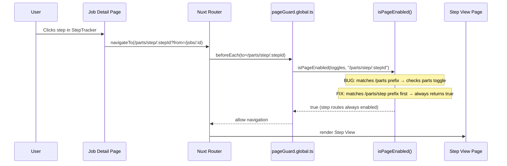

# Design Document: Job Step Dashboard Redirect (Bug Fix)

## Overview

When a user navigates from the Job detail page (`/jobs/:id`) to a step view (`/parts/step/:stepId`), the global route middleware `pageGuard.global.ts` incorrectly redirects to the Dashboard (`/`). The root cause is that the `isPageEnabled()` function in the page-toggle system matches `/parts/step/:stepId` against the `/parts` toggle key. If the "parts" page is toggled off in Settings → Page Visibility, any step URL is blocked — even when the user arrived from an enabled page like Jobs. Additionally, the step view route (`/parts/step/:stepId`) is conceptually a shared detail route used by multiple entry points (Jobs, Parts, Work Queue), not exclusively a child of the Parts page.

The fix introduces an `ALWAYS_ENABLED_ROUTES` prefix list and checks it before `ROUTE_TOGGLE_MAP` so that step detail pages are never gated by the "parts" list toggle. Step views should always be accessible regardless of the "parts" toggle state, since they serve as the universal advancement/creation UI reachable from Jobs, Parts, and Work Queue.

## Main Algorithm/Workflow



## Core Interfaces/Types

```typescript
// server/types/domain.ts — PageToggles (unchanged)
interface PageToggles {
  jobs: boolean
  serials: boolean
  parts: boolean
  queue: boolean
  templates: boolean
  bom: boolean
  certs: boolean
  jira: boolean
  audit: boolean
}
```

```typescript
// server/utils/pageToggles.ts — ROUTE_TOGGLE_MAP (modified)

// BEFORE (buggy): /parts/step/:stepId matches /parts → gated by parts toggle
const ROUTE_TOGGLE_MAP: Record<string, keyof PageToggles> = {
  '/jobs': 'jobs',
  '/serials': 'serials',
  '/parts': 'parts',
  '/queue': 'queue',
  '/templates': 'templates',
  '/bom': 'bom',
  '/certs': 'certs',
  '/jira': 'jira',
  '/audit': 'audit',
}

// AFTER (fixed): /parts/step is always-enabled, checked before /parts
// isPageEnabled() is updated to treat certain sub-routes as always-enabled
```

## Key Functions with Formal Specifications

### Function 1: isPageEnabled() — updated

```typescript
function isPageEnabled(pageToggles: PageToggles, routePath: string): boolean
```

**Preconditions:**

- `pageToggles` is a valid `PageToggles` object (all 9 keys present, boolean values)
- `routePath` is a non-empty string starting with `/`

**Postconditions:**

- Returns `true` for `/` and `/settings` (always-enabled routes — unchanged)
- Returns `true` for any route starting with `/parts/step/` regardless of `pageToggles.parts` value
- Returns `pageToggles[toggleKey]` for all other mapped routes (unchanged behavior)
- Returns `true` for unmapped routes (unchanged behavior)
- `/parts` and `/parts?query=...` still respect the `parts` toggle (only `/parts/step/` is exempt)

**Loop Invariants:**

- Iteration over `ROUTE_TOGGLE_MAP` entries is order-independent for non-overlapping prefixes
- The always-enabled sub-route check (`ALWAYS_ENABLED_ROUTES`) is evaluated before the prefix match loop

### Function 2: resolveBackNavigation() — unchanged, included for context

```typescript
function resolveBackNavigation(from: string | undefined | null): BackNavigation
```

**Preconditions:**

- `from` may be `undefined`, `null`, or a string

**Postconditions:**

- If `from` starts with `/jobs/`, returns `{ to: from, label: 'Back to Job' }`
- Otherwise returns `{ to: '/parts', label: 'Back to Parts' }`
- No side effects

## Algorithmic Pseudocode

### Fix: isPageEnabled with Always-Enabled Sub-Routes

```typescript
// New constant: sub-route prefixes that bypass their parent's toggle
const ALWAYS_ENABLED_ROUTES: readonly string[] = [
  '/parts/step', // Step view is reachable from Jobs, Parts, and Work Queue
]

function isPageEnabled(pageToggles: PageToggles, routePath: string): boolean {
  // 1. Dashboard and Settings are always enabled (unchanged)
  if (routePath === '/' || routePath === '/settings') {
    return true
  }

  // 2. NEW: Check always-enabled sub-routes before parent prefix matching
  for (const prefix of ALWAYS_ENABLED_ROUTES) {
    if (routePath === prefix || routePath.startsWith(prefix + '/')) {
      return true
    }
  }

  // 3. Standard toggle check (unchanged)
  for (const [basePath, toggleKey] of Object.entries(ROUTE_TOGGLE_MAP)) {
    if (routePath === basePath || routePath.startsWith(basePath + '/')) {
      return pageToggles[toggleKey] !== false
    }
  }

  // 4. Unmapped routes are enabled (unchanged)
  return true
}
```

**Preconditions:**

- `pageToggles` is a valid PageToggles object
- `routePath` starts with `/`

**Postconditions:**

- `/parts/step/abc123` → `true` (always, regardless of parts toggle)
- `/parts` → `pageToggles.parts` (unchanged)
- `/parts?foo=bar` → `pageToggles.parts` (unchanged, no startsWith match on `/parts/step`)
- `/jobs/abc123` → `pageToggles.jobs` (unchanged)

**Loop Invariants:**

- All previously checked ALWAYS_ENABLED_ROUTES prefixes did not match when loop continues
- All previously checked ROUTE_TOGGLE_MAP entries did not match when loop continues

### pageGuard.global.ts — No Changes Required

```typescript
// The middleware itself needs no changes. The fix is entirely in isPageEnabled().
export default defineNuxtRouteMiddleware((to) => {
  const { settings } = useSettings()
  const pageToggles = settings.value?.pageToggles ?? DEFAULT_PAGE_TOGGLES

  // This call now correctly returns true for /parts/step/* routes
  if (!isPageEnabled(pageToggles, to.path)) {
    return navigateTo('/')
  }
})
```

## Example Usage

```typescript
import { isPageEnabled, DEFAULT_PAGE_TOGGLES } from '~/server/utils/pageToggles'

// Scenario: parts toggle is OFF, user clicks step from Job detail
const toggles = { ...DEFAULT_PAGE_TOGGLES, parts: false }

// BEFORE fix: returns false → redirects to Dashboard
// AFTER fix: returns true → step view loads correctly
isPageEnabled(toggles, '/parts/step/step_abc123') // true

// Parts list page still respects the toggle
isPageEnabled(toggles, '/parts') // false
isPageEnabled(toggles, '/parts?search=foo') // false (no prefix match on /parts/step)

// Jobs page unaffected
isPageEnabled(toggles, '/jobs/job_123') // true (jobs toggle is true)

// Step view from Work Queue also works
isPageEnabled(toggles, '/parts/step/step_xyz') // true (always enabled)

// All toggles ON — everything works as before
isPageEnabled(DEFAULT_PAGE_TOGGLES, '/parts/step/s1') // true
isPageEnabled(DEFAULT_PAGE_TOGGLES, '/parts') // true
```

## Correctness Properties

_A property is a characteristic or behavior that should hold true across all valid executions of a system — essentially, a formal statement about what the system should do. Properties serve as the bridge between human-readable specifications and machine-verifiable correctness guarantees._

### Property 1: Step view routes are always enabled

_For any_ step ID string and _for any_ page toggle configuration, `isPageEnabled(toggles, /parts/step/${stepId})` should return `true`.

**Validates: Requirements 1.1, 1.2, 1.3, 4.3**

### Property 2: Non-step /parts routes respect the parts toggle

_For any_ page toggle configuration and _for any_ `/parts` sub-route that does not match an ALWAYS_ENABLED_ROUTES prefix, `isPageEnabled(toggles, path)` should equal `toggles.parts`.

**Validates: Requirements 2.1, 2.2**

### Property 3: All other toggle-mapped routes are unaffected

_For any_ page toggle configuration and _for any_ route in ROUTE_TOGGLE_MAP (excluding `/parts/step` sub-routes), `isPageEnabled(toggles, route)` should equal the value of the corresponding toggle key.

**Validates: Requirements 3.1, 3.2**

### Property 4: Dashboard and Settings are always enabled

_For any_ page toggle configuration, `isPageEnabled(toggles, '/')` and `isPageEnabled(toggles, '/settings')` should both return `true`.

**Validates: Requirements 5.1, 5.2**
