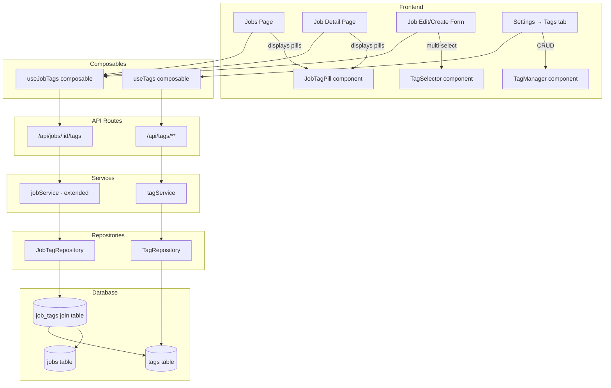
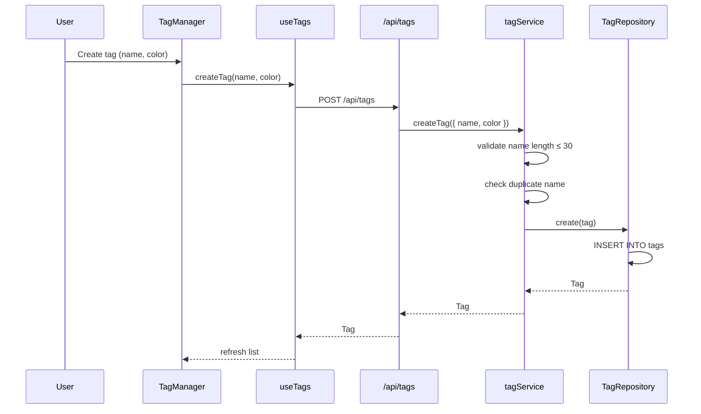
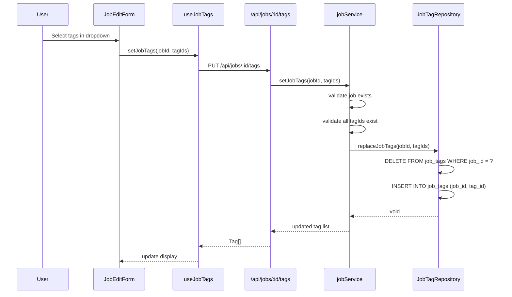
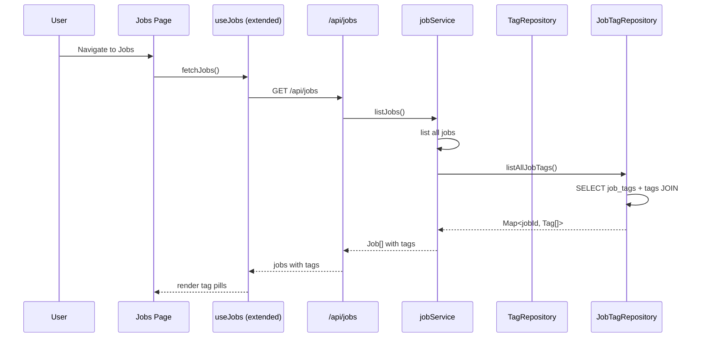
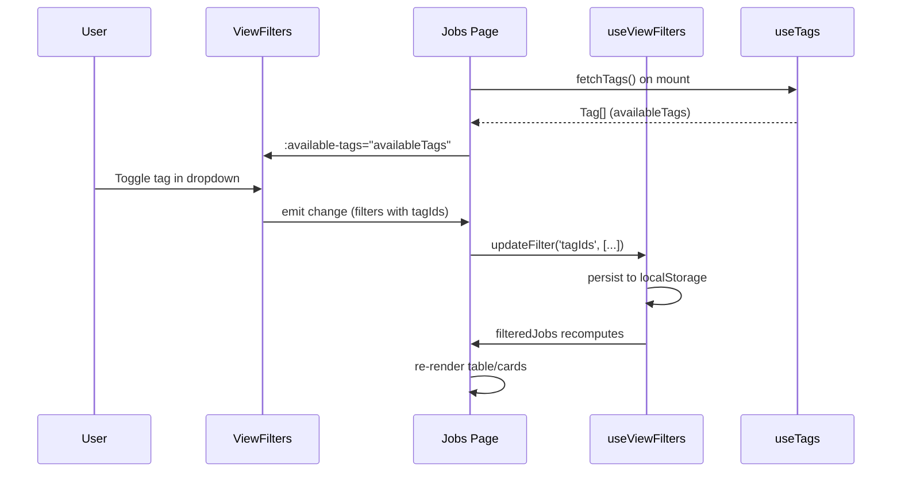

# Design Document: Job Tags

> GitHub Issue #95 — Feature Request: Job Tags

## Overview

Job Tags adds a custom labeling system to production jobs, allowing shop-floor users to visually identify jobs with long lead processes, multiple machine ops, or other custom categories. Tags are user-defined entities with a name, color, and character limit, displayed as colored pill badges alongside job names in the queue, job list, and job detail pages.

The feature follows the existing Library/Settings CRUD pattern (similar to Process Library and Location Library) for tag management, and introduces a many-to-many join table (`job_tags`) to associate tags with jobs. Tag management lives under Settings → Tags. Tag assignment happens on the Job edit/create form via a multi-select dropdown with inline tag creation.

This design mirrors established patterns in the codebase: migration-based schema changes, repository interface → SQLite implementation, service-layer business logic, `defineApiHandler` API routes, composable-driven frontend state, and Nuxt UI components.

## Architecture



## Sequence Diagrams

### Tag CRUD (Settings)



### Assign Tags to Job



### Display Tags on Job Queue



## Components and Interfaces

### Component: TagRepository

**Purpose**: Data access for the `tags` table.

```typescript
interface TagRepository {
  list(): Tag[]
  getById(id: string): Tag | null
  getByIds(ids: string[]): Tag[]
  create(tag: Tag): Tag
  update(id: string, partial: Partial<Tag>): Tag
  delete(id: string): boolean
  findByName(name: string): Tag | null
}
```

**Responsibilities**:
- CRUD operations on the `tags` table
- Name-based lookup for duplicate checking

### Component: JobTagRepository

**Purpose**: Data access for the `job_tags` join table.

```typescript
interface JobTagRepository {
  getTagsByJobId(jobId: string): Tag[]
  getTagsForJobs(jobIds: string[]): Map<string, Tag[]>
  replaceJobTags(jobId: string, tagIds: string[]): void
  removeAllTagsForJob(jobId: string): void
  countJobsByTagId(tagId: string): number
}
```

**Responsibilities**:
- Manage many-to-many relationship between jobs and tags
- Bulk-fetch tags for multiple jobs (avoids N+1 on job list)
- Replace strategy for tag assignment (delete all + re-insert)

### Component: tagService

**Purpose**: Business logic for tag CRUD and validation.

```typescript
interface TagService {
  listTags(): Tag[]
  createTag(input: CreateTagInput): Tag
  updateTag(id: string, input: UpdateTagInput): Tag
  deleteTag(id: string): void
  getTagsByJobId(jobId: string): Tag[]
}
```

**Responsibilities**:
- Name validation (non-empty, ≤ 30 characters, trimmed)
- Duplicate name prevention (case-insensitive)
- Color validation (valid hex color)
- Deletion with cascade (DB handles join table cleanup; UI shows usage count confirmation before calling delete)

### Component: TagManager (Vue)

**Purpose**: Settings page component for tag CRUD with color picker.

**Responsibilities**:
- List all tags with colored pill preview
- Inline create form (name input + color picker)
- Edit tag name and color
- Delete with confirmation (shows usage count)

### Component: TagSelector (Vue)

**Purpose**: Multi-select dropdown for assigning tags to a job.

**Responsibilities**:
- Dropdown with existing tags as selectable options
- Multi-select with pill display of selected tags
- Inline "Create new tag" option at bottom of dropdown
- Used in JobCreationForm and job edit page

### Component: JobTagPill (Vue)

**Purpose**: Small colored pill badge for displaying a tag.

**Responsibilities**:
- Render tag name in small text with background color
- Used in job list rows, job detail header, and job mobile cards

## Data Models

### Tag

```typescript
interface Tag {
  id: string        // tag_{nanoid(12)}
  name: string      // max 30 chars, unique (case-insensitive)
  color: string     // hex color, e.g. "#ef4444"
  createdAt: string  // ISO 8601
  updatedAt: string  // ISO 8601
}
```

**Validation Rules**:
- `name`: non-empty, trimmed, max 30 characters, unique (case-insensitive)
- `color`: valid 7-character hex color string (`#RRGGBB`)

### JobTag (join)

```typescript
// No domain type needed — handled at repository level
// SQL: job_tags(job_id TEXT, tag_id TEXT, PRIMARY KEY(job_id, tag_id))
```

### Database Schema (Migration 013)

```sql
-- 013_add_job_tags.sql

CREATE TABLE tags (
  id TEXT PRIMARY KEY,
  name TEXT NOT NULL,
  color TEXT NOT NULL DEFAULT '#8b5cf6',
  created_at TEXT NOT NULL,
  updated_at TEXT NOT NULL
);

CREATE UNIQUE INDEX idx_tags_name_lower ON tags(LOWER(name));

CREATE TABLE job_tags (
  job_id TEXT NOT NULL REFERENCES jobs(id) ON DELETE CASCADE,
  tag_id TEXT NOT NULL REFERENCES tags(id) ON DELETE CASCADE,
  PRIMARY KEY (job_id, tag_id)
);

CREATE INDEX idx_job_tags_tag_id ON job_tags(tag_id);
```

### API Input Types

```typescript
interface CreateTagInput {
  name: string
  color?: string  // defaults to violet (#8b5cf6) if omitted
}

interface UpdateTagInput {
  name?: string
  color?: string
}

interface SetJobTagsInput {
  tagIds: string[]
}
```

## Key Functions with Formal Specifications

### Function: tagService.createTag()

```typescript
function createTag(input: CreateTagInput): Tag
```

**Preconditions:**
- `input.name` is a non-empty string
- `input.name.trim().length` ≤ 30
- No existing tag with same name (case-insensitive)
- If `input.color` provided, it matches `/^#[0-9a-fA-F]{6}$/`

**Postconditions:**
- Returns a new `Tag` with generated `id` (prefix `tag_`)
- Tag is persisted in the `tags` table
- `tag.name` is trimmed
- `tag.color` defaults to `'#8b5cf6'` if not provided

**Loop Invariants:** N/A

### Function: tagService.updateTag()

```typescript
function updateTag(id: string, input: UpdateTagInput): Tag
```

**Preconditions:**
- Tag with `id` exists
- If `input.name` provided: non-empty, trimmed length ≤ 30, no duplicate (excluding self)
- If `input.color` provided: valid hex color

**Postconditions:**
- Returns updated `Tag`
- Only provided fields are modified
- `updatedAt` is refreshed

**Loop Invariants:** N/A

### Function: tagService.deleteTag()

```typescript
function deleteTag(id: string): void
```

**Preconditions:**
- Tag with `id` exists

**Postconditions:**
- Tag is removed from `tags` table
- All `job_tags` rows referencing this tag are cascade-deleted
- No orphan references remain

**Loop Invariants:** N/A

### Function: jobService.setJobTags()

```typescript
function setJobTags(jobId: string, tagIds: string[]): Tag[]
```

**Preconditions:**
- Job with `jobId` exists
- All `tagIds` reference existing tags
- `tagIds` contains no duplicates

**Postconditions:**
- `job_tags` for this job contains exactly the provided `tagIds`
- Previous associations are replaced (delete + re-insert)
- Returns the full `Tag[]` now associated with the job

**Loop Invariants:** N/A

### Function: jobTagRepository.getTagsForJobs()

```typescript
function getTagsForJobs(jobIds: string[]): Map<string, Tag[]>
```

**Preconditions:**
- `jobIds` is an array of strings (may be empty)

**Postconditions:**
- Returns a Map where each key is a jobId and value is the array of associated Tags
- Jobs with no tags have an empty array (or are absent from the map)
- Single query with JOIN (no N+1)

**Loop Invariants:** N/A

## Algorithmic Pseudocode

### Tag Creation Algorithm

```typescript
function createTag(input: CreateTagInput): Tag {
  // 1. Validate and normalize
  assertNonEmpty(input.name, 'name')
  const trimmed = input.name.trim()
  if (trimmed.length > 30) {
    throw new ValidationError('Tag name must be 30 characters or fewer')
  }

  // 2. Validate color if provided
  const color = input.color ?? '#8b5cf6'
  if (!/^#[0-9a-fA-F]{6}$/.test(color)) {
    throw new ValidationError('Color must be a valid hex color (e.g. #ef4444)')
  }

  // 3. Check uniqueness (case-insensitive)
  const existing = repos.tags.findByName(trimmed)
  if (existing) {
    throw new ValidationError('A tag with this name already exists')
  }

  // 4. Create and persist
  const now = new Date().toISOString()
  const tag: Tag = {
    id: generateId('tag'),
    name: trimmed,
    color,
    createdAt: now,
    updatedAt: now,
  }

  return repos.tags.create(tag)
}
```

### Set Job Tags Algorithm (Replace Strategy)

```typescript
function setJobTags(jobId: string, tagIds: string[]): Tag[] {
  // 1. Validate job exists
  const job = repos.jobs.getById(jobId)
  if (!job) throw new NotFoundError('Job', jobId)

  // 2. Deduplicate
  const uniqueIds = [...new Set(tagIds)]

  // 3. Validate all tags exist
  if (uniqueIds.length > 0) {
    const foundTags = repos.tags.getByIds(uniqueIds)
    if (foundTags.length !== uniqueIds.length) {
      const foundIds = new Set(foundTags.map(t => t.id))
      const missing = uniqueIds.find(id => !foundIds.has(id))
      throw new NotFoundError('Tag', missing!)
    }
  }

  // 4. Replace associations (atomic: delete all + re-insert)
  repos.jobTags.replaceJobTags(jobId, uniqueIds)

  // 5. Return current tags
  return repos.jobTags.getTagsByJobId(jobId)
}
```

### Bulk Tag Fetch for Job List

```typescript
function listJobsWithTags(): (Job & { tags: Tag[] })[] {
  const jobs = repos.jobs.list()
  const jobIds = jobs.map(j => j.id)
  const tagMap = repos.jobTags.getTagsForJobs(jobIds)

  return jobs.map(job => ({
    ...job,
    tags: tagMap.get(job.id) ?? [],
  }))
}
```

## Example Usage

```typescript
// === Tag Management (Settings) ===

// Create a tag
const tag = tagService.createTag({ name: 'Long Lead', color: '#ef4444' })
// → { id: 'tag_V1StGXR8_Z5j', name: 'Long Lead', color: '#ef4444', ... }

// List all tags
const allTags = tagService.listTags()
// → [{ id: 'tag_...', name: 'Long Lead', color: '#ef4444' }, ...]

// Update tag color
tagService.updateTag(tag.id, { color: '#f59e0b' })

// Delete tag
tagService.deleteTag(tag.id)

// === Tag Assignment (Job Edit) ===

// Set tags on a job (replaces existing)
const jobTags = jobService.setJobTags('job_abc123', ['tag_xyz', 'tag_def'])
// → [{ id: 'tag_xyz', name: 'Long Lead', ... }, { id: 'tag_def', name: 'Multi-Op', ... }]

// Clear all tags from a job
jobService.setJobTags('job_abc123', [])
// → []

// === Display (Job List) ===

// Fetch jobs with tags for the queue page
const jobsWithTags = jobService.listJobsWithTags()
// → [{ id: 'job_abc', name: 'Bracket Assembly', tags: [{ name: 'Long Lead', color: '#ef4444' }], ... }]
```

## Correctness Properties

1. **Tag Name Uniqueness**: For all tags t1, t2 in the system: `t1.id ≠ t2.id ⟹ LOWER(t1.name) ≠ LOWER(t2.name)`

2. **Tag Name Length Bound**: For all tags t: `1 ≤ t.name.length ≤ 30`

3. **Tag Color Validity**: For all tags t: `t.color` matches `/^#[0-9a-fA-F]{6}$/`

4. **Job-Tag Association Integrity**: For all entries (jobId, tagId) in job_tags: the referenced job and tag both exist

5. **Replace Idempotence**: Calling `setJobTags(jobId, tagIds)` twice with the same inputs produces the same result — the set of associated tags is identical

6. **Cascade Deletion Completeness**: After `deleteTag(tagId)`, no rows in `job_tags` reference `tagId`

7. **Bulk Fetch Completeness**: `getTagsForJobs(jobIds)` returns tags for every jobId that has associations — no tags are lost

8. **No Duplicate Associations**: For any job, each tag appears at most once in the association (enforced by PRIMARY KEY)

## Error Handling

### Error: Duplicate Tag Name

**Condition**: User creates or renames a tag to a name that already exists (case-insensitive)
**Response**: `ValidationError('A tag with this name already exists')` → 400
**Recovery**: User chooses a different name

### Error: Tag Name Too Long

**Condition**: Tag name exceeds 30 characters after trimming
**Response**: `ValidationError('Tag name must be 30 characters or fewer')` → 400
**Recovery**: User shortens the name

### Error: Invalid Color

**Condition**: Color string doesn't match hex format
**Response**: `ValidationError('Color must be a valid hex color')` → 400
**Recovery**: User selects a valid color from the picker

### Error: Tag Not Found

**Condition**: Update/delete references a non-existent tag ID
**Response**: `NotFoundError('Tag', id)` → 404
**Recovery**: Refresh tag list

### Error: Job Not Found (Tag Assignment)

**Condition**: Setting tags on a non-existent job
**Response**: `NotFoundError('Job', jobId)` → 404
**Recovery**: Navigate back to job list

### Error: Referenced Tag Not Found (Tag Assignment)

**Condition**: One or more tagIds in `setJobTags` don't exist
**Response**: `NotFoundError('Tag', missingId)` → 404
**Recovery**: Refresh available tags and retry

## Testing Strategy

### Unit Testing Approach

- **tagService**: Test createTag validation (name length, duplicates, color format), updateTag partial updates, deleteTag
- **jobService.setJobTags**: Test replace behavior, validation of job/tag existence, deduplication
- **TagRepository**: Test CRUD operations, case-insensitive uniqueness, findByName
- **JobTagRepository**: Test replaceJobTags atomicity, getTagsForJobs bulk fetch, cascade behavior

### Property-Based Testing Approach

**Property Test Library**: fast-check

- **CP-TAG-1: Name Uniqueness** — For any sequence of createTag calls with distinct names, all succeed; duplicate names (case-insensitive) always throw ValidationError
- **CP-TAG-2: Name Length Bound** — For any string whose trimmed length is > 30, createTag throws; for any string whose trimmed length is 1–30, createTag succeeds (assuming unique). The fast-check arbitrary filters to `s.trim().length > 30` to prevent whitespace-padded strings from producing false negatives.
- **CP-TAG-3: Replace Idempotence** — For any jobId and tagIds, calling setJobTags twice produces identical associations
- **CP-TAG-4: Cascade Completeness** — After deleting a tag, getTagsForJobs never returns that tag for any job
- **CP-TAG-5: Bulk Fetch Completeness** — For any set of jobs with known tag assignments, getTagsForJobs returns exactly the expected tags per job

### Integration Testing Approach

Integration-level behaviors (full lifecycle, cascade on job deletion, concurrent assignment) are covered by the property-based tests (CP-TAG-3 through CP-TAG-5) which exercise the real SQLite repositories in-process. No separate integration test suite is needed.

## Performance Considerations

- **Bulk fetch**: `getTagsForJobs()` uses a single JOIN query with `WHERE job_id IN (...)` to avoid N+1 queries on the job list page
- **Index on job_tags.tag_id**: Supports efficient reverse lookup (which jobs use a tag) for deletion safety checks and usage counts
- **Case-insensitive unique index**: `idx_tags_name_lower` on `LOWER(name)` enforced at DB level, not just application level
- Tags are a small dataset (typically < 50 entries) — no pagination needed

## Security Considerations

- Tag CRUD in Settings should be admin-gated (consistent with other Settings operations)
- Tag assignment on jobs does not require admin (any authenticated user can tag jobs)
- All tag API routes go through the existing JWT auth middleware
- Tag names are trimmed and length-limited to prevent abuse

## Tag Filtering on Jobs Page

### Overview

The Jobs page filter bar (`ViewFilters` component) is extended with a multi-select tag dropdown that filters the job list client-side. This reuses the existing `useViewFilters` composable and `FilterState` type, adding a `tagIds: string[]` field. Filtering uses AND logic: a job must have ALL selected tags to pass the filter.

### Data Flow



### Changes to Existing Types

`FilterState` (in `server/types/domain.ts`) gains optional fields for tag filtering and grouping:

```typescript
interface FilterState {
  // ... existing fields ...
  tagIds?: string[]
  groupByTag?: boolean
}
```

### Filter Logic

The `applyFilters` function in `useViewFilters` gains a `tagIds` accessor. When `filters.tagIds` has entries, each item must have ALL selected tags (AND logic):

```typescript
if (f.tagIds?.length && accessors.tagIds) {
  const itemTagIds = accessors.tagIds(item)
  if (!f.tagIds.every(id => itemTagIds.includes(id))) return false
}
```

### Component Changes

- `ViewFilters.vue`: Accepts optional `availableTags: Tag[]` prop. Renders a tag dropdown button with checkbox-style tag selection, colored pill previews, and a count badge. Also renders a "Group by Tag" toggle button.
- `Jobs page`: Fetches tags via `useTags().fetchTags()` on mount (parallel with job fetch). Passes `availableTags` to `ViewFilters`. Adds `tagIds` accessor to `applyFilters` call.

## Tag Grouping on Jobs Page

### Overview

When "Group by Tag" is enabled, the flat job list is reorganized into collapsible sections — one per tag — with a colored tag pill header and job count badge. Jobs with multiple tags appear in each matching group. Untagged jobs appear in an "Untagged" group at the bottom. This is a purely client-side transformation of the already-fetched `filteredJobs` array.

### Grouping Algorithm

```typescript
interface JobTagGroup {
  tag: Tag | null       // null = "Untagged" group
  jobs: (Job & { tags: Tag[] })[]
}

function groupJobsByTag(
  jobs: (Job & { tags: Tag[] })[],
  allTags: Tag[],
): JobTagGroup[] {
  const groupMap = new Map<string, (Job & { tags: Tag[] })[]>()
  const untagged: (Job & { tags: Tag[] })[] = []

  for (const job of jobs) {
    if (!job.tags?.length) {
      untagged.push(job)
      continue
    }
    for (const tag of job.tags) {
      const list = groupMap.get(tag.id) ?? []
      list.push(job)
      groupMap.set(tag.id, list)
    }
  }

  // Build groups in the order tags appear in allTags (consistent ordering)
  const groups: JobTagGroup[] = []
  for (const tag of allTags) {
    const tagJobs = groupMap.get(tag.id)
    if (tagJobs?.length) {
      groups.push({ tag, jobs: tagJobs })
    }
  }
  if (untagged.length) {
    groups.push({ tag: null, jobs: untagged })
  }
  return groups
}
```

### Interaction with Filters

When both grouping and tag filtering are active:
- Only groups whose tag is in the selected `tagIds` are shown (plus "Untagged" if no tag filter is active)
- Within each group, jobs still pass through all other active filters (job name, status, priority, step)
- This means the tag filter effectively selects which groups are visible

### Interaction with Priority Edit Mode

Grouping and priority reordering are mutually exclusive. When the user enters priority edit mode, grouping is temporarily disabled and the flat ordered list is shown. The group-by state is preserved and restored when edit mode exits.

### UI Structure (Grouped View)

```
┌─────────────────────────────────────────────┐  ← border: tag color (#ef4444)
│ [▾] [Tag Pill: "Long Lead"]       12 jobs ▾ │
├─────────────────────────────────────────────┤
│  [▸] #1  Job row 1                          │  ← expand chevron per row
│  [▾] #2  Job row 2                          │
│     └─ JobExpandableRow (paths/steps)       │
│  ...                                        │
└─────────────────────────────────────────────┘

┌─────────────────────────────────────────────┐  ← border: tag color (#3b82f6)
│ [▾] [Tag Pill: "Multi-Op"]         5 jobs ▾ │
├─────────────────────────────────────────────┤
│  [▸] #3  Job row 3                          │
│  [▸] #4  Job row 4 (also in "Long Lead")   │
│  ...                                        │
└─────────────────────────────────────────────┘

┌─────────────────────────────────────────────┐  ← border: default UI border
│ [▾] Untagged                       3 jobs ▾ │
├─────────────────────────────────────────────┤
│  [▸] #7  Job row 7                          │
│  ...                                        │
└─────────────────────────────────────────────┘
```

Each group container uses an inline `borderColor` style set to the tag's hex color (or `var(--ui-border)` for untagged groups). Each job row within a group has an expand/collapse chevron button that toggles a `JobExpandableRow` below it, providing the same path/step drill-down as the flat UTable view. The expand state is tracked via a separate `expandedGroupedJobs: Set<string>` ref (keyed by job ID), and the toolbar's "Expand All Jobs" / "Collapse All Jobs" actions work in both flat and grouped modes.

### State Persistence

The `groupByTag` boolean is stored in `FilterState` and persisted to localStorage alongside existing filters. The `clearFilters()` function resets it to `false`.

## Dependencies

- **Existing**: better-sqlite3, nanoid, zod, Nuxt UI (UBadge, USelectMenu, UInput, UButton)
- **No new dependencies required** — color picker can use a simple preset palette or UInput with type="color"
- **Setup note**: `jose` and `bcryptjs` must be installed (`npm install --legacy-peer-deps`) before running tests. These are existing project dependencies for PIN auth — not introduced by this feature — but were missing from `node_modules` at branch creation.
