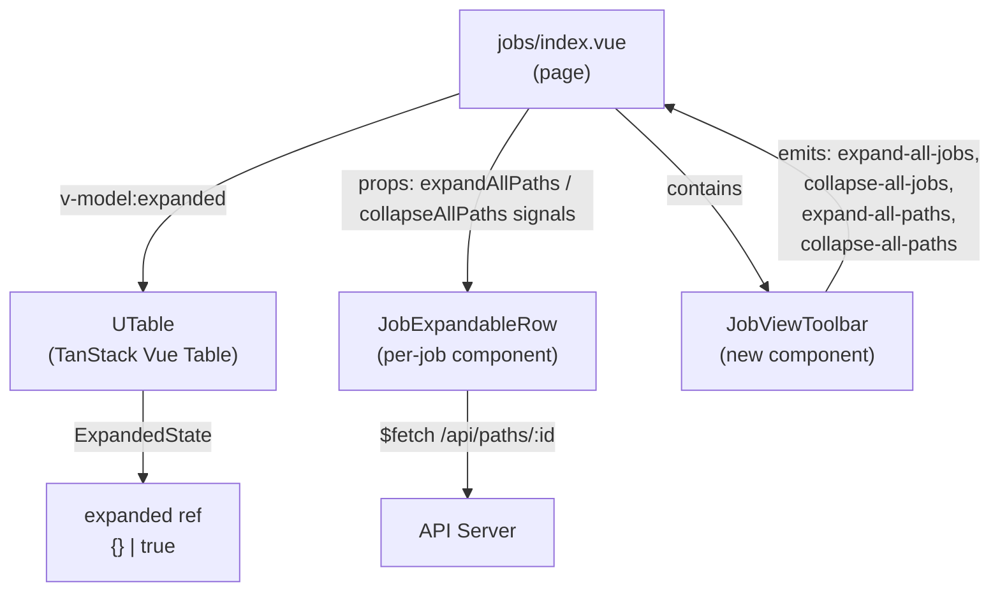
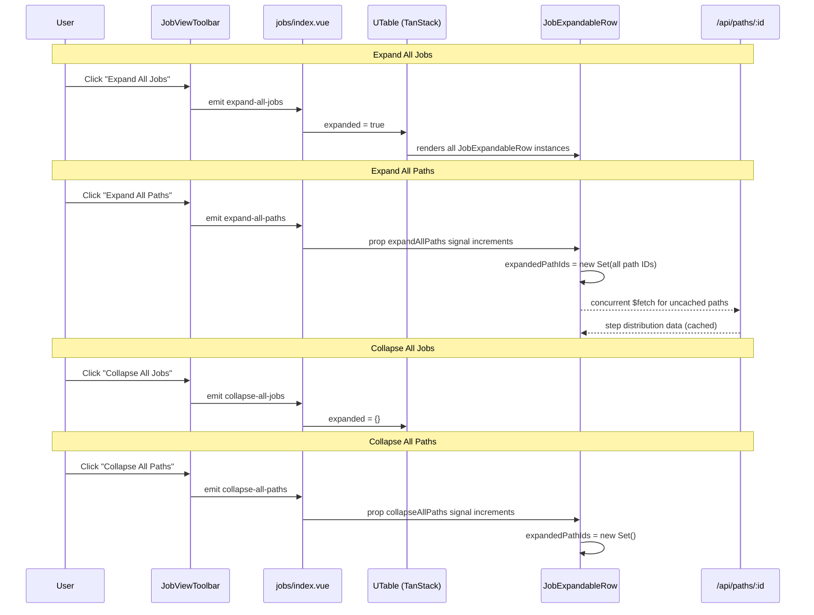

# Design Document: Job View Utilities

## Overview

This feature adds four expand/collapse utility controls to the Jobs list page (`app/pages/jobs/index.vue`), as requested in **GitHub Issue #4**. The utilities mirror the hyperMILL jobs browser pattern: Expand All Jobs, Collapse All Jobs, Expand All Paths, and Collapse All Paths. These controls give users quick bulk-toggle capability over the two-level hierarchy (jobs → paths) in the expandable jobs table.

The implementation touches two layers: the job-level expansion managed by TanStack Vue Table's `ExpandedState`, and the path-level expansion managed by `JobExpandableRow`'s internal `expandedPathId` ref. The key design challenge is that path-level expansion currently supports only a single expanded path per job (string | null), and must be upgraded to support multiple expanded paths (Set-based) to enable "Expand All Paths". Additionally, path expansion triggers lazy data fetching, so bulk expand must handle concurrent API calls gracefully.

## Architecture





## Components and Interfaces

### Component 1: JobViewToolbar

**Purpose**: Renders the four expand/collapse utility buttons in the page header area, between the title row and the filter bar.

**Interface**:
```typescript
// Props
interface JobViewToolbarProps {
  hasExpandedJobs: boolean    // true if any job rows are expanded
  hasExpandedPaths: boolean   // true if any paths are expanded (across all visible JobExpandableRows)
  jobCount: number            // total number of visible (filtered) jobs
}

// Emits
interface JobViewToolbarEmits {
  (e: 'expand-all-jobs'): void
  (e: 'collapse-all-jobs'): void
  (e: 'expand-all-paths'): void
  (e: 'collapse-all-paths'): void
}
```

**Responsibilities**:
- Render four icon buttons in a compact horizontal group
- Disable "Expand All Jobs" when all jobs already expanded
- Disable "Collapse All Jobs" when no jobs expanded
- Disable "Expand All Paths" when no jobs are expanded (paths only visible inside expanded jobs)
- Disable "Collapse All Paths" when no paths are expanded
- Use Lucide icons: `i-lucide-chevrons-down` (expand all), `i-lucide-chevrons-up` (collapse all), `i-lucide-list-tree` (expand paths), `i-lucide-list-minus` (collapse paths)
- Include tooltips on each button describing the action

### Component 2: JobExpandableRow (modified)

**Purpose**: Existing component that renders paths/steps for an expanded job row. Modified to support multi-path expansion and respond to bulk expand/collapse signals from the parent.

**Interface changes**:
```typescript
// Existing prop
interface JobExpandableRowProps {
  jobId: string
  // New props for bulk operations
  expandAllPathsSignal: number    // incremented to trigger expand-all
  collapseAllPathsSignal: number  // incremented to trigger collapse-all
}

// New emit for reporting expansion state upward
interface JobExpandableRowEmits {
  (e: 'paths-expanded-change', payload: { jobId: string, hasExpandedPaths: boolean }): void
}
```

**Internal state change**:
```typescript
// BEFORE (single path)
const expandedPathId = ref<string | null>(null)

// AFTER (multiple paths)
const expandedPathIds = ref<Set<string>>(new Set())
```

**Responsibilities**:
- Support expanding multiple paths simultaneously
- Watch `expandAllPathsSignal` — when it increments, expand all paths and lazy-load uncached data
- Watch `collapseAllPathsSignal` — when it increments, collapse all paths
- Emit `paths-expanded-change` when expansion state changes so parent can track `hasExpandedPaths`
- Throttle concurrent fetches during bulk expand (max 3 concurrent requests)
- Cache fetched path data in `pathDistributions` (already cached, no re-fetch needed)

### Component 3: jobs/index.vue (modified)

**Purpose**: Orchestrates the four utilities by wiring toolbar events to TanStack table state and JobExpandableRow signals.

**New state**:
```typescript
// Signal counters for path-level bulk operations
const expandAllPathsSignal = ref(0)
const collapseAllPathsSignal = ref(0)

// Track which jobs have expanded paths (for toolbar disable state)
const jobsWithExpandedPaths = ref<Set<string>>(new Set())
```

**Handler implementations**:
```typescript
function expandAllJobs() {
  expanded.value = true  // TanStack ExpandedState: `true` expands all rows
}

function collapseAllJobs() {
  expanded.value = {}    // TanStack ExpandedState: `{}` collapses all rows
}

function expandAllPaths() {
  // First ensure all jobs are expanded so paths are visible
  if (expanded.value !== true) {
    expanded.value = true
  }
  expandAllPathsSignal.value++
}

function collapseAllPaths() {
  collapseAllPathsSignal.value++
}

function onPathsExpandedChange(payload: { jobId: string, hasExpandedPaths: boolean }) {
  if (payload.hasExpandedPaths) {
    jobsWithExpandedPaths.value.add(payload.jobId)
  } else {
    jobsWithExpandedPaths.value.delete(payload.jobId)
  }
}
```

## Data Models

No new data models are introduced. This feature is purely a UI state management change. The existing types used:

```typescript
// From @tanstack/vue-table — already imported
type ExpandedState = true | Record<string, boolean>
// `true` = all rows expanded, `{}` = none expanded, `{ [rowId]: true }` = specific rows

// Existing path/step types from JobExpandableRow (unchanged)
interface PathInfo {
  id: string
  jobId: string
  name: string
  goalQuantity: number
  steps: { id: string; name: string; order: number; location?: string }[]
  createdAt: string
  updatedAt: string
}

interface StepDist {
  stepId: string
  stepName: string
  stepOrder: number
  location?: string
  partCount: number
  completedCount: number
  isBottleneck: boolean
}
```

## Key Functions with Formal Specifications

### Function 1: expandAllJobs()

```typescript
function expandAllJobs(): void
```

**Preconditions:**
- `filteredJobs` array is defined (may be empty)
- `expanded` ref is a valid `ExpandedState`

**Postconditions:**
- `expanded.value === true`
- All job rows in the UTable render their `#expanded` slot (JobExpandableRow)

**Loop Invariants:** N/A

### Function 2: collapseAllJobs()

```typescript
function collapseAllJobs(): void
```

**Preconditions:**
- `expanded` ref is a valid `ExpandedState`

**Postconditions:**
- `expanded.value` is `{}` (empty object)
- No job rows render their `#expanded` slot
- Path expansion state within each JobExpandableRow is preserved (not reset)

**Loop Invariants:** N/A

### Function 3: expandAllPaths() (in JobExpandableRow)

```typescript
// Triggered by watching expandAllPathsSignal prop
async function onExpandAllPaths(): Promise<void>
```

**Preconditions:**
- `paths` array has been fetched (component is mounted and data loaded)
- Component is rendered (parent job row is expanded)

**Postconditions:**
- `expandedPathIds` contains all path IDs from `paths` array
- For each path ID in `expandedPathIds`, `pathDistributions[pathId]` is populated (fetched if not cached)
- Previously cached path data is not re-fetched

**Loop Invariants:**
- During concurrent fetch loop: all previously resolved fetches have their data in `pathDistributions`

### Function 4: collapseAllPaths() (in JobExpandableRow)

```typescript
// Triggered by watching collapseAllPathsSignal prop
function onCollapseAllPaths(): void
```

**Preconditions:**
- Component is rendered

**Postconditions:**
- `expandedPathIds` is an empty Set
- Cached `pathDistributions` data is preserved (not cleared)
- `paths-expanded-change` emitted with `hasExpandedPaths: false`

**Loop Invariants:** N/A

### Function 5: togglePath(pathId) (modified)

```typescript
function togglePath(pathId: string): void
```

**Preconditions:**
- `pathId` is a valid string from `paths` array

**Postconditions:**
- If `pathId` was in `expandedPathIds`: it is removed (collapsed)
- If `pathId` was not in `expandedPathIds`: it is added (expanded) and data is fetched if not cached
- `paths-expanded-change` emitted with current state

**Loop Invariants:** N/A

## Algorithmic Pseudocode

### Bulk Path Expansion with Throttled Fetching

```typescript
async function onExpandAllPaths(): Promise<void> {
  const allPathIds = paths.value.map(p => p.id)
  
  // Expand all paths immediately (UI updates)
  expandedPathIds.value = new Set(allPathIds)
  
  // Identify paths that need data fetching
  const uncachedIds = allPathIds.filter(id => !pathDistributions.value[id])
  
  if (uncachedIds.length === 0) return
  
  // Throttled concurrent fetch (max 3 at a time)
  const CONCURRENCY = 3
  for (let i = 0; i < uncachedIds.length; i += CONCURRENCY) {
    const batch = uncachedIds.slice(i, i + CONCURRENCY)
    const results = await Promise.allSettled(
      batch.map(async (pathId) => {
        loadingPathId.value = pathId
        const detail = await $fetch<{ distribution: StepDist[]; completedCount?: number }>(
          `/api/paths/${pathId}`
        )
        pathDistributions.value[pathId] = detail.distribution ?? []
        pathCompletedCounts.value[pathId] = detail.completedCount ?? 0
      })
    )
    // Failed fetches get empty arrays (graceful degradation)
    for (let j = 0; j < batch.length; j++) {
      if (results[j]!.status === 'rejected' && !pathDistributions.value[batch[j]!]) {
        pathDistributions.value[batch[j]!] = []
      }
    }
  }
  loadingPathId.value = null
}
```

**Preconditions:**
- `paths.value` is populated (fetchPaths completed)
- Network is available (failures handled gracefully)

**Postconditions:**
- All paths are visually expanded
- All path distributions are cached (fetched or empty on failure)
- Loading indicator is cleared

**Loop Invariants:**
- After each batch iteration: all paths in processed batches have entries in `pathDistributions`
- `expandedPathIds` remains stable (set once at start, not modified during fetching)

## Example Usage

```typescript
// In jobs/index.vue template — toolbar placement
<template>
  <div class="p-4 space-y-3">
    <div class="flex items-center justify-between">
      <h1 class="text-lg font-bold text-(--ui-text-highlighted)">Jobs</h1>
      <div class="flex items-center gap-2">
        <JobViewToolbar
          :has-expanded-jobs="expanded === true || Object.keys(expanded).length > 0"
          :has-expanded-paths="jobsWithExpandedPaths.size > 0"
          :job-count="filteredJobs.length"
          @expand-all-jobs="expandAllJobs"
          @collapse-all-jobs="collapseAllJobs"
          @expand-all-paths="expandAllPaths"
          @collapse-all-paths="collapseAllPaths"
        />
        <UButton icon="i-lucide-plus" label="New Job" size="sm" @click="navigateTo('/jobs/new')" />
      </div>
    </div>

    <ViewFilters :filters="filters" @change="onFiltersChange" />

    <!-- ... table ... -->

    <UTable v-else v-model:expanded="expanded" :data="filteredJobs" :columns="columns">
      <template #expanded="{ row }">
        <JobExpandableRow
          :job-id="row.original.id"
          :expand-all-paths-signal="expandAllPathsSignal"
          :collapse-all-paths-signal="collapseAllPathsSignal"
          @paths-expanded-change="onPathsExpandedChange"
        />
      </template>
    </UTable>
  </div>
</template>
```

```typescript
// JobViewToolbar.vue — compact button group
<template>
  <div class="flex items-center">
    <UTooltip text="Expand All Jobs">
      <UButton
        icon="i-lucide-chevrons-down"
        variant="ghost"
        color="neutral"
        size="xs"
        :disabled="!jobCount"
        @click="$emit('expand-all-jobs')"
      />
    </UTooltip>
    <UTooltip text="Collapse All Jobs">
      <UButton
        icon="i-lucide-chevrons-up"
        variant="ghost"
        color="neutral"
        size="xs"
        :disabled="!hasExpandedJobs"
        @click="$emit('collapse-all-jobs')"
      />
    </UTooltip>
    <UTooltip text="Expand All Paths">
      <UButton
        icon="i-lucide-list-tree"
        variant="ghost"
        color="neutral"
        size="xs"
        :disabled="!hasExpandedJobs"
        @click="$emit('expand-all-paths')"
      />
    </UTooltip>
    <UTooltip text="Collapse All Paths">
      <UButton
        icon="i-lucide-list-minus"
        variant="ghost"
        color="neutral"
        size="xs"
        :disabled="!hasExpandedPaths"
        @click="$emit('collapse-all-paths')"
      />
    </UTooltip>
  </div>
</template>
```

## Correctness Properties

The following properties must hold for all valid states:

1. **CP-JV1: Expand All Jobs completeness** — After `expandAllJobs()`, every job in `filteredJobs` has a rendered `JobExpandableRow`. Formally: `expanded.value === true` implies all rows report `getIsExpanded() === true`.

2. **CP-JV2: Collapse All Jobs completeness** — After `collapseAllJobs()`, no job rows are expanded. Formally: `expanded.value` deep-equals `{}` and no `JobExpandableRow` instances are rendered.

3. **CP-JV3: Expand All Paths completeness** — After `expandAllPaths()` resolves, for every mounted `JobExpandableRow`, `expandedPathIds.size === paths.length`. Every path within every expanded job is visually expanded.

4. **CP-JV4: Collapse All Paths completeness** — After `collapseAllPaths()`, for every mounted `JobExpandableRow`, `expandedPathIds.size === 0`.

5. **CP-JV5: Cache preservation on collapse** — Collapsing jobs or paths never clears `pathDistributions`. Previously fetched data remains cached. Formally: `∀ pathId: if pathDistributions[pathId] was defined before collapse, it remains defined after`.

6. **CP-JV6: No duplicate fetches** — During `expandAllPaths()`, paths with existing entries in `pathDistributions` are not re-fetched. The set of fetched path IDs is exactly `{ id ∈ allPathIds | pathDistributions[id] === undefined }`.

7. **CP-JV7: Concurrent fetch bound** — During bulk path expansion, at most `CONCURRENCY` (3) fetch requests are in-flight simultaneously.

8. **CP-JV8: Toggle idempotence** — Calling `expandAllJobs()` when all jobs are already expanded produces no state change. Calling `collapseAllJobs()` when no jobs are expanded produces no state change. Same for path equivalents.

## Error Handling

### Error Scenario 1: Path Data Fetch Failure During Bulk Expand

**Condition**: One or more `/api/paths/:id` requests fail during "Expand All Paths"
**Response**: Failed paths get an empty `distribution` array in `pathDistributions`. The path row is still visually expanded but shows "No steps defined." fallback text.
**Recovery**: User can collapse and re-expand the individual path to retry the fetch. The empty array is overwritten on successful retry since `togglePath` always fetches when distribution is empty array (length 0 check added).

### Error Scenario 2: Expand All Paths With No Expanded Jobs

**Condition**: User clicks "Expand All Paths" when no jobs are expanded
**Response**: The handler first sets `expanded = true` to expand all jobs, then increments the signal. This ensures JobExpandableRow instances are mounted before receiving the signal.
**Recovery**: N/A — handled automatically.

### Error Scenario 3: Rapid Sequential Clicks

**Condition**: User clicks "Expand All Paths" then immediately "Collapse All Paths" before fetches complete
**Response**: Collapse immediately clears `expandedPathIds`. In-flight fetches still complete and populate the cache, but the UI shows collapsed state. No visual glitch because expansion state and data cache are independent.
**Recovery**: N/A — works correctly by design.

## Testing Strategy

### Unit Testing Approach

- Test `JobViewToolbar` button disabled states based on props
- Test that toolbar emits correct events on button clicks
- Test `togglePath` with Set-based `expandedPathIds` (add/remove behavior)
- Test signal watchers in `JobExpandableRow` (mock `$fetch`, verify `expandedPathIds` state after signal increment)

### Property-Based Testing Approach

**Property Test Library**: fast-check

- **PBT-JV1**: For any subset of path IDs, after expand-all followed by collapse-all, `expandedPathIds` is empty and `pathDistributions` cache is unchanged.
- **PBT-JV2**: For any sequence of expand/collapse operations on jobs, `expanded` state is always either `true` or a plain object (valid `ExpandedState`).
- **PBT-JV3**: For any list of paths with arbitrary fetch success/failure, after bulk expand, every path ID has an entry in `pathDistributions` (either real data or empty array).

### Integration Testing Approach

- Mount `jobs/index.vue` with mocked API responses
- Verify expand-all-jobs renders all JobExpandableRow instances
- Verify collapse-all-jobs removes all JobExpandableRow instances
- Verify expand-all-paths triggers fetches only for uncached paths
- Verify toolbar disabled states update reactively

## Performance Considerations

- **Throttled fetching**: Bulk path expansion uses batched concurrent requests (3 at a time) to avoid overwhelming the server when a user has many jobs with many paths.
- **Cache-first**: Path distribution data is cached in `pathDistributions` ref. Repeated expand/collapse cycles don't trigger re-fetches.
- **Lazy rendering**: Path step tables only render when the path is in `expandedPathIds`. Collapsed paths have zero DOM cost.
- **Signal-based communication**: Using numeric signal props (increment counters) instead of direct method calls avoids tight coupling and works naturally with Vue's reactivity system.

## Security Considerations

No security implications. This feature only manipulates client-side UI state and reads existing API endpoints that are already exposed. No new API routes or data mutations are introduced.

## Dependencies

- `@tanstack/vue-table` — existing dependency, `ExpandedState` type
- `@nuxt/ui` — existing dependency, `UButton`, `UTooltip`, `UTable`, `UIcon`
- `@iconify-json/lucide` — existing dependency, icons for toolbar buttons
- No new dependencies required
