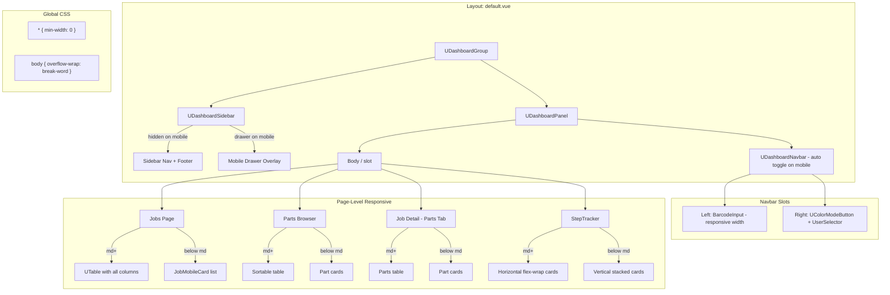
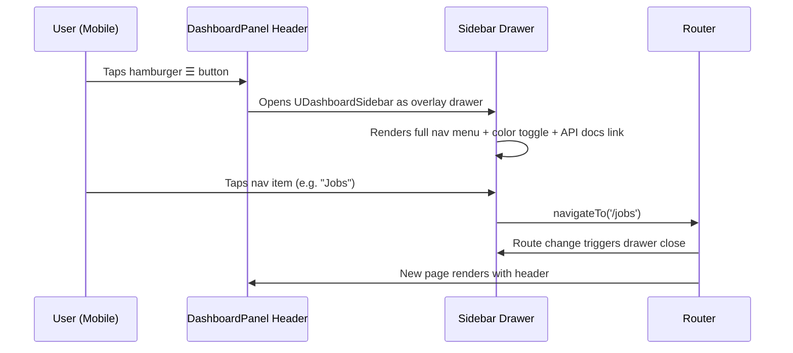
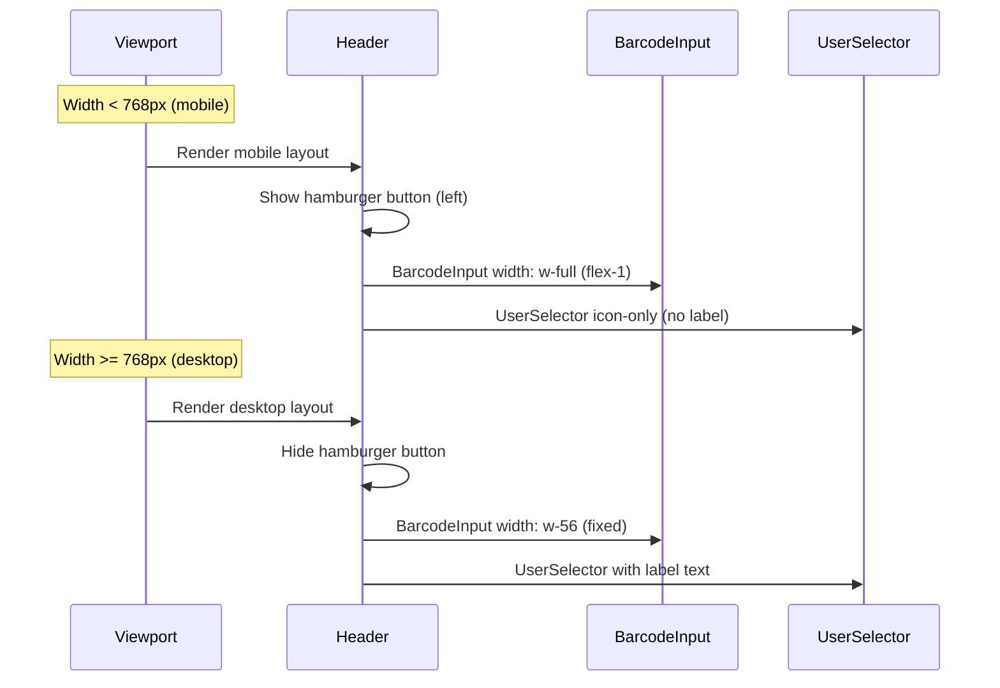

# Design Document: Mobile Responsiveness

## Overview

Shop Planr is currently unusable on mobile devices. The sidebar navigation is completely hidden with no alternative navigation mechanism, trapping users on whatever page they land on. Header elements (barcode input, QR scanner button, user selector) are cut off on narrow viewports. The dark mode toggle lives exclusively in the sidebar footer, making it inaccessible on mobile. The jobs table columns overflow off-screen with no way to see hidden data. This feature delivers a comprehensive mobile responsiveness overhaul that treats the app as a native-like experience.

The approach leverages Nuxt UI's built-in `UDashboardSidebar` mobile drawer support and `UDashboardNavbar` (which automatically renders a sidebar toggle on mobile), makes the header responsive via navbar slots, relocates the color mode toggle to the header for universal access, converts tables to card-based layouts on small screens (jobs, parts browser, job parts tab), adds vertical step tracker layout on mobile, applies global CSS overflow prevention (`* { min-width: 0 }`, `overflow-wrap: break-word`), and adds a viewport meta tag to disable pinch zoom.

All changes are CSS/template-level in existing components plus one new component (`JobMobileCard`) and one new composable (`useMobileBreakpoint`). No new API routes, services, or data model changes are needed. The breakpoint strategy uses Tailwind's `md` (768px) as the primary mobile/desktop threshold, consistent with Nuxt UI's dashboard component conventions.

## Architecture



## Sequence Diagrams

### Mobile Navigation Flow



### Header Responsive Reflow



## Components and Interfaces

### Component 1: default.vue (Layout)

**Purpose**: Main app layout — sidebar navigation + header + page content.

**Implementation**:
- Uses `UDashboardNavbar` in the panel header slot instead of a custom header div
- `UDashboardNavbar` automatically renders a `UDashboardSidebarToggle` on mobile viewports
- `UDashboardSidebar`'s built-in `autoClose` prop (default `true`) closes the drawer on route change
- No `useDashboardSidebar()` composable needed — all sidebar control is handled by Nuxt UI's built-in components
- `UColorModeButton` added to the navbar's `right` slot (visible on all viewports) and kept in sidebar footer for desktop convenience

```vue
<UDashboardPanel>
  <template #header>
    <UDashboardNavbar>
      <template #left>
        <div class="flex-1 min-w-0">
          <BarcodeInput @scanned="onScanned" />
        </div>
      </template>
      <template #right>
        <UColorModeButton size="xs" />
        <UserSelector />
      </template>
    </UDashboardNavbar>
  </template>
</UDashboardPanel>
```

**Responsibilities**:
- Provide mobile navigation via sidebar drawer (built-in to `UDashboardSidebar`)
- Ensure all header elements fit within mobile viewport via `UDashboardNavbar` slots
- Make color mode toggle universally accessible

### Component 2: BarcodeInput.vue

**Purpose**: Search/scan input with QR camera button. Currently has fixed `w-56` width that causes overflow on mobile.

**Current State**:
```vue
<div class="flex items-center gap-1">
  <UInput v-model="inputValue" class="w-56" ... />
  <UButton icon="i-lucide-camera" ... />
</div>
```

**Changes Required**:
1. Replace `w-56` with responsive class: `w-full md:w-56`
2. Ensure the parent flex container allows the input to shrink on mobile

**Responsibilities**:
- Adapt input width to available space
- Never overflow the header on any viewport

### Component 3: UserSelector.vue

**Purpose**: User dropdown in header. Label text causes overflow on narrow viewports.

**Current State**:
```vue
<UButton :label="selectedUser?.name ?? 'Select User'" trailing-icon="i-lucide-chevron-down" ... />
```

**Changes Required**:
1. Hide label text on mobile (show icon only) using a responsive wrapper or computed class
2. Hide trailing chevron icon on mobile
3. Keep full label + chevron on `md+` viewports

**Responsibilities**:
- Compact representation on mobile without losing functionality

### Component 4: JobMobileCard.vue (New)

**Purpose**: Card-based representation of a single job for mobile viewports, replacing the table row.

**Interface**:
```typescript
interface JobMobileCardProps {
  job: Job
  progress: JobProgress | null
}

interface JobMobileCardEmits {
  click: []
}
```

**Responsibilities**:
- Display job name, part number, goal quantity, progress, and priority in a stacked card layout
- Emit click for navigation to job detail
- Show progress bar inline

### Component 5: jobs/index.vue (Page)

**Purpose**: Jobs list page. Currently uses `UTable` which overflows on mobile — only "Job Name" column visible.

**Changes Required**:
1. Add a `useMediaQuery` or Tailwind responsive visibility approach
2. Show `UTable` on `md+` viewports (existing behavior)
3. Show `JobMobileCard` list on mobile viewports (below `md`)
4. Both views share the same `filteredJobs` data and navigation behavior

### Component 6: app.vue (Root)

**Purpose**: Root app component. Currently sets viewport meta without zoom restrictions.

**Current State**:
```typescript
useHead({
  meta: [
    { name: 'viewport', content: 'width=device-width, initial-scale=1' }
  ]
})
```

**Changes Required**:
1. Update viewport meta to disable pinch zoom: `width=device-width, initial-scale=1, maximum-scale=1, user-scalable=no`

### Component 7: StepTracker.vue

**Purpose**: Displays process steps for a path. Originally rendered as a horizontal flex-wrap row that overflowed on mobile.

**Implementation**:
- On mobile (< md): vertical stack with down-arrows between steps; each step card uses a horizontal row layout (info left, stats right, assignee below)
- On desktop (md+): original horizontal flex-wrap with right-arrows and centered compact cards
- "Done" column also has separate mobile (horizontal) and desktop (centered) layouts

### Component 8: parts-browser/index.vue

**Purpose**: Searchable/filterable parts list. Table overflows on mobile.

**Implementation**:
- Desktop (md+): existing sortable HTML table with all columns
- Mobile (< md): card-based list showing part ID, job name, step, status badge, and assignee
- Search input changed from `w-56` to `w-full md:w-56`

### Component 9: JobPartsTab.vue

**Purpose**: Parts tab on job detail page. Table overflows on mobile.

**Implementation**:
- Desktop (md+): existing sortable HTML table with all columns + action buttons
- Mobile (< md): card-based list showing part ID, path, step, status badge, and advance/scrap action buttons
- Filter inputs changed from fixed widths to `w-full md:w-32` / `w-full md:w-36`

### Global CSS: main.css

**Purpose**: Prevent horizontal overflow globally without clipping content.

**Implementation**:
- `* { min-width: 0 }` — forces flex/grid children to shrink to fit containers (prevents `min-width: auto` default)
- `body { overflow-wrap: break-word; word-break: break-word }` — breaks long strings within containers
- Settings page tab bar: `overflow-x-auto` + `whitespace-nowrap shrink-0` on tab buttons
- Templates page step rows: `flex-wrap` added

## Data Models

No new data models are required. All changes are UI/template-level. The existing `Job`, `JobProgress`, `FilterState`, and `NavigationMenuItem` types are used as-is.

## Key Functions with Formal Specifications

### Function 1: useMobileBreakpoint()

```typescript
// Composable to detect mobile viewport
function useMobileBreakpoint(): { isMobile: Ref<boolean> }
```

**Preconditions:**
- Called within a Vue component setup context
- Window/matchMedia API available (client-side only)

**Postconditions:**
- `isMobile.value === true` when viewport width < 768px
- `isMobile.value === false` when viewport width >= 768px
- Reactively updates on window resize
- SSR-safe: defaults to `false` on server

**Loop Invariants:** N/A

### Function 2: Mobile sidebar toggle (built-in to UDashboardNavbar)

The sidebar toggle is handled entirely by Nuxt UI's `UDashboardNavbar` component, which automatically renders a `UDashboardSidebarToggle` button on mobile viewports. The `UDashboardSidebar`'s `autoClose` prop (default `true`) closes the drawer on route change. No custom composable or watcher is needed.

**Postconditions:**
- Toggle button visible on mobile, hidden on desktop
- Sidebar renders as overlay drawer on mobile when toggled open
- Sidebar closes automatically on navigation

**Loop Invariants:** N/A

### Function 3: Responsive header layout (in default.vue)

```vue
<!-- Responsive header using UDashboardNavbar -->
<template #header>
  <UDashboardNavbar>
    <template #left>
      <div class="flex-1 min-w-0">
        <BarcodeInput @scanned="onScanned" />
      </div>
    </template>
    <template #right>
      <UColorModeButton size="xs" />
      <UserSelector />
    </template>
  </UDashboardNavbar>
</template>
```

**Preconditions:**
- Layout is rendered within `UDashboardGroup` with a `UDashboardSidebar`

**Postconditions:**
- On mobile (< 768px): toggle button visible (auto-rendered by navbar), barcode input fills available width, user selector is icon-only
- On desktop (>= 768px): toggle button hidden, barcode input is fixed width, user selector shows label
- Color mode button visible on all viewports
- No element overflows the viewport at any width >= 320px

## Algorithmic Pseudocode

### Mobile Navigation Algorithm

```pascal
ALGORITHM handleMobileNavigation
INPUT: userAction (tap hamburger, tap nav item, route change)
OUTPUT: updated sidebar state and navigation

BEGIN
  CASE userAction OF
    "tap_hamburger":
      sidebarOpen ← NOT sidebarOpen
      
    "tap_nav_item(route)":
      navigateTo(route)
      sidebarOpen ← false
      
    "route_change":
      IF viewport.width < 768 THEN
        sidebarOpen ← false
      END IF
  END CASE
END
```

**Preconditions:**
- Sidebar drawer component is mounted
- Navigation items are loaded from `filteredNavItems`

**Postconditions:**
- After hamburger tap: sidebar visibility is toggled
- After nav item tap: user is on the new route and sidebar is closed
- Sidebar never remains open after navigation on mobile

### Jobs View Responsive Algorithm

```pascal
ALGORITHM renderJobsList(jobs, viewport)
INPUT: jobs: Job[], viewport: { width: number }
OUTPUT: rendered job list (table or cards)

BEGIN
  IF viewport.width >= 768 THEN
    RENDER UTable WITH columns [expand, name, partNumber, goalQty, progress, priority]
  ELSE
    FOR EACH job IN jobs DO
      RENDER JobMobileCard WITH {
        job: job,
        progress: progressFor(job.id)
      }
      ON click → navigateTo('/jobs/' + job.id)
    END FOR
  END IF
END
```

**Preconditions:**
- `jobs` array is loaded (may be empty)
- `progressFor()` function is available

**Postconditions:**
- On desktop: full table with all 6 columns rendered
- On mobile: card list with all job data visible in stacked layout
- Both views navigate to job detail on click/tap
- Empty state message shown when `jobs.length === 0`

### Header Reflow Algorithm

```pascal
ALGORITHM layoutHeader(viewport)
INPUT: viewport: { width: number }
OUTPUT: header element arrangement

BEGIN
  elements ← []
  
  IF viewport.width < 768 THEN
    elements.add(HamburgerButton)
    elements.add(BarcodeInput WITH width: "flex-1")
    elements.add(ColorModeButton)
    elements.add(UserSelector WITH mode: "icon-only")
  ELSE
    elements.add(BarcodeInput WITH width: "w-56")
    elements.add(ColorModeButton)
    elements.add(UserSelector WITH mode: "full-label")
  END IF
  
  RENDER elements IN flex-row WITH gap-2
END
```

**Preconditions:**
- Header is inside `UDashboardPanel`
- All child components are available

**Postconditions:**
- No element overflows viewport at any width >= 320px
- Hamburger button only visible below 768px
- BarcodeInput never truncated or clipped

## Example Usage

### Mobile Navigation Toggle

```typescript
// In default.vue <script setup>
const { open, toggleOpen } = useDashboardSidebar()

// Hamburger button in header template (mobile only)
// <UButton class="md:hidden" icon="i-lucide-menu" @click="toggleOpen" />
```

### Responsive BarcodeInput

```vue
<!-- Before: fixed width, overflows on mobile -->
<UInput v-model="inputValue" class="w-56" ... />

<!-- After: responsive width -->
<UInput v-model="inputValue" class="w-full md:w-56" ... />
```

### Responsive UserSelector

```vue
<!-- Before: always shows label, overflows on mobile -->
<UButton :label="selectedUser?.name ?? 'Select User'" trailing-icon="i-lucide-chevron-down" />

<!-- After: icon-only on mobile, full label on desktop -->
<UButton
  :label="undefined"
  class="md:hidden"
  :icon="selectedUser ? 'i-lucide-user' : 'i-lucide-user-x'"
/>
<UButton
  :label="selectedUser?.name ?? 'Select User'"
  trailing-icon="i-lucide-chevron-down"
  class="hidden md:inline-flex"
  :icon="selectedUser ? 'i-lucide-user' : 'i-lucide-user-x'"
/>
```

### Jobs Mobile Card

```vue
<!-- JobMobileCard.vue -->
<template>
  <div
    class="p-3 rounded-lg border border-(--ui-border) hover:bg-(--ui-bg-elevated)/50 cursor-pointer space-y-2"
    @click="$emit('click')"
  >
    <div class="flex items-center justify-between">
      <span class="font-medium text-sm">{{ job.name }}</span>
      <span v-if="job.jiraPriority" class="text-xs text-(--ui-text-muted)">{{ job.jiraPriority }}</span>
    </div>
    <div class="flex items-center gap-3 text-xs text-(--ui-text-muted)">
      <span v-if="job.jiraPartNumber">Part: {{ job.jiraPartNumber }}</span>
      <span>Qty: {{ job.goalQuantity }}</span>
    </div>
    <ProgressBar v-if="progress" :completed="progress.completedParts" :goal="progress.goalQuantity" :in-progress="progress.inProgressParts" />
  </div>
</template>
```

### Viewport Meta Update

```typescript
// In app.vue
useHead({
  meta: [
    { name: 'viewport', content: 'width=device-width, initial-scale=1, maximum-scale=1, user-scalable=no' }
  ]
})
```

## Correctness Properties

1. **∀ viewport width w ≥ 320px**: No horizontal scrollbar appears on the main layout (no element overflows the viewport).
2. **∀ viewport width w < 768px**: The sidebar toggle button is visible in the navbar AND the sidebar is accessible as a drawer overlay.
3. **∀ viewport width w ≥ 768px**: The sidebar toggle button is NOT rendered AND the sidebar is visible as a persistent panel.
4. **∀ viewport width w**: The `UColorModeButton` is visible and clickable (either in header or sidebar).
5. **∀ navigation event on mobile**: After navigating to a new route, the sidebar drawer is closed (via `autoClose`).
6. **∀ job in filteredJobs on mobile (w < 768px)**: The job's name, part number, goal quantity, progress, and priority are all visible without horizontal scrolling.
7. **∀ job in filteredJobs on desktop (w ≥ 768px)**: The existing UTable renders with all 6 columns visible.
8. **viewport meta tag**: The document's viewport meta contains `maximum-scale=1` and `user-scalable=no`.
9. **∀ step in StepTracker on mobile (w < 768px)**: Steps stack vertically with horizontal card layout (info left, stats right).
10. **∀ part in Parts Browser on mobile (w < 768px)**: Parts render as cards instead of table rows.
11. **∀ part in JobPartsTab on mobile (w < 768px)**: Parts render as cards with action buttons instead of table rows.
12. **Global CSS**: `* { min-width: 0 }` is applied, preventing flex/grid children from overflowing their containers.

## Error Handling

### Error Scenario 1: SSR Hydration Mismatch

**Condition**: Server renders one layout (no window available, defaults to desktop), client hydrates with mobile viewport.
**Response**: Use `onMounted` or `<ClientOnly>` for viewport-dependent rendering. The `useMobileBreakpoint()` composable defaults to `false` on server and updates on client mount.
**Recovery**: Brief flash of desktop layout on mobile is acceptable; content reflows on hydration. No broken state.

### Error Scenario 2: Sidebar Drawer Fails to Close on Navigation

**Condition**: User taps a nav item but the drawer remains open after route change.
**Response**: `UDashboardSidebar`'s `autoClose` prop (default `true`) handles this automatically. No custom watcher needed.
**Recovery**: User can tap outside the drawer overlay or tap the toggle button again to close.

### Error Scenario 3: matchMedia Not Available

**Condition**: Browser doesn't support `matchMedia` (very old browsers or SSR).
**Response**: `useMobileBreakpoint()` falls back to `false` (desktop layout).
**Recovery**: Desktop layout is fully functional; user just doesn't get mobile optimizations.

## Testing Strategy

### Unit Testing Approach

- Test `useMobileBreakpoint()` composable with mocked `matchMedia`
- Test `JobMobileCard` component renders all job fields (name, part number, qty, progress, priority)
- Test `JobMobileCard` emits `click` event on tap
- Test `UserSelector` renders icon-only variant (verify no label text in mobile mode)
- Test header template renders hamburger button when mobile breakpoint is active

### Integration Testing Approach

- Verify `default.vue` layout renders hamburger button at mobile viewport widths
- Verify sidebar drawer opens/closes via hamburger toggle
- Verify navigation from drawer closes the drawer
- Verify jobs page shows card list on mobile and table on desktop
- Verify viewport meta tag contains zoom-disable attributes

### Visual/Manual Testing Checklist

- Test on iPhone SE (375px), iPhone 14 (390px), iPad Mini (768px), desktop (1280px+)
- Verify no horizontal overflow on any page at 320px minimum width
- Verify dark mode toggle works from header on mobile
- Verify barcode input is usable (not clipped) on 375px viewport
- Verify jobs cards show all data fields and are tappable

## Performance Considerations

- `useMobileBreakpoint()` uses `matchMedia` listener (not `resize` event) for efficient viewport detection
- `JobMobileCard` is a lightweight component with no API calls — data passed via props from parent
- No additional API requests needed — mobile and desktop views consume the same data
- Sidebar drawer uses CSS transforms for open/close animation (GPU-accelerated, no layout thrashing)

## Security Considerations

- Disabling pinch zoom (`user-scalable=no`) is an accessibility trade-off. This is intentional for the native-app-like experience requested by the user. The app remains fully usable with screen readers and keyboard navigation.
- No new API endpoints or data exposure. All changes are client-side template/CSS.

## Dependencies

- **Nuxt UI 4.x**: `UDashboardSidebar` (already used), `UDashboardNavbar` (added for responsive header with auto sidebar toggle), `UDashboardSidebarToggle` (auto-rendered by navbar)
- **Tailwind CSS v4**: Responsive utility classes (`md:hidden`, `hidden md:block`, `flex-wrap`, etc.)
- **Vue 3**: `matchMedia` pattern via composable (no external dependency needed)
- No new npm packages required