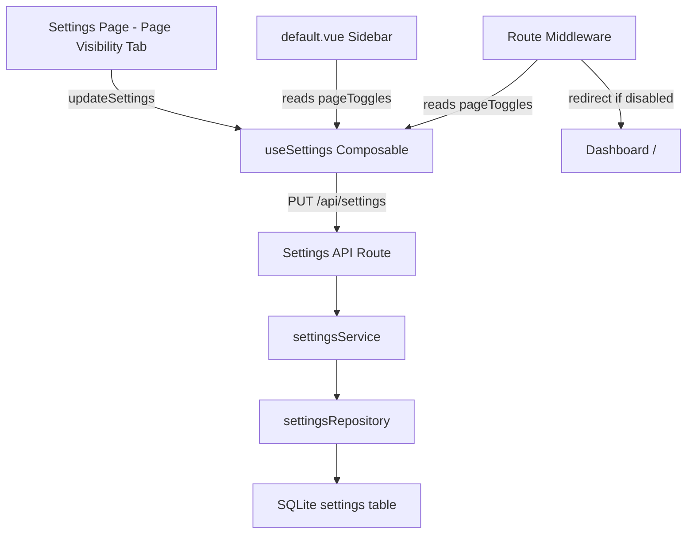
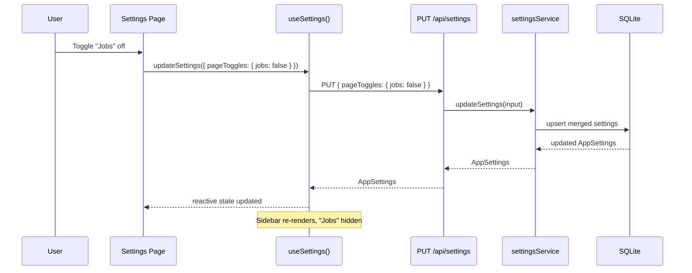

# Design Document: Nav Page Toggles

## Overview

This feature adds a "Page Visibility" tab to the Settings page that lets administrators toggle sidebar navigation pages on or off. Each page in the nav sidebar gets a feature flag stored in the existing `settings` singleton. When a page is toggled off, it is hidden from the sidebar navigation and inaccessible via direct URL navigation or in-app links. Dashboard and Settings are always visible and cannot be toggled off.

The design extends the existing `AppSettings` domain type with a `pageToggles` JSON column in the `settings` table. A Nuxt route middleware enforces access control for disabled pages, redirecting to the dashboard. The sidebar in `default.vue` reactively filters `navItems` based on the current toggle state, which is fetched once on app load and updated in real-time when toggles change via the shared `useSettings()` composable.

## Architecture





## Components and Interfaces

### Component 1: PageVisibilitySettings (new)

**Purpose**: Renders a list of toggleable pages with on/off switches in the Settings page.

**Interface**:

```typescript
// Props
interface PageVisibilitySettingsProps {
  toggles: PageToggles
}

// Emits
interface PageVisibilitySettingsEmits {
  (e: 'update', toggles: PageToggles): void
}
```

**Responsibilities**:

- Display each toggleable page with its label, icon, and current state
- Prevent toggling of always-visible pages (Dashboard, Settings)
- Emit updated toggles on switch change

### Component 2: Sidebar filtering in default.vue (modified)

**Purpose**: Filter `navItems` based on `pageToggles` from settings.

**Responsibilities**:

- Read `pageToggles` from `useSettings()` composable
- Compute filtered nav items reactively
- Only show items whose corresponding page is enabled

### Component 3: Route Middleware — pageGuard (new)

**Purpose**: Prevent navigation to disabled pages via direct URL or programmatic navigation.

**Responsibilities**:

- Run on every client-side navigation
- Check if the target route's page is disabled in `pageToggles`
- Redirect to `/` if the page is disabled
- Allow navigation to always-visible pages and non-toggleable routes (detail pages like `/jobs/[id]` are guarded by their parent page toggle)

## Data Models

### PageToggles Type

```typescript
interface PageToggles {
  jobs: boolean
  serials: boolean
  parts: boolean
  queue: boolean
  templates: boolean
  bom: boolean
  certs: boolean
  jira: boolean
  audit: boolean
}
```

**Validation Rules**:

- All keys must be boolean values
- Missing keys default to `true` (page visible)
- Dashboard and Settings are not included — they are always visible

### Extended AppSettings

```typescript
interface AppSettings {
  id: string
  jiraConnection: JiraConnectionSettings
  jiraFieldMappings: JiraFieldMapping[]
  pageToggles: PageToggles // NEW
  updatedAt: string
}
```

### Route-to-Toggle Mapping

```typescript
const ROUTE_TOGGLE_MAP: Record<string, keyof PageToggles> = {
  '/jobs': 'jobs',
  '/serials': 'serials',
  '/parts': 'parts',
  '/queue': 'queue',
  '/templates': 'templates',
  '/bom': 'bom',
  '/certs': 'certs',
  '/jira': 'jira',
  '/audit': 'audit',
}
```

Detail routes (e.g., `/jobs/123`, `/serials/456`, `/parts/step/abc`) are matched by checking if the route path starts with a disabled base path.

### Default PageToggles

```typescript
const DEFAULT_PAGE_TOGGLES: PageToggles = {
  jobs: true,
  serials: true,
  parts: true,
  queue: true,
  templates: true,
  bom: true,
  certs: true,
  jira: true,
  audit: true,
}
```

### SQLite Schema Change

New column on `settings` table via migration 005:

```sql
ALTER TABLE settings ADD COLUMN page_toggles TEXT NOT NULL DEFAULT '{}';
```

The JSON is stored as TEXT and parsed/serialized in the repository layer, consistent with `jira_connection` and `jira_field_mappings`.

## Key Functions with Formal Specifications

### Function 1: settingsService.updateSettings() (extended)

```typescript
function updateSettings(input: {
  jiraConnection?: Partial<JiraConnectionSettings>
  jiraFieldMappings?: JiraFieldMapping[]
  pageToggles?: Partial<PageToggles> // NEW
}): AppSettings
```

**Preconditions:**

- `input` is a non-null object
- If `input.pageToggles` is provided, all values must be booleans
- Keys in `pageToggles` must be valid page identifiers from the `PageToggles` type

**Postconditions:**

- Returns updated `AppSettings` with merged `pageToggles`
- Existing toggle values not in `input.pageToggles` are preserved
- `updatedAt` is set to current timestamp
- Persisted to SQLite via `repos.settings.upsert()`

**Loop Invariants:** N/A

### Function 2: isPageEnabled()

```typescript
function isPageEnabled(pageToggles: PageToggles, routePath: string): boolean
```

**Preconditions:**

- `pageToggles` is a valid `PageToggles` object (may have missing keys)
- `routePath` is a non-empty string starting with `/`

**Postconditions:**

- Returns `true` if the route's corresponding page toggle is enabled or if the route has no toggle (always-visible)
- Returns `false` only if the route maps to a toggle key and that key is `false`
- Dashboard (`/`) and Settings (`/settings`) always return `true`
- Detail routes (e.g., `/jobs/123`) inherit their parent page's toggle state

**Loop Invariants:** N/A

### Function 3: getFilteredNavItems()

```typescript
function getFilteredNavItems(
  allItems: NavigationMenuItem[],
  pageToggles: PageToggles
): NavigationMenuItem[]
```

**Preconditions:**

- `allItems` is the full static nav items array
- `pageToggles` is a valid `PageToggles` object

**Postconditions:**

- Returns a subset of `allItems` where each item's `to` route is enabled
- Dashboard and Settings items are always included
- Order of items is preserved
- Length of result ≤ length of `allItems`
- Length of result ≥ 2 (Dashboard + Settings always present)

**Loop Invariants:**

- For each processed item: item is included iff `isPageEnabled(pageToggles, item.to) === true`

## Algorithmic Pseudocode

### Page Toggle Update Algorithm

```typescript
// In settingsService.updateSettings() — extended merge logic
function mergePageToggles(current: PageToggles, partial: Partial<PageToggles>): PageToggles {
  // Start with current state (or defaults if first time)
  const merged = { ...DEFAULT_PAGE_TOGGLES, ...current }

  // Apply partial updates
  for (const [key, value] of Object.entries(partial)) {
    if (key in merged && typeof value === 'boolean') {
      merged[key as keyof PageToggles] = value
    }
  }

  return merged
}
```

### Route Guard Algorithm

```typescript
// Nuxt middleware: app/middleware/pageGuard.global.ts
function pageGuardMiddleware(to: RouteLocationNormalized): NavigateToResult {
  const { settings } = useSettings()
  const pageToggles = settings.value?.pageToggles ?? DEFAULT_PAGE_TOGGLES

  // Always allow: dashboard, settings, and non-page routes
  if (to.path === '/' || to.path === '/settings') {
    return // allow navigation
  }

  // Find matching toggle by checking route prefixes
  for (const [basePath, toggleKey] of Object.entries(ROUTE_TOGGLE_MAP)) {
    if (to.path === basePath || to.path.startsWith(basePath + '/')) {
      if (pageToggles[toggleKey] === false) {
        return navigateTo('/') // redirect to dashboard
      }
      break
    }
  }

  // No matching toggle = allow navigation
  return
}
```

### Sidebar Filtering Algorithm

```typescript
// In default.vue — computed filtered items
const filteredNavItems = computed(() => {
  const toggles = settings.value?.pageToggles ?? DEFAULT_PAGE_TOGGLES
  return navItems.filter((item) => isPageEnabled(toggles, item.to as string))
})
```

## Example Usage

```typescript
// Example 1: Toggle Jobs page off
await updateSettings({
  pageToggles: { jobs: false }
})
// Result: Jobs hidden from sidebar, /jobs and /jobs/[id] redirect to /

// Example 2: Toggle multiple pages off
await updateSettings({
  pageToggles: { jira: false, audit: false, bom: false }
})
// Result: Jira, Audit, BOM hidden; all other pages remain visible

// Example 3: Re-enable a page
await updateSettings({
  pageToggles: { jobs: true }
})
// Result: Jobs reappears in sidebar, /jobs accessible again

// Example 4: Settings page component usage
<PageVisibilitySettings
  :toggles="settings.pageToggles"
  @update="onSaveToggles"
/>

// Example 5: Route middleware blocks disabled page
// User types /jira in URL bar while jira toggle is false
// → middleware redirects to /
```

## Correctness Properties

_A property is a characteristic or behavior that should hold true across all valid executions of a system — essentially, a formal statement about what the system should do. Properties serve as the bridge between human-readable specifications and machine-verifiable correctness guarantees._

### Property 1: Always-visible invariant

_For any_ PageToggles configuration (including all-false, partial, or empty), `isPageEnabled(pageToggles, '/')` and `isPageEnabled(pageToggles, '/settings')` always return `true`, and Dashboard and Settings always appear in the filtered sidebar items.

**Validates: Requirements 4.2, 5.3, 6.1**

### Property 2: Toggle-visibility consistency for sidebar

_For any_ PageToggles configuration and any navigation item, the item appears in the filtered sidebar list if and only if `isPageEnabled(pageToggles, item.to)` returns `true`.

**Validates: Requirements 4.1**

### Property 3: Route access matches toggle state

_For any_ route path and any PageToggles configuration, `isPageEnabled` returns `false` only when the route maps to a toggle key in ROUTE_TOGGLE_MAP and that key is `false`. Detail routes (e.g., `/jobs/123`) inherit their parent page's toggle. Routes with no toggle mapping always return `true`.

**Validates: Requirements 5.1, 5.2, 5.4**

### Property 4: Sidebar item count bounds

_For any_ PageToggles configuration, the length of the filtered nav items array is at least 2 (Dashboard + Settings) and at most the total number of nav items.

**Validates: Requirements 6.1, 6.2**

### Property 5: Partial update preservation

_For any_ existing PageToggles state and any partial update containing a subset of keys, the merge result preserves the values of all keys not present in the partial update.

**Validates: Requirements 2.2**

### Property 6: Unknown keys ignored in merge

_For any_ input object containing a mix of valid PageToggles keys and unknown keys, the merge result contains only valid PageToggles keys with correct values, and unknown keys are discarded.

**Validates: Requirements 2.3**

### Property 7: Missing keys default to true

_For any_ partial PageToggles object with fewer than 9 keys, the missing keys are treated as `true` (enabled) when used for sidebar filtering or route guarding.

**Validates: Requirements 3.2**

### Property 8: Idempotent toggle

_For any_ PageToggles state, merging the state with itself produces an identical PageToggles result (aside from `updatedAt`).

**Validates: Requirements 7.1**

## Error Handling

### Error Scenario 1: Invalid toggle key

**Condition**: Client sends `pageToggles` with an unknown key (e.g., `{ foo: false }`)
**Response**: Unknown keys are silently ignored during merge; only valid `PageToggles` keys are applied
**Recovery**: No error thrown; settings saved with valid keys only

### Error Scenario 2: Settings not yet loaded in middleware

**Condition**: Route middleware runs before `useSettings()` has fetched settings (e.g., on cold page load)
**Response**: Middleware treats missing settings as "all pages enabled" (defaults to `DEFAULT_PAGE_TOGGLES`)
**Recovery**: Once settings load, sidebar updates reactively; if user navigated to a disabled page, they see it until next navigation

### Error Scenario 3: API failure on toggle save

**Condition**: PUT `/api/settings` fails (network error, server error)
**Response**: UI shows error toast; toggle switches revert to previous state
**Recovery**: User can retry; no partial state persisted (SQLite upsert is atomic)

### Error Scenario 4: Direct URL to disabled page on SSR/initial load

**Condition**: User bookmarks `/jira` and loads it after Jira page was toggled off
**Response**: Server-side middleware or client hydration redirects to `/`
**Recovery**: User lands on dashboard; sidebar reflects current toggle state

## Testing Strategy

### Unit Testing Approach

- `isPageEnabled()`: Test all route paths against various toggle configurations
- `mergePageToggles()`: Test partial updates, empty input, full overwrite
- `getFilteredNavItems()`: Test filtering with various toggle combinations
- `settingsService.updateSettings()`: Test that `pageToggles` merges correctly with existing settings

### Property-Based Testing Approach

**Property Test Library**: fast-check

- **Toggle round-trip**: For any random `PageToggles` state, saving and re-reading produces the same state
- **Default-on**: For any fresh `AppSettings`, all pages are enabled
- **Sidebar bounds**: For any random toggle configuration, `2 ≤ filteredItems.length ≤ totalItems`
- **Consistency**: For any toggle state, the set of visible sidebar items exactly matches the set of routes the middleware allows

### Integration Testing Approach

- End-to-end: Toggle a page off via API → verify sidebar filtering → verify middleware redirect
- Migration: Verify migration 005 adds `page_toggles` column with correct default
- Backward compatibility: Existing settings without `page_toggles` still work (defaults applied)

## Security Considerations

- No authentication system exists (kiosk mode), so no additional auth checks needed
- The Settings page itself cannot be toggled off, preventing lockout
- Dashboard cannot be toggled off, ensuring there's always a landing page
- Toggle state is server-persisted, so refreshing the page doesn't bypass restrictions

## Dependencies

- No new external dependencies required
- Extends existing: `AppSettings` domain type, `settingsService`, `settingsRepository`, `useSettings()` composable
- New: SQLite migration 005, `pageGuard.global.ts` middleware, `PageVisibilitySettings` component
- Uses existing: Nuxt UI `USwitch` component for toggle controls
