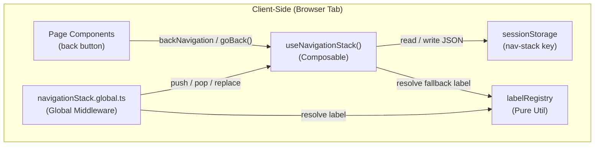

# Design Document: Navigation Stack

## Overview

This design replaces Shop Planr's manual `from` query parameter system with an automatic, stack-based navigation history. The current approach requires every `navigateTo()` call to explicitly pass `?from=...` and every destination page to read `route.query.from` — a fragile pattern that silently loses context when any link forgets the parameter.

The new system introduces three core pieces:

1. **`useNavigationStack()` composable** — manages a bounded stack of navigation entries in `sessionStorage`, exposes `backNavigation` (computed destination + label) and `goBack()`.
2. **Global navigation middleware** — intercepts every client-side route change, automatically pushing/popping entries. Detects same-page-type navigation (e.g., Step → Step via Prev/Next) and replaces instead of pushing.
3. **Label registry** — a pure mapping from route patterns to human-readable labels (e.g., `/queue` → "Work Queue", `/parts-browser/:id` → "Part {id}").

After migration, all `?from=` parameters, the `resolveBackNavigation` utility, and the `eyeIconLink.ts` file are removed. The `partDetailLink` call in `ProcessAdvancementPanel.vue` is inlined as a simple template string. Pages consume `useNavigationStack()` directly.

## Architecture



### Data Flow

1. User navigates from Page A → Page B.
2. The global middleware fires `beforeEach`.
3. Middleware checks: is the destination the same as the stack top? If yes → **pop** (back navigation). Is the destination the same page type as the departing route? If yes → **replace** top entry. Otherwise → **push** departing route onto the stack.
4. Page B's back button reads `backNavigation` from the composable — gets the path and label of the stack top (or fallback).
5. User clicks back → `goBack()` pops the top entry and calls `navigateTo()`.

### Integration with Existing Middleware

The existing `pageGuard.global.ts` middleware blocks navigation to disabled pages. The navigation stack middleware must run *after* the page guard so we don't push entries for blocked navigations. Nuxt global middleware files execute in alphabetical order, so we name the file `stackTracker.global.ts` — since `s` > `p`, it runs after `pageGuard.global.ts`. This ensures we only track navigations that pass the page guard.

### SSR Safety

All `sessionStorage` access is guarded behind `import.meta.client` checks. During SSR, the composable returns an empty stack and fallback-based navigation. The middleware skips stack updates during SSR.

## Components and Interfaces

### 1. Label Registry (`app/utils/navigationLabels.ts`)

A pure utility (auto-imported by Nuxt) that maps route paths to human-readable labels.

```typescript
export interface NavigationLabel {
  pattern: RegExp
  label: (match: RegExpMatchArray) => string
}

/** Ordered list of route patterns → label resolvers. First match wins. */
export const NAVIGATION_LABELS: NavigationLabel[] = [
  { pattern: /^\/$/,                          label: () => 'Dashboard' },
  { pattern: /^\/jobs$/,                      label: () => 'Jobs' },
  { pattern: /^\/jobs\/([^/]+)$/,             label: (m) => `Job ${decodeURIComponent(m[1]!)}` },
  { pattern: /^\/parts-browser$/,             label: () => 'Parts Browser' },
  { pattern: /^\/parts-browser\/([^/]+)$/,    label: (m) => `Part ${decodeURIComponent(m[1]!)}` },
  { pattern: /^\/parts$/,                     label: () => 'Parts' },
  { pattern: /^\/parts\/step\/([^/]+)$/,      label: () => 'Step View' },
  { pattern: /^\/queue$/,                     label: () => 'Work Queue' },
  { pattern: /^\/templates$/,                 label: () => 'Templates' },
  { pattern: /^\/bom$/,                       label: () => 'BOM' },
  { pattern: /^\/certs$/,                     label: () => 'Certs' },
  { pattern: /^\/audit$/,                     label: () => 'Audit' },
  { pattern: /^\/settings$/,                  label: () => 'Settings' },
]

/** Resolve a route path to a human-readable label. Returns "Back" for unknown routes. */
export function resolveLabel(path: string): string {
  for (const entry of NAVIGATION_LABELS) {
    const match = path.match(entry.pattern)
    if (match) return entry.label(match)
  }
  return 'Back'
}

/**
 * Extract the route pattern (path without dynamic segments) for same-page-type detection.
 * e.g., "/parts/step/abc123" → "/parts/step/:id"
 */
export function routePattern(path: string): string {
  for (const entry of NAVIGATION_LABELS) {
    if (entry.pattern.test(path)) return entry.pattern.source
  }
  return path
}
```

### 2. Fallback Route Resolver (`app/utils/navigationFallbacks.ts`)

A pure utility that computes a sensible parent route when the stack is empty.

```typescript
export interface FallbackMapping {
  pattern: RegExp
  fallback: string
}

export const FALLBACK_ROUTES: FallbackMapping[] = [
  { pattern: /^\/parts-browser\/[^/]+$/,  fallback: '/parts-browser' },
  { pattern: /^\/parts\/step\/[^/]+$/,    fallback: '/parts' },
  { pattern: /^\/jobs\/new$/,             fallback: '/jobs' },
  { pattern: /^\/jobs\/edit\/[^/]+$/,     fallback: '/jobs' },
  { pattern: /^\/jobs\/[^/]+$/,           fallback: '/jobs' },
  { pattern: /^\/serials\/[^/]+$/,        fallback: '/parts-browser' },
  { pattern: /^\/queue$/,                 fallback: '/' },
  { pattern: /^\/api-docs\/.+$/,          fallback: '/api-docs' },
]

/** Compute the fallback route for a given path. Returns "/" if no specific mapping matches. */
export function resolveFallbackRoute(currentPath: string): string {
  for (const entry of FALLBACK_ROUTES) {
    if (entry.pattern.test(currentPath)) return entry.fallback
  }
  return '/'
}
```

### 3. Navigation Stack Composable (`app/composables/useNavigationStack.ts`)

The core composable that manages the stack and exposes the back navigation API.

```typescript
export interface NavigationEntry {
  path: string
  label: string
}

export interface BackNavigation {
  to: string
  label: string
}

export function useNavigationStack() {
  // --- State (shared across component instances via useState) ---
  const stack: Ref<NavigationEntry[]>

  // --- Public API ---
  /** Push an entry onto the stack (used by middleware). */
  function push(entry: NavigationEntry): void

  /** Pop the top entry (used by goBack and middleware). */
  function pop(): NavigationEntry | undefined

  /** Replace the top entry (used for same-page-type navigation). */
  function replaceTop(entry: NavigationEntry): void

  /** Computed back navigation destination + label. */
  const backNavigation: ComputedRef<BackNavigation>

  /** Navigate back: pop the stack and navigateTo the popped path. */
  function goBack(): void

  /** Read-only access to the current stack (for debugging). */
  const entries: ComputedRef<readonly NavigationEntry[]>

  return { push, pop, replaceTop, backNavigation, goBack, entries }
}
```

**Key implementation details:**

- Uses `useState<NavigationEntry[]>('nav-stack', () => [])` for reactive shared state across components.
- On client init, hydrates from `sessionStorage` (key: `nav-stack`).
- Every mutation (push/pop/replaceTop) persists to `sessionStorage` synchronously.
- `backNavigation` returns the top entry formatted as `{ to: top.path, label: "Back to {top.label}" }`, or the fallback route if the stack is empty.
- Stack is capped at 20 entries. On push, if length ≥ 20, the oldest (index 0) entry is shifted off.
- Invalid entries (missing path, path not starting with `/`) are skipped when reading from `sessionStorage`.

### 4. Global Middleware (`app/middleware/stackTracker.global.ts`)

```typescript
export default defineNuxtRouteMiddleware((to, from) => {
  // Skip during SSR
  if (import.meta.server) return

  // Skip if only query/hash changed (same path)
  if (to.path === from.path) return

  const { push, pop, replaceTop, entries } = useNavigationStack()
  const stack = entries.value

  // Check if navigating back (destination matches stack top)
  if (stack.length > 0 && stack[stack.length - 1].path === to.path) {
    pop()
    return
  }

  // Check for same-page-type navigation (e.g., Step → Step)
  if (routePattern(from.path) === routePattern(to.path)) {
    replaceTop({ path: from.path, label: resolveLabel(from.path) })
    return
  }

  // Normal forward navigation: push departing route
  push({ path: from.path, label: resolveLabel(from.path) })
})
```

### 5. Page Migration

Pages that currently use `from` query params will be updated to use the composable:

**Before (e.g., `parts/step/[stepId].vue`):**
```typescript
const fromQuery = route.query.from as string | undefined
const backNav = computed(() => resolveBackNavigation(fromQuery))
```

**After:**
```typescript
const { backNavigation } = useNavigationStack()
// backNavigation is already a computed { to, label }
```

**Before (e.g., `queue.vue`):**
```typescript
navigateTo(`/parts/step/${job.stepId}?from=/queue`)
```

**After:**
```typescript
navigateTo(`/parts/step/${job.stepId}`)
// The middleware automatically pushes /queue onto the stack
```

## Data Models

### NavigationEntry

| Field | Type | Description |
|-------|------|-------------|
| `path` | `string` | Route path (must start with `/`). No query string or hash. |
| `label` | `string` | Human-readable label resolved at push time. |

### Navigation Stack (sessionStorage)

| Key | Type | Constraints |
|-----|------|-------------|
| `nav-stack` | `NavigationEntry[]` (JSON) | Max 20 entries. Oldest evicted on overflow. |

### Validation Rules

- `path` must be a non-empty string starting with `/`.
- `label` must be a non-empty string.
- On load from `sessionStorage`, entries failing validation are silently dropped.
- If `sessionStorage` contains unparseable JSON, the stack resets to `[]`.


## Correctness Properties

*A property is a characteristic or behavior that should hold true across all valid executions of a system — essentially, a formal statement about what the system should do. Properties serve as the bridge between human-readable specifications and machine-verifiable correctness guarantees.*

### Property 1: sessionStorage Round-Trip

*For any* sequence of valid navigation entries pushed onto the stack, serializing the stack to `sessionStorage` and then re-initializing the composable from `sessionStorage` should produce an identical stack.

**Validates: Requirements 1.1, 1.2, 1.3**

### Property 2: Capacity Invariant with Oldest Eviction

*For any* sequence of push operations (including sequences longer than 20), the stack length shall never exceed 20, and when overflow occurs, the entries retained shall be the 20 most recently pushed entries (oldest evicted first).

**Validates: Requirements 1.4, 1.5**

### Property 3: Push/Pop Round-Trip

*For any* departing route path, pushing it onto the stack and then popping should return the same path and label, and the stack should return to its prior state.

**Validates: Requirements 2.2, 2.3**

### Property 4: Query/Hash-Only Navigation Is a No-Op

*For any* route path and any query string or hash suffix, navigating from that path to the same path with a different query/hash should not change the stack contents or length.

**Validates: Requirements 2.4**

### Property 5: Label Resolution Completeness

*For any* route path string, `resolveLabel` shall return a non-empty string. For paths matching a known pattern, it returns the pattern's label; for all other paths, it returns `"Back"`.

**Validates: Requirements 3.1, 3.3**

### Property 6: Back Navigation from Non-Empty Stack

*For any* non-empty stack, `backNavigation` shall return the top entry's path and a label formatted as `"Back to {entry.label}"`.

**Validates: Requirements 4.2**

### Property 7: Back Navigation Fallback from Empty Stack

*For any* current route path with an empty stack, `backNavigation` shall return the fallback route for that path (per the fallback mapping) and a label of `"Back to {resolveLabel(fallbackPath)}"`.

**Validates: Requirements 4.3, 5.1, 5.3**

### Property 8: goBack Pops Correct Entry

*For any* non-empty stack, calling `goBack()` shall remove the top entry, reduce the stack length by one, and the removed entry's path shall equal the previous top's path.

**Validates: Requirements 4.4**

### Property 9: LIFO Unwinding for Navigation Chains

*For any* sequence of N distinct forward navigations (pushing N entries), popping N times shall return the entries in exact reverse order of insertion.

**Validates: Requirements 7.3**

### Property 10: Same-Page-Type Replace vs Different-Page-Type Push

*For any* two route paths, if `routePattern(pathA) === routePattern(pathB)`, then navigating from A to B should replace the top stack entry (stack size unchanged). If the patterns differ, the stack size should increase by one.

**Validates: Requirements 8.1, 8.3**

### Property 11: Route Pattern Consistency

*For any* two paths that differ only in their dynamic segment values (e.g., `/parts/step/abc` and `/parts/step/xyz`), `routePattern` shall return the same value.

**Validates: Requirements 8.2**

### Property 12: Invalid Entry Filtering

*For any* stack containing a mix of valid entries (non-empty path starting with `/`) and invalid entries (empty path, path not starting with `/`, or missing fields), `backNavigation` shall skip invalid entries and return the first valid entry, or the fallback route if no valid entries exist.

**Validates: Requirements 9.1, 9.2**

## Error Handling

| Scenario | Behavior |
|----------|----------|
| `sessionStorage` contains unparseable JSON | Reset stack to `[]`, log warning to console, continue normally. |
| `sessionStorage` is unavailable (e.g., private browsing quota exceeded) | Fall back to in-memory-only stack. All push/pop/replace operations work normally but don't persist across page refreshes. |
| `sessionStorage` contains entries with invalid `path` values | Filter out invalid entries on load. An entry is invalid if `path` is not a non-empty string starting with `/`. |
| Stack is empty when `goBack()` is called | Navigate to the fallback route for the current path. No error thrown. |
| Middleware fires during SSR | No-op. All `sessionStorage` access is guarded behind `import.meta.client`. |
| `navigateTo()` is called with a path that matches the current path | Middleware detects `to.path === from.path` and skips stack update. |

## Testing Strategy

### Unit Tests

Unit tests cover specific examples and edge cases:

- **Label registry examples**: Verify each of the 13 route-to-label mappings from Requirement 3.2 (e.g., `/queue` → "Work Queue", `/parts-browser/SN-00004` → "Part SN-00004").
- **Fallback route examples**: Verify each of the 8 fallback mappings from Requirement 5.2 (e.g., `/parts-browser/SN-00004` → `/parts-browser`).
- **Deep navigation chain scenarios**: Verify the specific chains from Requirement 7 (Queue → Step → Part Detail, Part Detail → Step → Sibling Part, Jobs → Job Detail → Step → Part Detail).
- **Corrupted sessionStorage**: Verify recovery from `null`, `undefined`, `"not json"`, `42`, `[{"bad": true}]`.
- **sessionStorage unavailable**: Verify graceful degradation when `sessionStorage.getItem` throws.

### Property-Based Tests

Property-based tests use `fast-check` to verify universal properties across randomly generated inputs. Each property test runs a minimum of 100 iterations.

**Library**: `fast-check` (already in project dependencies)

**Test files** (in `tests/properties/`):

| File | Properties Covered |
|------|--------------------|
| `navStackRoundTrip.property.test.ts` | Property 1 (sessionStorage round-trip) |
| `navStackCapacity.property.test.ts` | Property 2 (capacity invariant) |
| `navStackPushPop.property.test.ts` | Properties 3, 8, 9 (push/pop round-trip, goBack, LIFO) |
| `navStackQuerySkip.property.test.ts` | Property 4 (query/hash no-op) |
| `navLabelResolution.property.test.ts` | Property 5 (label completeness) |
| `navBackNavigation.property.test.ts` | Properties 6, 7 (back navigation with/without stack) |
| `navSamePageReplace.property.test.ts` | Properties 10, 11 (same-page-type detection and replace) |
| `navEntryValidation.property.test.ts` | Property 12 (invalid entry filtering) |

**Tagging format**: Each test is tagged with a comment:
```typescript
// Feature: navigation-stack, Property 1: sessionStorage round-trip
```

**Arbitraries**: A shared `tests/properties/arbitraries/navigationStack.ts` file provides:
- `arbRoutePath` — generates valid route paths matching known patterns (e.g., `/jobs/JOB-123`, `/parts/step/step_abc`, `/queue`)
- `arbUnknownPath` — generates paths that don't match any known pattern
- `arbNavigationEntry` — generates `{ path, label }` pairs with valid paths
- `arbInvalidEntry` — generates entries with empty paths, paths missing `/` prefix, or missing fields
- `arbNavigationSequence` — generates sequences of 1–30 navigation entries for chain testing
