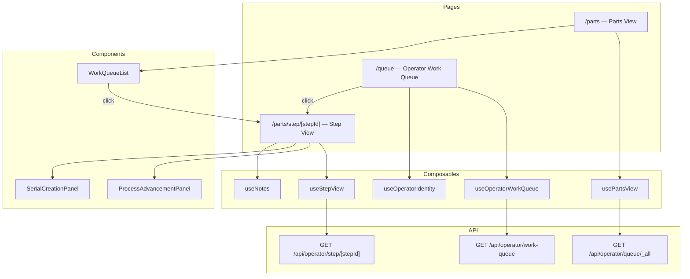

# Design: Operator View Redesign

## Overview

This feature splits the monolithic `operator.vue` page into three distinct, properly-routed pages:

1. **Parts View** (`/parts`) — Read-only listing of all active parts grouped by job and process step. Clicking a step navigates to the Step View. No operator identity required.
2. **Step View** (`/parts/step/[stepId]`) — Dedicated page for a single process step, rendering the existing `ProcessAdvancementPanel` or `SerialCreationPanel`. Directly navigable by URL with full browser history support.
3. **Operator Work Queue** (`/queue`) — Groups active work by the `assignedTo` field on `ProcessStep`. Shows operator sections with assigned steps. Selected operator reflected in URL query param (`?operator=userId`) for bookmarkability, with localStorage fallback.

The current `operator.vue` page is replaced entirely. The `Assignees` page is removed from the sidebar since the Operator Work Queue subsumes its purpose. Existing composables (`useWorkQueue`, `useOperatorIdentity`) and components (`WorkQueueList`, `ProcessAdvancementPanel`, `SerialCreationPanel`) are reused with minimal modifications.

### Design Decisions

1. **Step ID as the sole route parameter for Step View**: The step ID uniquely identifies a process step within a path. The Step View resolves the parent path and job from the step ID via a new lookup method, avoiding the need for `jobId/pathId/stepId` triple in the URL. This keeps URLs short and shareable: `/parts/step/step_abc123`.

2. **Query param for operator identity in Work Queue**: Using `?operator=userId` rather than a path segment (`/queue/userId`) because the operator selection is a filter, not a resource identifier. This also avoids conflicts with Nuxt's file-based routing and keeps the base route clean.

3. **New API endpoint for grouped-by-assignee data**: The current `/api/operator/queue/[userId]` endpoint ignores the userId for filtering and returns all work. Rather than modifying it (which would break existing behavior), a new endpoint `/api/operator/work-queue` returns work grouped by `assignedTo`. The existing endpoint remains for backward compatibility.

4. **Reuse WorkQueueList with minor adaptation**: The existing `WorkQueueList` component already groups jobs and emits `select-job`. In the Parts View, the `select-job` handler navigates to the Step View URL instead of opening an inline panel. In the Work Queue, the same component is rendered per-operator section.

5. **Step View fetches its own data**: The Step View page fetches the `WorkQueueJob` data for the given step ID via a new API endpoint (`GET /api/operator/step/[stepId]`). This makes the page fully self-contained and directly navigable without prior state.

6. **Remove inline panel behavior entirely**: The Parts View never opens `ProcessAdvancementPanel` inline. All step interactions happen at the Step View URL. External links (e.g., from job detail page) point to the Step View URL.

## Architecture

```
┌─────────────────────────────────────────────────────────────────────────┐
│ Frontend                                                                │
│                                                                         │
│  /parts (Parts View)                                                    │
│    └─► usePartsView (new) ──► GET /api/operator/queue/_all              │
│    └─► click step row ──► navigateTo('/parts/step/{stepId}')            │
│                                                                         │
│  /parts/step/[stepId] (Step View)                                       │
│    └─► useStepView (new) ──► GET /api/operator/step/{stepId}            │
│    └─► ProcessAdvancementPanel / SerialCreationPanel (existing)         │
│    └─► useNotes (existing)                                              │
│                                                                         │
│  /queue (Operator Work Queue)                                           │
│    └─► useOperatorWorkQueue (new) ──► GET /api/operator/work-queue      │
│    └─► useOperatorIdentity (existing, enhanced with URL sync)           │
│    └─► click entry ──► navigateTo('/parts/step/{stepId}')               │
│                                                                         │
├─────────────────────────────────────────────────────────────────────────┤
│ API Routes                                                              │
│                                                                         │
│  GET /api/operator/queue/_all ──► aggregation (all work, no userId)     │
│  GET /api/operator/step/{stepId} ──► step-level WorkQueueJob lookup     │
│  GET /api/operator/work-queue ──► work grouped by assignedTo            │
│                                                                         │
├─────────────────────────────────────────────────────────────────────────┤
│ Service Layer                                                           │
│                                                                         │
│  (Reuses existing jobService, pathService, serialService)               │
│  New aggregation logic lives in API route handlers (thin orchestration) │
│  or a new workQueueService if complexity warrants it                    │
│                                                                         │
├─────────────────────────────────────────────────────────────────────────┤
│ Repository Layer — No changes                                           │
└─────────────────────────────────────────────────────────────────────────┘
```



## UI Mockups

### Parts View (`/parts`)

```
┌──────────────────────────────────────────────────────────────┐
│  Active Parts                                    🔍 [Search] │
│                                                              │
│  42 parts awaiting action                                    │
│                                                              │
│  ┌──────────────────────────────────────────────────────────┐│
│  │ ▌ Bracket Assembly Job                        12 parts   ││
│  ├──────────────────────────────────────────────────────────┤│
│  │  Milling  📍 CNC Bay 1                                > ││
│  │  Main Route · Step 1/4 · Next: Deburring                ││
│  │                                                 [5]      ││
│  ├──────────────────────────────────────────────────────────┤│
│  │  Deburring  📍 Bench 3                                 > ││
│  │  Main Route · Step 2/4 · Next: Inspection                ││
│  │                                                 [4]      ││
│  ├──────────────────────────────────────────────────────────┤│
│  │  Inspection  📍 QC Lab                                 > ││
│  │  Main Route · Step 3/4 · Next: Completed                 ││
│  │                                              [3] ✓       ││
│  └──────────────────────────────────────────────────────────┘│
│                                                              │
│  ┌──────────────────────────────────────────────────────────┐│
│  │ ▌ Housing Unit Job                            30 parts   ││
│  ├──────────────────────────────────────────────────────────┤│
│  │  Receiving  📍 Dock A                                  > ││
│  │  Primary Path · Step 1/5 · Next: Machining               ││
│  │                                                [18]      ││
│  ├──────────────────────────────────────────────────────────┤│
│  │  Machining  📍 CNC Bay 2                               > ││
│  │  Primary Path · Step 2/5 · Next: Heat Treat              ││
│  │                                                [12]      ││
│  └──────────────────────────────────────────────────────────┘│
└──────────────────────────────────────────────────────────────┘

Clicking any step row navigates to /parts/step/{stepId}
```

### Step View (`/parts/step/[stepId]`)

```
┌──────────────────────────────────────────────────────────────┐
│  ← Back to Parts                                             │
│                                                              │
│  Milling                                                     │
│  Bracket Assembly Job · Main Route · 📍 CNC Bay 1           │
│                                                              │
│  ┌────────────────────────────────────────────────────────┐  │
│  │ Advancing to: Deburring → Bench 3                      │  │
│  └────────────────────────────────────────────────────────┘  │
│                                                              │
│  Serial Numbers (5/5)                      [All] [None]      │
│  ┌────────────────────────────────────────────────────────┐  │
│  │ ☑ SN-00042                              🗑️  🛡️         │  │
│  │ ☑ SN-00043                              🗑️  🛡️         │  │
│  │ ☑ SN-00044                              🗑️  🛡️         │  │
│  │ ☑ SN-00045                              🗑️  🛡️         │  │
│  │ ☑ SN-00046                              🗑️  🛡️         │  │
│  └────────────────────────────────────────────────────────┘  │
│                                                              │
│  Quantity                                                    │
│  [ 5 ] of 5 available                                        │
│                                                              │
│  Note (optional)                                             │
│  ┌────────────────────────────────────────────────────────┐  │
│  │ Add observations or issues...                          │  │
│  └────────────────────────────────────────────────────────┘  │
│                                                    0/1000    │
│                                                              │
│  Previous Notes                                              │
│  ┌────────────────────────────────────────────────────────┐  │
│  │ "Surface finish rough on batch" — Mike, 2h ago         │  │
│  └────────────────────────────────────────────────────────┘  │
│                                                              │
│  [→ Advance]  [Cancel]                                       │
└──────────────────────────────────────────────────────────────┘

For first step (stepOrder === 0), shows SerialCreationPanel instead:

┌──────────────────────────────────────────────────────────────┐
│  ← Back to Parts                                             │
│                                                              │
│  Receiving                                                   │
│  Housing Unit Job · Primary Path · 📍 Dock A                │
│                                                              │
│  ┌────────────────────────────────────────────────────────┐  │
│  │ Advancing to: Machining → CNC Bay 2                    │  │
│  └────────────────────────────────────────────────────────┘  │
│                                                              │
│  Create Serial Numbers                                       │
│  [ 5 ]  [+ Create]  [→ Create & Advance]                    │
│                                                              │
│  Accumulated Serials (3/3)                 [All] [None]      │
│  ┌────────────────────────────────────────────────────────┐  │
│  │ ☑ SN-00100                                             │  │
│  │ ☑ SN-00101                                             │  │
│  │ ☑ SN-00102                                             │  │
│  └────────────────────────────────────────────────────────┘  │
│                                                              │
│  [→ Advance 3 selected]  [Cancel]                            │
└──────────────────────────────────────────────────────────────┘
```

### Operator Work Queue (`/queue`)

```
URL: /queue                          (all operators)
URL: /queue?operator=user_abc123     (filtered to specific operator)

┌──────────────────────────────────────────────────────────────┐
│  Work Queue                          👷 [Mike ▾] [×]        │
│                                                              │
│  🔍 [Search jobs, paths, steps, operators...]                │
│                                                              │
│  56 parts across 3 operators                                 │
│                                                              │
│  ┌──────────────────────────────────────────────────────────┐│
│  │ 👤 Mike Johnson                    ★ selected  22 parts  ││
│  ├──────────────────────────────────────────────────────────┤│
│  │  Milling  📍 CNC Bay 1                                > ││
│  │  Bracket Assembly · Main Route · Step 1/4                 ││
│  │                                                 [5]      ││
│  ├──────────────────────────────────────────────────────────┤│
│  │  Machining  📍 CNC Bay 2                               > ││
│  │  Housing Unit · Primary Path · Step 2/5                   ││
│  │                                                [12]      ││
│  ├──────────────────────────────────────────────────────────┤│
│  │  Turning  📍 Lathe 1                                   > ││
│  │  Shaft Job · Main Route · Step 1/3                        ││
│  │                                                 [5]      ││
│  └──────────────────────────────────────────────────────────┘│
│                                                              │
│  ┌──────────────────────────────────────────────────────────┐│
│  │ 👤 Sarah Chen                                 18 parts  ││
│  ├──────────────────────────────────────────────────────────┤│
│  │  Deburring  📍 Bench 3                                 > ││
│  │  Bracket Assembly · Main Route · Step 2/4                 ││
│  │                                                 [4]      ││
│  ├──────────────────────────────────────────────────────────┤│
│  │  Inspection  📍 QC Lab                                 > ││
│  │  Bracket Assembly · Main Route · Step 3/4                 ││
│  │                                              [3] ✓       ││
│  ├──────────────────────────────────────────────────────────┤│
│  │  Heat Treat  📍 Oven Bay                               > ││
│  │  Housing Unit · Primary Path · Step 3/5                   ││
│  │                                                [11]      ││
│  └──────────────────────────────────────────────────────────┘│
│                                                              │
│  ┌──────────────────────────────────────────────────────────┐│
│  │ 📋 Unassigned                                 16 parts  ││
│  ├──────────────────────────────────────────────────────────┤│
│  │  Receiving  📍 Dock A                                  > ││
│  │  Housing Unit · Primary Path · Step 1/5                   ││
│  │                                                [16]      ││
│  └──────────────────────────────────────────────────────────┘│
└──────────────────────────────────────────────────────────────┘

When operator "Mike" is selected:
- His section is shown first with a ★ highlight
- Other sections remain visible below
- URL updates to /queue?operator=user_abc123
- Clicking any step row navigates to /parts/step/{stepId}
```

### Sidebar Navigation

```
┌─────────────────┐
│  Shop Planr      │
├─────────────────┤
│  📊 Dashboard    │
│  💼 Jobs         │
│  # Serials       │
│  🔧 Parts      ◄── NEW (was "Operator")
│  👷 Work Queue ◄── NEW (replaces "Assignees")
│  📋 Templates    │
│  📦 BOM          │
│  🛡️ Certs        │
│  🎫 Jira         │
│  📜 Audit        │
│  ⚙️ Settings     │
├─────────────────┤
│  [◀] [🌙]       │
└─────────────────┘
```

## Components and Interfaces

### New Pages

#### `app/pages/parts/index.vue` — Parts View

Replaces the current `operator.vue` as the all-parts listing. No operator identity required.

- Fetches all active work via `usePartsView` composable
- Renders `WorkQueueList` component for display
- Search input filters by job name, path name, or step name
- Clicking a step row navigates to `/parts/step/{stepId}` via `navigateTo()`
- Shows total active parts count and empty state when no work exists

#### `app/pages/parts/step/[stepId].vue` — Step View

Dedicated page for a single process step.

- Reads `stepId` from route params
- Fetches step data via `useStepView` composable
- Renders `SerialCreationPanel` if `stepOrder === 0`, otherwise `ProcessAdvancementPanel`
- Shows breadcrumb: Parts View > Job Name > Step Name
- Back link returns to `/parts`
- On successful advancement, refreshes data; if no parts remain, shows empty state with link back
- Error state if step ID is invalid or has no active parts

#### `app/pages/queue.vue` — Operator Work Queue

New page grouping work by operator/assignee.

- Fetches grouped work via `useOperatorWorkQueue` composable
- Renders operator sections, each containing a list of step entries
- "Unassigned" section for steps with no `assignedTo`
- Operator identity selector (reuses `useOperatorIdentity`)
- Selected operator synced to URL query param `?operator=userId`
- On page load: reads `operator` from URL query → falls back to localStorage
- Search input filters by job name, path name, step name, or operator name
- Clicking an entry navigates to `/parts/step/{stepId}`

### New Composables

#### `app/composables/usePartsView.ts`

```typescript
export function usePartsView() {
  // Fetches all active work (no operator filter)
  // Returns: jobs, loading, error, searchQuery, filteredJobs, totalParts, filteredParts
  // Calls: GET /api/operator/queue/_all
  async function fetchAllWork(): Promise<void>
  return { jobs, loading, error, searchQuery, filteredJobs, totalParts, filteredParts, fetchAllWork }
}
```

#### `app/composables/useStepView.ts`

```typescript
export function useStepView(stepId: string) {
  // Fetches WorkQueueJob data for a single step
  // Returns: job (WorkQueueJob | null), loading, error, notFound
  // Calls: GET /api/operator/step/{stepId}
  async function fetchStep(): Promise<void>
  return { job, loading, error, notFound, fetchStep }
}
```

#### `app/composables/useOperatorWorkQueue.ts`

```typescript
export interface OperatorGroup {
  operatorId: string | null  // null = unassigned
  operatorName: string       // "Unassigned" for null
  jobs: WorkQueueJob[]
  totalParts: number
}

export interface WorkQueueGroupedResponse {
  groups: OperatorGroup[]
  totalParts: number
}

export function useOperatorWorkQueue() {
  // Fetches work grouped by assignedTo
  // Returns: groups, loading, error, searchQuery, filteredGroups, totalParts
  // Calls: GET /api/operator/work-queue
  async function fetchGroupedWork(): Promise<void>
  return { response, groups, loading, error, searchQuery, filteredGroups, totalParts, fetchGroupedWork }
}
```

### New API Endpoints

#### `GET /api/operator/queue/_all` — All Active Work

Returns the same `WorkQueueResponse` shape as the existing `[userId]` endpoint but without any operator filtering. The `operatorId` field in the response is set to `"_all"`.

File: `server/api/operator/queue/_all.get.ts`

The `_all` literal route takes precedence over the `[userId]` dynamic route in Nuxt's file-based routing, so no conflict.

#### `GET /api/operator/step/[stepId]` — Single Step Data

Returns a `WorkQueueJob` for the given step ID, or 404 if the step doesn't exist or has no active parts.

File: `server/api/operator/step/[stepId].get.ts`

```typescript
// Response shape
interface StepViewResponse {
  job: WorkQueueJob
  notes: StepNote[]
}
```

This endpoint resolves the step's parent path and job, counts active serials at the step, and builds the `WorkQueueJob` object. It also fetches notes for the step to avoid a second round-trip.

#### `GET /api/operator/work-queue` — Grouped by Assignee

Returns work grouped by the `assignedTo` field on each `ProcessStep`.

File: `server/api/operator/work-queue.get.ts`

```typescript
// Response shape
interface WorkQueueGroupedResponse {
  groups: OperatorGroup[]
  totalParts: number
}

interface OperatorGroup {
  operatorId: string | null
  operatorName: string
  jobs: WorkQueueJob[]
  totalParts: number
}
```

The endpoint iterates all jobs → paths → steps (same pattern as the existing queue endpoint), but groups the resulting `WorkQueueJob` entries by `step.assignedTo`. For each group, it resolves the operator name from the users table. Steps with no `assignedTo` go into the "Unassigned" group.

### Modified Components

#### `app/layouts/default.vue` — Sidebar Navigation

Replace the current sidebar items:

```typescript
// Before
{ label: 'Operator', icon: 'i-lucide-wrench', to: '/operator' },
{ label: 'Assignees', icon: 'i-lucide-users', to: '/assignees' },

// After
{ label: 'Parts', icon: 'i-lucide-wrench', to: '/parts' },
{ label: 'Work Queue', icon: 'i-lucide-hard-hat', to: '/queue' },
```

#### `WorkQueueList.vue` — Minor Enhancement

Add an optional `navigateOnClick` behavior. Currently emits `select-job`; the parent page handler will call `navigateTo()` instead of opening an inline panel. No changes needed to the component itself — the parent's handler changes.

### Removed/Deprecated

- `app/pages/operator.vue` — Deleted (replaced by `/parts` and `/queue`)
- `app/pages/assignees.vue` — Deleted (subsumed by `/queue`)
- Query-param-based step selection (`?jobId=...&pathId=...&stepId=...`) — Removed entirely

## Data Models

### New Computed Types (`server/types/computed.ts`)

```typescript
/** A group of work entries assigned to a single operator */
export interface OperatorGroup {
  operatorId: string | null   // null means unassigned
  operatorName: string        // "Unassigned" when operatorId is null
  jobs: WorkQueueJob[]
  totalParts: number
}

/** Response from the grouped work queue endpoint */
export interface WorkQueueGroupedResponse {
  groups: OperatorGroup[]
  totalParts: number
}

/** Response from the single-step view endpoint */
export interface StepViewResponse {
  job: WorkQueueJob
  notes: StepNote[]
}
```

### Existing Types — No Changes

- `WorkQueueJob` — Already has all fields needed (jobId, jobName, pathId, pathName, stepId, stepName, stepOrder, stepLocation, totalSteps, serialIds, partCount, nextStepName, nextStepLocation, isFinalStep)
- `WorkQueueResponse` — Reused for the `_all` endpoint
- `ProcessStep` — Already has `assignedTo?: string`
- `ShopUser` — Used to resolve operator names in the grouped endpoint
- No database migrations needed
- No domain type changes needed


## Correctness Properties

*A property is a characteristic or behavior that should hold true across all valid executions of a system — essentially, a formal statement about what the system should do. Properties serve as the bridge between human-readable specifications and machine-verifiable correctness guarantees.*

### Property 1: All-Work Endpoint Completeness

*For any* set of jobs, each with paths containing ordered process steps and serials at various steps, the all-work endpoint (`/api/operator/queue/_all`) should return a `WorkQueueJob` entry for every step that has at least one active (non-scrapped, non-completed) serial. Each entry should contain the correct `partCount` (matching the number of active serials at that step), `stepName`, `stepLocation`, `pathName`, `jobName`, and `serialIds`.

**Validates: Requirements 1.2, 1.3**

### Property 2: TotalParts Invariant

*For any* response from the all-work endpoint or the grouped work-queue endpoint, the top-level `totalParts` field should equal the sum of `partCount` across all `WorkQueueJob` entries in the response. For the grouped endpoint, each `OperatorGroup.totalParts` should also equal the sum of `partCount` across that group's jobs.

**Validates: Requirements 1.4, 4.6**

### Property 3: Search Filter Correctness

*For any* list of `WorkQueueJob` entries and any non-empty search string, filtering by that string should return exactly those entries where `jobName`, `pathName`, or `stepName` contains the search string as a case-insensitive substring. When the search string is empty, all entries should be returned.

**Validates: Requirements 1.6, 1.7, 5.7**

### Property 4: Step Endpoint Correctness

*For any* valid step ID that has active serials, the step endpoint (`/api/operator/step/{stepId}`) should return a `WorkQueueJob` with: the correct `stepId`, `stepOrder`, `stepName`, and `stepLocation` matching the process step; the correct `jobId`, `jobName`, `pathId`, and `pathName` matching the parent path and job; `serialIds` containing exactly the IDs of all active serials at that step; and `partCount` equal to the length of `serialIds`.

**Validates: Requirements 2.3, 3.1, 3.5**

### Property 5: Invalid Step Rejection

*For any* step ID that does not exist in the database, or that exists but has zero active serials, the step endpoint should return a 404 error.

**Validates: Requirements 2.6**

### Property 6: Assignee Grouping Correctness

*For any* set of jobs with paths whose steps have various `assignedTo` values (some set to user IDs, some undefined), the grouped work-queue endpoint (`/api/operator/work-queue`) should: place each `WorkQueueJob` entry into the group matching its step's `assignedTo` value; resolve `operatorName` to the matching `ShopUser.name` for assigned steps; place steps with no `assignedTo` into a group with `operatorId = null` and `operatorName = "Unassigned"`; and ensure every active step appears in exactly one group.

**Validates: Requirements 4.2, 4.3, 4.4**

## Error Handling

### API Layer

All new endpoints follow the established thin-handler error pattern:

```typescript
catch (error) {
  if (error instanceof ValidationError)
    throw createError({ statusCode: 400, message: error.message })
  if (error instanceof NotFoundError)
    throw createError({ statusCode: 404, message: error.message })
  throw createError({ statusCode: 500, message: 'Internal server error' })
}
```

Specific error scenarios:

| Endpoint | Condition | Response |
|----------|-----------|----------|
| `GET /api/operator/step/{stepId}` | Step ID not found in DB | 404 "ProcessStep not found" |
| `GET /api/operator/step/{stepId}` | Step exists but has 0 active serials | 404 "No active parts at this step" |
| `GET /api/operator/step/{stepId}` | Missing stepId param | 400 "stepId is required" |
| `GET /api/operator/work-queue` | No jobs exist | 200 with empty `groups` array and `totalParts: 0` |
| `GET /api/operator/queue/_all` | No active work | 200 with empty `jobs` array and `totalParts: 0` |

### Frontend Layer

- **Loading states**: Each composable exposes a `loading` ref. Pages show skeleton/spinner while fetching.
- **Error states**: Each composable exposes an `error` ref. Pages show error message with retry button.
- **404 on Step View**: When the step endpoint returns 404, the page shows "Step not found or no active parts" with a link back to Parts View.
- **Empty states**: Parts View shows "No active work" message. Work Queue shows "No work assigned" per empty operator group.
- **Stale operator in URL**: If the `?operator=userId` in the Work Queue URL doesn't match any active user, the page clears the param and shows all work (same as no operator selected).

## Testing Strategy

### Dual Testing Approach

This feature uses both unit tests and property-based tests:

- **Property-based tests** (via `fast-check`): Verify universal properties across randomly generated job/path/serial/user configurations. Each property test runs a minimum of 100 iterations.
- **Unit tests**: Verify specific examples, edge cases, integration points, and error conditions.

### Property-Based Tests

Each correctness property maps to a single property-based test. Tests are tagged with the format:
`Feature: operator-view-redesign, Property {number}: {property_text}`

| Property | Test File | What It Generates |
|----------|-----------|-------------------|
| P1: All-Work Endpoint Completeness | `tests/properties/allWorkEndpoint.property.test.ts` | Random jobs with paths, steps, and serials at various steps; verifies response contains correct entries with matching metadata |
| P2: TotalParts Invariant | `tests/properties/totalPartsInvariant.property.test.ts` | Random WorkQueueResponse and WorkQueueGroupedResponse objects; verifies totalParts equals sum of partCounts at both top-level and group-level |
| P3: Search Filter Correctness | `tests/properties/workQueueSearch.property.test.ts` | Random WorkQueueJob arrays and search strings; verifies filter returns exactly matching entries |
| P4: Step Endpoint Correctness | `tests/properties/stepEndpoint.property.test.ts` | Random job/path/step/serial configurations; verifies step endpoint returns correct WorkQueueJob with matching data |
| P5: Invalid Step Rejection | `tests/properties/invalidStepRejection.property.test.ts` | Random non-existent step IDs and steps with zero active serials; verifies 404 response |
| P6: Assignee Grouping Correctness | `tests/properties/assigneeGrouping.property.test.ts` | Random steps with mixed assignedTo values and user records; verifies grouping, name resolution, and unassigned handling |

### Unit Tests

| Test | File | What It Covers |
|------|------|----------------|
| All-work empty state | `tests/unit/services/workQueue.test.ts` | Returns empty jobs array when no active serials exist |
| Step endpoint 404 | `tests/unit/services/workQueue.test.ts` | Returns 404 for non-existent step ID |
| Step endpoint no serials | `tests/unit/services/workQueue.test.ts` | Returns 404 for step with zero active serials |
| Grouped endpoint empty | `tests/unit/services/workQueue.test.ts` | Returns empty groups when no work exists |
| Unassigned group naming | `tests/unit/services/workQueue.test.ts` | Unassigned group has operatorId=null and operatorName="Unassigned" |
| Search filter empty query | `tests/unit/composables/workQueueSearch.test.ts` | Empty search returns all entries |
| Search filter case insensitive | `tests/unit/composables/workQueueSearch.test.ts` | "mill" matches "Milling" |

### Integration Tests

| Test | File | What It Covers |
|------|------|----------------|
| Full parts view flow | `tests/integration/operatorViewRedesign.test.ts` | Create jobs → paths → serials → verify all-work endpoint returns correct groups |
| Step view navigation | `tests/integration/operatorViewRedesign.test.ts` | Create job → path → serials → fetch step by ID → verify correct data |
| Grouped work queue | `tests/integration/operatorViewRedesign.test.ts` | Create jobs with assigned/unassigned steps → verify grouping |
| Step advancement from step view | `tests/integration/operatorViewRedesign.test.ts` | Fetch step → advance serials → re-fetch → verify updated counts |

### Test Configuration

- Property-based testing library: `fast-check` (already in project dependencies)
- Minimum iterations per property test: 100
- Test isolation: Each test creates a fresh temp SQLite database via `createTestContext()` from `tests/integration/helpers.ts`
- All property tests use the existing integration test helper pattern for database setup/teardown
