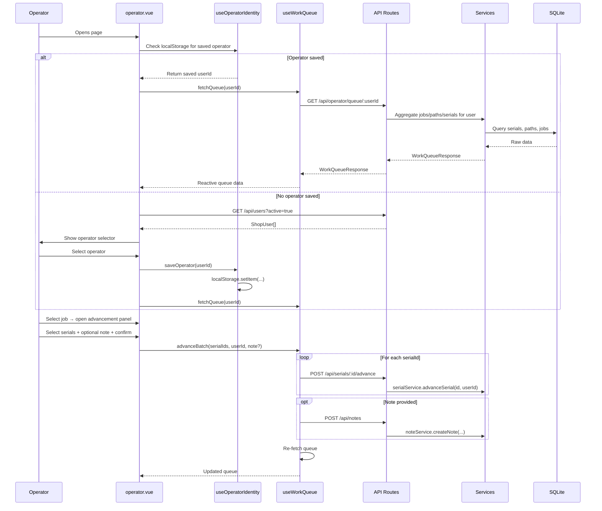

# Design Document: Operator Work Queue

## Overview

The Operator Work Queue replaces the current step-name-based operator view (`app/pages/operator.vue`) with a user-centric work queue. Instead of typing a process step name to see work at a station, operators select their identity from a dropdown and immediately see all jobs with parts assigned to them — grouped by job, with part counts, step names, and locations.

The feature adds a process advancement panel for batch-advancing serials, optional completion notes, and client-side search/filtering. It reuses the existing `serialService.advanceSerial()`, `noteService.createNote()`, and `userService.listActiveUsers()` backend methods, adding one new API endpoint for the operator work queue aggregation query.

### Key Design Decisions

1. **Operator identity via ShopUser selection** — reuses the existing `ShopUser` entity and `userService`. No new auth system needed; the kiosk-mode pattern already fits.
2. **New aggregation endpoint** — a single `GET /api/operator/queue/:userId` route replaces the step-name-based `GET /api/operator/:stepName`. The old route remains for backward compatibility.
3. **Client-side filtering** — search/filter runs in the browser against the already-fetched queue data. The queue dataset is small enough (dozens to low hundreds of items) that server-side filtering adds unnecessary complexity.
4. **Batch advancement via existing serial API** — the frontend calls `POST /api/serials/:id/advance` in a loop for each selected serial. No new batch-advance endpoint is needed since the operation is synchronous SQLite and fast enough for typical batch sizes (1–50 parts).
5. **localStorage for operator persistence** — the selected operator ID is stored in `localStorage` under a dedicated key, matching the existing pattern used by `useViewFilters`.

## Architecture

The feature follows the established layered architecture:

```
OperatorWorkQueue.vue → useWorkQueue composable → API routes → services → repositories → SQLite
         │                      │
         │                      ├── GET /api/operator/queue/:userId  (new)
         │                      ├── GET /api/users                   (existing)
         │                      ├── POST /api/serials/:id/advance    (existing, called per serial)
         │                      └── POST /api/notes                  (existing)
         │
         └── useOperatorIdentity composable (new — manages operator selection + localStorage)
```



## Components and Interfaces

### New Files

| File | Type | Purpose |
|------|------|---------|
| `app/composables/useOperatorIdentity.ts` | Composable | Manages operator selection, localStorage persistence, active user list |
| `app/composables/useWorkQueue.ts` | Composable | Fetches queue data, handles search/filter, batch advancement + notes |
| `app/components/WorkQueueList.vue` | Component | Displays jobs grouped with part counts, step info; emits job selection |
| `app/components/ProcessAdvancementPanel.vue` | Component | Serial selection, quantity input, note textarea, confirm/cancel |
| `server/api/operator/queue/[userId].get.ts` | API Route | Aggregates work queue data for a specific operator |

### Modified Files

| File | Change |
|------|--------|
| `app/pages/operator.vue` | Replace current step-name UI with work queue UI |
| `server/types/computed.ts` | Add `WorkQueueJob`, `WorkQueueResponse` types |

### Interfaces

#### `useOperatorIdentity` composable

```typescript
function useOperatorIdentity(): {
  operatorId: Readonly<Ref<string | null>>
  operatorName: Readonly<Ref<string | null>>
  activeUsers: Readonly<Ref<ShopUser[]>>
  loading: Readonly<Ref<boolean>>
  fetchActiveUsers(): Promise<void>
  selectOperator(userId: string): void
  clearOperator(): void
}
```

#### `useWorkQueue` composable

```typescript
function useWorkQueue(): {
  queue: Readonly<Ref<WorkQueueResponse | null>>
  loading: Readonly<Ref<boolean>>
  error: Readonly<Ref<string | null>>
  searchQuery: Ref<string>
  filteredJobs: ComputedRef<WorkQueueJob[]>
  totalParts: ComputedRef<number>
  filteredParts: ComputedRef<number>
  fetchQueue(userId: string): Promise<void>
  advanceBatch(params: {
    serialIds: string[]
    userId: string
    jobId: string
    pathId: string
    stepId: string
    note?: string
  }): Promise<{ advanced: number; nextStepName?: string }>
}
```

#### `GET /api/operator/queue/:userId` response

```typescript
interface WorkQueueResponse {
  operatorId: string
  jobs: WorkQueueJob[]
  totalParts: number
}
```

## Data Models

### New Computed Types (added to `server/types/computed.ts`)

```typescript
/** A job in the operator's work queue, with parts grouped at the current step */
export interface WorkQueueJob {
  jobId: string
  jobName: string
  pathId: string
  pathName: string
  stepId: string
  stepName: string
  stepOrder: number
  stepLocation?: string
  totalSteps: number
  serialIds: string[]
  partCount: number
  nextStepName?: string
  nextStepLocation?: string
  isFinalStep: boolean
}

/** Response from the operator work queue endpoint */
export interface WorkQueueResponse {
  operatorId: string
  jobs: WorkQueueJob[]
  totalParts: number
}
```

### No Database Schema Changes

The feature requires no new tables or migrations. It queries existing tables:
- `serials` — filter by `current_step_index >= 0` (active parts)
- `paths` + `process_steps` — resolve step names, locations, ordering
- `jobs` — job names
- `users` — operator identity

The "assigned to operator" concept is implemented as: all active serials across all jobs/paths where the current step name matches any step the operator would work at. For the initial implementation, the queue shows ALL active parts (not filtered by operator assignment, since the existing data model has no operator-to-step assignment). The `userId` parameter identifies who is viewing and will be used for audit trail on advancement actions.

> **Note**: The current data model does not have an operator-to-step or operator-to-job assignment relationship. The work queue will show all active work across all jobs. A future enhancement could add step assignments per operator. For now, the operator identity is used for: (1) persisting the "who am I" selection, (2) recording `userId` on advancement audit entries, and (3) recording `createdBy` on notes.

### localStorage Schema

```
Key: "shop_erp_operator_id"
Value: string (ShopUser.id) | null
```

## Correctness Properties

*A property is a characteristic or behavior that should hold true across all valid executions of a system — essentially, a formal statement about what the system should do. Properties serve as the bridge between human-readable specifications and machine-verifiable correctness guarantees.*

### Property 1: Queue aggregation correctness

*For any* set of jobs, paths, and serials in the database where some serials have `currentStepIndex >= 0`, the work queue endpoint should return `WorkQueueJob` entries whose `serialIds` arrays collectively contain exactly the set of all active (non-completed) serial IDs, with each serial appearing in exactly one job group matching its `pathId` and `currentStepIndex`.

**Validates: Requirements 1.1, 3.2**

### Property 2: Queue structural invariants

*For any* `WorkQueueResponse`, the following must hold: (a) each `WorkQueueJob` has `partCount` equal to `serialIds.length`, (b) each job has a non-empty `stepName` and `stepId`, (c) `totalParts` equals the sum of all `partCount` values across all jobs, and (d) jobs are grouped by the combination of `jobId + pathId + stepOrder`.

**Validates: Requirements 1.2, 1.3, 1.4**

### Property 3: Search filter correctness

*For any* search query string `q` and any list of `WorkQueueJob` items, the filtered result should contain exactly those items where `jobName`, `pathName`, or `stepName` contains `q` as a case-insensitive substring. When `q` is empty, the filtered result should equal the original list.

**Validates: Requirements 2.2, 2.3, 2.5**

### Property 4: Batch advancement by quantity in creation order

*For any* valid quantity `Q` (where `1 <= Q <= available parts at step`) and a list of serials sorted by `createdAt` ascending, advancing `Q` serials should advance exactly the first `Q` serials in creation order to the next step index (or to `-1` if at the final step), leaving the remaining serials unchanged.

**Validates: Requirements 3.4, 4.4**

### Property 5: Quantity validation rejects over-limit

*For any* positive integer quantity `Q` and available part count `N` at a step, if `Q > N` then the validation should reject the input, and if `1 <= Q <= N` then the validation should accept it.

**Validates: Requirements 4.2, 4.3**

### Property 6: Note creation on advancement with non-empty text

*For any* non-empty note text (≤ 1000 chars) and any non-empty set of serial IDs, when advancement is performed with a note, a `StepNote` record should be created with `serialIds` matching the advanced serials and `text` matching the provided note. When note text is empty or absent, no `StepNote` should be created.

**Validates: Requirements 5.2, 5.3**

### Property 7: Note length validation

*For any* string of length > 1000 characters, the note input should be rejected or truncated to 1000 characters. *For any* string of length ≤ 1000 characters (including empty), the note input should be accepted as-is.

**Validates: Requirements 5.4**

### Property 8: Operator selection localStorage round-trip

*For any* valid ShopUser ID, calling `selectOperator(id)` followed by reading from localStorage should return the same ID. On page reload, the composable should restore this ID and use it to fetch the queue.

**Validates: Requirements 6.3, 6.4**

## Error Handling

| Scenario | Layer | Behavior |
|----------|-------|----------|
| No operator selected | Page (UI) | Show operator selector, hide queue |
| Queue fetch fails (network) | `useWorkQueue` | Set `error` ref, show error message with retry button |
| Serial advancement fails (already completed) | `serialService` → API 400 | Show toast with error message, re-fetch queue to sync state |
| Serial advancement fails (not found) | `serialService` → API 404 | Show toast, re-fetch queue |
| Quantity exceeds available | `useWorkQueue` (client validation) | Prevent submission, show inline validation error |
| Note text exceeds 1000 chars | Page (UI) | Enforce `maxlength` on textarea, prevent submission if exceeded |
| Note creation fails | `noteService` → API 400/500 | Show toast with error, but advancement already succeeded (note failure is non-blocking) |
| User list fetch fails | `useOperatorIdentity` | Show error state with retry option |
| localStorage unavailable | `useOperatorIdentity` | Graceful degradation — operator must re-select each visit |

### Error Flow for Batch Advancement

Batch advancement calls `advanceSerial` sequentially. If one call fails mid-batch:
1. Already-advanced serials remain advanced (no rollback — matches existing behavior)
2. The error is captured and displayed to the operator
3. The queue is re-fetched to show current state
4. The operator can retry the remaining serials

This is acceptable because SQLite operations are fast and failures mid-batch are rare (typically only if data changed between queue fetch and advancement).

## Testing Strategy

### Property-Based Testing

Library: `fast-check` (already installed)
Minimum iterations: 100 per property

Each property test will be tagged with:
```
Feature: operator-work-queue, Property {N}: {title}
```

Property tests will live in `tests/properties/` following the existing pattern:

| File | Properties |
|------|-----------|
| `workQueueAggregation.property.test.ts` | P1: Queue aggregation, P2: Structural invariants |
| `workQueueFilter.property.test.ts` | P3: Search filter correctness |
| `workQueueAdvancement.property.test.ts` | P4: Batch advancement, P5: Quantity validation |
| `workQueueNotes.property.test.ts` | P6: Note creation, P7: Note length validation |
| `workQueueIdentity.property.test.ts` | P8: localStorage round-trip |

### Unit Tests

Focus on specific examples and edge cases:

- Empty queue (no active serials) returns `{ jobs: [], totalParts: 0 }`
- Queue with serials at final step shows `isFinalStep: true` and no `nextStepName`
- Search with empty string returns all jobs
- Quantity input of 0 is rejected
- Note with only whitespace is treated as empty (no StepNote created)
- Operator selection persists across composable re-instantiation
- Advancement of serial at final step sets `currentStepIndex = -1`

### Integration Tests

End-to-end tests using temp SQLite databases (existing pattern in `tests/integration/`):

- Full workflow: select operator → fetch queue → advance batch → verify queue updated
- Advancement with note: advance + note creation in single flow
- Queue reflects changes after advancement (serial moves to next group or disappears)

### Test Configuration

- Each property-based test: minimum 100 runs via `fc.assert(..., { numRuns: 100 })`
- Each property test references its design property number in a comment
- Integration tests use `createTestContext()` helper from `tests/integration/helpers.ts`
