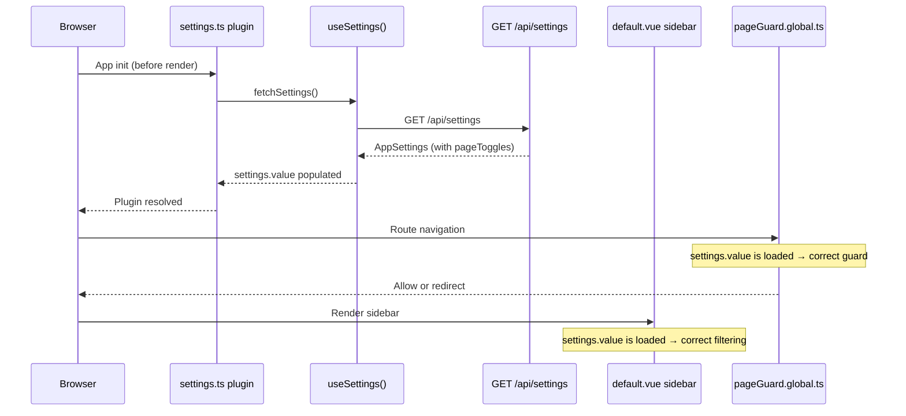

# Design Document: Page Toggle Refresh Fix

## Overview

GitHub Issue #13: "Page toggle Bug on refresh"

The page visibility toggle system loses its state on browser refresh because `fetchSettings()` is never called at the app level during initialization. It's only invoked inside `onMounted` hooks of specific page components (`jira.vue`, `jobs/[id].vue`, `settings.vue`). On a fresh page load, `settings.value` in `useSettings()` remains `null`, causing both the sidebar filtering in `default.vue` and the `pageGuard.global.ts` middleware to fall back to `DEFAULT_PAGE_TOGGLES` (all pages enabled).

The fix introduces a Nuxt plugin that calls `fetchSettings()` once during app initialization — before the first render — so that the sidebar and route middleware have the persisted toggle state immediately on every page load.

## Architecture

The fix is minimal and surgical. No new components, no schema changes, no new API routes. We add a single Nuxt plugin and remove redundant `fetchSettings()` calls from individual page components.

```
Current flow (broken):
  Browser refresh → layout renders (settings=null → all pages shown)
                  → middleware runs (settings=null → all pages allowed)
                  → page onMounted → fetchSettings() (too late, only on some pages)

Fixed flow:
  Browser refresh → plugin runs fetchSettings() (awaited)
                  → layout renders (settings loaded → correct filtering)
                  → middleware runs (settings loaded → correct guarding)
                  → page onMounted (no fetchSettings needed)
```



## Components and Interfaces

### Component 1: Nuxt Plugin — `app/plugins/settings.ts` (new)

**Purpose**: Fetch settings once during app initialization so that `settings.value` is populated before the first render and before route middleware runs.

**Interface**:

```typescript
// Nuxt plugin — no props/emits, runs automatically on app init
export default defineNuxtPlugin(async () => {
  const { fetchSettings } = useSettings()
  await fetchSettings()
})
```

**Responsibilities**:

- Call `fetchSettings()` exactly once during app startup
- Await the result so the plugin blocks rendering until settings are loaded
- If the fetch fails, `useSettings()` already handles the error gracefully (sets `settings.value = null`, which falls back to `DEFAULT_PAGE_TOGGLES`)

**Why a plugin and not `app.vue`**: Nuxt plugins run before the app renders and before route middleware executes on the initial navigation. Calling `fetchSettings()` in `app.vue`'s `<script setup>` would also work for the layout, but the route middleware runs before `app.vue` mounts. A plugin ensures settings are available for both the middleware and the layout on the very first render.

### Component 2: Remove redundant `fetchSettings()` calls (modified pages)

**Purpose**: Clean up the now-unnecessary `fetchSettings()` calls in individual page `onMounted` hooks, since the plugin handles initialization.

**Files affected**:

- `app/pages/jira.vue` — remove `fetchSettings()` from `onMounted`
- `app/pages/jobs/[id].vue` — remove `fetchSettings()` from `onMounted`
- `app/pages/settings.vue` — remove `fetchSettings()` from `onMounted`

**Note**: These pages still use `useSettings()` to read `settings` reactively and to call `updateSettings()`. Only the `fetchSettings()` call in `onMounted` is removed.

### Component 3: No changes needed

The following files require zero modifications:

- `app/middleware/pageGuard.global.ts` — already reads from `useSettings()` correctly
- `app/layouts/default.vue` — already computes `filteredNavItems` reactively
- `app/composables/useSettings.ts` — already handles errors and loading state
- `app/utils/pageToggles.ts` — utility re-exports unchanged
- `server/utils/pageToggles.ts` — server-side utilities unchanged
- No database/migration changes needed

## Data Models

No changes to any data models. The existing `AppSettings`, `PageToggles`, `ROUTE_TOGGLE_MAP`, and `DEFAULT_PAGE_TOGGLES` are all correct and unchanged.

## Key Functions with Formal Specifications

### Function 1: Settings plugin initialization

```typescript
// app/plugins/settings.ts
export default defineNuxtPlugin(async () => {
  const { fetchSettings } = useSettings()
  await fetchSettings()
})
```

**Preconditions:**

- App is initializing (plugin runs once per app lifecycle)
- `useSettings()` composable is available (auto-imported)

**Postconditions:**

- `settings.value` is populated with the server's `AppSettings` (including `pageToggles`), OR
- `settings.value` is `null` if the fetch failed (graceful degradation to `DEFAULT_PAGE_TOGGLES`)
- The plugin resolves before the first render and before route middleware runs on initial navigation

**Error handling:**

- Network/server errors are caught by `fetchSettings()` internally
- On failure, `settings.value` remains `null` → `DEFAULT_PAGE_TOGGLES` used → all pages enabled (safe fallback, matches requirement 3.3/3.5 from bugfix.md)

## Algorithmic Pseudocode

### App Initialization Sequence (fixed)

```
1. Browser loads page (fresh load or refresh)
2. Nuxt initializes plugins
   2a. settings.ts plugin runs
   2b. fetchSettings() called → GET /api/settings
   2c. settings.value = response (or null on error)
   2d. Plugin resolves
3. Route middleware runs for initial navigation
   3a. pageGuard reads settings.value → has real pageToggles (not null)
   3b. If page disabled → redirect to /
   3c. If page enabled → allow
4. Layout renders
   4a. default.vue reads settings.value → has real pageToggles
   4b. filteredNavItems computed with correct toggles
   4c. Sidebar shows only enabled pages (no flash)
5. Page component mounts
   5a. No fetchSettings() call needed — already loaded
```

## Correctness Properties

### Property 1: Settings loaded before first render

_For any_ page refresh or initial load, `settings.value` is non-null (assuming server is reachable) before the layout's `filteredNavItems` computed property is first evaluated.

**Validates: Bugfix requirement 2.1, 2.3**

### Property 2: Middleware has settings on initial navigation

_For any_ page refresh, the `pageGuard.global.ts` middleware reads a non-null `settings.value` (assuming server is reachable) on the initial route navigation, correctly enforcing toggle state.

**Validates: Bugfix requirement 2.2**

### Property 3: No flash of all pages

_For any_ page refresh where some pages are toggled off, the sidebar never renders with all pages visible because settings are loaded before the first render.

**Validates: Bugfix requirement 2.3**

### Property 4: Graceful degradation preserved

_For any_ page refresh where the settings API is unreachable, the system falls back to `DEFAULT_PAGE_TOGGLES` (all pages enabled), matching the existing error-handling behavior.

**Validates: Bugfix requirement 3.3, 3.5**

### Property 5: Reactive updates still work

_For any_ settings change made on the Settings page via `updateSettings()`, the sidebar and route middleware reactively reflect the new toggle state without requiring a page reload.

**Validates: Bugfix requirement 3.2**

### Property 6: No duplicate fetches

After the plugin loads settings, navigating between pages does not trigger additional `fetchSettings()` calls (since the per-page `onMounted` calls are removed). Settings are fetched exactly once per app lifecycle unless explicitly refreshed.

## Error Handling

### Error Scenario 1: Settings API unreachable on app init

**Condition**: `GET /api/settings` fails during plugin execution (network error, server down)
**Response**: `fetchSettings()` catches the error, sets `settings.value = null`, sets `error.value` with message
**Effect**: `DEFAULT_PAGE_TOGGLES` used everywhere → all pages enabled → app fully usable
**Recovery**: User can navigate to Settings page; next `updateSettings()` call will re-establish the connection

### Error Scenario 2: Slow settings API response

**Condition**: `GET /api/settings` takes several seconds to respond
**Response**: Plugin awaits the response, delaying the first render
**Effect**: User sees a brief loading state (Nuxt's default) rather than a flash of incorrect content
**Tradeoff**: Slightly delayed initial render vs. incorrect UI flash — the delay is preferable since it's a single lightweight API call

## Testing Strategy

### Manual Testing

1. Toggle off several pages in Settings → Page Visibility
2. Refresh the browser on various pages (/, /jobs, /jira, /settings, /parts)
3. Verify: sidebar shows only enabled pages immediately (no flash)
4. Verify: direct URL to disabled page redirects to /
5. Verify: toggling pages on Settings still works reactively without refresh

### Regression Checks

- All existing tests pass (`npm run test`)
- Settings page still loads and saves correctly
- Jira page still fetches Jira data (if it had other `onMounted` logic beyond `fetchSettings`)
- Job detail page still loads job data (its `onMounted` does more than just `fetchSettings`)

## Files Changed Summary

| File                      | Change                                    | Type     |
| ------------------------- | ----------------------------------------- | -------- |
| `app/plugins/settings.ts` | New plugin: fetch settings on app init    | New      |
| `app/pages/jira.vue`      | Remove `fetchSettings()` from `onMounted` | Modified |
| `app/pages/jobs/[id].vue` | Remove `fetchSettings()` from `onMounted` | Modified |
| `app/pages/settings.vue`  | Remove `fetchSettings()` from `onMounted` | Modified |
