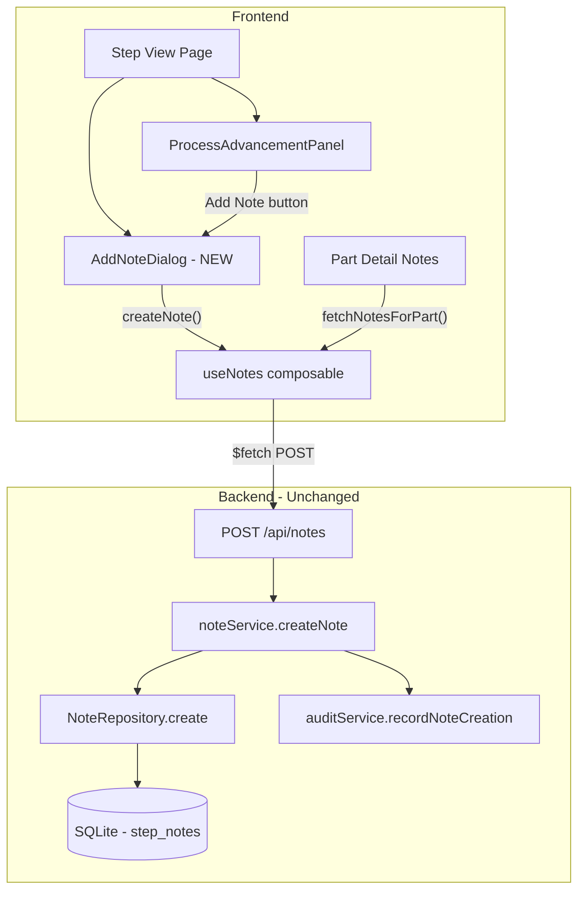
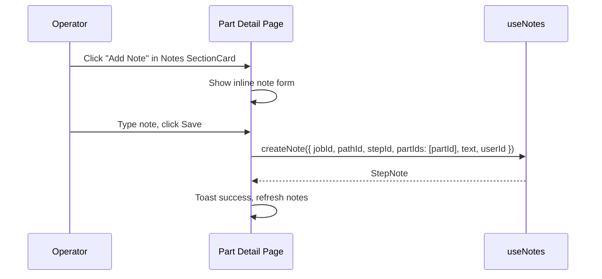

# Design Document: Part Notes Without Advance

## Overview

This feature (GitHub Issue #51) adds the ability for operators to attach notes to one or more parts at a process step without advancing those parts to the next step. Currently, notes can only be added as an optional field during the advancement flow (via `ProcessAdvancementPanel`) or through the inline note form on the part detail page (`parts-browser/[id].vue`). The existing `noteService.createNote()` already supports creating standalone notes — the gap is purely in the UI, which lacks a dedicated "Add Note" action on the Step View page that is decoupled from the advancement workflow.

The solution adds an "Add Note" button to the `ProcessAdvancementPanel` (and the Step View page) that opens a note input dialog, allows selecting one or more parts, and saves the note with timestamp and operator attribution — all without triggering any part advancement. The existing `step_notes` table, `NoteRepository`, `noteService`, and `POST /api/notes` endpoint are reused as-is. No schema migration is needed.

## Architecture

The feature fits cleanly into the existing layer stack. No new services, repositories, or API routes are required — only UI-layer changes.



## Sequence Diagrams

### Main Flow: Add Note Without Advancing

```mermaid
sequenceDiagram
    participant Op as Operator
    participant SV as Step View
    participant AND as AddNoteDialog
    participant UN as useNotes
    participant API as POST /api/notes
    participant NS as noteService
    participant NR as NoteRepository
    participant AS as auditService

    Op->>SV: Click "Add Note" button
    SV->>AND: Open dialog (partIds, stepId, jobId, pathId)
    Op->>AND: Select parts (checkbox list)
    Op->>AND: Type note text
    Op->>AND: Click "Save Note"
    AND->>UN: createNote({ jobId, pathId, stepId, partIds, text, userId })
    UN->>API: POST /api/notes { jobId, pathId, stepId, partIds, text, userId }
    API->>NS: createNote(input)
    NS->>NS: assertNonEmpty(text), assertNonEmptyArray(partIds)
    NS->>NR: create(note)
    NR->>NR: INSERT INTO step_notes
    NS->>AS: recordNoteCreation({ userId, jobId, pathId, stepId })
    AS->>AS: INSERT INTO audit_entries (action='note_created')
    NS-->>API: StepNote
    API-->>UN: StepNote
    UN-->>AND: Success
    AND->>SV: Close dialog, show toast
    SV->>SV: Refresh notes list
```

### Part Detail Page: Existing Inline Note (Unchanged)



## Components and Interfaces

### Component 1: AddNoteDialog (NEW)

**Purpose**: Modal dialog for adding notes to selected parts without advancing them. Reusable across Step View and potentially other contexts.

**Interface**:
```typescript
// Props
interface AddNoteDialogProps {
  modelValue: boolean              // v-model for open/close
  partIds: string[]                // Available parts to select from
  jobId: string
  pathId: string
  stepId: string
  stepName: string                 // Display label for context
  preSelectedPartIds?: string[]    // Optional pre-selection (e.g., from current selection)
}

// Emits
interface AddNoteDialogEmits {
  'update:modelValue': [value: boolean]
  'saved': [note: StepNote]
}
```

**Responsibilities**:
- Render a UModal with part checkbox list, note textarea, and Save/Cancel buttons
- Require at least one part selected and non-empty note text
- Call `useNotes().createNote()` on save
- Emit `saved` event with the created note for parent to refresh
- Show character count (max 1000)
- Use `useOperatorIdentity().operatorId` for the `userId` field

### Component 2: ProcessAdvancementPanel (MODIFIED)

**Purpose**: Existing advancement panel gains an "Add Note" button in the actions bar.

**Changes**:
- Add an "Add Note" `UButton` next to the existing Advance/Skip/Cancel buttons
- Wire it to open `AddNoteDialog` with the currently available `partIds`
- Pass through `selectedParts` as `preSelectedPartIds` so the dialog pre-selects whatever the operator already checked
- On `saved` event, emit a new `noteAdded` event so the parent (Step View) can refresh notes

### Component 3: Step View Page (MODIFIED)

**Purpose**: The `parts/step/[stepId].vue` page handles the `noteAdded` event to refresh displayed notes.

**Changes**:
- Listen for `@noteAdded` from `ProcessAdvancementPanel`
- Re-fetch step notes on note creation
- Also show "Add Note" button in the zero-parts waiting state (disabled) and in the PartCreationPanel context

## Data Models

### Existing: StepNote (No Changes)

```typescript
interface StepNote {
  id: string                    // note_{nanoid(12)}
  jobId: string                 // FK to jobs
  pathId: string                // FK to paths
  stepId: string                // FK to process_steps
  partIds: readonly string[]    // JSON array of part IDs
  text: string                  // Note content (1-1000 chars)
  createdBy: string             // User ID of the operator
  createdAt: string             // ISO 8601 timestamp
  pushedToJira: boolean         // Jira sync flag
  jiraCommentId?: string        // Jira comment reference
}
```

**Validation Rules** (enforced by `noteService.createNote`):
- `text` must be non-empty (after trim)
- `partIds` must be a non-empty array
- `jobId`, `pathId`, `stepId` are required strings

### Existing: AuditEntry for note_created (No Changes)

```typescript
// Audit entry created by auditService.recordNoteCreation
{
  id: string           // aud_{nanoid(12)}
  action: 'note_created'
  userId: string       // Operator who created the note
  timestamp: string    // ISO 8601
  jobId: string
  pathId: string
  stepId: string
}
```

### Existing: API Input (No Changes)

```typescript
// POST /api/notes request body — already supports standalone note creation
interface CreateNoteInput {
  jobId: string
  pathId: string
  stepId: string
  partIds: string[]
  text: string
  userId: string
}
```

## Key Functions with Formal Specifications

### Function 1: AddNoteDialog.handleSave()

```typescript
async function handleSave(): Promise<void>
```

**Preconditions:**
- `noteText.value.trim().length > 0`
- `selectedPartIds.value.size > 0`
- `operatorId` is defined (non-null)
- `props.jobId`, `props.pathId`, `props.stepId` are valid entity IDs

**Postconditions:**
- A new `StepNote` is persisted in the database
- An `audit_entries` row with `action = 'note_created'` exists
- The dialog closes (`modelValue` set to `false`)
- The `saved` event is emitted with the created `StepNote`
- No part positions are changed (`current_step_id` unchanged for all selected parts)
- Toast notification shown on success or error

**Loop Invariants:** N/A

### Function 2: noteService.createNote() (Existing — No Changes)

```typescript
function createNote(input: {
  jobId: string
  pathId: string
  stepId: string
  partIds: string[]
  text: string
  userId: string
}): StepNote
```

**Preconditions:**
- `input.text` is non-empty (validated by `assertNonEmpty`)
- `input.partIds` is a non-empty array (validated by `assertNonEmptyArray`)

**Postconditions:**
- Returns a `StepNote` with a generated `id` (prefix `note_`)
- The note is persisted in `step_notes` table
- An audit entry with `action = 'note_created'` is recorded
- `pushedToJira` is `false` by default
- No side effects on any `parts` table rows (no advancement)

**Loop Invariants:** N/A

### Function 3: useNotes().createNote() (Existing — No Changes)

```typescript
async function createNote(input: {
  jobId: string
  pathId: string
  stepId: string
  partIds: string[]
  text: string
  userId: string
}): Promise<StepNote>
```

**Preconditions:**
- Network connectivity to the API server
- `input` fields are all non-empty strings / arrays

**Postconditions:**
- Returns the created `StepNote` from the server
- `notes` ref is prepended with the new note
- On error: `error` ref is set, exception is re-thrown

**Loop Invariants:** N/A

## Algorithmic Pseudocode

### AddNoteDialog Save Flow

```typescript
// AddNoteDialog.vue — handleSave()
async function handleSave() {
  // ASSERT: noteText is non-empty after trim
  // ASSERT: at least one part is selected
  // ASSERT: operatorId is defined

  const trimmedText = noteText.value.trim()
  if (!trimmedText || selectedPartIds.value.size === 0) return

  saving.value = true
  try {
    const note = await createNote({
      jobId: props.jobId,
      pathId: props.pathId,
      stepId: props.stepId,
      partIds: Array.from(selectedPartIds.value),
      text: trimmedText,
      userId: operatorId.value!,
    })

    // ASSERT: note.id starts with 'note_'
    // ASSERT: note.partIds matches selectedPartIds
    // ASSERT: note.createdBy === operatorId

    emit('saved', note)
    emit('update:modelValue', false)

    toast.add({
      title: 'Note added',
      description: `Note added to ${selectedPartIds.value.size} part${selectedPartIds.value.size !== 1 ? 's' : ''}`,
      color: 'success',
    })
  } catch (e) {
    toast.add({
      title: 'Failed to add note',
      description: e?.data?.message ?? e?.message ?? 'An error occurred',
      color: 'error',
    })
  } finally {
    saving.value = false
  }
}
```

### ProcessAdvancementPanel — Add Note Button Integration

```typescript
// ProcessAdvancementPanel.vue — new state and handler
const showAddNoteDialog = ref(false)

function handleNoteAdded(note: StepNote) {
  // Bubble up to parent (Step View) for notes refresh
  emit('noteAdded', note)
}

// Template addition: UButton in actions bar
// <UButton label="Add Note" icon="i-lucide-message-square-plus"
//   variant="outline" @click="showAddNoteDialog = true" />
// <AddNoteDialog v-model="showAddNoteDialog" :part-ids="localPartIds"
//   :job-id="job.jobId" :path-id="job.pathId" :step-id="job.stepId"
//   :step-name="job.stepName" :pre-selected-part-ids="[...selectedParts]"
//   @saved="handleNoteAdded" />
```

## Example Usage

```typescript
// Example 1: Operator adds a note to 3 parts at a step without advancing
// Step View → ProcessAdvancementPanel → "Add Note" button → AddNoteDialog
const note = await createNote({
  jobId: 'job_V1StGXR8_Z5j',
  pathId: 'path_abc123',
  stepId: 'step_xyz789',
  partIds: ['SN-00001', 'SN-00002', 'SN-00003'],
  text: 'Surface finish within tolerance but on the high side. Monitor next batch.',
  userId: 'user_op42',
})
// Result: note saved, parts remain at step_xyz789, no advancement

// Example 2: Single part note from part detail page (existing flow, unchanged)
await createNote({
  jobId: 'job_V1StGXR8_Z5j',
  pathId: 'path_abc123',
  stepId: 'step_xyz789',
  partIds: ['SN-00001'],
  text: 'Minor scratch on surface — cosmetic only.',
  userId: 'user_op42',
})

// Example 3: Note added during advancement (existing flow, unchanged)
await advanceBatch({
  partIds: ['SN-00001'],
  userId: 'user_op42',
  jobId: 'job_V1StGXR8_Z5j',
  pathId: 'path_abc123',
  stepId: 'step_xyz789',
  note: 'All measurements within spec.',
})
// Result: part advanced AND note saved
```

## Correctness Properties

*A property is a characteristic or behavior that should hold true across all valid executions of a system — essentially, a formal statement about what the system should do. Properties serve as the bridge between human-readable specifications and machine-verifiable correctness guarantees.*

### Property 1: Note creation never modifies part position

*For any* set of parts at a process step and any valid note text, creating a note via `noteService.createNote` SHALL leave the `current_step_id` of every referenced part unchanged.

**Validates: Requirement 1.4**

### Property 2: Note attribution and valid timestamp

*For any* valid user ID and note text, the created StepNote SHALL have `createdBy` equal to the input user ID and `createdAt` set to a valid ISO 8601 timestamp.

**Validates: Requirement 3.1**

### Property 3: Note visible from each referenced part

*For any* non-empty subset of part IDs used to create a note, calling `getNotesForPart` for each part ID in the subset SHALL return a list containing that note.

**Validates: Requirements 2.4, 4.2**

### Property 4: Audit trail records note creation

*For any* valid note creation input, after calling `noteService.createNote`, the audit log SHALL contain exactly one new entry with `action = 'note_created'` and the matching user ID, job ID, path ID, and step ID.

**Validates: Requirement 3.3**

### Property 5: Whitespace-only text is rejected

*For any* string composed entirely of whitespace characters, calling `noteService.createNote` with that string as the text SHALL throw a ValidationError, and no StepNote SHALL be persisted.

**Validates: Requirements 5.1, 5.5**

## Error Handling

### Error Scenario 1: Empty Note Text

**Condition**: Operator clicks Save with blank or whitespace-only note text
**Response**: `AddNoteDialog` disables the Save button when `noteText.trim()` is empty; server-side `assertNonEmpty` throws `ValidationError` as a safety net
**Recovery**: User types valid text and retries

### Error Scenario 2: No Parts Selected

**Condition**: Operator deselects all parts and clicks Save
**Response**: `AddNoteDialog` disables the Save button when `selectedPartIds.size === 0`; server-side `assertNonEmptyArray` throws `ValidationError` as a safety net
**Recovery**: User selects at least one part and retries

### Error Scenario 3: No Operator Selected

**Condition**: Operator tries to add a note without selecting an operator identity
**Response**: The "Add Note" button is disabled when `operatorId` is null (same pattern as the Advance button)
**Recovery**: User selects an operator from the dropdown first

### Error Scenario 4: Network/Server Error

**Condition**: API call fails (network timeout, server error)
**Response**: `useNotes().createNote()` catches the error, sets `error` ref, and re-throws; `AddNoteDialog` catches it and shows an error toast
**Recovery**: Dialog remains open with the note text preserved; user can retry

## Testing Strategy

### Unit Testing Approach

- Test `AddNoteDialog` component: renders correctly, disables Save when no text/no parts, emits `saved` on successful creation, shows error toast on failure
- Test `ProcessAdvancementPanel` changes: "Add Note" button renders, opens dialog, passes correct props
- Mock `useNotes().createNote()` and `useOperatorIdentity()` in component tests

### Property-Based Testing Approach

**Property Test Library**: fast-check

- Property 1: Note creation does not modify `current_step_id` for any part in the input (Validates: Req 1.4)
- Property 2: Created note has correct `createdBy` and valid `createdAt` (Validates: Req 3.1)
- Property 3: Note is retrievable via `getNotesForPart` for every part in `partIds` (Validates: Req 2.4, 4.2)
- Property 4: Audit entry with `note_created` action is recorded for every note creation (Validates: Req 3.3)
- Property 5: Whitespace-only text is rejected by NoteService (Validates: Req 5.1, 5.5)

### Integration Testing Approach

- End-to-end test: create a job with path/steps/parts → add note via `POST /api/notes` without advancing → verify parts remain at same step → verify note appears in `GET /api/notes/part/:id` and `GET /api/notes/step/:id`
- Verify audit trail contains `note_created` entry after standalone note creation

## Performance Considerations

No performance concerns. The feature reuses the existing `POST /api/notes` endpoint which performs a single `INSERT` into `step_notes` and a single `INSERT` into `audit_entries`. The `json_each` query for `listByPartId` is already indexed and performant for the expected note volume.

## Security Considerations

- Operator identity is required (enforced by UI disabling and server-side `userId` requirement)
- Note text is trimmed and length-capped at 1000 characters (client-side `maxlength` + server-side validation)
- No new authorization concerns — the existing note creation endpoint has no admin-only restrictions, which is correct since operators at any level need to log observations

## Dependencies

No new dependencies. The feature uses:
- Existing `useNotes` composable
- Existing `POST /api/notes` API route
- Existing `noteService.createNote()` service method
- Existing `NoteRepository.create()` repository method
- Nuxt UI `UModal`, `UTextarea`, `UButton` components
- Native `<input type="checkbox">` for part selection (consistent with ProcessAdvancementPanel pattern)
