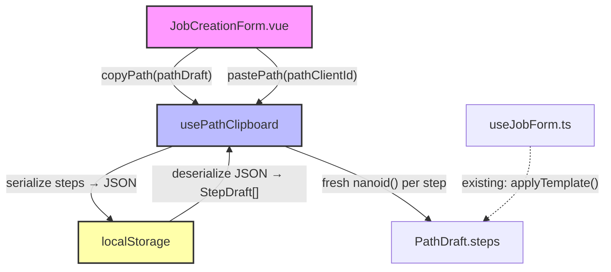
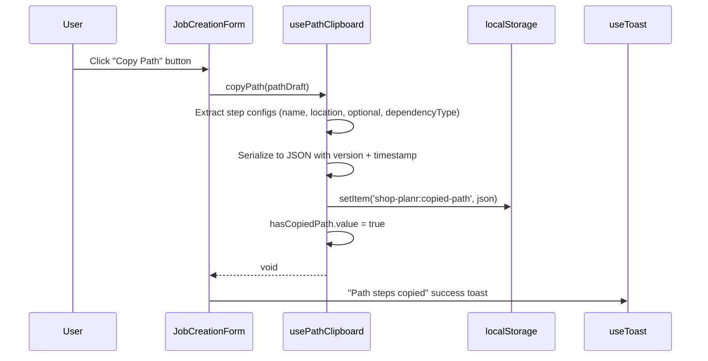
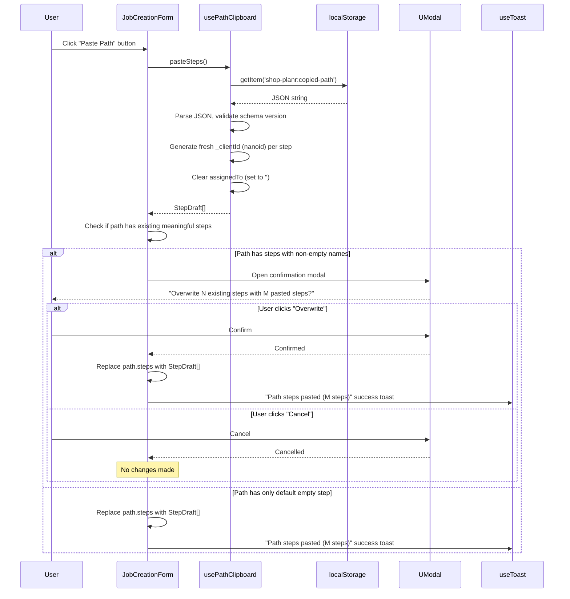

# Design Document: Path Copy/Paste

## Overview

The Job Creation Form allows users to define multiple routing paths, each with an ordered list of process steps. When jobs share similar routing configurations, users currently have to manually recreate step configurations for each path, or rely on server-side templates. This feature adds client-side copy/paste functionality that serializes a path's step configuration to `localStorage` and deserializes it into another path, enabling quick duplication of routing configurations without server round-trips.

The copy/paste buttons are always visible in both create and edit modes, since "new path → paste" is a normal workflow. When pasting into a path that already has meaningful step data (steps with non-empty names), a UModal confirmation dialog warns the user before overwriting. If the path only has the default empty step from `addPath()`, the paste proceeds without confirmation.

The feature is purely client-side — no API changes, no new server endpoints, no database modifications. It follows the same deep-clone pattern already used by `applyTemplate()` in `useJobForm.ts`, but sources data from `localStorage` instead of a server-side template. The clipboard is namespaced under `shop-planr:copied-path` and persists across page reloads and browser tabs.

## Architecture

The feature adds a new composable (`usePathClipboard`) and two buttons to the existing `JobCreationForm.vue` path card header. No existing architecture layers are modified.



## Sequence Diagrams

### Copy Path



### Paste Path



## Components and Interfaces

### Component 1: usePathClipboard (New Composable)

**Purpose**: Encapsulates localStorage read/write for path step clipboard operations.

**File**: `app/composables/usePathClipboard.ts`

**Interface**:
```typescript
interface CopiedPathData {
  version: 1
  copiedAt: string  // ISO timestamp
  steps: CopiedStep[]
}

interface CopiedStep {
  name: string
  location: string
  optional: boolean
  dependencyType: 'physical' | 'preferred' | 'completion_gate'
}

function usePathClipboard(): {
  hasCopiedPath: ComputedRef<boolean>
  copyPath: (path: PathDraft) => void
  pasteSteps: () => StepDraft[] | null
}
```

**Responsibilities**:
- Serialize path step configuration (excluding `_clientId`, `_existingStepId`, `assignedTo`) to localStorage
- Deserialize and validate clipboard data from localStorage
- Generate fresh `_clientId` values via `nanoid()` for each pasted step
- Track whether a valid clipboard entry exists via reactive `hasCopiedPath`
- Handle localStorage errors gracefully (quota exceeded, disabled, corrupted data)

### Component 2: JobCreationForm.vue (Modified)

**Purpose**: Add Copy/Paste/Delete buttons to each path card header. Paste includes a confirmation modal when overwriting existing steps.

**File**: `app/components/JobCreationForm.vue`

**Interface change**: None — props and emits remain identical. Internal template additions only.

**Responsibilities**:
- Import and use `usePathClipboard` composable
- Render Copy, Paste, and Delete buttons in every path card header (both create and edit modes)
- Add "Copy" icon button to each path card header (next to the delete button)
- Add "Paste" icon button to each path card header (visible only when clipboard has data)
- Wire copy button to `copyPath()` → show success toast
- Wire paste button to `pasteSteps()` → check for existing meaningful steps → show confirmation modal or apply directly
- Use `UTooltip` on both buttons for discoverability
- Manage paste confirmation modal state (`showPasteConfirm`, `pasteTarget`, `pendingSteps`)
- Determine "meaningful steps" via `hasExistingStepData(path)` — returns `true` if any step has a non-empty `name`

### Component 3: useJobForm.ts (No Changes)

**Purpose**: The existing `createStepDraft()` helper is not exported, but the composable already exposes `pathDrafts` as a mutable ref. The paste operation directly assigns to `path.steps` on the reactive array, which is the same pattern used by `applyTemplate()`.

No changes needed to `useJobForm.ts`.

### Component 4: Paste Confirmation Modal (Inline in JobCreationForm.vue)

**Purpose**: Warns the user before overwriting existing step data when pasting. Follows the `PartDeleteButton.vue` UModal pattern.

**Interface**:
```typescript
// Reactive state managed in JobCreationForm.vue <script setup>
const showPasteConfirm = ref(false)
const pasteTarget = ref<PathDraft | null>(null)
const pendingSteps = ref<StepDraft[] | null>(null)

function hasExistingStepData(path: PathDraft): boolean
function confirmPaste(): void
function cancelPaste(): void
```

**UModal Pattern** (matches `PartDeleteButton.vue`):
- Uses `#title` slot (not `#header`) to preserve Reka UI's `DialogTitle` wrapper for accessibility
- Sets `description` prop for `aria-describedby`, with `ui.description: 'sr-only'` to hide visually
- Footer has "Cancel" (outline/neutral) and "Overwrite" (solid/warning) buttons
- Body shows warning text with counts: how many existing steps will be replaced and how many will be pasted

**Responsibilities**:
- Display when `showPasteConfirm` is `true`
- Show the number of existing steps that will be lost and the number of incoming pasted steps
- "Cancel" closes the modal without changes
- "Overwrite" applies `pendingSteps` to `pasteTarget.steps`, closes modal, shows success toast

## Data Models

### localStorage Schema

**Key**: `shop-planr:copied-path`

**Value**: JSON string conforming to `CopiedPathData`:

```typescript
interface CopiedPathData {
  version: 1
  copiedAt: string  // ISO 8601 timestamp
  steps: CopiedStep[]
}

interface CopiedStep {
  name: string
  location: string
  optional: boolean
  dependencyType: 'physical' | 'preferred' | 'completion_gate'
}
```

**Validation Rules**:
- `version` must be `1` (future-proofing for schema changes)
- `steps` must be a non-empty array
- Each step must have a non-empty `name` string
- `dependencyType` must be one of the three valid enum values
- Invalid or missing data returns `null` from `pasteSteps()`

### Fields Deliberately Excluded from Copy

| Field | Reason |
|-------|--------|
| `_clientId` | Must be regenerated (nanoid) to avoid duplicate keys |
| `_existingStepId` | Pasted steps are always new — no server-side identity |
| `assignedTo` | Different paths may have different assignees |
| `name` (path-level) | User should name each path independently |
| `goalQuantity` | Path-level field, not part of step config |
| `advancementMode` | Path-level field, not part of step config |


## Key Functions with Formal Specifications

### Function 1: copyPath()

```typescript
function copyPath(path: PathDraft): void
```

**Preconditions:**
- `path` is a valid `PathDraft` with at least one step
- `path.steps` is a non-empty array of `StepDraft` objects

**Postconditions:**
- `localStorage.getItem('shop-planr:copied-path')` contains a valid JSON string
- The stored JSON has `version: 1`, an ISO timestamp in `copiedAt`, and a `steps` array
- Each stored step contains only `name`, `location`, `optional`, `dependencyType`
- No `_clientId`, `_existingStepId`, or `assignedTo` fields are stored
- `hasCopiedPath.value` is `true`
- If localStorage write fails (quota, disabled), the function does not throw — returns silently

**Loop Invariants:** N/A

### Function 2: pasteSteps()

```typescript
function pasteSteps(): StepDraft[] | null
```

**Preconditions:**
- None (handles missing/invalid clipboard data gracefully)

**Postconditions:**
- If valid clipboard data exists: returns `StepDraft[]` where each step has a fresh `_clientId` (nanoid), `assignedTo` is `''`, and `_existingStepId` is `undefined`
- If clipboard is empty, corrupted, or has wrong version: returns `null`
- The returned array length equals the stored `steps` array length
- No mutations to localStorage (read-only operation)
- Each returned `StepDraft._clientId` is unique (generated by nanoid)

**Loop Invariants:**
- For each step in the stored array, exactly one `StepDraft` is produced in the output array

### Function 3: hasCopiedPath (computed)

```typescript
hasCopiedPath: ComputedRef<boolean>
```

**Preconditions:**
- Composable has been initialized

**Postconditions:**
- Returns `true` if and only if `localStorage.getItem('shop-planr:copied-path')` contains a parseable JSON string with `version: 1` and a non-empty `steps` array
- Returns `false` if localStorage is empty, disabled, or contains invalid data

## Algorithmic Pseudocode

### copyPath Algorithm

```typescript
function copyPath(path: PathDraft): void {
  // Step 1: Extract only the step configuration fields
  const steps: CopiedStep[] = path.steps.map(step => ({
    name: step.name,
    location: step.location,
    optional: step.optional,
    dependencyType: step.dependencyType,
  }))

  // Step 2: Build versioned clipboard payload
  const payload: CopiedPathData = {
    version: 1,
    copiedAt: new Date().toISOString(),
    steps,
  }

  // Step 3: Write to localStorage (graceful failure)
  try {
    localStorage.setItem(STORAGE_KEY, JSON.stringify(payload))
    clipboardExists.value = true
  } catch {
    // Quota exceeded or localStorage disabled — silent failure
  }
}
```

### pasteSteps Algorithm

```typescript
function pasteSteps(): StepDraft[] | null {
  // Step 1: Read from localStorage
  let raw: string | null
  try {
    raw = localStorage.getItem(STORAGE_KEY)
  } catch {
    return null  // localStorage disabled
  }
  if (!raw) return null

  // Step 2: Parse and validate
  let data: CopiedPathData
  try {
    data = JSON.parse(raw)
  } catch {
    return null  // Corrupted JSON
  }
  if (data.version !== 1 || !Array.isArray(data.steps) || data.steps.length === 0) {
    return null  // Invalid schema
  }

  // Step 3: Generate fresh StepDrafts with new client IDs
  return data.steps.map(step => ({
    _clientId: nanoid(),
    name: step.name ?? '',
    location: step.location ?? '',
    assignedTo: '',  // Always cleared on paste
    optional: step.optional ?? false,
    dependencyType: step.dependencyType ?? 'preferred',
  }))
}
```

### checkClipboard Algorithm

```typescript
function checkClipboard(): boolean {
  try {
    const raw = localStorage.getItem(STORAGE_KEY)
    if (!raw) return false
    const data = JSON.parse(raw)
    return data.version === 1 && Array.isArray(data.steps) && data.steps.length > 0
  } catch {
    return false
  }
}
```

### handlePastePath Algorithm (in JobCreationForm.vue)

```typescript
/** A path has meaningful step data if any step has a non-empty name */
function hasExistingStepData(path: PathDraft): boolean {
  return path.steps.some(s => s.name.trim() !== '')
}

function handlePastePath(path: PathDraft): void {
  // Step 1: Get pasted steps from clipboard
  const steps = pasteSteps()
  if (!steps) {
    toast.add({ title: 'Paste failed', description: 'No valid path data in clipboard', color: 'error' })
    return
  }

  // Step 2: Check if path has meaningful existing step data
  if (hasExistingStepData(path)) {
    // Store pending paste state and show confirmation modal
    pasteTarget.value = path
    pendingSteps.value = steps
    showPasteConfirm.value = true
    return  // Wait for user confirmation
  }

  // Step 3: No meaningful data — paste directly without confirmation
  path.steps = steps
  toast.add({
    title: 'Path steps pasted',
    description: `${steps.length} step${steps.length !== 1 ? 's' : ''} applied`,
    color: 'success',
  })
}

function confirmPaste(): void {
  if (pasteTarget.value && pendingSteps.value) {
    const count = pendingSteps.value.length
    pasteTarget.value.steps = pendingSteps.value
    toast.add({
      title: 'Path steps pasted',
      description: `${count} step${count !== 1 ? 's' : ''} applied`,
      color: 'success',
    })
  }
  // Reset modal state
  showPasteConfirm.value = false
  pasteTarget.value = null
  pendingSteps.value = null
}

function cancelPaste(): void {
  showPasteConfirm.value = false
  pasteTarget.value = null
  pendingSteps.value = null
}
```

## Example Usage

### In JobCreationForm.vue

```vue
<script setup lang="ts">
// ... existing imports and props (mode, existingJob) ...
const { hasCopiedPath, copyPath, pasteSteps } = usePathClipboard()
const toast = useToast()

// Paste confirmation modal state
const showPasteConfirm = ref(false)
const pasteTarget = ref<PathDraft | null>(null)
const pendingSteps = ref<StepDraft[] | null>(null)

/** A path has meaningful step data if any step has a non-empty name */
function hasExistingStepData(path: PathDraft): boolean {
  return path.steps.some(s => s.name.trim() !== '')
}

function handleCopyPath(path: PathDraft) {
  copyPath(path)
  toast.add({
    title: 'Path steps copied',
    description: `${path.steps.length} step${path.steps.length !== 1 ? 's' : ''} copied to clipboard`,
    color: 'success',
  })
}

function handlePastePath(path: PathDraft) {
  const steps = pasteSteps()
  if (!steps) {
    toast.add({
      title: 'Paste failed',
      description: 'No valid path data in clipboard',
      color: 'error',
    })
    return
  }

  // If path has meaningful existing steps, show confirmation modal
  if (hasExistingStepData(path)) {
    pasteTarget.value = path
    pendingSteps.value = steps
    showPasteConfirm.value = true
    return
  }

  // No meaningful data — paste directly
  path.steps = steps
  toast.add({
    title: 'Path steps pasted',
    description: `${steps.length} step${steps.length !== 1 ? 's' : ''} applied`,
    color: 'success',
  })
}

function confirmPaste() {
  if (pasteTarget.value && pendingSteps.value) {
    const count = pendingSteps.value.length
    pasteTarget.value.steps = pendingSteps.value
    toast.add({
      title: 'Path steps pasted',
      description: `${count} step${count !== 1 ? 's' : ''} applied`,
      color: 'success',
    })
  }
  showPasteConfirm.value = false
  pasteTarget.value = null
  pendingSteps.value = null
}

function cancelPaste() {
  showPasteConfirm.value = false
  pasteTarget.value = null
  pendingSteps.value = null
}
</script>

<!-- In path card header — always rendered in both create and edit modes -->
<template>
  <!-- Copy/Paste/Delete buttons: always visible -->
  <div class="flex items-center gap-1">
    <UTooltip text="Copy path steps">
      <UButton
        icon="i-lucide-copy"
        variant="ghost"
        size="sm"
        @click="handleCopyPath(path)"
      />
    </UTooltip>
    <UTooltip text="Paste path steps">
      <UButton
        icon="i-lucide-clipboard-paste"
        variant="ghost"
        size="sm"
        :disabled="!hasCopiedPath"
        @click="handlePastePath(path)"
      />
    </UTooltip>
    <UButton
      icon="i-lucide-trash-2"
      color="error"
      variant="ghost"
      size="sm"
      @click="removePath(path._clientId)"
    />
  </div>

  <!-- Paste confirmation modal (follows PartDeleteButton.vue UModal pattern) -->
  <UModal
    v-model:open="showPasteConfirm"
    title="Overwrite Path Steps"
    description="Confirm overwriting existing step data with pasted steps."
    :close="false"
    :ui="{
      header: 'p-3 sm:px-4 min-h-0',
      body: 'p-3 sm:p-4',
      footer: 'p-3 sm:px-4 justify-end',
      title: 'text-(--ui-warning) font-bold',
      description: 'sr-only',
    }"
  >
    <template #title>
      <div class="flex items-center gap-2">
        <UIcon
          name="i-lucide-alert-triangle"
          class="size-5 shrink-0"
        />
        <span>Overwrite Path Steps</span>
      </div>
    </template>
    <template #body>
      <div class="space-y-3">
        <p class="text-(--ui-text-muted)">
          <span class="font-medium text-(--ui-text-highlighted)">WARNING:</span>
          This path has
          <span class="font-medium text-(--ui-text-highlighted)">
            {{ pasteTarget?.steps.length ?? 0 }}
          </span>
          existing step{{ (pasteTarget?.steps.length ?? 0) !== 1 ? 's' : '' }}
          that will be replaced with
          <span class="font-medium text-(--ui-text-highlighted)">
            {{ pendingSteps?.length ?? 0 }}
          </span>
          pasted step{{ (pendingSteps?.length ?? 0) !== 1 ? 's' : '' }}.
          Existing step data will be lost.
        </p>
        <p class="text-(--ui-text-highlighted) font-medium">
          Are you sure you want to overwrite?
        </p>
      </div>
    </template>
    <template #footer>
      <div class="flex justify-end gap-2">
        <UButton
          variant="outline"
          color="neutral"
          label="Cancel"
          @click="cancelPaste"
        />
        <UButton
          color="warning"
          variant="solid"
          label="Overwrite"
          icon="i-lucide-clipboard-paste"
          @click="confirmPaste"
        />
      </div>
    </template>
  </UModal>
</template>
```

## Correctness Properties

### Property 1: Copy strips internal IDs

*For any* `PathDraft` with N steps, after `copyPath(path)` the stored JSON SHALL NOT contain any `_clientId` or `_existingStepId` fields. The stored `steps` array SHALL have exactly N entries, each containing only `name`, `location`, `optional`, and `dependencyType`.

### Property 2: Paste generates unique client IDs

*For any* valid clipboard data with N steps, `pasteSteps()` SHALL return an array of N `StepDraft` objects where every `_clientId` is a unique, non-empty string and no `_clientId` matches any value from the original copied path.

### Property 3: assignedTo is always cleared on paste

*For any* valid clipboard data, every `StepDraft` returned by `pasteSteps()` SHALL have `assignedTo === ''`, regardless of what the original path's steps had for `assignedTo`.

### Property 4: Round-trip fidelity for step configuration

*For any* `PathDraft` with steps, after `copyPath(path)` followed by `pasteSteps()`, the returned steps SHALL have identical `name`, `location`, `optional`, and `dependencyType` values to the original path's steps, in the same order.

### Property 5: Invalid clipboard returns null

*For any* localStorage state where the stored value is missing, not valid JSON, has `version !== 1`, or has an empty `steps` array, `pasteSteps()` SHALL return `null`.

### Property 6: hasCopiedPath reflects clipboard state

*For any* state, `hasCopiedPath` SHALL be `true` if and only if localStorage contains a valid `CopiedPathData` with `version === 1` and a non-empty `steps` array.

### Property 7: Copy/Paste buttons always visible in both modes

*For any* rendering of `JobCreationForm` with `mode === 'create'` or `mode === 'edit'`, the Copy, Paste, and Delete buttons SHALL be rendered in the DOM for every path card. The buttons are not conditionally gated on form mode.

### Property 8: Paste confirmation modal shown only when existing steps have data

*For any* paste operation on a path where at least one step has a non-empty `name`, a confirmation modal SHALL be displayed before overwriting. *For any* paste operation on a path where all steps have empty `name` values (e.g., the default empty step from `addPath()`), the paste SHALL proceed without confirmation.

## Error Handling

### Error Scenario 1: localStorage disabled or quota exceeded

**Condition**: Browser has localStorage disabled, or the storage quota is exceeded during `copyPath()`.
**Response**: `copyPath()` catches the error silently. `hasCopiedPath` remains `false`. No toast is shown (the calling code in the form component can check the return or `hasCopiedPath` to show an error toast).
**Recovery**: User can free up storage or use a different browser. The feature degrades gracefully — copy/paste buttons remain visible but non-functional.

### Error Scenario 2: Corrupted clipboard data

**Condition**: localStorage contains data under the key but it's not valid JSON or doesn't match the expected schema.
**Response**: `pasteSteps()` returns `null`. The form component shows an error toast: "No valid path data in clipboard".
**Recovery**: User can copy a path again to overwrite the corrupted data.

### Error Scenario 3: Pasting into a path with existing steps

**Condition**: User clicks "Paste" on a path that already has steps with non-empty names (meaningful step data).
**Response**: A UModal confirmation dialog appears warning the user that existing step data will be lost. The modal shows the count of existing steps being replaced and the count of incoming pasted steps. The user must click "Overwrite" to proceed or "Cancel" to abort.
**Recovery**: If the user cancels, no changes are made. If the user confirms, the paste proceeds and the existing steps are replaced. The user can re-add steps manually or paste again if needed.

### Error Scenario 4: Pasting into a path with only default empty steps

**Condition**: User clicks "Paste" on a path where all steps have empty `name` values (e.g., the default step created by `addPath()`).
**Response**: The paste proceeds immediately without a confirmation modal, since there is no meaningful data to lose.
**Recovery**: N/A — no data was lost.

## Testing Strategy

### Unit Testing Approach

- `usePathClipboard`: verify `copyPath` writes correct JSON to localStorage
- `usePathClipboard`: verify `pasteSteps` returns correct `StepDraft[]` with fresh IDs
- `usePathClipboard`: verify `pasteSteps` returns `null` for invalid/missing data
- `usePathClipboard`: verify `hasCopiedPath` reactivity after copy
- `usePathClipboard`: verify `assignedTo` is always `''` in pasted steps
- `JobCreationForm`: verify copy/paste buttons render in both create and edit modes
- `JobCreationForm`: verify paste button is disabled when `hasCopiedPath` is `false`
- `JobCreationForm`: verify `hasExistingStepData` returns `false` for paths with only empty-name steps
- `JobCreationForm`: verify `hasExistingStepData` returns `true` for paths with at least one non-empty step name
- `JobCreationForm`: verify paste confirmation modal appears when pasting into path with existing step data
- `JobCreationForm`: verify paste proceeds without modal when path has only default empty steps
- `JobCreationForm`: verify "Cancel" on modal does not modify path steps
- `JobCreationForm`: verify "Overwrite" on modal replaces path steps with pasted data

### Property-Based Testing Approach

**Property Test Library**: fast-check

- **CP-PCP-1: Round-trip fidelity** — For any array of step configs (name, location, optional, dependencyType), copy then paste preserves all four fields in order.
- **CP-PCP-2: ID freshness** — For any paste operation, all returned `_clientId` values are unique strings.
- **CP-PCP-3: assignedTo cleared** — For any paste operation, all returned steps have `assignedTo === ''`.
- **CP-PCP-4: Invalid data safety** — For any non-conforming JSON string in localStorage, `pasteSteps()` returns `null`.

### Integration Testing Approach

Not needed — this is a purely client-side feature with no API interaction. Unit and property tests provide sufficient coverage.

## Performance Considerations

No performance concerns. localStorage operations are synchronous but the data size is trivially small (a few KB at most for even large step configurations). The `hasCopiedPath` computed is checked on render but involves a single `localStorage.getItem` + `JSON.parse` which is sub-millisecond.

## Security Considerations

- No sensitive data is stored — step configurations contain only process names, locations, and boolean flags
- localStorage is same-origin scoped, so no cross-site access risk
- The namespaced key (`shop-planr:copied-path`) avoids collisions with other applications

## Dependencies

No new dependencies. Uses existing:
- `nanoid` (already in project for ID generation)
- `localStorage` (browser API)
- `UButton`, `UTooltip`, `UModal`, `UIcon` from Nuxt UI 4.3.0
- `useToast` from Nuxt UI

## UI Layout

### Path Card Header (Both Create and Edit Modes)

```
┌─────────────────────────────────────────────────────────────────┐
│  Path Name: [________]  Goal Qty: [__]  Mode: [▼ Strict]       │
│                                                    📋 📋⬇ 🗑   │
│                                                    Copy Paste Del│
├─────────────────────────────────────────────────────────────────┤
│  Apply Template: [▼ Apply Template...]                          │
│                                                                 │
│  # | Process      | Location    | Assignee  | Opt | Dep    | ↕ │
│  1 | Heat Treat   | Bay A       | Unassigned| ☐   | Phys   | ↕ │
│  2 | QC Inspect   | Lab 1       | Unassigned| ☐   | Pref   | ↕ │
│  3 | Shipping     | Dock C      | Unassigned| ☑   | Gate   | ↕ │
│                                                                 │
│  [+ Add Step]                                                   │
└─────────────────────────────────────────────────────────────────┘
```

The Copy and Paste buttons sit in the path card header alongside the existing delete button in both create and edit modes. Paste is disabled (dimmed) when no clipboard data exists. Both buttons use icon-only styling with tooltips for labels.

### Paste Confirmation Modal

```
┌──────────────────────────────────────────────┐
│  ⚠ Overwrite Path Steps                      │
│──────────────────────────────────────────────│
│                                              │
│  WARNING: This path has 3 existing steps     │
│  that will be replaced with 5 pasted steps.  │
│  Existing step data will be lost.            │
│                                              │
│  Are you sure you want to overwrite?         │
│                                              │
│                     [Cancel]  [Overwrite]     │
└──────────────────────────────────────────────┘
```

The modal follows the `PartDeleteButton.vue` UModal pattern: `#title` slot with icon, `description` prop with `ui.description: 'sr-only'`, and footer with Cancel/Overwrite buttons.
