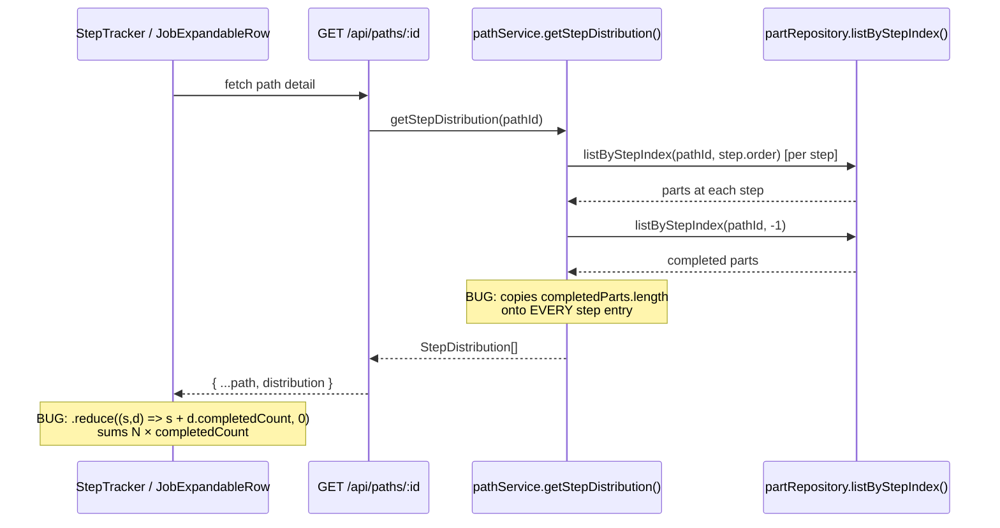

# Design Document: Path "Done" Total Fix

## Overview

Fixes **GitHub Issue #24** — the Path "Done" total incorrectly displays the sum of `completedCount` across all steps in the `StepDistribution[]` array, when it should display the count of distinct `path_id` parts that have completed all path steps (i.e., `currentStepIndex === -1`).

The root cause is two-fold: (1) `pathService.getStepDistribution()` copies the same completed-parts count onto every `StepDistribution` entry, and (2) the frontend components (`StepTracker.vue`, `JobExpandableRow.vue`) sum `completedCount` across all entries via `.reduce()`, multiplying the true count by the number of steps.

## Main Algorithm/Workflow



## Core Interfaces/Types

```typescript
// server/types/computed.ts — StepDistribution (unchanged)
export interface StepDistribution {
  stepId: string
  stepName: string
  stepOrder: number
  location?: string
  partCount: number // parts currently AT this step
  completedCount: number // parts that completed THIS step (per-step, not path-wide)
  isBottleneck: boolean
}

// New: the path detail response will include a top-level completedCount
// returned alongside the distribution array from the API
interface PathDetailResponse extends Path {
  distribution: StepDistribution[]
  completedCount: number // distinct parts with currentStepIndex === -1
}
```

## Key Functions with Formal Specifications

### Function 1: `pathService.getStepDistribution(pathId)`

```typescript
function getStepDistribution(pathId: string): StepDistribution[]
```

**Preconditions:**

- `pathId` references an existing path in the repository
- Path has at least one step

**Postconditions (CURRENT — BUGGY):**

- Every entry has `completedCount` set to the same value: total completed parts for the entire path
- Frontend sums these → `N_steps × actual_completed`

**Postconditions (FIXED):**

- Each entry's `completedCount` is set to 0 (per-step completed count is not meaningful in this context since parts advance through steps sequentially — a completed part has passed through all steps)
- The path-level completed count is returned separately

**Loop Invariants:** N/A

### Function 2: `pathService.getPathCompletedCount(pathId)` (new helper)

```typescript
function getPathCompletedCount(pathId: string): number
```

**Preconditions:**

- `pathId` references an existing path

**Postconditions:**

- Returns the count of non-scrapped parts with `currentStepIndex === -1` for this path
- Equivalent to `repos.parts.listByStepIndex(pathId, -1).length`

**Loop Invariants:** N/A

### Function 3: `GET /api/paths/[id].get.ts` (updated)

```typescript
// Current
return { ...path, distribution }

// Fixed
const completedCount = pathService.getPathCompletedCount(id)
return { ...path, distribution, completedCount }
```

**Preconditions:**

- Valid path ID in route params

**Postconditions:**

- Response includes `completedCount` as a top-level integer field
- `distribution[i].completedCount` is 0 for all entries (no longer carries path-level data)

## Algorithmic Pseudocode

### Current (Buggy) getStepDistribution

```typescript
// In pathService.getStepDistribution():
const completedParts = repos.parts.listByStepIndex(pathId, -1)
const completedCount = completedParts.length
for (const entry of distribution) {
  entry.completedCount = completedCount // BUG: same value on every step
}

// In StepTracker.vue "Done" card:
distribution.reduce((s, d) => s + d.completedCount, 0)
// Result: completedCount × numberOfSteps (e.g., 17 × 7 = 119)
```

### Fixed getStepDistribution + API response

```typescript
// pathService.getStepDistribution() — remove the completed-count loop entirely:
getStepDistribution(pathId: string): StepDistribution[] {
  const path = repos.paths.getById(pathId)
  if (!path) throw new NotFoundError('Path', pathId)

  const distribution: StepDistribution[] = path.steps.map((step) => {
    const partsAtStep = repos.parts.listByStepIndex(pathId, step.order)
    return {
      stepId: step.id,
      stepName: step.name,
      stepOrder: step.order,
      location: step.location,
      partCount: partsAtStep.length,
      completedCount: 0,   // no longer carries path-level data
      isBottleneck: false
    }
  })

  // Bottleneck detection (unchanged)
  let maxCount = 0
  for (const entry of distribution) {
    if (entry.partCount > maxCount) maxCount = entry.partCount
  }
  if (maxCount > 0) {
    for (const entry of distribution) {
      if (entry.partCount === maxCount) entry.isBottleneck = true
    }
  }

  return distribution
},

// New method on pathService:
getPathCompletedCount(pathId: string): number {
  const path = repos.paths.getById(pathId)
  if (!path) throw new NotFoundError('Path', pathId)
  return repos.parts.listByStepIndex(pathId, -1).length
},
```

### Fixed API route

```typescript
// server/api/paths/[id].get.ts
export default defineEventHandler(async (event) => {
  const id = getRouterParam(event, 'id')!
  try {
    const { pathService } = getServices()
    const path = pathService.getPath(id)
    const distribution = pathService.getStepDistribution(id)
    const completedCount = pathService.getPathCompletedCount(id)
    return { ...path, distribution, completedCount }
  } catch (error) {
    if (error instanceof NotFoundError)
      throw createError({ statusCode: 404, message: error.message })
    throw createError({ statusCode: 500, message: 'Internal server error' })
  }
})
```

### Fixed frontend components

```typescript
// StepTracker.vue — "Done" card uses path-level completedCount prop
const props = defineProps<{
  path: Path
  distribution: StepDistribution[]
  completedCount: number // NEW: path-level completed count
  users?: ShopUser[]
}>()

// Template: replace distribution.reduce(...) with completedCount
// {{ completedCount }}

// JobExpandableRow.vue — ProgressBar :completed uses path-level completedCount
// Store completedCount alongside distribution when fetching path detail
const pathCompletedCounts = ref<Record<string, number>>({})

// When fetching:
const detail = await $fetch<PathDetailResponse>(`/api/paths/${pathId}`)
pathDistributions.value[pathId] = detail.distribution ?? []
pathCompletedCounts.value[pathId] = detail.completedCount ?? 0

// ProgressBar :completed uses pathCompletedCounts[path.id]
```

## Example Usage

```typescript
// Given: a path with 7 steps and 17 parts that completed all steps
// Before fix:
//   distribution = 7 entries, each with completedCount = 17
//   StepTracker "Done" card: 7 × 17 = 119 ← WRONG
//
// After fix:
//   distribution = 7 entries, each with completedCount = 0
//   API response: { ...path, distribution, completedCount: 17 }
//   StepTracker "Done" card: 17 ← CORRECT

// Service-level usage:
const distribution = pathService.getStepDistribution(pathId)
const completedCount = pathService.getPathCompletedCount(pathId)
// completedCount === 17 (parts with currentStepIndex === -1)

// Per-step completedCount in each distribution entry:
// distribution[0].completedCount === 0
// distribution[6].completedCount === 0
// (per-step completed tracking is not meaningful for sequential advancement)
```

## Correctness Properties

```typescript
// CP-DONE-1: Path completed count equals parts with currentStepIndex === -1
// ∀ pathId: getPathCompletedCount(pathId) ===
//   parts.filter(p => p.pathId === pathId && p.currentStepIndex === -1 && p.status !== 'scrapped').length

// CP-DONE-2: Distribution completedCount entries are always 0
// ∀ pathId: getStepDistribution(pathId).every(d => d.completedCount === 0)

// CP-DONE-3: "Done" card value matches path-level completedCount, not sum of step completedCounts
// ∀ path: doneCardValue === pathCompletedCount (not distribution.reduce(sum, completedCount))

// CP-DONE-4: ProgressBar completed prop matches path-level completedCount
// ∀ path in JobExpandableRow: progressBar.completed === pathCompletedCount

// CP-DONE-5: Existing per-step "done" labels in StepTracker still show per-step completed count
// (These show step.completedCount which is now 0 — acceptable since per-step completion
//  is not independently tracked in the current data model. The "X done" label per step
//  can be removed or repurposed in a follow-up.)
```

## Files to Modify

| File                                         | Change                                                                                         |
| -------------------------------------------- | ---------------------------------------------------------------------------------------------- |
| `server/services/pathService.ts`             | Remove completed-count loop from `getStepDistribution()`; add `getPathCompletedCount()` method |
| `server/api/paths/[id].get.ts`               | Include `completedCount` in response                                                           |
| `app/components/StepTracker.vue`             | Add `completedCount` prop; use it in "Done" card instead of `.reduce()`                        |
| `app/components/JobExpandableRow.vue`        | Store `completedCount` from API; pass to ProgressBar `:completed`                              |
| `tests/unit/services/pathService.test.ts`    | Update existing `getStepDistribution` tests; add `getPathCompletedCount` tests                 |
| `tests/properties/` (new)                    | Property test: Done count === parts with stepIndex -1                                          |
| `tests/integration/progressTracking.test.ts` | Verify end-to-end Done count correctness                                                       |
