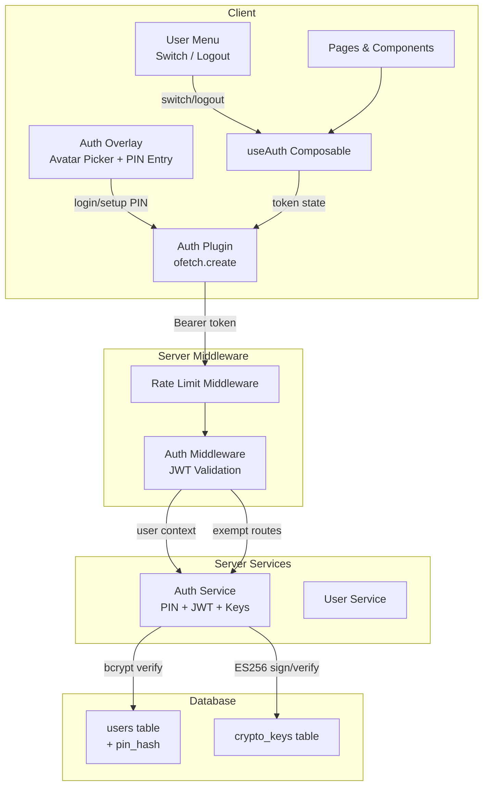
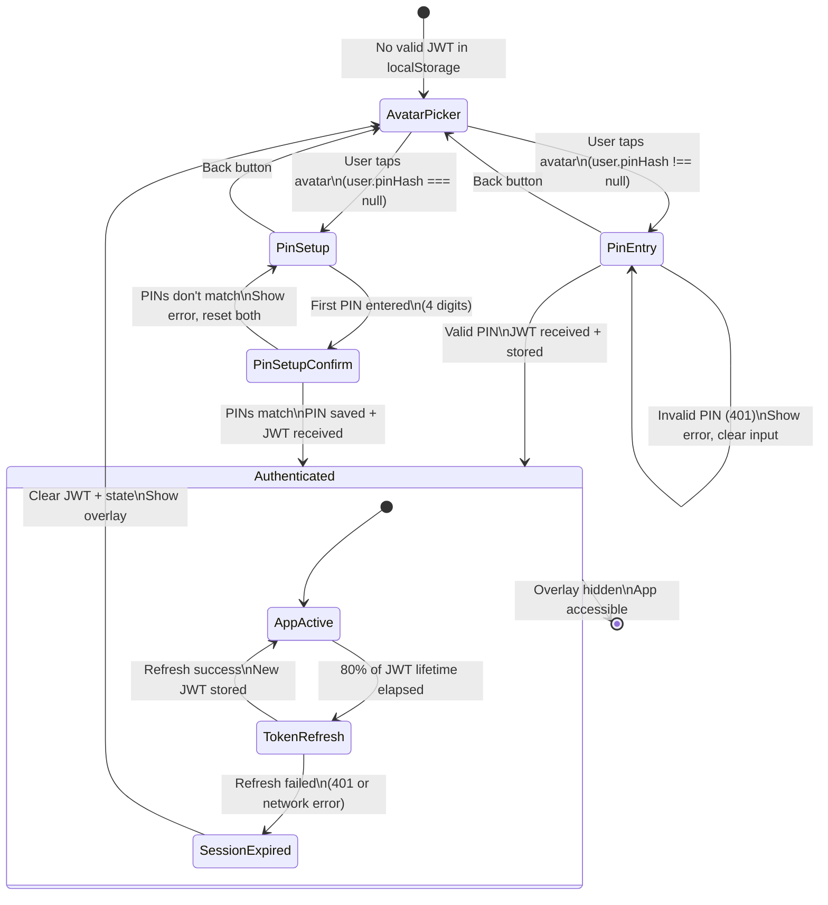
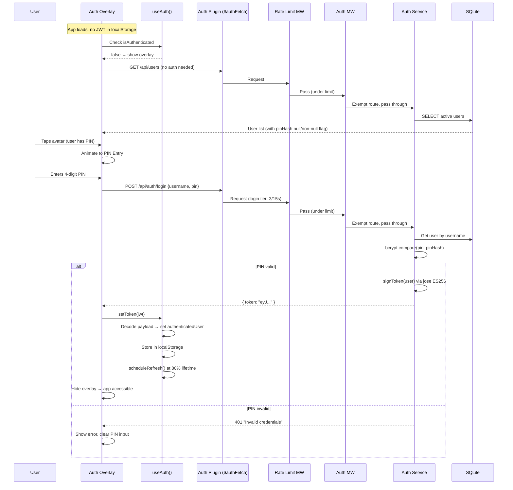
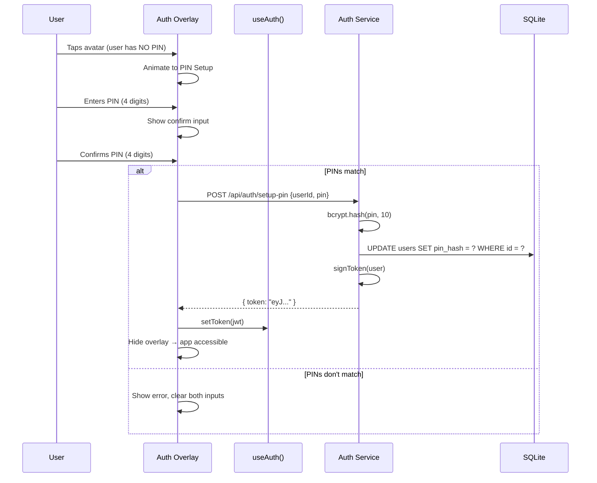
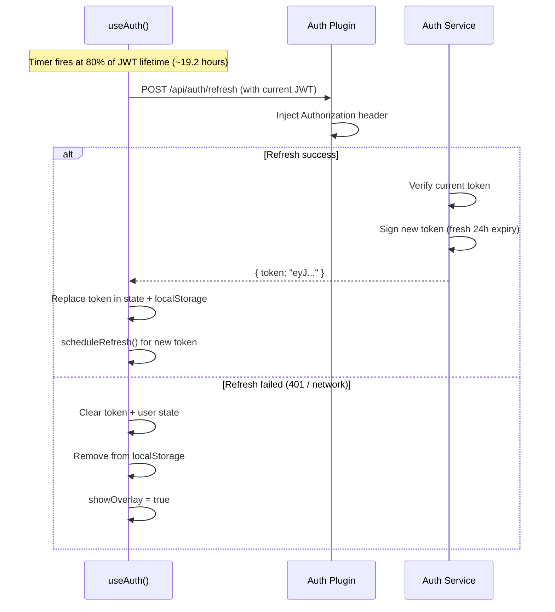
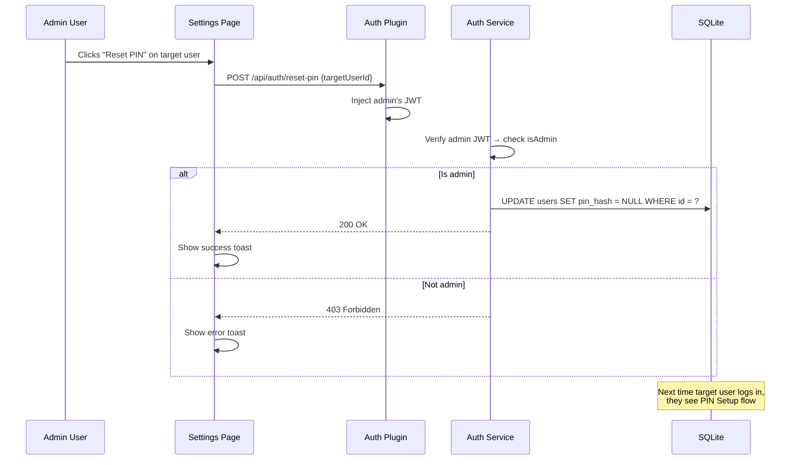
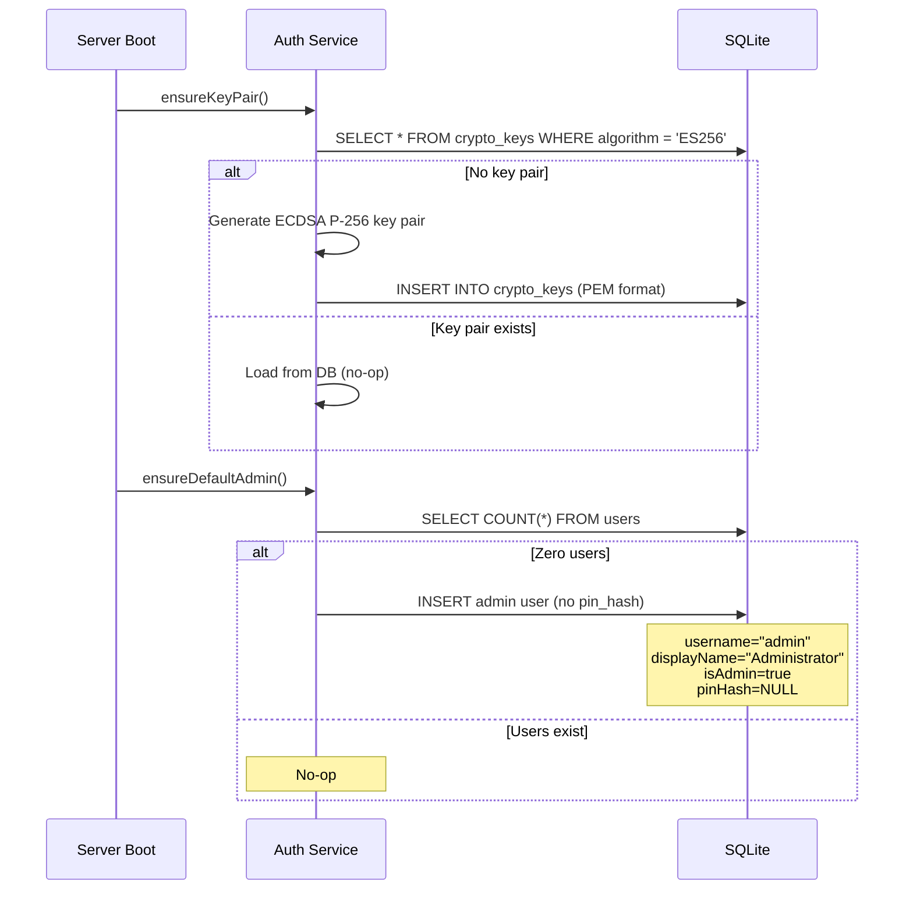

# Design Document: PIN Auth + JWT

## Overview

This feature replaces Shop Planr's unauthenticated user-selector dropdown with a secure PIN-based authentication system backed by ES256-signed JWTs. The system spans the full stack:

- **Database**: Migration 012 adds `pin_hash` column to `users` and a new `crypto_keys` table for the ES256 key pair.
- **Server**: A new `authService` handles PIN hashing (bcrypt), JWT signing/verification (jose), key pair lifecycle, and admin PIN reset. Two Nitro server middlewares enforce JWT validation and multi-tier rate limiting (via `rate-limiter-flexible`) on all API requests.
- **Client**: A `useAuth()` composable replaces `useUsers()` as the single source of truth for authenticated identity. An `ofetch`-based plugin auto-injects the Bearer token. A fullscreen Auth Overlay with avatar picker + PIN entry gates all access when no valid session exists. A header User Menu replaces the UserSelector dropdown.

### Key Design Decisions

| Decision | Rationale |
|----------|-----------|
| ES256 (ECDSA P-256) | Asymmetric — private key never leaves server; public key can verify without signing capability |
| `jose` library | Modern, standards-compliant, supports Web Crypto API, well-maintained |
| `bcryptjs` for PIN hashing | Pure JS (no native compilation), works in Nitro runtime, battle-tested |
| Key pair in DB (not env vars) | Zero-config deployment — auto-generated on first boot |
| `rate-limiter-flexible` for rate limiting | Battle-tested library (15k+ GitHub stars), `RateLimiterMemory` for in-memory sliding windows, multi-limiter support via multiple instances, built-in `msBeforeNext` for Retry-After headers, zero production dependencies |
| 24h JWT expiry + 80% refresh | Long enough for full shifts, silent refresh prevents interruption |
| `useAuth()` replaces `useUsers()` | Single source of truth — no split identity state |

## Architecture



### Request Flow

1. Client makes API request via `$authFetch` (ofetch instance from Auth Plugin)
2. Auth Plugin injects `Authorization: Bearer <token>` header
3. Rate Limit Middleware checks sliding-window counters per IP — returns 429 if exceeded
4. Auth Middleware extracts and verifies JWT — attaches user context to event or returns 401
5. API route handler executes with authenticated user available via `event.context.auth`

### Middleware Order

Nitro middleware files execute in alphabetical order. We use numeric prefixes:
- `server/middleware/01.rateLimit.ts` — rate limiting (runs first, before auth)
- `server/middleware/02.auth.ts` — JWT validation (runs second)

## Components and Interfaces

### Server Components

#### AuthService (`server/services/authService.ts`)

Factory function following existing pattern:

```typescript
export function createAuthService(repos: {
  users: UserRepository
  cryptoKeys: CryptoKeyRepository
}) {
  return {
    // Key management
    ensureKeyPair(): Promise<void>           // Generate or load ES256 key pair
    getPublicKey(): Promise<KeyLike>         // For JWT verification
    getPrivateKey(): Promise<KeyLike>        // For JWT signing

    // PIN operations
    setupPin(userId: string, pin: string): Promise<string>  // Hash + store, return JWT
    login(username: string, pin: string): Promise<string>    // Verify + return JWT
    resetPin(adminUserId: string, targetUserId: string): void  // Admin: set pin_hash=NULL

    // JWT operations
    signToken(user: ShopUser): Promise<string>               // Create signed JWT
    verifyToken(token: string): Promise<JwtPayload>          // Verify + decode
    refreshToken(token: string): Promise<string>             // Verify existing, issue new

    // Bootstrap
    ensureDefaultAdmin(): void               // Create admin user if users table empty
  }
}
export type AuthService = ReturnType<typeof createAuthService>
```

#### CryptoKeyRepository (`server/repositories/interfaces/cryptoKeyRepository.ts`)

```typescript
export interface CryptoKeyRow {
  id: string
  algorithm: string
  publicKey: string
  privateKey: string
  createdAt: string
}

export interface CryptoKeyRepository {
  getByAlgorithm(algorithm: string): CryptoKeyRow | null
  create(row: CryptoKeyRow): CryptoKeyRow
}
```

#### Auth Middleware (`server/middleware/02.auth.ts`)

- Reads `Authorization: Bearer <token>` from request headers
- Exempt routes: `POST /api/auth/login`, `POST /api/auth/setup-pin`, `GET /api/users`, `POST /api/auth/refresh`
- On valid token: sets `event.context.auth = { user: JwtPayload }`
- On invalid/missing/expired: throws 401 via `createError()`

#### Rate Limit Middleware (`server/middleware/01.rateLimit.ts`)

- Uses `rate-limiter-flexible` library with `RateLimiterMemory` backend
- Creates 9 `RateLimiterMemory` instances (3 tiers × 3 windows):
  - **Login** (`/api/auth/login`, `/api/auth/setup-pin`):
    - `loginLimiter15s`: points=3, duration=15
    - `loginLimiter1m`: points=10, duration=60
    - `loginLimiter1h`: points=30, duration=3600
  - **Unauthenticated**:
    - `unauthLimiter15s`: points=10, duration=15
    - `unauthLimiter1m`: points=30, duration=60
    - `unauthLimiter1h`: points=300, duration=3600
  - **Authenticated**:
    - `authLimiter15s`: points=60, duration=15
    - `authLimiter1m`: points=300, duration=60
    - `authLimiter1h`: points=10000, duration=3600
- On each request, determines tier from route + auth status, then calls `consume(clientIP)` on all 3 window limiters for that tier
- If any limiter rejects (throws `RateLimiterRes`), returns 429 with `Retry-After` header computed from `msBeforeNext / 1000`
- `RateLimiterMemory` handles its own cleanup — no manual timer needed

### Client Components

#### useAuth Composable (`app/composables/useAuth.ts`)

```typescript
export function useAuth() {
  // Reactive state
  const authenticatedUser: Ref<ShopUser | null>
  const isAuthenticated: ComputedRef<boolean>
  const isAdmin: ComputedRef<boolean>
  const token: Ref<string | null>
  const users: Ref<ShopUser[]>
  const showOverlay: Ref<boolean>

  // Actions
  async function login(username: string, pin: string): Promise<void>
  async function setupPin(userId: string, pin: string): Promise<void>
  function logout(): void
  function switchUser(): void
  async function fetchUsers(): Promise<void>

  // Internal
  function scheduleRefresh(): void          // 80% of token lifetime
  function restoreSession(): void           // Check localStorage on load
  function decodeToken(jwt: string): JwtPayload
}
```

#### Auth Plugin (`app/plugins/auth.ts`)

```typescript
export default defineNuxtPlugin(() => {
  const { token } = useAuth()

  const authFetch = ofetch.create({
    onRequest({ options }) {
      if (token.value) {
        options.headers = {
          ...options.headers,
          Authorization: `Bearer ${token.value}`,
        }
      }
    },
  })

  return { provide: { authFetch } }
})
```

#### Auth Overlay (`app/components/AuthOverlay.vue`)

- Fullscreen overlay with dimmed background, blocks app access
- Two sub-states: Avatar Picker → PIN Entry / PIN Setup
- Avatar Picker: grid of circular avatars with generated initials + deterministic colors
- PIN Entry: 4-digit numeric input with masked display
- PIN Setup: enter + confirm flow with mismatch error handling
- Back button to return from PIN screen to avatar picker

#### User Menu (`app/components/UserMenu.vue`)

- Replaces `UserSelector.vue` in `default.vue` layout header
- Shows avatar circle + display name
- Dropdown: "Switch User" and "Log Out" options
- Both actions clear JWT and show Auth Overlay

### API Routes

| Route | Method | Auth Required | Purpose |
|-------|--------|---------------|---------|
| `/api/auth/login` | POST | No | Validate PIN, return JWT |
| `/api/auth/setup-pin` | POST | No | Set initial PIN, return JWT |
| `/api/auth/refresh` | POST | Yes | Refresh JWT before expiry |
| `/api/auth/reset-pin` | POST | Yes (admin) | Admin resets another user's PIN |
| `/api/users` | GET | No | List active users (for avatar picker) |

### JWT Payload Structure

```typescript
interface JwtPayload {
  // Standard claims
  iat: number        // Issued at (Unix timestamp)
  exp: number        // Expiration (Unix timestamp, iat + 24h)

  // ShopUser fields
  sub: string        // user.id
  username: string
  displayName: string
  isAdmin: boolean
  department?: string
  active: boolean
  createdAt: string
}
```

## Data Models

### Migration 012: PIN Auth Schema

```sql
-- 012_pin_auth.sql

-- Add pin_hash column to users (nullable for gradual PIN setup)
ALTER TABLE users ADD COLUMN pin_hash TEXT;

-- Crypto key storage for ES256 JWT signing
CREATE TABLE crypto_keys (
  id TEXT PRIMARY KEY,
  algorithm TEXT NOT NULL,
  public_key TEXT NOT NULL,
  private_key TEXT NOT NULL,
  created_at TEXT NOT NULL
);
```

### Updated Domain Types

```typescript
// Addition to server/types/domain.ts
export interface ShopUser {
  // ... existing fields ...
  pinHash?: string | null  // bcrypt hash of 4-digit PIN; null = needs setup
}

// New type
export interface CryptoKey {
  id: string
  algorithm: string
  publicKey: string
  privateKey: string
  createdAt: string
}
```

### AuthenticationError Class

```typescript
// Addition to server/utils/errors.ts
export class AuthenticationError extends Error {
  constructor(message: string) {
    super(message)
    this.name = 'AuthenticationError'
  }
}
```

Added to `ERROR_STATUS_MAP` in `server/utils/httpError.ts`:
```typescript
{ errorClass: AuthenticationError, statusCode: 401 }
```

### Rate Limit Configuration (`rate-limiter-flexible`)

```typescript
import { RateLimiterMemory } from 'rate-limiter-flexible'

// Three tiers × three windows = 9 limiter instances
// Login tier (tightest — brute-force protection)
const loginLimiter15s = new RateLimiterMemory({ points: 3, duration: 15, keyPrefix: 'login_15s' })
const loginLimiter1m = new RateLimiterMemory({ points: 10, duration: 60, keyPrefix: 'login_1m' })
const loginLimiter1h = new RateLimiterMemory({ points: 30, duration: 3600, keyPrefix: 'login_1h' })

// Unauthenticated tier
const unauthLimiter15s = new RateLimiterMemory({ points: 10, duration: 15, keyPrefix: 'unauth_15s' })
const unauthLimiter1m = new RateLimiterMemory({ points: 30, duration: 60, keyPrefix: 'unauth_1m' })
const unauthLimiter1h = new RateLimiterMemory({ points: 300, duration: 3600, keyPrefix: 'unauth_1h' })

// Authenticated tier (highest — supports bulk part advancement)
const authLimiter15s = new RateLimiterMemory({ points: 60, duration: 15, keyPrefix: 'auth_15s' })
const authLimiter1m = new RateLimiterMemory({ points: 300, duration: 60, keyPrefix: 'auth_1m' })
const authLimiter1h = new RateLimiterMemory({ points: 10000, duration: 3600, keyPrefix: 'auth_1h' })

// Tier selection: returns array of 3 limiters for the request
function getLimiters(path: string, isAuthenticated: boolean): RateLimiterMemory[] {
  if (path.startsWith('/api/auth/login') || path.startsWith('/api/auth/setup-pin')) {
    return [loginLimiter15s, loginLimiter1m, loginLimiter1h]
  }
  if (isAuthenticated) {
    return [authLimiter15s, authLimiter1m, authLimiter1h]
  }
  return [unauthLimiter15s, unauthLimiter1m, unauthLimiter1h]
}

// In middleware: consume from all 3 limiters, catch first rejection
async function checkRateLimit(clientIP: string, limiters: RateLimiterMemory[]): Promise<void> {
  await Promise.all(limiters.map(limiter => limiter.consume(clientIP)))
  // If any limiter throws, the rejection includes msBeforeNext for Retry-After
}
```

### RepositorySet Extension

```typescript
// Added to RepositorySet interface
export interface RepositorySet {
  // ... existing repos ...
  cryptoKeys: CryptoKeyRepository
}
```

### Avatar Color Generation (Pure Function)

```typescript
// Deterministic color from username — same input always produces same color
function getAvatarColor(username: string): string {
  let hash = 0
  for (const char of username) {
    hash = char.charCodeAt(0) + ((hash << 5) - hash)
  }
  const hue = Math.abs(hash) % 360
  return `hsl(${hue}, 65%, 55%)`
}

function getInitials(displayName: string): string {
  return displayName
    .split(' ')
    .map(w => w[0])
    .join('')
    .toUpperCase()
    .slice(0, 2)
}
```


## UI Flows and State Diagrams

### Auth Overlay State Machine

The Auth Overlay component manages a state machine with four primary screens. All transitions are driven by user interaction or API responses.



### Screen Layouts

#### Avatar Picker Screen

```
┌─────────────────────────────────────────────────┐
│                                                 │
│              ╔═══════════════════╗              │
│              ║    Shop Planr     ║              │
│              ║   Select a user   ║              │
│              ╚═══════════════════╝              │
│                                                 │
│    ┌──────┐   ┌──────┐   ┌──────┐              │
│    │  JD  │   │  AS  │   │  MK  │              │
│    │(blue)│   │(orng)│   │(grn) │              │
│    └──────┘   └──────┘   └──────┘              │
│     John       Alice      Mike                  │
│                                                 │
│    ┌──────┐   ┌──────┐                          │
│    │  SL  │   │  RB  │                          │
│    │(purp)│   │(teal)│                          │
│    └──────┘   └──────┘                          │
│     Sarah      Rob                              │
│                                                 │
└─────────────────────────────────────────────────┘
  Background: dimmed app content (pointer-events: none)
```

- Avatar circles: 64px, generated initials, deterministic HSL color from username
- First name only (first word of displayName) below each avatar
- Grid layout: responsive wrap, centered
- Only active users shown (fetched from `GET /api/users`)

#### PIN Entry Screen

```
┌─────────────────────────────────────────────────┐
│  ← Back                                         │
│                                                 │
│              ┌──────────┐                       │
│              │    JD    │                       │
│              │  (blue)  │                       │
│              └──────────┘                       │
│              John Doe                           │
│                                                 │
│           Enter your PIN                        │
│                                                 │
│           ┌──┐ ┌──┐ ┌──┐ ┌──┐                  │
│           │ ● │ │ ● │ │ _ │ │ _ │                  │
│           └──┘ └──┘ └──┘ └──┘                  │
│                                                 │
│           ┌─────────────────┐                   │
│           │  Invalid PIN    │  ← error toast    │
│           └─────────────────┘                   │
│                                                 │
└─────────────────────────────────────────────────┘
```

- Animated transition from avatar picker (avatar scales up + moves to center)
- 4 input boxes, masked (dots), auto-advance on digit entry
- Auto-submit when 4th digit entered
- Error message clears on next input
- Back button returns to avatar picker with reverse animation

#### PIN Setup Screen

```
┌─────────────────────────────────────────────────┐
│  ← Back                                         │
│                                                 │
│              ┌──────────┐                       │
│              │    AD    │                       │
│              │  (viol)  │                       │
│              └──────────┘                       │
│              Administrator                      │
│                                                 │
│           Create your PIN                       │
│                                                 │
│           ┌──┐ ┌──┐ ┌──┐ ┌──┐                  │
│           │ _ │ │ _ │ │ _ │ │ _ │                  │
│           └──┘ └──┘ └──┘ └──┘                  │
│                                                 │
│     ─ ─ ─ then ─ ─ ─                           │
│                                                 │
│           Confirm your PIN                      │
│                                                 │
│           ┌──┐ ┌──┐ ┌──┐ ┌──┐                  │
│           │ _ │ │ _ │ │ _ │ │ _ │                  │
│           └──┘ └──┘ └──┘ └──┘                  │
│                                                 │
│           ┌─────────────────┐                   │
│           │ PINs don't match│  ← error toast    │
│           └─────────────────┘                   │
│                                                 │
└─────────────────────────────────────────────────┘
```

- Two-phase: enter PIN → confirm PIN
- First set of inputs auto-advances to confirm set after 4 digits
- If mismatch: error shown, both sets cleared, focus returns to first input
- If match: `POST /api/auth/setup-pin` → JWT returned → authenticated

#### Header User Menu (Authenticated State)

```
┌──────────────────────────────────────────────────────────┐
│  [Barcode Input]                    🌙  ┌──────────────┐│
│                                         │ (JD) John Doe ▾││
│                                         └──────┬───────┘│
│                                                │         │
│                                         ┌──────┴───────┐│
│                                         │ 🔄 Switch User ││
│                                         │ 🚪 Log Out     ││
│                                         └──────────────┘│
└──────────────────────────────────────────────────────────┘
```

- Replaces current `UserSelector` component in `default.vue` header
- Avatar circle (small, 24px) + display name + chevron
- Dropdown via `UDropdownMenu` with two items
- Both "Switch User" and "Log Out" call the same flow: clear JWT → show overlay

### Data Flow: Login Sequence



### Data Flow: PIN Setup Sequence



### Data Flow: Token Refresh



### Data Flow: Admin PIN Reset



### Data Flow: First Boot (Empty DB)



### Component Hierarchy

```
app.vue
└── NuxtLayout (default.vue)
    ├── AuthOverlay.vue                    ← NEW: fullscreen gate
    │   ├── AvatarPicker.vue              ← NEW: user grid
    │   │   └── UserAvatar.vue            ← NEW: initials circle (reusable)
    │   ├── PinEntry.vue                  ← NEW: 4-digit masked input
    │   └── PinSetup.vue                  ← NEW: enter + confirm flow
    ├── UDashboardNavbar
    │   └── UserMenu.vue                  ← NEW: replaces UserSelector.vue
    │       └── UserAvatar.vue            ← reused from overlay
    └── <slot /> (page content)
```

- `UserAvatar.vue` is a shared component used in both the overlay and the header menu
- `AuthOverlay.vue` manages the state machine and renders the appropriate sub-component
- The overlay is rendered inside `default.vue` layout, above the dashboard content
- When `showOverlay` is true, the overlay covers everything with `position: fixed; inset: 0; z-index: 50`

## Correctness Properties

*A property is a characteristic or behavior that should hold true across all valid executions of a system — essentially, a formal statement about what the system should do. Properties serve as the bridge between human-readable specifications and machine-verifiable correctness guarantees.*

### Property 1: PIN bcrypt round-trip

*For any* valid 4-digit PIN (0000–9999), hashing it with bcrypt and then verifying the original PIN against the stored hash should return true, and verifying any different PIN should return false.

**Validates: Requirements 3.3, 4.2**

### Property 2: JWT structure completeness

*For any* ShopUser, signing a JWT should produce a token where: (a) the JWT header specifies `alg: "ES256"`, (b) the payload contains `sub`, `username`, `displayName`, `isAdmin`, `active`, `createdAt` matching the user, (c) `exp - iat` equals 86400 (24 hours), and (d) both `iat` and `exp` claims are present as numbers.

**Validates: Requirements 5.1, 5.2, 5.3, 5.4**

### Property 3: PIN validation rejects non-4-digit input

*For any* string that is not exactly 4 decimal digits (e.g., empty strings, strings with letters, strings shorter or longer than 4 characters, strings with special characters), the PIN validation function should reject it. *For any* string that is exactly 4 decimal digits, it should accept it.

**Validates: Requirements 3.6, 4.5**

### Property 4: Invalid PIN produces authentication error

*For any* user with a stored PIN hash and *any* PIN that differs from the original, calling `login()` should throw an `AuthenticationError` (not reveal whether the username or PIN was wrong).

**Validates: Requirements 4.4**

### Property 5: Valid JWT attaches user context

*For any* valid (non-expired) JWT signed by the auth service, the auth middleware should successfully decode it and produce a user context object whose `sub`, `username`, `isAdmin`, and `displayName` fields match the original token payload.

**Validates: Requirements 6.1, 6.2**

### Property 6: Missing or invalid token returns 401 on protected routes

*For any* protected API route and *any* request that either lacks an Authorization header, has a malformed token, or has an expired token, the auth middleware should return a 401 status.

**Validates: Requirements 6.3, 6.5**

### Property 7: Token refresh produces a new valid token

*For any* valid (non-expired) JWT, calling the refresh endpoint should return a new JWT that: (a) is verifiable with the same public key, (b) has a later `iat` than the original, and (c) has `exp - iat` equal to 86400.

**Validates: Requirements 7.1, 7.4**

### Property 8: Logout and switch clear token and state

*For any* authenticated session (with a token in localStorage and a non-null authenticatedUser), calling either `logout()` or `switchUser()` should result in: (a) localStorage no longer containing the token key, (b) `authenticatedUser` being null, and (c) `isAuthenticated` being false.

**Validates: Requirements 8.3, 8.4, 11.3, 11.4**

### Property 9: Deterministic avatar color and initials

*For any* username string, calling `getAvatarColor(username)` twice should return the same HSL color string. *For any* display name, `getInitials(displayName)` should return the same 1–2 character uppercase string. Two different usernames may produce different colors (not guaranteed, but the function is deterministic for the same input).

**Validates: Requirements 10.2**

### Property 10: Rate limit exceeded returns 429

*For any* client IP and rate limit tier, if the number of `consume()` calls on a `RateLimiterMemory` instance within its configured duration exceeds the configured points, the next `consume()` call should reject with a `RateLimiterRes` containing a positive `msBeforeNext` value, and the middleware should return a 429 status code with a `Retry-After` header.

**Validates: Requirements 12.1, 12.5**

### Property 11: Admin PIN reset sets pin_hash to NULL

*For any* admin user and *any* target user (with or without an existing PIN hash), calling `resetPin(adminId, targetId)` should result in the target user's `pin_hash` being NULL in the database.

**Validates: Requirements 13.1**

### Property 12: Non-admin PIN reset throws ForbiddenError

*For any* non-admin user attempting to reset another user's PIN, the auth service should throw a `ForbiddenError` and the target user's `pin_hash` should remain unchanged.

**Validates: Requirements 13.3, 13.4**

### Property 13: ensureDefaultAdmin is idempotent when users exist

*For any* non-empty users table (containing 1 or more users), calling `ensureDefaultAdmin()` should not increase the user count — the function should be a no-op.

**Validates: Requirements 14.3**

### Property 14: ensureKeyPair is idempotent when key exists

*For any* existing ES256 key pair in the crypto_keys table, calling `ensureKeyPair()` should not modify the stored public or private key values — the keys should remain byte-identical.

**Validates: Requirements 2.2**

### Property 15: Migration preserves existing users with pin_hash NULL

*For any* set of pre-existing users in the database before migration 012 is applied, all users should still exist after migration with identical field values, and every user's `pin_hash` should be NULL.

**Validates: Requirements 1.3**

## Error Handling

### Error Classes

| Error | HTTP Status | When |
|-------|-------------|------|
| `AuthenticationError` | 401 | Invalid PIN, expired/invalid JWT, missing token on protected route |
| `ForbiddenError` | 403 | Non-admin attempts PIN reset |
| `ValidationError` | 400 | Invalid PIN format (not 4 digits), missing required fields |
| `NotFoundError` | 404 | User ID not found during login/setup/reset |

### Auth Middleware Error Responses

- Missing `Authorization` header on protected route → 401 `{ statusCode: 401, statusMessage: "Unauthorized" }`
- Malformed Bearer token → 401
- Expired JWT → 401
- Invalid JWT signature → 401

### Rate Limit Error Response

- Exceeded rate limit → 429 `{ statusCode: 429, statusMessage: "Too Many Requests" }` with `Retry-After: <seconds>` header

### Client-Side Error Handling

- Login failure (401) → Show error message on PIN entry screen, allow retry
- PIN setup mismatch → Show inline error, allow re-entry
- Token refresh failure → Clear session, show Auth Overlay
- Network error during login → Show generic error toast
- Rate limited (429) → Show "Too many attempts, please wait" message

### Security Considerations

- PIN hashes use bcrypt with default cost factor (10 rounds)
- JWT private key never leaves the server
- Failed login responses are generic ("Invalid credentials") — no username/PIN enumeration
- Rate limiting on login endpoint prevents brute-force (only 10,000 possible PINs with 4 digits)
- Expired tokens are rejected immediately — no grace period

## Testing Strategy

### Property-Based Testing

Library: `fast-check` (already in devDependencies)
Configuration: minimum 100 iterations per property test
Tag format: `Feature: pin-auth-jwt, Property {N}: {title}`

Each correctness property (1–15) maps to a single property-based test. Tests use real SQLite databases via `createTestContext()` for server-side properties, and mock/stub patterns for client-side composable properties.

**Server-side property tests** (Properties 1–7, 10–15):
- Use `createTestContext()` with temp SQLite DB
- Exercise `authService` methods directly
- Verify JWT structure via `jose` decode
- Verify bcrypt hashes via `bcryptjs`
- Rate limiter tested with `RateLimiterMemory` instances directly (consume calls + rejection assertions)

**Client-side property tests** (Properties 8, 9):
- Property 8 (logout/switch): Test composable state transitions with mocked localStorage
- Property 9 (avatar color/initials): Pure function tests — no mocking needed

### Unit Tests

Unit tests complement property tests for specific examples and edge cases:

- **Auth service**: Default admin bootstrap on empty DB, PIN setup happy path, login happy path, refresh happy path
- **Auth middleware**: Exempt routes pass through, protected routes require token, expired token rejection
- **Rate limiter**: Specific limit values for each tier (auth/unauth/login), `RateLimiterMemory` consume/reject behavior, Retry-After header value from `msBeforeNext`
- **PIN validation**: Empty string, letters, 3-digit, 5-digit, special chars, leading zeros preserved
- **Avatar helpers**: Known username → known color, single-word name → single initial, empty string edge case
- **Migration 012**: Schema verification (columns exist, types correct, crypto_keys table structure)

### Integration Tests

- Full login flow: create user → setup PIN → login → verify JWT → access protected route
- Token refresh flow: login → wait → refresh → verify new token works
- Admin PIN reset flow: admin resets user PIN → user goes through setup flow again
- First boot flow: empty DB → default admin created → admin sets PIN → admin logs in
- Rate limit integration: exceed login limit → get 429 → wait → retry succeeds

### Test File Organization

```
tests/
  properties/
    pinAuthJwt.property.test.ts          → Properties 1-7, 10-15 (server-side)
    pinAuthComposable.property.test.ts   → Property 8 (logout/switch state)
    avatarHelpers.property.test.ts       → Property 9 (deterministic color/initials)
  unit/
    services/
      authService.test.ts                → Auth service unit tests
    utils/
      rateLimiter.test.ts                → Rate limiter unit tests
      pinValidation.test.ts              → PIN format validation
      avatarHelpers.test.ts              → Avatar color + initials helpers
    repositories/sqlite/
      migrations.test.ts                 → Extended with migration 012 checks
  integration/
    authFlow.test.ts                     → End-to-end auth lifecycle tests
```
