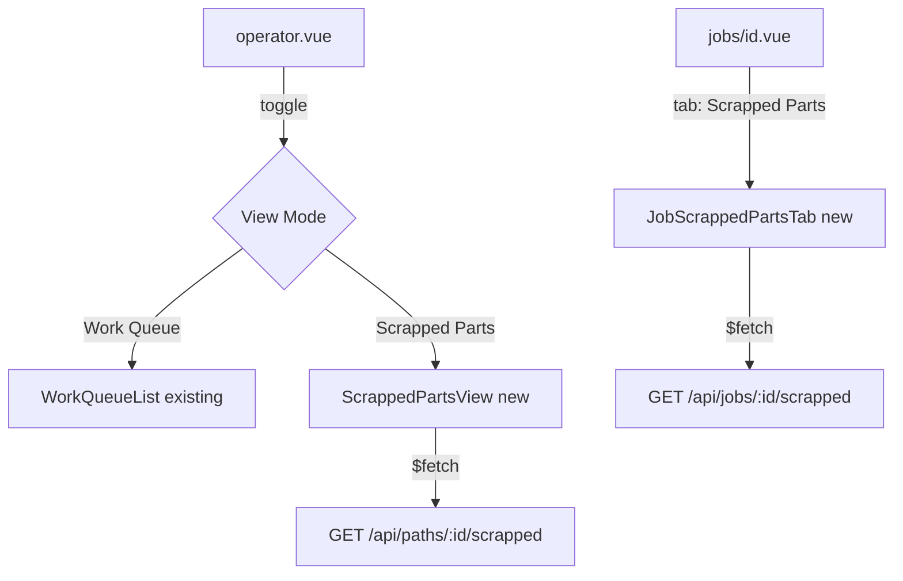

# Design: Scrapped Parts by Step

## Overview

This feature adds visibility into scrapped serial numbers at two levels: step-level (within a path) and job-level (across all paths in a job). It extends the existing `listByStepIndex` repository method with an optional `status` filter parameter, adds two new API endpoints (`GET /api/paths/:id/scrapped` and `GET /api/jobs/:id/scrapped`), and provides frontend UI for both the operator view and job detail page.

The design builds on the `scrapped-sn-operator-view` bugfix which added `AND status != 'scrapped'` to `listByStepIndex`. This feature generalizes that filter into an explicit parameter while preserving the bugfix's default behavior. The key insight is that scrapped serials keep their original `currentStepIndex` but have a `scrapStepId` field pointing to the step where they were scrapped — so querying scrapped serials by step requires matching on `scrapStepId` rather than `currentStepIndex`.

### Design Decisions

1. **Optional status parameter with backward-compatible default**: `listByStepIndex` gets an optional third parameter `status?: 'in_progress' | 'scrapped' | 'all'`. When omitted, it defaults to excluding scrapped serials (matching the bugfix behavior). This means zero changes to existing callers.

2. **`scrapStepId` matching for scrapped queries**: When `status = 'scrapped'`, the query matches on `scrap_step_id` (the step where the serial was scrapped) rather than `current_step_index`. This is necessary because scrapped serials retain their original `currentStepIndex` — the `scrapStepId` is the authoritative record of where the scrap occurred.

3. **Job-level filtering in the service layer**: The job-level endpoint reuses `listByJobId` (which returns all serials) and filters/groups in the service layer. This avoids adding a new repository method and keeps business logic (grouping by path + scrapStepId, resolving step metadata) in the service layer per the architecture rules.

4. **New computed types, not new domain types**: `ScrappedSerialGroup` and `JobScrappedResponse` are computed view types in `server/types/computed.ts`, not persisted entities. They represent derived data for display.

5. **Nuxt file-based routing for API endpoints**: `server/api/paths/[id]/scrapped.get.ts` and `server/api/jobs/[id]/scrapped.get.ts` follow the existing Nuxt convention for nested routes.

## Architecture

```
┌─────────────────────────────────────────────────────────────────────┐
│ Frontend                                                            │
│                                                                     │
│  operator.vue ──► useWorkQueue (existing, unchanged)                │
│       │                                                             │
│       └──► useScrappedParts (new composable)                        │
│                  │                                                  │
│  jobs/[id].vue ──► useScrappedParts (shared composable)             │
│                  │                                                  │
├──────────────────┼──────────────────────────────────────────────────┤
│ API Routes       │                                                  │
│                  ▼                                                  │
│  GET /api/paths/:id/scrapped ──► serialService.getScrappedByPath()  │
│  GET /api/jobs/:id/scrapped  ──► serialService.getScrappedByJob()   │
│                                                                     │
├─────────────────────────────────────────────────────────────────────┤
│ Service Layer                                                       │
│                                                                     │
│  serialService.getScrappedByPath(pathId)                            │
│    → pathService.getPath(pathId) for step metadata                  │
│    → repos.serials.listByStepIndex(pathId, stepOrder, 'scrapped')   │
│      per step → group into ScrappedSerialGroup[]                    │
│                                                                     │
│  serialService.getScrappedByJob(jobId)                              │
│    → repos.serials.listByJobId(jobId) → filter status='scrapped'    │
│    → pathService.listPathsByJob(jobId) for step metadata            │
│    → group by pathId + scrapStepId → JobScrappedResponse            │
│                                                                     │
│  serialService.listSerialsByStepIndex(pathId, stepIndex, status?)   │
│    → repos.serials.listByStepIndex(pathId, stepIndex, status)       │
│                                                                     │
├─────────────────────────────────────────────────────────────────────┤
│ Repository Layer                                                    │
│                                                                     │
│  listByStepIndex(pathId, stepIndex, status?)                        │
│    default/in_progress: WHERE path_id=? AND current_step_index=?    │
│                         AND status != 'scrapped'                    │
│    scrapped: WHERE path_id=? AND status='scrapped'                  │
│              AND scrap_step_id = (step ID for stepIndex)             │
│    all: WHERE path_id=? AND current_step_index=?                    │
│         (no status filter)                                          │
└─────────────────────────────────────────────────────────────────────┘
```

The existing operator queue (`/api/operator/queue/[userId]`) continues to call `listSerialsByStepIndex` without a status parameter, so it automatically gets the default behavior (scrapped excluded).

## Components and Interfaces

### Repository Interface Changes

```typescript
// server/repositories/interfaces/serialRepository.ts
export interface SerialRepository {
  // ... existing methods unchanged ...
  listByStepIndex(
    pathId: string,
    stepIndex: number,
    status?: 'in_progress' | 'scrapped' | 'all'
  ): SerialNumber[]
}
```

### SQLite Repository Implementation

The `listByStepIndex` method in `SQLiteSerialRepository` changes from a single query to a branching query based on the `status` parameter:

- **No status / `'in_progress'`**: Current bugfix query — `WHERE path_id = ? AND current_step_index = ? AND status != 'scrapped'`
- **`'scrapped'`**: New query — `WHERE path_id = ? AND status = 'scrapped' AND scrap_step_id = ?` where the `scrap_step_id` value is resolved by looking up the step ID for the given `stepIndex` in the path. This requires the repository to either accept the step ID directly or resolve it. Since the repository should not call other repositories, the service layer will resolve the step ID and the repository method signature for the `'scrapped'` case will need the step ID. **Design choice**: The repository method stays with `(pathId, stepIndex, status?)` but for `status = 'scrapped'`, it queries using `scrap_step_id` by joining or sub-querying the `process_steps` table to find the step ID at the given order for the given path.

Actually, to keep the repository self-contained without cross-repo calls, the `'scrapped'` query will use a subquery:

```sql
SELECT * FROM serials
WHERE path_id = ?
  AND status = 'scrapped'
  AND scrap_step_id = (
    SELECT id FROM process_steps WHERE path_id = ? AND step_order = ?
  )
ORDER BY created_at ASC
```

- **`'all'`**: `WHERE path_id = ? AND current_step_index = ? ORDER BY created_at ASC` (original pre-bugfix query, no status filter). Note: for `'all'`, scrapped serials will appear at their `currentStepIndex` position, not their `scrapStepId` position. This is acceptable since `'all'` is a diagnostic mode.

### Service Layer Changes

```typescript
// serialService additions
{
  // Existing method — add optional status pass-through
  listSerialsByStepIndex(
    pathId: string,
    stepIndex: number,
    status?: 'in_progress' | 'scrapped' | 'all'
  ): SerialNumber[]

  // New: scrapped serials grouped by step for a path
  getScrappedByPath(pathId: string): ScrappedSerialGroup[]

  // New: scrapped serials grouped by path+step for a job
  getScrappedByJob(jobId: string): JobScrappedResponse
}
```

`getScrappedByPath` iterates each step in the path, calls `listByStepIndex(pathId, step.order, 'scrapped')`, and builds `ScrappedSerialGroup` objects for steps that have scrapped serials.

`getScrappedByJob` calls `repos.serials.listByJobId(jobId)`, filters to `status === 'scrapped'`, groups by `pathId` then `scrapStepId`, resolves step metadata from the path's steps, and returns a `JobScrappedResponse`.

### API Routes

```
GET /api/paths/:id/scrapped  → server/api/paths/[id]/scrapped.get.ts
GET /api/jobs/:id/scrapped   → server/api/jobs/[id]/scrapped.get.ts
```

Both follow the thin-handler pattern: parse params, call service, return result, catch errors.

### Frontend Composable

```typescript
// app/composables/useScrappedParts.ts
export function useScrappedParts() {
  // fetchScrappedByPath(pathId) → ScrappedSerialGroup[]
  // fetchScrappedByJob(jobId) → JobScrappedResponse
  // loading, error refs
}
```

### Frontend Components

**Operator view** (`app/pages/operator.vue`): Add a toggle/tab to switch between the active work queue and a scrapped-parts view. When the scrapped view is active, fetch scrapped data for the currently selected operator's paths and display grouped by step.

**Job detail page** (`app/pages/jobs/[id].vue`): Add a "Scrapped Parts" tab alongside "Job Routing" and "Serial Numbers". When activated, fetch and display scrapped serials grouped by path and step.



## Data Models

### New Computed Types (`server/types/computed.ts`)

```typescript
/** Info about a single scrapped serial for display */
export interface ScrappedSerialInfo {
  serialId: string
  scrapReason?: string
  scrapExplanation?: string
  scrappedAt?: string
  scrappedBy?: string
}

/** A group of scrapped serials at a specific step within a path */
export interface ScrappedSerialGroup {
  stepId: string
  stepName: string
  stepOrder: number
  serials: ScrappedSerialInfo[]
}

/** Scrapped serials for a single path, grouped by step */
export interface PathScrappedGroup {
  pathId: string
  pathName: string
  steps: ScrappedSerialGroup[]
}

/** Response for job-level scrapped serials endpoint */
export interface JobScrappedResponse {
  jobId: string
  paths: PathScrappedGroup[]
  totalScrapped: number
}
```

### Existing Types — No Changes

- `SerialNumber` domain type: already has `scrapStepId`, `scrapReason`, `scrapExplanation`, `scrappedAt`, `scrappedBy`
- `serials` table: already has `scrap_step_id`, `scrap_reason`, `scrap_explanation`, `scrapped_at`, `scrapped_by` columns
- No database migrations needed

### Status Filter Type

The status filter is a union type used in the repository interface and service method signatures:

```typescript
type SerialStatusFilter = 'in_progress' | 'scrapped' | 'all'
```

This is used inline in the method signatures rather than as a named export, keeping it co-located with the methods that use it.

## Correctness Properties

_A property is a characteristic or behavior that should hold true across all valid executions of a system — essentially, a formal statement about what the system should do. Properties serve as the bridge between human-readable specifications and machine-verifiable correctness guarantees._

### Property 1: Status Filter Correctness

_For any_ path with a mix of in_progress, completed, and scrapped serials at various steps, calling `listByStepIndex` with each status filter value should return only the serials matching that filter:

- No status or `'in_progress'`: only serials where `status != 'scrapped'` at the given `currentStepIndex`
- `'scrapped'`: only serials where `status = 'scrapped'` and `scrapStepId` matches the step at the given index
- `'all'`: all serials at the given `currentStepIndex` regardless of status

**Validates: Requirements 1.2, 1.3, 1.5, 6.1, 6.3**

### Property 2: ScrapStepId-Based Grouping

_For any_ scrapped serial, when queried via `getScrappedByPath` or `getScrappedByJob`, the serial should appear in the group corresponding to its `scrapStepId` (the step where it was scrapped), not its `currentStepIndex`. Specifically: for any path and any scrapped serial in that path, the serial appears in exactly one `ScrappedSerialGroup` whose `stepId` equals the serial's `scrapStepId`.

**Validates: Requirements 1.4, 4.5, 7.7**

### Property 3: Result Ordering

_For any_ set of serials returned by `listByStepIndex` (regardless of status filter value), the results should be ordered by `createdAt` ascending — i.e., for every consecutive pair of serials in the result, the first serial's `createdAt` should be less than or equal to the second's.

**Validates: Requirements 1.6**

### Property 4: Operator Queue Preservation

_For any_ job/path/serial configuration where some serials have been scrapped, the operator work queue response (`/api/operator/queue/:userId`) should never include a serial with `status = 'scrapped'` in any `WorkQueueJob`'s `serialIds`. Furthermore, if all serials at a step are scrapped, that step group should not appear in the response.

**Validates: Requirements 3.1, 3.2, 3.3**

### Property 5: Invalid Status Rejection

_For any_ string that is not one of `'in_progress'`, `'scrapped'`, or `'all'`, calling `listSerialsByStepIndex` with that string as the status parameter should result in a validation error.

**Validates: Requirements 2.4**

### Property 6: listByPathId and listByJobId Preservation

_For any_ set of serials (including scrapped ones), `listByPathId` and `listByJobId` should continue to return all serials regardless of status. The count of returned serials should equal the total number of serials created for that path/job.

**Validates: Requirements 6.4**

### Property 7: Scrapped Group Metadata Completeness

_For any_ path or job with scrapped serials, each `ScrappedSerialGroup` in the response should contain the correct step metadata (stepId, stepName, stepOrder) matching the process step in the path, and each `ScrappedSerialInfo` should contain the serial's scrapReason, scrapExplanation, scrappedAt, and scrappedBy fields.

**Validates: Requirements 4.2, 7.2, 7.3**

## Error Handling

### Repository Layer

- `listByStepIndex` with `status = 'scrapped'`: If the subquery for `scrap_step_id` finds no matching step (e.g., the step index is out of range), the query returns an empty result set. No error is thrown — this is consistent with the existing behavior where querying a non-existent step index returns an empty list.

### Service Layer

- `listSerialsByStepIndex` with invalid status: Throws `ValidationError` with message describing valid values.
- `getScrappedByPath` with non-existent pathId: Throws `NotFoundError` (delegated from `pathService.getPath`).
- `getScrappedByJob` with non-existent jobId: Throws `NotFoundError` (delegated from `jobService.getJob`).
- `getScrappedByJob` when a scrapped serial's `scrapStepId` doesn't match any step in its path (data integrity issue): The serial is included in an "unknown step" group or silently omitted. Design choice: omit it with a console warning, since this indicates a data integrity problem that should be investigated separately.

### API Layer

Both new endpoints follow the standard error-handling pattern:

```typescript
catch (error) {
  if (error instanceof ValidationError)
    throw createError({ statusCode: 400, message: error.message })
  if (error instanceof NotFoundError)
    throw createError({ statusCode: 404, message: error.message })
  throw createError({ statusCode: 500, message: 'Internal server error' })
}
```

### Frontend Layer

- Loading states: Both composable methods expose `loading` refs. Components show loading indicators while fetching.
- Error states: Both composable methods expose `error` refs. Components show error messages with retry buttons.
- Empty states: When no scrapped serials exist, components show an informational empty-state message.

## Testing Strategy

### Dual Testing Approach

This feature uses both unit tests and property-based tests for comprehensive coverage:

- **Property-based tests** (via `fast-check`): Verify universal properties across randomly generated serial configurations. Each property test runs a minimum of 100 iterations.
- **Unit tests**: Verify specific examples, edge cases, error conditions, and integration points.

### Property-Based Tests

Each correctness property maps to a single property-based test. Tests are tagged with the format:
`Feature: scrapped-parts-by-step, Property {number}: {property_text}`

| Property                                  | Test File                                                     | What It Generates                                                                                       |
| ----------------------------------------- | ------------------------------------------------------------- | ------------------------------------------------------------------------------------------------------- |
| P1: Status Filter Correctness             | `tests/properties/statusFilterCorrectness.property.test.ts`   | Random serial sets with mixed statuses at various steps; verifies each filter returns correct subset    |
| P2: ScrapStepId-Based Grouping            | `tests/properties/scrapStepGrouping.property.test.ts`         | Random paths with multiple steps, serials scrapped at different steps; verifies grouping by scrapStepId |
| P3: Result Ordering                       | `tests/properties/statusFilterOrdering.property.test.ts`      | Random serial sets with varying createdAt timestamps; verifies ASC ordering                             |
| P4: Operator Queue Preservation           | `tests/properties/operatorQueuePreservation.property.test.ts` | Random job/path/serial configs with scrapped serials; verifies queue excludes them                      |
| P5: Invalid Status Rejection              | `tests/properties/invalidStatusRejection.property.test.ts`    | Random strings that aren't valid status values; verifies ValidationError                                |
| P6: listByPathId/listByJobId Preservation | `tests/properties/listByPreservation.property.test.ts`        | Random serial sets including scrapped; verifies these methods return all                                |
| P7: Scrapped Group Metadata               | `tests/properties/scrappedGroupMetadata.property.test.ts`     | Random paths with scrapped serials; verifies response metadata matches path steps                       |

### Unit Tests

| Test                     | File                                        | What It Covers                                                  |
| ------------------------ | ------------------------------------------- | --------------------------------------------------------------- |
| Service pass-through     | `tests/unit/services/serialService.test.ts` | `listSerialsByStepIndex` delegates status to repository         |
| getScrappedByPath empty  | `tests/unit/services/serialService.test.ts` | Returns empty array for path with no scrapped serials           |
| getScrappedByJob empty   | `tests/unit/services/serialService.test.ts` | Returns empty paths array for job with no scrapped serials      |
| API 404 for missing path | `tests/integration/scrappedParts.test.ts`   | `GET /api/paths/:id/scrapped` returns 404 for non-existent path |
| API 404 for missing job  | `tests/integration/scrappedParts.test.ts`   | `GET /api/jobs/:id/scrapped` returns 404 for non-existent job   |
| Backward compatibility   | `tests/unit/services/serialService.test.ts` | Existing 2-arg calls to `listSerialsByStepIndex` still work     |

### Integration Tests

| Test                       | File                                      | What It Covers                                                               |
| -------------------------- | ----------------------------------------- | ---------------------------------------------------------------------------- |
| Full scrapped-by-path flow | `tests/integration/scrappedParts.test.ts` | Create job → path → serials → scrap some → verify grouped response           |
| Full scrapped-by-job flow  | `tests/integration/scrappedParts.test.ts` | Create job → multiple paths → scrap across paths → verify job-level grouping |
| Operator queue unchanged   | `tests/integration/scrappedParts.test.ts` | Scrap serials → verify operator queue still excludes them                    |

### Test Configuration

- Property-based testing library: `fast-check` (already in project dependencies)
- Minimum iterations per property test: 100
- Test isolation: Each test creates a fresh temp SQLite database via `createTestContext()` from `tests/integration/helpers.ts`
- All property tests use the existing integration test helper pattern for database setup/teardown
