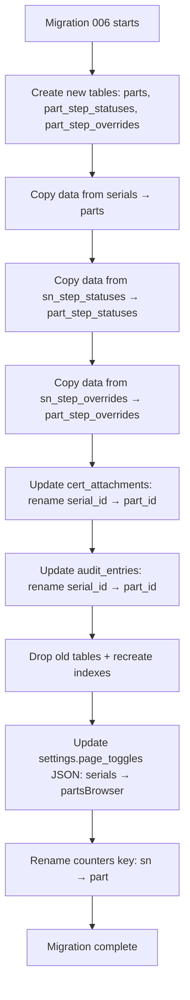

# Design Document: serial-to-part-id-rename

## Overview

This design covers a codebase-wide rename from "serial" / "serial number" / "SN" terminology to "part" / "part_id" terminology. The rename spans all layers: SQLite schema (via migration), TypeScript domain types, repository interfaces and implementations, services, API routes/URLs, frontend composables/components/pages/labels, seed data, and tests.

The rename is a pure refactoring — no behavioral changes. The only functional addition is backward compatibility: existing records with `SN-` prefixed IDs must continue to work alongside new `part_`-prefixed IDs.

### Key Design Decisions

1. **Single migration file** (`006_rename_serial_to_part.sql`): SQLite lacks `ALTER TABLE RENAME COLUMN`, so the migration uses the create-copy-drop-rename pattern for affected tables. All index recreation is included.
2. **ID prefix change**: `createSequentialSnGenerator` default prefix changes from `SN-` to `part_` and the counter key changes from `sn` to `part`. Existing `SN-` IDs remain valid — the repository reads them from the `parts` table without transformation.
3. **Page toggle key**: `PageToggles.serials` becomes `PageToggles.partsBrowser`. The migration for `settings.page_toggles` JSON is handled in the SQL migration by rewriting the JSON column.
4. **Route rename**: `/api/serials/` → `/api/parts/`, `/serials/` page → `/parts-browser/` (avoids collision with existing `/parts/` operator page).
5. **Audit action values**: String literals change (e.g., `serial_created` → `part_created`). Existing audit entries in the DB retain their original action strings — no data migration for historical audit records.
6. **No behavioral changes**: All business logic, validation rules, advancement modes, lifecycle operations remain identical. Only names change.

## Architecture

The rename follows the existing layer stack and touches every layer:

```
Frontend (pages, components, composables)
    ↓
API Routes (server/api/)
    ↓
Services (server/services/)
    ↓
Repositories (server/repositories/)
    ↓
SQLite (migration 006)
```

### Migration Strategy



### Rename Mapping Summary

| Layer           | Old Name                                         | New Name                                     |
| --------------- | ------------------------------------------------ | -------------------------------------------- |
| DB table        | `serials`                                        | `parts`                                      |
| DB table        | `sn_step_statuses`                               | `part_step_statuses`                         |
| DB table        | `sn_step_overrides`                              | `part_step_overrides`                        |
| DB column       | `serial_id` (in cert_attachments, audit_entries) | `part_id`                                    |
| Domain type     | `SerialNumber`                                   | `Part`                                       |
| Domain type     | `SnStepStatus`                                   | `PartStepStatus`                             |
| Domain type     | `SnStepOverride`                                 | `PartStepOverride`                           |
| Audit actions   | `serial_created`, `serial_advanced`, etc.        | `part_created`, `part_advanced`, etc.        |
| Repo interface  | `SerialRepository`                               | `PartRepository`                             |
| Repo interface  | `SnStepStatusRepository`                         | `PartStepStatusRepository`                   |
| Repo interface  | `SnStepOverrideRepository`                       | `PartStepOverrideRepository`                 |
| Repo set key    | `serials`                                        | `parts`                                      |
| Repo set key    | `snStepStatuses`                                 | `partStepStatuses`                           |
| Repo set key    | `snStepOverrides`                                | `partStepOverrides`                          |
| Service file    | `serialService.ts`                               | `partService.ts`                             |
| Service factory | `createSerialService`                            | `createPartService`                          |
| Service set key | `serialService`                                  | `partService`                                |
| API route dir   | `/api/serials/`                                  | `/api/parts/`                                |
| API route       | `/api/audit/serial/[id]`                         | `/api/audit/part/[id]`                       |
| API route       | `/api/notes/serial/[id]`                         | `/api/notes/part/[id]`                       |
| Composable      | `useSerials.ts`                                  | `useParts.ts` (the batch/advance composable) |
| Composable      | `useSerialBrowser.ts`                            | `usePartBrowser.ts`                          |
| Component       | `SerialBatchForm.vue`                            | `PartBatchForm.vue`                          |
| Component       | `SerialCreationPanel.vue`                        | `PartCreationPanel.vue`                      |
| Component       | `JobSerialNumbersTab.vue`                        | `JobPartsTab.vue`                            |
| Page dir        | `app/pages/serials/`                             | `app/pages/parts-browser/`                   |
| Page toggle     | `serials`                                        | `partsBrowser`                               |
| Sidebar label   | "Serials"                                        | "Parts Browser"                              |
| ID prefix       | `SN-` (sequential)                               | `part_` (sequential)                         |
| Counter key     | `sn`                                             | `part`                                       |

## Components and Interfaces

### Database Migration (006)

The migration must handle SQLite's limited ALTER TABLE support. For tables that need column renames (`cert_attachments`, `audit_entries`), the create-copy-drop-rename pattern is used. For table renames (`serials` → `parts`), SQLite's `ALTER TABLE RENAME TO` suffices since no column names change within the table itself.

Tables requiring the full recreate pattern:

- `cert_attachments` — column `serial_id` → `part_id`
- `audit_entries` — column `serial_id` → `part_id`

Tables using simple rename:

- `serials` → `parts`
- `sn_step_statuses` → `part_step_statuses`
- `sn_step_overrides` → `part_step_overrides`

Additional operations:

- Drop and recreate all indexes referencing old names
- Update `settings.page_toggles` JSON: replace `"serials"` key with `"partsBrowser"`
- Update `counters` table: rename key `sn` → `part`

### Domain Types (`server/types/`)

**domain.ts changes:**

- `SerialNumber` → `Part` (interface name only; all fields stay the same)
- `SnStepStatus` → `PartStepStatus`
- `SnStepOverride` → `PartStepOverride`
- `SnStepStatusValue` — rename to `PartStepStatusValue`
- `AuditAction` union: `serial_created` → `part_created`, `serial_advanced` → `part_advanced`, `serial_completed` → `part_completed`, `serial_scrapped` → `part_scrapped`, `serial_force_completed` → `part_force_completed`
- `PageToggles.serials` → `PageToggles.partsBrowser`

**api.ts changes:**

- `BatchCreateSerialsInput` → `BatchCreatePartsInput`
- `AdvanceSerialInput` → `AdvancePartInput`
- `ScrapSerialInput` → `ScrapPartInput`

**computed.ts changes:**

- `EnrichedSerial` → `EnrichedPart`
- `JobProgress` fields: `totalSerials` → `totalParts`, `completedSerials` → `completedParts`, `inProgressSerials` → `inProgressParts`, `scrappedSerials` → `scrappedParts`
- `SnStepStatusView` → `PartStepStatusView`
- `CertAttachment.serialId` → `CertAttachment.partId`
- `AuditEntry.serialId` → `AuditEntry.partId`

### Repository Interfaces (`server/repositories/interfaces/`)

- `serialRepository.ts` → `partRepository.ts`: `SerialRepository` → `PartRepository`, all methods return `Part` / `Part[]` instead of `SerialNumber` / `SerialNumber[]`
- `snStepStatusRepository.ts` → `partStepStatusRepository.ts`: `SnStepStatusRepository` → `PartStepStatusRepository`, parameter names `serialId` → `partId`
- `snStepOverrideRepository.ts` → `partStepOverrideRepository.ts`: `SnStepOverrideRepository` → `PartStepOverrideRepository`, parameter names `serialId` → `partId`
- `certRepository.ts`: `attachToSerial` → `attachToPart`, parameter type uses `partId`
- `auditRepository.ts`: `listBySerialId` → `listByPartId`
- `index.ts`: update all re-exports

### Repository Implementations (`server/repositories/sqlite/`)

- Rename implementation files to match interface renames
- Update all SQL strings to reference new table/column names (`parts`, `part_id`, `part_step_statuses`, `part_step_overrides`)
- Update row-to-object mapping to use new field names

### RepositorySet (`server/repositories/sqlite/index.ts`)

```typescript
// Old keys → New keys
serials → parts
snStepStatuses → partStepStatuses
snStepOverrides → partStepOverrides
```

### Services (`server/services/`)

- `serialService.ts` → `partService.ts`: `createSerialService` → `createPartService`, `SerialService` → `PartService`
- All method names: `createSerials` → `createParts`, `advanceSerial` → `advancePart`, etc.
- `lifecycleService.ts`: all internal references to `serial` → `part` in method names and variable names
- `auditService.ts`: no structural changes (audit actions are string literals passed by callers)
- `server/utils/services.ts`: `serialService` → `partService` in `ServiceSet` and wiring

### ID Generator (`server/utils/idGenerator.ts`)

- `createSequentialSnGenerator` → `createSequentialPartIdGenerator`
- Default prefix: `SN-` → `part_`
- The generator interface stays the same; only the factory name and default change
- In `services.ts`, the counter key changes from `'sn'` to `'part'`

### API Routes (`server/api/`)

- Move `server/api/serials/` → `server/api/parts/` (entire directory)
- Move `server/api/audit/serial/` → `server/api/audit/part/`
- Move `server/api/notes/serial/` → `server/api/notes/part/`
- Update all route handlers: `getServices().serialService` → `getServices().partService`
- Update request/response field names in operator routes

### Frontend Composables (`app/composables/`)

- `useSerials.ts` → `useParts.ts`: update API URLs from `/api/serials/` to `/api/parts/`
- `useSerialBrowser.ts` → `usePartBrowser.ts`: update API URLs, rename exported refs/functions
- `usePartDetail.ts`: update API URLs from `/api/serials/` to `/api/parts/`
- `useLifecycle.ts`: update API URLs
- `useAudit.ts`: update API URL from `/api/audit/serial/` to `/api/audit/part/`
- `useNotes.ts`: update API URL from `/api/notes/serial/` to `/api/notes/part/`
- All composables referencing `serialId` → `partId` in variable names

### Frontend Components (`app/components/`)

- `SerialBatchForm.vue` → `PartBatchForm.vue`
- `SerialCreationPanel.vue` → `PartCreationPanel.vue`
- `JobSerialNumbersTab.vue` → `JobPartsTab.vue`
- Update all user-visible text: "Serial Number" → "Part", "serial" → "part", "SN" → "Part"
- Update prop names, event names, variable names

### Frontend Pages (`app/pages/`)

- `app/pages/serials/index.vue` → `app/pages/parts-browser/index.vue`
- `app/pages/serials/[id].vue` → `app/pages/parts-browser/[id].vue`
- Update page titles: "Serial Number Browser" → "Parts Browser"
- Update all internal links from `/serials/` to `/parts-browser/`
- Update `app/pages/jobs/[id].vue`: tab label "Serial Numbers" → "Parts", component reference

### Sidebar & Navigation

- `app/layouts/default.vue`: nav item label "Serials" → "Parts Browser", route `/serials` → `/parts-browser`
- `server/utils/pageToggles.ts`: `DEFAULT_PAGE_TOGGLES.serials` → `DEFAULT_PAGE_TOGGLES.partsBrowser`, `ROUTE_TOGGLE_MAP['/serials']` → `ROUTE_TOGGLE_MAP['/parts-browser']`
- `app/utils/pageToggles.ts`: same changes (client-side re-export)

### Serialization (`server/utils/serialization.ts`)

- Update `DomainType` enum/union if it references `SerialNumber` → `Part`
- Update field validation for renamed fields (`serialId` → `partId`)

### Seed Script (`server/scripts/seed.ts`)

- Update all variable names, function calls, and comments from "serial" to "part"
- Update API/service calls to use new method names

## Data Models

### Before (Current Schema)

```sql
CREATE TABLE serials (
  id TEXT PRIMARY KEY,
  job_id TEXT NOT NULL REFERENCES jobs(id),
  path_id TEXT NOT NULL REFERENCES paths(id),
  current_step_index INTEGER NOT NULL DEFAULT 0,
  status TEXT NOT NULL DEFAULT 'in_progress',
  scrap_reason TEXT,
  scrap_explanation TEXT,
  scrap_step_id TEXT,
  scrapped_at TEXT,
  scrapped_by TEXT,
  force_completed INTEGER NOT NULL DEFAULT 0,
  force_completed_by TEXT,
  force_completed_at TEXT,
  force_completed_reason TEXT,
  created_at TEXT NOT NULL,
  updated_at TEXT NOT NULL
);

CREATE TABLE sn_step_statuses (
  id TEXT PRIMARY KEY,
  serial_id TEXT NOT NULL,
  step_id TEXT NOT NULL,
  step_index INTEGER NOT NULL,
  status TEXT NOT NULL DEFAULT 'pending',
  updated_at TEXT NOT NULL
);

CREATE TABLE sn_step_overrides (
  id TEXT PRIMARY KEY,
  serial_id TEXT NOT NULL,
  step_id TEXT NOT NULL,
  active INTEGER NOT NULL DEFAULT 1,
  reason TEXT,
  created_by TEXT NOT NULL,
  created_at TEXT NOT NULL
);

-- In cert_attachments:
--   serial_id TEXT NOT NULL REFERENCES serials(id)
-- In audit_entries:
--   serial_id TEXT
```

### After (Migration 006)

```sql
-- Simple renames (no column changes within these tables)
ALTER TABLE serials RENAME TO parts;
ALTER TABLE sn_step_statuses RENAME TO part_step_statuses;
ALTER TABLE sn_step_overrides RENAME TO part_step_overrides;

-- cert_attachments: recreate with part_id column
-- audit_entries: recreate with part_id column
-- (full create-copy-drop-rename pattern)

-- Recreate all affected indexes with new names
-- Update counters: sn → part
-- Update settings.page_toggles JSON
```

### TypeScript Domain Model (After)

```typescript
// Renamed types
interface Part { /* same fields as SerialNumber */ }
interface PartStepStatus { /* same fields, serialId → partId */ }
interface PartStepOverride { /* same fields, serialId → partId */ }

// Renamed audit actions
type AuditAction = 'part_created' | 'part_advanced' | 'part_completed'
  | 'part_scrapped' | 'part_force_completed' | /* ...rest unchanged */ ;

// Renamed computed types
interface EnrichedPart { /* same fields as EnrichedSerial */ }
interface PartStepStatusView { /* same fields as SnStepStatusView */ }
```

### ID Format

| Period           | Format             | Example                       |
| ---------------- | ------------------ | ----------------------------- |
| Before migration | `SN-NNNNN`         | `SN-00042`                    |
| After migration  | `part_NNNNN`       | `part_00042`                  |
| Backward compat  | Both formats valid | Lookup by either prefix works |

## Correctness Properties

_A property is a characteristic or behavior that should hold true across all valid executions of a system — essentially, a formal statement about what the system should do. Properties serve as the bridge between human-readable specifications and machine-verifiable correctness guarantees._

Since this is a pure refactoring, the core correctness guarantee is behavioral equivalence: the system must behave identically before and after the rename, with the sole exception of ID prefix format and backward compatibility for existing IDs.

### Property 1: Migration Data Preservation

_For any_ set of records (parts, step statuses, step overrides, cert attachments, audit entries) inserted before migration 006, after the migration completes, querying the renamed tables should return the exact same data with no loss or corruption — row counts match and all field values are identical.

**Validates: Requirements 1.6**

### Property 2: Audit Actions Use Renamed Values

_For any_ lifecycle operation (create parts, advance part, complete part, scrap part, force-complete part), the resulting audit entry's `action` field should use the `part_`-prefixed string (e.g., `part_created`, `part_advanced`, `part_completed`, `part_scrapped`, `part_force_completed`) rather than the old `serial_`-prefixed string.

**Validates: Requirements 2.7, 4.5**

### Property 3: Repository CRUD Round-Trip on Renamed Tables

_For any_ valid Part object, creating it via the `PartRepository` and then reading it back by ID should return an equivalent object — verifying that all SQL queries correctly reference the renamed `parts` table and columns.

**Validates: Requirements 3.5**

### Property 4: ID Generator Produces `part_`-Prefixed Sequential IDs

_For any_ positive integer counter value, the sequential ID generator should produce an ID matching the pattern `part_NNNNN` (where N is a zero-padded digit), and generating a batch of `n` IDs should produce exactly `n` unique IDs all matching this pattern with strictly increasing numeric suffixes.

**Validates: Requirements 4.6, 8.1**

### Property 5: Dual ID Prefix Compatibility

_For any_ part record, regardless of whether its ID uses the legacy `SN-` prefix or the new `part_` prefix, the repository and service layers should successfully look up, update, and perform lifecycle operations on that record without error.

**Validates: Requirements 8.2, 8.3, 8.4**

## Error Handling

Since this is a pure refactoring, no new error types or error handling paths are introduced. The existing error handling patterns remain unchanged:

- **Migration failure**: If migration 006 fails mid-execution, SQLite's transaction wrapping ensures the database rolls back to the pre-migration state. No partial renames.
- **ID lookup miss**: Looking up a non-existent ID (regardless of prefix) continues to return `null` from the repository and a 404 from the API layer, same as before.
- **Validation errors**: All existing validation (e.g., `assertPositive`, `assertNonEmpty`) continues to apply to the same fields — only the field names in TypeScript change, not the validation logic.
- **Type errors**: TypeScript compilation serves as the primary guard against incomplete renames. If any reference to the old type names remains, `nuxt typecheck` will catch it.

## Testing Strategy

### Dual Testing Approach

This refactoring requires both unit/integration tests and property-based tests:

- **Unit tests**: Verify specific examples — migration produces correct schema, specific ID formats work, specific audit action strings are correct.
- **Property tests**: Verify universal properties — data preservation across migration, ID format invariants, dual-prefix compatibility across all operations.
- **Integration tests**: The existing 51+ integration tests serve as the primary regression safety net. After the rename, all existing tests (updated with new names) must pass.

### Property-Based Testing Configuration

- Library: `fast-check` (already in use)
- Minimum iterations: 100 per property test
- Each property test references its design document property via tag comment

**Tag format**: `Feature: serial-to-part-id-rename, Property {number}: {property_text}`

### Test File Plan

| Test File                                                     | Type | Properties Covered |
| ------------------------------------------------------------- | ---- | ------------------ |
| `tests/properties/migrationDataPreservation.property.test.ts` | PBT  | Property 1         |
| `tests/properties/partAuditActions.property.test.ts`          | PBT  | Property 2         |
| `tests/properties/partRepositoryRoundTrip.property.test.ts`   | PBT  | Property 3         |
| `tests/properties/partIdGenerator.property.test.ts`           | PBT  | Property 4         |
| `tests/properties/dualIdPrefixCompat.property.test.ts`        | PBT  | Property 5         |

### Existing Test Updates

All existing test files that reference "serial" naming must be updated:

- **Property tests**: ~15 files reference serial types/services (e.g., `serialUniqueness.property.test.ts` → `partUniqueness.property.test.ts`)
- **Unit tests**: `tests/unit/services/serialService.test.ts` → `partService.test.ts`, plus updates in `idGenerator.test.ts`, `serialization.test.ts`, `services.test.ts`
- **Integration tests**: All 15 integration test files reference serial types and service methods — all need name updates
- **Integration helper**: `tests/integration/helpers.ts` references `serials` repo key and serial service methods

### Regression Validation

The ultimate correctness check: after all renames are complete, `npm run test` must pass all 682+ tests with zero failures attributable to the rename. This validates that the refactoring is complete and no references were missed.
