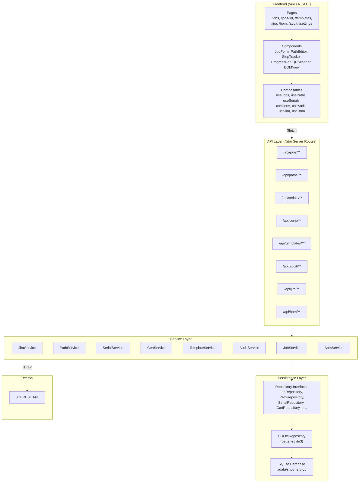

# Design Document — SHOP_ERP

## Overview

SHOP_ERP is a job routing and ERP application for machine shops, built on Nuxt 4 with Nuxt UI 4.3.0. The system tracks production orders (Jobs) through multi-path routing of parts across sequential Process Steps, with serial number management, certificate traceability, progress visualization, and Jira integration.

The application follows a client-server architecture within Nuxt's full-stack model: Vue components and composables handle the frontend, Nuxt server routes (`/api/...`) provide the API layer, and a repository-pattern persistence layer abstracts database access behind swappable interfaces.

Key design decisions:
- **Repository pattern with database abstraction**: All data access goes through repository interfaces (`JobRepository`, `SerialRepository`, etc.). The initial implementation uses SQLite via `better-sqlite3` (synchronous, zero-config, single-file database). Future implementations can target PostgreSQL, MySQL, or any other backend by implementing the same interfaces — no service layer changes needed.
- **SQLite as default backend**: Provides real SQL with ACID transactions, handles concurrent reads, and the database is a single file that's trivially backed up. Scales well for single-server deployments. When you outgrow it, swap the repository implementation.
- **Single Nuxt app (not a monorepo)**: Nuxt's `server/` directory is effectively the backend — separate Node processes, CORS config, and inter-service communication add complexity without benefit at this scale. Docker Compose runs the Nuxt app + nothing else (SQLite is embedded). If a separate API server is ever needed, the service layer and repositories can be extracted cleanly.
- **Domain-driven modules**: Each domain concept (Job, Path, Serial Number, Certificate, etc.) gets its own repository interface, service module, API routes, and frontend composable.
- **Immutable audit trail**: Audit entries are append-only records stored separately from domain objects, ensuring traceability cannot be tampered with.
- **Template Route independence**: Templates are deep-cloned when applied to a Path, so modifications to derived Paths never affect the source template.
- **Real Jira integration**: Connects to the PI project at `jira.example.com` via REST API v2. Maps custom fields (Part Number/Rev, Quantity, Epic Link, etc.) to SHOP_ERP domain objects. Workflow statuses (Backlog → In Progress → Secondary Ops → Quality Check → Done) are tracked but SHOP_ERP maintains its own routing independently.
- **Jira is optional, not a dependency**: The app works fully standalone with Jira disabled (the default). Integration is layered in three phases: (1) standalone core features, (2) read-only Jira pull (import tickets), (3) write/push to Jira (stretch). Two independent toggles in Settings control this: a global Jira enable/disable, and a separate push enable/disable. When Jira is off, all Jira UI is hidden and no Jira calls are made.

## Architecture



### Layer Responsibilities

| Layer | Responsibility |
|-------|---------------|
| Pages | Route-level views, layout composition |
| Components | Reusable UI elements built with Nuxt UI primitives |
| Composables | Client-side state, API calls via `$fetch`, reactive data |
| API Routes | HTTP endpoints, request validation, delegate to services |
| Services | Business logic, domain rules, audit trail recording |
| Repositories | Database-agnostic interfaces for CRUD operations on domain entities |
| SQLite Impl | Concrete repository implementations using better-sqlite3 |

### Directory Structure

```
app/
  pages/
    index.vue                    # Dashboard
    jobs/
      index.vue                  # Job list
      [id].vue                   # Job detail (paths, steps, serials)
    templates.vue                # Template route management
    jira.vue                     # Jira dashboard
    bom.vue                      # BOM roll-up views
    audit.vue                    # Audit trail viewer
    settings.vue                 # Jira field mapping & connection settings
    operator.vue                 # Operator/workstation view by process step
    assignees.vue                # View work grouped by assignee
  components/
    JobForm.vue                  # Create/edit job
    PathEditor.vue               # Add/edit paths and steps
    StepTracker.vue              # Process step visualization per path
    SerialBatchForm.vue          # Batch serial number creation at OP1
    CertForm.vue                 # Certificate creation/attachment
    ProgressBar.vue              # Dual-color progress bar
    QRScanner.vue                # QR code scanning interface
    BomEditor.vue                # BOM definition and summary
    AuditLog.vue                 # Audit trail display
    BottleneckBadge.vue          # Visual bottleneck indicator
    JiraFieldMappingEditor.vue   # Edit Jira custom field → SHOP_ERP field mappings
    JiraConnectionForm.vue       # Jira base URL, project key, credentials
  composables/
    useJobs.ts
    usePaths.ts
    useSerials.ts
    useCerts.ts
    useTemplates.ts
    useAudit.ts
    useJira.ts
    useBom.ts
    useSettings.ts
    useOperatorView.ts
    useNotes.ts
    useViewFilters.ts
    useUsers.ts
    useBarcode.ts
server/
  api/
    jobs/
      index.get.ts              # List jobs
      index.post.ts             # Create job
      [id].get.ts               # Get job detail
      [id].put.ts               # Update job
    paths/
      index.post.ts             # Create path on job
      [id].get.ts               # Get path detail
      [id].put.ts               # Update path
    serials/
      index.post.ts             # Batch create serials
      [id].get.ts               # Lookup serial
      [id]/advance.post.ts      # Advance serial to next step
      [id]/attach-cert.post.ts  # Attach cert to serial
    certs/
      index.get.ts              # List certs
      index.post.ts             # Create cert
      [id].get.ts               # Get cert detail
      batch-attach.post.ts      # Batch attach cert to serials
    templates/
      index.get.ts              # List templates
      index.post.ts             # Create template
      [id].get.ts               # Get template
      [id].delete.ts            # Delete template
      [id]/apply.post.ts        # Apply template to job
    audit/
      index.get.ts              # Query audit trail
      serial/[id].get.ts        # Audit trail for a serial
    jira/
      tickets.get.ts            # Fetch open PI tickets (JQL: resolution is EMPTY)
      tickets/[key].get.ts      # Fetch single ticket detail with attachments
      link.post.ts              # Link PI ticket to SHOP_ERP job
      push.post.ts              # Push status table to Jira description (stretch)
      comment.post.ts           # Push note/defect as Jira comment (stretch)
      changelog/[key].get.ts    # Fetch ticket changelog for analytics
    settings/
      index.get.ts              # Get current settings (field mappings + connection)
      index.put.ts              # Update settings
    notes/
      index.post.ts             # Create a step note on serial(s)
      serial/[id].get.ts        # Get notes for a serial number
      step/[id].get.ts          # Get notes for a process step
    operator/
      [stepName].get.ts         # Get operator view for a step (current, coming soon, backlog)
    users/
      index.get.ts              # List active users
      index.post.ts             # Create user
      [id].put.ts               # Update user (name, department, active toggle)
    bom/
      index.get.ts              # List BOMs
      index.post.ts             # Create BOM
      [id].get.ts               # Get BOM with roll-up
      [id].put.ts               # Update BOM
  services/
    jobService.ts
    pathService.ts
    serialService.ts
    certService.ts
    templateService.ts
    auditService.ts
    jiraService.ts
    bomService.ts
    settingsService.ts
    noteService.ts
    userService.ts
  repositories/
    interfaces/                  # Database-agnostic repository interfaces
      jobRepository.ts           # interface JobRepository { create, getById, list, update, ... }
      pathRepository.ts
      serialRepository.ts
      certRepository.ts
      templateRepository.ts
      auditRepository.ts         # append-only: create + query, no update/delete
      bomRepository.ts
      settingsRepository.ts
      noteRepository.ts
      userRepository.ts
    sqlite/                      # SQLite implementations (default)
      index.ts                   # Database initialization, migrations, connection
      jobRepository.ts           # SQLiteJobRepository implements JobRepository
      pathRepository.ts
      serialRepository.ts
      certRepository.ts
      templateRepository.ts
      auditRepository.ts
      bomRepository.ts
      settingsRepository.ts
      noteRepository.ts
      userRepository.ts
    factory.ts                   # Repository factory — returns concrete implementations based on config
  utils/
    serialization.ts            # Domain object serialize/deserialize
    validation.ts               # Shared validation helpers
    idGenerator.ts              # Unique ID generation
```

## UI / UX Design

### Layout and Navigation

The app uses the Nuxt UI Pro dashboard layout pattern:
- **Left sidebar**: Primary navigation with links to main views (Dashboard, Jobs, Operator, Assignees, Templates, BOM, Jira, Audit, Settings). Always visible on desktop. Collapsible to icons.
- **Top sub-navigation**: When a main view has sub-pages (e.g., Jobs → Job Detail), a horizontal tab/breadcrumb bar appears at the top of the content area.
- **Dashboard homepage**: Landing page with summary cards, charts, and metrics — total active jobs, parts in progress, parts completed today, bottleneck alerts. Cards link out to their respective views.

### Visual Density

Desktop-first, data-dense design:
- Smaller text sizes (Nuxt UI `text-sm` / `text-xs` as defaults for table content)
- Reduced padding on table rows and cards (`py-1` / `py-2` instead of defaults)
- Compact form inputs
- No mobile optimization for now — mobile may become a separate UI later
- Goal: maximize information per screen, minimize scrolling

### Color and Theme

- **Primary color**: `#8750FF` (violet/purple) — used for buttons, links, active states, progress indicators
- **Dark mode**: Enabled by default. Light mode available via toggle.
- **Neutral**: Default Nuxt UI neutral palette

The primary color requires a custom shade scale since `#8750FF` doesn't map to a standard Tailwind palette. Define in `app.config.ts`:

```typescript
export default defineAppConfig({
  ui: {
    colors: {
      primary: 'violet',  // closest Tailwind base, overridden with custom shades
      neutral: 'neutral'
    }
  }
})
```

And in `tailwind.config.ts` or `assets/css/main.css`, define the custom violet scale anchored on `#8750FF` as the 500 value:

```css
:root {
  /* Custom violet scale anchored on #8750FF */
  --ui-color-primary-50: #f5f0ff;
  --ui-color-primary-100: #ede5ff;
  --ui-color-primary-200: #dccfff;
  --ui-color-primary-300: #c3a8ff;
  --ui-color-primary-400: #a578ff;
  --ui-color-primary-500: #8750ff;  /* anchor */
  --ui-color-primary-600: #7a30f7;
  --ui-color-primary-700: #6b1ee3;
  --ui-color-primary-800: #5a18bf;
  --ui-color-primary-900: #4b159c;
  --ui-color-primary-950: #2d0b6a;
}
```

### Job List — Expandable Table

The primary job list uses `UTable` with expandable rows:
- **Collapsed row**: Job name, part number, goal qty, progress bar, status, priority, assignee
- **Expanded (level 1)**: Shows Paths for the job — path name, goal qty, step count, path-level progress
- **Expanded (level 2)**: Shows Process Steps within a path — step name, parts at step, parts completed through step, bottleneck indicator

If nesting depth becomes unwieldy in the table, individual paths can link to a detail card view. But start with table expansion and see how it feels.

### Dashboard Homepage

Summary cards (top row):
- Active Jobs count
- Total Parts In Progress
- Parts Completed Today
- Bottleneck Alerts (steps with highest wait counts)

Charts (below cards):
- Job progress overview (horizontal bar chart — one bar per active job)
- Parts by process step (stacked bar or heatmap showing distribution across steps)

Each card/chart links to the relevant detailed view.

## Components and Interfaces

### Frontend Components

| Component | Props | Events | Description |
|-----------|-------|--------|-------------|
| `JobForm` | `job?: Job` | `@submit(job)` | Create/edit form with name, goal quantity, optional Jira link |
| `PathEditor` | `jobId: string, path?: Path` | `@save(path)` | Manage ordered process steps, goal quantity |
| `StepTracker` | `path: Path, serials: SerialNumber[]` | `@advance(serialId)` | Visual step-by-step tracker showing SN counts per step |
| `SerialBatchForm` | `jobId: string, pathId: string` | `@created(serials)` | Batch create SNs at OP1 with optional cert attachment |
| `CertForm` | `cert?: Certificate` | `@submit(cert)` | Create certificate with type and metadata |
| `ProgressBar` | `completed: number, goal: number` | — | Dual-color bar (blue in-progress, green completed), supports >100% |
| `QRScanner` | — | `@scanned(value)` | Camera-based QR reader, dispatches lookup |
| `BomEditor` | `bom?: BOM` | `@save(bom)` | Define part types and required quantities |
| `AuditLog` | `entries: AuditEntry[]` | — | Chronological audit trail display |
| `BottleneckBadge` | `isBottleneck: boolean` | — | Visual indicator for step with most waiting SNs |
| `JiraFieldMappingEditor` | `mappings: JiraFieldMapping[]` | `@save(mappings)` | Table of Jira custom field ID → SHOP_ERP field mappings. Add, edit, remove rows. |
| `JiraConnectionForm` | `connection: JiraConnectionSettings` | `@save(connection)` | Jira base URL, project key, username, API token. Test connection button. |
| `OperatorView` | `stepName: string` | — | Shows work at a step: current parts, coming soon (1 step upstream), backlog (2+ steps upstream), next destination |
| `JobExpandableRow` | `job: Job` | — | Expandable job row → paths → process steps with in-progress/completed counts per step |
| `AssigneeView` | `assignee: string` | — | Groups jobs/steps by assignee, shows quantity to produce and next step destination |
| `ViewFilters` | `filters: FilterState` | `@change(filters)` | Filter bar: job name, ticket key, step, assignee, priority, label, status |
| `StepNoteForm` | `serialIds: string[], stepId: string` | `@submit(note)` | Create a note/defect on serial(s) at a step, optional Jira push |
| `StepNoteList` | `notes: StepNote[]` | — | Chronological list of notes for a step or serial |
| `DashboardSummaryCard` | `title: string, value: number, icon: string, link: string` | — | Metric card for dashboard homepage |
| `DashboardJobChart` | `jobs: JobProgress[]` | — | Horizontal bar chart showing progress per active job |
| `BarcodeInput` | `placeholder?: string` | `@scanned(value)` | Text input for barcode scanner + QR camera button. Global hotkey `/` focuses this field. Auto-detects SN vs cert. |
| `UserSelector` | `users: ShopUser[]` | `@select(user)` | Click-to-select user list for kiosk mode. Persists in session. |
| `UserForm` | `user?: ShopUser` | `@submit(user)` | Create/edit user profile in Settings (name, department, active toggle). |

### Composables

Each composable wraps `$fetch` calls and provides reactive state:

```typescript
// useJobs.ts — example pattern all composables follow
export function useJobs() {
  const jobs = ref<Job[]>([])
  const loading = ref(false)
  const error = ref<string | null>(null)

  async function fetchJobs() { /* GET /api/jobs */ }
  async function createJob(data: CreateJobInput) { /* POST /api/jobs */ }
  async function updateJob(id: string, data: UpdateJobInput) { /* PUT /api/jobs/:id */ }
  async function getJob(id: string): Promise<Job> { /* GET /api/jobs/:id */ }

  return { jobs, loading, error, fetchJobs, createJob, updateJob, getJob }
}
```

### Service Layer Interface

Each service module exports pure functions that accept repository instances via dependency injection:

```typescript
// jobService.ts — example
export function createJobService(repos: { jobs: JobRepository, paths: PathRepository, serials: SerialRepository }) {
  return {
    async createJob(input: CreateJobInput): Promise<Job> { ... },
    async getJob(id: string): Promise<Job | null> { ... },
    async listJobs(): Promise<Job[]> { ... },
    async updateJob(id: string, input: UpdateJobInput): Promise<Job> { ... },
    async computeJobProgress(jobId: string): Promise<JobProgress> { ... },
  }
}
```

### Repository Pattern — Database Abstraction Layer

Each domain entity has a repository interface that defines the contract for data access. Services depend only on these interfaces, never on concrete implementations.

```typescript
// server/repositories/interfaces/jobRepository.ts
export interface JobRepository {
  create(job: Job): Job
  getById(id: string): Job | null
  list(): Job[]
  update(id: string, partial: Partial<Job>): Job
  delete(id: string): boolean
}

// server/repositories/interfaces/auditRepository.ts
// Audit is append-only — no update or delete
export interface AuditRepository {
  create(entry: AuditEntry): AuditEntry
  listBySerialId(serialId: string): AuditEntry[]
  listByJobId(jobId: string): AuditEntry[]
  list(options?: { limit?: number, offset?: number }): AuditEntry[]
}

// server/repositories/interfaces/serialRepository.ts
export interface SerialRepository {
  create(serial: SerialNumber): SerialNumber
  createBatch(serials: SerialNumber[]): SerialNumber[]
  getById(id: string): SerialNumber | null
  listByPathId(pathId: string): SerialNumber[]
  listByJobId(jobId: string): SerialNumber[]
  update(id: string, partial: Partial<SerialNumber>): SerialNumber
}

// ... similar interfaces for Path, Certificate, Template, BOM, Settings
```

### Repository Factory

The factory returns concrete repository implementations based on configuration. This is the single point where you swap database backends:

```typescript
// server/repositories/factory.ts
import { createSQLiteRepositories } from './sqlite'

export type RepositorySet = {
  jobs: JobRepository
  paths: PathRepository
  serials: SerialRepository
  certs: CertRepository
  templates: TemplateRepository
  audit: AuditRepository
  bom: BomRepository
  settings: SettingsRepository
  notes: NoteRepository
  users: UserRepository
}

export function createRepositories(config: { type: 'sqlite', dbPath: string }): RepositorySet {
  switch (config.type) {
    case 'sqlite':
      return createSQLiteRepositories(config.dbPath)
    // Future: case 'postgres': return createPostgresRepositories(config.connectionString)
    default:
      throw new Error(`Unknown database type: ${config.type}`)
  }
}
```

### SQLite Implementation (Default)

Uses `better-sqlite3` — synchronous, zero-config, embedded SQL database:

```typescript
// server/repositories/sqlite/index.ts
import Database from 'better-sqlite3'

export function createSQLiteRepositories(dbPath: string): RepositorySet {
  const db = new Database(dbPath)
  db.pragma('journal_mode = WAL')       // Write-Ahead Logging for better concurrency
  db.pragma('foreign_keys = ON')        // Enforce referential integrity
  runMigrations(db)                     // Create/update tables
  return {
    jobs: new SQLiteJobRepository(db),
    paths: new SQLitePathRepository(db),
    serials: new SQLiteSerialRepository(db),
    certs: new SQLiteCertRepository(db),
    templates: new SQLiteTemplateRepository(db),
    audit: new SQLiteAuditRepository(db),
    bom: new SQLiteBomRepository(db),
    settings: new SQLiteSettingsRepository(db),
    notes: new SQLiteNoteRepository(db),
    users: new SQLiteUserRepository(db),
  }
}
```

### Database Schema (SQLite)

```sql
-- Jobs
CREATE TABLE IF NOT EXISTS jobs (
  id TEXT PRIMARY KEY,
  name TEXT NOT NULL,
  goal_quantity INTEGER NOT NULL CHECK(goal_quantity > 0),
  jira_ticket_key TEXT,
  jira_ticket_summary TEXT,
  jira_part_number TEXT,
  jira_priority TEXT,
  jira_epic_link TEXT,
  jira_labels TEXT,              -- JSON array stored as text
  created_at TEXT NOT NULL,
  updated_at TEXT NOT NULL
);

-- Paths
CREATE TABLE IF NOT EXISTS paths (
  id TEXT PRIMARY KEY,
  job_id TEXT NOT NULL REFERENCES jobs(id),
  name TEXT NOT NULL,
  goal_quantity INTEGER NOT NULL,
  created_at TEXT NOT NULL,
  updated_at TEXT NOT NULL
);

-- Process Steps (belong to a path, ordered)
CREATE TABLE IF NOT EXISTS process_steps (
  id TEXT PRIMARY KEY,
  path_id TEXT NOT NULL REFERENCES paths(id) ON DELETE CASCADE,
  name TEXT NOT NULL,
  step_order INTEGER NOT NULL,
  location TEXT,                  -- physical location, e.g. "Machine Shop", "QC Lab"
  UNIQUE(path_id, step_order)
);

-- Serial Numbers
CREATE TABLE IF NOT EXISTS serials (
  id TEXT PRIMARY KEY,
  job_id TEXT NOT NULL REFERENCES jobs(id),
  path_id TEXT NOT NULL REFERENCES paths(id),
  current_step_index INTEGER NOT NULL,  -- -1 = completed
  created_at TEXT NOT NULL,
  updated_at TEXT NOT NULL
);

-- Certificate attachments (many-to-many: serials ↔ certs)
CREATE TABLE IF NOT EXISTS cert_attachments (
  id INTEGER PRIMARY KEY AUTOINCREMENT,
  serial_id TEXT NOT NULL REFERENCES serials(id),
  cert_id TEXT NOT NULL REFERENCES certs(id),
  step_id TEXT NOT NULL REFERENCES process_steps(id),
  attached_at TEXT NOT NULL,
  attached_by TEXT NOT NULL,
  UNIQUE(serial_id, cert_id, step_id)   -- idempotent attachment
);

-- Certificates
CREATE TABLE IF NOT EXISTS certs (
  id TEXT PRIMARY KEY,
  type TEXT NOT NULL CHECK(type IN ('material', 'process')),
  name TEXT NOT NULL,
  metadata TEXT,                  -- JSON object stored as text
  created_at TEXT NOT NULL
);

-- Template Routes
CREATE TABLE IF NOT EXISTS templates (
  id TEXT PRIMARY KEY,
  name TEXT NOT NULL,
  created_at TEXT NOT NULL,
  updated_at TEXT NOT NULL
);

CREATE TABLE IF NOT EXISTS template_steps (
  id INTEGER PRIMARY KEY AUTOINCREMENT,
  template_id TEXT NOT NULL REFERENCES templates(id) ON DELETE CASCADE,
  name TEXT NOT NULL,
  step_order INTEGER NOT NULL,
  location TEXT,
  UNIQUE(template_id, step_order)
);

-- BOM
CREATE TABLE IF NOT EXISTS boms (
  id TEXT PRIMARY KEY,
  name TEXT NOT NULL,
  created_at TEXT NOT NULL,
  updated_at TEXT NOT NULL
);

CREATE TABLE IF NOT EXISTS bom_entries (
  id INTEGER PRIMARY KEY AUTOINCREMENT,
  bom_id TEXT NOT NULL REFERENCES boms(id) ON DELETE CASCADE,
  part_type TEXT NOT NULL,
  required_quantity_per_build INTEGER NOT NULL
);

CREATE TABLE IF NOT EXISTS bom_contributing_jobs (
  bom_entry_id INTEGER NOT NULL REFERENCES bom_entries(id) ON DELETE CASCADE,
  job_id TEXT NOT NULL REFERENCES jobs(id),
  PRIMARY KEY(bom_entry_id, job_id)
);

-- Users (simple kiosk mode — no passwords)
CREATE TABLE IF NOT EXISTS users (
  id TEXT PRIMARY KEY,
  name TEXT NOT NULL,
  department TEXT,
  active INTEGER NOT NULL DEFAULT 1,
  created_at TEXT NOT NULL
);

-- Audit Trail (append-only — no UPDATE or DELETE allowed by service layer)
CREATE TABLE IF NOT EXISTS audit_entries (
  id TEXT PRIMARY KEY,
  action TEXT NOT NULL,
  user_id TEXT NOT NULL,
  timestamp TEXT NOT NULL,
  serial_id TEXT,
  cert_id TEXT,
  job_id TEXT,
  path_id TEXT,
  step_id TEXT,
  from_step_id TEXT,
  to_step_id TEXT,
  batch_quantity INTEGER,
  metadata TEXT                   -- JSON object stored as text
);

-- Settings (singleton row)
CREATE TABLE IF NOT EXISTS settings (
  id TEXT PRIMARY KEY DEFAULT 'app_settings',
  jira_connection TEXT NOT NULL,  -- JSON: JiraConnectionSettings (includes enabled + pushEnabled booleans)
  jira_field_mappings TEXT NOT NULL, -- JSON: JiraFieldMapping[]
  updated_at TEXT NOT NULL
);

-- Process Step Notes / Defects
CREATE TABLE IF NOT EXISTS step_notes (
  id TEXT PRIMARY KEY,
  job_id TEXT NOT NULL REFERENCES jobs(id),
  path_id TEXT NOT NULL REFERENCES paths(id),
  step_id TEXT NOT NULL REFERENCES process_steps(id),
  serial_ids TEXT NOT NULL,       -- JSON array of serial IDs
  text TEXT NOT NULL,
  created_by TEXT NOT NULL,
  created_at TEXT NOT NULL,
  pushed_to_jira INTEGER NOT NULL DEFAULT 0,
  jira_comment_id TEXT
);

-- Indexes for common queries
CREATE INDEX IF NOT EXISTS idx_paths_job_id ON paths(job_id);
CREATE INDEX IF NOT EXISTS idx_serials_job_id ON serials(job_id);
CREATE INDEX IF NOT EXISTS idx_serials_path_id ON serials(path_id);
CREATE INDEX IF NOT EXISTS idx_serials_step_index ON serials(current_step_index);
CREATE INDEX IF NOT EXISTS idx_cert_attachments_serial ON cert_attachments(serial_id);
CREATE INDEX IF NOT EXISTS idx_cert_attachments_cert ON cert_attachments(cert_id);
CREATE INDEX IF NOT EXISTS idx_audit_serial ON audit_entries(serial_id);
CREATE INDEX IF NOT EXISTS idx_audit_job ON audit_entries(job_id);
CREATE INDEX IF NOT EXISTS idx_audit_timestamp ON audit_entries(timestamp);
CREATE INDEX IF NOT EXISTS idx_process_steps_path ON process_steps(path_id);
CREATE INDEX IF NOT EXISTS idx_step_notes_step ON step_notes(step_id);
CREATE INDEX IF NOT EXISTS idx_step_notes_job ON step_notes(job_id);
```

### Migration Strategy

Migrations use a file-based system with versioned SQL scripts. Each migration is a separate `.sql` file that runs in order. Migrations are tracked in the database and run automatically on startup, but can also be managed via CLI.

#### Migration File Structure

```
server/
  repositories/
    sqlite/
      migrations/
        001_initial_schema.sql      # Tables, indexes, constraints
        002_add_counters_table.sql  # SN counter persistence
        # Future: 003_add_machine_field.sql
      index.ts                      # DB init + migration runner
```

Each migration file is a plain SQL script. The filename format is `{NNN}_{description}.sql` where NNN is a zero-padded sequence number.

#### Migration Runner

```typescript
// server/repositories/sqlite/index.ts
interface MigrationRecord {
  version: number
  name: string
  applied_at: string
}

function runMigrations(db: Database.Database) {
  // Create migrations tracking table if it doesn't exist
  db.exec(`
    CREATE TABLE IF NOT EXISTS _migrations (
      version INTEGER PRIMARY KEY,
      name TEXT NOT NULL,
      applied_at TEXT NOT NULL,
      checksum TEXT NOT NULL
    )
  `)

  const applied = db.prepare('SELECT version FROM _migrations').all() as { version: number }[]
  const appliedVersions = new Set(applied.map(m => m.version))

  // Load migration files from disk, sorted by version number
  const pending = loadMigrationFiles().filter(m => !appliedVersions.has(m.version))

  for (const migration of pending) {
    db.transaction(() => {
      db.exec(migration.sql)
      db.prepare(
        'INSERT INTO _migrations (version, name, applied_at, checksum) VALUES (?, ?, ?, ?)'
      ).run(migration.version, migration.name, new Date().toISOString(), migration.checksum)
    })()
    console.log(`Migration ${migration.version}: ${migration.name} — applied`)
  }
}
```

#### Migration Rules

- Migrations are forward-only in production — no rollbacks. If a migration needs to be undone, write a new migration that reverses the change.
- Each migration runs inside a transaction. If it fails, the database stays at the previous version.
- A checksum (hash of the SQL content) is stored with each applied migration. On startup, if a previously-applied migration's file has been modified, the system logs a warning (indicates someone edited a migration that already ran — this is a red flag).
- Never modify a migration file after it has been applied to any environment. Always create a new migration.
- The migration runner logs each applied migration to stdout for visibility.

#### Development Workflow

During development, if you need to reset the schema entirely:
1. Delete `data/shop_erp.db`
2. Restart the app — all migrations re-run from scratch

For adding a new migration:
1. Create a new `.sql` file in `server/repositories/sqlite/migrations/` with the next sequence number
2. Write the SQL (ALTER TABLE, CREATE TABLE, CREATE INDEX, etc.)
3. Restart the app — the new migration runs automatically

## Separation of Concerns

SHOP_ERP enforces strict boundaries between layers to prevent business logic from leaking into the frontend or API routes. This is critical for maintainability as the system grows.

### Layer Rules

| Layer | ALLOWED | FORBIDDEN |
|-------|---------|-----------|
| **Components / Pages** | Render UI, bind to composable state, emit events, call composable methods | Import services, import repositories, contain domain logic, directly call `$fetch` |
| **Composables** | Call `$fetch` to API routes, manage reactive UI state (loading, error, lists), transform API responses for display | Contain business rules, validate domain invariants, compute derived domain state |
| **API Routes** | Parse/validate request input, call service methods, format HTTP responses, handle HTTP errors | Contain business logic, call repositories directly, compute domain state |
| **Services** | Implement all business rules, enforce domain invariants, orchestrate repository calls, record audit entries | Import Vue/Nuxt client code, know about HTTP, access request/response objects |
| **Repositories** | CRUD operations on database, SQL queries, row-to-object mapping | Contain business logic, enforce domain rules, call other repositories |

### Where Business Logic Lives

All business logic lives in the service layer (`server/services/*.ts`). Specifically:

- **Validation rules** (goal quantity > 0, path must have steps, etc.) → services
- **Domain invariants** (SN uniqueness, sequential step advancement, count conservation) → services
- **Computed state** (job progress percentage, bottleneck detection, BOM roll-ups) → services
- **Cross-entity operations** (advancing a serial updates the serial + creates an audit entry) → services
- **Jira field mapping / normalization** → jiraService
- **Template deep-clone on apply** → templateService

### What Composables Do (and Don't Do)

Composables are thin API clients with reactive state. They:

```typescript
// GOOD — composable as thin API client
export function useJobs() {
  const jobs = ref<Job[]>([])
  const loading = ref(false)
  const error = ref<string | null>(null)

  async function fetchJobs() {
    loading.value = true
    error.value = null
    try {
      jobs.value = await $fetch('/api/jobs')
    } catch (e) {
      error.value = (e as Error).message
    } finally {
      loading.value = false
    }
  }

  // Delegates to API — no business logic here
  async function createJob(data: CreateJobInput) {
    return await $fetch('/api/jobs', { method: 'POST', body: data })
  }

  return { jobs, loading, error, fetchJobs, createJob }
}
```

```typescript
// BAD — business logic in composable
export function useJobs() {
  async function createJob(data: CreateJobInput) {
    // ❌ Don't validate domain rules in composables
    if (data.goalQuantity <= 0) throw new Error('...')
    // ❌ Don't compute derived state in composables
    const progress = computed(() => (completed.value / goal.value) * 100)
    // ❌ Don't orchestrate multi-entity operations in composables
    const job = await $fetch('/api/jobs', { method: 'POST', body: data })
    await $fetch('/api/audit', { method: 'POST', body: { action: 'job_created', ... } })
  }
}
```

### What API Routes Do (and Don't Do)

API routes are thin HTTP handlers. They parse input, call a service, and return the result:

```typescript
// GOOD — API route as thin handler
export default defineEventHandler(async (event) => {
  const body = await readBody(event)
  // Input parsing only — not domain validation
  const input: CreateJobInput = {
    name: body.name,
    goalQuantity: body.goalQuantity,
    jiraTicketKey: body.jiraTicketKey,
  }
  // Delegate to service — all business logic lives there
  const job = jobService.createJob(input)
  return job
})
```

```typescript
// BAD — business logic in API route
export default defineEventHandler(async (event) => {
  const body = await readBody(event)
  // ❌ Don't validate domain rules in routes
  if (body.goalQuantity <= 0) throw createError({ statusCode: 400, message: '...' })
  // ❌ Don't call repositories directly
  const job = repos.jobs.create({ ...body, id: generateId('job') })
  // ❌ Don't orchestrate cross-entity operations
  repos.audit.create({ action: 'job_created', ... })
  return job
})
```

### Dependency Direction

```
Components → Composables → API Routes → Services → Repositories → Database
     UI only      API client     HTTP glue    Business logic   Data access    Storage
```

Dependencies flow left-to-right only. No layer reaches backward. Services don't know about HTTP. Repositories don't know about business rules. Composables don't know about the database.


## Data Models

### Core Domain Types

```typescript
// ---- Identifiers ----
type JobId = string       // e.g. "job_abc123"
type PathId = string      // e.g. "path_def456"
type StepId = string      // e.g. "step_ghi789"
type SerialId = string    // e.g. "SN-00001"
type CertId = string      // e.g. "cert_jkl012"
type TemplateId = string  // e.g. "tmpl_mno345"
type BomId = string       // e.g. "bom_pqr678"
type AuditId = string     // e.g. "aud_stu901"

// ---- Job ----
interface Job {
  id: JobId
  name: string
  goalQuantity: number              // must be > 0
  pathIds: PathId[]                 // ordered list of paths
  jiraTicketKey?: string            // e.g. "PI-7987"
  jiraTicketSummary?: string
  jiraPartNumber?: string           // from customfield_10908 or parsed from summary
  jiraPriority?: string             // "Critical" | "High" | "Medium" | "Low"
  jiraEpicLink?: string             // parent epic key, e.g. "PI-4294"
  jiraLabels?: string[]             // e.g. ["PI_PCBA"]
  createdAt: string                 // ISO 8601
  updatedAt: string
}

// ---- Path ----
interface Path {
  id: PathId
  jobId: JobId
  name: string
  goalQuantity: number
  steps: ProcessStep[]              // ordered sequence
  createdAt: string
  updatedAt: string
}

// ---- Process Step ----
interface ProcessStep {
  id: StepId
  name: string                      // e.g. "OP1", "Stress Relief", "Final Inspection"
  order: number                     // 0-based index in the path
  location?: string                 // physical location, e.g. "Machine Shop", "QC Lab", "Vendor - Anodize Co."
}

// ---- Serial Number ----
interface SerialNumber {
  id: SerialId                      // globally unique identifier
  jobId: JobId
  pathId: PathId
  currentStepIndex: number          // index into Path.steps, -1 = completed
  certIds: CertAttachment[]         // certs attached at various steps
  createdAt: string
  updatedAt: string
}

interface CertAttachment {
  certId: CertId
  stepId: StepId                    // step where cert was attached
  attachedAt: string                // ISO 8601
  attachedBy: string                // user identity
}

// ---- Certificate ----
interface Certificate {
  id: CertId
  type: 'material' | 'process'
  name: string
  metadata: Record<string, string>  // flexible key-value pairs
  createdAt: string
}

// ---- Template Route ----
interface TemplateRoute {
  id: TemplateId
  name: string
  steps: TemplateStep[]             // ordered sequence
  createdAt: string
  updatedAt: string
}

interface TemplateStep {
  name: string
  order: number
  location?: string                 // default physical location for this step
}

// ---- BOM ----
interface BOM {
  id: BomId
  name: string
  entries: BomEntry[]
  createdAt: string
  updatedAt: string
}

interface BomEntry {
  partType: string                  // descriptive name
  requiredQuantityPerBuild: number
  contributingJobIds: JobId[]
}

// ---- Audit Trail ----
type AuditAction = 'cert_attached' | 'serial_created' | 'serial_advanced' | 'serial_completed'

interface AuditEntry {
  id: AuditId
  action: AuditAction
  userId: string
  timestamp: string                 // ISO 8601
  serialId?: SerialId
  certId?: CertId
  jobId?: JobId
  pathId?: PathId
  stepId?: StepId
  fromStepId?: StepId              // for advancement
  toStepId?: StepId                // for advancement
  batchQuantity?: number           // for batch creation
  metadata?: Record<string, string>
}

// ---- Computed / View Types ----
interface JobProgress {
  jobId: JobId
  goalQuantity: number
  totalSerials: number
  completedSerials: number
  inProgressSerials: number
  percentage: number                // (completed / goal) * 100, can exceed 100
}

interface StepDistribution {
  stepId: StepId
  stepName: string
  count: number
  isBottleneck: boolean
}

interface BomSummary {
  bomId: BomId
  bomName: string
  entries: BomEntrySummary[]
}

interface BomEntrySummary {
  partType: string
  requiredPerBuild: number
  totalCompleted: number
  totalInProgress: number
  totalOutstanding: number
}

// ---- Settings (Jira Field Mapping & Connection) ----

// ---- User (Simple / Kiosk Mode) ----
interface ShopUser {
  id: string
  name: string                      // display name, e.g. "Mike Jones"
  department?: string               // optional, e.g. "Machining", "QC"
  active: boolean                   // false = hidden from user selector
  createdAt: string
}

// ---- Settings (Jira Field Mapping & Connection) ----
interface JiraFieldMapping {
  id: string                        // unique mapping ID
  jiraFieldId: string               // e.g. "customfield_10908"
  label: string                     // human-readable label, e.g. "Part Number / Rev"
  shopErpField: string              // target field in SHOP_ERP, e.g. "partNumber"
  isDefault: boolean                // true = shipped with app, false = user-added
}

interface JiraConnectionSettings {
  baseUrl: string                   // e.g. "https://jira.example.com"
  projectKey: string                // e.g. "PI"
  username: string                  // Jira username for API auth
  apiToken: string                  // Jira API token (stored server-side only)
  enabled: boolean                  // Global toggle — false = all Jira UI hidden, app is standalone
  pushEnabled: boolean              // Push toggle — false = read-only mode (pull tickets only)
}

interface AppSettings {
  id: string                        // singleton "app_settings"
  jiraConnection: JiraConnectionSettings
  jiraFieldMappings: JiraFieldMapping[]
  updatedAt: string
}

// ---- Process Step Notes / Defects ----
interface StepNote {
  id: string
  jobId: JobId
  pathId: PathId
  stepId: StepId
  serialIds: SerialId[]             // one or more affected serial numbers
  text: string                      // free-text note content
  createdBy: string                 // user identity
  createdAt: string                 // ISO 8601
  pushedToJira: boolean             // whether this note was pushed as a Jira comment
  jiraCommentId?: string            // Jira comment ID if pushed
}

// ---- Operator View Types ----
interface OperatorStepView {
  stepName: string
  stepId: StepId
  currentParts: OperatorPartInfo[]      // parts at this step right now
  comingSoon: OperatorPartInfo[]        // parts one step upstream
  backlog: OperatorPartInfo[]           // parts two+ steps upstream
}

interface OperatorPartInfo {
  serialId: SerialId
  jobName: string
  jobId: JobId
  pathName: string
  pathId: PathId
  timeAtStep: number                    // milliseconds since arriving at current step
  nextStepName: string | null           // where this part goes after current step
}

// ---- Filter State ----
interface FilterState {
  jobName?: string
  jiraTicketKey?: string
  stepName?: string
  assignee?: string
  priority?: string
  label?: string
  status?: 'active' | 'completed' | 'all'
}

// ---- Jira Push Table Format ----
// When pushing to Jira description, the table format per Path is:
// | Date       | Step1 | Step2 | Step3 | ... | Completed |
// |------------|-------|-------|-------|-----|-----------|
// | 2026-03-13 |   5   |   3   |   2   |     |     10    |
// | 2026-03-14 |   2   |   4   |   4   |     |     15    |
// Each push appends a new row with the current date and counts.
```

### API Input/Output Types

```typescript
// ---- Job ----
interface CreateJobInput {
  name: string
  goalQuantity: number
  jiraTicketKey?: string            // "PI-7987"
  jiraTicketSummary?: string
  jiraPartNumber?: string
  jiraPriority?: string
  jiraEpicLink?: string
  jiraLabels?: string[]
}

interface UpdateJobInput {
  name?: string
  goalQuantity?: number
}

// ---- Path ----
interface CreatePathInput {
  jobId: string
  name: string
  goalQuantity: number
  steps: { name: string }[]         // at least one step required
}

interface UpdatePathInput {
  name?: string
  goalQuantity?: number
  steps?: { name: string }[]
}

// ---- Serial Numbers ----
interface BatchCreateSerialsInput {
  jobId: string
  pathId: string
  quantity: number                   // how many SNs to create
  certId?: string                   // optional material cert to attach to all
}

interface AdvanceSerialInput {
  userId: string
}

interface AttachCertInput {
  certId: string
  userId: string
}

// ---- Certificate ----
interface CreateCertInput {
  type: 'material' | 'process'
  name: string
  metadata?: Record<string, string>
}

interface BatchAttachCertInput {
  certId: string
  serialIds: string[]
  userId: string
}

// ---- Template ----
interface CreateTemplateInput {
  name: string
  steps: { name: string }[]
}

interface ApplyTemplateInput {
  jobId: string
  pathName?: string
  goalQuantity: number
}

// ---- BOM ----
interface CreateBomInput {
  name: string
  entries: {
    partType: string
    requiredQuantityPerBuild: number
    contributingJobIds: string[]
  }[]
}

// ---- Jira (PI Project — Real Data Model) ----

// Jira REST API base: https://jira.example.com/rest/api/2/

// Custom field ID mapping for the PI project
const JIRA_CUSTOM_FIELDS = {
  PART_NUMBER_REV:     'customfield_10908', // "Part Number / Rev" — PRIMARY, e.g. "158041-001-01"
  QUANTITY:            'customfield_10909', // "Quantity" — integer part count
  PART_NUMBER:         'customfield_10923', // "Part Number" — alternate PN (less commonly used)
  MFG_PART_NUMBER:     'customfield_13000', // "MFG Part Number"
  MATERIAL_CERTS_REQ:  'customfield_10949', // "Material Certs Required"
  DELIVERY_DATE:       'customfield_10937', // "Delivery Date"
  START_DATE:          'customfield_10602', // "Start date"
  END_DATE:            'customfield_10603', // "End date"
  EPIC_LINK:           'customfield_10101', // "Epic Link" — parent epic key
  SUBSYSTEM:           'customfield_10926', // "Subsystem"
  PART_TYPE:           'customfield_10925', // "Part Type"
} as const

// Jira workflow statuses mapped to manufacturing stages
const JIRA_STATUSES = {
  'Backlog':                { id: '10002', category: 'To Do' },
  'In Review':              { id: '10101', category: 'In Progress' },
  'In Progress':            { id: '3',     category: 'In Progress' },
  'PI - Secondary Ops':     { id: '11213', category: 'In Progress' },
  'Quality Check':          { id: '11000', category: 'In Progress' },
  'In Test':                { id: '10717', category: 'In Progress' },
  'On Hold':                { id: '10902', category: 'In Progress' },
  'Pending Requestor Info': { id: '10306', category: 'In Progress' },
  'Investigating NC':       { id: '11002', category: 'In Progress' },
  'Picked Up':              { id: '11214', category: 'Done' },
  'Moved to Inventory':     { id: '11215', category: 'Done' },
  'PI - Shipped':           { id: '11216', category: 'Done' },
  'Done':                   { id: '10001', category: 'Done' },
  'Cancelled':              { id: '10006', category: 'Done' },
} as const

interface JiraUser {
  name: string              // "jsmith" — username for API calls
  key: string               // "JIRAUSER12345"
  displayName: string       // "Jane Smith"
  emailAddress: string
  active: boolean
  timeZone: string
}

interface JiraStatus {
  name: string              // e.g. "Quality Check"
  id: string                // e.g. "11000"
  statusCategory: {
    id: number
    key: string             // "new" | "indeterminate" | "done"
    name: string            // "To Do" | "In Progress" | "Done"
  }
}

interface JiraAttachment {
  id: string
  filename: string
  mimeType: string
  size: number
  content: string           // Download URL
  author: JiraUser
  created: string           // ISO datetime
}

// Shape of a PI ticket as returned by the Jira REST API
interface PITicket {
  key: string               // "PI-7987"
  summary: string           // "1337400-002 Launch Lock Body Rework"
  description: string
  issuetype: { name: string }
  reporter: JiraUser
  assignee: JiraUser | null
  priority: { name: string; id: string }
  status: JiraStatus
  resolution: string | null // null = active, "Resolved" = done
  labels: string[]          // e.g. ["PI_PCBA"]
  components: string[]
  duedate: string | null
  attachment: JiraAttachment[]
  issuelinks: any[]
  subtasks: any[]
  created: string
  updated: string
  // Shop-critical custom fields
  customfield_10908: string | null  // Part Number / Rev (PRIMARY)
  customfield_10909: number | null  // Quantity
  customfield_10923: string | null  // Part Number (alternate)
  customfield_13000: string | null  // MFG Part Number
  customfield_10949: string | null  // Material Certs Required
  customfield_10937: string | null  // Delivery Date
  customfield_10602: string | null  // Start date
  customfield_10603: string | null  // End date
  customfield_10101: string | null  // Epic Link
  customfield_10926: string | null  // Subsystem
  customfield_10925: string | null  // Part Type
}

// Normalized ticket for SHOP_ERP internal use (mapped from PITicket)
interface JiraTicket {
  key: string               // "PI-7987"
  summary: string
  description: string
  partNumber: string | null // resolved from customfield_10908 or parsed from summary
  quantity: number | null   // from customfield_10909
  status: string            // status.name
  statusCategory: string    // "To Do" | "In Progress" | "Done"
  priority: string          // "Critical" | "High" | "Medium" | "Low"
  assignee: string | null   // displayName
  reporter: string          // displayName
  epicLink: string | null   // parent epic key
  labels: string[]
  materialCertsRequired: string | null
  deliveryDate: string | null
  attachments: JiraAttachment[]
  created: string
  updated: string
}

// Part number extraction helper:
// Prefers customfield_10908, falls back to parsing summary with /\d{6,7}-\d{3}(-\d{2})?/

// Recommended API fields for list views (minimal fetch)
// summary, status, priority, assignee, reporter, resolution, labels,
// created, updated, customfield_10908, customfield_10909

// Recommended API fields for detail views (full fetch)
// + description, components, attachment, duedate, issuelinks, subtasks,
//   issuetype, customfield_10923, customfield_13000, customfield_10949,
//   customfield_10937, customfield_10602, customfield_10603,
//   customfield_10101, customfield_10926, customfield_10925

// Active tickets JQL: project = PI AND resolution is EMPTY
// By part number: project = PI AND summary ~ "148395-011"
// By status: project = PI AND status = "Quality Check"

interface LinkJiraInput {
  ticketKey: string         // "PI-7987"
  templateId?: string
  goalQuantity?: number     // defaults to ticket's customfield_10909 if not provided
}

interface PushToJiraInput {
  jobId: string
  mode: 'description_table' | 'comment_summary'
}

interface PushNoteToJiraInput {
  noteId: string                    // StepNote to push as Jira comment
}
```

### Database File Layout

```
data/
  shop_erp.db           # SQLite database (all tables)
```

Single file, trivially backed up with `cp` or `sqlite3 .backup`. WAL mode means the database can be read while writes are in progress.

### Jira Configuration (Runtime Config + Settings UI)

Jira connection settings can be configured two ways:
1. **Settings page (primary)**: Admin edits connection and field mappings in the UI → persisted to the `settings` table in SQLite
2. **Environment variables (fallback)**: Used as defaults when no settings row exists or fields are empty

```typescript
// nuxt.config.ts — env var fallbacks
export default defineNuxtConfig({
  runtimeConfig: {
    jiraBaseUrl: process.env.JIRA_BASE_URL || 'https://jira.example.com',
    jiraUsername: process.env.JIRA_USERNAME || '',
    jiraApiToken: process.env.JIRA_API_TOKEN || '',
    jiraProjectKey: process.env.JIRA_PROJECT_KEY || 'PI',
  }
})
```

The `settingsService.ts` merges these sources: database settings take precedence over env vars. On first boot with no settings row, the app uses env vars and ships with the default `JIRA_CUSTOM_FIELDS` mapping.

The database configuration itself is set via environment variable:

```typescript
// nuxt.config.ts
export default defineNuxtConfig({
  runtimeConfig: {
    dbType: process.env.DB_TYPE || 'sqlite',
    dbPath: process.env.DB_PATH || './data/shop_erp.db',
    // Future: dbConnectionString: process.env.DATABASE_URL
    jiraBaseUrl: process.env.JIRA_BASE_URL || 'https://jira.example.com',
    jiraUsername: process.env.JIRA_USERNAME || '',
    jiraApiToken: process.env.JIRA_API_TOKEN || '',
    jiraProjectKey: process.env.JIRA_PROJECT_KEY || 'PI',
  }
})
```

### Serialization Strategy

Domain objects use TypeScript interfaces as the canonical types. The SQLite repository layer handles mapping between TypeScript objects and SQL rows:
- Simple fields map directly to columns
- JSON-typed fields (`metadata`, `jira_labels`, `jira_field_mappings`) are stored as `TEXT` columns containing `JSON.stringify()` output and parsed with `JSON.parse()` on read
- The `serialization.ts` utility provides `serialize()` / `deserialize()` / `prettyPrint()` functions for API responses and export/import functionality
- Validation functions check required fields, correct types, and referential integrity. Malformed input produces descriptive error messages identifying the problematic field.

### ID Generation

All IDs are generated server-side using a prefix + nanoid pattern:

```typescript
import { nanoid } from 'nanoid'

function generateId(prefix: string): string {
  return `${prefix}_${nanoid(12)}`
}
// Examples: "job_V1StGXR8_Z5j", "sn_1234abcd5678"
```

Serial Number IDs use a sequential format with a configurable prefix: `SN-00001`, `SN-00002`, etc. The counter is stored in the database (a `counters` table) to ensure uniqueness across restarts.


## Correctness Properties

*A property is a characteristic or behavior that should hold true across all valid executions of a system — essentially, a formal statement about what the system should do. Properties serve as the bridge between human-readable specifications and machine-verifiable correctness guarantees.*

### Property 1: Job Part Count Invariant

*For any* Job with any number of Paths, and after any sequence of Serial Number creation, advancement, or completion operations, the Job's total part count SHALL equal the sum of Serial Number counts across all Paths belonging to that Job.

**Validates: Requirements 1.4, 7.5**

### Property 2: Serial Number Uniqueness

*For any* sequence of batch Serial Number creation operations across any number of Jobs and Paths, all Serial Number identifiers in the system SHALL be unique — no two Serial Numbers share the same identifier.

**Validates: Requirements 4.1, 4.2**

### Property 3: Sequential Step Advancement

*For any* Serial Number at Process Step index N in a Path with K steps, advancing that Serial Number SHALL result in the Serial Number being at step index N+1 (if N < K-1) or marked as completed (if N == K-1). No other step transitions are permitted.

**Validates: Requirements 3.1, 3.2, 3.3**

### Property 4: Process Step Count Conservation

*For any* Path, after any sequence of Serial Number creation and advancement operations, the sum of Serial Numbers at each Process Step plus the count of completed Serial Numbers SHALL equal the total number of Serial Numbers ever created on that Path. No Serial Numbers are lost or duplicated.

**Validates: Requirements 3.4, 2.4, 7.4**

### Property 5: Domain Object Round-Trip Serialization

*For any* valid Job, Path, ProcessStep, SerialNumber, or Certificate object, `deserialize(serialize(obj))` SHALL produce an object equivalent to `obj`. Additionally, `deserialize(prettyPrint(obj))` SHALL also produce an equivalent object. No data is lost or corrupted during serialization cycles.

**Validates: Requirements 12.1, 12.2, 12.3, 12.5**

### Property 6: Audit Trail Immutability and Completeness

*For any* Certificate attachment, Serial Number batch creation, or Serial Number advancement operation, exactly one Audit Trail entry SHALL be created containing all required fields (user identity, timestamp, and operation-specific identifiers). The total count of Audit Trail entries for a Serial Number SHALL equal the number of recorded operations performed on that Serial Number. Audit entries cannot be modified or deleted after creation.

**Validates: Requirements 5.4, 13.1, 13.2, 13.3, 13.4, 13.5**

### Property 7: Progress Bar Accuracy

*For any* Job with a Goal Quantity G and C completed Serial Numbers, the Progress Bar percentage SHALL equal `(C / G) * 100`. This value can exceed 100 when C > G. When G changes, the percentage recalculates immediately using the new G.

**Validates: Requirements 1.3, 1.5, 7.1, 7.6**

### Property 8: Template Route Independence

*For any* Path created from a Template Route, modifying the Path's Process Steps (add, remove, reorder) SHALL leave the original Template Route's Process Step sequence unchanged. `template.steps_before == template.steps_after` for any modification to a derived Path.

**Validates: Requirements 8.2, 8.3, 8.4**

### Property 9: BOM Roll-Up Consistency

*For any* BOM, the aggregated completed count for a part type SHALL equal the sum of completed counts from all contributing Jobs for that part type. The aggregated in-progress count SHALL equal the sum of in-progress counts from all contributing Jobs. When a part type has zero contributing Jobs, both counts SHALL be zero.

**Validates: Requirements 11.2, 11.3, 11.5**

### Property 10: Batch Certificate Application Idempotence

*For any* Certificate and any set of Serial Numbers, applying the Certificate to the set a second time SHALL produce the same state as applying it once. The set of Certificates on each Serial Number remains unchanged after re-application. Each application (including the idempotent re-application) records the same audit trail entries only on the first application.

**Validates: Requirements 5.3, 5.6**

### Property 11: Invalid Input Rejection

*For any* Job creation with a Goal Quantity ≤ 0, or Path creation with zero Process Steps, or Serial Number creation on a Path with no steps, or Certificate attachment referencing a non-existent Certificate, the system SHALL reject the operation and return a descriptive validation error. The system state SHALL remain unchanged after rejection.

**Validates: Requirements 1.6, 2.6, 4.6, 5.5**

### Property 12: Malformed JSON Error Reporting

*For any* malformed JSON string (missing required fields, wrong types, invalid structure), the deserializer SHALL return a descriptive error identifying the problematic field or structure rather than silently producing an invalid object or throwing an unstructured exception.

**Validates: Requirements 12.4**

### Property 13: Jira Ticket Filtering

*For any* set of Jira tickets and existing Jobs with Jira links, the Jira Dashboard SHALL display only those tickets whose keys do not match any existing Job's `jiraTicketKey`. Tickets already linked to Jobs are excluded.

**Validates: Requirements 9.1, 9.5**

## Error Handling

### Validation Errors

| Operation | Condition | Error Response |
|-----------|-----------|---------------|
| Create Job | `goalQuantity <= 0` | 400: "Goal quantity must be greater than zero" |
| Create Job | `name` empty/missing | 400: "Job name is required" |
| Create Path | `steps` array empty | 400: "Path must have at least one process step" |
| Create Path | `jobId` not found | 404: "Job not found" |
| Create Serials | Path has no steps | 400: "Cannot create serials on a path with no process steps" |
| Create Serials | `quantity <= 0` | 400: "Quantity must be greater than zero" |
| Advance Serial | Serial already completed | 400: "Serial number is already completed" |
| Advance Serial | Serial not found | 404: "Serial number not found" |
| Attach Cert | Cert not found | 404: "Certificate not found in cert database" |
| Attach Cert | Serial not found | 404: "Serial number not found" |
| Apply Template | Template deleted/not found | 404: "Template route no longer exists" |
| Deserialize | Malformed JSON | 400: "Deserialization error: [field] — [description]" |

### External Service Errors (Jira — PI Project)

- **API Base**: `https://jira.example.com/rest/api/2/`
- **Authentication**: Basic auth or API token (configured via runtime config / env vars: `JIRA_BASE_URL`, `JIRA_USERNAME`, `JIRA_API_TOKEN`)
- **Connection failure**: Return cached/previous ticket list with an error banner. Store error details for display.
- **Write rejection**: Retain push payload locally in a retry queue. Display Jira's error message to the user.
- **Timeout**: 10-second timeout on Jira API calls. Treat as connection failure.
- **ITAR Security**: All PI tickets have `security: { name: "ITAR Authorized" }` applied automatically. The Jira service must handle this transparently.

#### Jira Service Implementation Notes

The `jiraService.ts` module handles all Jira REST API communication. It reads field mappings from `AppSettings.jiraFieldMappings` at runtime, so custom field IDs are never hardcoded in business logic — they come from the settings the admin configures in the UI.

```typescript
// The JIRA_CUSTOM_FIELDS constant serves as the DEFAULT mapping.
// At runtime, jiraService reads AppSettings.jiraFieldMappings from the database.
// If no settings row exists or has no mappings, the defaults are used.
// This means field IDs can be changed from the Settings page without code changes.
// Fetch active tickets: GET /rest/api/2/search
//   JQL: project = PI AND resolution is EMPTY
//   fields: summary, status, priority, assignee, reporter, resolution,
//           labels, created, updated, customfield_10908, customfield_10909

// Fetch ticket detail: GET /rest/api/2/issue/{key}
//   fields: (full field list including attachments, description, all custom fields)

// Fetch changelog: GET /rest/api/2/issue/{key}?expand=changelog
//   Used for cycle time and time-in-status analytics

// Push comment: POST /rest/api/2/issue/{key}/comment
//   body: { body: "SHOP_ERP Status Update: ..." }

// Push to description (table format):
//   PUT /rest/api/2/issue/{key} with updated description field
//   Appends a Jira wiki table at the end of the description, one per Path:
//
//   || Date || Machining || Inspection || Coating || Completed ||
//   | 2026-03-13 | 5 | 3 | 2 | 10 |
//   | 2026-03-14 | 2 | 4 | 4 | 15 |
//
//   Each push reads the existing description, finds the table (or creates it),
//   and appends a new row with today's date and current counts.
//   Multiple paths = multiple tables, each labeled with the path name.

// Push defect/note as comment:
//   POST /rest/api/2/issue/{key}/comment
//   body: { body: "{StepName} - {SN(s)}: {note text}" }
//   e.g. "Machining - SN3: threaded feature is missing"

// Part number resolution:
//   1. Check customfield_10908 (Part Number / Rev) — primary
//   2. Fallback: parse summary with /\d{6,7}-\d{3}(-\d{2})?/
//   3. Return null if neither yields a result

// Quantity mapping:
//   ticket.customfield_10909 → Job.goalQuantity (when linking)
//   If null, user must provide goalQuantity manually

// Ticket-to-Job mapping when linking:
//   Job.name = ticket.summary
//   Job.goalQuantity = ticket.customfield_10909 || user-provided
//   Job.jiraTicketKey = ticket.key
//   Job.jiraTicketSummary = ticket.summary
//   Job.jiraPartNumber = getPartNumber(ticket)
//   Job.jiraPriority = ticket.priority.name
//   Job.jiraEpicLink = ticket.customfield_10101
//   Job.jiraLabels = ticket.labels
```

#### Attachment Pattern Recognition

Jira attachments follow naming conventions that SHOP_ERP can use for auto-categorization:
- `*-dwg*.pdf` → Drawings
- `*_SCAN.pdf` → Inspection scan data
- `*CERT*.pdf` → Material certificates (can auto-link to Cert Database)
- `*.DXF` → 2D CAD for laser/waterjet
- `*.stp`, `*.step` → 3D CAD

### Server-Side Error Strategy

All API routes follow a consistent pattern:

```typescript
export default defineEventHandler(async (event) => {
  try {
    // validate input
    // call service
    // return result
  } catch (error) {
    if (error instanceof ValidationError) {
      throw createError({ statusCode: 400, message: error.message })
    }
    if (error instanceof NotFoundError) {
      throw createError({ statusCode: 404, message: error.message })
    }
    throw createError({ statusCode: 500, message: 'Internal server error' })
  }
})
```

Custom error classes:

```typescript
class ValidationError extends Error {
  constructor(message: string) { super(message); this.name = 'ValidationError' }
}

class NotFoundError extends Error {
  constructor(resource: string, id: string) {
    super(`${resource} not found: ${id}`)
    this.name = 'NotFoundError'
  }
}
```

### Client-Side Error Handling

Composables expose a reactive `error` ref. Components display errors using Nuxt UI's `UAlert` component. Toast notifications (`useToast()`) surface transient errors (network failures, timeouts). Form validation errors display inline next to the relevant field.

## Testing Strategy

### Dual Testing Approach

SHOP_ERP uses both unit tests and property-based tests for comprehensive coverage:

- **Unit tests** (Vitest): Verify specific examples, edge cases, integration points, and error conditions. Focus on concrete scenarios that demonstrate correct behavior.
- **Property-based tests** (Vitest + `fast-check`): Verify universal properties across randomly generated inputs. Each property test maps to a Correctness Property from this design document.

Both are complementary — unit tests catch concrete bugs and document expected behavior, property tests verify general correctness across the input space.

### Property-Based Testing Configuration

- **Library**: `fast-check` (npm package `fast-check`) — mature, well-maintained PBT library for TypeScript
- **Minimum iterations**: 100 per property test (configured via `fc.assert(property, { numRuns: 100 })`)
- **Tag format**: Each test includes a comment: `// Feature: shop-erp-lite, Property {N}: {title}`
- **Each correctness property is implemented by a single property-based test**

### Test File Organization

```
tests/
  unit/
    services/
      jobService.test.ts
      pathService.test.ts
      serialService.test.ts
      certService.test.ts
      templateService.test.ts
      auditService.test.ts
      bomService.test.ts
    utils/
      serialization.test.ts
      validation.test.ts
      idGenerator.test.ts
  properties/
    jobPartCount.property.test.ts        # Property 1
    serialUniqueness.property.test.ts    # Property 2
    stepAdvancement.property.test.ts     # Property 3
    countConservation.property.test.ts   # Property 4
    roundTrip.property.test.ts           # Property 5
    auditTrail.property.test.ts          # Property 6
    progressBar.property.test.ts         # Property 7
    templateIndependence.property.test.ts # Property 8
    bomRollUp.property.test.ts           # Property 9
    batchIdempotence.property.test.ts    # Property 10
    inputValidation.property.test.ts     # Property 11
    malformedJson.property.test.ts       # Property 12
    jiraFiltering.property.test.ts       # Property 13
```

### Property Test Implementation Pattern

Each property test follows this structure:

```typescript
import fc from 'fast-check'
import { describe, it, expect } from 'vitest'

describe('Property N: Title', () => {
  // Feature: shop-erp-lite, Property N: Title
  it('should hold for all valid inputs', () => {
    fc.assert(
      fc.property(
        arbitraryDomainObject(),  // custom generator
        (obj) => {
          // exercise the system
          // assert the property holds
        }
      ),
      { numRuns: 100 }
    )
  })
})
```

### Custom Generators (fast-check Arbitraries)

Property tests require custom generators for domain objects:

```typescript
// Arbitrary generators for domain types
const arbJobName = fc.string({ minLength: 1, maxLength: 100 })
const arbGoalQuantity = fc.integer({ min: 1, max: 10000 })
const arbStepName = fc.stringOf(fc.alphaNumeric(), { minLength: 1, maxLength: 50 })
const arbCertType = fc.constantFrom('material', 'process')

const arbProcessStep = fc.record({
  name: arbStepName,
  order: fc.nat()
})

const arbJob = fc.record({
  id: fc.string(),
  name: arbJobName,
  goalQuantity: arbGoalQuantity,
  pathIds: fc.array(fc.string()),
  createdAt: fc.date().map(d => d.toISOString()),
  updatedAt: fc.date().map(d => d.toISOString())
})

// ... similar generators for Path, SerialNumber, Certificate, etc.
```

### Unit Test Focus Areas

Unit tests cover:
- **Specific examples**: Creating a job with known values, advancing a serial through 3 steps
- **Edge cases**: Zero goal quantity rejection, empty step array rejection, completing the final step, >100% progress
- **Error conditions**: Non-existent cert attachment, duplicate serial IDs (should never happen), malformed JSON with specific missing fields
- **Integration points**: Template application creating correct path, Jira ticket linking, BOM aggregation with known job data
- **Audit trail**: Verifying specific audit entry contents for each operation type

### Test Commands

```bash
npm run test              # Run all tests (vitest run)
npm run test:watch        # Watch mode for development
npx vitest run tests/properties  # Run only property tests
npx vitest run tests/unit        # Run only unit tests
npx vitest run tests/integration # Run only integration tests
npm run seed              # Create sample data (skips if SAMPLE- data exists)
npm run seed:reset        # Delete SAMPLE- data and re-seed
```

### Integration Testing Strategy

Integration tests exercise the full stack (service → repository → SQLite) with realistic scenarios. They use an isolated database to avoid polluting real data.

#### Test Database Isolation

```typescript
// tests/integration/helpers.ts
import { createRepositories } from '~/server/repositories/factory'
import { mkdtempSync } from 'fs'
import { join } from 'path'
import { tmpdir } from 'os'

export function createTestDb() {
  const dir = mkdtempSync(join(tmpdir(), 'shop-erp-test-'))
  const dbPath = join(dir, 'test.db')
  const repos = createRepositories({ type: 'sqlite', dbPath })
  return { repos, dbPath, cleanup: () => unlinkSync(dbPath) }
}
```

Each integration test creates a fresh database, runs the scenario, asserts results, and cleans up. No shared state between tests.

#### Integration Test Scenarios

```
tests/
  integration/
    helpers.ts                       # createTestDb, seed helpers
    jobLifecycle.test.ts             # Create job → add paths → create SNs → advance → complete
    templateApplication.test.ts      # Apply template → verify path matches → customize → verify independence
    operatorView.test.ts             # Seed multi-step jobs → verify current/coming/backlog counts
    viewFiltering.test.ts            # Seed varied jobs → test filter combinations → verify results
    progressTracking.test.ts         # Advance parts → verify progress percentages → test >100%
    certTraceability.test.ts         # Attach certs → batch attach → verify audit trail
    noteAndDefect.test.ts            # Create notes → verify per-step and per-serial queries
```

### Dev Seed Data Strategy

Seed data provides realistic sample jobs for manual testing in the browser. It coexists safely with real data.

#### Naming Convention

All seed data uses a `SAMPLE-` prefix:
- Job names: `SAMPLE-Launch Lock Body`, `SAMPLE-Bracket Assembly`
- Serial numbers: `SAMPLE-SN-00001`, `SAMPLE-SN-00002`
- Template names: `SAMPLE-Standard Machining`, `SAMPLE-With Coating`
- Certificate names: `SAMPLE-Material Cert 6061-T6`

This makes seed data instantly identifiable and filterable in the UI.

#### Seed Script Behavior

`npm run seed`:
1. Check if any jobs with `SAMPLE-` prefix exist in the database
2. If yes → skip (idempotent, no duplicates)
3. If no → create the full seed dataset

`npm run seed:reset`:
1. Delete all records with `SAMPLE-` prefix (jobs, paths, serials, certs, notes, audit entries)
2. Re-run the seed script

#### Sample Data Contents

The seed script creates:

1. **Templates** (3):
   - `SAMPLE-Standard Machining`: OP1 → OP2 → Deburr → Inspect
   - `SAMPLE-With Coating`: OP1 → OP2 → Stress Relief → Coating → Inspect
   - `SAMPLE-PCBA Assembly`: SMT → Reflow → AOI → Test → Conformal Coat

2. **Jobs** (3-4):
   - `SAMPLE-Launch Lock Body` (qty 20, uses Standard Machining template, 1 path)
   - `SAMPLE-Bracket Assembly` (qty 50, uses With Coating template, 2 paths — one standard, one expedited with fewer steps)
   - `SAMPLE-Control Board Rev C` (qty 10, uses PCBA Assembly template)
   - `SAMPLE-Shaft Rework` (qty 5, custom route: Turn → Grind → QC)

3. **Serial Numbers**: Batch-created at OP1 for each job, with some advanced partway through the route to show realistic distribution:
   - Launch Lock: 15 of 20 created, 8 completed, 4 at Deburr, 3 at OP2
   - Bracket Assembly: 30 of 50 created on path 1, 10 on path 2, various stages
   - Control Board: 10 of 10 created, 6 at Test, 2 at Conformal Coat, 2 completed

4. **Certificates**: A few material certs attached at OP1, a process cert (stress relief) attached mid-route

5. **Notes**: 1-2 sample defect notes on specific serials (e.g., "Machining - SAMPLE-SN-00003: threaded feature undersized")
