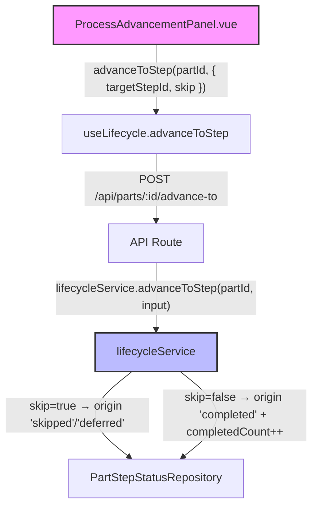
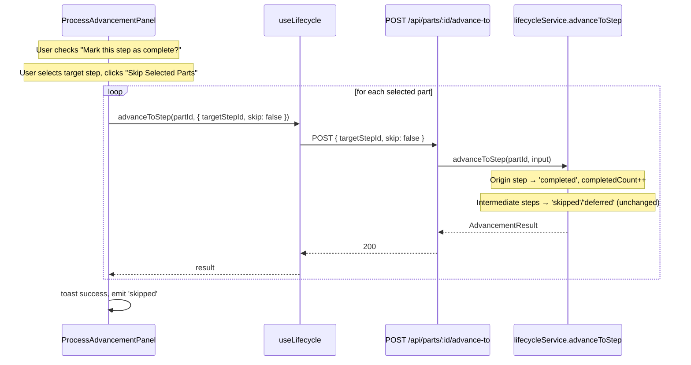
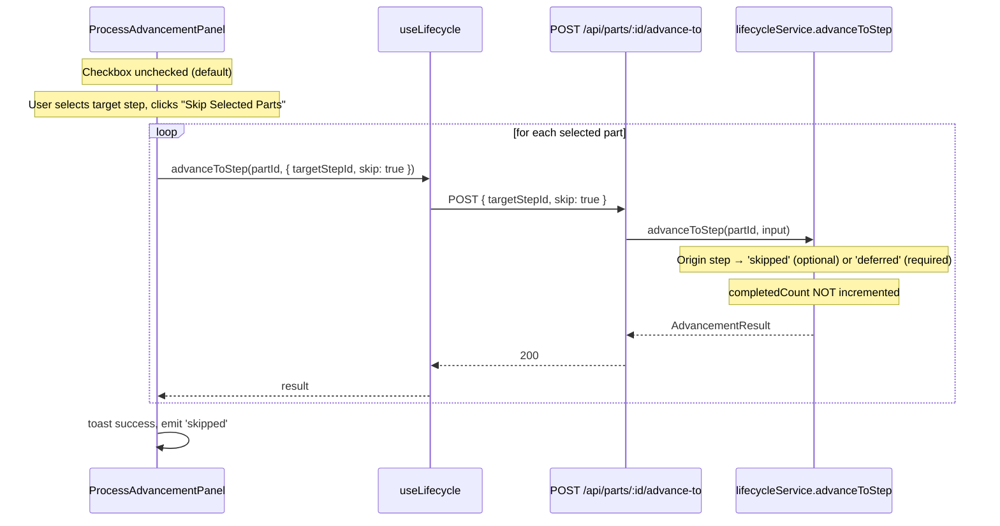

# Design Document: Skip Step Completion Toggle

## Overview

The existing "Skip Selected Parts" flow in the ProcessAdvancementPanel always passes `skip: true` to `advanceToStep()`, which marks the origin step as `'skipped'` (optional) or `'deferred'` (required). This is correct when the parts haven't actually been worked at the current step, but there's a legitimate use case where an operator has completed work at the current step and wants to jump ahead — skipping intermediate steps while still marking the origin step as completed.

This feature adds a "Mark this step as complete?" checkbox to the Advanced options section. When checked, the skip call passes `skip: false` (or omits it), causing the origin step to be marked `'completed'` with its `completedCount` incremented — the same as normal advancement, but to a non-adjacent target step. When unchecked (the default), the current behavior is preserved: origin step is marked `'skipped'` or `'deferred'`.

The change is entirely UI-driven. The `AdvanceToStepInput` type already supports `skip?: boolean`, and `lifecycleService.advanceToStep()` already branches on this flag. The only work is wiring a checkbox in the panel to control the value passed to the API.

## Architecture

No new services, endpoints, or types are needed. The change is confined to the `ProcessAdvancementPanel.vue` component, which already calls `advanceToStep()` with `skip: true` in `handleSkipSelectedParts()`. The checkbox controls whether `skip` is `true` or `false`.



## Sequence Diagrams

### Skip with Completion (checkbox checked)



### Skip without Completion (checkbox unchecked — current default)



## Components and Interfaces

### Component 1: ProcessAdvancementPanel.vue (Modified)

**Purpose**: Add a checkbox to the Advanced options section that controls the `skip` flag passed to `advanceToStep()`.

**File**: `app/components/ProcessAdvancementPanel.vue`

**Interface change**: None — the component's props and emits remain identical. The change is internal state only.

**Responsibilities**:
- Add a `markComplete` reactive boolean (default: `false`)
- Render a `UCheckbox` labeled "Mark this step as complete?" inside the Advanced options section, between the bypass preview and the "Skip Selected Parts" button
- Pass `skip: !markComplete.value` to `advanceToStep()` in `handleSkipSelectedParts()`
- Reset `markComplete` to `false` when the step changes (alongside existing `advancedOpen` and `selectedTargetStepId` resets)
- Show contextual help text explaining the two behaviors

### Component 2: lifecycleService.advanceToStep (No Changes)

**Purpose**: Already handles `skip: true` vs `skip: false/undefined` correctly.

**Current behavior**:
- `skip: true` + optional origin → status `'skipped'`, no `completedCount` increment
- `skip: true` + required origin → status `'deferred'`, no `completedCount` increment
- `skip: false/undefined` → status `'completed'`, `completedCount` incremented

No server-side changes needed.

### Component 3: AdvanceToStepInput (No Changes)

**Purpose**: Already has `skip?: boolean` field.

```typescript
export interface AdvanceToStepInput {
  targetStepId: string
  userId: string
  skip?: boolean // already exists
}
```

No type changes needed.

## Data Models

No schema, migration, or type changes required. The existing `skip?: boolean` on `AdvanceToStepInput` and the existing branching logic in `lifecycleService.advanceToStep()` already support both flows. This feature is purely a UI wiring change.

## Key Functions with Formal Specifications

### Function: handleSkipSelectedParts (Modified)

```typescript
async function handleSkipSelectedParts(): Promise<void>
```

**Preconditions:**
- `selectedTargetStepId` is a valid step ID (not the placeholder sentinel)
- `selectedParts.size > 0`
- `skipLoading` is `false`

**Postconditions:**
- For each selected part: `advanceToStep` called with `{ targetStepId, skip: !markComplete.value }`
- When `markComplete` is `true`: origin step marked `'completed'`, `completedCount` incremented
- When `markComplete` is `false`: origin step marked `'skipped'` or `'deferred'` (current behavior)
- Toast notification shown on success or failure
- `'skipped'` event emitted on success

**Loop Invariants:**
- Each part is processed exactly once, in order of `localPartIds` filtered by `selectedParts`

### Function: Checkbox state reset

```typescript
watch(() => props.job.stepId, () => {
  advancedOpen.value = false
  selectedTargetStepId.value = SELECT_NONE
  markComplete.value = false  // NEW: reset checkbox when step changes
})
```

**Preconditions:**
- `props.job.stepId` has changed (watcher triggered)

**Postconditions:**
- `advancedOpen` is `false`
- `selectedTargetStepId` is the placeholder sentinel
- `markComplete` is `false`

## Algorithmic Pseudocode

### handleSkipSelectedParts (Updated)

```typescript
async function handleSkipSelectedParts() {
  const targetId = selectedOrUndefined(selectedTargetStepId.value)
  if (!targetId || selectedParts.value.size === 0 || skipLoading.value) return

  const ids = localPartIds.value.filter((id: string) => selectedParts.value.has(id))
  skipLoading.value = true
  try {
    for (const partId of ids) {
      // KEY CHANGE: skip flag is controlled by the checkbox
      await advanceToStep(partId, {
        targetStepId: targetId,
        skip: !markComplete.value,  // false when checkbox checked → normal completion
      })
    }
    toast.add({
      title: markComplete.value ? 'Parts advanced' : 'Parts skipped',
      description: `${ids.length} part${ids.length !== 1 ? 's' : ''} ${markComplete.value ? 'completed and advanced' : 'skipped forward'}`,
      color: 'success',
    })
    emit('skipped')
  } catch (e: unknown) {
    const err = e as { data?: { message?: string }, message?: string }
    toast.add({
      title: 'Skip failed',
      description: err?.data?.message ?? err?.message ?? 'An error occurred',
      color: 'error',
    })
  } finally {
    skipLoading.value = false
  }
}
```

## Example Usage

### UI Template Addition (inside Advanced options section)

```vue
<!-- Mark complete checkbox — between bypass preview and skip button -->
<div
  v-if="hasTargetSelected"
  class="flex items-start gap-2"
>
  <UCheckbox
    v-model="markComplete"
    label="Mark this step as complete?"
  />
  <p class="text-xs text-(--ui-text-muted) mt-0.5">
    {{ markComplete
      ? 'The current step will be marked as completed before advancing.'
      : 'The current step will be marked as skipped or deferred.'
    }}
  </p>
</div>
```

### State Declaration

```typescript
// Inside <script setup>
const markComplete = ref(false)

// Reset when step changes (add to existing watcher)
watch(() => props.job.stepId, () => {
  advancedOpen.value = false
  selectedTargetStepId.value = SELECT_NONE
  markComplete.value = false
})
```

## Correctness Properties

*A property is a characteristic or behavior that should hold true across all valid executions of a system — essentially, a formal statement about what the system should do. Properties serve as the bridge between human-readable specifications and machine-verifiable correctness guarantees.*

### Property 1: Skip flag inversion

*For any* boolean state of the `markComplete` checkbox, the `skip` parameter passed to `advanceToStep` SHALL be the logical negation of `markComplete.value`. When `markComplete` is `true`, `skip` SHALL be `false`. When `markComplete` is `false`, `skip` SHALL be `true`.

**Validates: Requirements 3.1, 3.2**

### Property 2: Default and reset state

*For any* initial render or step change (change in `props.job.stepId`), the `markComplete` ref SHALL be `false`, ensuring the default behavior is to skip (not complete) the origin step.

**Validates: Requirements 2.1, 2.2, 7.1**

### Property 3: Checkbox visibility gating

*For any* state of the Advanced options section, the "Mark this step as complete?" checkbox SHALL only be visible when a target step is selected (i.e., `hasTargetSelected` is `true`).

**Validates: Requirements 1.1, 1.2**

### Property 4: Toast message reflects completion mode

*For any* successful skip operation, the toast title SHALL be "Parts advanced" when `markComplete` is `true`, and "Parts skipped" when `markComplete` is `false`.

**Validates: Requirements 5.1, 5.2**

### Property 5: Help text reflects completion mode

*For any* boolean state of the `markComplete` checkbox, the contextual help text SHALL display "The current step will be marked as completed before advancing." when checked, and "The current step will be marked as skipped or deferred." when unchecked.

**Validates: Requirements 4.1, 4.2**

## Error Handling

### Error Scenario 1: Skip with completion on a step that can't advance

**Condition**: User checks "Mark this step as complete?" and clicks "Skip Selected Parts", but the part is already completed or scrapped.
**Response**: `lifecycleService.advanceToStep()` throws `ValidationError`. The catch block in `handleSkipSelectedParts` shows an error toast.
**Recovery**: No state change. User can retry or uncheck the box.

### Error Scenario 2: Partial batch failure

**Condition**: Some parts succeed and some fail during the skip loop.
**Response**: Current behavior — the loop continues until the first error, then the catch block fires. Successfully advanced parts are not rolled back.
**Recovery**: User refreshes the step view to see which parts moved and which remain.

## Testing Strategy

### Unit Testing Approach

- Verify `markComplete` defaults to `false` on mount
- Verify `markComplete` resets to `false` when `props.job.stepId` changes
- Verify `handleSkipSelectedParts` passes `skip: !markComplete.value` to `advanceToStep`
- Verify checkbox is only rendered when `hasTargetSelected` is `true`
- Verify checkbox is only visible to admin users (inside the `v-if="isAdmin"` block)

### Property-Based Testing Approach

**Property Test Library**: fast-check

- **CP-SSCT-1: Skip flag inversion** — For any boolean value of `markComplete`, the `skip` parameter passed to `advanceToStep` is `!markComplete`.
- **CP-SSCT-2: Default state** — After any step change, `markComplete` is always `false`.

### Integration Testing Approach

- End-to-end: check "Mark this step as complete?", skip to a future step, verify origin step has status `'completed'` and `completedCount` incremented.
- End-to-end: leave checkbox unchecked, skip to a future step, verify origin step has status `'skipped'` (optional) or `'deferred'` (required) and `completedCount` unchanged.

## Performance Considerations

No performance impact. This adds a single reactive boolean and a checkbox to an already-rendered section. No additional API calls.

## Security Considerations

The checkbox is inside the `v-if="isAdmin"` block, so only admin users can access it. The server-side `advanceToStep` already validates the `skip` flag independently — there's no privilege escalation risk from toggling this value.

## Dependencies

No new dependencies. Uses existing `UCheckbox` from Nuxt UI 4.3.0 and existing `advanceToStep` from `useLifecycle`.

## UI Layout

### Updated Advanced Options Section

```
┌─────────────────────────────────────────────────┐
│ ▾ Advanced options                              │
│ ┌─────────────────────────────────────────────┐ │
│ │  Skip to: [▼ Shipping → Dock C         ]   │ │
│ │                                             │ │
│ │  ⚠ 2 steps will be bypassed:               │ │
│ │  ┌───────────────────────────────────────┐  │ │
│ │  │ Heat Treatment        [Skip]         │  │ │
│ │  │ QC Inspection         [Defer]        │  │ │
│ │  └───────────────────────────────────────┘  │ │
│ │  ⚠ Required steps will be deferred...      │ │
│ │                                             │ │
│ │  ☐ Mark this step as complete?              │ │  ← NEW
│ │  The current step will be marked as         │ │
│ │  skipped or deferred.                       │ │
│ │                                             │ │
│ │  [⏭ Skip Selected Parts]                   │ │
│ └─────────────────────────────────────────────┘ │
└─────────────────────────────────────────────────┘
```

When checked:

```
│ │  ☑ Mark this step as complete?              │ │
│ │  The current step will be marked as         │ │
│ │  completed before advancing.                │ │
```
