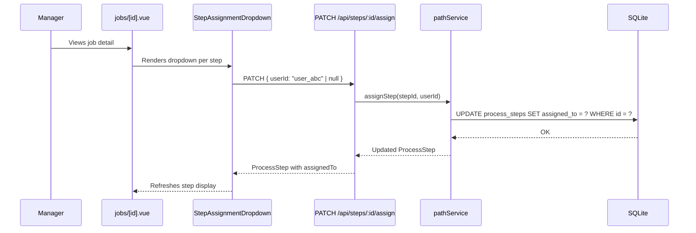
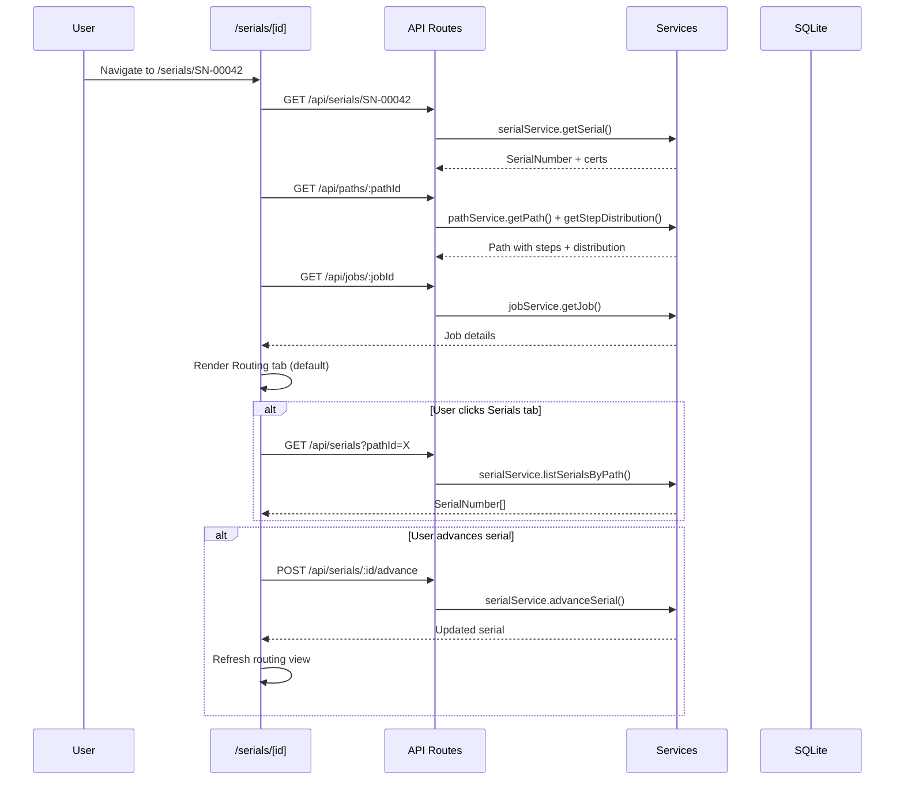
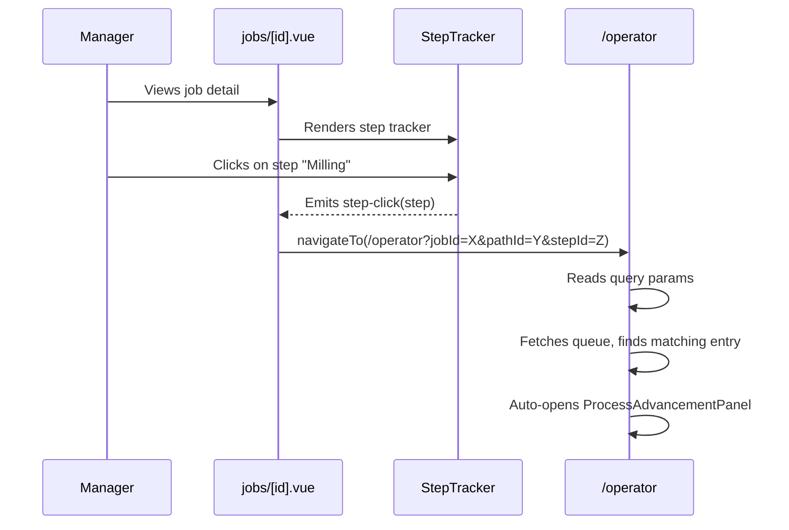

# Design Document: Step Assignment and Part Views

## Overview

This feature adds four interconnected capabilities to Shop Planr:

1. **Step Assignment** — A new `assigned_to` column on `process_steps` (migration 003), an assignment API on `pathService`, and a searchable dropdown UI on the job detail page. "Unassigned" is a first-class concept (NULL in DB, always visible in dropdown).

2. **Part Detail Page** — A tabbed page at `/serials/[id]` with a Routing tab (step tracker, assignments, distribution, advancement panel) and a Serials tab (table of all SNs for the same job/path).

3. **Clickable Job Steps** — `StepTracker` steps become links that navigate to `/operator?jobId=X&pathId=Y&stepId=Z`, pre-selecting the matching work queue entry.

4. **Serial Number Browser** — A `/serials` page with a searchable, filterable, sortable table of all serial numbers, with navigation to part detail pages.

### Key Design Decisions

1. **`assigned_to` as nullable TEXT on `process_steps`** — Simple FK to `users.id`. NULL = Unassigned. No join table needed since each step has at most one assignee.
2. **Assignment lives in `pathService`** — No new service. `pathService` already owns steps; adding `assignStep(stepId, userId | null)` keeps the domain boundary clean.
3. **No new repository interface** — The `process_steps` table is managed by `PathRepository`. We add an `updateStepAssignment(stepId, userId)` method to the existing `PathRepository` interface.
4. **Client-side filtering for serial browser** — The serial dataset is small enough (hundreds to low thousands) that fetching all serials with enriched data and filtering client-side avoids complex server-side query composition. A new enriched endpoint returns serials with job/path/step names pre-joined.
5. **Reuse `ProcessAdvancementPanel`** — The part detail page reuses the existing advancement panel component, constructing a `WorkQueueJob`-shaped object from the serial's context.
6. **Query param navigation for step clicks** — StepTracker emits a click event; the job detail page navigates to `/operator?jobId=X&pathId=Y&stepId=Z`. The operator page reads query params on mount and auto-selects the matching queue entry.

## Architecture

The feature extends the existing layered architecture without introducing new layers:

```
Pages/Components → Composables → API Routes → Services → Repositories → SQLite
```

### Step Assignment Flow



### Part Detail Page Flow



### Clickable Step Navigation Flow



## Components and Interfaces

### New Files

| File | Type | Purpose |
|------|------|---------|
| `server/repositories/sqlite/migrations/003_add_step_assignment.sql` | Migration | Adds `assigned_to` column to `process_steps` |
| `app/components/StepAssignmentDropdown.vue` | Component | Searchable dropdown for assigning operators to steps |
| `app/pages/serials/[id].vue` | Page | Part detail page with Routing and Serials tabs |
| `app/pages/serials/index.vue` | Page | Serial number browser with search/filter/sort |
| `app/composables/useSerialBrowser.ts` | Composable | Manages serial browser state (fetch, search, filter, sort) |
| `app/composables/usePartDetail.ts` | Composable | Fetches and composes data for the part detail page |
| `server/api/steps/[id]/assign.patch.ts` | API Route | Step assignment endpoint |
| `server/api/serials/index.get.ts` | API Route | List all serials with enriched data (job/path/step names) |

### Modified Files

| File | Change |
|------|--------|
| `server/types/domain.ts` | Add optional `assignedTo?: string` to `ProcessStep` |
| `server/types/computed.ts` | Add `EnrichedSerial` type for browser listing |
| `server/repositories/interfaces/pathRepository.ts` | Add `updateStepAssignment(stepId, userId)` method |
| `server/repositories/sqlite/pathRepository.ts` | Implement `updateStepAssignment` |
| `server/services/pathService.ts` | Add `assignStep(stepId, userId)` method |
| `app/components/StepTracker.vue` | Add click handler, emit `step-click` event, cursor pointer styling |
| `app/pages/jobs/[id].vue` | Handle `step-click` → navigate to operator page; render `StepAssignmentDropdown` per step |
| `app/pages/operator.vue` | Read query params on mount, auto-select matching queue entry |
| `app/composables/useSerials.ts` | Add `listAllSerials()` and `listSerialsByPath()` methods |
| `server/services/serialService.ts` | Add `listAllSerials()` method |
| `server/repositories/interfaces/serialRepository.ts` | Add `listAll()` method |
| `server/repositories/sqlite/serialRepository.ts` | Implement `listAll()` |

### Interfaces

#### `StepAssignmentDropdown` component

```typescript
// Props
interface StepAssignmentDropdownProps {
  stepId: string
  currentAssignee?: string  // user ID or undefined for Unassigned
  users: ShopUser[]         // active users list
}

// Emits
interface StepAssignmentDropdownEmits {
  assigned: [stepId: string, userId: string | null]
}
```

#### `assignStep` service method

```typescript
// Added to pathService
assignStep(stepId: string, userId: string | null): ProcessStep
```

#### `PATCH /api/steps/:id/assign` request/response

```typescript
// Request body
interface AssignStepInput {
  userId: string | null  // null = unassign
}

// Response: ProcessStep (with assignedTo field)
```

#### `GET /api/serials` response (enriched listing)

```typescript
interface EnrichedSerial {
  id: string
  jobId: string
  jobName: string
  pathId: string
  pathName: string
  currentStepIndex: number
  currentStepName: string  // "Completed" when index = -1
  assignedTo?: string      // user name at current step, if any
  status: 'in-progress' | 'completed'
  createdAt: string
}
```

#### `useSerialBrowser` composable

```typescript
function useSerialBrowser(): {
  serials: Readonly<Ref<EnrichedSerial[]>>
  loading: Readonly<Ref<boolean>>
  error: Readonly<Ref<string | null>>
  searchQuery: Ref<string>
  filters: Ref<SerialBrowserFilters>
  sortColumn: Ref<string>
  sortDirection: Ref<'asc' | 'desc'>
  filteredSerials: ComputedRef<EnrichedSerial[]>
  totalCount: ComputedRef<number>
  filteredCount: ComputedRef<number>
  fetchSerials(): Promise<void>
  setSort(column: string): void
}

interface SerialBrowserFilters {
  jobName?: string
  pathName?: string
  stepName?: string
  status?: 'in-progress' | 'completed' | 'all'
  assignee?: string  // user name or 'Unassigned'
}
```

#### `usePartDetail` composable

```typescript
function usePartDetail(serialId: string): {
  serial: Readonly<Ref<SerialNumber | null>>
  job: Readonly<Ref<Job | null>>
  path: Readonly<Ref<Path | null>>
  distribution: Readonly<Ref<StepDistribution[]>>
  siblingSerials: Readonly<Ref<SerialNumber[]>>
  loading: Readonly<Ref<boolean>>
  error: Readonly<Ref<string | null>>
  fetchDetail(): Promise<void>
  fetchSiblings(): Promise<void>
  refreshAfterAdvance(): Promise<void>
}
```

## Data Models

### Database Schema Change — Migration 003

```sql
-- 003_add_step_assignment.sql
-- Add assigned_to column to process_steps for operator assignment

ALTER TABLE process_steps ADD COLUMN assigned_to TEXT REFERENCES users(id);

CREATE INDEX IF NOT EXISTS idx_process_steps_assigned_to ON process_steps(assigned_to);
```

The `assigned_to` column is nullable TEXT. NULL = Unassigned. The FK reference to `users(id)` ensures referential integrity.

### Domain Type Change

```typescript
// Updated ProcessStep in server/types/domain.ts
export interface ProcessStep {
  id: string
  name: string
  order: number
  location?: string
  assignedTo?: string  // NEW: user ID or undefined for Unassigned
}
```

### New Computed Type

```typescript
// Added to server/types/computed.ts
export interface EnrichedSerial {
  id: string
  jobId: string
  jobName: string
  pathId: string
  pathName: string
  currentStepIndex: number
  currentStepName: string
  assignedTo?: string
  status: 'in-progress' | 'completed'
  createdAt: string
}
```

### Repository Interface Change

```typescript
// Added to PathRepository
updateStepAssignment(stepId: string, userId: string | null): ProcessStep
getStepById(stepId: string): ProcessStep | null
```

### Existing Data Unaffected

The `ALTER TABLE ADD COLUMN` migration sets the default to NULL for all existing rows, which correctly represents "Unassigned" — no data backfill needed.


## Correctness Properties

*A property is a characteristic or behavior that should hold true across all valid executions of a system — essentially, a formal statement about what the system should do. Properties serve as the bridge between human-readable specifications and machine-verifiable correctness guarantees.*

### Property 1: Step assignment round-trip

*For any* ProcessStep and any active ShopUser, assigning that user to the step and then reading the step back should return a ProcessStep with `assignedTo` equal to the assigned user's ID. Similarly, *for any* ProcessStep with an existing assignment, assigning `null` and reading back should return a ProcessStep with `assignedTo` undefined.

**Validates: Requirements 1.5, 2.1, 2.2, 2.5**

### Property 2: Invalid assignment rejection

*For any* string that does not correspond to an active ShopUser ID (and is not null), calling `assignStep` with that string should throw a ValidationError. The step's `assigned_to` value should remain unchanged.

**Validates: Requirements 1.2, 1.3, 2.3**

### Property 3: Non-existent step assignment error

*For any* string that does not correspond to an existing ProcessStep ID, calling `assignStep` should throw a NotFoundError.

**Validates: Requirements 2.4**

### Property 4: Dropdown option list with search filtering

*For any* list of active ShopUsers and any search string, the filtered dropdown options should contain "Unassigned" as the first element, followed by exactly those users whose name contains the search string as a case-insensitive substring. When the search string is empty, all users should appear after "Unassigned".

**Validates: Requirements 3.2, 3.3**

### Property 5: Serial status derivation

*For any* SerialNumber, if `currentStepIndex` equals -1 then the derived status should be `'completed'`, otherwise the derived status should be `'in-progress'`. The advancement panel should be shown if and only if the status is `'in-progress'`.

**Validates: Requirements 4.7, 5.4**

### Property 6: Step navigation URL round-trip

*For any* job ID, path ID, and step ID, constructing a navigation URL with these as query parameters and then parsing the query parameters from that URL should yield the original job ID, path ID, and step ID. Furthermore, *for any* work queue containing a matching entry, the matching logic should find exactly that entry.

**Validates: Requirements 6.2, 6.3**

### Property 7: Serial enrichment completeness

*For any* SerialNumber in the system with associated Job, Path, and ProcessSteps, the enriched serial object should contain: a non-empty `id`, a non-empty `jobName`, a non-empty `pathName`, a non-empty `currentStepName` (or "Completed" when `currentStepIndex` is -1), a valid `status` of either `'in-progress'` or `'completed'`, and a non-empty `createdAt`.

**Validates: Requirements 7.3, 11.2**

### Property 8: Serial search filter correctness

*For any* search query string and any list of EnrichedSerials, the filtered result should contain exactly those serials whose `id` contains the query as a case-insensitive substring. When the query is empty, the result should equal the original list.

**Validates: Requirements 8.2**

### Property 9: Serial multi-filter AND logic

*For any* combination of filter criteria (jobName, pathName, stepName, status, assignee) and any list of EnrichedSerials, the filtered result should contain exactly those serials matching ALL active (non-empty) filter criteria simultaneously. When the assignee filter is "Unassigned", only serials with `assignedTo` undefined/null should pass. When all filters are empty/cleared, the result should equal the original list.

**Validates: Requirements 9.2, 9.3**

### Property 10: Serial sort correctness

*For any* list of EnrichedSerials and any valid sort column (id, jobName, currentStepName, status, createdAt), sorting in ascending order should produce a list where each element is less than or equal to the next element by that column's value. Sorting in descending order should produce the reverse. Toggling sort direction on the same column should reverse the order.

**Validates: Requirements 10.1, 10.2, 10.3, 11.5**

### Property 11: Sibling serial filtering

*For any* SerialNumber with a given `jobId` and `pathId`, the sibling serial list should contain exactly those SerialNumbers in the system that share the same `jobId` and `pathId`, including the current serial itself.

**Validates: Requirements 11.1**

### Property 12: Serial summary counts

*For any* list of SerialNumbers, the summary counts should satisfy: `totalCount` equals the list length, `completedCount` equals the number of serials with `currentStepIndex === -1`, `inProgressCount` equals the number of serials with `currentStepIndex >= 0`, and `completedCount + inProgressCount === totalCount`.

**Validates: Requirements 11.6**

## Error Handling

| Scenario | Layer | Behavior |
|----------|-------|----------|
| Assign non-existent user to step | `pathService` → API 400 | Return ValidationError: "User not found or inactive" |
| Assign to non-existent step | `pathService` → API 404 | Return NotFoundError: "ProcessStep not found" |
| Assignment API call fails | `StepAssignmentDropdown` | Show error toast, revert dropdown to previous value |
| Serial not found on part detail page | `serialService` → API 404 | Show "Serial not found" error with back link |
| Path/Job fetch fails on part detail | `usePartDetail` | Show error message with retry button |
| Serial advancement fails (already completed) | `serialService` → API 400 | Show toast, refresh page to reflect current state |
| Serial browser fetch fails | `useSerialBrowser` | Show error state with retry button |
| Operator page receives invalid query params | `operator.vue` | Ignore params, show normal queue (no auto-select) |
| Operator page query params match no queue entry | `operator.vue` | Show queue list normally, no auto-select |
| Step click on step with 0 parts | `StepTracker` → `operator.vue` | Navigate to operator page; queue shows entry only if parts exist at that step |

### Error Recovery Patterns

- **Optimistic UI with rollback**: The `StepAssignmentDropdown` updates the display immediately on selection, then calls the API. On failure, it reverts to the previous value and shows an error toast.
- **Retry on fetch failure**: All data-fetching composables expose an `error` ref and support re-calling the fetch function.
- **Graceful degradation for query params**: The operator page treats query params as hints — if they don't match any queue entry, the page works normally without auto-selection.

## Testing Strategy

### Property-Based Testing

Library: `fast-check` (already installed)
Minimum iterations: 100 per property

Each property test will be tagged with:
```
Feature: step-assignment-and-part-views, Property {N}: {title}
```

Property tests will live in `tests/properties/` following the existing pattern:

| File | Properties |
|------|-----------|
| `stepAssignment.property.test.ts` | P1: Assignment round-trip, P2: Invalid assignment rejection, P3: Non-existent step error |
| `dropdownFilter.property.test.ts` | P4: Dropdown option list with search filtering |
| `serialEnrichment.property.test.ts` | P5: Status derivation, P7: Enrichment completeness, P12: Summary counts |
| `serialBrowser.property.test.ts` | P8: Search filter, P9: Multi-filter AND logic, P10: Sort correctness |
| `stepNavigation.property.test.ts` | P6: URL round-trip |
| `siblingSerials.property.test.ts` | P11: Sibling serial filtering |

### Unit Tests

Focus on specific examples and edge cases:

- Migration 003 adds `assigned_to` column successfully
- Assigning "Unassigned" (null) to an already-unassigned step is a no-op
- Part detail page for a completed serial (index = -1) shows "Completed" status and hides advancement panel
- Enriched serial for a serial at step 0 of a 3-step path shows correct step name
- Search with empty string returns all serials
- Filter with all criteria empty returns all serials
- Sort by `createdAt` handles identical timestamps gracefully
- Sibling list for a serial includes itself
- Summary counts for an empty list are all zero
- Operator page with no query params shows normal queue
- Operator page with query params matching a queue entry auto-selects it

### Integration Tests

End-to-end tests using temp SQLite databases (existing pattern in `tests/integration/`):

- Full assignment workflow: create job → create path with steps → assign user to step → verify step has assignedTo → unassign → verify null
- Serial enrichment: create job/path/serials → fetch enriched list → verify all fields populated
- Sibling serials: create job with path and multiple serials → fetch siblings for one serial → verify all siblings returned
- Assignment with advancement: assign step → advance serial → verify assignment persists on the step

### Test Configuration

- Each property-based test: minimum 100 runs via `fc.assert(..., { numRuns: 100 })`
- Each property test references its design property number in a comment
- Integration tests use `createTestContext()` helper from `tests/integration/helpers.ts`
- Each correctness property is implemented by a single property-based test
