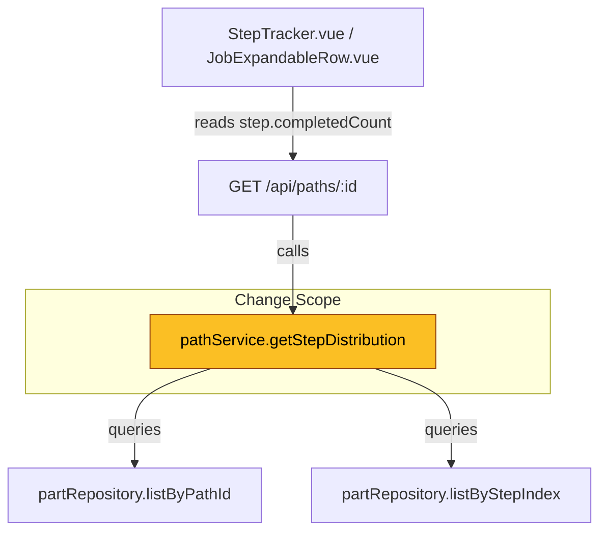
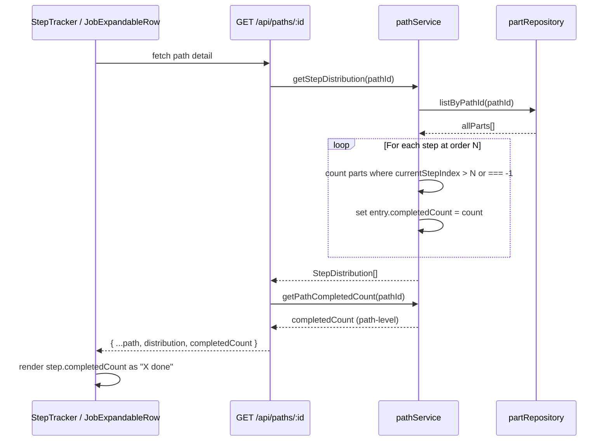

# Design Document: Step Done Count Fix

## Overview

This design addresses **GitHub Issue #50**: "Step 'Done' count does not accurately reflect completed parts." In the current implementation, `getStepDistribution()` in `pathService.ts` hardcodes `completedCount: 0` for every `StepDistribution` entry. The frontend `StepTracker.vue` and `JobExpandableRow.vue` components display this value as "X done" on each step card, meaning operators always see "0 done" regardless of how many parts have actually completed that step.

The fix redefines what "done" means at the step level: for a given step at order `N`, the done count is the number of non-scrapped parts whose `currentStepIndex > N` (they have moved past this step) **plus** parts with `currentStepIndex === -1` (fully completed the path). This gives operators an accurate, at-a-glance count of how many parts have finished processing at each step.

This is a follow-up to the **Path "Done" total fix (GitHub Issue #24)**, which corrected the path-level completed count. That fix intentionally zeroed out per-step `completedCount` to stop a multiplication bug. This issue now provides the correct per-step value.

## Architecture

The fix is confined to the service layer and requires no schema changes, no new API routes, and no frontend modifications (the UI already renders `step.completedCount`).





## Components and Interfaces

### Component: pathService.getStepDistribution()

**Purpose**: Computes per-step part distribution for a path, including how many parts are currently at each step, how many have completed each step, and which step is the bottleneck.

**Current Interface** (unchanged):
```typescript
getStepDistribution(pathId: string, prefetchedPath?: Path): StepDistribution[]
```

**StepDistribution type** (unchanged):
```typescript
interface StepDistribution {
  stepId: string
  stepName: string
  stepOrder: number
  location?: string
  partCount: number        // parts currently AT this step
  completedCount: number   // parts that have PASSED this step (the fix)
  isBottleneck: boolean
}
```

**Responsibilities**:
- Fetch all non-scrapped parts for the path in a single query
- For each step at order `N`, compute `completedCount` as the number of parts with `currentStepIndex > N` (including `currentStepIndex === -1` which represents fully completed)
- Identify bottleneck steps (highest `partCount`)

### Component: partRepository (no changes needed)

The existing `listByPathId(pathId)` method returns all parts for a path. The `listByStepIndex` method filters by exact step index. For the fix, we use `listByPathId` to get all parts once, then compute counts in-memory — avoiding N+1 queries.

### Component: StepTracker.vue / JobExpandableRow.vue (no changes needed)

Both components already render `step.completedCount`. Once the service returns correct values, the UI will display them automatically.

## Data Models

No schema changes required. The fix operates on existing data:

```typescript
// Part (from domain.ts) — relevant fields only
interface Part {
  id: string
  pathId: string
  currentStepIndex: number  // -1 = completed all steps
  status: 'in-progress' | 'completed' | 'scrapped'
}

// StepDistribution (from computed.ts) — no changes
interface StepDistribution {
  stepId: string
  stepName: string
  stepOrder: number
  location?: string
  partCount: number       // parts currently AT this step
  completedCount: number  // parts that have PASSED this step
  isBottleneck: boolean
}
```

**Key invariant**: For any step at order `N` in a path with `S` total steps:
- `completedCount(step_N)` ≥ `completedCount(step_{N+1})` (monotonically non-increasing from first to last step)
- `completedCount(step_0)` ≥ `completedCount(step_{S-1})` (first step always has the highest or equal done count)
- `completedCount(step_{S-1})` = `getPathCompletedCount(pathId)` (last step's done count equals path-level completed count)

## Key Functions with Formal Specifications

### Function: getStepDistribution()

```typescript
getStepDistribution(pathId: string, prefetchedPath?: Path): StepDistribution[]
```

**Preconditions:**
- `pathId` references an existing path in the repository
- If `prefetchedPath` is provided, it must match the path for `pathId`

**Postconditions:**
- Returns one `StepDistribution` entry per step in the path, ordered by `stepOrder`
- For each entry at order `N`: `completedCount` = count of non-scrapped parts where `currentStepIndex > N` (note: `currentStepIndex === -1` satisfies `> N` for all non-negative `N` in JS since `-1 > N` is false — so completed parts must be counted separately, see algorithm below)
- `partCount` = count of non-scrapped parts where `currentStepIndex === N`
- `isBottleneck` = true iff `partCount` equals the maximum `partCount` across all steps (and max > 0)
- The last step's `completedCount` equals the path-level completed count (`currentStepIndex === -1`)

**Loop Invariants:**
- After processing step `i`, all entries `0..i` have correct `completedCount` values
- The `allParts` array is never mutated

### Function: computeStepDoneCount() (new pure helper)

```typescript
function computeStepDoneCount(stepOrder: number, totalSteps: number, allParts: Part[]): number
```

**Preconditions:**
- `stepOrder` is in range `[0, totalSteps - 1]`
- `allParts` contains only non-scrapped parts for the path

**Postconditions:**
- Returns the count of parts in `allParts` where `currentStepIndex > stepOrder` OR `currentStepIndex === -1`
- Equivalently: parts that have moved beyond this step (either to a later step or fully completed)

## Algorithmic Pseudocode

### Step Done Count Computation

```typescript
function getStepDistribution(pathId: string, prefetchedPath?: Path): StepDistribution[] {
  const path = prefetchedPath ?? repos.paths.getById(pathId)
  if (!path) throw new NotFoundError('Path', pathId)

  // Single query: fetch all non-scrapped parts for this path
  const allParts = repos.parts.listByPathId(pathId)
    .filter(p => p.status !== 'scrapped')

  const distribution: StepDistribution[] = path.steps.map((step) => {
    // Parts currently AT this step
    const partCount = allParts.filter(p => p.currentStepIndex === step.order).length

    // Parts that have PASSED this step:
    //   currentStepIndex > step.order (at a later step)
    //   OR currentStepIndex === -1 (fully completed the path)
    const completedCount = allParts.filter(p =>
      p.currentStepIndex === -1 || p.currentStepIndex > step.order
    ).length

    return {
      stepId: step.id,
      stepName: step.name,
      stepOrder: step.order,
      location: step.location,
      partCount,
      completedCount,
      isBottleneck: false,
    }
  })

  // Determine bottleneck: step(s) with highest partCount
  let maxCount = 0
  for (const entry of distribution) {
    if (entry.partCount > maxCount) maxCount = entry.partCount
  }
  if (maxCount > 0) {
    for (const entry of distribution) {
      if (entry.partCount === maxCount) entry.isBottleneck = true
    }
  }

  return distribution
}
```

**Preconditions:**
- `pathId` references a valid path
- Repository methods are available and functional

**Postconditions:**
- Each step's `completedCount` accurately reflects parts that have passed through it
- `completedCount` values are monotonically non-increasing from first to last step
- Last step's `completedCount` equals the count of fully completed parts (stepIndex === -1)
- No N+1 query problem: parts are fetched once via `listByPathId`

**Loop Invariants:**
- `allParts` is read-only throughout the computation
- Each step's counts are computed independently from the same `allParts` snapshot

## Example Usage

```typescript
// Given: a 3-step path with 10 parts
// - 2 parts at step 0 (Cutting)
// - 3 parts at step 1 (Welding)
// - 1 part at step 2 (Painting)
// - 4 parts completed (stepIndex === -1)

const distribution = pathService.getStepDistribution(pathId)

// Step 0 (Cutting):  partCount=2, completedCount=8  (3+1+4 passed this step)
// Step 1 (Welding):  partCount=3, completedCount=5  (1+4 passed this step)
// Step 2 (Painting): partCount=1, completedCount=4  (4 passed this step)

const pathCompleted = pathService.getPathCompletedCount(pathId)
// pathCompleted === 4 (matches last step's completedCount)

// Monotonicity invariant holds: 8 >= 5 >= 4
```

## Correctness Properties

The following properties must hold for all valid path states:

**CP-STEP-DONE-1: Step done count accuracy**
```
∀ path, ∀ step_i in path.steps:
  getStepDistribution(path.id)[i].completedCount ===
    count(parts where (currentStepIndex > step_i.order OR currentStepIndex === -1)
          AND status !== 'scrapped')
```

**CP-STEP-DONE-2: Monotonic non-increasing done counts**
```
∀ path with steps [s_0, s_1, ..., s_N]:
  completedCount(s_0) >= completedCount(s_1) >= ... >= completedCount(s_N)
```

**CP-STEP-DONE-3: Last step done count equals path completed count**
```
∀ path with steps [s_0, ..., s_N]:
  getStepDistribution(path.id)[N].completedCount === getPathCompletedCount(path.id)
```

**CP-STEP-DONE-4: Count conservation (extended)**
```
∀ path:
  sum(distribution[i].partCount for all i) + getPathCompletedCount(path.id) ===
    count(non-scrapped parts on path)
```
This extends the existing CP-4 (count conservation) property and must continue to hold.

## Error Handling

### Error Scenario: Path not found

**Condition**: `pathId` does not exist in the repository
**Response**: Throws `NotFoundError('Path', pathId)` — unchanged from current behavior
**Recovery**: API route catches and returns 404

### Error Scenario: No parts on path

**Condition**: Path exists but has zero parts
**Response**: Returns distribution with `partCount: 0` and `completedCount: 0` for all steps — correct behavior, no special handling needed

## Testing Strategy

### Unit Testing Approach

Update existing `pathService.test.ts` tests in the `getStepDistribution` describe block:
- Change assertions from `completedCount === 0` to the correct computed values
- Add test case: parts at various stages produce correct per-step done counts
- Add test case: all parts completed → all steps have `completedCount === totalParts`
- Add test case: no parts completed → all steps have `completedCount === 0`

### Property-Based Testing Approach

**Property Test Library**: fast-check

Update existing `pathDoneCount.property.test.ts`:
- **CP-DONE-2 must be updated**: Currently asserts `completedCount === 0` for all entries. Must be changed to assert the correct computed value (parts past that step).
- **New property CP-STEP-DONE-2**: Monotonic non-increasing done counts across steps.
- **New property CP-STEP-DONE-3**: Last step's done count equals `getPathCompletedCount`.

### Integration Testing Approach

Update existing `progressTracking.test.ts`:
- Change assertions from `completedCount === 0` to correct values based on the test scenario
- Verify the old multiplication bug (Issue #24) is still prevented: the sum of `completedCount` across steps should NOT be used as the path-level total (they are intentionally different numbers now)

## Performance Considerations

The fix replaces per-step `listByStepIndex` calls with a single `listByPathId` call followed by in-memory filtering. This is a net improvement:
- **Before**: `N` queries (one `listByStepIndex` per step) + hardcoded 0
- **After**: 1 query (`listByPathId`) + in-memory filter per step

For paths with many parts (hundreds), the in-memory filtering is negligible compared to the eliminated N-1 database round-trips.

## Coding Standards Compliance

Per `.kiro/steering/coding-standards.md`:

- **Fix root causes, not symptoms**: The fix addresses the hardcoded `completedCount: 0` in the service layer where the computation belongs — not patching the UI or API route.
- **Architecture layers**: All logic stays in the service layer (`pathService`). No business logic in API routes or components. The UI already renders `step.completedCount` — no frontend changes needed.
- **No type weakening**: The `StepDistribution` interface is unchanged. No `any` types introduced.
- **Server imports**: The algorithm uses only relative imports and auto-imported Nitro utilities (`NotFoundError`). No `~` paths in server code.
- **Scrapped part exclusion**: `listByPathId()` returns ALL parts (including scrapped), unlike `listByStepIndex()` which has `AND status != 'scrapped'` in its SQL. The design explicitly filters scrapped parts in-memory after the single query to maintain consistency with the existing behavior where scrapped parts are excluded from step counts.

## Dependencies

No new dependencies. The fix uses only existing:
- `partRepository.listByPathId()` — already available and used elsewhere
- `Part.currentStepIndex` and `Part.status` — existing domain fields
