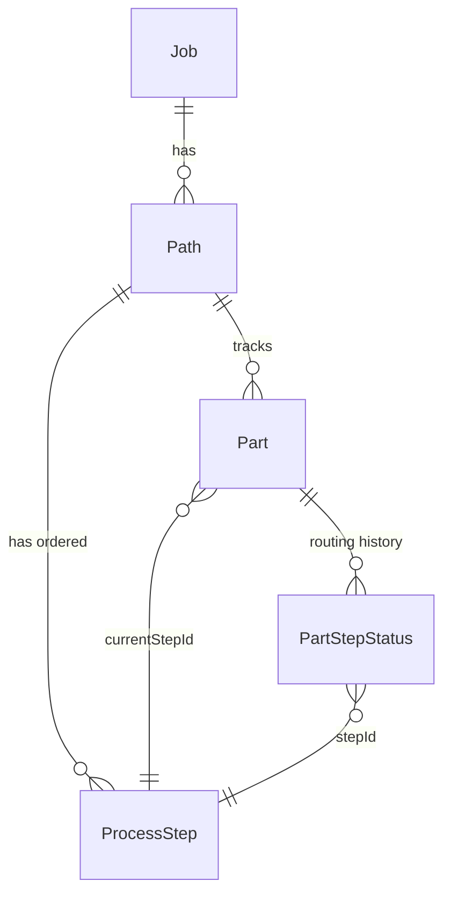

# Design Document: Step-ID-Based Part Tracking

## Overview

This feature replaces the integer-based `currentStepIndex` position tracking on the `Part` domain type with a `currentStepId` (TEXT FK to `process_steps`) reference. This decouples a part's physical location from the ordering of steps in its path, so that reordering steps never virtually relocates parts.

Additionally, the `part_step_statuses` table is overhauled to support a full routing history: the `UNIQUE(part_id, step_id)` constraint is removed and a `sequence_number` column is added, enabling multiple visits to the same step (recycling). The `reconcileSteps` function is updated to match by step ID instead of position. All queries, APIs, and frontend references are migrated from index-based to ID-based tracking.

### Key Design Decisions

1. **`currentStepId` replaces `currentStepIndex`** — NULL means completed (equivalent to old `-1`). This is a TEXT column with an FK to `process_steps(id)`.
2. **Routing history is append-only** — Each step visit creates a new `part_step_statuses` row with an incrementing `sequence_number`. The "current" status for a step is always the row with the highest sequence number.
3. **`reconcileSteps` matches by ID** — The `StepInput` type gains an optional `id` field. When present, the function matches by ID regardless of position. When absent, a new step is inserted.
4. **Next-step resolution uses `order`** — Advancement finds the step whose `order` is one greater than the current step's order in the path, rather than using array index arithmetic.
5. **Migration is a single SQL file (007)** — Adds `current_step_id`, backfills from existing index data, drops `current_step_index`.
6. **Steps added behind active parts don't block advancement** — When a new step is inserted at an order before a part's current position, the part continues forward normally. The unvisited step shows as `'na'` (displayed as "N/A") in the full route. This is a deliberate non-blocking design — backward movement and recycling through unvisited steps are future enhancements.
7. **Step removal is a soft-delete** — When a step is removed from a path, the `process_steps` row is preserved with a `removed_at` timestamp. This keeps FK references from routing history, certs, and notes intact. The step is excluded from active routing but remains in the historical record. Removal is blocked if any active part has `currentStepId` pointing to the step.

## Architecture

The change touches every layer of the stack but preserves the existing architecture:

```
Frontend (Vue pages/composables)
  ↓ uses currentStepId instead of currentStepIndex
API Routes (server/api/)
  ↓ passes step IDs, not indexes
Services (partService, lifecycleService, pathService)
  ↓ all advancement/query logic uses step IDs
Repositories (partRepository, partStepStatusRepository)
  ↓ new query methods, updated schema
SQLite (migration 007)
```

### Affected Layers

| Layer | Files | Change |
|-------|-------|--------|
| Domain types | `server/types/domain.ts` | `Part.currentStepId` replaces `currentStepIndex` |
| API types | `server/types/api.ts` | `AdvanceToStepInput.targetStepId` replaces `targetStepIndex` |
| Computed types | `server/types/computed.ts` | `EnrichedPart.currentStepId`, remove `currentStepIndex` |
| Part repository | `server/repositories/sqlite/partRepository.ts` | Add `listByCurrentStepId()`, remove `listByStepIndex()`, update row mapping, `countCompletedByJobId` uses `current_step_id IS NULL` instead of `current_step_index = -1` |
| Part repo interface | `server/repositories/interfaces/partRepository.ts` | Replace `listByStepIndex` with `listByCurrentStepId` |
| Part step status repo | `server/repositories/sqlite/partStepStatusRepository.ts` | Support `sequence_number`, multi-row per part+step, `getLatestByPartAndStep()` |
| Part step status interface | `server/repositories/interfaces/partStepStatusRepository.ts` | Add `getLatestByPartAndStep()`, `getNextSequenceNumber()` |
| Part service | `server/services/partService.ts` | `advancePart` uses step ID, `listPartsByStepIndex` → `listPartsByCurrentStepId` |
| Lifecycle service | `server/services/lifecycleService.ts` | All advancement logic uses step IDs, routing history entries with sequence numbers |
| Path service | `server/services/pathService.ts` | `reconcileSteps` accepts optional `id` in `StepInput`, matches by ID |
| Step view API | `server/api/operator/step/[stepId].get.ts` | Query by `currentStepId` instead of step index |
| Work queue API | `server/api/operator/work-queue.get.ts` | Query by `currentStepId` |
| Frontend pages | `app/pages/parts-browser/[id].vue`, `app/pages/parts/step/[stepId].vue` | Replace `currentStepIndex` references with `currentStepId`; routing card uses Full Route API |
| Frontend composables | `app/composables/useLifecycle.ts` | `advanceToStep` sends `targetStepId` |
| Full Route API | `server/api/parts/[partId]/full-route.get.ts` | New endpoint: merges routing history + path steps into unified full route |
| Migration | `server/repositories/sqlite/migrations/007_step_id_tracking.sql` | Schema migration |


## Components and Interfaces

### 1. Domain Type Changes

#### `Part` (server/types/domain.ts)

```typescript
export interface Part {
  id: string
  jobId: string
  pathId: string
  currentStepId: string | null  // null = completed; replaces currentStepIndex
  status: 'in_progress' | 'completed' | 'scrapped'
  // ... all other fields unchanged
}
```

#### `PartStepStatus` (server/types/domain.ts)

```typescript
export interface PartStepStatus {
  id: string
  partId: string
  stepId: string
  sequenceNumber: number  // replaces stepIndex; 1-based, monotonically increasing per part
  status: PartStepStatusValue
  enteredAt: string       // when the part entered this step visit
  completedAt?: string    // when this visit was completed (if applicable)
  updatedAt: string
}
```

export interface ProcessStep {
  id: string
  name: string
  order: number
  location?: string
  assignedTo?: string
  optional: boolean
  dependencyType: 'physical' | 'preferred' | 'completion_gate'
  removedAt?: string       // soft-delete timestamp; null/undefined = active
  completedCount: number   // write-time counter: parts that have completed this step
}
```

```typescript
export interface StepInput {
  id?: string  // NEW: optional existing step ID for reconciliation
  name: string
  location?: string
  optional?: boolean
  dependencyType?: 'physical' | 'preferred' | 'completion_gate'
}
```

#### `AdvanceToStepInput` (server/types/api.ts)

```typescript
export interface AdvanceToStepInput {
  targetStepId: string  // replaces targetStepIndex
  userId: string
}
```

### 2. Repository Interface Changes

#### `PartRepository`

```typescript
export interface PartRepository {
  // ... existing methods unchanged except:
  listByCurrentStepId(stepId: string): Part[]  // NEW: replaces listByStepIndex
  // listByStepIndex removed
}
```

#### `PartStepStatusRepository`

```typescript
export interface PartStepStatusRepository {
  create(status: PartStepStatus): PartStepStatus
  createBatch(statuses: PartStepStatus[]): PartStepStatus[]
  getLatestByPartAndStep(partId: string, stepId: string): PartStepStatus | null  // NEW: highest sequence_number
  listByPartId(partId: string): PartStepStatus[]  // ordered by sequence_number ASC (full routing history)
  update(id: string, partial: Partial<PartStepStatus>): PartStepStatus
  updateLatestByPartAndStep(partId: string, stepId: string, partial: Partial<PartStepStatus>): PartStepStatus  // NEW
  getNextSequenceNumber(partId: string): number  // NEW: max(sequence_number) + 1 for this part
}
```

### 3. Service Changes

#### `reconcileSteps` (pathService.ts)

The pure function changes from position-based matching to ID-based matching:

```
Input steps with id → match to existing step by ID → toUpdate
Input steps without id → generate new ID → toInsert
Existing steps not in input → soft-delete (set removed_at) with active-part guard → toSoftDelete
All output steps get order = their position in the input array
```

#### `advancePart` (partService.ts)

```
1. Look up part.currentStepId → find step in path
2. Find next step: path.steps where order = currentStep.order + 1
3. If no next step → mark completed (currentStepId = null)
4. Else → set currentStepId = nextStep.id
5. Create routing history entry for the new step
6. Mark the origin step's routing entry as 'completed'
7. Atomically increment origin step's completed_count += 1
```

#### `advanceToStep` (lifecycleService.ts)

```
1. Accept targetStepId instead of targetStepIndex
2. Look up current step by part.currentStepId
3. Validate target step exists and is forward (target.order > current.order)
4. Classify bypassed steps (between current and target by order)
5. Create routing history entries for each bypassed/target step
6. Update part.currentStepId = targetStepId
```

#### Step Distribution (pathService.ts)

```
1. Fetch all non-scrapped parts for the path
2. Group by currentStepId instead of currentStepIndex
3. Count parts per step ID (WIP count)
4. Completed parts have currentStepId = null
5. "Done" count per step: read step.completedCount directly (write-time counter)
   — no suffix sum, no routing history query needed
6. Reconciliation: if needed, recount from routing history
   SELECT step_id, COUNT(DISTINCT part_id) FROM part_step_statuses
   WHERE status = 'completed' GROUP BY step_id
```

### 4. Full Route API

New endpoint: `GET /api/parts/:partId/full-route`

This endpoint returns the complete route for a part: history + current + planned future steps. It merges routing history entries (from `part_step_statuses`) with the path's current step definitions to produce a unified view.

**Server-side logic (`partService.getFullRoute` or `lifecycleService.getFullRoute`):**

```
1. Fetch part, path, and all routing history entries (part_step_statuses ordered by sequence_number)
2. Build the historical section: all routing entries up to and including the current step
3. Build the planned section: for each path step whose order > current step's order,
   check if a routing entry already exists (recycling case). If not, emit a "pending" entry.
4. For path steps whose order < current step's order AND have no routing entry at all,
   emit an "na" entry — this step was added after the part passed that position.
5. If part is completed (currentStepId = null), all entries are historical, no planned section.
   Steps with no routing entry are "na".
6. Mark the current entry (in_progress with highest sequence_number) as isCurrent.
7. Return unified list ordered: historical (by sequence_number), na (by step order),
   current, planned (by step order).
```

Response shape:
```typescript
interface FullRouteResponse {
  partId: string
  isCompleted: boolean
  entries: FullRouteEntry[]
}

interface FullRouteEntry {
  stepId: string
  stepName: string
  stepOrder: number
  location?: string
  assignedTo?: string
  sequenceNumber?: number  // present for historical/current entries, absent for planned
  status: PartStepStatusValue | 'pending' | 'na'  // 'pending' for planned future steps, 'na' for steps added behind the part (displayed as "N/A")
  enteredAt?: string       // present for historical/current entries
  completedAt?: string     // present for completed entries
  isCurrent: boolean       // true only for the step the part is physically at
  isPlanned: boolean       // true for future steps not yet visited
  isRemoved: boolean       // true if the step has been soft-deleted from the path
}
```

### 5. Frontend Changes

All references to `currentStepIndex` in Vue templates and composables change to `currentStepId`. Key changes:

- `part.currentStepIndex === -1` → `part.currentStepId === null`
- `part.currentStepIndex === index` → `part.currentStepId === step.id`
- `part.currentStepIndex >= 0` → `part.currentStepId !== null`
- `advanceToStep` sends `targetStepId` instead of `targetStepIndex`
- `EnrichedPart` uses `currentStepId` and resolves `currentStepName` from the step lookup

### 6. Part Detail Full Route View

The routing card on `app/pages/parts-browser/[id].vue` currently iterates `path.steps` and compares `part.currentStepIndex` to the array index. This is replaced with a call to the Full Route API.

**Current behavior (index-based):**
- Iterates `path.steps` array
- Compares `part.currentStepIndex === index` to highlight current step
- Shows completed checkmark for `index < part.currentStepIndex`
- Shows pending styling for `index > part.currentStepIndex`
- One entry per step, no recycling support

**New behavior (Full Route API):**
- Fetches `GET /api/parts/:partId/full-route` on mount
- Renders the `entries` array directly — each entry is a row in the routing card
- Historical entries: show status badge (completed/skipped/deferred/waived), timestamps
- Current entry: highlighted with primary color border, "In Progress" badge
- Planned entries: muted styling, "Pending" badge, shows step name/location/assignedTo
- Recycled steps appear as multiple entries (e.g., "Step A — Completed", then later "Step A — In Progress")
- Step order number shown for each entry
- Completed parts show all entries as historical with a "Completed" indicator

**Composable change:**
- `usePartDetail` (or a new `useFullRoute` composable) fetches the full route data
- Replaces the current logic that derives step status from `part.currentStepIndex` comparisons

## Data Models

### Migration 007: Step-ID Tracking

File: `server/repositories/sqlite/migrations/007_step_id_tracking.sql`

This migration runs against production data and must be safe. It runs within a transaction (standard for all migrations in this project). The create-copy-drop-rename pattern is used for table rebuilds since SQLite < 3.35.0 doesn't support DROP COLUMN.

```sql
-- 1. Add current_step_id column to parts table
ALTER TABLE parts ADD COLUMN current_step_id TEXT REFERENCES process_steps(id);

-- 2. Backfill current_step_id from current_step_index
-- For active parts (index >= 0): look up the step ID at that position in the path
UPDATE parts SET current_step_id = (
  SELECT ps.id FROM process_steps ps
  WHERE ps.path_id = parts.path_id
    AND ps.step_order = parts.current_step_index
) WHERE current_step_index >= 0;

-- 3. Completed parts (current_step_index = -1) get NULL (already NULL by default)
-- This changes the completed sentinel from integer -1 to NULL

-- 4. Add removed_at and completed_count columns to process_steps
ALTER TABLE process_steps ADD COLUMN removed_at TEXT;
ALTER TABLE process_steps ADD COLUMN completed_count INTEGER NOT NULL DEFAULT 0;

-- 4a. Backfill completed_count from existing routing history
UPDATE process_steps SET completed_count = (
  SELECT COUNT(DISTINCT part_id) FROM part_step_statuses
  WHERE part_step_statuses.step_id = process_steps.id
    AND part_step_statuses.status = 'completed'
);

-- 5. Rebuild parts table without current_step_index (create-copy-drop-rename)
CREATE TABLE parts_new (
  id TEXT PRIMARY KEY,
  job_id TEXT NOT NULL REFERENCES jobs(id),
  path_id TEXT NOT NULL REFERENCES paths(id),
  current_step_id TEXT REFERENCES process_steps(id),
  status TEXT NOT NULL DEFAULT 'in_progress',
  -- ... all other columns preserved ...
  created_at TEXT NOT NULL,
  updated_at TEXT NOT NULL
);
INSERT INTO parts_new SELECT id, job_id, path_id, current_step_id, status, ..., created_at, updated_at FROM parts;
DROP TABLE parts;
ALTER TABLE parts_new RENAME TO parts;

-- 6. Recreate indexes
CREATE INDEX idx_parts_job_id ON parts(job_id);
CREATE INDEX idx_parts_path_id ON parts(path_id);
CREATE INDEX idx_parts_current_step_id ON parts(current_step_id);

-- 7. Rebuild part_step_statuses: remove UNIQUE(part_id, step_id), add sequence_number,
--    add entered_at and completed_at, backfill sequence_number = 1
CREATE TABLE part_step_statuses_new (
  id TEXT PRIMARY KEY,
  part_id TEXT NOT NULL REFERENCES parts(id),
  step_id TEXT NOT NULL REFERENCES process_steps(id),
  sequence_number INTEGER NOT NULL DEFAULT 1,
  status TEXT NOT NULL DEFAULT 'pending',
  entered_at TEXT NOT NULL,
  completed_at TEXT,
  updated_at TEXT NOT NULL
);
INSERT INTO part_step_statuses_new
  SELECT id, part_id, step_id, 1, status, updated_at, NULL, updated_at
  FROM part_step_statuses;
DROP TABLE part_step_statuses;
ALTER TABLE part_step_statuses_new RENAME TO part_step_statuses;

-- 8. Recreate indexes
CREATE INDEX idx_part_step_statuses_part ON part_step_statuses(part_id);
CREATE INDEX idx_part_step_statuses_step ON part_step_statuses(step_id);
CREATE INDEX idx_part_step_statuses_part_step ON part_step_statuses(part_id, step_id, sequence_number);
```

### Schema Changes Summary

#### `parts` table

| Before | After |
|--------|-------|
| `current_step_index INTEGER NOT NULL` | `current_step_id TEXT REFERENCES process_steps(id)` (NULL = completed) |

#### `part_step_statuses` table

| Before | After |
|--------|-------|
| `step_index INTEGER NOT NULL` | `sequence_number INTEGER NOT NULL DEFAULT 1` |
| `UNIQUE(part_id, step_id)` | *(removed)* |
| *(none)* | `entered_at TEXT NOT NULL` |
| *(none)* | `completed_at TEXT` |

New index: `CREATE INDEX idx_part_step_statuses_part_step ON part_step_statuses(part_id, step_id, sequence_number)`

#### `process_steps` table

| Before | After |
|--------|-------|
| *(none)* | `removed_at TEXT` (nullable; NULL = active, timestamp = soft-deleted) |
| *(none)* | `completed_count INTEGER NOT NULL DEFAULT 0` (write-time counter, incremented on part completion) |

Active step queries filter on `WHERE removed_at IS NULL`. Soft-deleted steps remain in the table for FK integrity with routing history, certs, and notes. The `completed_count` is atomically incremented during advancement transactions and can be reconciled from routing history if needed.

### Entity Relationship (Post-Migration)




## Correctness Properties

*A property is a characteristic or behavior that should hold true across all valid executions of a system — essentially, a formal statement about what the system should do. Properties serve as the bridge between human-readable specifications and machine-verifiable correctness guarantees.*

### Property 1: Part creation sets currentStepId to first step

*For any* path with at least one step, when a part is created on that path, the part's `currentStepId` shall equal the ID of the first process step (the step with `order = 0`).

**Validates: Requirements 1.2**

### Property 2: Advancement past final step completes part

*For any* part whose `currentStepId` references the final step in its path (the step with the highest `order`), advancing that part shall set `currentStepId` to `null` and `status` to `'completed'`.

**Validates: Requirements 1.3, 2.2**

### Property 3: Step reorder preserves currentStepId

*For any* path with parts at various steps, when the path's steps are reordered (their `order` values change), every part's `currentStepId` shall remain unchanged — the part stays associated with the same physical step regardless of its new position in the sequence.

**Validates: Requirements 1.4**

### Property 4: Next-step resolution by order

*For any* part at a non-final step, advancing the part shall set `currentStepId` to the ID of the process step whose `order` is exactly one greater than the current step's `order` in the path. This holds even after step reorders — the system uses the step's current `order` value, not a cached position.

**Validates: Requirements 2.1, 10.2, 10.4**

### Property 5: Query by currentStepId returns correct parts

*For any* step ID and set of parts on a path, `listByCurrentStepId(stepId)` shall return exactly the set of non-scrapped parts whose `currentStepId` equals that step ID, and no others.

**Validates: Requirements 1.5, 9.1, 9.2**

### Property 6: Routing history is ordered and complete

*For any* part that has been advanced through one or more steps, reading the routing history shall produce entries ordered by `sequenceNumber` ascending, and the history shall contain at least one entry for every step the part has visited, skipped, or is currently at.

**Validates: Requirements 3.1, 3.6, 11.1, 11.4**

### Property 7: Step entry creates routing entry with incrementing sequence number

*For any* part entering a process step (whether for the first time or as a recycle), the system shall create a new routing entry with a `sequenceNumber` strictly greater than all previous entries for that part, and with status `'in_progress'`.

**Validates: Requirements 3.2, 4.2**

### Property 8: Step completion updates the correct routing entry

*For any* part completing a step, the system shall update the routing entry with the highest `sequenceNumber` for that part and step to status `'completed'` with a `completedAt` timestamp, without modifying any earlier entries for the same step.

**Validates: Requirements 3.3, 4.3**

### Property 9: Bypassed steps get "skipped" routing entries

*For any* part that bypasses one or more steps during advancement (optional, overridden, or flexible-mode skip), the system shall create a routing entry with status `'skipped'` for each bypassed step, each with a distinct `sequenceNumber`.

**Validates: Requirements 3.4, 5.1**

### Property 10: Multiple visits produce distinct routing entries

*For any* part that visits the same process step more than once (recycling), the routing history shall contain multiple entries for that step, each with a distinct `sequenceNumber` and independent `status` and timestamps.

**Validates: Requirements 3.5, 4.4, 5.3**

### Property 11: Latest sequence number query returns most recent visit

*For any* part with multiple routing entries for the same step, `getLatestByPartAndStep(partId, stepId)` shall return the entry with the highest `sequenceNumber` for that combination.

**Validates: Requirements 6.3**

### Property 12: Reconcile steps by ID preserves step identity

*For any* set of existing steps and input steps where inputs include step IDs, `reconcileSteps` shall match each input to the existing step with the same ID (regardless of position), preserve the step's ID in the output, and assign the new `order` value based on the input's position in the array.

**Validates: Requirements 8.1, 8.2**

### Property 13: Delete guard for steps with active parts

*For any* path update that removes a step (existing step ID not present in input), if any active (non-scrapped, non-completed) part has `currentStepId` equal to that step's ID, the system shall reject the update with a validation error.

**Validates: Requirements 8.4**

### Property 14: Step distribution groups by currentStepId

*For any* path with parts distributed across steps, `getStepDistribution` shall count parts per step by grouping on `currentStepId`, and the sum of all step counts plus the completed count shall equal the total non-scrapped parts on the path.

**Validates: Requirements 9.3**

### Property 15: Full route contains history, current, and planned sections

*For any* in-progress part, the full route response shall contain: (a) historical entries ordered by `sequenceNumber` ascending for all steps the part has passed through, (b) exactly one entry with `isCurrent = true` and status `'in_progress'`, and (c) planned entries with `isPlanned = true` and status `'pending'` for each path step whose order is greater than the current step's order. The sum of historical + current + planned entries shall cover every step in the path at least once.

**Validates: Requirements 11.1, 11.4, 11.5, 11.8, 12.1**

### Property 16: Completed part full route has no planned entries

*For any* completed part (currentStepId = null), the full route response shall contain only historical entries (no entry with `isCurrent = true` or `isPlanned = true`), and `isCompleted` shall be `true`.

**Validates: Requirements 11.6, 12.7**

### Property 17: New step behind active part shows as na

*For any* part at step S, when a new step X is inserted into the path at an order before S's order, the full route for that part shall include an entry for X with status `'na'` and `isPlanned = false`. The part's `currentStepId` shall remain unchanged, and advancing the part shall proceed to the next step after S by order, not to X.

**Validates: Requirements 13.1, 13.2, 13.3, 13.4**

### Property 18: N/A steps do not block completion

*For any* part that has reached the final step in its path and has one or more `'na'` steps in its full route, advancing the part past the final step shall mark it as completed. The `'na'` steps shall not prevent completion.

**Validates: Requirements 13.5, 13.6**

### Property 19: Soft-deleted step blocks removal when active parts present

*For any* path update that removes a step, if any active (non-scrapped, non-completed) part has `currentStepId` equal to that step's ID, the system shall reject the update with a validation error.

**Validates: Requirements 14.2**

### Property 20: Soft-deleted step preserves routing history

*For any* step that is soft-deleted (removed from a path), all existing `part_step_statuses` entries referencing that step shall remain intact and queryable. The full route for parts that previously went through the step shall include the step with `isRemoved = true` and its original status.

**Validates: Requirements 14.4, 14.5**

### Property 21: Soft-deleted step excluded from active routing

*For any* path with soft-deleted steps, `path.steps` (the active step list) shall not include steps where `removed_at` is set. Step distribution, advancement, and planned route entries shall only consider active steps.

**Validates: Requirements 14.3, 14.7**

### Property 22: Completed count increments atomically on advancement

*For any* part that completes a step (routing entry transitions to 'completed'), the step's `completed_count` shall be incremented by exactly 1 within the same transaction. After N distinct parts complete a step, the step's `completed_count` shall equal N.

**Validates: Requirements 15.1, 15.2, 15.4**

### Property 23: Completed count survives reordering

*For any* step with `completed_count = N`, reordering the path's steps shall not change the step's `completed_count`. The count reflects historical completions, not current ordering.

**Validates: Requirements 15.7**

### Property 24: Reconciliation restores correct completed count

*For any* step whose `completed_count` has drifted from the actual routing history count, running the reconciliation operation shall set `completed_count` to the exact number of distinct parts with a 'completed' routing entry for that step.

**Validates: Requirements 15.5**

## Error Handling

| Scenario | Error | HTTP Status |
|----------|-------|-------------|
| Advance part whose `currentStepId` references a removed step | `ValidationError`: "Current step no longer exists in path" | 400 |
| `advanceToStep` with target step ID not in path | `NotFoundError`: "ProcessStep not found" | 404 |
| `advanceToStep` with target step at or before current order | `ValidationError`: "Cannot advance to a step at or before the current position" | 400 |
| Remove step from path when active parts reference it | `ValidationError`: "Cannot remove step — advance all parts through this step first" | 400 |
| Advance a completed part (`currentStepId = null`) | `ValidationError`: "Part is already completed" | 400 |
| Advance a scrapped part | `ValidationError`: "Cannot advance a scrapped part" | 400 |
| Routing history for non-existent part | `NotFoundError`: "Part not found" | 404 |
| Migration encounters orphaned step index | Warning logged, `current_step_id` set to NULL | N/A (migration) |

## Testing Strategy

### Dual Testing Approach

Both unit tests and property-based tests are required for comprehensive coverage.

**Unit tests** focus on:
- Migration correctness (backfill, column changes, orphaned data handling)
- Specific advancement scenarios (first step, last step, middle step)
- Error conditions (removed step, backward advancement, scrapped part)
- API response shape validation
- Frontend component rendering with `currentStepId`

**Property-based tests** focus on:
- Universal invariants that hold across all valid inputs (Properties 1–15 above)
- Comprehensive input coverage through randomized path/step/part generation

### Property-Based Testing Configuration

- Library: `fast-check` (already in project dependencies)
- Minimum 100 iterations per property test
- Each test tagged with: `Feature: step-id-part-tracking, Property {N}: {title}`
- Each correctness property implemented by a single property-based test
- Tests located in `tests/properties/` following existing naming convention

### Test File Plan

| File | Properties Covered |
|------|-------------------|
| `tests/properties/stepIdPartCreation.property.test.ts` | P1: Part creation sets currentStepId |
| `tests/properties/stepIdAdvancement.property.test.ts` | P2: Final step completion, P4: Next-step resolution |
| `tests/properties/stepIdReorderInvariance.property.test.ts` | P3: Reorder preserves currentStepId |
| `tests/properties/stepIdQuery.property.test.ts` | P5: Query by currentStepId |
| `tests/properties/routingHistory.property.test.ts` | P6: Ordered and complete, P7: Incrementing sequence, P8: Completion updates |
| `tests/properties/routingHistorySkipRecycle.property.test.ts` | P9: Skipped entries, P10: Multiple visits |
| `tests/properties/latestSequenceQuery.property.test.ts` | P11: Latest sequence number |
| `tests/properties/reconcileStepsById.property.test.ts` | P12: ID-based reconciliation |
| `tests/properties/stepDeleteGuard.property.test.ts` | P13: Delete guard for active parts, P19: Soft-delete blocks with active parts |
| `tests/properties/stepDistributionById.property.test.ts` | P14: Distribution by currentStepId |
| `tests/properties/routingHistoryResponse.property.test.ts` | P15: Full route sections, P16: Completed part full route |
| `tests/properties/stepSoftDelete.property.test.ts` | P20: Soft-delete preserves history, P21: Excluded from active routing |

### Integration Tests

| File | Scenarios |
|------|-----------|
| `tests/integration/stepIdTracking.test.ts` | Full lifecycle: create → advance → complete with step IDs; reorder mid-flight; recycle through completed step; migration backfill verification |

### Existing Tests to Update

The following existing property and integration tests reference `currentStepIndex` and will need updating:
- `tests/properties/stepAdvancement.property.test.ts` (CP-3)
- `tests/properties/countConservation.property.test.ts` (CP-4)
- `tests/integration/jobLifecycle.test.ts`
- `tests/integration/operatorView.test.ts`
- `tests/unit/services/partService.test.ts`

