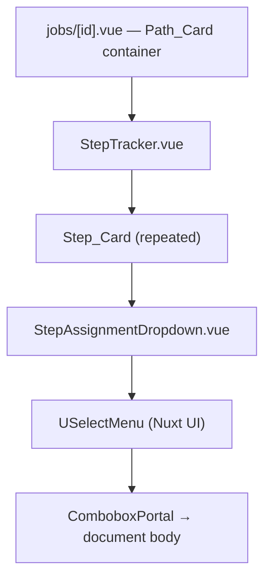

# Design Document: Step Overflow UX

## Overview

The StepTracker component currently renders process steps in a single horizontal flex row with `overflow-x-auto`. When a path has many steps (6+), this causes horizontal scrolling within the Path_Card, hiding steps off-screen. Additionally, the Path_Card container uses `overflow-hidden`, which can clip the StepAssignmentDropdown popover even though Nuxt UI's `USelectMenu` already portals its content to the document body.

This design addresses both issues by:

1. Switching StepTracker from `overflow-x-auto` to `flex-wrap` so step cards flow onto multiple rows
2. Compacting step card dimensions so more steps fit per row before wrapping
3. Removing `overflow-hidden` from Path_Card (replacing with `overflow-visible`) so portaled popovers aren't clipped during transition animations
4. Ensuring responsive behavior at narrow viewports

All changes are purely CSS/template-level within two Vue components (`StepTracker.vue`, `StepAssignmentDropdown.vue`) and one page (`jobs/[id].vue`). No backend changes, no new components, no data model changes.

## Architecture



Changes are confined to the presentation layer:

| File                                        | Change                                                                                       |
| ------------------------------------------- | -------------------------------------------------------------------------------------------- |
| `app/components/StepTracker.vue`            | Replace `overflow-x-auto` with `flex-wrap`, compact step card sizing, responsive breakpoints |
| `app/components/StepAssignmentDropdown.vue` | Replace fixed `w-44` with `w-full` so trigger fits within step card width                    |
| `app/pages/jobs/[id].vue`                   | Remove `overflow-hidden` from Path_Card border container, replace with `overflow-visible`    |

No new components, composables, services, or API routes are needed.

## UX Mockups

### Current State — Horizontal Overflow (Problem)

When a path has 6+ steps, the step tracker overflows the Path_Card horizontally, requiring scrolling and hiding steps off-screen:

```
┌─ Path: Main Assembly ─────────────────────────────────────────────────────────┐
│ Goal: 50 · 8 steps                                                            │
│ Advancement: Manual                                                           │
├───────────────────────────────────────────────────────────────────────────────┤
│                                                                               │
│ ┌──────────┐   ┌──────────┐   ┌──────────┐   ┌──────────┐   ┌──────────┐    │▒▒▒▒▒▒▒▒▒▒
│ │ Step 1   │ > │ Step 2   │ > │ Step 3   │ > │ Step 4   │ > │ Step 5   │ >  │ CLIPPED →
│ │ Cutting  │   │ Welding  │   │ Grinding │   │ Painting │   │ Coating  │    │ Steps 6-8
│ │ 12 at ·  │   │ 8 at ·   │   │ 5 at ·   │   │ 3 at ·   │   │ 2 at ·   │    │ hidden
│ │ 3 done   │   │ 2 done   │   │ 1 done   │   │ 0 done   │   │ 0 done   │    │
│ │[Unassign]│   │[Unassign]│   │[  Bob  ] │   │[Unassign]│   │[Unassign]│    │
│ └──────────┘   └──────────┘   └──────────┘   └──────────┘   └──────────┘    │
│                                                          ← scrollbar →       │
├───────────────────────────────────────────────────────────────────────────────┤
│ 💬 Notes                                                                      │
└───────────────────────────────────────────────────────────────────────────────┘
```

### New State — Flex-Wrap with Compact Cards

Steps wrap onto multiple rows. Cards are slightly more compact. Arrow indicators maintain sequence clarity across rows:

```
┌─ Path: Main Assembly ─────────────────────────────────────────────────────────┐
│ Goal: 50 · 8 steps                                                            │
│ Advancement: Manual                                                           │
├───────────────────────────────────────────────────────────────────────────────┤
│                                                                               │
│ ┌─────────┐   ┌─────────┐   ┌─────────┐   ┌─────────┐   ┌─────────┐        │
│ │ Step 1  │ > │ Step 2  │ > │ Step 3  │ > │ Step 4  │ > │ Step 5  │ >      │
│ │ Cutting │   │ Welding │   │ Grinding│   │ Painting│   │ Coating │        │
│ │ 12 · 3  │   │ 8 · 2   │   │ 5 · 1   │   │ 3 · 0   │   │ 2 · 0   │        │
│ │[Unassig]│   │[Unassig]│   │[ Bob  ] │   │[Unassig]│   │[Unassig]│        │
│ └─────────┘   └─────────┘   └─────────┘   └─────────┘   └─────────┘        │
│                                                                               │
│ ┌─────────┐   ┌─────────┐   ┌─────────┐   ┌─────────┐                       │
│ │ Step 6  │ > │ Step 7  │ > │ Step 8  │ > │  Done   │                       │
│ │ QC Insp │   │ Assembl…│   │ Final Q…│   │   ✓     │                       │
│ │ 0 · 0   │   │ 0 · 0   │   │ 0 · 0   │   │   6     │                       │
│ │[Unassig]│   │[ Alice ]│   │[Unassig]│   │completed│                       │
│ └─────────┘   └─────────┘   └─────────┘   └─────────┘                       │
│                                                                               │
├───────────────────────────────────────────────────────────────────────────────┤
│ 💬 Notes                                                                      │
└───────────────────────────────────────────────────────────────────────────────┘
```

Key visual changes:

- Steps flow left-to-right, wrapping to next row when they hit the container edge
- Arrows (`>`) between every consecutive step, including across row breaks
- Condensed count format: `12 · 3` means "12 at step · 3 done" (single line)
- Truncated names with ellipsis: `Assembl…` (full name on hover via `title` attribute)
- Slightly reduced padding for compactness

### Few Steps — Single Row (No Change)

Paths with 1–3 steps still render in a single row, no wrapping needed:

```
┌─ Path: Simple Route ──────────────────────────────────────────────────────────┐
│ Goal: 10 · 2 steps                                                            │
├───────────────────────────────────────────────────────────────────────────────┤
│                                                                               │
│ ┌─────────┐   ┌─────────┐   ┌─────────┐                                     │
│ │ Step 1  │ > │ Step 2  │ > │  Done   │                                     │
│ │ Cutting │   │ Welding │   │   ✓     │                                     │
│ │ 5 · 2   │   │ 3 · 1   │   │   3     │                                     │
│ │[Unassig]│   │[ Bob  ] │   │completed│                                     │
│ └─────────┘   └─────────┘   └─────────┘                                     │
│                                                                               │
└───────────────────────────────────────────────────────────────────────────────┘
```

### Narrow Viewport — Vertical Stack

At narrow widths (e.g., mobile or small sidebar), cards stack vertically:

```
┌─ Path: Main Assembly ──────────┐
│ Goal: 50 · 8 steps              │
├─────────────────────────────────┤
│                                 │
│ ┌─────────────────────────┐     │
│ │ Step 1 · Cutting        │     │
│ │ 12 · 3    [Unassigned]  │     │
│ └─────────────────────────┘     │
│              >                  │
│ ┌─────────────────────────┐     │
│ │ Step 2 · Welding        │     │
│ │ 8 · 2     [Unassigned]  │     │
│ └─────────────────────────┘     │
│              >                  │
│ ┌─────────────────────────┐     │
│ │ Step 3 · Grinding       │     │
│ │ 5 · 1     [  Bob  ]     │     │
│ └─────────────────────────┘     │
│              >                  │
│            ...                  │
│              >                  │
│ ┌─────────────────────────┐     │
│ │ Done  ✓  6 completed    │     │
│ └─────────────────────────┘     │
│                                 │
└─────────────────────────────────┘
```

### Assignee Dropdown — Trigger Width Containment

Before: the `USelectMenu` trigger has a fixed `w-44` (176px) width that overflows the step card when the card is narrower. After: trigger uses `w-full` and truncates long names within the card boundary:

```
  BEFORE (trigger overflows card):

  ┌─────────┐
  │ Step 3  │
  │ Grinding│
  │ 5 · 1   │
  │ ┌──────────────────┐   ← w-44 (176px) trigger
  │ │ Alexander Hamilton│     overflows the card
  │ └──────────────────┘     boundary (110-150px)
  └─────────┘

  AFTER (trigger fits within card):

  ┌─────────┐
  │ Step 3  │
  │ Grinding│
  │ 5 · 1   │
  │ [Alexan…]│  ← w-full trigger, truncated name
  └─────────┘
```

## Components and Interfaces

### StepTracker.vue — Layout Changes

**Current layout:**

```html
<div class="flex justify-center gap-1.5 items-stretch overflow-x-auto py-1"></div>
```

**New layout:**

```html
<div class="flex flex-wrap justify-start gap-x-1 gap-y-2 items-stretch py-1"></div>
```

Key changes:

- `overflow-x-auto` → removed (no horizontal scroll)
- `flex-wrap` added (cards flow to next row)
- `justify-center` → `justify-start` (left-aligned rows look cleaner when wrapping)
- `gap-1.5` → `gap-x-1 gap-y-2` (tighter horizontal gap, slightly more vertical gap between rows for readability)

**Step_Card sizing:**

- Current: `min-w-[120px] px-2 py-1.5`
- New: `min-w-[110px] max-w-[150px] flex-1 px-1.5 py-1`
- `flex-1` with `min-w` and `max-w` lets cards grow to fill available space evenly while capping width
- Reduced padding for compactness

**Arrow indicators between wrapped steps:**

- Arrows (`chevron-right` icons) remain between consecutive steps
- When steps wrap to a new row, the arrow naturally sits at the end of the previous row before the next card wraps — this is acceptable and maintains sequence clarity
- The arrow div gets `shrink-0` to prevent compression

**Condensed content layout:**

- Serial count and completed count rendered on a single line: `"3 at step · 1 done"` instead of stacked vertically
- Step name and location use `truncate` with `title` attribute for tooltip on hover
- Font sizes remain at current compact levels (`text-xs`, `text-[10px]`)

**Responsive behavior:**

- At narrow viewports, `flex-wrap` naturally stacks cards
- Add `min-w-[90px]` at small screens via responsive class: `sm:min-w-[110px] min-w-[90px]`
- When container is narrow enough that only one card fits per row, the layout becomes a vertical stack automatically

### StepAssignmentDropdown.vue — Width Containment

**Current state:** The `USelectMenu` trigger has a fixed width class `w-44` (176px). When the step card is narrower than 176px (which happens with the new compact sizing of `min-w-[110px] max-w-[150px]`), the dropdown trigger overflows the card boundary.

**Fix:**

1. Replace `class="w-44"` with `class="w-full"` on the `USelectMenu` so the trigger fills the available step card width
2. The trigger already has `truncate text-xs` on the display label — this will now truncate long names within the card width instead of at 176px
3. No changes needed to the popover/portal behavior — Nuxt UI 4's `USelectMenu` already portals the dropdown list to the document body by default

### Path_Card Container — Overflow Fix

**Current:** `<div class="border border-(--ui-border) rounded-md overflow-hidden">`

**New:** `<div class="border border-(--ui-border) rounded-md">`

Remove `overflow-hidden` entirely. The `rounded-md` border-radius still applies to the container. Child content that previously relied on `overflow-hidden` for clipping (like the path header background) can use `rounded-t-md` directly.

## Data Models

No data model changes. This feature is purely presentational — it modifies CSS classes and template structure in existing Vue components. The `StepDistribution`, `Path`, `ProcessStep`, and `ShopUser` types remain unchanged.

## Correctness Properties

_A property is a characteristic or behavior that should hold true across all valid executions of a system — essentially, a formal statement about what the system should do. Properties serve as the bridge between human-readable specifications and machine-verifiable correctness guarantees._

Most acceptance criteria in this feature are CSS/layout concerns that require a real rendering engine to validate (viewport geometry, flex-wrap behavior, scrollbar presence). Only two criteria produce testable structural properties.

### Property 1: Arrow count equals step count minus one

_For any_ list of N process steps (N ≥ 1) rendered by StepTracker, the output SHALL contain exactly N - 1 arrow indicators (chevron-right icons between step cards), plus 1 arrow before the "Done" column, for a total of N arrows. This ensures the sequential relationship between steps is always visually represented regardless of how many rows the steps wrap onto.

**Validates: Requirements 1.2**

### Property 2: Truncated text has accessible full text

_For any_ step with a name or location string, the rendered Step_Card SHALL include a `title` attribute containing the full untruncated text, so that truncated content remains accessible on hover.

**Validates: Requirements 2.2**

## Error Handling

This feature is purely presentational with no new error paths. Existing error handling in StepTracker and StepAssignmentDropdown remains unchanged:

- **StepAssignmentDropdown** already handles API errors with toast notifications and optimistic revert
- **StepTracker** receives data via props — no fetch errors to handle
- **Empty states** (0 steps) are already handled by the existing template

No new error conditions are introduced by CSS layout changes.

## Testing Strategy

### Property-Based Tests (fast-check)

Two property tests using `fast-check` with minimum 100 iterations each:

1. **Arrow count invariant** — Generate random `StepDistribution[]` arrays of length 1–20. For each, verify the rendered StepTracker output contains exactly `N` chevron-right icons (N-1 between steps + 1 before Done). Tag: `Feature: step-overflow-ux, Property 1: Arrow count equals step count minus one`

2. **Title attribute accessibility** — Generate random step names (including long strings, unicode, special characters). For each, verify the rendered Step_Card includes a `title` attribute with the exact full step name. Tag: `Feature: step-overflow-ux, Property 2: Truncated text has accessible full text`

Library: `fast-check` (already in project dependencies)
Environment: `happy-dom` (via vitest)
Minimum iterations: 100 per property

### Unit Tests

- Verify StepTracker renders correct number of step cards for various step counts (1, 3, 6, 10)
- Verify the "Done" column always renders with completed count sum
- Verify StepAssignmentDropdown passes `content` prop with `collisionPadding` to `USelectMenu`

### Manual / Visual Testing

Most acceptance criteria in this feature require manual verification:

- Flex-wrap behavior at various viewport widths
- No horizontal scrollbar on the page body
- Dropdown popover visibility near container edges
- Compact layout visual quality
- Responsive stacking at narrow viewports

Recommended manual test: seed a job with 8+ steps on a single path, then resize the browser from wide to narrow and verify wrapping, arrow visibility, and dropdown behavior.
