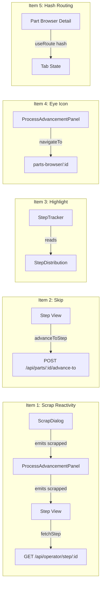

# Design Document — UI Polish Batch

## Overview

This design covers five frontend UI polish items that improve reactivity, navigation, and visual feedback across the Step View (`/parts/step/[stepId]`), Part Browser Detail (`/parts-browser/[id]`), and ProcessAdvancementPanel component. All changes are frontend-only except the Skip feature which calls the existing `advanceToStep` API.

### Items Summary

| # | Item | Pages/Components Affected |
|---|------|--------------------------|
| 1 | Immediate part removal after scrap | ProcessAdvancementPanel, Step View (`[stepId].vue`) |
| 2 | Skip optional steps | Step View (`[stepId].vue`), ProcessAdvancementPanel |
| 3 | Highlight steps with parts | StepTracker component (rendered on Job Detail `/jobs/[id]`) |
| 4 | Eye icon for part detail navigation | ProcessAdvancementPanel |
| 5 | Sibling parts tab URL hash | Part Browser Detail (`[id].vue`) |
| 6 | Force Complete icon color → green | ProcessAdvancementPanel |

## Architecture

All six items follow the existing architecture: Components → Composables → API Routes. No new API endpoints, services, or repositories are needed.



### Data Flow Changes

- **Item 1**: ScrapDialog already emits `scrapped`. ProcessAdvancementPanel needs to listen for it and remove the part from its local list + deselect it. Step View needs to call `fetchStep()` on scrap to re-sync server state.
- **Item 2**: Step View needs the step's `optional` flag. Currently `WorkQueueJob` doesn't include it. The step view API endpoint (`GET /api/operator/step/:stepId`) will be extended to include `stepOptional: boolean` in the `WorkQueueJob` response. The Skip button calls `useLifecycle().advanceToStep()` with the next step as target.
- **Item 3**: Pure template change in `StepTracker.vue` — add conditional CSS class in `stepBorderClass` based on `StepDistribution.partCount > 0 && !isBottleneck`.
- **Item 4**: Pure template change — add a `NuxtLink` with eye icon next to each part ID in ProcessAdvancementPanel.
- **Item 5**: Replace `activeTab` ref with hash-derived computed. Use `useRoute().hash` and `useRouter().replace()` for tab state.
- **Item 6**: Pure CSS change — change Force Complete icon button color from `warning`/amber to `success`/green in ProcessAdvancementPanel.

## Components and Interfaces

### Item 1: Scrap Reactivity

**ProcessAdvancementPanel.vue** changes:
- Listen for `@scrapped` event on `ScrapDialog`
- On scrapped: remove the part from `job.partIds` (local reactive copy), deselect from `selectedParts`, emit a new `scrapped` event upward
- New emit: `scrapped: []`

**Step View (`[stepId].vue`)** changes:
- Listen for `@scrapped` on ProcessAdvancementPanel
- On scrapped: call `fetchStep()` to re-sync from server
- The existing zero-parts logic already handles the empty-state transition

**ScrapDialog.vue**: No changes needed — already emits `scrapped`.

### Item 2: Skip Optional Steps

**WorkQueueJob type** extension:
- Add `stepOptional?: boolean` field to `WorkQueueJob` in `server/types/computed.ts`
- Populate it in `server/api/operator/step/[stepId].get.ts` from `step.optional`

**Step View (`[stepId].vue`)** changes:
- Add a "Skip" button next to the Advance button, visible only when `job.stepOptional === true`
- Skip handler: calls `useLifecycle().advanceToStep(partId, { targetStepId: job.nextStepId, userId: operatorId })` for each selected part
- Validates operator is selected before skip (same pattern as advance)
- After skip completes: calls `fetchStep()` to refresh

**ProcessAdvancementPanel.vue**: No changes for skip — the Skip button lives in Step View alongside the panel, not inside it.

### Item 3: Highlight Steps With Parts

**StepTracker.vue** changes:
- Update `stepBorderClass()` function to add a blue highlight case:
  - Current: `isBottleneck` → amber, `optional` → dashed, else → default
  - New: `isBottleneck` → amber, `partCount > 0` → blue (`border-blue-400 bg-blue-50 dark:bg-blue-950/30`), `optional` → dashed, else → default
- The function already receives a `StepDistribution` object with `partCount` and `isBottleneck`
- Bottleneck styling takes precedence over the blue highlight (checked first)

### Item 4: Eye Icon for Part Detail Navigation

**ProcessAdvancementPanel.vue** changes:
- Add a `NuxtLink` with `i-lucide-eye` icon next to each part ID in the part list
- Link target: `/parts-browser/${partId}`
- Use `@click.stop` to prevent checkbox toggle
- Styled as a ghost button, visually distinct from the red Scrap and amber Force Complete icons

### Item 5: Sibling Parts Tab URL Hash

**Part Browser Detail (`[id].vue`)** changes:
- Replace `const activeTab = ref('routing')` with a computed that reads/writes `route.hash`
- Tab click: `router.replace({ hash: tab === 'siblings' ? '#parts' : '#routing' })`
- On mount: derive initial tab from `route.hash` (`#parts` → siblings, else routing)
- Watch `route.hash` for browser back/forward navigation
- Trigger sibling data loading when hash changes to `#parts`

### Item 6: Force Complete Icon Color

**ProcessAdvancementPanel.vue** changes:
- Change the Force Complete button's `color` prop from `warning` (amber) to `success` (green)
- No icon or label changes — just the color

## Data Models

No new data models or schema changes. One minor type extension:

### WorkQueueJob Extension

```typescript
// server/types/computed.ts — add to WorkQueueJob
export interface WorkQueueJob {
  // ... existing fields ...
  stepOptional?: boolean  // NEW: whether the current step is optional
}
```

This field is populated only by the step view endpoint. Other endpoints that return `WorkQueueJob` (work queue, parts view) don't need it since the Skip button only appears on the Step View page.


## Correctness Properties

*A property is a characteristic or behavior that should hold true across all valid executions of a system — essentially, a formal statement about what the system should do. Properties serve as the bridge between human-readable specifications and machine-verifiable correctness guarantees.*

### Property 1: Scrap removes part from list and deselects

*For any* list of part IDs and any selected-parts set that is a subset of that list, when a part ID from the list is scrapped, the resulting part list should not contain the scrapped ID, and the resulting selected set should not contain the scrapped ID. The lengths should each decrease by exactly one (if the scrapped ID was in the selected set) or the selected set length stays the same (if it wasn't selected).

**Validates: Requirements 1.1, 1.3**

### Property 2: Skip button visibility equals stepOptional flag

*For any* `WorkQueueJob` object, the Skip button should be visible if and only if `stepOptional` is `true`. When `stepOptional` is `false` or `undefined`, the Skip button should not be rendered.

**Validates: Requirements 2.1, 2.5**

### Property 3: Step highlight classification

*For any* step distribution entry (with `partCount` and `isBottleneck` fields), the blue highlight CSS class should be applied in `stepBorderClass` if and only if: `partCount > 0` AND `isBottleneck === false`. Bottleneck steps should always get amber styling regardless of partCount. Zero-part non-bottleneck steps should get the default styling.

**Validates: Requirements 3.1, 3.2, 3.3**

### Property 4: Eye icon link target correctness

*For any* part ID string, the eye icon link in the ProcessAdvancementPanel should have its `href` resolve to `/parts-browser/${partId}`. The link should be present for every part ID in the list.

**Validates: Requirements 4.1, 4.2**

### Property 5: Tab-hash round trip

*For any* tab value in `{'routing', 'siblings'}`, converting the tab to a URL hash (routing → `#routing` or empty, siblings → `#parts`) and then deriving the tab back from that hash should produce the original tab value. Conversely, for any hash in `{'#routing', '#parts', ''}`, deriving the tab and converting back to hash should be consistent.

**Validates: Requirements 5.1, 5.2, 5.3, 5.4**

## Error Handling

### Item 1: Scrap Reactivity
- ScrapDialog already handles API errors via `useLifecycle` composable (displays error in dialog)
- If `fetchStep()` fails after a successful scrap, the step view shows its existing error state with a Retry button
- No new error paths introduced

### Item 2: Skip Optional Steps
- If `advanceToStep` API call fails, display a toast error (same pattern as advance)
- If no operator is selected, show validation message before making the API call
- If the step has no `nextStepId` (final step), the Skip button should not appear (skip requires a target)

### Item 3: Highlight Steps With Parts
- No error paths — pure CSS conditional based on already-fetched data
- If `getStepDistribution()` returns undefined for a step, no highlight is applied (safe default)

### Item 4: Eye Icon Navigation
- No error paths — standard `NuxtLink` navigation
- If part ID contains special characters, `encodeURIComponent` is used in the link

### Item 5: Hash Routing
- If an unrecognized hash is present (e.g., `#foo`), default to the Routing tab
- `router.replace()` is used instead of `router.push()` to avoid polluting browser history on tab clicks

## Testing Strategy

### Property-Based Tests (fast-check)

Each correctness property will be implemented as a single property-based test with minimum 100 iterations.

**Library**: `fast-check` (already in project dependencies)

**Test file**: `tests/properties/uiPolishBatch.property.test.ts`

Tests:
1. **Feature: ui-polish-batch, Property 1: Scrap removes part from list and deselects** — Generate random part ID arrays and random selected subsets, pick a random member to scrap, verify removal from both collections.
2. **Feature: ui-polish-batch, Property 2: Skip button visibility equals stepOptional flag** — Generate random boolean for `stepOptional`, verify visibility matches.
3. **Feature: ui-polish-batch, Property 3: Step highlight classification** — Generate random `StepDistribution` objects (varying `partCount`, `isBottleneck`) and random `currentStepId`, verify highlight class is applied correctly.
4. **Feature: ui-polish-batch, Property 4: Eye icon link target correctness** — Generate random part ID strings, verify link resolves to `/parts-browser/${partId}`.
5. **Feature: ui-polish-batch, Property 5: Tab-hash round trip** — Generate random tab values, verify round-trip through hash conversion and back.

### Unit Tests

- **Item 1**: Verify that after scrap event, the part list length decreases by 1 and the specific part is gone
- **Item 2**: Verify skip handler calls `advanceToStep` with correct `targetStepId` (next step ID)
- **Item 2**: Verify skip validation rejects when no operator selected
- **Item 5**: Verify `#parts` hash activates siblings tab on mount

### Extractable Pure Functions

To make properties testable without DOM rendering, extract these pure functions:

```typescript
// app/utils/scrapPartFromList.ts
export function removePartFromList(partIds: string[], scrappedId: string): string[] {
  return partIds.filter(id => id !== scrappedId)
}

export function removePartFromSelection(selected: Set<string>, scrappedId: string): Set<string> {
  const next = new Set(selected)
  next.delete(scrappedId)
  return next
}

// app/utils/stepHighlight.ts
export function shouldHighlightStep(
  partCount: number,
  isBottleneck: boolean,
): boolean {
  return partCount > 0 && !isBottleneck
}

// app/utils/tabHash.ts
export function tabToHash(tab: string): string {
  return tab === 'siblings' ? '#parts' : '#routing'
}

export function hashToTab(hash: string): string {
  return hash === '#parts' ? 'siblings' : 'routing'
}

// app/utils/eyeIconLink.ts
export function partDetailLink(partId: string): string {
  return `/parts-browser/${encodeURIComponent(partId)}`
}
```

These pure functions are tested by the property tests. The Vue components call them, keeping the logic testable without mounting components.
