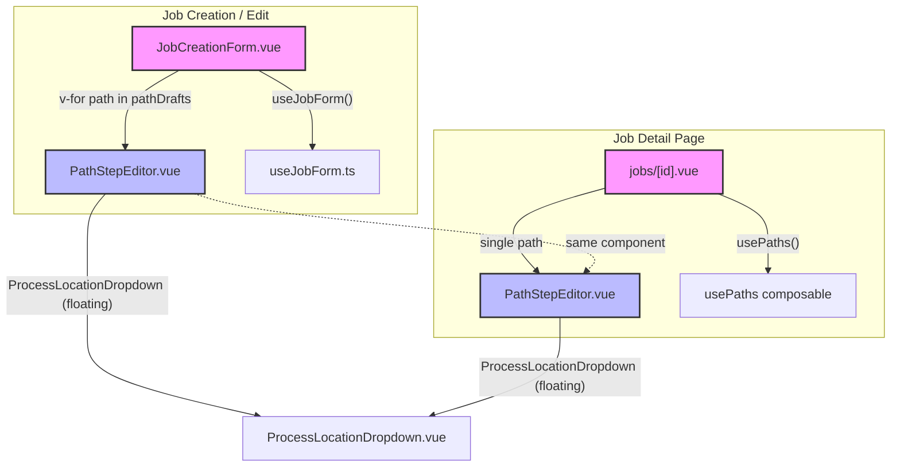
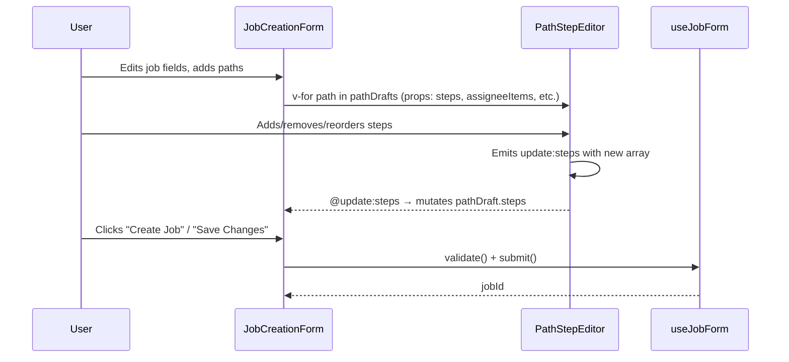
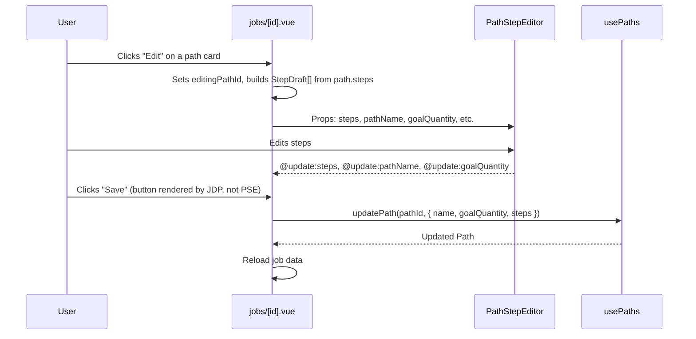

# Design Document: Unified Path Editor

## Overview

The job routing system currently has two separate step editing UIs: an inline grid in `JobCreationForm.vue` (used on `/jobs/new` and `/jobs/edit/[id]`) and a standalone editor in `PathEditor.vue` (used on `/jobs/[id]` for adding/editing individual paths). These share ~80% of the same logic but diverge in layout (CSS grid vs flex rows), StepDraft types (`_clientId` tracking vs `id?` tracking), validation approaches, and feature sets (templates in one, direct API save in the other).

This feature extracts the shared step editing grid into a single `PathStepEditor.vue` component that renders the step rows for one path. It is purely presentational with local state — the parent component owns save/submit logic. Both `JobCreationForm.vue` and the job detail page (`/jobs/[id]`) consume it with the same props interface, ensuring consistent layout, alignment, and behavior across all contexts.

The unified component uses a single `StepDraft` type (the existing one from `useJobForm.ts` with `_clientId`) and a two-zone card layout that solves the vertical alignment problem caused by expandable autocomplete dropdowns. Each step is a bordered card with a primary flex row (all fixed-height controls aligned with `items-center`) and a conditional secondary zone below for suggestion lists and validation errors. The process and location fields use plain `UInput` elements in the primary row, with `ProcessLocationDropdown` refactored to render its suggestion list as a floating/absolute-positioned overlay instead of inline content that pushes siblings down. The path card header area includes space for action buttons (copy, paste, delete) to support the upcoming path-copy-paste feature.

## Architecture



## Sequence Diagrams

### JobCreationForm Flow (Embedded, Multiple Paths)



### Job Detail Page Flow (Standalone, Single Path)



## Components and Interfaces

### Component 1: PathStepEditor.vue (New)

**Purpose**: Renders the step editing grid for a single path. Purely presentational with local step manipulation (add, remove, reorder). Emits changes to parent.

**File**: `app/components/PathStepEditor.vue`

**Interface**:
```typescript
// Props
interface PathStepEditorProps {
  steps: StepDraft[]
  assigneeItems: { label: string; value: string }[]
  dependencyTypeOptions: { label: string; value: string }[]
  // Optional: field-level error lookup
  getFieldError?: (stepIndex: number, field: string) => string | undefined
  clearFieldError?: (stepIndex: number, field: string) => void
}

// Emits
interface PathStepEditorEmits {
  'update:steps': [steps: StepDraft[]]
}
```

**Responsibilities**:
- Detect viewport size via `useMobileBreakpoint()` composable (`isMobile` ref, breakpoint at 768px)
- Render each step as a bordered card with layout determined by viewport:
  - **Desktop (>= 768px)**: Two-zone layout:
    - **Zone 1 (primary row)**: All fixed-height controls in a single `flex items-center gap-2` row — step badge, process UInput, location UInput, assignee USelect, optional checkbox (in height-matched wrapper), dependency USelect, move up/down buttons, remove button
    - **Zone 2 (expandable)**: Conditionally rendered below the primary row — ProcessLocationDropdown suggestion lists (floating overlay), "new process/location" input, validation error messages
  - **Mobile (< 768px)**: Stacked card layout:
    - Card header with step number badge (e.g. "Step 1")
    - Full-width stacked fields with inline labels: Process, Location, Assignee
    - Compact row for Optional checkbox + Dependency type (both small, share one row)
    - Footer row with Move up, Move down, and Remove buttons
    - No column headers — each field has its own inline label
- Column headers row above the step cards (desktop only) with info tooltips for Optional and Dependency
- ProcessLocationDropdown (refactored) for process name and location fields — suggestion list renders as a floating absolute-positioned overlay below the input, not inline
- USelect for assignee and dependency type
- Checkbox wrapped in a `flex items-center justify-center h-8` div to match UInput sm height (32px)
- Move up/down buttons per step
- Remove button per step (disabled when only 1 step)
- "Add Step" button at the bottom (full-width on mobile)
- Emit `update:steps` on every mutation (add, remove, move, field change)
- Display field-level errors via optional `getFieldError` prop (rendered in Zone 2)
- Clear field-level errors on input via optional `clearFieldError` prop

### Component 2: JobCreationForm.vue (Modified)

**Purpose**: Replace the inline step grid with `PathStepEditor` for each path card.

**File**: `app/components/JobCreationForm.vue`

**Changes**:
- Remove the inline step grid template (column headers + step rows)
- Import and render `<PathStepEditor>` inside each path card
- Pass `path.steps`, `assigneeItems`, `dependencyTypeOptions`, `getFieldError`, `clearFieldError`
- Handle `@update:steps` by assigning to `path.steps`
- Keep all path-level fields (name, goal qty, advancement mode, template selector) in JobCreationForm
- Keep the path card header with copy/paste/delete button area

### Component 3: PathEditor.vue (Removed or Deprecated)

**Purpose**: The standalone path editor on the job detail page is replaced by inline usage of `PathStepEditor` directly in `jobs/[id].vue`.

**Changes**:
- `PathEditor.vue` can be removed entirely
- Its save/cancel logic moves into `jobs/[id].vue` (which already has `usePaths()` and the editing state)
- The path name, goal quantity fields, and save/cancel buttons are rendered by `jobs/[id].vue` around the `PathStepEditor`

### Component 4: jobs/[id].vue (Modified)

**Purpose**: Replace `PathEditor` usage with `PathStepEditor` + local editing state.

**Changes**:
- Remove `PathEditor` import/usage
- When editing a path: convert `Path.steps` to `StepDraft[]` (adding `_clientId` via nanoid)
- Render path name/goal qty inputs + `PathStepEditor` + Save/Cancel buttons inline
- On save: call `updatePath()` or `createPath()` directly, mapping `StepDraft[]` back to API format
- For new paths: same pattern but with empty initial state

### Component 5: ProcessLocationDropdown.vue (Refactored)

**Purpose**: Refactor the suggestion list from inline content that pushes siblings down to a floating/absolute-positioned overlay, matching the standard autocomplete pattern (like USelectMenu).

**File**: `app/components/ProcessLocationDropdown.vue`

**Problem**: The current implementation renders the suggestion list and "new item" row as inline block-level content below the UInput. This causes the component's height to vary (UInput sm height when collapsed, UInput + suggestion list + new-item row when expanded). In a flex row with sibling controls, this expansion disrupts vertical alignment of all adjacent elements.

**Solution (Option A — Floating Suggestions)**:
- Wrap the component in a `relative` positioned container
- Keep the UInput as the only element contributing to the component's layout height
- Render the suggestion list as an `absolute`-positioned dropdown below the input, with `z-10` to float above subsequent content
- The "new process/location" button appears at the bottom of the floating suggestion list
- The "new item" input row (when adding a new process/location) also renders inside the floating overlay
- On selection or blur, the floating overlay closes — the component height remains constant at UInput sm height (32px)

**Interface changes**: None — the existing `modelValue` / `update:modelValue` / `type` props interface is unchanged. The refactoring is purely visual/layout.

**Key implementation details**:
```typescript
// The suggestion list is now absolutely positioned
// Container: relative positioning context
// Suggestion list: absolute top-full left-0 w-full z-10 mt-1
//   - border, rounded, bg, shadow for visual separation
//   - max-h-48 overflow-y-auto for scrollable list
//   - "New" button at bottom of list
// "New item" input: renders inside the floating panel when showNewInput is true
// Click-outside handler to close the overlay when user clicks elsewhere
```

**Before (inline, variable height)**:
```
┌─────────────────────┐
│ [Search process...] │  ← UInput (always visible)
├─────────────────────┤
│ Heat Treat          │  ← suggestion list (pushes content down)
│ QC Inspect          │
│ Shipping            │
├─────────────────────┤
│ + New process       │  ← new button (pushes content down)
└─────────────────────┘
```

**After (floating, fixed height)**:
```
┌─────────────────────┐
│ [Search process...] │  ← UInput (always visible, fixed 32px height)
└─────────────────────┘
┌─────────────────────┐  ← floating overlay (absolute, z-10)
│ Heat Treat          │
│ QC Inspect          │
│ Shipping            │
│─────────────────────│
│ + New process       │
└─────────────────────┘
```

## Data Models

### Unified StepDraft Type

The existing `StepDraft` from `useJobForm.ts` becomes the single source of truth:

```typescript
// Exported from app/composables/useJobForm.ts (already exported)
export interface StepDraft {
  _clientId: string
  _existingStepId?: string
  name: string
  location: string
  assignedTo: string
  optional: boolean
  dependencyType: 'physical' | 'preferred' | 'completion_gate'
}
```

**Validation Rules**:
- `_clientId` must be a non-empty string (generated by nanoid)
- `name` is required (non-empty after trim) for submission
- `location` is optional (empty string allowed)
- `assignedTo` uses empty string for unassigned, mapped to `SELECT_UNASSIGNED` sentinel in USelect
- `dependencyType` must be one of the three valid enum values
- `optional` is boolean, defaults to `false`

### Conversion: Path.steps → StepDraft[]

When the job detail page enters edit mode for a path, it converts server `ProcessStep[]` to `StepDraft[]`:

```typescript
function toStepDrafts(steps: ProcessStep[]): StepDraft[] {
  return steps
    .slice()
    .sort((a, b) => a.order - b.order)
    .map(s => ({
      _clientId: nanoid(),
      _existingStepId: s.id,
      name: s.name,
      location: s.location ?? '',
      assignedTo: s.assignedTo ?? '',
      optional: s.optional ?? false,
      dependencyType: s.dependencyType ?? 'preferred',
    }))
}
```

### Conversion: StepDraft[] → API Step Payload

When saving, `StepDraft[]` is mapped back to the API format:

```typescript
function toStepPayload(drafts: StepDraft[]) {
  return drafts.map(s => ({
    id: s._existingStepId,
    name: s.name.trim(),
    location: s.location.trim() || undefined,
    assignedTo: s.assignedTo ? s.assignedTo : (s._existingStepId ? null : undefined),
    optional: s.optional,
    dependencyType: s.dependencyType,
  }))
}
```


## Key Functions with Formal Specifications

### Function 1: addStep()

```typescript
function addStep(steps: StepDraft[]): StepDraft[]
```

**Preconditions:**
- `steps` is a valid array of `StepDraft` objects (may be empty)

**Postconditions:**
- Returns a new array with length `steps.length + 1`
- The last element is a new `StepDraft` with a unique `_clientId`, empty `name`, empty `location`, empty `assignedTo`, `optional: false`, `dependencyType: 'preferred'`
- All existing steps are preserved in their original order and unchanged
- No mutations to the input array

**Loop Invariants:** N/A

### Function 2: removeStep()

```typescript
function removeStep(steps: StepDraft[], clientId: string): StepDraft[]
```

**Preconditions:**
- `steps` has length >= 2 (removal is blocked when only 1 step remains)
- `clientId` matches exactly one step's `_clientId` in the array

**Postconditions:**
- Returns a new array with length `steps.length - 1`
- The step with matching `_clientId` is not present in the result
- All other steps are preserved in their original order and unchanged
- If `steps.length === 1`, returns the original array unchanged (guard)

**Loop Invariants:** N/A

### Function 3: moveStep()

```typescript
function moveStep(steps: StepDraft[], clientId: string, direction: -1 | 1): StepDraft[]
```

**Preconditions:**
- `clientId` matches exactly one step's `_clientId` in the array
- The target index (`currentIndex + direction`) is within bounds `[0, steps.length - 1]`

**Postconditions:**
- Returns a new array of the same length
- The step at `currentIndex` is now at `currentIndex + direction`
- The step previously at `currentIndex + direction` is now at `currentIndex`
- All other steps remain in their original positions
- If target index is out of bounds, returns the original array unchanged

**Loop Invariants:** N/A

### Function 4: toStepDrafts()

```typescript
function toStepDrafts(steps: ProcessStep[]): StepDraft[]
```

**Preconditions:**
- `steps` is a valid array of `ProcessStep` objects from the server
- Each step has `id`, `name`, `order`, and optional `location`, `assignedTo`, `optional`, `dependencyType`

**Postconditions:**
- Returns an array of `StepDraft` objects sorted by `order` ascending
- Each `StepDraft` has a unique `_clientId` (nanoid)
- Each `StepDraft._existingStepId` equals the original `ProcessStep.id`
- Null/undefined fields are normalized: `location` → `''`, `assignedTo` → `''`, `optional` → `false`, `dependencyType` → `'preferred'`
- The returned array length equals the input array length

**Loop Invariants:**
- For each processed step, `_existingStepId` maps back to the original `ProcessStep.id`

### Function 5: toStepPayload()

```typescript
function toStepPayload(drafts: StepDraft[]): StepPayload[]
```

**Preconditions:**
- `drafts` is a valid array of `StepDraft` objects

**Postconditions:**
- Returns an array of API-compatible step objects
- Each step's `name` is trimmed
- Each step's `location` is trimmed; empty string becomes `undefined`
- `assignedTo`: if truthy, kept as-is; if falsy and `_existingStepId` exists, set to `null` (explicit unassign); if falsy and no `_existingStepId`, set to `undefined` (omit)
- `id` is set to `_existingStepId` (may be `undefined` for new steps)
- The returned array length equals the input array length

**Loop Invariants:**
- For each draft, the output preserves `optional` and `dependencyType` unchanged

## Algorithmic Pseudocode

### Two-Zone Card Layout (Desktop)

The desktop layout uses bordered card rows instead of a flat CSS grid. This solves the alignment problem caused by `ProcessLocationDropdown`'s variable height — the suggestion list and "new item" row previously expanded inline, disrupting sibling alignment. On mobile (< 768px), a stacked card layout is used instead — see the Responsive Design section.

**Why not a flat grid?** Form elements have different heights:
- `ProcessLocationDropdown` — variable: UInput (sm) + conditional suggestion list (max-h-32) + conditional "new item" row
- `USelect` (sm) — fixed height, single-line dropdown trigger
- `UCheckbox` / native checkbox — small fixed height, much shorter than inputs
- `UInput` (sm) — fixed height text input

When ProcessLocationDropdown expands, a flat grid row forces siblings to either stretch (ugly), center on expanded height (misaligned), or top-align (checkbox floats at top).

**Solution: Two-zone step cards**

Each step is a bordered card (`border border-(--ui-border) rounded-md p-2`) with two zones:

**Zone 1 (primary row)** — `flex items-center gap-2`:
All fixed-height elements on one line. UInput sm ≈ USelect sm ≈ 32px, so they align perfectly.

| Element | Width Class | Content | Height |
|---------|-------------|---------|--------|
| Step # | `w-7 shrink-0` | Badge (centered number) | 32px (flex centered) |
| Process | `flex-1 min-w-0` | Plain UInput sm | 32px |
| Location | `flex-1 min-w-0` | Plain UInput sm | 32px |
| Assignee | `w-36 shrink-0` | USelect sm | 32px |
| Optional | `w-8 shrink-0` | Checkbox in `flex items-center justify-center h-8` wrapper | 32px (wrapper) |
| Dependency | `w-36 shrink-0` | USelect sm | 32px |
| Move | `w-14 shrink-0` | Two icon buttons (up/down) | 32px (flex centered) |
| Remove | `w-7 shrink-0` | X icon button | 32px (flex centered) |

**Zone 2 (expandable, conditional)** — rendered below the primary row only when needed:
- Process suggestions dropdown (floating overlay from refactored ProcessLocationDropdown)
- Location suggestions dropdown (floating overlay)
- Validation error messages for process name or other fields

Because ProcessLocationDropdown is refactored to use floating/absolute-positioned overlays (see Component 5), Zone 2 is primarily used for validation errors. The suggestion lists float above subsequent content via `z-10` absolute positioning and don't affect the card's layout height.

**Checkbox alignment technique**: The native checkbox is shorter than UInput sm. Wrapping it in `<div class="flex items-center justify-center h-8">` (h-8 = 32px = UInput sm height) makes the wrapper the same height as adjacent inputs, with the checkbox vertically centered inside.

```typescript
// Primary row layout
const PRIMARY_ROW_CLASSES = 'flex items-center gap-2'

// Column width classes
const STEP_BADGE = 'w-7 shrink-0 text-center'
const PROCESS_COL = 'flex-1 min-w-0'
const LOCATION_COL = 'flex-1 min-w-0'
const ASSIGNEE_COL = 'w-36 shrink-0'
const OPTIONAL_COL = 'w-8 shrink-0'
const DEPENDENCY_COL = 'w-36 shrink-0'
const MOVE_COL = 'w-14 shrink-0 flex items-center gap-0.5'
const REMOVE_COL = 'w-7 shrink-0'

// Checkbox height wrapper — matches UInput sm height
const CHECKBOX_WRAPPER = 'flex items-center justify-center h-8'
```

### PathStepEditor Event Flow

```typescript
// On any step mutation, emit the full updated array
function emitSteps(newSteps: StepDraft[]) {
  emit('update:steps', newSteps)
}

// Add step: append new draft, emit
function handleAddStep() {
  const newStep = createStepDraft()  // from useJobForm.ts helper
  emitSteps([...props.steps, newStep])
}

// Remove step: filter out by clientId, emit
function handleRemoveStep(clientId: string) {
  if (props.steps.length <= 1) return
  emitSteps(props.steps.filter(s => s._clientId !== clientId))
}

// Move step: swap adjacent, emit
function handleMoveStep(clientId: string, direction: -1 | 1) {
  const idx = props.steps.findIndex(s => s._clientId === clientId)
  const target = idx + direction
  if (target < 0 || target >= props.steps.length) return
  const copy = [...props.steps]
  ;[copy[idx], copy[target]] = [copy[target]!, copy[idx]!]
  emitSteps(copy)
}

// Field change: clone array, update field, emit
function handleFieldChange(clientId: string, field: keyof StepDraft, value: any) {
  const copy = props.steps.map(s =>
    s._clientId === clientId ? { ...s, [field]: value } : s
  )
  emitSteps(copy)
}
```

## Example Usage

### In JobCreationForm.vue (Embedded, Multiple Paths)

```vue
<template>
  <!-- Inside each path card -->
  <div v-for="(path, pathIndex) in pathDrafts" :key="path._clientId">
    <!-- Path header: name, goal qty, advancement mode, copy/paste/delete buttons -->
    <!-- ... path-level fields ... -->

    <!-- Step grid — delegated to PathStepEditor -->
    <PathStepEditor
      :steps="path.steps"
      :assignee-items="assigneeItems"
      :dependency-type-options="dependencyTypeOptions"
      :get-field-error="(stepIdx, field) => getFieldError(`paths[${pathIndex}].steps[${stepIdx}].${field}`)"
      :clear-field-error="(stepIdx, field) => clearFieldError(`paths[${pathIndex}].steps[${stepIdx}].${field}`)"
      @update:steps="path.steps = $event"
    />
  </div>
</template>
```

### In jobs/[id].vue (Standalone, Single Path Edit)

```vue
<template>
  <!-- When editing a path inline -->
  <div v-if="editingPathId === p.id" class="p-3 space-y-3">
    <div class="grid grid-cols-2 gap-2">
      <div>
        <label class="block text-xs text-(--ui-text-muted) mb-0.5">Path Name</label>
        <UInput v-model="editPathName" size="sm" />
      </div>
      <div>
        <label class="block text-xs text-(--ui-text-muted) mb-0.5">Goal Qty</label>
        <UInput v-model.number="editGoalQty" type="number" size="sm" :min="1" />
      </div>
    </div>

    <PathStepEditor
      :steps="editSteps"
      :assignee-items="assigneeItems"
      :dependency-type-options="dependencyTypeOptions"
      @update:steps="editSteps = $event"
    />

    <div class="flex gap-2 justify-end">
      <UButton variant="ghost" size="xs" label="Cancel" @click="cancelEdit" />
      <UButton size="xs" label="Save" :loading="saving" @click="savePathEdit" />
    </div>
  </div>
</template>

<script setup lang="ts">
import { nanoid } from 'nanoid'
import type { StepDraft } from '~/composables/useJobForm'

// Edit state for a single path
const editPathName = ref('')
const editGoalQty = ref(1)
const editSteps = ref<StepDraft[]>([])
const saving = ref(false)

function startEditPath(path: Path) {
  editingPathId.value = path.id
  editPathName.value = path.name
  editGoalQty.value = path.goalQuantity
  editSteps.value = toStepDrafts(path.steps)
}

async function savePathEdit() {
  saving.value = true
  try {
    await updatePath(editingPathId.value!, {
      name: editPathName.value.trim(),
      goalQuantity: editGoalQty.value,
      steps: toStepPayload(editSteps.value),
    })
    editingPathId.value = null
    await loadJob()
  } catch (e) {
    // handle error
  } finally {
    saving.value = false
  }
}
</script>
```

### In jobs/[id].vue (Standalone, New Path)

```vue
<template>
  <div v-if="showNewPath" class="p-3 space-y-3 border border-(--ui-border) rounded-md">
    <div class="text-xs font-semibold text-(--ui-text-highlighted)">New Path</div>
    <div class="grid grid-cols-2 gap-2">
      <div>
        <label class="block text-xs text-(--ui-text-muted) mb-0.5">Path Name</label>
        <UInput v-model="newPathName" size="sm" placeholder="e.g. Standard Route" />
      </div>
      <div>
        <label class="block text-xs text-(--ui-text-muted) mb-0.5">Goal Qty</label>
        <UInput v-model.number="newGoalQty" type="number" size="sm" :min="1" />
      </div>
    </div>

    <PathStepEditor
      :steps="newPathSteps"
      :assignee-items="assigneeItems"
      :dependency-type-options="dependencyTypeOptions"
      @update:steps="newPathSteps = $event"
    />

    <div class="flex gap-2 justify-end">
      <UButton variant="ghost" size="xs" label="Cancel" @click="showNewPath = false" />
      <UButton size="xs" label="Create Path" :loading="saving" @click="saveNewPath" />
    </div>
  </div>
</template>
```

## Correctness Properties

*A property is a characteristic or behavior that should hold true across all valid executions of a system — essentially, a formal statement about what the system should do. Properties serve as the bridge between human-readable specifications and machine-verifiable correctness guarantees.*

### Property 1: Step count invariant on add

*For any* `steps` array of length N, after `addStep(steps)`, the result has length N + 1, the last element has a unique `_clientId` not present in the original array, and all existing steps are preserved in their original order with default values on the new step (`name: ''`, `location: ''`, `assignedTo: ''`, `optional: false`, `dependencyType: 'preferred'`).

**Validates: Requirements 2.1, 2.2, 2.3, 14.1**

### Property 2: Step count invariant on remove

*For any* `steps` array of length N >= 2 and any valid `clientId`, after `removeStep(steps, clientId)`, the result has length N - 1 and does not contain a step with that `_clientId`. All other steps are preserved in their original order.

**Validates: Requirements 3.1**

### Property 3: Remove guard for single step

*For any* `steps` array of length 1, `removeStep(steps, clientId)` returns the original array unchanged (length remains 1).

**Validates: Requirements 3.2, 3.3**

### Property 4: Move swaps exactly two adjacent steps

*For any* valid move operation on `steps[i]` with direction d, the result has `steps[i]` at position `i+d` and `steps[i+d]` at position `i`. All other positions are unchanged. The result array has the same length and contains exactly the same set of `_clientId` values.

**Validates: Requirements 4.1, 4.2, 4.5**

### Property 5: Move is self-inverse

*For any* valid `moveStep(steps, clientId, +1)` followed by `moveStep(result, clientId, -1)`, the array returns to its original order.

**Validates: Requirements 4.1, 4.2**

### Property 6: toStepDrafts preserves step identity and sorts by order

*For any* `ProcessStep[]` from the server (potentially unsorted), `toStepDrafts(steps)` produces a `StepDraft[]` of the same length where each `_existingStepId` maps to the original `ProcessStep.id`, the array is sorted by `order` ascending, and each `_clientId` is unique and non-empty.

**Validates: Requirements 10.1, 10.2, 10.3, 10.5**

### Property 7: toStepDrafts round-trip field preservation

*For any* `ProcessStep` with fields `name`, `location`, `assignedTo`, `optional`, `dependencyType`, after `toStepDrafts([step])` the resulting `StepDraft` preserves all field values (with null/undefined → default normalization: `location` → `''`, `assignedTo` → `''`, `optional` → `false`, `dependencyType` → `'preferred'`).

**Validates: Requirements 10.4**

### Property 8: toStepPayload conversion correctness

*For any* `StepDraft[]`, `toStepPayload(drafts)` produces an array of the same length where each element has: `name` trimmed, `location` trimmed (empty → `undefined`), `id` equal to `_existingStepId`, `optional` and `dependencyType` preserved unchanged, and `assignedTo` mapped correctly (truthy → preserved, falsy + existing → `null`, falsy + new → `undefined`).

**Validates: Requirements 11.1, 11.2, 11.3, 11.4, 11.5, 11.6, 11.7**

### Property 9: Field changes emit complete updated array

*For any* field change on step at index i, the emitted `update:steps` array has the same length as the input, with only the changed field differing at index i. All other steps are identical.

**Validates: Requirements 5.1**

### Property 10: _clientId uniqueness across all operations

*For any* sequence of add/remove/move operations, every step in the resulting array has a unique `_clientId` that is a non-empty string.

**Validates: Requirements 14.1, 14.2**

## Error Handling

### Error Scenario 1: Validation errors in JobCreationForm context

**Condition**: User submits the job form with empty step names or other validation failures.
**Response**: `getFieldError` prop callback returns error messages for specific step fields. PathStepEditor renders error text in Zone 2 (below the primary row) of the relevant step card.
**Recovery**: User corrects the field; `clearFieldError` prop callback clears the error on input change.

### Error Scenario 2: Save failure in job detail page context

**Condition**: `updatePath()` or `createPath()` API call fails when saving from the job detail page.
**Response**: The parent (`jobs/[id].vue`) catches the error and displays it. PathStepEditor is not involved in save logic.
**Recovery**: User can retry the save or cancel the edit.

### Error Scenario 3: Empty steps array

**Condition**: All steps are removed (should not happen due to the single-step guard, but defensive).
**Response**: PathStepEditor shows the "Add Step" button. The parent's validation catches the empty steps array on submit.
**Recovery**: User clicks "Add Step" to add a new step.

## Testing Strategy

### Unit Testing Approach

- **PathStepEditor rendering**: Verify the component renders the correct number of step cards for a given `steps` prop
- **Two-zone layout (desktop)**: Verify each step card has a primary row (Zone 1) and conditional expandable area (Zone 2) when `isMobile` is false
- **Stacked card layout (mobile)**: Verify each step card renders as a stacked card with inline labels when `isMobile` is true
- **Mobile column headers hidden**: Verify the column headers row is NOT rendered when `isMobile` is true
- **Desktop column headers visible**: Verify the column headers row IS rendered when `isMobile` is false
- **Mobile inline labels**: Verify each field (Process, Location, Assignee) has an inline `<label>` element on mobile
- **Mobile compact row**: Verify Optional checkbox and Dependency type share a single row on mobile
- **Mobile footer buttons**: Verify Move up, Move down, and Remove buttons render in a footer row on mobile
- **Mobile full-width Add Step**: Verify the "Add Step" button has `w-full` class on mobile
- **Primary row alignment (desktop)**: Verify all Zone 1 elements render in a single flex row with consistent height
- **Add step**: Verify clicking "Add Step" emits `update:steps` with one additional step
- **Remove step**: Verify clicking remove emits `update:steps` without the removed step
- **Remove guard**: Verify remove button is disabled when only 1 step exists
- **Move step**: Verify move up/down emits correctly reordered array
- **Move bounds**: Verify move-up is disabled on first step, move-down on last step
- **Field error display**: Verify error messages render in Zone 2 (desktop) or below the field (mobile) when `getFieldError` returns a string
- **Assignee mapping**: Verify `SELECT_UNASSIGNED` sentinel is used for empty `assignedTo`
- **Checkbox wrapper height (desktop)**: Verify the checkbox wrapper div has `h-8` class matching UInput sm height
- **ProcessLocationDropdown overlay**: Verify suggestion list renders as absolute-positioned overlay (not inline)
- **ProcessLocationDropdown overlay dismissal**: Verify overlay closes on selection or click-outside
- **toStepDrafts**: Verify conversion from `ProcessStep[]` to `StepDraft[]` with proper defaults
- **toStepPayload**: Verify conversion from `StepDraft[]` to API format with proper null/undefined handling
- **Mobile/desktop data parity**: Verify that both layouts render the same field values for the same `StepDraft[]` input

### Property-Based Testing Approach

**Property Test Library**: fast-check

- **PBT-1: Add preserves existing steps** — For any `StepDraft[]`, adding a step preserves all existing `_clientId` values and adds exactly one new unique ID.
- **PBT-2: Remove + add is not identity but preserves count** — For any array of length N >= 2, removing then adding results in length N with N-1 original IDs preserved.
- **PBT-3: Move is self-inverse** — For any valid move(clientId, +1) followed by move(clientId, -1), the array returns to its original order.
- **PBT-4: toStepDrafts sorts by order** — For any shuffled `ProcessStep[]`, the result is sorted by `order` ascending.

### Integration Testing Approach

- **JobCreationForm integration**: Verify that replacing the inline grid with PathStepEditor produces the same form submission payload for identical step configurations.
- **Job detail page integration**: Verify that editing a path via PathStepEditor + save produces the same API call as the old PathEditor.
- **Mobile layout integration**: Verify that PathStepEditor in mobile mode (mocked `isMobile = true`) emits the same `update:steps` payloads as desktop mode for identical user interactions (add, remove, move, field change).
- **Responsive transition**: Verify that resizing the viewport across the 768px breakpoint switches between desktop and mobile layouts without losing step data or state.

## Performance Considerations

No performance concerns. The step grid typically has 2-10 rows. The component uses Vue's reactivity system with `v-for` keyed by `_clientId`, so DOM updates are minimal on step mutations. ProcessLocationDropdown already handles its own data fetching and caching. The floating suggestion overlay uses absolute positioning, so opening/closing it does not trigger layout reflow on sibling elements or adjacent step cards.

## Security Considerations

No security implications. PathStepEditor is purely presentational — it does not make API calls or handle authentication. All data flows through props/emits to parent components that handle authorization.

## Dependencies

No new dependencies. Uses existing:
- `nanoid` (already in project for `_clientId` generation)
- `UButton`, `UInput`, `USelect`, `UCheckbox`, `UTooltip`, `UIcon` from Nuxt UI 4.3.0
- `ProcessLocationDropdown` (existing component)
- `useMobileBreakpoint` composable (existing, `app/composables/useMobileBreakpoint.ts`) — provides reactive `isMobile` ref for viewport detection at 768px breakpoint, SSR-safe
- `StepDraft`, `PathDraft` types from `useJobForm.ts` (already exported)
- `SELECT_UNASSIGNED` sentinel (existing auto-imported utility)
- Icons from `@iconify-json/lucide`

## Responsive Design

PathStepEditor uses `useMobileBreakpoint()` to detect the viewport and conditionally renders a desktop or mobile layout. Both layouts operate on the same `StepDraft[]` data, emit the same `update:steps` events, and use the same props interface — only the template differs.

### Detection

```typescript
const { isMobile } = useMobileBreakpoint()
// isMobile.value === true when viewport < 768px
// SSR-safe: defaults to false on server
```

### Desktop Layout (>= 768px)

The 8-column flex row described in Zone 1 above. Column headers are rendered as a row above the step cards. Each step is a single-line flex row with all controls at 32px height.

```
  #   Process        Location       Assignee    Opt  Dependency    ↕   ✕

  ┌──────────────────────────────────────────────────────────────────────┐
  │ 1  [Heat Treat  ]  [Bay A      ]  [Unassigned▾]  ☐  [Physical▾] ↑↓ ✕│
  └──────────────────────────────────────────────────────────────────────┘
```

### Mobile Layout (< 768px)

Each step is a stacked card with the step number in the card header. Fields are full-width with inline labels. Column headers are NOT shown — labels are inline with each field instead.

```
┌─ Step 1 ──────────────────────────────────┐
│  Process:  [Heat Treat          ]         │
│  Location: [Bay A               ]         │
│  Assignee: [Unassigned          ▾]        │
│  ┌──────────────────────────────────────┐ │
│  │ ☐ Optional    [Physical          ▾] │ │
│  └──────────────────────────────────────┘ │
│  [↑] [↓] [✕ Remove]                      │
└───────────────────────────────────────────┘
```

Key mobile layout decisions:
1. Each step is a bordered card (`border border-(--ui-border) rounded-md p-3 space-y-2`) with the step number in the card header as a bold label
2. Process, Location, Assignee are full-width stacked fields — each wrapped in a `<div>` with a `<label>` above the input
3. Optional checkbox and Dependency type share one row (`flex items-center gap-2`) since both are compact
4. Move up/down and Remove buttons go in a footer row (`flex items-center gap-2`)
5. The "Add Step" button is full-width on mobile (`w-full`)
6. Validation errors render below the relevant field (not in a separate zone)

### Template Structure

```vue
<template>
  <!-- Desktop column headers (hidden on mobile) -->
  <div v-if="!isMobile" class="flex items-center gap-2 text-xs ...">
    <!-- #, Process, Location, Assignee, Opt, Dependency, ↕, ✕ -->
  </div>

  <div v-for="step in steps" :key="step._clientId">
    <!-- Mobile: stacked card -->
    <div v-if="isMobile" class="border border-(--ui-border) rounded-md p-3 space-y-2">
      <div class="text-xs font-semibold text-(--ui-text-highlighted)">
        Step {{ index + 1 }}
      </div>
      <div>
        <label class="block text-xs text-(--ui-text-muted) mb-0.5">Process</label>
        <ProcessLocationDropdown ... />
      </div>
      <div>
        <label class="block text-xs text-(--ui-text-muted) mb-0.5">Location</label>
        <ProcessLocationDropdown ... />
      </div>
      <div>
        <label class="block text-xs text-(--ui-text-muted) mb-0.5">Assignee</label>
        <USelect ... />
      </div>
      <div class="flex items-center gap-2">
        <UCheckbox ... label="Optional" />
        <USelect ... class="flex-1" />
      </div>
      <div class="flex items-center gap-2">
        <UButton icon="i-lucide-chevron-up" ... />
        <UButton icon="i-lucide-chevron-down" ... />
        <UButton icon="i-lucide-x" label="Remove" ... />
      </div>
    </div>

    <!-- Desktop: two-zone card (existing layout) -->
    <div v-else class="border border-(--ui-border) rounded-md p-2">
      <!-- Zone 1: flex items-center gap-2 row -->
      <!-- Zone 2: conditional validation errors -->
    </div>
  </div>

  <!-- Add Step button -->
  <UButton
    label="Add Step"
    :class="isMobile ? 'w-full' : ''"
    ...
  />
</template>
```

### Consistent Behavior Across Layouts

Both layouts:
- Use the same `StepDraft[]` data model
- Emit `update:steps` on every mutation (add, remove, move, field change)
- Use the same `ProcessLocationDropdown` component for process/location fields
- Use the same `USelect` for assignee and dependency type
- Respect the same `getFieldError` / `clearFieldError` props for validation
- Disable remove when only 1 step exists
- Disable move-up on first step, move-down on last step

## UI Layout

### Desktop: Step Cards (PathStepEditor)

```
┌─ PathStepEditor ─────────────────────────────────────────────────────────┐
│                                                                          │
│  #   Process        Location       Assignee    Opt  Dependency    ↕   ✕  │
│                                                                          │
│  ┌─ Step Card ─────────────────────────────────────────────────────────┐ │
│  │ Zone 1 (primary row — flex items-center gap-2):                     │ │
│  │  1  [Heat Treat  ]  [Bay A      ]  [Unassigned▾]  ☐  [Physical▾] ↑↓ ✕│
│  │                                                                     │ │
│  │ Zone 2 (expandable — only if validation error):                     │ │
│  │  ⚠ Process name is required                                        │ │
│  └─────────────────────────────────────────────────────────────────────┘ │
│  ┌─ Step Card ─────────────────────────────────────────────────────────┐ │
│  │  2  [QC Inspect  ]  [Lab 1      ]  [Unassigned▾]  ☐  [Preferred▾] ↑↓ ✕│
│  └─────────────────────────────────────────────────────────────────────┘ │
│  ┌─ Step Card ─────────────────────────────────────────────────────────┐ │
│  │  3  [Shipping    ]  [Dock C     ]  [Unassigned▾]  ☑  [Gate     ▾] ↑↓ ✕│
│  └─────────────────────────────────────────────────────────────────────┘ │
│                                                                          │
│  [+ Add Step]                                                            │
└──────────────────────────────────────────────────────────────────────────┘
```

Each step card is a bordered row. Zone 1 is always visible — all controls are the same height (32px) and align perfectly with `items-center`. Zone 2 only appears when there are validation errors. The ProcessLocationDropdown suggestion list floats as an absolute overlay above subsequent cards (z-10), not inline.

**ProcessLocationDropdown floating overlay (when typing in process field):**
```
  ┌─ Step Card ─────────────────────────────────────────────────────────┐
  │  1  [Heat Tre|    ]  [Bay A      ]  [Unassigned▾]  ☐  [Physical▾] ↑↓ ✕│
  └──────┬───────────┴───────────────────────────────────────────────────┘
         │ ┌─────────────────┐  ← floating overlay (absolute, z-10)
         │ │ Heat Treat      │
         │ │ Heat Treat Alt  │
         │ │─────────────────│
         │ │ + New process   │
         │ └─────────────────┘
  ┌─ Step Card ──────────── (next card, unaffected by overlay) ──────────┐
  │  2  [QC Inspect  ]  [Lab 1      ]  ...                              │
  └──────────────────────────────────────────────────────────────────────┘
```

### Mobile: Step Cards (PathStepEditor)

On mobile (< 768px), column headers are removed. Each step is a stacked card with inline labels.

```
┌─ PathStepEditor (mobile) ─────────────────────┐
│                                                │
│  ┌─ Step 1 ─────────────────────────────────┐  │
│  │  Process:  [Heat Treat          ]        │  │
│  │  Location: [Bay A               ]        │  │
│  │  Assignee: [Unassigned          ▾]       │  │
│  │  ┌─────────────────────────────────────┐ │  │
│  │  │ ☐ Optional    [Physical        ▾]  │ │  │
│  │  └─────────────────────────────────────┘ │  │
│  │  [↑] [↓] [✕ Remove]                     │  │
│  └──────────────────────────────────────────┘  │
│  ┌─ Step 2 ─────────────────────────────────┐  │
│  │  Process:  [QC Inspect          ]        │  │
│  │  Location: [Lab 1               ]        │  │
│  │  Assignee: [Unassigned          ▾]       │  │
│  │  ┌─────────────────────────────────────┐ │  │
│  │  │ ☐ Optional    [Preferred       ▾]  │ │  │
│  │  └─────────────────────────────────────┘ │  │
│  │  [↑] [↓] [✕ Remove]                     │  │
│  └──────────────────────────────────────────┘  │
│  ┌─ Step 3 ─────────────────────────────────┐  │
│  │  Process:  [Shipping            ]        │  │
│  │  Location: [Dock C              ]        │  │
│  │  Assignee: [Unassigned          ▾]       │  │
│  │  ┌─────────────────────────────────────┐ │  │
│  │  │ ☑ Optional    [Gate            ▾]  │ │  │
│  │  └─────────────────────────────────────┘ │  │
│  │  [↑] [↓] [✕ Remove]                     │  │
│  └──────────────────────────────────────────┘  │
│                                                │
│  [+ Add Step                              ]    │
│  (full-width button on mobile)                 │
└────────────────────────────────────────────────┘
```

### Desktop: Path Card in JobCreationForm (with PathStepEditor embedded)

```
┌─────────────────────────────────────────────────────────────────────┐
│  Path Name: [________]  Goal Qty: [__]  Mode: [▼ Strict]           │
│                                                      📋 📋⬇ 🗑     │
├─────────────────────────────────────────────────────────────────────┤
│  Apply Template: [▼ Apply Template...]                              │
│                                                                     │
│  ┌─ PathStepEditor ──────────────────────────────────────────────┐  │
│  │  #  Process      Location     Assignee   Opt Dependency  ↕  ✕ │  │
│  │  ┌─────────────────────────────────────────────────────────┐  │  │
│  │  │ 1 [________] [________] [________▾] ☐ [________▾] ↑↓ ✕ │  │  │
│  │  └─────────────────────────────────────────────────────────┘  │  │
│  │  [+ Add Step]                                                 │  │
│  └───────────────────────────────────────────────────────────────┘  │
└─────────────────────────────────────────────────────────────────────┘
```

### Desktop: Path Edit in jobs/[id].vue (with PathStepEditor standalone)

```
┌─────────────────────────────────────────────────────────────────────┐
│  Path Name: [________]    Goal Qty: [__]                            │
│                                                                     │
│  ┌─ PathStepEditor ──────────────────────────────────────────────┐  │
│  │  #  Process      Location     Assignee   Opt Dependency  ↕  ✕ │  │
│  │  ┌─────────────────────────────────────────────────────────┐  │  │
│  │  │ 1 [________] [________] [________▾] ☐ [________▾] ↑↓ ✕ │  │  │
│  │  └─────────────────────────────────────────────────────────┘  │  │
│  │  [+ Add Step]                                                 │  │
│  └───────────────────────────────────────────────────────────────┘  │
│                                                                     │
│                                          [Cancel]  [Save]           │
└─────────────────────────────────────────────────────────────────────┘
```
