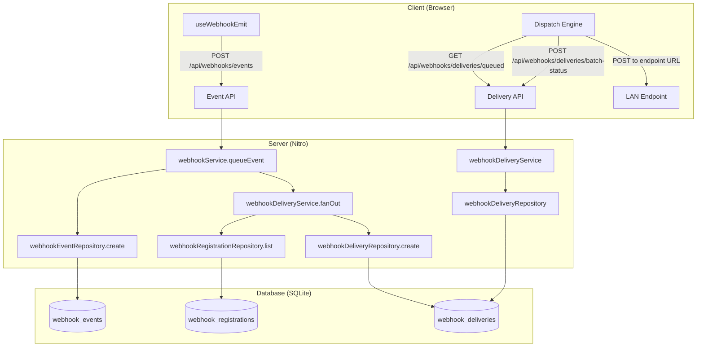
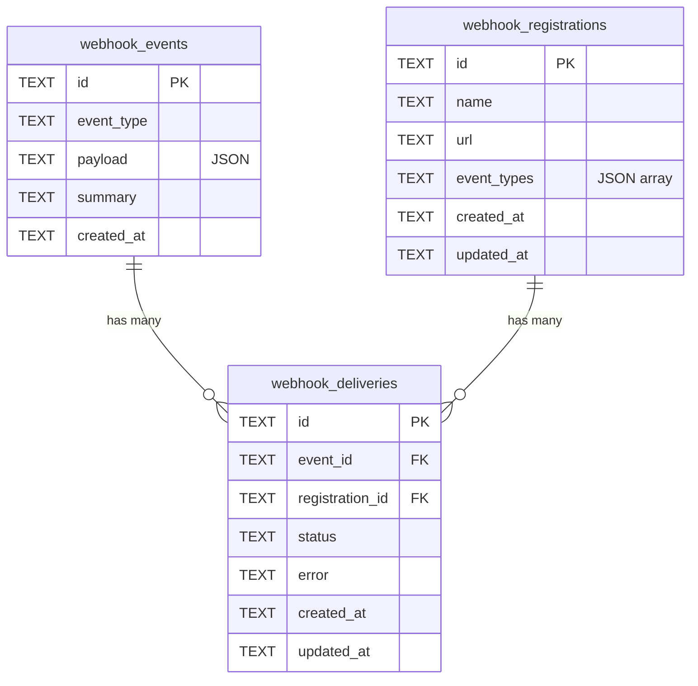
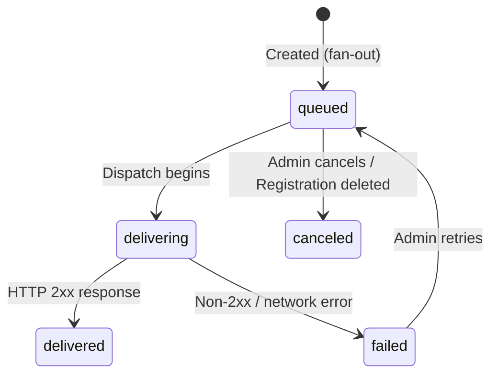

# Design Document: Webhook Registrations

## Overview

This feature replaces the existing singleton webhook configuration (`webhook_config` table with a single endpoint URL and toggle) with a standard multi-registration webhook system. The new architecture introduces:

1. **Webhook Registrations** — Multiple named registrations, each with its own URL and subscribed event types
2. **Webhook Deliveries** — A join table linking events to registrations, enabling per-registration delivery tracking with a full status lifecycle
3. **Restructured UI** — Two-tab layout: Registrations management + Event log with nested delivery details

Client-side dispatch from the browser is preserved since the server cannot reach LAN endpoints. The old singleton config system (`webhook_config` table, config routes, `useWebhookEmit` dispatch logic) is fully replaced — no backward compatibility layer is maintained since this branch is pre-production.

### Key Design Decisions

- **Fan-out at event creation time**: When an event is queued, delivery records are immediately created for all matching registrations that exist at that moment. Registrations created later do not retroactively receive deliveries for past events. This ensures that if a registration is deleted and a new one is created with the same event subscriptions, the new registration only receives deliveries for events recorded after its creation.
- **Delivery status lifecycle**: `queued → delivering → delivered|failed`, with `failed → queued` (retry) and `queued → canceled` transitions. Invalid transitions are rejected.
- **Cascade on registration delete**: Queued deliveries are canceled; delivered/failed records are preserved as history.
- **No wildcard/catch-all subscriptions**: Event types are always explicit values from the Event_Type_Enum. The UI provides a "Subscribe to all" convenience checkbox that simply checks all individual event types.
- **Sequential dispatch per URL**: The client-side dispatch engine processes deliveries sequentially per registration URL to avoid overwhelming endpoints.

## Architecture



### Layer Decomposition

| Layer | Component | Responsibility |
|-------|-----------|----------------|
| API Routes | `server/api/webhooks/registrations/**` | HTTP glue for registration CRUD |
| API Routes | `server/api/webhooks/deliveries/**` | HTTP glue for delivery queries and status updates |
| Service | `webhookRegistrationService` | Registration CRUD + validation |
| Service | `webhookDeliveryService` | Fan-out, status transitions, cascade, replay/retry |
| Service | `webhookService` (modified) | Event recording + triggers delivery fan-out |
| Repository | `webhookRegistrationRepository` | Registration table CRUD |
| Repository | `webhookDeliveryRepository` | Delivery table CRUD + status queries |
| Composable | `useWebhookRegistrations` | Client-side registration management |
| Composable | `useWebhookDeliveries` | Client-side delivery dispatch + status reporting |
| Page | `app/pages/webhooks.vue` (rewritten) | Two-tab UI: Registrations + Event Log |

## Components and Interfaces

### Domain Types

```typescript
// New types added to server/types/domain.ts

export type WebhookDeliveryStatus = 'queued' | 'delivering' | 'delivered' | 'failed' | 'canceled'

export interface WebhookRegistration {
  id: string
  name: string
  url: string
  eventTypes: string[] // Values from WebhookEventType enum only
  createdAt: string
  updatedAt: string
}

export interface WebhookDelivery {
  id: string
  eventId: string
  registrationId: string
  status: WebhookDeliveryStatus
  error?: string
  createdAt: string
  updatedAt: string
}

/** Delivery with joined registration info for the dispatch engine */
export interface QueuedDeliveryView {
  id: string
  eventId: string
  registrationId: string
  registrationName: string
  registrationUrl: string
  eventType: WebhookEventType
  payload: Record<string, unknown>
  summary: string
  eventCreatedAt: string
}

/** Delivery with registration info for the event log UI */
export interface DeliveryDetail {
  id: string
  registrationId: string
  registrationName: string
  registrationUrl: string
  status: WebhookDeliveryStatus
  error?: string
  createdAt: string
  updatedAt: string
}

/** Event with delivery summary for the event log */
export interface EventWithDeliveries {
  id: string
  eventType: WebhookEventType
  payload: Record<string, unknown>
  summary: string
  createdAt: string
  deliverySummary: {
    total: number
    queued: number
    delivering: number
    delivered: number
    failed: number
    canceled: number
  }
}
```

### Repository Interfaces

```typescript
// server/repositories/interfaces/webhookRegistrationRepository.ts

export interface WebhookRegistrationRepository {
  create(registration: WebhookRegistration): WebhookRegistration
  getById(id: string): WebhookRegistration | undefined
  list(): WebhookRegistration[]
  update(id: string, updates: Partial<Pick<WebhookRegistration, 'name' | 'url' | 'eventTypes'>>): WebhookRegistration
  delete(id: string): void
  listByEventType(eventType: string): WebhookRegistration[]
}

// server/repositories/interfaces/webhookDeliveryRepository.ts

export interface WebhookDeliveryRepository {
  create(delivery: WebhookDelivery): WebhookDelivery
  createMany(deliveries: WebhookDelivery[]): void
  getById(id: string): WebhookDelivery | undefined
  listQueued(limit?: number): QueuedDeliveryView[]
  listByEventId(eventId: string): DeliveryDetail[]
  updateStatus(id: string, status: WebhookDeliveryStatus, error?: string): WebhookDelivery
  updateManyStatus(ids: string[], status: WebhookDeliveryStatus): void
  cancelQueuedByRegistrationId(registrationId: string): number
  listFailedByEventId(eventId: string): WebhookDelivery[]
  countByEventId(eventId: string): Record<WebhookDeliveryStatus, number>
  getDeliverySummariesByEventIds(eventIds: string[]): Map<string, Record<WebhookDeliveryStatus, number>>
}
```

### Service Interfaces

```typescript
// webhookRegistrationService

export interface WebhookRegistrationService {
  create(userId: string, input: CreateRegistrationInput): WebhookRegistration
  list(): WebhookRegistration[]
  getById(id: string): WebhookRegistration
  update(userId: string, id: string, input: UpdateRegistrationInput): WebhookRegistration
  delete(userId: string, id: string): void
}

// webhookDeliveryService

export interface WebhookDeliveryService {
  /** Create deliveries for all matching registrations when an event is queued */
  fanOut(event: WebhookEvent): WebhookDelivery[]
  /** List queued deliveries with registration URLs for the dispatch engine */
  listQueued(limit?: number): QueuedDeliveryView[]
  /** Update delivery status (with lifecycle validation) */
  updateStatus(id: string, status: WebhookDeliveryStatus, error?: string): WebhookDelivery
  /** Batch update delivery statuses */
  batchUpdateStatus(updates: { id: string, status: WebhookDeliveryStatus, error?: string }[]): void
  /** Re-queue all deliveries for an event (creates new delivery records) */
  replayEvent(userId: string, eventId: string): WebhookDelivery[]
  /** Re-queue only failed deliveries for an event */
  retryFailed(userId: string, eventId: string): WebhookDelivery[]
  /** Cancel a single queued delivery */
  cancel(id: string): WebhookDelivery
  /** Get deliveries for an event (for the event log detail view) */
  listByEventId(eventId: string): DeliveryDetail[]
}
```

### Zod Schemas

```typescript
// server/schemas/webhookRegistrationSchemas.ts

export const createRegistrationSchema = z.object({
  name: z.string().min(1, 'Name is required').max(100),
  url: z.string().min(1, 'URL is required').url('Must be a valid URL'),
  eventTypes: z.array(z.string()).min(1, 'At least one event type is required'),
})

export const updateRegistrationSchema = z.object({
  name: z.string().min(1).max(100).optional(),
  url: z.string().min(1).url().optional(),
  eventTypes: z.array(z.string()).min(1).optional(),
})

export const batchDeliveryStatusSchema = z.object({
  deliveries: z.array(z.object({
    id: requiredId,
    status: z.enum(['delivering', 'delivered', 'failed', 'queued', 'canceled']),
    error: z.string().optional(),
  })).min(1),
})

export const updateDeliveryStatusSchema = z.object({
  status: z.enum(['delivering', 'delivered', 'failed', 'queued', 'canceled']),
  error: z.string().optional(),
})
```

### API Routes

| Method | Path | Handler |
|--------|------|---------|
| GET | `/api/webhooks/registrations` | List all registrations |
| POST | `/api/webhooks/registrations` | Create a registration (admin) |
| PATCH | `/api/webhooks/registrations/:id` | Update a registration (admin) |
| DELETE | `/api/webhooks/registrations/:id` | Delete with cascade (admin) |
| GET | `/api/webhooks/deliveries/queued` | List queued deliveries with URLs |
| POST | `/api/webhooks/deliveries/batch-status` | Batch update delivery statuses |
| PATCH | `/api/webhooks/deliveries/:id` | Update single delivery status |
| POST | `/api/webhooks/events/:eventId/replay` | Re-queue all deliveries for event |
| POST | `/api/webhooks/events/:eventId/retry-failed` | Re-queue failed deliveries |

Existing routes preserved:
- `POST /api/webhooks/events` — Queue event (now also triggers fan-out)
- `GET /api/webhooks/events` — List events (enhanced with delivery summaries)
- `GET /api/webhooks/events/stats` — Queue stats
- `DELETE /api/webhooks/events/:id` — Delete event
- `DELETE /api/webhooks/events` — Clear all events

Removed routes:
- `GET /api/webhooks/config` — Replaced by registrations
- `PATCH /api/webhooks/config` — Replaced by registrations

## Data Models

### Database Schema (Migration 018)

```sql
-- Create webhook_registrations table
CREATE TABLE webhook_registrations (
  id TEXT PRIMARY KEY,
  name TEXT NOT NULL,
  url TEXT NOT NULL,
  event_types TEXT NOT NULL DEFAULT '[]',  -- JSON array: ["part_advanced", "job_created"]
  created_at TEXT NOT NULL,
  updated_at TEXT NOT NULL
);

-- Create webhook_deliveries table
CREATE TABLE webhook_deliveries (
  id TEXT PRIMARY KEY,
  event_id TEXT NOT NULL REFERENCES webhook_events(id) ON DELETE CASCADE,
  registration_id TEXT NOT NULL REFERENCES webhook_registrations(id),
  status TEXT NOT NULL DEFAULT 'queued',  -- queued | delivering | delivered | failed | canceled
  error TEXT,
  created_at TEXT NOT NULL,
  updated_at TEXT NOT NULL
);

-- Indexes for efficient queries
CREATE INDEX idx_webhook_deliveries_event_id ON webhook_deliveries(event_id);
CREATE INDEX idx_webhook_deliveries_registration_status ON webhook_deliveries(registration_id, status);
CREATE INDEX idx_webhook_deliveries_status ON webhook_deliveries(status);

-- Drop the singleton config table (replaced by registrations)
DROP TABLE IF EXISTS webhook_config;
```

### Entity Relationships



### Delivery Status State Machine



### Valid Status Transitions

| From | To | Trigger |
|------|----|---------|
| queued | delivering | Dispatch engine picks up delivery |
| queued | canceled | Admin cancels or registration deleted |
| delivering | delivered | Endpoint returns 2xx |
| delivering | failed | Endpoint returns non-2xx or network error |
| failed | queued | Admin retries |

## Correctness Properties

*A property is a characteristic or behavior that should hold true across all valid executions of a system — essentially, a formal statement about what the system should do. Properties serve as the bridge between human-readable specifications and machine-verifiable correctness guarantees.*

### Property 1: Registration creation preserves input

*For any* valid registration input (non-empty name, valid URL, non-empty event types array with values from the enum), creating a registration and then retrieving it by ID should produce a record whose name, url, and eventTypes match the original input.

**Validates: Requirements 1.1**

### Property 2: Registration list ordering

*For any* set of N registrations created at distinct times, listing all registrations should return them in reverse chronological order (most recently created first).

**Validates: Requirements 1.2**

### Property 3: Invalid registration input rejection

*For any* registration input where the name is empty/whitespace-only, or the URL is empty/whitespace-only, or the event types array contains a value not in WEBHOOK_EVENT_TYPES, the Registration_Service should reject the request with a validation error and not create a record.

**Validates: Requirements 1.5, 1.6**

### Property 4: Delivery fan-out correctness

*For any* event of a given type and any set of registrations with various event type subscriptions, the number of deliveries created should equal the number of registrations whose `eventTypes` array contains the event type. All created deliveries should have status "queued".

**Validates: Requirements 2.4, 2.6, 2.7**

### Property 5: Delivery status lifecycle enforcement

*For any* delivery in a given status and any target status, the transition should succeed only if it follows the allowed lifecycle: {queued→delivering, queued→canceled, delivering→delivered, delivering→failed, failed→queued}. All other transitions should be rejected with a validation error.

**Validates: Requirements 3.6**

### Property 6: Registration deletion cascade

*For any* registration with deliveries in mixed statuses (queued, delivering, delivered, failed), deleting the registration should transition all "queued" deliveries to "canceled" while leaving "delivered" and "failed" deliveries unchanged.

**Validates: Requirements 4.1, 4.2**

### Property 7: Retry-failed selectivity

*For any* event with deliveries in mixed statuses, calling retry-failed should transition only the "failed" deliveries to "queued" status, leaving all other deliveries (queued, delivering, delivered, canceled) unchanged.

**Validates: Requirements 6.5**

### Property 8: Replay creates new deliveries for all matching registrations

*For any* event and any set of active registrations matching that event's type, replaying the event should create new delivery records (one per matching registration) with status "queued", without modifying existing delivery records.

**Validates: Requirements 6.4**

### Property 9: Delivery round-trip serialization

*For any* valid WebhookDelivery object, converting it to a database row and back (serialize then deserialize) should produce an equivalent object.

**Validates: Requirements 8.7**

### Property 10: Dispatch payload completeness

*For any* queued delivery view (event + registration), the constructed dispatch payload should contain the fields: `event` (event type), `summary`, `timestamp` (event createdAt), plus all keys from the event payload spread at the top level.

**Validates: Requirements 5.3**

### Property 11: Event ID uniqueness

*For any* N events created in sequence, all generated event IDs should be distinct.

**Validates: Requirements 2.3**

### Property 12: No retroactive deliveries for new registrations

*For any* set of events already recorded and any new registration created after those events, the fan-out process should NOT create delivery records linking the new registration to any previously recorded events. Only events recorded after the registration exists should produce deliveries for it.

**Validates: Requirements 2.5**

## Error Handling

### Validation Errors (400)

| Scenario | Error |
|----------|-------|
| Empty registration name | `ValidationError: Name is required` |
| Empty/invalid URL | `ValidationError: Must be a valid URL` |
| Empty event types array | `ValidationError: At least one event type is required` |
| Unknown event type (not in enum) | `ValidationError: Invalid event type: {type}` |
| Invalid status transition | `ValidationError: Cannot transition from {from} to {to}` |

### Not Found Errors (404)

| Scenario | Error |
|----------|-------|
| Registration ID not found | `NotFoundError: WebhookRegistration {id} not found` |
| Delivery ID not found | `NotFoundError: WebhookDelivery {id} not found` |
| Event ID not found (for replay/retry) | `NotFoundError: WebhookEvent {id} not found` |

### Authorization Errors (401/403)

All registration mutation endpoints (create, update, delete) and delivery management endpoints (replay, retry-failed) require admin authentication via `getAuthUserId(event)` + `requireAdmin()`.

### Client-Side Dispatch Errors

The dispatch engine handles errors gracefully:
- Network errors → delivery marked as `failed` with error message
- Non-2xx responses → delivery marked as `failed` with `HTTP {status}: {statusText}`
- Dispatch failures never block the UI or break the event queue

## Testing Strategy

### Property-Based Tests (fast-check)

Each correctness property maps to a property-based test with minimum 100 iterations:

| Property | Test File | What It Tests |
|----------|-----------|---------------|
| P1: Registration creation | `webhookRegistration.property.test.ts` | Create + retrieve round-trip |
| P2: List ordering | `webhookRegistration.property.test.ts` | Reverse chronological sort |
| P3: Invalid input rejection | `webhookRegistration.property.test.ts` | Validation rejects bad input |
| P4: Fan-out correctness | `webhookDeliveryFanout.property.test.ts` | Correct delivery count + initial status |
| P5: Lifecycle enforcement | `webhookDeliveryLifecycle.property.test.ts` | State machine transitions |
| P6: Deletion cascade | `webhookDeliveryFanout.property.test.ts` | Queued→canceled, others preserved |
| P7: Retry-failed selectivity | `webhookDeliveryLifecycle.property.test.ts` | Only failed deliveries change |
| P8: Replay correctness | `webhookDeliveryFanout.property.test.ts` | New deliveries for all matching |
| P9: Serialization round-trip | `webhookDeliverySerialization.property.test.ts` | Row↔object equivalence |
| P10: Payload completeness | `webhookDispatchPayload.property.test.ts` | Required fields present |
| P11: Event ID uniqueness | `webhookDeliveryFanout.property.test.ts` | All IDs distinct |
| P12: No retroactive deliveries | `webhookDeliveryFanout.property.test.ts` | New registrations don't get past events |

**Library**: `fast-check`
**Tag format**: `Feature: webhook-registrations, Property {N}: {title}`
**Minimum iterations**: 100 per property

### Unit Tests

| Area | Coverage |
|------|----------|
| `webhookRegistrationService` | CRUD operations, validation |
| `webhookDeliveryService` | Fan-out logic, status transitions, cascade, replay/retry |
| `webhookRegistrationSchemas` | Zod schema validation (valid/invalid inputs) |
| Delivery status helpers | `isValidTransition()` utility function |

### Integration Tests

| Test | What It Verifies |
|------|-----------------|
| Registration lifecycle | Create → update → delete with cascade |
| Event + delivery flow | Queue event → fan-out → status updates |
| Event + fan-out flow | POST event → fan-out creates deliveries → status updates |
| Transaction safety | Registration delete + delivery cancel atomicity |

### What Is NOT Property-Tested

- UI rendering (Registrations page, Event log) → manual testing + example-based component tests
- Client-side dispatch (browser fetch calls) → mock-based unit tests
- Migration correctness → smoke test (run migration, verify schema)
- Auth guards → example-based route tests
