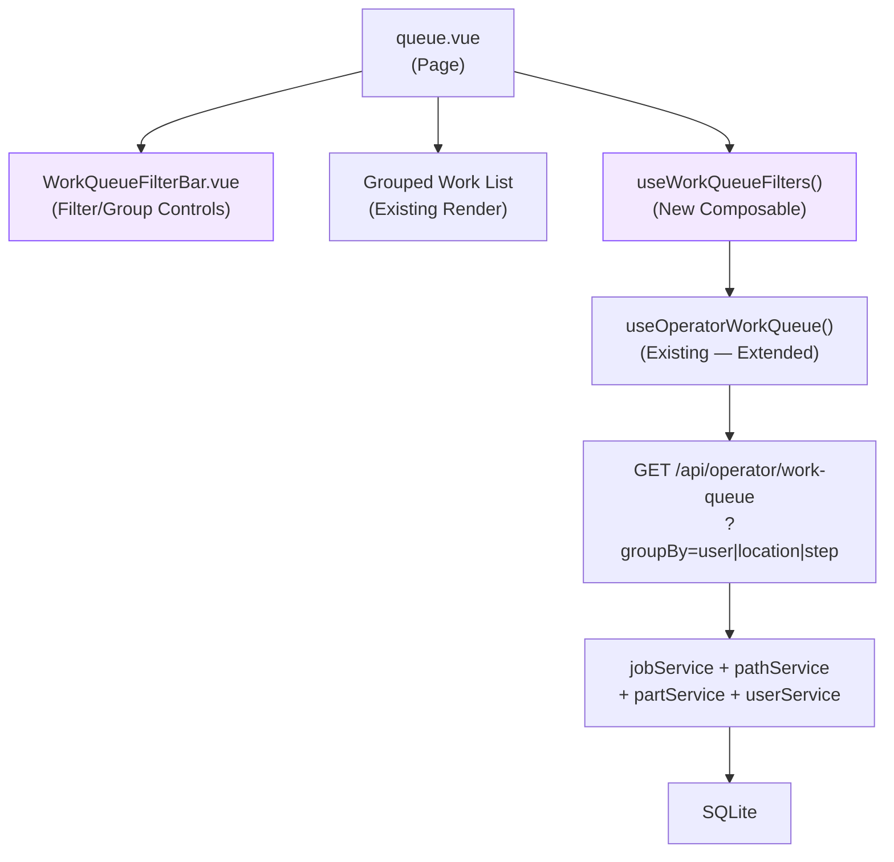
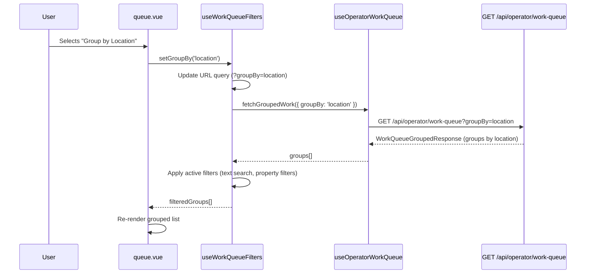
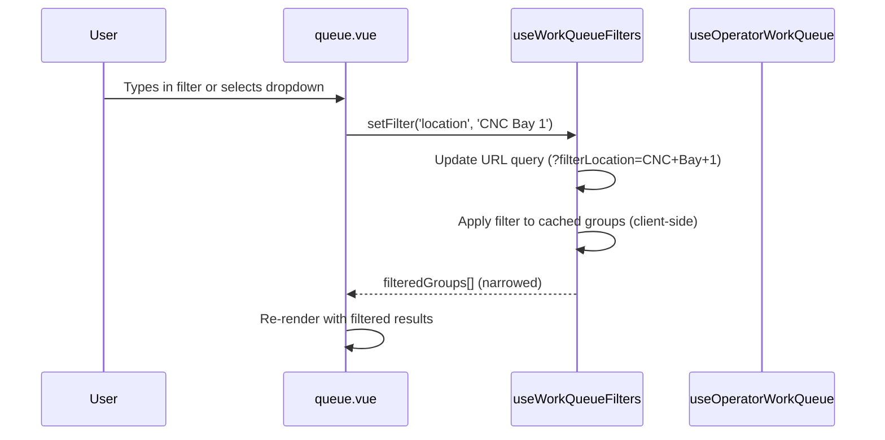

# Design Document: Work Queue Filtering & Grouping

## Overview

This feature addresses **GitHub Issue #68** — "Work Queue Filtering/Grouping" — requested by toolpathguy. The current work queue (`/queue`) groups work exclusively by operator (assigned user). This design introduces a flexible filtering and grouping system that allows users to group and filter work queue entries by multiple properties: **user** (current behavior), **location**, and **step name**.

The approach adds a client-side grouping/filtering layer on top of the existing `WorkQueueGroupedResponse` API. The API endpoint is extended with an optional `groupBy` query parameter so the server can return data pre-grouped by the requested dimension, avoiding client-side re-aggregation of flat data. Filter predicates are applied client-side for responsiveness, with URL-synced state so filter configurations are shareable and bookmarkable.

The default grouping is changed from "group by user" to **"group by location"** with no filters, reflecting the most common shop-floor workflow. Users can also save named filter/group configurations as **presets** (persisted to localStorage) and quickly switch between them via a dropdown.

## Architecture



New components and composables are highlighted in purple. The existing work queue composable and API route are extended, not replaced.

## Sequence Diagrams

### Main Flow: User Changes Group-By Dimension



### Filter Flow: User Applies Property Filters



## Components and Interfaces

### Component 1: WorkQueueFilterBar.vue

**Purpose**: Renders the group-by selector and active filter controls. Replaces the inline search input currently in `queue.vue`.

**Interface**:
```typescript
// Props
interface WorkQueueFilterBarProps {
  groupBy: GroupByDimension
  filters: WorkQueueFilterState
  availableLocations: string[]
  availableSteps: string[]
  availableUsers: { id: string; displayName: string }[]
  presets: WorkQueuePreset[]
  activePresetId: string | null
}

// Emits
interface WorkQueueFilterBarEmits {
  (e: 'update:groupBy', value: GroupByDimension): void
  (e: 'update:filters', value: WorkQueueFilterState): void
  (e: 'clear'): void
  (e: 'savePreset', name: string): void
  (e: 'loadPreset', presetId: string): void
  (e: 'deletePreset', presetId: string): void
}
```

**Responsibilities**:
- Render group-by toggle/select (user / location / step)
- Render filter dropdowns populated from available values
- Render text search input
- Render saved presets dropdown with save/delete actions
- Emit changes upward; does not own state

### Component 2: useWorkQueueFilters (Composable)

**Purpose**: Manages filter/group state, URL synchronization, and client-side filtering logic. Sits between `queue.vue` and `useOperatorWorkQueue`.

**Interface**:
```typescript
interface UseWorkQueueFiltersReturn {
  // State
  groupBy: Ref<GroupByDimension>
  filters: Ref<WorkQueueFilterState>
  searchQuery: Ref<string>

  // Presets
  presets: Ref<WorkQueuePreset[]>
  activePresetId: Ref<string | null>

  // Computed
  filteredGroups: ComputedRef<WorkQueueGroup[]>
  activeFilterCount: ComputedRef<number>
  availableLocations: ComputedRef<string[]>
  availableSteps: ComputedRef<string[]>

  // Actions
  setGroupBy(dimension: GroupByDimension): void
  setFilter(key: keyof WorkQueueFilterState, value: string | undefined): void
  clearFilters(): void
  syncFromUrl(): void

  // Preset Actions
  savePreset(name: string): void
  loadPreset(presetId: string): void
  deletePreset(presetId: string): void
}
```

**Responsibilities**:
- Own reactive filter/group state
- Sync state to/from URL query parameters
- Compute filtered groups from raw API response
- Extract available filter values from the unfiltered dataset
- Manage saved presets (CRUD) persisted to localStorage

## Data Models

### GroupByDimension

```typescript
type GroupByDimension = 'user' | 'location' | 'step'
```

### WorkQueueFilterState

```typescript
interface WorkQueueFilterState {
  location?: string    // filter to specific location
  stepName?: string    // filter to specific step name
  userId?: string      // filter to specific operator
}
```

**Validation Rules**:
- All filter fields are optional; empty/undefined means "no filter on this dimension"
- Filter values are case-insensitive for matching
- `groupBy` defaults to `'location'` when absent from URL

### WorkQueuePreset

```typescript
interface WorkQueuePreset {
  id: string                      // unique ID (crypto.randomUUID())
  name: string                    // user-provided display name
  groupBy: GroupByDimension
  filters: WorkQueueFilterState
  searchQuery: string
  createdAt: string               // ISO timestamp
}
```

**Storage**: Array of `WorkQueuePreset` serialized to `localStorage` under key `wq-filter-presets`.

**Validation Rules**:
- `name` must be non-empty and ≤ 50 characters
- `id` is auto-generated, never user-supplied
- Maximum 20 presets stored (oldest deleted if exceeded)
- Duplicate names are allowed (distinguished by ID)

### WorkQueueGroup (Generalized from OperatorGroup)

```typescript
/** A generalized group — can represent a user, location, or step grouping */
interface WorkQueueGroup {
  groupKey: string | null       // the grouping value (userId, location string, step name)
  groupLabel: string            // display label
  groupType: GroupByDimension   // which dimension this group represents
  jobs: WorkQueueJob[]          // work entries in this group, sorted by jobPriority descending
  totalParts: number
}
```

**Validation Rules**:
- `groupKey` is `null` only for the "Unassigned" / "No Location" / ungrouped bucket
- `groupLabel` is always a non-empty display string
- `jobs` array may be empty after filtering (group is hidden in that case)

### Extended API Response

The existing `WorkQueueGroupedResponse` is reused. The server-side grouping logic is parameterized by `groupBy`:

```typescript
// Query parameter added to GET /api/operator/work-queue
interface WorkQueueQueryParams {
  groupBy?: 'user' | 'location' | 'step'  // default: 'location'
}
```


## Key Functions with Formal Specifications

### Function 1: groupEntriesByDimension()

```typescript
function groupEntriesByDimension(
  entries: { job: WorkQueueJob; assignedTo?: string; location?: string }[],
  dimension: GroupByDimension,
  userNameMap: Map<string, string>
): WorkQueueGroup[]
```

**Preconditions:**
- `entries` is a valid array (may be empty)
- `dimension` is one of `'user' | 'location' | 'step'`
- `userNameMap` maps user IDs to display names

**Postconditions:**
- Every entry appears in exactly one group
- Sum of all `group.totalParts` equals sum of all `entry.job.partCount`
- Groups with `groupKey === null` are labeled "Unassigned" (user), "No Location" (location), or "Unknown Step" (step)
- No empty groups are returned (groups with zero jobs after grouping are excluded)
- Jobs within each group are sorted by parent job priority descending (highest priority first)

**Loop Invariants:**
- Running total of assigned entries equals entries processed so far

### Function 2: applyFilters()

```typescript
function applyFilters(
  groups: WorkQueueGroup[],
  filters: WorkQueueFilterState,
  searchQuery: string
): WorkQueueGroup[]
```

**Preconditions:**
- `groups` is a valid array of `WorkQueueGroup`
- `filters` has only valid keys (location, stepName, userId)
- `searchQuery` is a string (may be empty)

**Postconditions:**
- Result is a subset of input groups (no new groups created)
- Each returned group contains only jobs matching ALL active filters (AND logic)
- Empty groups (all jobs filtered out) are excluded from result
- When all filters are empty/undefined and searchQuery is empty, result equals input
- Original group ordering is preserved
- Job ordering within each group is preserved (priority sort from server maintained)

**Loop Invariants:**
- For each group processed: filtered jobs ⊆ original jobs

### Function 3: extractAvailableValues()

```typescript
function extractAvailableValues(
  groups: WorkQueueGroup[]
): { locations: string[]; stepNames: string[]; userIds: string[] }
```

**Preconditions:**
- `groups` is a valid array (may be empty)

**Postconditions:**
- Each returned array contains unique, sorted values
- Values are extracted from ALL jobs across ALL groups (unfiltered source)
- Empty/undefined values are excluded

## Algorithmic Pseudocode

### Server-Side Grouping Algorithm

```typescript
// In GET /api/operator/work-queue handler
ALGORITHM groupWorkQueue(groupBy: GroupByDimension)
INPUT: groupBy dimension from query parameter (default: 'location')
OUTPUT: WorkQueueGroupedResponse

BEGIN
  entries ← collectAllWorkEntries()  // existing logic: iterate jobs → paths → steps → parts
  
  groupMap ← new Map<string | null, WorkQueueJob[]>()
  
  FOR EACH entry IN entries DO
    // INVARIANT: every entry is assigned to exactly one group key
    key ← SWITCH groupBy
      CASE 'user':     entry.assignedTo ?? null
      CASE 'location': entry.job.stepLocation ?? null
      CASE 'step':     entry.job.stepName
    END SWITCH
    
    groupMap.get(key)?.push(entry.job) ?? groupMap.set(key, [entry.job])
  END FOR
  
  groups ← []
  FOR EACH [key, jobs] IN groupMap DO
    label ← SWITCH groupBy
      CASE 'user':     key ? userNameMap.get(key) ?? key : 'Unassigned'
      CASE 'location': key ?? 'No Location'
      CASE 'step':     key ?? 'Unknown Step'
    END SWITCH
    
    groups.push({ groupKey: key, groupLabel: label, groupType: groupBy, jobs, totalParts: sum(jobs.partCount) })
  END FOR
  
  // Sort jobs within each group by parent job priority (descending — higher priority first)
  FOR EACH group IN groups DO
    group.jobs.sort((a, b) => b.jobPriority - a.jobPriority)
  END FOR
  
  RETURN { groups, totalParts: sum(entries.partCount) }
END
```

### Client-Side Filter Algorithm

```typescript
ALGORITHM applyClientFilters(groups, filters, searchQuery)
INPUT: groups: WorkQueueGroup[], filters: WorkQueueFilterState, searchQuery: string
OUTPUT: filtered WorkQueueGroup[]

BEGIN
  q ← searchQuery.trim().toLowerCase()
  
  result ← []
  FOR EACH group IN groups DO
    // INVARIANT: filteredJobs ⊆ group.jobs
    filteredJobs ← group.jobs.filter(job => {
      // Property filters (AND logic)
      IF filters.location AND job.stepLocation !== filters.location THEN RETURN false
      IF filters.stepName AND job.stepName !== filters.stepName THEN RETURN false
      IF filters.userId AND job.assignedTo !== filters.userId THEN RETURN false
      
      // Text search (OR across fields)
      IF q AND NOT (
        job.jobName.toLowerCase().includes(q) OR
        job.stepName.toLowerCase().includes(q) OR
        (job.stepLocation?.toLowerCase().includes(q) ?? false) OR
        group.groupLabel.toLowerCase().includes(q)
      ) THEN RETURN false
      
      RETURN true
    })
    
    IF filteredJobs.length > 0 THEN
      result.push({ ...group, jobs: filteredJobs, totalParts: sum(filteredJobs.partCount) })
    END IF
  END FOR
  
  // POSTCONDITION: sum(result.totalParts) ≤ sum(groups.totalParts)
  RETURN result
END
```

### URL Synchronization Algorithm

```typescript
ALGORITHM syncFiltersToUrl(groupBy, filters, searchQuery, router)
INPUT: current filter state
OUTPUT: URL query parameters updated (side effect)

BEGIN
  query ← {}
  
  IF groupBy !== 'location' THEN query.groupBy ← groupBy  // omit default
  IF filters.location THEN query.filterLocation ← filters.location
  IF filters.stepName THEN query.filterStep ← filters.stepName
  IF filters.userId THEN query.filterUser ← filters.userId
  IF searchQuery THEN query.q ← searchQuery
  
  // Preserve non-filter query params (e.g., operator)
  FOR EACH [key, value] IN currentRoute.query DO
    IF key NOT IN filterKeys THEN query[key] ← value
  END FOR
  
  router.replace({ query })
END
```

### Preset Management Algorithm

```typescript
ALGORITHM savePreset(name, groupBy, filters, searchQuery)
INPUT: preset name and current filter state
OUTPUT: preset saved to localStorage, presets list updated

BEGIN
  preset ← {
    id: crypto.randomUUID(),
    name: name.trim(),
    groupBy,
    filters: deepClone(filters),
    searchQuery,
    createdAt: new Date().toISOString()
  }
  
  presets ← loadPresetsFromStorage()
  presets.push(preset)
  
  // Cap at 20 presets — remove oldest if exceeded
  IF presets.length > 20 THEN
    presets ← presets.slice(presets.length - 20)
  END IF
  
  localStorage.setItem('wq-filter-presets', JSON.stringify(presets))
  activePresetId ← preset.id
END

ALGORITHM loadPreset(presetId)
INPUT: preset ID to activate
OUTPUT: filter state restored from preset, URL updated

BEGIN
  presets ← loadPresetsFromStorage()
  preset ← presets.find(p => p.id === presetId)
  
  IF preset IS null THEN RETURN  // silently ignore missing preset
  
  groupBy ← preset.groupBy
  filters ← deepClone(preset.filters)
  searchQuery ← preset.searchQuery
  activePresetId ← preset.id
  
  syncFiltersToUrl(groupBy, filters, searchQuery, router)
  // groupBy change triggers API re-fetch
END

ALGORITHM deletePreset(presetId)
INPUT: preset ID to remove
OUTPUT: preset removed from localStorage

BEGIN
  presets ← loadPresetsFromStorage().filter(p => p.id !== presetId)
  localStorage.setItem('wq-filter-presets', JSON.stringify(presets))
  
  IF activePresetId === presetId THEN
    activePresetId ← null
  END IF
END
```

## Example Usage

```typescript
// In queue.vue <script setup>
const {
  groupBy,
  filters,
  searchQuery,
  filteredGroups,
  activeFilterCount,
  availableLocations,
  availableSteps,
  presets,
  activePresetId,
  setGroupBy,
  setFilter,
  clearFilters,
  syncFromUrl,
  savePreset,
  loadPreset,
  deletePreset,
} = useWorkQueueFilters()

// Default view: grouped by location, no filters
// → URL: /queue (no query params needed — location is the default)
// → Groups show "CNC Bay 1", "Assembly", "QC", "No Location"

// User switches grouping to "user"
setGroupBy('user')
// → URL becomes /queue?groupBy=user
// → API re-fetched with ?groupBy=user

// User adds a step name filter
setFilter('stepName', 'Deburr')
// → URL becomes /queue?groupBy=user&filterStep=Deburr
// → Client-side: only jobs at "Deburr" step shown within each user group

// User saves this config as a preset
savePreset('Deburr by Operator')
// → Preset stored in localStorage with current groupBy + filters
// → Preset dropdown now shows "Deburr by Operator"

// Later, user loads the saved preset
loadPreset(presetId)
// → groupBy, filters, searchQuery restored from preset
// → URL and API updated accordingly

// User clears all filters
clearFilters()
// → URL becomes /queue (default location grouping, no filters)
// → activePresetId cleared
```

```html
<!-- In queue.vue <template> -->
<WorkQueueFilterBar
  :group-by="groupBy"
  :filters="filters"
  :available-locations="availableLocations"
  :available-steps="availableSteps"
  :available-users="activeUsers"
  :presets="presets"
  :active-preset-id="activePresetId"
  @update:group-by="setGroupBy"
  @update:filters="(f) => Object.entries(f).forEach(([k, v]) => setFilter(k, v))"
  @clear="clearFilters"
  @save-preset="savePreset"
  @load-preset="loadPreset"
  @delete-preset="deletePreset"
/>
```

## Correctness Properties

*A property is a characteristic or behavior that should hold true across all valid executions of a system — essentially, a formal statement about what the system should do. Properties serve as the bridge between human-readable specifications and machine-verifiable correctness guarantees.*

### Property 1: Grouping Completeness (CP-WQF-1)

*For any* set of work queue entries and *for any* valid `groupBy` dimension (`user`, `location`, or `step`), every entry appears in exactly one group, the sum of `group.totalParts` across all groups equals the total parts in the input, and no group has zero jobs.

**Validates: Requirements 2.4, 2.5, 2.6**

### Property 2: Filter Subset (CP-WQF-2)

*For any* set of work queue groups and *for any* combination of property filters and search query, every job in the filtered output exists in the input, no jobs are duplicated, and the original group and job ordering is preserved.

**Validates: Requirements 4.2, 4.3, 4.4**

### Property 3: Empty Filter Identity (CP-WQF-3)

*For any* set of work queue groups, when all property filters are empty/undefined and the search query is empty, `applyFilters(groups)` returns the input groups unchanged.

**Validates: Requirement 4.5**

### Property 4: Filter Monotonicity (CP-WQF-4)

*For any* set of work queue groups and *for any* set of active filters, adding an additional filter (property filter or text search) can only narrow or maintain the result set, never expand it. `|applyFilters(groups, filters ∪ {f})| ≤ |applyFilters(groups, filters)|`.

**Validates: Requirements 4.2, 5.3**

### Property 5: URL State Round-Trip (CP-WQF-5)

*For any* valid filter state (groupBy, filters, searchQuery), serializing to URL query parameters and deserializing back produces the original state. `deserialize(serialize(state)) === state`.

**Validates: Requirement 6.6**

### Property 6: Group-By Dimension Consistency (CP-WQF-6)

*For any* set of work queue entries and *for any* valid `groupBy` dimension, every group in the response has `groupType` matching the requested dimension.

**Validates: Requirement 1.4**

### Property 7: Search Backward Compatibility (CP-WQF-7)

*For any* text search query that matches a job via the existing search fields (jobName, stepName), that same job appears in the new filtering system's search results.

**Validates: Requirement 10.3**

### Property 8: Preset Round-Trip (CP-WQF-8)

*For any* valid filter state (groupBy, filters, searchQuery), saving it as a preset and immediately loading that preset restores the exact same `groupBy`, `filters`, and `searchQuery` values.

**Validates: Requirements 7.3, 7.4**

### Property 9: Preset Capacity (CP-WQF-9)

*For any* sequence of preset save operations, the presets array length never exceeds 20. After saving the 21st preset, the oldest preset is evicted.

**Validates: Requirement 7.5**

### Property 10: Priority Ordering (CP-WQF-10)

*For any* work queue group, jobs within the group are sorted by `jobPriority` descending. For any adjacent pair `jobs[i]` and `jobs[i+1]`, `jobs[i].jobPriority >= jobs[i+1].jobPriority`.

**Validates: Requirement 3.1**

## Error Handling

### Error Scenario 1: Invalid groupBy Parameter

**Condition**: API receives `groupBy` value not in `['user', 'location', 'step']`
**Response**: Ignore invalid value, default to `'location'`
**Recovery**: No error surfaced to user; falls back gracefully

### Error Scenario 2: Stale Filter Values

**Condition**: URL contains `filterLocation=CNC+Bay+1` but no current work entries have that location
**Response**: Filter applied normally, resulting in zero visible groups
**Recovery**: UI shows "No results matching filters" empty state with a "Clear filters" button

### Error Scenario 3: API Fetch Failure

**Condition**: Network error or server error on work queue fetch
**Response**: Existing error handling preserved — error message + retry button
**Recovery**: Filters and groupBy state preserved across retry

### Error Scenario 4: Corrupt localStorage Presets

**Condition**: `localStorage.getItem('wq-filter-presets')` returns invalid JSON or unexpected shape
**Response**: Silently reset presets to empty array `[]`
**Recovery**: User can save new presets; no error surfaced

## Testing Strategy

### Unit Testing Approach

- `groupEntriesByDimension()` — pure function, test each dimension with known inputs
- `applyFilters()` — pure function, test filter combinations
- `extractAvailableValues()` — pure function, test deduplication and sorting
- URL serialization/deserialization round-trip
- Preset save/load/delete round-trip with localStorage mock
- `WorkQueueFilterBar.vue` — emit correctness on user interaction, preset dropdown rendering

### Property-Based Testing Approach

**Property Test Library**: `fast-check`

| Property | Description |
|----------|-------------|
| CP-WQF-1 | Grouping completeness: all entries accounted for, no duplicates |
| CP-WQF-2 | Filter subset: output ⊆ input |
| CP-WQF-3 | Empty filter identity |
| CP-WQF-4 | Filter monotonicity (adding filters narrows results) |
| CP-WQF-5 | URL state round-trip |
| CP-WQF-8 | Preset save/load round-trip |
| CP-WQF-9 | Preset capacity cap (max 20) |
| CP-WQF-10 | Priority ordering within groups (descending) |

### Integration Testing Approach

- End-to-end: seed database with jobs at various steps/locations/users, hit API with each `groupBy` value, verify response structure
- Verify backward compatibility: existing `/api/operator/work-queue` (no params) returns same shape as before

## Performance Considerations

- Client-side filtering avoids extra API calls when only filters change (groupBy stays the same)
- Server re-fetch only needed when `groupBy` dimension changes (different aggregation needed)
- Available filter values extracted from the unfiltered response (no extra API call)
- Debounced text search (existing 300ms debounce preserved)

## Security Considerations

- No new authentication/authorization concerns — work queue is already accessible to all users
- Filter values come from existing domain data (step names, locations, user IDs) — no user-supplied arbitrary strings stored server-side
- URL query params are sanitized on read (unknown keys ignored, invalid values fall back to defaults)

## Dependencies

- No new external dependencies
- Extends existing: `useOperatorWorkQueue` composable, `GET /api/operator/work-queue` API route
- New: `useWorkQueueFilters` composable, `WorkQueueFilterBar.vue` component
- UI components: `USelect`, `UInput`, `UButton`, `UBadge` (all from Nuxt UI, already available)
