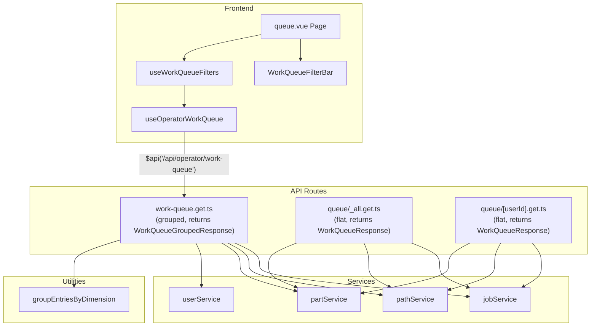
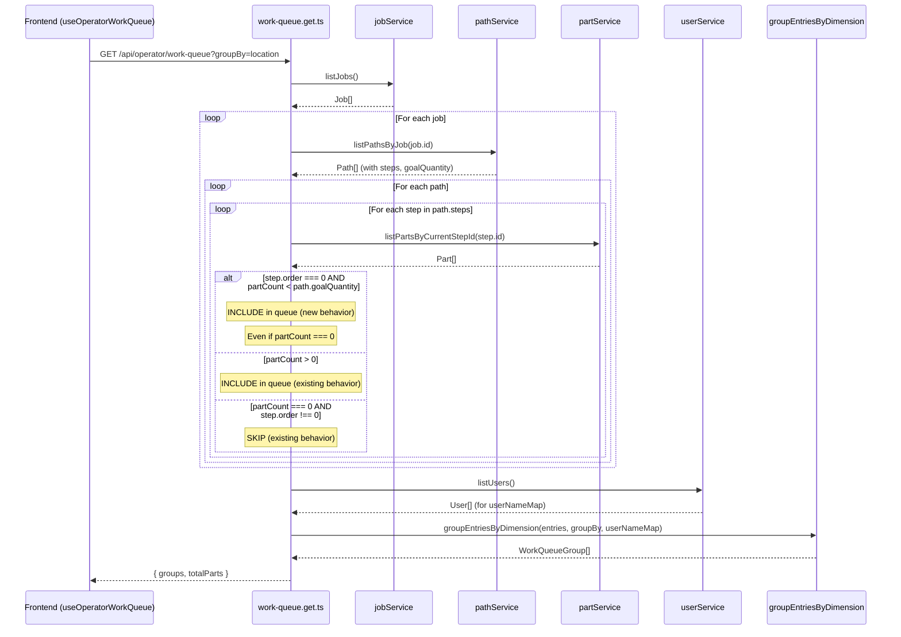

# Design Document: Work Queue Shows First Step

## Overview

This design addresses **GitHub Issue #123** — "Feature Request: Work Queue Shows First Step."

Currently, the work queue only displays steps that have parts physically present (i.e., `listPartsByCurrentStepId(stepId)` returns a non-empty list). The sole exception is the `_all` queue endpoint, which already includes step 0 even with zero parts via `if (parts.length === 0 && step.order !== 0) continue`. However, the main grouped work queue endpoint (`/api/operator/work-queue`) and the per-user endpoint (`/api/operator/queue/[userId]`) skip steps with zero parts entirely via `if (parts.length === 0) continue`.

The problem: when a job/path is created but no parts have been created yet at step 0, the job is invisible in the work queue. Operators have no visibility on jobs that need initial part creation. The feature request asks that the first step (step 0) of every path always appear in the work queue until the number of parts at step 0 meets or exceeds the path's `goalQuantity`. This gives operators a clear signal that work needs to begin.

## Architecture

The change is confined to the work queue data assembly layer — the three API routes that build `WorkQueueJob` entries. No new tables, services, or repositories are needed. The `WorkQueueJob` type gains one optional field (`goalQuantity`) so the frontend can display progress context.

The main grouped endpoint (`work-queue.get.ts`) builds an `entries[]` array of `{ job: WorkQueueJob, assignedTo }` objects, then passes them through `groupEntriesByDimension()` to produce `WorkQueueGroupedResponse`. The flat endpoints (`_all.get.ts`, `[userId].get.ts`) build a `Map<string, WorkQueueJob>` keyed by `jobId|pathId|stepOrder` and return `WorkQueueResponse`.



## Sequence Diagram: Work Queue Entry Assembly



## Components and Interfaces

### Modified Type: WorkQueueJob

The `WorkQueueJob` interface in `server/types/computed.ts` gains one new optional field. Current actual type:

```typescript
export interface WorkQueueJob {
  jobId: string
  jobName: string
  pathId: string
  pathName: string
  stepId: string
  stepName: string
  stepOrder: number
  stepLocation?: string
  totalSteps: number
  partIds: readonly string[]
  partCount: number
  previousStepId?: string
  previousStepName?: string
  nextStepId?: string
  nextStepName?: string
  nextStepLocation?: string
  isFinalStep: boolean
  stepOptional?: boolean
  assignedTo?: string
  jobPriority: number

  // NEW: path goal quantity for first-step progress display
  goalQuantity?: number
}
```

Note: The type definition includes `previousStepId`, `previousStepName`, `nextStepId`, and `stepOptional` fields, but the current route implementations do not populate all of them. The routes only set `nextStepName`, `nextStepLocation`, `assignedTo`, and `isFinalStep`. This is pre-existing and not affected by this change.

### Modified API Routes

Three routes need the same logic change:

| Route | File | Response Type | Current First-Step Behavior | New Behavior |
|-------|------|---------------|----------------------------|--------------|
| `GET /api/operator/work-queue` | `server/api/operator/work-queue.get.ts` | `WorkQueueGroupedResponse` | Skips steps with 0 parts (`if (parts.length === 0) continue`) | Include step 0 if `partCount < goalQuantity` |
| `GET /api/operator/queue/_all` | `server/api/operator/queue/_all.get.ts` | `WorkQueueResponse` | Includes step 0 with 0 parts already (`if (parts.length === 0 && step.order !== 0) continue`) | Add `goalQuantity` field to entry; tighten condition to also check `< goalQuantity` |
| `GET /api/operator/queue/[userId]` | `server/api/operator/queue/[userId].get.ts` | `WorkQueueResponse` | Skips steps with 0 parts (`if (parts.length === 0) continue`) | Include step 0 if `partCount < goalQuantity` |

### Unchanged Components

- `WorkQueueGroup`, `WorkQueueGroupedResponse`, `WorkQueueResponse` — no structural changes
- `groupEntriesByDimension()` in `server/utils/workQueueGrouping.ts` — operates on `WorkQueueJob[]`, transparent to new field; sorts by `jobPriority` descending
- `useOperatorWorkQueue` composable — uses `const $api = useAuthFetch()` then calls `$api<T>(url)` for authenticated API requests, passes data through
- `useWorkQueueFilters` composable — wraps `useOperatorWorkQueue` with groupBy, client-side filtering, URL sync, and presets; filtering logic is field-agnostic
- `queue.vue` — minor optional enhancement to show goal context on first-step entries (e.g. "0 / 10 parts" badge)

## Data Models

No schema changes. The feature uses existing data:

| Entity | Field | Usage |
|--------|-------|-------|
| `Path` | `goalQuantity: number` | Threshold: first step included until `partCount >= goalQuantity` |
| `Path` | `steps: readonly ProcessStep[]` | Steps array; `steps[0]` is the first step (order 0) |
| `ProcessStep` | `order: number` | 0-based position; identifies step 0 (first step) |
| `ProcessStep` | `removedAt?: string` | Soft-delete timestamp; must be checked before force-including |
| `ProcessStep` | `completedCount: number` | Write-time counter (not used for this feature) |
| `Part` | `currentStepId: string \| null` | Used by `listPartsByCurrentStepId()` to count parts at step |

## Key Functions with Formal Specifications

### Function: shouldIncludeStep()

```typescript
function shouldIncludeStep(
  step: ProcessStep,
  partCount: number,
  pathGoalQuantity: number,
): boolean
```

**Preconditions:**
- `step` is a valid, non-soft-deleted `ProcessStep` (`!step.removedAt`)
- `partCount >= 0`
- `pathGoalQuantity > 0` (enforced by `assertPositive` on path creation)

**Postconditions:**
- Returns `true` if `partCount > 0` (existing behavior — step has work)
- Returns `true` if `step.order === 0 AND partCount < pathGoalQuantity` (new behavior — first step needs parts)
- Returns `false` otherwise (non-first step with no parts)

**Loop Invariants:** N/A (pure predicate, no loops)

### Function: buildWorkQueueEntry()

```typescript
function buildWorkQueueEntry(
  job: Job,
  path: Path,
  step: ProcessStep,
  parts: Part[],
): WorkQueueJob
```

**Preconditions:**
- `job`, `path`, `step` are valid domain objects
- `step` belongs to `path.steps`
- `parts` is the result of `listPartsByCurrentStepId(step.id)`

**Postconditions:**
- Returns a `WorkQueueJob` with all existing fields populated
- If `step.order === 0`: `goalQuantity` is set to `path.goalQuantity`
- `partCount === parts.length`
- `partIds` contains exactly the IDs from `parts`

## Algorithmic Pseudocode

### Work Queue Entry Assembly — Grouped Endpoint (work-queue.get.ts)

The grouped endpoint builds `{ job: WorkQueueJob, assignedTo }[]` entries, then groups them via `groupEntriesByDimension()`.

```pascal
ALGORITHM buildGroupedWorkQueue(jobs, pathService, partService, userService, groupBy)
INPUT: jobs: Job[], pathService, partService, userService, groupBy: GroupByDimension
OUTPUT: { groups: WorkQueueGroup[], totalParts: number }

BEGIN
  entries ← []

  FOR EACH job IN jobs DO
    paths ← pathService.listPathsByJob(job.id)

    FOR EACH path IN paths DO
      totalSteps ← LENGTH(path.steps)

      FOR EACH step IN path.steps DO
        parts ← partService.listPartsByCurrentStepId(step.id)
        partCount ← LENGTH(parts)

        // CHANGED: First-step inclusion logic
        isFirstStepBelowGoal ← (step.order = 0 AND partCount < path.goalQuantity)
        IF partCount = 0 AND NOT isFirstStepBelowGoal THEN
          CONTINUE
        END IF

        isFinalStep ← (step.order = totalSteps - 1)
        nextStep ← path.steps[step.order + 1] IF NOT isFinalStep ELSE NULL

        entry ← {
          assignedTo: step.assignedTo,
          job: {
            jobId: job.id,
            jobName: job.name,
            jobPriority: job.priority,
            pathId: path.id,
            pathName: path.name,
            stepId: step.id,
            stepName: step.name,
            stepOrder: step.order,
            stepLocation: step.location,
            totalSteps: totalSteps,
            partIds: MAP(parts, p → p.id),
            partCount: partCount,
            assignedTo: step.assignedTo,
            nextStepName: nextStep?.name,
            nextStepLocation: nextStep?.location,
            isFinalStep: isFinalStep,
            goalQuantity: path.goalQuantity IF step.order = 0 ELSE UNDEFINED
          }
        }

        APPEND entry TO entries
      END FOR
    END FOR
  END FOR

  users ← userService.listUsers()
  userNameMap ← MAP(users, u → (u.id, u.displayName))
  groups ← groupEntriesByDimension(entries, groupBy, userNameMap)
  totalParts ← SUM(entries, e → e.job.partCount)

  RETURN { groups, totalParts }
END
```

### Work Queue Entry Assembly — Flat Endpoints (_all.get.ts, [userId].get.ts)

The flat endpoints build a `Map<string, WorkQueueJob>` and return `WorkQueueResponse`.

```pascal
ALGORITHM buildFlatWorkQueue(jobs, pathService, partService, operatorId)
INPUT: jobs: Job[], pathService, partService, operatorId: string
OUTPUT: WorkQueueResponse

BEGIN
  groupMap ← new Map()

  FOR EACH job IN jobs DO
    paths ← pathService.listPathsByJob(job.id)

    FOR EACH path IN paths DO
      totalSteps ← LENGTH(path.steps)

      FOR EACH step IN path.steps DO
        parts ← partService.listPartsByCurrentStepId(step.id)
        partCount ← LENGTH(parts)

        // CHANGED: First-step inclusion logic (same predicate)
        isFirstStepBelowGoal ← (step.order = 0 AND partCount < path.goalQuantity)
        IF partCount = 0 AND NOT isFirstStepBelowGoal THEN
          CONTINUE
        END IF

        key ← CONCAT(job.id, "|", path.id, "|", step.order)
        isFinalStep ← (step.order = totalSteps - 1)
        nextStep ← path.steps[step.order + 1] IF NOT isFinalStep ELSE NULL

        groupMap.SET(key, {
          jobId: job.id,
          jobName: job.name,
          pathId: path.id,
          pathName: path.name,
          stepId: step.id,
          stepName: step.name,
          stepOrder: step.order,
          stepLocation: step.location,
          totalSteps: totalSteps,
          partIds: MAP(parts, p → p.id),
          partCount: partCount,
          assignedTo: step.assignedTo,
          nextStepName: nextStep?.name,
          nextStepLocation: nextStep?.location,
          isFinalStep: isFinalStep,
          jobPriority: job.priority,
          goalQuantity: path.goalQuantity IF step.order = 0 ELSE UNDEFINED
        })
      END FOR
    END FOR
  END FOR

  queueJobs ← VALUES(groupMap)
  totalParts ← SUM(queueJobs, j → j.partCount)

  RETURN { operatorId, jobs: queueJobs, totalParts }
END
```

### First-Step Inclusion Predicate

```pascal
ALGORITHM shouldIncludeStep(step, partCount, pathGoalQuantity)
INPUT: step: ProcessStep, partCount: Integer, pathGoalQuantity: Integer
OUTPUT: include: Boolean

BEGIN
  IF partCount > 0 THEN
    RETURN TRUE
  END IF

  IF step.order = 0 AND partCount < pathGoalQuantity THEN
    RETURN TRUE
  END IF

  RETURN FALSE
END
```

**Preconditions:**
- `partCount >= 0`
- `pathGoalQuantity > 0`

**Postconditions:**
- `TRUE` iff step has parts OR is first step below goal
- When `partCount >= pathGoalQuantity` and step is first: returns `FALSE` (goal met)
- Backward compatible: non-first steps with 0 parts still excluded

## Example Usage

```typescript
// ---- work-queue.get.ts (grouped endpoint) ----
// Before:
const parts = partService.listPartsByCurrentStepId(step.id)
if (parts.length === 0) continue

// After:
const parts = partService.listPartsByCurrentStepId(step.id)
const isFirstStepBelowGoal = step.order === 0 && parts.length < path.goalQuantity
if (parts.length === 0 && !isFirstStepBelowGoal) continue

// Add goalQuantity to the entry for first steps:
entries.push({
  assignedTo: step.assignedTo,
  job: {
    // ... existing fields ...
    ...(step.order === 0 && { goalQuantity: path.goalQuantity }),
  },
})

// ---- _all.get.ts (flat endpoint) ----
// Before:
if (parts.length === 0 && step.order !== 0) continue

// After:
const isFirstStepBelowGoal = step.order === 0 && parts.length < path.goalQuantity
if (parts.length === 0 && !isFirstStepBelowGoal) continue

// ---- [userId].get.ts (flat endpoint) ----
// Before:
if (parts.length === 0) continue

// After:
const isFirstStepBelowGoal = step.order === 0 && parts.length < path.goalQuantity
if (parts.length === 0 && !isFirstStepBelowGoal) continue
```

## Correctness Properties

1. **First-Step Visibility (CP-WQ-FS1):** For all paths where `partCountAtStep0 < path.goalQuantity`, step 0 MUST appear in the work queue response, even when `partCountAtStep0 === 0`.

2. **First-Step Disappearance (CP-WQ-FS2):** For all paths where `partCountAtStep0 >= path.goalQuantity`, step 0 MUST NOT appear in the work queue unless it has parts (standard inclusion rule).

3. **Backward Compatibility (CP-WQ-FS3):** For all non-first steps (order > 0), the inclusion rule is unchanged: include if and only if `partCount > 0`.

4. **Goal Quantity Propagation (CP-WQ-FS4):** For all `WorkQueueJob` entries where `stepOrder === 0`, the `goalQuantity` field MUST equal the parent path's `goalQuantity`. For entries where `stepOrder > 0`, `goalQuantity` MUST be `undefined`.

5. **Consistency Across Endpoints (CP-WQ-FS5):** The `_all`, `work-queue`, and `[userId]` endpoints MUST produce identical first-step inclusion decisions for the same job/path/step data.

## Error Handling

### Edge Case: Path with No Steps

**Condition:** A path has an empty `steps` array (should not happen due to `assertNonEmptyArray` validation on creation).
**Response:** The inner loop simply doesn't execute. No first-step entry is created.
**Recovery:** N/A — this is a data integrity issue handled at the service layer.

### Edge Case: Soft-Deleted First Step

**Condition:** Step 0 has `removedAt` set (soft-deleted).
**Response:** The current code iterates `path.steps` which includes soft-deleted steps. The first-step logic should respect soft-deletion: if step 0 is soft-deleted, it should NOT be force-included.
**Recovery:** Add `&& !step.removedAt` to the `isFirstStepBelowGoal` predicate.

### Edge Case: Goal Quantity Already Met at Step 0

**Condition:** `partCountAtStep0 >= path.goalQuantity`.
**Response:** Step 0 is treated like any other step — included only if it has parts. The "always show first step" behavior stops once the goal is met.

## Testing Strategy

### Unit Testing Approach

- Test the `shouldIncludeStep` predicate with boundary values: 0 parts, 1 part, goalQuantity-1 parts, goalQuantity parts, goalQuantity+1 parts
- Test that non-first steps are never force-included
- Test the `goalQuantity` field is set only on step 0 entries

### Property-Based Testing Approach

**Property Test Library:** fast-check

- **CP-WQ-FS1:** Generate arbitrary jobs/paths/steps with random part counts. Assert that step 0 always appears when `partCount < goalQuantity`.
- **CP-WQ-FS2:** Generate paths where step 0 has `partCount >= goalQuantity`. Assert step 0 only appears if it has parts.
- **CP-WQ-FS3:** Generate non-first steps with 0 parts. Assert they never appear in the queue.
- **CP-WQ-FS5:** Run the same input through all three endpoint logic paths. Assert identical inclusion decisions.

### Integration Testing Approach

- Create a job with a path and 0 parts. Verify step 0 appears in all three queue endpoints.
- Create parts at step 0 up to `goalQuantity`. Verify step 0 disappears from the queue (assuming all parts advanced past step 0).
- Create parts at step 0 equal to `goalQuantity - 1`. Verify step 0 still appears.

## Performance Considerations

No performance impact. The change adds a single integer comparison (`step.order === 0 && parts.length < path.goalQuantity`) to the existing loop. The `path.goalQuantity` is already loaded as part of the path object — no additional DB queries.

## Security Considerations

No security implications. The work queue API routes are already protected by JWT auth middleware (`server/middleware/02.auth.ts`) and rate limiting (`server/middleware/01.rateLimit.ts`). The frontend uses `const $api = useAuthFetch()` for all API calls, which injects the JWT Bearer token automatically. The `goalQuantity` field is not sensitive — it exposes the same path metadata already visible in job/path views.

## Dependencies

No new dependencies. The feature uses existing:
- `Path.goalQuantity` (already on the domain type)
- `ProcessStep.order` (already used for step ordering)
- `partService.listPartsByCurrentStepId()` (already called in the loop)
