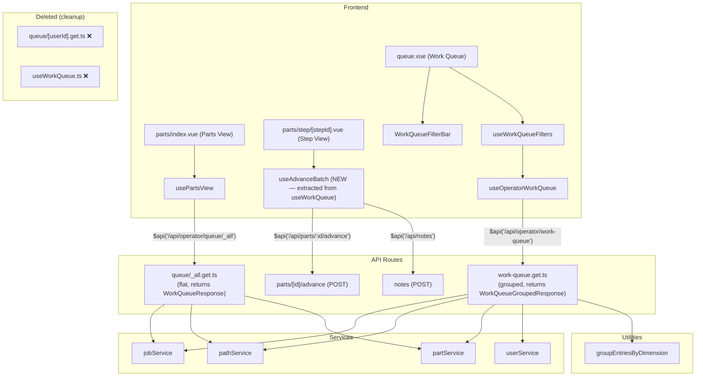
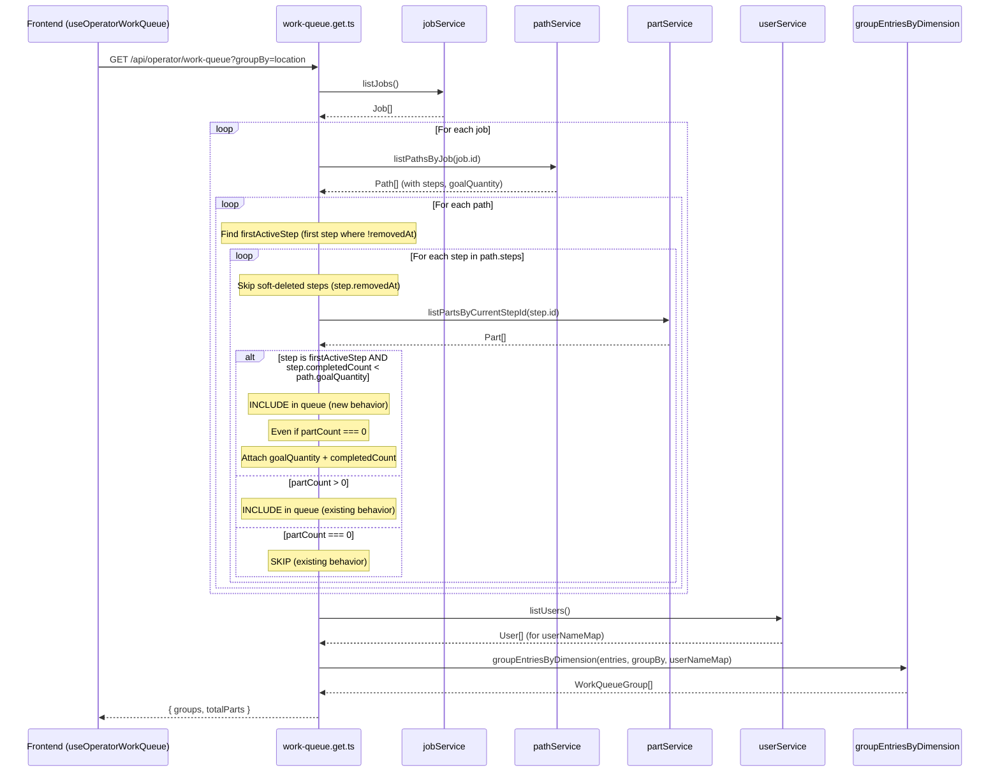

# Design Document: Work Queue Shows First Step + Queue Cleanup

## Overview

This design addresses **GitHub Issue #123** — "Feature Request: Work Queue Shows First Step" — and includes a cleanup of dead/duplicated work queue code discovered during analysis.

### Feature: First-Step Visibility

Currently, the work queue only displays steps that have parts physically present (i.e., `listPartsByCurrentStepId(stepId)` returns a non-empty list). The sole exception is the `_all` queue endpoint, which already includes step 0 even with zero parts via `if (parts.length === 0 && step.order !== 0) continue`. However, the main grouped work queue endpoint (`/api/operator/work-queue`) skips steps with zero parts entirely via `if (parts.length === 0) continue`.

The problem: when a job/path is created but no parts have been fabricated yet, the job is invisible in the work queue. Operators have no visibility on jobs that need initial part creation. The feature request asks that the **first active step** (the first non-soft-deleted step in a path) always appear in the work queue until enough parts have been completed through that step to meet the path's `goalQuantity`. This gives operators a clear signal that fabrication work needs to begin or continue.

### Cleanup: Dead Queue Code

During analysis, we discovered that the per-user queue endpoint (`GET /api/operator/queue/[userId]`) and its associated composable (`useWorkQueue.ts`) are dead code left over from the pre-redesign operator view. The `[userId]` endpoint is never called by any frontend page. The `useWorkQueue` composable's `fetchQueue()` function is never invoked — only `advanceBatch()` is used (by the Step View page), and `advanceBatch` doesn't touch the queue endpoint at all.

This cleanup removes the dead endpoint and composable, migrates `advanceBatch` to a standalone composable, and consolidates duplicated aggregation logic in property tests.

### Key Concepts

- **"First active step"**: The first step in `path.steps` where `!step.removedAt`. This is typically `step.order === 0`, but if step 0 has been soft-deleted, the next non-removed step inherits the first-step treatment.
- **"Done" metric**: `step.completedCount` — a write-time counter incremented each time a part advances past a step. This counts parts that have been fabricated and moved on, not parts currently sitting at the step.
- **Disappearance condition**: The first step stops receiving special treatment once `step.completedCount >= path.goalQuantity`. At that point, it follows the normal inclusion rule (show only if it has parts currently present).

### Why `completedCount` and not `parts.length`?

`listPartsByCurrentStepId(step.id)` returns parts whose `currentStepId` equals the step — i.e., parts currently sitting at that step waiting to be worked. This is the wrong metric for the disappearance threshold because:

1. When parts are created via `batchCreateParts`, they start at the first step (`currentStepId = path.steps[0].id`). If 10 parts are created and all 10 are sitting at step 0, `parts.length = 10` — but none have been fabricated yet.
2. Once a part advances past step 0, `completedCount` on step 0 is incremented and the part's `currentStepId` changes to the next step. `parts.length` at step 0 decreases.
3. The user's intent: "once that hardware has been completed (such that the number of done is greater than or equal to the goal amount for that pathway) we no longer need to show that first step." This maps directly to `step.completedCount >= path.goalQuantity`.

## Architecture

### Feature Changes

The first-step feature is confined to the work queue data assembly layer — the two remaining API routes that build `WorkQueueJob` entries. No new tables, services, or repositories are needed. The `WorkQueueJob` type gains two optional fields (`goalQuantity` and `completedCount`) so the frontend can display progress context on first-step entries.

### Cleanup Changes

The cleanup removes one API route, one composable, one content doc, and consolidates test logic. A new focused composable (`useAdvanceBatch`) is extracted from the dead `useWorkQueue`.

### Endpoint Inventory (After Cleanup)

| Endpoint | File | Response Type | Consumer | Purpose | Status |
|----------|------|---------------|----------|---------|--------|
| `GET /api/operator/work-queue` | `server/api/operator/work-queue.get.ts` | `WorkQueueGroupedResponse` | `queue.vue` via `useWorkQueueFilters` → `useOperatorWorkQueue` | Primary work queue page. Groups work by user/location/step. | KEEP — add first-step logic |
| `GET /api/operator/queue/_all` | `server/api/operator/queue/_all.get.ts` | `WorkQueueResponse` | `parts/index.vue` via `usePartsView` | Parts View page. Flat list of all active work, ungrouped. | KEEP — update first-step logic |
| `GET /api/operator/queue/[userId]` | `server/api/operator/queue/[userId].get.ts` | `WorkQueueResponse` | None (dead code) | Was: per-operator flat list. `fetchQueue()` in `useWorkQueue` is never called. | **DELETE** |



## Sequence Diagram: Work Queue Entry Assembly



## Cleanup: Full Impact Analysis

### Files to Delete

| File | Reason |
|------|--------|
| `server/api/operator/queue/[userId].get.ts` | Dead endpoint — never called by any frontend page or composable |
| `app/composables/useWorkQueue.ts` | Dead composable — `fetchQueue()` never called; `advanceBatch()` migrated to `useAdvanceBatch` |
| `content/api-docs/operator/queue-user.md` | API docs for the deleted endpoint |

### Files to Create

| File | Purpose |
|------|---------|
| `app/composables/useAdvanceBatch.ts` | Extracted from `useWorkQueue.ts` — contains only the `advanceBatch()` function used by Step View |

### Files to Modify

| File | Change | Reason |
|------|--------|--------|
| `server/api/operator/work-queue.get.ts` | Add first-active-step inclusion logic, soft-delete filtering, `goalQuantity`/`completedCount` fields | Feature: first-step visibility |
| `server/api/operator/queue/_all.get.ts` | Replace hardcoded `step.order !== 0` with first-active-step predicate using `completedCount`, add soft-delete filtering, add `goalQuantity`/`completedCount` fields | Feature: first-step visibility + tighten existing behavior |
| `server/types/computed.ts` | Add `goalQuantity?: number` and `completedCount?: number` to `WorkQueueJob`; remove `operatorId` from `WorkQueueResponse` | Feature: type change + cleanup: dead field removal |
| `app/pages/parts/step/[stepId].vue` | Change `useWorkQueue().advanceBatch` → `useAdvanceBatch().advanceBatch` | Cleanup: composable migration |
| `app/pages/queue.vue` | Add first-step progress display (`completedCount / goalQuantity`) | Feature: frontend display |
| `app/components/WorkQueueList.vue` | Add first-step progress display for Parts View | Feature: frontend display |
| `app/types/computed.ts` | Remove `WorkQueueResponse` re-export if no longer needed, or keep if `usePartsView` still uses it | Cleanup: evaluate after deletion |
| `content/api-docs/operator/queue-all.md` | Update docs for new first-step behavior, remove reference to user queue endpoint | Feature + cleanup |
| `content/api-docs/operator/work-queue.md` | Update docs for new first-step behavior, remove reference to user queue endpoint | Feature + cleanup |
| `content/api-docs/operator/index.md` | Remove "User queue" entry from endpoint table, update descriptions | Cleanup |
| `tests/properties/workQueueAggregation.property.test.ts` | Update replicated logic to match `_all` endpoint (not deleted `[userId]`), add first-step inclusion logic | Cleanup + feature |
| `tests/properties/allWorkEndpoint.property.test.ts` | Update replicated logic to include first-step behavior (currently missing the step-0 inclusion that the actual `_all` endpoint has) | Feature: test alignment |
| `tests/properties/assigneeGrouping.property.test.ts` | Update replicated logic to include soft-delete filtering and first-step behavior | Feature: test alignment |

### Type Impact: `WorkQueueResponse`

The `WorkQueueResponse` type is still needed — it's used by:
- `server/api/operator/queue/_all.get.ts` (kept)
- `app/composables/usePartsView.ts` (kept)
- `app/types/computed.ts` re-export (kept)
- `tests/properties/totalPartsInvariant.property.test.ts` (kept)
- `tests/properties/workQueueAggregation.property.test.ts` (updated)

The `operatorId` field is removed from `WorkQueueResponse`. After deleting the `[userId]` endpoint, it was always `"_all"` and carried no information. The `_all` endpoint response becomes `{ jobs: WorkQueueJob[], totalParts: number }`. All property tests and integration tests that construct or assert on `WorkQueueResponse` are updated to remove `operatorId`. The frontend consumer (`usePartsView`) does not read `operatorId` — no frontend changes needed for this removal.

## Components and Interfaces

### Modified Type: WorkQueueJob

The `WorkQueueJob` interface in `server/types/computed.ts` gains two new optional fields. Current actual type in codebase (before this change):

```typescript
export interface WorkQueueJob {
  jobId: string
  jobName: string
  pathId: string
  pathName: string
  stepId: string
  stepName: string
  stepOrder: number
  stepLocation?: string
  totalSteps: number
  partIds: readonly string[]
  partCount: number
  previousStepId?: string
  previousStepName?: string
  nextStepId?: string
  nextStepName?: string
  nextStepLocation?: string
  isFinalStep: boolean
  stepOptional?: boolean
  assignedTo?: string
  jobPriority: number
}
```

After this change, two fields are added:

```typescript
export interface WorkQueueJob {
  // ... all existing fields unchanged ...

  // NEW: path goal quantity — set only on first-active-step entries
  goalQuantity?: number
  // NEW: parts that have completed (advanced past) this step — set only on first-active-step entries
  completedCount?: number
}
```

Note: The type definition includes `previousStepId`, `previousStepName`, `nextStepId`, and `stepOptional` fields, but the current route implementations do not populate all of them. The routes only set `nextStepName`, `nextStepLocation`, `assignedTo`, and `isFinalStep`. This is pre-existing and not affected by this change.

### New Composable: useAdvanceBatch

Extracted from the dead `useWorkQueue.ts`. Contains only the `advanceBatch()` function. The caller passes `availablePartCount` so the composable can perform client-side validation without owning any queue state.

```typescript
// app/composables/useAdvanceBatch.ts
export function useAdvanceBatch() {
  const $api = useAuthFetch()

  async function advanceBatch(params: {
    partIds: string[]
    jobId: string
    pathId: string
    stepId: string
    availablePartCount: number
    note?: string
  }): Promise<{ advanced: number }> {
    // Client-side guard: instant feedback before any API calls
    if (params.partIds.length > params.availablePartCount) {
      throw new Error(`Cannot advance ${params.partIds.length} parts — only ${params.availablePartCount} available`)
    }
    // ... same advance + note logic as current useWorkQueue.advanceBatch ...
  }

  return { advanceBatch }
}
```

The return type is `{ advanced: number }` — deliberately simpler than the old `useWorkQueue.advanceBatch` which returned `{ advanced: number, nextStepName?: string }`. The old composable looked up `nextStepName` from its internal queue state just to echo it back to the caller. Since the caller (`parts/step/[stepId].vue`) already has `job.value` with `isFinalStep` and `nextStepName`, the composable doesn't need to know about job metadata. The caller builds the toast destination itself:

```typescript
const dest = job.value.isFinalStep ? 'Completed' : (job.value.nextStepName ?? 'next step')
```

The Step View page (`parts/step/[stepId].vue`) changes its import from `useWorkQueue().advanceBatch` to `useAdvanceBatch().advanceBatch`, passes `job.value.partCount` as `availablePartCount`, and handles the `nextStepName` resolution locally in `handleAdvance`.

### Modified API Routes

Two routes need the first-step logic change (down from three — `[userId]` is deleted):

| Route | File | Response Type | Current First-Step Behavior | New Behavior |
|-------|------|---------------|----------------------------|--------------|
| `GET /api/operator/work-queue` | `server/api/operator/work-queue.get.ts` | `WorkQueueGroupedResponse` | Skips steps with 0 parts (`if (parts.length === 0) continue`) | Include first active step if `step.completedCount < path.goalQuantity`; skip soft-deleted steps |
| `GET /api/operator/queue/_all` | `server/api/operator/queue/_all.get.ts` | `WorkQueueResponse` | Includes step 0 unconditionally with 0 parts (`if (parts.length === 0 && step.order !== 0) continue`) | Tighten: include first active step only if `step.completedCount < path.goalQuantity`; skip soft-deleted steps |

### Unchanged Components

- `WorkQueueGroup`, `WorkQueueGroupedResponse`, `WorkQueueResponse` — no structural changes
- `groupEntriesByDimension()` in `server/utils/workQueueGrouping.ts` — operates on `WorkQueueJob[]`, transparent to new fields; sorts by `jobPriority` descending
- `useOperatorWorkQueue` composable — uses `const $api = useAuthFetch()` then calls `$api<T>(url)` for authenticated API requests, passes data through
- `useWorkQueueFilters` composable — wraps `useOperatorWorkQueue` with groupBy, client-side filtering, URL sync, and presets; filtering logic is field-agnostic
- `usePartsView` composable — calls `$api<WorkQueueResponse>('/api/operator/queue/_all')`, passes data through

## Data Models

No schema changes. The feature uses existing data:

| Entity | Field | Usage |
|--------|-------|-------|
| `Path` | `goalQuantity: number` | Threshold: first step included until `completedCount >= goalQuantity` |
| `Path` | `steps: readonly ProcessStep[]` | Steps array; first non-removed step gets first-step treatment |
| `ProcessStep` | `order: number` | 0-based position; used to identify step ordering |
| `ProcessStep` | `removedAt?: string` | Soft-delete timestamp; steps with `removedAt` set are skipped entirely |
| `ProcessStep` | `completedCount: number` | Write-time counter: incremented each time a part advances past this step. This is the "done" metric for the disappearance condition. |
| `Part` | `currentStepId: string \| null` | Used by `listPartsByCurrentStepId()` to count parts currently at a step |

## Key Functions with Formal Specifications

### Function: findFirstActiveStep()

```typescript
function findFirstActiveStep(steps: readonly ProcessStep[]): ProcessStep | undefined
```

**Preconditions:**
- `steps` is a valid array of `ProcessStep` objects, ordered by `order` ascending

**Postconditions:**
- Returns the first step in `steps` where `!step.removedAt`
- Returns `undefined` if all steps are soft-deleted (degenerate case)

### Function: shouldIncludeStep()

```typescript
function shouldIncludeStep(
  step: ProcessStep,
  partCount: number,
  isFirstActiveStep: boolean,
  pathGoalQuantity: number,
): boolean
```

**Preconditions:**
- `step` is a valid `ProcessStep` with `!step.removedAt` (soft-deleted steps are filtered before this function is called)
- `partCount >= 0`
- `pathGoalQuantity > 0` (enforced by `assertPositive` on path creation)

**Postconditions:**
- Returns `true` if `partCount > 0` (existing behavior — step has work in progress)
- Returns `true` if `isFirstActiveStep AND step.completedCount < pathGoalQuantity` (new behavior — first step still needs parts fabricated)
- Returns `false` otherwise (non-first step with no parts, or first step with goal met)

**Loop Invariants:** N/A (pure predicate, no loops)

### Function: buildWorkQueueEntry()

```typescript
function buildWorkQueueEntry(
  job: Job,
  path: Path,
  step: ProcessStep,
  parts: Part[],
  isFirstActiveStep: boolean,
): WorkQueueJob
```

**Preconditions:**
- `job`, `path`, `step` are valid domain objects
- `step` belongs to `path.steps` and `!step.removedAt`
- `parts` is the result of `listPartsByCurrentStepId(step.id)`

**Postconditions:**
- Returns a `WorkQueueJob` with all existing fields populated
- If `isFirstActiveStep`: `goalQuantity` is set to `path.goalQuantity` and `completedCount` is set to `step.completedCount`
- If `!isFirstActiveStep`: `goalQuantity` and `completedCount` are `undefined`
- `partCount === parts.length`
- `partIds` contains exactly the IDs from `parts`

## Algorithmic Pseudocode

### Finding the First Active Step

```pascal
ALGORITHM findFirstActiveStep(steps)
INPUT: steps: ProcessStep[] (ordered by step.order ascending)
OUTPUT: ProcessStep or NULL

BEGIN
  FOR EACH step IN steps DO
    IF step.removedAt IS NULL THEN
      RETURN step
    END IF
  END FOR
  RETURN NULL
END
```

### Work Queue Entry Assembly — Grouped Endpoint (work-queue.get.ts)

```pascal
ALGORITHM buildGroupedWorkQueue(jobs, pathService, partService, userService, groupBy)
INPUT: jobs: Job[], pathService, partService, userService, groupBy: GroupByDimension
OUTPUT: { groups: WorkQueueGroup[], totalParts: number }

BEGIN
  entries ← []

  FOR EACH job IN jobs DO
    paths ← pathService.listPathsByJob(job.id)

    FOR EACH path IN paths DO
      totalSteps ← LENGTH(path.steps)
      firstActiveStep ← findFirstActiveStep(path.steps)

      FOR EACH step IN path.steps DO
        IF step.removedAt IS NOT NULL THEN
          CONTINUE
        END IF

        parts ← partService.listPartsByCurrentStepId(step.id)
        partCount ← LENGTH(parts)

        isFirstActive ← (firstActiveStep IS NOT NULL AND step.id = firstActiveStep.id)
        isFirstStepBelowGoal ← (isFirstActive AND step.completedCount < path.goalQuantity)

        IF partCount = 0 AND NOT isFirstStepBelowGoal THEN
          CONTINUE
        END IF

        isFinalStep ← (step.order = totalSteps - 1)
        nextStep ← path.steps[step.order + 1] IF NOT isFinalStep ELSE NULL

        entry ← {
          assignedTo: step.assignedTo,
          job: {
            jobId: job.id,
            jobName: job.name,
            jobPriority: job.priority,
            pathId: path.id,
            pathName: path.name,
            stepId: step.id,
            stepName: step.name,
            stepOrder: step.order,
            stepLocation: step.location,
            totalSteps: totalSteps,
            partIds: MAP(parts, p → p.id),
            partCount: partCount,
            assignedTo: step.assignedTo,
            nextStepName: nextStep?.name,
            nextStepLocation: nextStep?.location,
            isFinalStep: isFinalStep,
            goalQuantity: path.goalQuantity IF isFirstActive ELSE UNDEFINED,
            completedCount: step.completedCount IF isFirstActive ELSE UNDEFINED
          }
        }

        APPEND entry TO entries
      END FOR
    END FOR
  END FOR

  users ← userService.listUsers()
  userNameMap ← MAP(users, u → (u.id, u.displayName))
  groups ← groupEntriesByDimension(entries, groupBy, userNameMap)
  totalParts ← SUM(entries, e → e.job.partCount)

  RETURN { groups, totalParts }
END
```

### Work Queue Entry Assembly — Flat Endpoint (_all.get.ts)

```pascal
ALGORITHM buildFlatWorkQueue(jobs, pathService, partService)
INPUT: jobs: Job[], pathService, partService
OUTPUT: WorkQueueResponse

BEGIN
  groupMap ← new Map()

  FOR EACH job IN jobs DO
    paths ← pathService.listPathsByJob(job.id)

    FOR EACH path IN paths DO
      totalSteps ← LENGTH(path.steps)
      firstActiveStep ← findFirstActiveStep(path.steps)

      FOR EACH step IN path.steps DO
        IF step.removedAt IS NOT NULL THEN
          CONTINUE
        END IF

        parts ← partService.listPartsByCurrentStepId(step.id)
        partCount ← LENGTH(parts)

        isFirstActive ← (firstActiveStep IS NOT NULL AND step.id = firstActiveStep.id)
        isFirstStepBelowGoal ← (isFirstActive AND step.completedCount < path.goalQuantity)

        IF partCount = 0 AND NOT isFirstStepBelowGoal THEN
          CONTINUE
        END IF

        key ← CONCAT(job.id, "|", path.id, "|", step.order)
        isFinalStep ← (step.order = totalSteps - 1)
        nextStep ← path.steps[step.order + 1] IF NOT isFinalStep ELSE NULL

        groupMap.SET(key, {
          jobId: job.id,
          jobName: job.name,
          pathId: path.id,
          pathName: path.name,
          stepId: step.id,
          stepName: step.name,
          stepOrder: step.order,
          stepLocation: step.location,
          totalSteps: totalSteps,
          partIds: MAP(parts, p → p.id),
          partCount: partCount,
          assignedTo: step.assignedTo,
          nextStepName: nextStep?.name,
          nextStepLocation: nextStep?.location,
          isFinalStep: isFinalStep,
          jobPriority: job.priority,
          goalQuantity: path.goalQuantity IF isFirstActive ELSE UNDEFINED,
          completedCount: step.completedCount IF isFirstActive ELSE UNDEFINED
        })
      END FOR
    END FOR
  END FOR

  queueJobs ← VALUES(groupMap)
  totalParts ← SUM(queueJobs, j → j.partCount)

  RETURN { jobs: queueJobs, totalParts }
END
```

### First-Step Inclusion Predicate

```pascal
ALGORITHM shouldIncludeStep(step, partCount, isFirstActiveStep, pathGoalQuantity)
INPUT: step: ProcessStep, partCount: Integer, isFirstActiveStep: Boolean, pathGoalQuantity: Integer
OUTPUT: include: Boolean

BEGIN
  IF partCount > 0 THEN
    RETURN TRUE
  END IF

  IF isFirstActiveStep AND step.completedCount < pathGoalQuantity THEN
    RETURN TRUE
  END IF

  RETURN FALSE
END
```

**Preconditions:**
- `partCount >= 0`
- `pathGoalQuantity > 0`
- `step.completedCount >= 0`
- `step.removedAt` is null (caller filters soft-deleted steps before invoking)

**Postconditions:**
- `TRUE` iff step has parts OR is first active step with `completedCount < goalQuantity`
- When `step.completedCount >= pathGoalQuantity` and step is first active: returns `FALSE` (goal met, step disappears)
- Backward compatible: non-first steps with 0 parts still excluded

## Example Usage

```typescript
// ---- Helper: find first active step ----
function findFirstActiveStep(steps: readonly ProcessStep[]): ProcessStep | undefined {
  return steps.find(s => !s.removedAt)
}

// ---- work-queue.get.ts (grouped endpoint) ----
// Before:
const parts = partService.listPartsByCurrentStepId(step.id)
if (parts.length === 0) continue

// After:
if (step.removedAt) continue
const parts = partService.listPartsByCurrentStepId(step.id)
const isFirstActive = firstActiveStep != null && step.id === firstActiveStep.id
const isFirstStepBelowGoal = isFirstActive && step.completedCount < path.goalQuantity
if (parts.length === 0 && !isFirstStepBelowGoal) continue

// Add goalQuantity + completedCount to the entry for first-active-step entries:
entries.push({
  assignedTo: step.assignedTo,
  job: {
    // ... existing fields ...
    ...(isFirstActive && { goalQuantity: path.goalQuantity, completedCount: step.completedCount }),
  },
})

// ---- _all.get.ts (flat endpoint) ----
// Before:
if (parts.length === 0 && step.order !== 0) continue

// After:
if (step.removedAt) continue
const parts = partService.listPartsByCurrentStepId(step.id)
const isFirstActive = firstActiveStep != null && step.id === firstActiveStep.id
const isFirstStepBelowGoal = isFirstActive && step.completedCount < path.goalQuantity
if (parts.length === 0 && !isFirstStepBelowGoal) continue
```

## Frontend Display

When a first-active-step entry appears in the work queue with `goalQuantity` and `completedCount` set, the frontend should display progress context so operators know how many parts they're aiming to make.

In `queue.vue` and `WorkQueueList`, the step entry badge area should show:
- Normal steps: `{{ job.partCount }}` (existing behavior — count of parts at this step)
- First-active-step entries: the part count badge as usual, PLUS additional progress text `{{ job.completedCount }} / {{ job.goalQuantity }} completed` — shows how many parts have been fabricated and advanced past this step vs. the goal. Both the part count badge and the progress text are visible simultaneously.

This applies to both the Work Queue page (`queue.vue`) and the Parts View page (`parts/index.vue` via `WorkQueueList`). The display logic is:

```typescript
// In the template, detect first-step entries by the presence of goalQuantity
const isFirstStepEntry = computed(() => job.goalQuantity != null)
```

## Correctness Properties

### Feature Properties

1. **First-Step Visibility (CP-WQ-FS1):** For all paths where the first active step has `completedCount < path.goalQuantity`, that step MUST appear in the work queue response, even when `partCount === 0` (no parts currently at the step).

2. **First-Step Disappearance (CP-WQ-FS2):** For all paths where the first active step has `completedCount >= path.goalQuantity`, that step MUST NOT appear in the work queue unless it has parts currently present (standard inclusion rule).

3. **Backward Compatibility (CP-WQ-FS3):** For all non-first-active steps, the inclusion rule is unchanged: include if and only if `partCount > 0`.

4. **Goal Quantity Propagation (CP-WQ-FS4):** For all `WorkQueueJob` entries representing the first active step, `goalQuantity` MUST equal the parent path's `goalQuantity` and `completedCount` MUST equal the step's `completedCount`. For all other entries, both fields MUST be `undefined`.

5. **Consistency Across Endpoints (CP-WQ-FS5):** The `_all` and `work-queue` endpoints MUST produce identical first-step inclusion decisions for the same job/path/step data.

6. **Soft-Delete Respect (CP-WQ-FS6):** Soft-deleted steps (`removedAt` set) MUST be skipped entirely — they are never included in the work queue and never considered as the "first active step."

7. **First-Active-Step Correctness (CP-WQ-FS7):** The first active step is always the step with the lowest `order` value among non-soft-deleted steps in the path. If step 0 is soft-deleted, step 1 (or the next non-removed step) inherits the first-step treatment.

### Cleanup Properties

8. **advanceBatch Migration (CP-WQ-CL1):** After cleanup, `parts/step/[stepId].vue` MUST use `useAdvanceBatch().advanceBatch` with identical behavior to the previous `useWorkQueue().advanceBatch`. No functional change to advancement logic.

9. **No Dead Imports (CP-WQ-CL2):** After cleanup, no file in `app/` or `server/` MUST import from `useWorkQueue` or reference `GET /api/operator/queue/[userId]`.

10. **operatorId Removal (CP-WQ-CL3):** After cleanup, the `WorkQueueResponse` type MUST NOT contain an `operatorId` field. The `_all` endpoint response MUST contain only `jobs` and `totalParts`. No test or frontend code MUST reference `operatorId` on `WorkQueueResponse`.

11. **Test Alignment (CP-WQ-CL4):** All property tests that replicate work queue aggregation logic MUST match the actual endpoint behavior, including first-step inclusion and soft-delete filtering.

## Error Handling

### Edge Case: Path with No Steps

**Condition:** A path has an empty `steps` array (should not happen due to `assertNonEmptyArray` validation on creation).
**Response:** The inner loop simply doesn't execute. `findFirstActiveStep` returns `undefined`. No first-step entry is created.
**Recovery:** N/A — this is a data integrity issue handled at the service layer.

### Edge Case: All Steps Soft-Deleted

**Condition:** Every step in the path has `removedAt` set.
**Response:** `findFirstActiveStep` returns `undefined`. No steps are included (all are skipped by the `removedAt` check). The path is effectively invisible in the work queue.
**Recovery:** N/A — a path with all steps removed is a degenerate state.

### Edge Case: Soft-Deleted First Step

**Condition:** Step 0 has `removedAt` set (soft-deleted), but step 1 is active.
**Response:** `findFirstActiveStep` returns step 1. Step 1 gets the first-step treatment (shown when `completedCount < goalQuantity`, with `goalQuantity` and `completedCount` fields populated).

### Edge Case: Goal Quantity Already Met

**Condition:** First active step has `completedCount >= path.goalQuantity`.
**Response:** The first active step is treated like any other step — included only if it has parts currently present. The "always show first step" behavior stops once the goal is met.

### Edge Case: First Step is "Create and Advance"

**Condition:** The first step is a "create and advance" step where parts are created and immediately advanced. This means `partCount` at step 0 is typically 0 (parts pass through instantly), but `completedCount` increments with each batch.
**Response:** The first step remains visible (partCount = 0, but `completedCount < goalQuantity`) until enough parts have been created and advanced to meet the goal. This is the primary use case for this feature.

## Testing Strategy

### Unit Testing Approach

- Test `findFirstActiveStep` with: all active steps, first step soft-deleted, multiple soft-deleted steps, all soft-deleted
- Test `shouldIncludeStep` predicate with boundary values: completedCount = 0, completedCount = goalQuantity - 1, completedCount = goalQuantity, completedCount = goalQuantity + 1
- Test that non-first-active steps are never force-included
- Test that `goalQuantity` and `completedCount` fields are set only on first-active-step entries
- Test `useAdvanceBatch` produces identical results to the old `useWorkQueue.advanceBatch`

### Property-Based Testing Approach

**Property Test Library:** fast-check

- **CP-WQ-FS1:** Generate arbitrary jobs/paths/steps with random completedCounts. Assert that the first active step always appears when `completedCount < goalQuantity`.
- **CP-WQ-FS2:** Generate paths where the first active step has `completedCount >= goalQuantity` and `partCount = 0`. Assert the step does not appear.
- **CP-WQ-FS3:** Generate non-first-active steps with 0 parts. Assert they never appear in the queue.
- **CP-WQ-FS5:** Run the same input through both endpoint logic paths. Assert identical inclusion decisions.
- **CP-WQ-FS6:** Generate paths with soft-deleted steps. Assert soft-deleted steps never appear and the correct step inherits first-step treatment.
- **CP-WQ-FS7:** Generate paths where step 0 is soft-deleted. Assert the next non-removed step is treated as first active step.

### Property Tests to Update

| Test File | Current Behavior | Required Change |
|-----------|-----------------|-----------------|
| `tests/properties/workQueueAggregation.property.test.ts` | Replicates `[userId]` endpoint logic (`if (parts.length === 0) continue`) | Update to replicate `_all` endpoint logic with first-step inclusion and soft-delete filtering |
| `tests/properties/allWorkEndpoint.property.test.ts` | Replicates `_all` logic but uses `if (parts.length === 0) continue` (missing the step-0 inclusion the actual endpoint has) | Update to match actual `_all` behavior with first-step inclusion |
| `tests/properties/assigneeGrouping.property.test.ts` | Replicates queue logic without soft-delete filtering | Add soft-delete filtering and first-step inclusion |

### Integration Testing Approach

- Create a job with a path and 0 parts. Verify the first step appears in both queue endpoints with `goalQuantity` and `completedCount: 0`.
- Create parts at step 0 and advance them all past step 0 until `completedCount >= goalQuantity`. Verify the first step disappears from the queue (assuming no parts currently at step 0).
- Create parts at step 0 and advance `goalQuantity - 1` past it. Verify the first step still appears with correct `completedCount`.
- Soft-delete step 0, verify step 1 inherits first-step treatment.
- Verify `useAdvanceBatch` works correctly from the Step View page after migration.

## Performance Considerations

No performance impact. The change adds:
- One `findFirstActiveStep` call per path (linear scan of steps array, typically 2–10 elements)
- One `step.completedCount` comparison per first-active-step (already loaded as part of the step object)
- No additional DB queries — `completedCount` is on the `ProcessStep` object already loaded via `pathService.listPathsByJob()`

The cleanup reduces the number of API routes by one, which marginally reduces the server's route table size.

## Security Considerations

No security implications. The work queue API routes are already protected by JWT auth middleware (`server/middleware/02.auth.ts`) and rate limiting (`server/middleware/01.rateLimit.ts`). The frontend uses `const $api = useAuthFetch()` for all API calls, which injects the JWT Bearer token automatically. The `goalQuantity` and `completedCount` fields are not sensitive — they expose the same path/step metadata already visible in job/path views.

Removing the `[userId]` endpoint eliminates a route that accepted arbitrary user IDs without validation (it didn't verify the userId existed or that the caller had permission to view that user's queue). While the route was protected by JWT auth, removing it reduces the attack surface.

## Dependencies

No new dependencies. The feature uses existing:
- `Path.goalQuantity` (already on the domain type)
- `ProcessStep.order` (already used for step ordering)
- `ProcessStep.removedAt` (already on the domain type, used for soft-delete)
- `ProcessStep.completedCount` (already on the domain type, incremented by `partService.advancePart()`)
- `partService.listPartsByCurrentStepId()` (already called in the loop)

The cleanup removes dependencies on:
- `server/api/operator/queue/[userId].get.ts` (deleted)
- `app/composables/useWorkQueue.ts` (deleted, `advanceBatch` extracted)
- `content/api-docs/operator/queue-user.md` (deleted)
