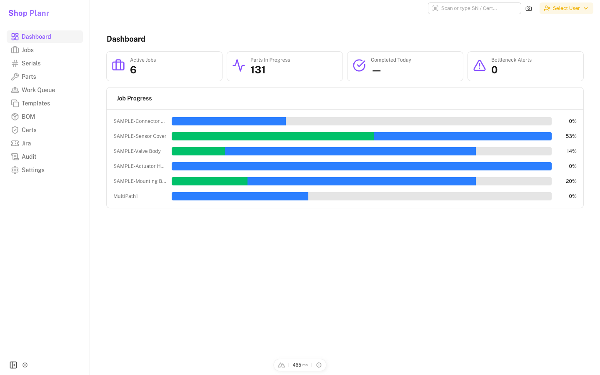
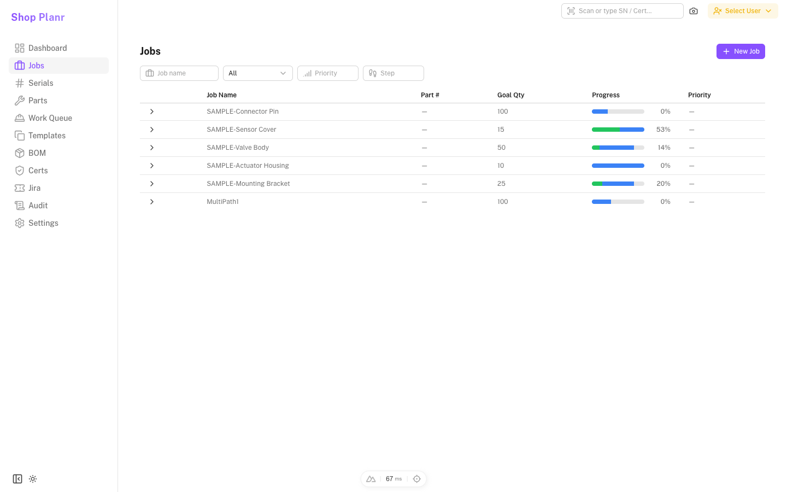
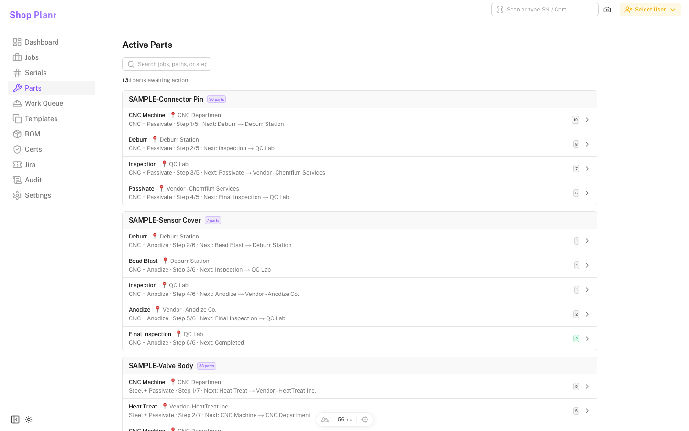
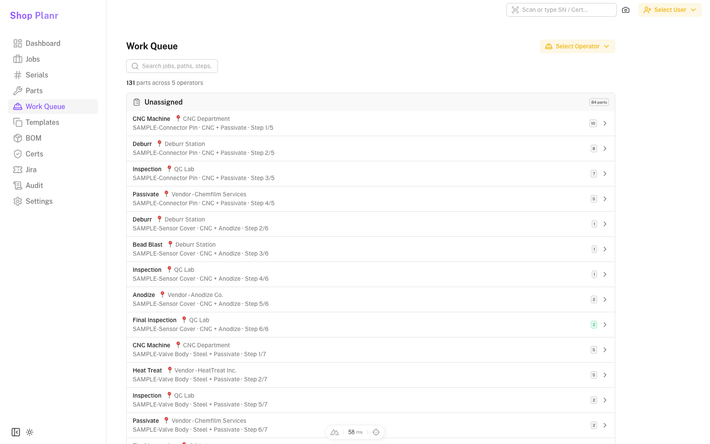
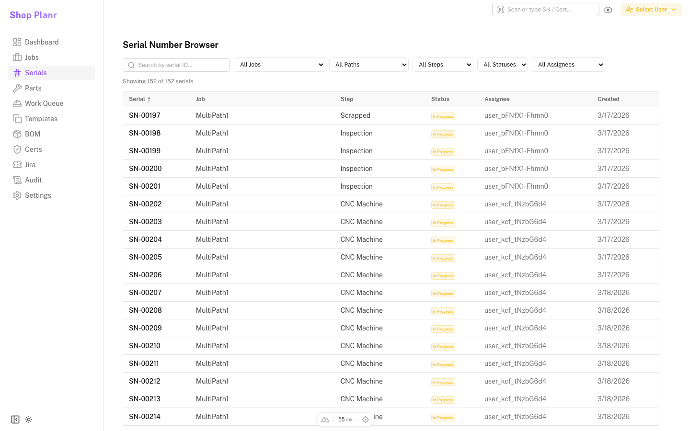
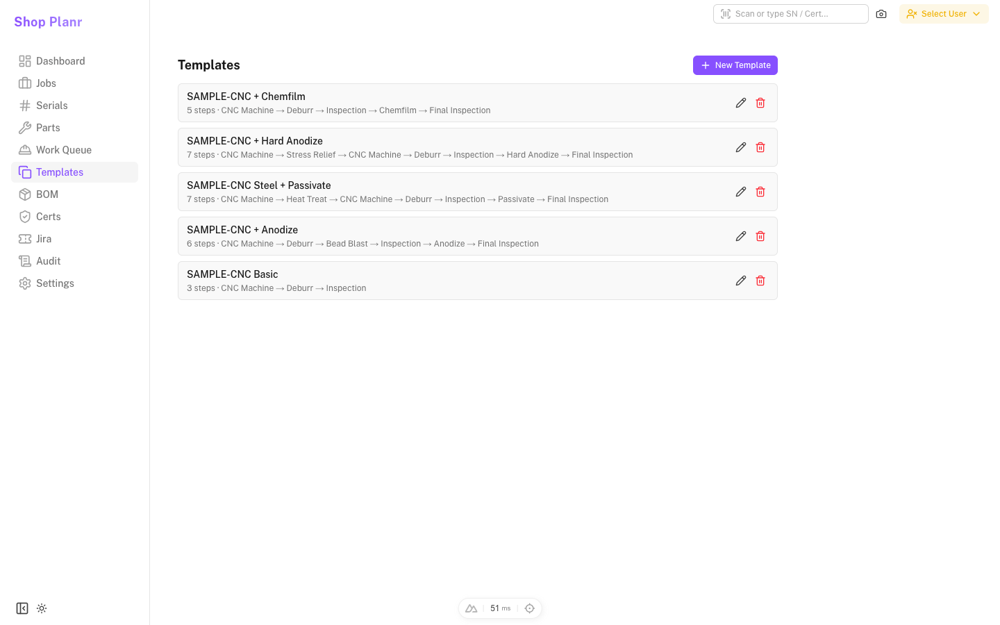
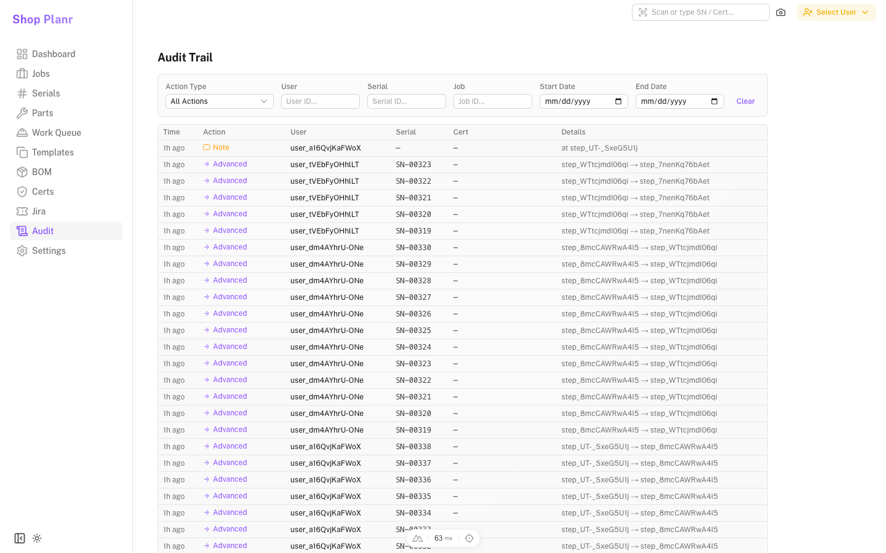
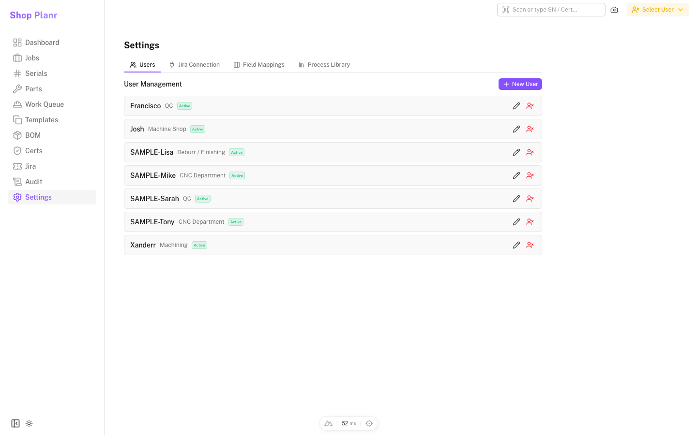

# Shop Planr

Workshop planning and ERP built with [Nuxt 4](https://nuxt.com) and [NuxtUI 4](https://ui.nuxt.com).

## Screenshots

| | |
|---|---|
|  |  |
| Dashboard — summary cards, job progress, bottleneck alerts | Jobs — expandable table with paths and steps |
|  |  |
| Parts View — active parts grouped by job/step | Work Queue — grouped by operator/assignee |
|  |  |
| Serial Numbers — searchable/filterable list | Templates — reusable route template CRUD |
|  |  |
| Audit Trail — filterable event log | Settings — users, Jira, libraries |

## Setup

```bash
npm install
```

## Development

```bash
npm run dev
```

## Seed Data

```bash
npm run seed          # Idempotent sample data
npm run seed:reset    # Delete + re-seed
```

## Regenerate Screenshots

Start the dev server, then run the screenshot script:

```bash
npm run dev
# In another terminal:
npm run screenshots
```

By default it connects to `http://localhost:3000`. Override with `BASE_URL`:

```bash
BASE_URL=http://localhost:3001 npm run screenshots
```

## Production

```bash
npm run build
docker build -t shop-erp .
docker-compose up -d
```
